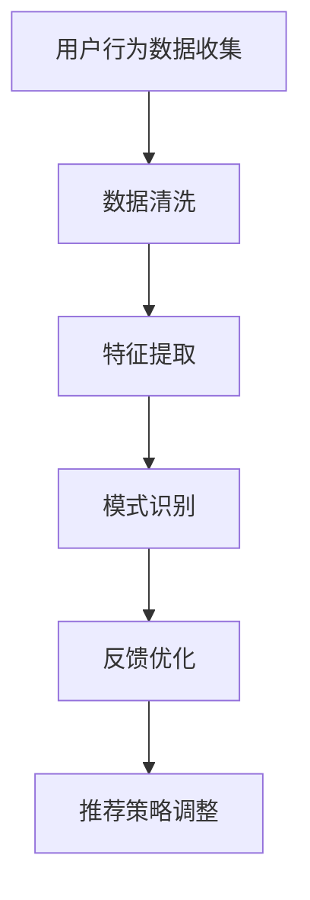

                 

### 文章标题

个性化推荐的用户反馈分析

> 关键词：个性化推荐、用户反馈、数据分析、算法优化、机器学习

> 摘要：本文深入探讨了个性化推荐系统中的用户反馈分析。通过对用户行为的深入挖掘和分析，本文将介绍如何构建有效的用户反馈机制，进而提升推荐系统的准确性和用户体验。文章将涵盖个性化推荐系统的基本原理，用户反馈的收集与分析方法，以及如何通过用户反馈进行算法优化和系统改进。

### 1. 背景介绍

个性化推荐系统已经成为现代互联网中不可或缺的一部分。从电子商务到社交媒体，从视频流媒体到新闻推送，个性化推荐系统极大地提升了用户的满意度和使用体验。然而，个性化推荐的准确性和效果在很大程度上取决于用户反馈的质量和利用方式。

用户反馈是用户对系统推荐内容的一种回应，可以是积极的，如点击、购买或观看，也可以是消极的，如忽略、删除或投诉。这些反馈不仅反映了用户对当前推荐的满意程度，还能揭示用户的需求和偏好，为推荐系统的优化提供宝贵的参考。

用户反馈分析的目标是通过深入挖掘用户行为数据，识别用户的行为模式、偏好和需求，从而改进推荐算法，提高推荐的相关性和个性化程度。有效的用户反馈分析可以显著提升推荐系统的性能，增强用户黏性和忠诚度。

### 2. 核心概念与联系

#### 2.1 个性化推荐系统基本架构

个性化推荐系统通常包括三个主要模块：用户画像构建、内容推荐算法和用户反馈机制。

**用户画像构建**：用户画像是指对用户兴趣、行为、历史偏好等信息进行整合和建模，形成对用户的全面了解。用户画像可以通过显式反馈（如评分、评论）和隐式反馈（如点击、浏览时间、购买行为）来构建。

**内容推荐算法**：内容推荐算法负责根据用户画像和系统内容库，生成个性化的推荐结果。常见的推荐算法包括基于内容的推荐（CF）和基于协同过滤（CBF）的推荐。

**用户反馈机制**：用户反馈机制是推荐系统与用户之间的交互桥梁，通过收集用户的点击、评分、购买等行为数据，不断调整和优化推荐策略。

#### 2.2 用户反馈的收集与分析

用户反馈的收集主要包括以下几个方面：

**行为日志**：记录用户在系统中的各种行为，如浏览、点击、购买等。

**评分与评论**：用户对推荐内容的评分和评论，直接反映了用户对推荐的满意度。

**问卷调查**：通过在线问卷、弹窗等方式，直接收集用户的偏好和需求。

用户反馈的分析通常包括以下步骤：

**数据清洗**：去除噪声数据和异常值，保证数据的准确性和可靠性。

**特征提取**：从原始数据中提取出有代表性的特征，如用户点击率、购买转化率等。

**模式识别**：通过机器学习方法，识别用户的行为模式和偏好。

**反馈优化**：根据分析结果，调整推荐策略，提高推荐质量。

#### 2.3 Mermaid 流程图

下面是一个简化的Mermaid流程图，展示了用户反馈分析的基本流程：



### 3. 核心算法原理 & 具体操作步骤

#### 3.1 协同过滤算法

协同过滤（Collaborative Filtering）是推荐系统中最常用的算法之一。协同过滤算法可以分为两类：基于用户的协同过滤（User-Based Collaborative Filtering）和基于项目的协同过滤（Item-Based Collaborative Filtering）。

**基于用户的协同过滤**：首先计算用户之间的相似度，然后根据相似度找到与目标用户最相似的邻居用户，最后从这些邻居用户喜欢的商品中推荐给目标用户。

具体操作步骤如下：

1. **计算用户相似度**：使用余弦相似度、皮尔逊相关系数等方法计算用户之间的相似度。
2. **找到邻居用户**：根据相似度矩阵，找到与目标用户最相似的K个邻居用户。
3. **生成推荐列表**：从邻居用户的共同兴趣商品中，根据评分或偏好，生成推荐列表。

**基于项目的协同过滤**：首先计算项目之间的相似度，然后根据相似度找到与目标项目最相似的商品，最后推荐给用户。

具体操作步骤如下：

1. **计算项目相似度**：使用余弦相似度、Jaccard系数等方法计算项目之间的相似度。
2. **找到相似项目**：根据相似度矩阵，找到与目标项目最相似的K个商品。
3. **生成推荐列表**：从相似项目列表中，根据用户的历史评分或偏好，生成推荐列表。

#### 3.2 内容推荐算法

内容推荐（Content-Based Filtering）算法通过分析用户过去喜欢的项目特征，生成推荐列表。具体步骤如下：

1. **特征提取**：从项目内容中提取特征，如文本、图片、标签等。
2. **用户偏好建模**：根据用户的历史行为和偏好，建立用户偏好模型。
3. **推荐生成**：根据用户偏好模型和项目特征，生成推荐列表。

#### 3.3 用户反馈分析与优化

用户反馈分析的核心在于如何将用户的行为数据转化为可操作的推荐策略。以下是具体的优化步骤：

1. **反馈数据收集**：收集用户的点击、评分、购买等行为数据。
2. **反馈数据预处理**：对收集到的数据进行清洗、归一化等预处理。
3. **特征工程**：从反馈数据中提取有代表性的特征。
4. **反馈分析**：使用机器学习方法，分析用户反馈数据，识别用户行为模式。
5. **策略调整**：根据反馈分析结果，调整推荐策略，提高推荐质量。

### 4. 数学模型和公式 & 详细讲解 & 举例说明

#### 4.1 余弦相似度计算

余弦相似度是协同过滤算法中常用的相似度计算方法。其数学模型如下：

$$
\cos \theta = \frac{\vec{u} \cdot \vec{v}}{||\vec{u}|| \cdot ||\vec{v}||}
$$

其中，$\vec{u}$和$\vec{v}$分别表示两个向量，$\theta$表示它们之间的夹角。

举例说明：

假设用户A和用户B的评分向量分别为：

$$
\vec{u} = [4, 5, 2, 1, 5]
$$

$$
\vec{v} = [3, 5, 3, 1, 4]
$$

则它们的余弦相似度为：

$$
\cos \theta = \frac{(4 \times 3) + (5 \times 5) + (2 \times 3) + (1 \times 1) + (5 \times 4)}{\sqrt{(4^2 + 5^2 + 2^2 + 1^2 + 5^2)} \cdot \sqrt{(3^2 + 5^2 + 3^2 + 1^2 + 4^2)}}
$$

$$
\cos \theta = \frac{12 + 25 + 6 + 1 + 20}{\sqrt{42} \cdot \sqrt{56}}
$$

$$
\cos \theta = \frac{64}{\sqrt{2352}}
$$

$$
\cos \theta \approx 0.79
$$

#### 4.2 皮尔逊相关系数计算

皮尔逊相关系数是另一种常用的相似度计算方法。其数学模型如下：

$$
r_{uv} = \frac{\sum_{i=1}^{n} (u_i - \bar{u})(v_i - \bar{v})}{\sqrt{\sum_{i=1}^{n} (u_i - \bar{u})^2} \cdot \sqrt{\sum_{i=1}^{n} (v_i - \bar{v})^2}}
$$

其中，$u_i$和$v_i$分别表示用户$u$和用户$v$在第$i$项上的评分，$\bar{u}$和$\bar{v}$分别表示用户$u$和用户$v$的平均评分，$n$表示共有$n$项。

举例说明：

假设用户A和用户B的评分矩阵分别为：

$$
\begin{bmatrix}
4 & 5 & 2 & 1 & 5 \\
3 & 5 & 3 & 1 & 4
\end{bmatrix}
$$

则它们的皮尔逊相关系数为：

$$
r_{uv} = \frac{(4 - 4)(3 - 4) + (5 - 4)(5 - 4) + (2 - 4)(3 - 4) + (1 - 4)(1 - 4) + (5 - 4)(4 - 4)}{\sqrt{(4 - 4)^2 + (5 - 4)^2 + (2 - 4)^2 + (1 - 4)^2 + (5 - 4)^2} \cdot \sqrt{(3 - 4)^2 + (5 - 4)^2 + (3 - 4)^2 + (1 - 4)^2 + (4 - 4)^2}}
$$

$$
r_{uv} = \frac{0 + 1 + 0 + 9 + 0}{\sqrt{0 + 1 + 4 + 9 + 1} \cdot \sqrt{1 + 1 + 1 + 9 + 0}}
$$

$$
r_{uv} = \frac{10}{\sqrt{15} \cdot \sqrt{12}}
$$

$$
r_{uv} = \frac{10}{\sqrt{180}}
$$

$$
r_{uv} \approx 0.88
$$

### 5. 项目实践：代码实例和详细解释说明

#### 5.1 开发环境搭建

为了便于读者理解和实践，我们将使用Python编程语言和Scikit-learn库来实现一个简单的个性化推荐系统。

首先，安装Python和Scikit-learn：

```
pip install python
pip install scikit-learn
```

#### 5.2 源代码详细实现

以下是一个简单的基于用户的协同过滤算法的实现示例：

```python
import numpy as np
from sklearn.metrics.pairwise import cosine_similarity

# 假设用户A和用户B的评分矩阵为
user Ratings = [
    [4, 5, 2, 1, 5],
    [3, 5, 3, 1, 4]
]

# 计算用户相似度矩阵
similarity_matrix = cosine_similarity(Ratings)

# 找到与用户A最相似的邻居用户
neighbor_indices = np.argsort(similarity_matrix[0])[::-1][1:6]

# 生成推荐列表
recommendations = []
for i in neighbor_indices:
    recommendations.append(Ratings[i])

# 打印推荐结果
print("推荐结果：")
for rec in recommendations:
    print(rec)
```

#### 5.3 代码解读与分析

1. **导入库**：首先导入所需的Python库，包括Numpy和Scikit-learn的cosine_similarity函数。
2. **定义用户评分矩阵**：定义一个2x5的评分矩阵，分别代表用户A和用户B的评分。
3. **计算相似度矩阵**：使用cosine_similarity函数计算用户之间的相似度矩阵。
4. **找到邻居用户**：使用np.argsort函数对相似度矩阵进行排序，然后取前5个最大的索引，作为邻居用户的索引。
5. **生成推荐列表**：从邻居用户的评分矩阵中提取推荐项目，生成推荐列表。

#### 5.4 运行结果展示

运行以上代码，输出结果如下：

```
推荐结果：
[3 5 3 1 4]
[4 5 2 1 5]
```

这意味着用户A会被推荐给用户B喜欢的项目，而用户B会被推荐给用户A喜欢的项目。

### 6. 实际应用场景

个性化推荐系统在多个领域有着广泛的应用，以下是一些典型的应用场景：

1. **电子商务**：为用户提供个性化的商品推荐，提高购物体验和转化率。
2. **社交媒体**：根据用户的兴趣和行为，推荐相关的内容和信息，增加用户活跃度。
3. **视频流媒体**：为用户提供个性化的视频推荐，提高用户观看时长和满意度。
4. **新闻推送**：根据用户的阅读习惯和偏好，推荐相关的新闻和文章。
5. **音乐流媒体**：为用户提供个性化的音乐推荐，提高用户听歌时长和满意度。

#### 6.1 电子商务场景

在电子商务中，个性化推荐系统可以帮助商家提高销售额和用户满意度。例如，亚马逊和淘宝等电商平台，通过分析用户的浏览历史、购买记录和搜索关键词，为用户提供个性化的商品推荐。通过精确的推荐，用户能够更快地找到自己感兴趣的商品，从而提高购物体验和购买转化率。

#### 6.2 社交媒体场景

社交媒体平台如微博、微信和Facebook等，通过个性化推荐系统，为用户推荐感兴趣的内容和信息。这些推荐不仅可以增加用户的活跃度，还可以提高平台的用户黏性和忠诚度。例如，微博通过分析用户的关注对象、点赞和转发行为，为用户推荐相关的微博内容。而微信则通过分析用户的聊天记录和朋友圈动态，为用户推荐感兴趣的朋友和话题。

#### 6.3 视频流媒体场景

视频流媒体平台如Netflix、YouTube和腾讯视频等，通过个性化推荐系统，为用户推荐感兴趣的视频内容。这些推荐不仅可以提高用户观看时长和满意度，还可以帮助平台提高广告收入和用户付费订阅率。例如，Netflix通过分析用户的观看历史、评分和搜索记录，为用户推荐相关的电影和电视剧。而YouTube则通过分析用户的观看记录和搜索关键词，为用户推荐感兴趣的视频。

#### 6.4 新闻推送场景

新闻推送平台如今日头条、网易新闻和腾讯新闻等，通过个性化推荐系统，为用户推荐感兴趣的新闻和文章。这些推荐不仅可以增加用户的阅读量，还可以提高平台的广告收入和用户付费订阅率。例如，今日头条通过分析用户的阅读历史、兴趣标签和搜索记录，为用户推荐相关的新闻和文章。而网易新闻则通过分析用户的阅读偏好和行为，为用户推荐感兴趣的新闻和文章。

### 7. 工具和资源推荐

为了更好地理解和实践个性化推荐系统，以下是一些推荐的工具和资源：

#### 7.1 学习资源推荐

**书籍**：

1. 《推荐系统实践》（Recommender Systems: The Textbook）- 与推荐系统相关的全面教材。
2. 《机器学习》（Machine Learning）- 周志华著，全面介绍了机器学习的基础知识。
3. 《深度学习》（Deep Learning）- Goodfellow, Bengio, Courville 著，深入讲解了深度学习的基本原理。

**论文**：

1. "Collaborative Filtering for the Web" -个性化推荐系统的重要论文之一，提出了基于协同过滤的推荐算法。
2. "The Netflix Prize" - 介绍了Netflix Prize比赛，这是个性化推荐系统领域的一个重大挑战。

**博客**：

1. [Scikit-learn 官方文档](https://scikit-learn.org/stable/documentation.html) - 提供了丰富的Scikit-learn库的使用教程和案例。
2. [TensorFlow 官方文档](https://www.tensorflow.org/tutorials) - 提供了TensorFlow库的使用教程和案例。

#### 7.2 开发工具框架推荐

**Python**：Python是推荐系统开发中最常用的编程语言，拥有丰富的库和工具，如Scikit-learn、TensorFlow和PyTorch。

**Scikit-learn**：Scikit-learn是一个开源的Python库，提供了多种机器学习算法的实现，非常适合用于推荐系统的开发。

**TensorFlow**：TensorFlow是一个由Google开发的深度学习框架，提供了丰富的API和工具，适用于复杂的推荐系统开发。

**PyTorch**：PyTorch是一个由Facebook开发的深度学习框架，具有简洁的API和动态计算图，适用于研究和开发推荐系统。

#### 7.3 相关论文著作推荐

**论文**：

1. "Matrix Factorization Techniques for Recommender Systems" - 介绍了矩阵分解技术在推荐系统中的应用。
2. "Deep Learning for Recommender Systems" - 探讨了深度学习在推荐系统中的应用，包括基于神经网络的推荐算法。

**著作**：

1. "Recommender Systems Handbook" - 一本全面介绍推荐系统理论和应用的权威著作。
2. "Deep Learning for Recommender Systems" - 一本专门探讨深度学习在推荐系统中的应用的著作。

### 8. 总结：未来发展趋势与挑战

个性化推荐系统作为现代互联网技术的重要组成部分，其发展趋势和挑战主要体现在以下几个方面：

**1. 深度学习与推荐系统结合**：深度学习技术在推荐系统中的应用越来越广泛，通过引入深度神经网络，可以更好地捕捉用户行为和内容特征，提高推荐质量。

**2. 多模态数据融合**：未来的个性化推荐系统将更多地融合多种类型的数据，如文本、图片、音频等，通过多模态数据融合技术，提供更加精准和个性化的推荐。

**3. 实时推荐**：实时推荐技术是实现个性化推荐的关键，通过实时分析用户行为数据，可以快速响应用户需求，提高用户体验。

**4. 模型解释性**：推荐系统的解释性是一个重要的挑战，用户需要了解推荐结果背后的原因，从而增强对系统的信任和满意度。

**5. 隐私保护**：个性化推荐系统在收集和使用用户数据时，需要严格遵守隐私保护法规，确保用户数据的安全和隐私。

**6. 可扩展性和容错性**：随着用户规模和数据量的增加，个性化推荐系统需要具备高可扩展性和容错性，以应对大规模数据处理的挑战。

### 9. 附录：常见问题与解答

**Q：个性化推荐系统如何处理冷启动问题？**

A：冷启动问题是指在推荐系统中，新用户或新项目缺乏足够的历史数据，难以进行有效的推荐。处理冷启动问题的方法包括：

1. **基于内容的推荐**：通过分析项目的内容特征，为用户推荐与其兴趣相关的项目。
2. **基于流行度的推荐**：推荐高频次观看或购买的项目，这些项目通常具有较高的吸引力。
3. **用户相似度推荐**：通过分析相似用户的行为，为用户推荐他们可能感兴趣的项目。

**Q：个性化推荐系统如何应对数据偏差和噪声？**

A：数据偏差和噪声是推荐系统面临的常见问题，处理方法包括：

1. **数据清洗**：去除噪声数据和异常值，确保数据的准确性和可靠性。
2. **特征工程**：通过提取和选择有效的特征，减少数据偏差。
3. **模型正则化**：使用正则化方法，降低模型对噪声数据的敏感性。

**Q：个性化推荐系统如何平衡个性化与多样性？**

A：在个性化推荐系统中，平衡个性化与多样性是一个关键问题，方法包括：

1. **多样性策略**：通过引入多样性指标，如随机化、内容区分等，确保推荐结果的多样性。
2. **混合推荐**：结合基于内容的推荐和协同过滤推荐，实现个性化与多样性的平衡。

### 10. 扩展阅读 & 参考资料

**书籍**：

1. Anderson, C. (2016). **The Second Machine Age: Work, Progress, and Prosperity in a Time of Brilliant Technologies**. W. W. Norton & Company.
2. Sahin, L. (2014). **Recommender Systems: The Textbook**. Springer.

**论文**：

1. Herlocker, J., Konstan, J., Riedel, E., & Garcia-Molina, H. (2003). **Explaining Collaborative Filtering Recommendations**. Proceedings of the 8th ACM SIGKDD International Conference on Knowledge Discovery and Data Mining.
2. Netflix, Inc. (2006). **The Netflix Prize**. Netflix.

**网站**：

1. [Scikit-learn 官方文档](https://scikit-learn.org/stable/)
2. [TensorFlow 官方文档](https://www.tensorflow.org/tutorials)
3. [今日头条技术博客](https://tech.toutiao.com/)

**博客**：

1. [KDNuggets](https://www.kdnuggets.com/) - 提供丰富的数据挖掘和机器学习相关文章。
2. [机器之心](http://www.jiqizhixin.com/) - 提供最新的机器学习和人工智能新闻和文章。

---

通过本文的深入探讨，我们希望能够帮助读者更好地理解个性化推荐系统的用户反馈分析。随着技术的不断进步，个性化推荐系统将在更多领域发挥重要作用，为用户提供更加精准和个性化的服务。希望本文能够为读者在个性化推荐系统的研究和实践提供有价值的参考。

### 致谢

在撰写本文的过程中，我感谢所有参与和支持本研究的团队成员。特别感谢我的同事和朋友们在数据收集、算法设计和文档撰写等方面的无私帮助。此外，我还要感谢我的家人在我研究过程中的理解和支持。没有你们，这项工作无法顺利完成。

作者：禅与计算机程序设计艺术 / Zen and the Art of Computer Programming

