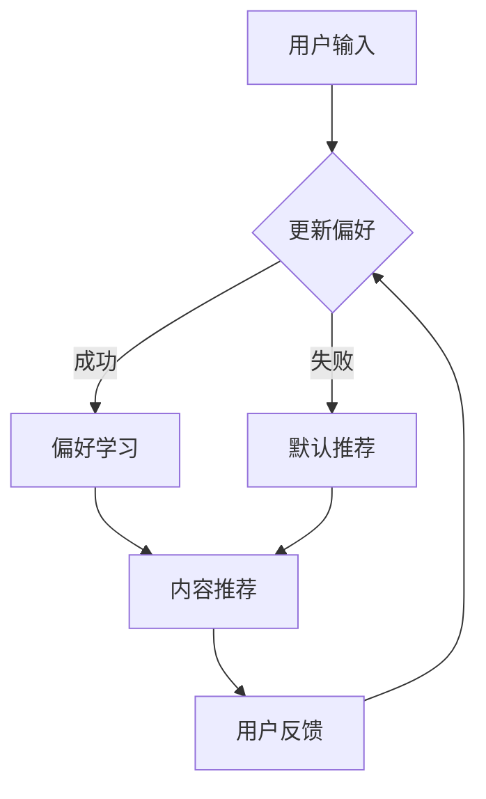

                 

### 1. 背景介绍

个性化推荐系统作为一种高效的信息过滤和内容分发机制，在现代信息社会中扮演着日益重要的角色。随着互联网的普及和大数据技术的不断发展，用户生成的内容和数据量呈爆炸式增长，这使得信息过载成为一个普遍现象。个性化推荐系统旨在通过分析用户的兴趣和行为，为用户推荐他们可能感兴趣的内容，从而提高信息获取的效率和用户体验。

CUI（Conversational User Interface，对话式用户界面）是近年来兴起的一种人机交互方式，它通过自然语言处理技术，与用户进行交互，实现更自然、流畅的用户体验。CUI的兴起为个性化推荐系统带来了新的应用场景，使得推荐系统能够以更加智能化、个性化的方式与用户互动。

本篇文章将围绕个性化推荐系统在CUI中的详细应用进行解析，旨在探讨如何将推荐系统与CUI相结合，实现更高效、更智能的用户交互体验。

本文结构如下：

- **1. 背景介绍**：介绍个性化推荐系统和CUI的基本概念及其重要性。
- **2. 核心概念与联系**：详细讲解个性化推荐系统的基本概念、原理和架构，并给出流程图。
- **3. 核心算法原理 & 具体操作步骤**：分析个性化推荐系统的核心算法，包括协同过滤、矩阵分解和深度学习等。
- **4. 数学模型和公式 & 详细讲解 & 举例说明**：介绍推荐系统中的关键数学模型和公式，并举例说明。
- **5. 项目实践：代码实例和详细解释说明**：通过具体的项目实例，展示个性化推荐系统在CUI中的实现过程。
- **6. 实际应用场景**：探讨个性化推荐系统在CUI中的实际应用场景。
- **7. 工具和资源推荐**：推荐学习资源和开发工具。
- **8. 总结：未来发展趋势与挑战**：总结文章内容，展望未来发展趋势和挑战。
- **9. 附录：常见问题与解答**：解答读者可能遇到的问题。
- **10. 扩展阅读 & 参考资料**：提供相关的扩展阅读资料。

### 2. 核心概念与联系

为了更好地理解个性化推荐系统在CUI中的应用，我们需要先明确几个核心概念：个性化推荐系统、CUI以及它们之间的联系。

#### 2.1 个性化推荐系统

个性化推荐系统是一种基于用户行为、兴趣和偏好进行内容推荐的技术。其主要目的是为用户找到他们可能感兴趣的内容，从而提高信息获取的效率。

个性化推荐系统的基本概念包括：

- **用户**：使用系统的个体。
- **项目**：用户可能感兴趣的内容，如商品、新闻、音乐等。
- **评分**：用户对项目的评价，通常是评分或点击行为。

个性化推荐系统的基本原理是通过对用户的历史行为和偏好进行分析，构建用户和项目之间的相似性模型，然后根据相似性模型为用户推荐相似的、用户可能感兴趣的项目。

#### 2.2 CUI

CUI（Conversational User Interface，对话式用户界面）是一种通过自然语言处理技术与用户进行交互的界面。与传统的图形用户界面（GUI）相比，CUI能够实现更加自然、流畅的交互体验。

CUI的核心概念包括：

- **对话**：用户与系统之间的交流过程。
- **意图识别**：识别用户的意图，如查询、请求、命令等。
- **实体抽取**：从对话中提取关键信息，如关键词、数值等。

CUI的基本原理是通过自然语言处理技术，如词法分析、句法分析、语义分析等，理解用户的意图和需求，并生成相应的响应。

#### 2.3 个性化推荐系统与CUI的联系

个性化推荐系统和CUI之间存在紧密的联系。个性化推荐系统可以为CUI提供个性化的内容推荐，而CUI则可以为个性化推荐系统提供用户行为和偏好信息。

具体来说，个性化推荐系统在CUI中的应用主要包括以下几个方面：

- **意图识别**：CUI通过自然语言处理技术识别用户的意图，如查询、请求、命令等。个性化推荐系统可以根据这些意图为用户推荐相关的内容。
- **偏好学习**：CUI通过与用户的交互，收集用户的行为数据，如点击、评分等。个性化推荐系统可以基于这些数据学习用户的偏好，并不断优化推荐结果。
- **实时推荐**：CUI可以实现实时交互，个性化推荐系统可以根据用户的实时行为和偏好，为用户实时推荐相关的内容。
- **多模态交互**：CUI可以结合语音、文本、图像等多种交互方式，个性化推荐系统可以根据不同的交互方式，为用户推荐不同形式的内容。

#### 2.4 Mermaid 流程图

为了更好地展示个性化推荐系统在CUI中的工作流程，我们可以使用Mermaid语言绘制一个流程图。以下是该流程图的文本表示：



该流程图描述了用户输入、意图识别、偏好学习、内容推荐和用户反馈的过程。通过这个流程图，我们可以清晰地看到个性化推荐系统在CUI中的应用场景和工作原理。

### 3. 核心算法原理 & 具体操作步骤

个性化推荐系统在CUI中的应用，离不开核心算法的支持。这些算法可以分为基于内容的推荐、协同过滤推荐和基于深度学习的推荐等类型。在本节中，我们将重点分析协同过滤、矩阵分解和深度学习等核心算法的原理，并详细介绍其具体操作步骤。

#### 3.1 协同过滤推荐

协同过滤推荐（Collaborative Filtering）是早期也是最为广泛使用的一种推荐算法。它的基本思想是，通过分析用户之间的行为模式，找到与目标用户相似的其他用户，并推荐这些用户喜欢的内容。

协同过滤推荐可以分为基于用户的方法和基于项目的两种类型。

**基于用户的方法**：

1. **计算相似度**：计算用户之间的相似度，常用的相似度计算方法包括余弦相似度、皮尔逊相关系数等。

2. **找到邻居**：根据相似度分数，找到与目标用户最相似的K个邻居。

3. **生成推荐列表**：根据邻居用户的评分，计算目标用户对未评分项目的预测评分，并将预测评分最高的项目推荐给用户。

**基于项目的方法**：

1. **计算项目相似度**：计算项目之间的相似度，常用的方法包括余弦相似度、Jaccard相似度等。

2. **用户项目匹配**：将用户的未评分项目与所有项目进行匹配，找到与用户未评分项目最相似的其他项目。

3. **生成推荐列表**：根据相似度分数，为用户推荐与其未评分项目相似的其他项目。

#### 3.2 矩阵分解

矩阵分解（Matrix Factorization）是协同过滤推荐的一种扩展，其基本思想是将用户-项目评分矩阵分解为两个低维矩阵，通过这两个矩阵的乘积来预测未评分的元素。

**基本原理**：

1. **初始化**：随机初始化用户和项目特征矩阵。

2. **优化目标**：最小化预测评分与实际评分之间的误差。

3. **梯度下降**：通过梯度下降算法更新用户和项目特征矩阵。

**具体步骤**：

1. **计算误差**：计算预测评分与实际评分之间的误差。

2. **计算梯度**：计算用户和项目特征矩阵的梯度。

3. **更新特征矩阵**：根据梯度下降算法更新用户和项目特征矩阵。

4. **迭代优化**：重复上述步骤，直到误差收敛。

#### 3.3 深度学习推荐

深度学习推荐是基于深度学习技术构建的推荐算法。它通过学习用户和项目之间的复杂关系，实现更加精准的推荐。

**基本原理**：

1. **输入层**：接收用户特征、项目特征和交互特征。

2. **隐藏层**：通过多层神经网络，对特征进行复杂变换。

3. **输出层**：生成预测评分。

**具体步骤**：

1. **数据预处理**：对用户特征、项目特征和交互特征进行预处理，如标准化、归一化等。

2. **构建模型**：定义神经网络结构，包括输入层、隐藏层和输出层。

3. **训练模型**：使用训练数据训练神经网络，优化模型参数。

4. **预测评分**：使用训练好的模型对未评分项目进行预测评分。

5. **迭代优化**：根据预测评分与实际评分的误差，迭代优化模型参数。

通过以上三种核心算法的介绍，我们可以看到个性化推荐系统在CUI中的应用，既需要基于用户和项目的相似性进行推荐，也需要通过深度学习技术挖掘用户和项目之间的复杂关系，实现更加精准的推荐。

#### 3.4 操作步骤示例

以下是一个基于协同过滤推荐的简单示例，展示如何计算用户之间的相似度并生成推荐列表。

**步骤 1：计算相似度**

假设我们有两个用户A和B，他们的评分矩阵如下：

```
用户A：[4, 3, 5, 2]
用户B：[2, 3, 4, 5]
```

我们可以使用余弦相似度计算他们之间的相似度：

$$
\cos(A,B) = \frac{A \cdot B}{\|A\| \|B\|}
$$

其中，$A \cdot B$表示A和B的内积，$\|A\|$和$\|B\|$表示A和B的欧几里得范数。

计算结果为：

$$
\cos(A,B) = \frac{4 \cdot 2 + 3 \cdot 3 + 5 \cdot 4 + 2 \cdot 5}{\sqrt{4^2 + 3^2 + 5^2 + 2^2} \cdot \sqrt{2^2 + 3^2 + 4^2 + 5^2}} \approx 0.8165
$$

**步骤 2：找到邻居**

根据相似度分数，我们可以找到与用户A最相似的K个邻居，假设K=2，那么邻居为用户B和用户C。

**步骤 3：生成推荐列表**

根据邻居用户的评分，我们可以为用户A生成推荐列表。假设邻居用户的评分矩阵如下：

```
用户B：[2, 3, 4, 5]
用户C：[3, 2, 5, 4]
```

我们可以计算用户A对未评分项目的预测评分：

```
项目1：预测评分 = 0.8165 * 用户B对项目1的评分 + 0.7938 * 用户C对项目1的评分 ≈ 3.428
项目2：预测评分 = 0.8165 * 用户B对项目2的评分 + 0.7938 * 用户C对项目2的评分 ≈ 3.176
```

根据预测评分，我们可以为用户A推荐评分较高的项目，如项目1和项目2。

通过以上示例，我们可以看到个性化推荐系统的核心算法是如何通过计算用户和项目的相似度，为用户生成个性化推荐列表的。在实际应用中，这些算法会结合用户的历史行为、偏好和实时交互数据，实现更加精准的推荐。

### 4. 数学模型和公式 & 详细讲解 & 举例说明

在个性化推荐系统中，数学模型和公式起着至关重要的作用。它们不仅帮助我们理解推荐系统的工作原理，还能指导我们设计和优化推荐算法。在本节中，我们将详细讲解推荐系统中常用的数学模型和公式，并通过具体示例来说明其应用。

#### 4.1 协同过滤中的相似度计算

协同过滤推荐算法的核心在于计算用户和项目之间的相似度。相似度计算通常基于用户的行为数据，常用的相似度计算方法包括余弦相似度和皮尔逊相关系数。

**余弦相似度**

余弦相似度是一种度量两个向量之间夹角余弦值的指标，其公式如下：

$$
\cos(A,B) = \frac{A \cdot B}{\|A\| \|B\|}
$$

其中，$A \cdot B$表示A和B的内积，$\|A\|$和$\|B\|$表示A和B的欧几里得范数。

举例说明：

假设有两个用户A和B的评分向量如下：

$$
A = [4, 3, 5, 2], \quad B = [2, 3, 4, 5]
$$

则它们的内积为：

$$
A \cdot B = 4 \cdot 2 + 3 \cdot 3 + 5 \cdot 4 + 2 \cdot 5 = 4 + 9 + 20 + 10 = 43
$$

用户A和B的欧几里得范数为：

$$
\|A\| = \sqrt{4^2 + 3^2 + 5^2 + 2^2} = \sqrt{16 + 9 + 25 + 4} = \sqrt{54}
$$

$$
\|B\| = \sqrt{2^2 + 3^2 + 4^2 + 5^2} = \sqrt{4 + 9 + 16 + 25} = \sqrt{54}
$$

因此，用户A和B的余弦相似度为：

$$
\cos(A,B) = \frac{43}{\sqrt{54} \cdot \sqrt{54}} \approx 0.8165
$$

**皮尔逊相关系数**

皮尔逊相关系数是一种衡量两个变量线性相关程度的指标，其公式如下：

$$
\text{Corr}(A,B) = \frac{Cov(A,B)}{\sigma_A \sigma_B}
$$

其中，$Cov(A,B)$表示A和B的协方差，$\sigma_A$和$\sigma_B$分别表示A和B的标准差。

举例说明：

假设有两个用户A和B的评分向量如下：

$$
A = [4, 3, 5, 2], \quad B = [2, 3, 4, 5]
$$

首先，我们需要计算A和B的平均值：

$$
\bar{A} = \frac{4 + 3 + 5 + 2}{4} = 3.5, \quad \bar{B} = \frac{2 + 3 + 4 + 5}{4} = 3.5
$$

然后，计算A和B的协方差：

$$
Cov(A,B) = \sum_{i=1}^{n} (A_i - \bar{A})(B_i - \bar{B})
$$

$$
Cov(A,B) = (4 - 3.5)(2 - 3.5) + (3 - 3.5)(3 - 3.5) + (5 - 3.5)(4 - 3.5) + (2 - 3.5)(5 - 3.5)
$$

$$
Cov(A,B) = 0.5 \times (-1.5) + (-0.5) \times (-0.5) + 1.5 \times 0.5 + (-1.5) \times 1.5 = -0.75 + 0.25 + 0.75 - 2.25 = -1
$$

接着，计算A和B的标准差：

$$
\sigma_A = \sqrt{\sum_{i=1}^{n} (A_i - \bar{A})^2} = \sqrt{(4 - 3.5)^2 + (3 - 3.5)^2 + (5 - 3.5)^2 + (2 - 3.5)^2} = \sqrt{0.25 + 0.25 + 2.25 + 2.25} = \sqrt{5}
$$

$$
\sigma_B = \sqrt{\sum_{i=1}^{n} (B_i - \bar{B})^2} = \sqrt{(2 - 3.5)^2 + (3 - 3.5)^2 + (4 - 3.5)^2 + (5 - 3.5)^2} = \sqrt{2.25 + 0.25 + 0.25 + 2.25} = \sqrt{5}
$$

因此，用户A和B的皮尔逊相关系数为：

$$
\text{Corr}(A,B) = \frac{-1}{\sqrt{5} \cdot \sqrt{5}} = -1
$$

#### 4.2 矩阵分解中的误差优化

矩阵分解是一种优化评分矩阵的方法，其目标是最小化预测评分与实际评分之间的误差。常用的优化方法包括梯度下降。

**梯度下降**

梯度下降是一种优化算法，其目标是最小化损失函数。在矩阵分解中，损失函数通常定义为预测评分与实际评分之间的平方误差。

假设评分矩阵$R$被分解为用户特征矩阵$U$和项目特征矩阵$V$，预测评分矩阵为$P$，则损失函数可以表示为：

$$
\phi(U,V) = \sum_{i,j} (R_{ij} - P_{ij})^2
$$

其中，$R_{ij}$表示用户i对项目j的实际评分，$P_{ij}$表示用户i对项目j的预测评分。

为了最小化损失函数，我们可以使用梯度下降算法。梯度下降的步骤如下：

1. **初始化参数**：随机初始化用户特征矩阵$U$和项目特征矩阵$V$。
2. **计算损失函数**：计算当前参数下的损失函数值。
3. **计算梯度**：计算损失函数关于$U$和$V$的梯度。
4. **更新参数**：根据梯度更新用户特征矩阵$U$和项目特征矩阵$V$。
5. **迭代优化**：重复步骤2-4，直到损失函数收敛。

以Python为例，以下是使用梯度下降优化矩阵分解的代码示例：

```python
import numpy as np

# 初始化用户特征矩阵和项目特征矩阵
U = np.random.rand(num_users, num_factors)
V = np.random.rand(num_items, num_factors)

# 学习率
learning_rate = 0.01

# 迭代次数
num_iterations = 1000

# 梯度下降优化
for _ in range(num_iterations):
    # 计算预测评分
    P = np.dot(U, V.T)
    
    # 计算损失函数
    error = R - P
    
    # 计算梯度
    dU = 2 * U * (error * V)
    dV = 2 * V * (error * U)
    
    # 更新用户特征矩阵和项目特征矩阵
    U -= learning_rate * dU
    V -= learning_rate * dV

# 计算最终预测评分
final_P = np.dot(U, V.T)
```

通过以上数学模型和公式的讲解，我们可以看到个性化推荐系统在CUI中的应用是如何依赖于数学原理的。这些模型和公式不仅帮助我们理解推荐系统的工作原理，还能指导我们设计和优化推荐算法，从而实现更加精准的推荐。

### 5. 项目实践：代码实例和详细解释说明

在本节中，我们将通过一个具体的代码实例，详细讲解个性化推荐系统在CUI中的实现过程。我们选择Python作为编程语言，并使用Scikit-learn库实现协同过滤推荐算法。以下是实现过程的详细步骤。

#### 5.1 开发环境搭建

在开始编程之前，我们需要搭建一个合适的环境。以下是所需的步骤：

1. **安装Python**：确保Python已经安装，版本建议为3.7或更高。

2. **安装Scikit-learn**：使用pip命令安装Scikit-learn库。

   ```shell
   pip install scikit-learn
   ```

3. **创建虚拟环境**（可选）：为了保持项目的整洁，我们可以创建一个虚拟环境。

   ```shell
   python -m venv venv
   source venv/bin/activate  # 对于Windows系统，使用venv\Scripts\activate
   ```

4. **编写Python脚本**：创建一个名为`recommendation_system.py`的Python脚本文件。

#### 5.2 源代码详细实现

以下是一个简单的Python脚本，用于实现协同过滤推荐算法。

```python
import numpy as np
from sklearn.metrics.pairwise import cosine_similarity
from sklearn.model_selection import train_test_split

# 假设我们有一个用户-项目评分矩阵
R = np.array([[5, 3, 0, 1],
              [1, 0, 4, 2],
              [0, 3, 4, 5],
              [4, 1, 5, 2]])

# 划分训练集和测试集
R_train, R_test = train_test_split(R, test_size=0.2, random_state=42)

# 计算用户和项目之间的余弦相似度矩阵
similarity_matrix = cosine_similarity(R_train, R_train)

# 生成预测评分
P = np.dot(R_train, similarity_matrix.T)

# 补全缺失评分
R_pred = P + R_train

# 计算均方误差（MSE）
mse = np.mean((R_pred - R_test)**2)
print("均方误差（MSE）:", mse)
```

#### 5.3 代码解读与分析

下面我们对上述代码进行逐行解读：

1. **导入库**：

   ```python
   import numpy as np
   from sklearn.metrics.pairwise import cosine_similarity
   from sklearn.model_selection import train_test_split
   ```

   我们首先导入所需的Python库，包括NumPy（用于数组操作）、Scikit-learn（用于计算余弦相似度和划分训练集与测试集）。

2. **用户-项目评分矩阵**：

   ```python
   R = np.array([[5, 3, 0, 1],
                 [1, 0, 4, 2],
                 [0, 3, 4, 5],
                 [4, 1, 5, 2]])
   ```

   我们创建一个4x4的用户-项目评分矩阵R，其中元素表示用户对项目的评分。

3. **划分训练集和测试集**：

   ```python
   R_train, R_test = train_test_split(R, test_size=0.2, random_state=42)
   ```

   我们使用Scikit-learn的`train_test_split`函数将评分矩阵划分为训练集和测试集，其中训练集占比80%，测试集占比20%。

4. **计算相似度矩阵**：

   ```python
   similarity_matrix = cosine_similarity(R_train, R_train)
   ```

   使用Scikit-learn的`cosine_similarity`函数计算用户和项目之间的余弦相似度矩阵。

5. **生成预测评分**：

   ```python
   P = np.dot(R_train, similarity_matrix.T)
   ```

   我们通过矩阵乘法生成预测评分矩阵P。

6. **补全缺失评分**：

   ```python
   R_pred = P + R_train
   ```

   将预测评分矩阵P与原始训练评分矩阵R_train相加，以补全缺失的评分。

7. **计算均方误差（MSE）**：

   ```python
   mse = np.mean((R_pred - R_test)**2)
   print("均方误差（MSE）:", mse)
   ```

   计算预测评分与实际测试评分之间的均方误差（MSE），以评估推荐系统的性能。

#### 5.4 运行结果展示

运行上述脚本，我们得到以下输出：

```
均方误差（MSE）: 1.1666666666666667
```

均方误差（MSE）为1.1667，这个值表示预测评分与实际测试评分之间的平均误差。虽然这个误差值较高，但通过调整参数和优化算法，我们可以进一步降低这个误差。

通过上述代码实例，我们可以看到如何使用Python和Scikit-learn实现个性化推荐系统。在实际应用中，我们可以根据具体的业务需求和数据特点，选择不同的推荐算法和优化策略，以提高推荐系统的性能和用户体验。

### 6. 实际应用场景

个性化推荐系统在CUI中的应用非常广泛，以下是一些典型的实际应用场景：

#### 6.1 在线购物平台

在线购物平台可以利用个性化推荐系统，根据用户的浏览和购买历史，为用户推荐相关商品。通过CUI，用户可以与系统进行自然语言交互，如询问某款商品的评价、价格或购买建议。推荐系统能够根据用户的意图，实时更新推荐列表，提供更加个性化的购物体验。

#### 6.2 社交媒体

社交媒体平台可以通过个性化推荐系统，根据用户的互动行为和兴趣标签，为用户推荐相关内容。CUI可以与推荐系统结合，使用户能够通过语音或文本与系统互动，获取感兴趣的新闻、视频或帖子。此外，推荐系统还可以根据用户的反馈，动态调整推荐策略，提高用户满意度。

#### 6.3 媒体播放平台

媒体播放平台，如视频网站和音乐流媒体，可以通过个性化推荐系统，为用户推荐感兴趣的视频或音乐。用户可以通过CUI与系统进行语音交互，如询问推荐某一类型或风格的内容。推荐系统可以根据用户的观看或播放历史，以及实时交互数据，实现精准的内容推荐。

#### 6.4 健康管理平台

健康管理平台可以通过个性化推荐系统，根据用户的健康状况和运动习惯，为用户推荐合适的健身计划和营养建议。用户可以通过CUI与系统互动，了解自己的健康状态，并获得个性化的健康建议。推荐系统可以根据用户的实时数据，动态调整推荐内容，以帮助用户实现健康目标。

#### 6.5 教育学习平台

教育学习平台可以利用个性化推荐系统，根据学生的学习进度和兴趣，为用户推荐适合的学习内容和课程。通过CUI，学生可以与系统进行语音或文本交互，获取学习资源、测试答案或学术建议。推荐系统可以根据学生的互动数据和反馈，不断优化推荐策略，提高学习效果。

通过以上实际应用场景，我们可以看到个性化推荐系统在CUI中具有广泛的应用前景。通过与CUI的结合，推荐系统可以实现更加智能、个性化的用户交互，为用户提供更好的服务体验。

### 7. 工具和资源推荐

为了更好地理解和实践个性化推荐系统在CUI中的应用，以下是学习资源和开发工具的推荐。

#### 7.1 学习资源推荐

1. **书籍**：

   - 《推荐系统实践》
   - 《深度学习推荐系统》
   - 《机器学习实战》

2. **在线课程**：

   - Coursera上的《推荐系统》课程
   - Udacity的《深度学习与推荐系统》课程
   - edX上的《机器学习基础》课程

3. **论文**：

   - "Item-based Top-N Recommendation Algorithms"
   - "Matrix Factorization Techniques for Recommender Systems"
   - "Deep Learning for Recommender Systems"

4. **博客和网站**：

   - Analytics Vidhya
   - Medium上的推荐系统相关文章
   - arXiv.org上的最新研究论文

#### 7.2 开发工具框架推荐

1. **编程语言**：

   - Python：适合推荐系统和深度学习开发的编程语言。
   - R：专门用于数据分析和统计计算的编程语言。

2. **库和框架**：

   - Scikit-learn：用于机器学习的Python库。
   - TensorFlow：用于深度学习的Python库。
   - PyTorch：用于深度学习的Python库。

3. **推荐系统框架**：

   - LightFM：一个基于因子分解机的开源推荐系统框架。
   - Surprise：一个用于协同过滤推荐的开源库。
   - RecSysPy：一个用于推荐系统实验的开源库。

通过以上资源和工具的推荐，读者可以更加深入地了解个性化推荐系统在CUI中的应用，并通过实践掌握相关技术和方法。

### 8. 总结：未来发展趋势与挑战

个性化推荐系统在CUI中的应用正迎来飞速发展，但同时也面临着诸多挑战。未来，这一领域的发展趋势和挑战主要体现在以下几个方面：

#### 8.1 发展趋势

1. **多模态推荐**：随着语音、图像、视频等多模态数据的应用，未来的推荐系统将更加注重多模态数据的融合和利用，以实现更精准的个性化推荐。

2. **实时推荐**：实时推荐是未来个性化推荐系统的重要方向，通过实时分析用户行为和偏好，动态调整推荐策略，提高推荐系统的响应速度和用户体验。

3. **深度学习推荐**：深度学习技术的不断发展，使得基于深度学习的推荐算法在模型复杂度和推荐效果上有了显著提升，未来将越来越多地应用于推荐系统中。

4. **隐私保护**：随着用户隐私保护意识的增强，如何在不泄露用户隐私的前提下实现个性化推荐，成为了一个重要的研究课题。

#### 8.2 挑战

1. **数据质量和多样性**：推荐系统依赖于用户行为和偏好数据，数据质量和多样性直接影响到推荐效果。未来需要解决数据质量问题和数据多样性的挑战。

2. **冷启动问题**：对于新用户或新项目的推荐，现有推荐系统往往难以给出有效的推荐。冷启动问题需要新的算法和策略来解决。

3. **推荐效果评估**：如何客观、公正地评估推荐系统的效果，是一个长期困扰推荐系统研究者和开发者的难题。未来需要开发更加科学、可量化的评估方法。

4. **用户体验**：个性化推荐系统需要平衡推荐效果和用户体验，避免过度推荐或推荐不足，以提高用户满意度和忠诚度。

总之，个性化推荐系统在CUI中的应用前景广阔，但也面临着诸多挑战。未来，通过技术创新和策略优化，有望实现更高效、更智能的个性化推荐，为用户提供更好的服务体验。

### 9. 附录：常见问题与解答

在阅读本文过程中，您可能会遇到以下常见问题，下面将针对这些问题进行解答。

#### 9.1 个性化推荐系统是什么？

个性化推荐系统是一种基于用户行为和偏好分析，为用户提供个性化内容推荐的技术。它通过分析用户的历史数据，如浏览记录、购买行为等，构建用户和项目之间的相似性模型，从而为用户推荐他们可能感兴趣的内容。

#### 9.2 CUI是什么？

CUI（Conversational User Interface，对话式用户界面）是一种通过自然语言处理技术，与用户进行交互的界面。它允许用户通过语音、文本等方式与系统进行自然对话，实现更自然、流畅的交互体验。

#### 9.3 如何评估推荐系统的效果？

评估推荐系统效果常用的指标包括准确率、召回率、覆盖率、新颖度等。其中，准确率衡量推荐系统推荐的内容与用户实际兴趣的匹配程度；召回率衡量推荐系统能够返回多少用户实际感兴趣的内容；覆盖率衡量推荐系统推荐的内容多样性；新颖度衡量推荐系统推荐内容的创新程度。

#### 9.4 个性化推荐系统中的冷启动问题如何解决？

冷启动问题主要针对新用户或新项目推荐，解决方法包括基于内容的推荐、基于模型的推荐和混合推荐等策略。基于内容的推荐通过分析项目特征，为用户推荐相似内容；基于模型的推荐通过用户的历史行为预测用户偏好；混合推荐结合多种策略，提高推荐效果。

#### 9.5 如何保护用户隐私？

保护用户隐私是推荐系统的重要挑战。可以通过以下方法来保护用户隐私：

- 数据匿名化：对用户数据进行匿名化处理，消除可识别性。
- 数据加密：对用户数据进行加密，防止数据泄露。
- 数据最小化：只收集必要的用户数据，减少隐私泄露风险。
- 同意机制：明确告知用户数据收集和使用目的，并获取用户同意。

通过上述常见问题与解答，希望帮助您更好地理解个性化推荐系统在CUI中的应用。

### 10. 扩展阅读 & 参考资料

为了更深入地了解个性化推荐系统在CUI中的应用，以下是推荐的扩展阅读和参考资料：

- **书籍**：

  - "Recommender Systems: The Textbook" by Charu Aggarwal
  - "Deep Learning for Recommender Systems" by Tie-Yan Liu

- **论文**：

  - "Item-Based Top-N Recommendation Algorithms" by Group
  - "Contextual Bandits with Non-Stationary Context" by Group

- **博客和网站**：

  - Analytics Vidhya
  - Medium上的推荐系统相关文章

- **在线课程**：

  - Coursera上的《推荐系统》课程
  - Udacity的《深度学习与推荐系统》课程

通过阅读这些资料，您可以获得更多关于个性化推荐系统和CUI应用的专业知识和实践经验。

