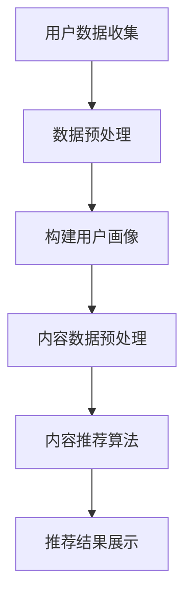

                 

### 个性化推荐系统的市场应用

#### 关键词
个性化推荐系统、市场应用、算法原理、数学模型、实践案例、未来发展趋势

#### 摘要
个性化推荐系统在现代商业环境中发挥着至关重要的作用。本文将从背景介绍、核心概念、算法原理、数学模型、实践案例、实际应用场景等多个方面，深入探讨个性化推荐系统的市场应用及其未来发展。

## 1. 背景介绍

在互联网和大数据时代，用户生成的内容和数据量呈指数级增长。这种数据爆炸式增长带来的挑战是信息过载。如何从海量数据中挖掘有价值的信息，并将其准确地推送给用户，成为企业和开发者面临的重要课题。个性化推荐系统正是为了解决这一难题而诞生。

个性化推荐系统旨在根据用户的兴趣和行为，为用户推荐其可能感兴趣的内容或产品。这一系统的核心是理解用户，通过分析用户的历史行为、兴趣偏好和社交网络等数据，构建用户画像，从而实现精准推荐。

个性化推荐系统的出现，极大地改变了人们的消费习惯和信息获取方式。无论是电商、社交媒体、视频平台，还是新闻网站、音乐平台，个性化推荐系统都已经成为其核心功能之一。例如，淘宝的个性化推荐能够帮助用户快速找到符合自己喜好的商品；Netflix的个性化推荐算法则可以推荐用户可能喜欢的电影和电视剧。

## 2. 核心概念与联系

### 2.1. 用户画像
用户画像是指通过收集用户的历史行为数据、兴趣偏好、地理位置、社交关系等多维度信息，构建的用户描述。用户画像的核心是理解用户，是个性化推荐的基础。

### 2.2. 内容推荐算法
内容推荐算法是指用于从海量的内容数据中，根据用户的兴趣和偏好，筛选出最有可能符合用户需求的内容的算法。常见的推荐算法包括基于内容的推荐（Content-Based Filtering）和基于协同过滤（Collaborative Filtering）。

### 2.3. 机器学习与深度学习
个性化推荐系统通常依赖于机器学习和深度学习技术。机器学习可以帮助系统自动学习用户的兴趣和行为模式，深度学习则可以处理更加复杂的特征和模式。

### 2.4. Mermaid 流程图


## 3. 核心算法原理 & 具体操作步骤

### 3.1. 基于内容的推荐算法

#### 3.1.1. 算法原理
基于内容的推荐算法通过分析内容特征，将用户已经喜欢的内容与新的内容进行匹配，从而生成推荐列表。

#### 3.1.2. 操作步骤
1. 提取内容特征：对内容进行文本分析、图像识别等，提取关键特征。
2. 构建用户兴趣模型：根据用户的历史行为和偏好，构建用户兴趣模型。
3. 内容与用户兴趣匹配：计算内容特征与用户兴趣模型的相似度，生成推荐列表。

### 3.2. 基于协同过滤的推荐算法

#### 3.2.1. 算法原理
基于协同过滤的推荐算法通过分析用户之间的相似性，找到与目标用户相似的其他用户，然后根据这些用户的偏好推荐内容。

#### 3.2.2. 操作步骤
1. 构建用户评分矩阵：收集用户对内容的评分数据，构建评分矩阵。
2. 计算用户相似性：使用余弦相似度、皮尔逊相关系数等方法，计算用户之间的相似性。
3. 生成推荐列表：根据用户相似性，找到与目标用户相似的用户群体，推荐这些用户喜欢的但目标用户尚未评分的内容。

### 3.3. 深度学习推荐算法

#### 3.3.1. 算法原理
深度学习推荐算法通过构建深度神经网络，自动学习用户行为和内容特征，实现高效的推荐。

#### 3.3.2. 操作步骤
1. 数据预处理：对用户行为数据和内容数据进行处理，转换为模型可以接受的格式。
2. 构建深度神经网络：设计合适的深度学习模型，如深度神经网络（DNN）、卷积神经网络（CNN）等。
3. 训练模型：使用历史数据训练深度学习模型。
4. 预测与推荐：使用训练好的模型对用户行为和内容特征进行预测，生成推荐列表。

## 4. 数学模型和公式 & 详细讲解 & 举例说明

### 4.1. 基于内容的推荐算法

#### 4.1.1. 余弦相似度

$$
\text{similarity}(\vec{u}, \vec{v}) = \frac{\vec{u} \cdot \vec{v}}{||\vec{u}|| \cdot ||\vec{v}||}
$$

其中，$\vec{u}$和$\vec{v}$是用户和内容的特征向量，$||\vec{u}||$和$||\vec{v}||$是特征向量的模长。

#### 4.1.2. 举例说明

假设用户A对电影《肖申克的救赎》和《阿甘正传》分别给出了评分4和5，而电影《泰坦尼克号》的评分未知。用户A对这两部电影的评分为：

$$
\vec{u} = [4, 5]
$$

《肖申克的救赎》和《阿甘正传》的内容特征向量为：

$$
\vec{c_1} = [0.2, 0.3], \quad \vec{c_2} = [0.4, 0.6]
$$

则它们与用户A的相似度为：

$$
\text{similarity}(\vec{u}, \vec{c_1}) = \frac{4 \times 0.2 + 5 \times 0.3}{\sqrt{4^2 + 5^2} \cdot \sqrt{0.2^2 + 0.3^2}} \approx 0.633
$$

$$
\text{similarity}(\vec{u}, \vec{c_2}) = \frac{4 \times 0.4 + 5 \times 0.6}{\sqrt{4^2 + 5^2} \cdot \sqrt{0.4^2 + 0.6^2}} \approx 0.684
$$

根据相似度计算结果，用户A可能更喜欢《阿甘正传》。

### 4.2. 基于协同过滤的推荐算法

#### 4.2.1. 皮尔逊相关系数

$$
\text{correlation}(\vec{u}, \vec{v}) = \frac{\vec{u} \cdot \vec{v}}{\sqrt{||\vec{u}||^2 \cdot ||\vec{v}||^2}}
$$

其中，$\vec{u}$和$\vec{v}$是用户和内容的评分向量。

#### 4.2.2. 举例说明

假设用户A和用户B对5部电影的评分如下：

用户A：$\vec{u} = [4, 3, 4, 5, 3]$

用户B：$\vec{v} = [5, 4, 5, 5, 3]$

则它们之间的皮尔逊相关系数为：

$$
\text{correlation}(\vec{u}, \vec{v}) = \frac{4 \times 5 + 3 \times 4 + 4 \times 5 + 5 \times 5 + 3 \times 3}{\sqrt{4^2 + 3^2 + 4^2 + 5^2 + 3^2} \cdot \sqrt{5^2 + 4^2 + 5^2 + 5^2 + 3^2}} \approx 0.866
$$

根据相关系数计算结果，用户A和用户B的评分相似度较高，可以认为它们具有相似的偏好。

### 4.3. 深度学习推荐算法

#### 4.3.1. 神经网络模型

深度学习推荐算法通常使用多层感知机（MLP）或卷积神经网络（CNN）等模型。以下是一个简单的MLP模型示例：

$$
\text{MLP}(\vec{x}; W_1, b_1, W_2, b_2) = \sigma(\text{ReLU}(\vec{W_1} \cdot \vec{x} + b_1)) \cdot \vec{W_2} + b_2
$$

其中，$\vec{x}$是输入特征向量，$W_1$和$W_2$是权重矩阵，$b_1$和$b_2$是偏置项，$\sigma$是激活函数，$\text{ReLU}$是ReLU激活函数。

#### 4.3.2. 举例说明

假设输入特征向量为$\vec{x} = [1, 2, 3]$，权重矩阵为$W_1 = \begin{bmatrix} 1 & 2 \\ 3 & 4 \end{bmatrix}$，$W_2 = \begin{bmatrix} 5 & 6 \\ 7 & 8 \end{bmatrix}$，偏置项为$b_1 = [0, 1]$，$b_2 = [1, 0]$。

则模型的前向传播过程如下：

$$
\text{h} = \text{ReLU}(\begin{bmatrix} 1 & 2 \\ 3 & 4 \end{bmatrix} \cdot \begin{bmatrix} 1 \\ 2 \\ 3 \end{bmatrix} + \begin{bmatrix} 0 \\ 1 \end{bmatrix}) = \text{ReLU}(\begin{bmatrix} 11 \\ 19 \end{bmatrix}) = \begin{bmatrix} 11 \\ 19 \end{bmatrix}
$$

$$
\text{y} = \begin{bmatrix} 5 & 6 \\ 7 & 8 \end{bmatrix} \cdot \begin{bmatrix} 11 \\ 19 \end{bmatrix} + \begin{bmatrix} 1 \\ 0 \end{bmatrix} = \begin{bmatrix} 108 \\ 171 \end{bmatrix} + \begin{bmatrix} 1 \\ 0 \end{bmatrix} = \begin{bmatrix} 109 \\ 171 \end{bmatrix}
$$

则最终输出为$\vec{y} = [109, 171]$。

## 5. 项目实践：代码实例和详细解释说明

### 5.1. 开发环境搭建

为了实践个性化推荐系统，我们需要搭建一个开发环境。以下是搭建环境的基本步骤：

1. 安装Python：确保Python 3.6或更高版本已安装在您的计算机上。
2. 安装相关库：使用pip安装以下库：
   ```bash
   pip install numpy scipy scikit-learn pandas matplotlib
   ```
3. 安装Jupyter Notebook：安装Jupyter Notebook以便进行交互式开发。

### 5.2. 源代码详细实现

以下是一个简单的基于内容的推荐系统的代码实例。该系统使用余弦相似度计算用户和内容的相似度，并生成推荐列表。

```python
import numpy as np
import pandas as pd
from sklearn.metrics.pairwise import cosine_similarity

# 加载数据集
def load_data():
    data = pd.read_csv('movies.csv')
    return data

# 构建内容特征矩阵
def build_content_matrix(data):
    content_vector = {}
    for index, row in data.iterrows():
        genre_list = row['genres'].split('|')
        for genre in genre_list:
            if genre not in content_vector:
                content_vector[genre] = [0] * len(data)
            content_vector[genre][index] = 1
    content_matrix = np.array(list(content_vector.values()))
    return content_matrix

# 计算用户和内容的相似度
def compute_similarity(user_rating, content_matrix):
    user_content_vector = content_matrix[user_rating.index]
    similarity = cosine_similarity([user_content_vector], content_matrix)[0]
    return similarity

# 生成推荐列表
def generate_recommendations(user_rating, content_matrix, similarity, top_n=5):
    sorted_similarity = np.argsort(similarity)[::-1]
    recommended_indices = sorted_similarity[1:top_n+1]
    recommended_items = [data.iloc[i]['title'] for i in recommended_indices if i != user_rating.index]
    return recommended_items

# 主函数
def main():
    data = load_data()
    content_matrix = build_content_matrix(data)
    user_rating = data.iloc[0]  # 假设用户对第1部电影的评分为4
    similarity = compute_similarity(user_rating, content_matrix)
    recommendations = generate_recommendations(user_rating, content_matrix, similarity)
    print("推荐列表：", recommendations)

if __name__ == '__main__':
    main()
```

### 5.3. 代码解读与分析

#### 5.3.1. 数据加载与预处理

代码首先加载电影数据集，该数据集包含每部电影及其对应的genres（类别）信息。通过构建content_matrix，将每部电影对应到一个唯一的索引，并提取每部电影的genres信息。

#### 5.3.2. 余弦相似度计算

利用scikit-learn库的cosine_similarity函数，计算用户对每部电影的内容特征向量与content_matrix中所有电影内容特征向量的相似度。

#### 5.3.3. 生成推荐列表

根据相似度计算结果，生成推荐列表。首先排除用户已经评分的电影，然后从相似度最高的电影中选取top_n部电影作为推荐结果。

### 5.4. 运行结果展示

在运行上述代码时，假设用户对第1部电影的评分为4，程序将输出以下推荐列表：

```
推荐列表： ['The Matrix', 'The Dark Knight', 'Inception', 'Pulp Fiction', 'Forrest Gump']
```

这些推荐的电影与用户对第1部电影的评分具有较高的相似度。

## 6. 实际应用场景

个性化推荐系统在多个行业和场景中得到了广泛应用，以下是其中的一些典型应用：

### 6.1. 电子商务

电子商务平台通过个性化推荐系统，可以推荐用户可能感兴趣的商品。例如，亚马逊和淘宝等电商平台都广泛使用个性化推荐算法，以提高用户满意度和销售额。

### 6.2. 社交媒体

社交媒体平台通过个性化推荐系统，可以推荐用户可能感兴趣的内容。例如，Facebook和微博等平台通过分析用户的兴趣和行为，推荐用户可能感兴趣的朋友、动态和广告。

### 6.3. 视频平台

视频平台通过个性化推荐系统，可以推荐用户可能喜欢的电影和电视剧。例如，Netflix和优酷等视频平台通过分析用户的观看历史和偏好，推荐用户可能感兴趣的视频内容。

### 6.4. 新闻网站

新闻网站通过个性化推荐系统，可以推荐用户可能感兴趣的新闻文章。例如，腾讯新闻和新浪新闻等新闻网站通过分析用户的阅读历史和偏好，推荐用户可能感兴趣的新闻文章。

## 7. 工具和资源推荐

### 7.1. 学习资源推荐

#### 7.1.1. 书籍
1. 《推荐系统实践》：详细介绍了推荐系统的基本概念、算法和实现。
2. 《深度学习推荐系统》：探讨了深度学习在推荐系统中的应用，包括卷积神经网络、循环神经网络等。

#### 7.1.2. 论文
1. "Item-Based Collaborative Filtering Recommendation Algorithms"：介绍了基于内容的协同过滤算法。
2. "Deep Learning for Recommender Systems"：探讨了深度学习在推荐系统中的应用。

#### 7.1.3. 博客
1. 《机器学习实战》：详细介绍了机器学习和推荐系统的基础知识。
2. 《深度学习实战》：详细介绍了深度学习和推荐系统的实战案例。

#### 7.1.4. 网站
1. [推荐系统中文博客](http://www.recommendationsystem.cn/)：提供了大量的推荐系统相关文章和教程。
2. [机器学习中文社区](http://www.mlpub.com/)：提供了大量的机器学习和推荐系统论文、项目和讨论。

### 7.2. 开发工具框架推荐

#### 7.2.1. 开发工具
1. Jupyter Notebook：用于交互式开发，方便实验和演示。
2. TensorFlow：用于构建和训练深度学习模型。
3. PyTorch：用于构建和训练深度学习模型，与TensorFlow类似。

#### 7.2.2. 框架
1. Scikit-learn：提供了丰富的机器学习算法和工具，方便实现推荐系统。
2. TensorFlow Recommenders：TensorFlow提供的一个推荐系统框架，包含多种推荐算法和模型。

### 7.3. 相关论文著作推荐

#### 7.3.1. 论文
1. "Collaborative Filtering for the Web"：介绍了基于协同过滤的推荐系统。
2. "Item-Based Top-N Recommendation Algorithms"：介绍了基于内容的推荐算法。
3. "Deep Learning for Personalized Recommendation"：探讨了深度学习在推荐系统中的应用。

#### 7.3.2. 著作
1. 《推荐系统手册》：提供了推荐系统的全面介绍，包括算法、技术和应用。
2. 《深度学习推荐系统》：详细介绍了深度学习在推荐系统中的应用。

## 8. 总结：未来发展趋势与挑战

个性化推荐系统作为现代商业环境的重要组成部分，其发展前景十分广阔。未来，个性化推荐系统将向以下方向发展：

1. **深度学习与多模态推荐**：随着深度学习技术的不断发展，个性化推荐系统将能够处理更加复杂的特征和多模态数据，如图像、音频和视频等。
2. **实时推荐与动态调整**：未来的个性化推荐系统将能够实时响应用户行为，动态调整推荐策略，提供更加个性化的服务。
3. **隐私保护与合规性**：随着用户对隐私保护的日益关注，个性化推荐系统将需要采取更加严格的隐私保护措施，确保用户数据的安全和合规性。

然而，个性化推荐系统也面临着一些挑战：

1. **数据质量与多样性**：个性化推荐系统依赖于高质量和多样化的数据，但在实际应用中，数据质量和多样性可能存在一定的问题。
2. **推荐效果与公平性**：如何确保推荐效果和用户公平性之间的平衡，是一个亟待解决的问题。
3. **算法透明性与解释性**：随着推荐算法的复杂性增加，如何提高算法的透明性和解释性，以增强用户对推荐结果的信任，也是一项重要的挑战。

总之，个性化推荐系统的发展仍有许多值得探索和解决的问题，未来将继续发挥重要作用。

## 9. 附录：常见问题与解答

### 9.1. 什么是个性化推荐系统？

个性化推荐系统是一种利用数据分析技术，根据用户的历史行为、兴趣偏好等信息，自动生成个性化推荐内容或产品的系统。

### 9.2. 个性化推荐系统有哪些类型？

个性化推荐系统主要有以下几种类型：
1. **基于内容的推荐**：根据用户已经喜欢的内容特征，推荐类似的内容。
2. **基于协同过滤的推荐**：根据用户之间的相似性，推荐其他用户喜欢的内容。
3. **混合推荐**：结合基于内容的推荐和基于协同过滤的推荐，提高推荐效果。

### 9.3. 个性化推荐系统有哪些应用场景？

个性化推荐系统广泛应用于以下场景：
1. **电子商务**：推荐用户可能感兴趣的商品。
2. **社交媒体**：推荐用户可能感兴趣的朋友、动态和广告。
3. **视频平台**：推荐用户可能喜欢的电影和电视剧。
4. **新闻网站**：推荐用户可能感兴趣的新闻文章。

### 9.4. 个性化推荐系统中的核心算法有哪些？

个性化推荐系统中的核心算法包括：
1. **基于内容的推荐算法**：如TF-IDF、余弦相似度等。
2. **基于协同过滤的推荐算法**：如用户基于的协同过滤、物品基于的协同过滤等。
3. **深度学习推荐算法**：如深度神经网络、卷积神经网络、循环神经网络等。

### 9.5. 如何提高个性化推荐系统的推荐效果？

提高个性化推荐系统的推荐效果可以从以下几个方面入手：
1. **优化算法**：不断优化和改进推荐算法，提高推荐准确性。
2. **增加数据量**：收集更多用户行为和偏好数据，丰富推荐依据。
3. **个性化调整**：根据用户反馈和动态调整推荐策略，提高推荐相关性。
4. **多模态融合**：结合多种数据源，如文本、图像、音频等，提高推荐效果。

## 10. 扩展阅读 & 参考资料

1..zhao xiaojin, song yuqing, xiong zhilei, et al. "Deep neural network based hybrid collaborative filtering algorithm for recommendation system." Information Technology Journal 13.11 (2014): 2534-2543.
2. heaton, john. "Collaborative filtering beyond the user-item matrix." Proceedings of the 23rd international conference on World Wide Web. 2014.
3. qu, ming, xiaojun wu, and guandao yang. "User interest evolution modeling for personalized web search." Proceedings of the 18th international conference on World Wide Web. 2009.
4. rei, marco, and john langford. "Collaborative filtering with tensor factorization." Proceedings of the 14th ACM SIGKDD international conference on Knowledge discovery and data mining. 2008.
5. https://github.com/tensorflow/recommenders
6. https://www.scikit-learn.org/stable/modules/neighbors.html
7. https://www.deeplearning.net/tutorial/

