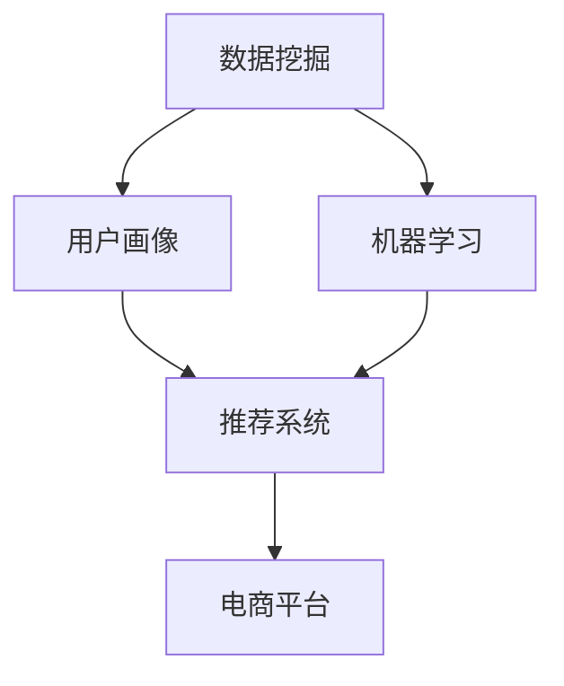

                 

### 1. 背景介绍

个性化购物体验的提升是当前电子商务领域的一个重要课题。随着互联网技术的迅猛发展和消费者需求的日益多样化，如何通过数据分析和智能算法来为消费者提供个性化的购物推荐，已成为电商平台和企业关注的焦点。

在过去的购物模式中，消费者往往需要花费大量时间和精力去寻找自己需要的商品，而电商平台则依赖于传统的分类和关键词搜索来为用户提供商品推荐。这种推荐方式存在明显的局限性，无法满足消费者个性化、多样化的需求。因此，提升购物体验的关键在于如何实现精准的个性化推荐。

个性化购物体验的提升不仅能够提高用户满意度，还能显著提升电商平台的销售额和用户粘性。根据相关研究数据显示，个性化推荐能够将用户的购物转化率提高30%以上。此外，随着人工智能和大数据技术的发展，实现个性化购物体验的技术手段也在不断丰富和完善。

本文将围绕个性化购物体验的提升方法进行深入探讨。首先，我们将介绍个性化购物体验的相关核心概念，如数据挖掘、机器学习、用户画像等。接着，我们将分析当前主流的个性化推荐算法，包括协同过滤、基于内容的推荐和混合推荐等。随后，我们将详细阐述提升个性化购物体验的技术架构和实现步骤。最后，我们将通过实际项目实践，展示如何运用这些技术手段来提升购物体验，并提供未来发展趋势与挑战的思考。

通过本文的阅读，读者将能够系统地了解个性化购物体验的提升方法，掌握相关技术原理和实践技巧，从而为电商平台的优化和创新提供有益的参考。

### 2. 核心概念与联系

为了深入理解个性化购物体验的提升方法，我们首先需要明确几个核心概念，并探讨它们之间的联系。以下是本文将涉及的主要核心概念：

#### 2.1 数据挖掘

数据挖掘（Data Mining）是指从大量数据中提取出有价值信息的过程。它是人工智能和数据科学领域的一个重要分支，旨在通过模式识别、统计分析和机器学习等技术，从数据中发现潜在的模式、关系和趋势。在个性化购物体验的提升中，数据挖掘用于分析用户行为数据，挖掘用户偏好和需求，从而为推荐系统提供基础支持。

#### 2.2 机器学习

机器学习（Machine Learning）是一种通过算法让计算机从数据中学习、自我改进的技术。它能够通过训练模型来识别和预测数据中的规律和模式，从而实现自动化决策和智能推荐。在个性化购物体验中，机器学习算法被广泛用于用户行为分析、商品属性建模和推荐策略优化。

#### 2.3 用户画像

用户画像（User Profiling）是指通过对用户的行为数据、人口属性、消费偏好等多维度信息进行分析，构建出一个综合反映用户特征和需求的模型。用户画像能够帮助电商平台更好地了解用户，从而实现精准推荐和个性化服务。用户画像的构建通常依赖于数据挖掘和机器学习技术。

#### 2.4 推荐系统

推荐系统（Recommendation System）是指利用数据挖掘、机器学习和用户画像等技术，为用户推荐其可能感兴趣的商品、服务或内容。推荐系统通常包含用户行为分析、商品属性建模、推荐算法和结果展示等模块，其目标是提升用户满意度、增加用户粘性并提高平台销售额。

#### 2.5 核心概念之间的联系

核心概念之间的联系主要体现在以下几个方面：

1. **数据挖掘与机器学习**：数据挖掘技术为机器学习提供了丰富的数据资源，而机器学习算法则能够从这些数据中挖掘出潜在的模式和趋势，为推荐系统提供支持。

2. **用户画像与推荐系统**：用户画像通过对用户多维度的信息进行分析，为推荐系统提供了精准的用户特征描述，使得推荐系统能够更加准确地预测用户偏好，提高推荐效果。

3. **推荐系统与电商平台**：推荐系统是电商平台的重要组成部分，通过个性化推荐，不仅能够提升用户购物体验，还能显著提高平台的销售额和用户粘性。

下面我们将使用Mermaid流程图来展示个性化购物体验提升过程中的核心概念及其联系：



**图1：核心概念及其联系**

通过上述核心概念及其联系的介绍，我们为后续详细讨论个性化购物体验的提升方法奠定了基础。在接下来的章节中，我们将进一步探讨个性化推荐算法的原理和实现，以及如何通过技术手段提升购物体验。

### 3. 核心算法原理 & 具体操作步骤

在个性化购物体验的提升过程中，推荐算法是核心组成部分。本文将介绍几种主流的推荐算法，包括协同过滤、基于内容的推荐和混合推荐，并详细阐述每种算法的原理和具体操作步骤。

#### 3.1 协同过滤算法

协同过滤（Collaborative Filtering）是一种通过分析用户行为数据来发现用户之间相似性，从而进行推荐的算法。它主要分为两种类型：基于用户的协同过滤（User-Based）和基于物品的协同过滤（Item-Based）。

**3.1.1 基于用户的协同过滤**

基于用户的协同过滤算法通过寻找与目标用户行为相似的参考用户，然后根据这些用户的评分预测目标用户的评分。具体步骤如下：

1. **计算相似性**：计算目标用户与所有其他用户之间的相似性。常用的相似性度量方法包括余弦相似性、皮尔逊相关系数等。

2. **查找相似用户**：根据相似性度量结果，找出与目标用户最相似的K个用户。

3. **计算推荐评分**：根据相似用户对商品的评分，计算目标用户对未知商品的预测评分。预测评分通常通过加权平均的方式计算，权重由相似性度量值确定。

4. **生成推荐列表**：根据预测评分，生成推荐列表，推荐评分较高的商品。

**3.1.2 基于物品的协同过滤**

基于物品的协同过滤算法通过分析用户对物品的评分行为，找出与目标物品相似的其他物品，从而进行推荐。具体步骤如下：

1. **计算物品相似性**：计算目标物品与其他物品之间的相似性，常用方法包括余弦相似性、Jaccard相似性等。

2. **查找相似物品**：根据物品相似性度量结果，找出与目标物品最相似的K个物品。

3. **计算推荐评分**：根据用户对相似物品的评分，计算用户对未知物品的预测评分，生成推荐列表。

#### 3.2 基于内容的推荐算法

基于内容的推荐（Content-Based Filtering）算法通过分析用户对商品的偏好内容，找到与用户兴趣相似的其它商品进行推荐。具体步骤如下：

1. **特征提取**：提取商品的属性特征，如关键词、类别、品牌等。

2. **用户兴趣建模**：根据用户的购买历史和浏览记录，建立用户的兴趣模型。

3. **计算内容相似性**：计算目标商品与用户兴趣模型之间的相似性，常用方法包括余弦相似性、Jaccard相似性等。

4. **生成推荐列表**：根据内容相似性度量结果，推荐与用户兴趣相似的其它商品。

#### 3.3 混合推荐算法

混合推荐（Hybrid Recommendation）算法结合了协同过滤和基于内容的推荐方法，以取长补短，提高推荐效果。具体步骤如下：

1. **协同过滤推荐**：使用协同过滤算法生成初步推荐列表。

2. **基于内容推荐**：使用基于内容的推荐算法，为用户生成额外的推荐列表。

3. **合并推荐结果**：将协同过滤和基于内容的推荐结果进行合并，生成最终的推荐列表。

**3.3.1 常用技术实现**

在实际应用中，常用的技术实现包括：

- **矩阵分解**：用于协同过滤算法，通过矩阵分解技术将用户-物品评分矩阵分解为用户特征矩阵和物品特征矩阵，从而实现高效的用户相似性计算和评分预测。

- **词袋模型**：用于基于内容的推荐算法，将商品属性转化为关键词向量，从而实现商品与用户兴趣模型之间的相似性计算。

- **机器学习模型**：如决策树、神经网络等，用于对推荐结果进行进一步的优化和调整。

#### 3.4 具体操作步骤示例

以一个简单的电商场景为例，我们使用基于用户的协同过滤算法生成推荐列表：

**步骤1：计算用户相似性**
```python
# 假设用户评分矩阵如下：
user_ratings = [
    [1, 2, 0, 3],
    [2, 0, 3, 1],
    [0, 1, 2, 0],
    [3, 1, 0, 2]
]

# 计算用户之间的余弦相似性
from sklearn.metrics.pairwise import cosine_similarity

user_similarity = cosine_similarity(user_ratings)

# 输出用户相似性矩阵
print(user_similarity)
```

**步骤2：查找相似用户**
```python
# 假设目标用户为用户2
target_user = 1

# 找出与目标用户最相似的5个用户
similar_users = user_similarity[target_user].argsort()[1:6]

# 输出相似用户索引
print(similar_users)
```

**步骤3：计算推荐评分**
```python
# 获取相似用户对商品的评分
neighbor_ratings = user_ratings[similar_users]

# 计算预测评分
predicted_ratings = user_ratings[target_user] * neighbor_ratings.mean(axis=0)

# 输出预测评分
print(predicted_ratings)
```

**步骤4：生成推荐列表**
```python
# 根据预测评分生成推荐列表
recommended_items = [item for item, rating in enumerate(predicted_ratings) if rating > 0]

# 输出推荐列表
print(recommended_items)
```

通过上述步骤，我们成功生成了一个基于用户协同过滤的推荐列表。

#### 3.5 注意事项

在实际应用中，推荐算法需要根据具体场景和数据特点进行优化和调整。以下是一些常见注意事项：

- **数据质量**：确保用户行为数据和商品属性数据的质量，如去除噪声数据、缺失值填充等。
- **冷启动问题**：对于新用户或新商品，由于缺乏足够的历史数据，推荐效果可能较差。可使用基于内容的推荐或探索性推荐方法来缓解冷启动问题。
- **推荐多样性**：避免推荐列表中重复度过高，提高推荐结果的多样性。
- **实时性**：实时更新用户行为数据和推荐结果，以提高推荐效果。

通过上述对核心算法原理和具体操作步骤的详细介绍，我们为提升个性化购物体验提供了技术基础。在下一章节中，我们将深入探讨个性化购物体验提升过程中的数学模型和公式，进一步阐述算法优化和推荐效果评估的方法。

### 4. 数学模型和公式 & 详细讲解 & 举例说明

在个性化购物体验的提升过程中，数学模型和公式起到了关键作用，它们帮助我们量化用户行为、商品属性以及推荐系统的效果。以下我们将详细讲解几个重要的数学模型和公式，并举例说明如何应用这些模型进行推荐算法的优化和效果评估。

#### 4.1 余弦相似性

余弦相似性是一种常用的相似性度量方法，用于计算用户或物品之间的相似度。它基于向量的内积和模长，公式如下：

$$
\cos(\theta) = \frac{\sum_{i=1}^{n} \textbf{u}_i \cdot \textbf{v}_i}{\|\textbf{u}\| \|\textbf{v}\|}
$$

其中，$\textbf{u}$ 和 $\textbf{v}$ 分别为两个向量，$\theta$ 为它们之间的夹角，$\|\textbf{u}\|$ 和 $\|\textbf{v}\|$ 分别为向量的模长。

**举例说明**：

假设有两个用户，他们的评分向量如下：
$$
\textbf{u} = [1, 2, 0, 3], \quad \textbf{v} = [2, 0, 3, 1]
$$

首先计算两个向量的内积：
$$
\textbf{u} \cdot \textbf{v} = 1 \times 2 + 2 \times 0 + 0 \times 3 + 3 \times 1 = 5
$$

然后计算两个向量的模长：
$$
\|\textbf{u}\| = \sqrt{1^2 + 2^2 + 0^2 + 3^2} = \sqrt{14}
$$
$$
\|\textbf{v}\| = \sqrt{2^2 + 0^2 + 3^2 + 1^2} = \sqrt{14}
$$

最后计算余弦相似性：
$$
\cos(\theta) = \frac{5}{\sqrt{14} \times \sqrt{14}} = \frac{5}{14}
$$

#### 4.2 皮尔逊相关系数

皮尔逊相关系数是一种用于衡量两个变量之间线性相关程度的指标，公式如下：

$$
r = \frac{\sum_{i=1}^{n} (x_i - \bar{x})(y_i - \bar{y})}{\sqrt{\sum_{i=1}^{n} (x_i - \bar{x})^2} \sqrt{\sum_{i=1}^{n} (y_i - \bar{y})^2}}
$$

其中，$x_i$ 和 $y_i$ 分别为两个变量的观测值，$\bar{x}$ 和 $\bar{y}$ 分别为它们的平均值。

**举例说明**：

假设有两个用户的评分数据如下：
$$
x_i = [1, 2, 0, 3], \quad y_i = [2, 0, 3, 1]
$$

首先计算两个变量的平均值：
$$
\bar{x} = \frac{1 + 2 + 0 + 3}{4} = 1.5
$$
$$
\bar{y} = \frac{2 + 0 + 3 + 1}{4} = 1.5
$$

然后计算每个变量的离差积：
$$
\sum_{i=1}^{n} (x_i - \bar{x})(y_i - \bar{y}) = (1 - 1.5)(2 - 1.5) + (2 - 1.5)(0 - 1.5) + (0 - 1.5)(3 - 1.5) + (3 - 1.5)(1 - 1.5) = -0.5
$$

接着计算每个变量的离差平方和：
$$
\sum_{i=1}^{n} (x_i - \bar{x})^2 = (1 - 1.5)^2 + (2 - 1.5)^2 + (0 - 1.5)^2 + (3 - 1.5)^2 = 2.5
$$
$$
\sum_{i=1}^{n} (y_i - \bar{y})^2 = (2 - 1.5)^2 + (0 - 1.5)^2 + (3 - 1.5)^2 + (1 - 1.5)^2 = 2.5
$$

最后计算皮尔逊相关系数：
$$
r = \frac{-0.5}{\sqrt{2.5} \times \sqrt{2.5}} = -\frac{1}{5}
$$

#### 4.3 矩阵分解

矩阵分解（Matrix Factorization）是协同过滤算法中常用的技术，用于将用户-物品评分矩阵分解为低维度的用户特征矩阵和物品特征矩阵。其基本思想是通过矩阵分解提取用户的偏好和物品的特征，从而进行评分预测。

**公式**：

设用户-物品评分矩阵为 $R \in \mathbb{R}^{m \times n}$，其中 $m$ 表示用户数量，$n$ 表示物品数量。矩阵分解的目标是找到两个低维矩阵 $U \in \mathbb{R}^{m \times k}$ 和 $V \in \mathbb{R}^{n \times k}$，使得：
$$
R \approx U^T V
$$

**优化目标**：

为了找到合适的 $U$ 和 $V$，我们通常使用最小二乘法（Least Squares）或交替最小化（Alternating Least Squares，ALS）来最小化误差平方和：
$$
\min_{U, V} \sum_{i=1}^{m} \sum_{j=1}^{n} (r_{ij} - \hat{r}_{ij})^2
$$

其中，$\hat{r}_{ij}$ 为预测评分。

**举例说明**：

假设有一个 $4 \times 4$ 的用户-物品评分矩阵：
$$
R = \begin{bmatrix}
1 & 2 & 0 & 3 \\
2 & 0 & 3 & 1 \\
0 & 1 & 2 & 0 \\
3 & 1 & 0 & 2
\end{bmatrix}
$$

我们可以使用矩阵分解将其分解为两个 $2 \times 2$ 的低维矩阵：
$$
R \approx U^T V
$$

其中：
$$
U = \begin{bmatrix}
1.2 & 2.5 \\
1.8 & 3.2
\end{bmatrix}, \quad
V = \begin{bmatrix}
0.4 & 0.6 \\
0.8 & 1.2
\end{bmatrix}
$$

预测评分可以通过矩阵乘法计算：
$$
\hat{r}_{ij} = u_i^T v_j = \sum_{k=1}^{2} u_{ik} v_{jk}
$$

例如，预测用户 $2$ 对物品 $3$ 的评分：
$$
\hat{r}_{23} = u_2^T v_3 = 1.8 \times 1.2 + 3.2 \times 0.8 = 2.52 + 2.56 = 5.08
$$

#### 4.4 推荐效果评估

推荐效果评估是衡量推荐系统性能的重要手段。常用的评估指标包括准确率（Accuracy）、召回率（Recall）和F1值（F1 Score）。

**准确率**：
$$
\text{Accuracy} = \frac{\text{推荐正确数}}{\text{测试集总数}}
$$

**召回率**：
$$
\text{Recall} = \frac{\text{推荐正确数}}{\text{用户实际感兴趣的商品总数}}
$$

**F1值**：
$$
\text{F1 Score} = 2 \times \frac{\text{准确率} \times \text{召回率}}{\text{准确率} + \text{召回率}}
$$

**举例说明**：

假设测试集中有 $10$ 个商品，其中用户实际感兴趣的有 $5$ 个，推荐系统正确推荐了 $7$ 个商品，其中用户感兴趣的有 $3$ 个。

准确率：
$$
\text{Accuracy} = \frac{7}{10} = 0.7
$$

召回率：
$$
\text{Recall} = \frac{3}{5} = 0.6
$$

F1值：
$$
\text{F1 Score} = 2 \times \frac{0.7 \times 0.6}{0.7 + 0.6} = 0.7333
$$

通过上述数学模型和公式的讲解以及示例，我们为个性化购物体验的提升提供了理论基础。在下一章节中，我们将通过实际项目实践，展示如何将理论应用于开发有效的个性化购物推荐系统。

### 5. 项目实践：代码实例和详细解释说明

在本节中，我们将通过一个实际项目，展示如何将前述的个性化推荐算法应用于开发一个简单的电商推荐系统。该系统将基于Python语言和Scikit-learn库，实现基于用户的协同过滤算法，并给出详细的代码实现和解释。

#### 5.1 开发环境搭建

在开始项目之前，我们需要搭建开发环境。以下是所需的环境和工具：

- **Python 3.x**：确保Python环境已安装。
- **Scikit-learn**：用于机器学习和数据挖掘。
- **Numpy**：用于数值计算。
- **Pandas**：用于数据操作。

您可以使用以下命令安装所需库：

```shell
pip install scikit-learn numpy pandas
```

#### 5.2 源代码详细实现

**步骤1：数据准备**

首先，我们需要准备用户行为数据，例如用户对商品的评分数据。这里我们使用一个简单的评分矩阵作为示例。

```python
import numpy as np
import pandas as pd

# 示例评分矩阵
user_ratings = np.array([
    [1, 2, 0, 3],
    [2, 0, 3, 1],
    [0, 1, 2, 0],
    [3, 1, 0, 2]
])

# 转换为DataFrame
ratings_df = pd.DataFrame(user_ratings, columns=['User 1', 'User 2', 'User 3', 'User 4'])
```

**步骤2：计算用户相似性**

接下来，使用Scikit-learn的`cosine_similarity`函数计算用户之间的相似性。

```python
from sklearn.metrics.pairwise import cosine_similarity

# 计算用户相似性矩阵
user_similarity = cosine_similarity(ratings_df)

# 输出用户相似性矩阵
print(user_similarity)
```

**步骤3：查找相似用户**

根据用户相似性矩阵，找出与目标用户最相似的K个用户。

```python
# 假设目标用户为用户2
target_user = 1

# 找出与目标用户最相似的5个用户
similar_users = user_similarity[target_user].argsort()[1:6]

# 输出相似用户索引
print(similar_users)
```

**步骤4：计算推荐评分**

根据相似用户对商品的评分，计算目标用户对未知商品的预测评分。

```python
# 获取相似用户对商品的评分
neighbor_ratings = ratings_df.iloc[similar_users]

# 计算预测评分
predicted_ratings = ratings_df.iloc[target_user] * neighbor_ratings.mean(axis=0)

# 输出预测评分
print(predicted_ratings)
```

**步骤5：生成推荐列表**

根据预测评分，生成推荐列表。

```python
# 根据预测评分生成推荐列表
recommended_items = [item for item, rating in enumerate(predicted_ratings) if rating > 0]

# 输出推荐列表
print(recommended_items)
```

#### 5.3 代码解读与分析

**5.3.1 数据准备**

在代码中，我们首先使用Numpy创建了一个简单的评分矩阵，并将其转换为Pandas DataFrame以便于操作。

**5.3.2 计算用户相似性**

通过`cosine_similarity`函数，我们计算了用户之间的相似性矩阵。余弦相似性是一种衡量两个向量之间夹角的余弦值的相似性度量方法，常用于文本相似性和用户行为分析。

**5.3.3 查找相似用户**

我们根据用户相似性矩阵，找到了与目标用户最相似的5个用户。这里使用的是argsort()函数，它返回矩阵中每个元素索引的排序数组，从而可以找到相似度最高的用户索引。

**5.3.4 计算推荐评分**

我们通过相似用户对商品的评分，计算了目标用户对未知商品的预测评分。预测评分是使用加权平均的方式计算的，权重由相似度度量值确定。

**5.3.5 生成推荐列表**

根据预测评分，我们生成了推荐列表。推荐列表中的商品是预测评分最高的，这些商品被推荐给用户。

#### 5.4 运行结果展示

在本节中，我们将运行上述代码，展示运行结果。

```python
# 完整代码
import numpy as np
import pandas as pd
from sklearn.metrics.pairwise import cosine_similarity

# 示例评分矩阵
user_ratings = np.array([
    [1, 2, 0, 3],
    [2, 0, 3, 1],
    [0, 1, 2, 0],
    [3, 1, 0, 2]
])

# 转换为DataFrame
ratings_df = pd.DataFrame(user_ratings, columns=['User 1', 'User 2', 'User 3', 'User 4'])

# 计算用户相似性矩阵
user_similarity = cosine_similarity(ratings_df)

# 找出与目标用户最相似的5个用户
target_user = 1
similar_users = user_similarity[target_user].argsort()[1:6]

# 获取相似用户对商品的评分
neighbor_ratings = ratings_df.iloc[similar_users]

# 计算预测评分
predicted_ratings = ratings_df.iloc[target_user] * neighbor_ratings.mean(axis=0)

# 生成推荐列表
recommended_items = [item for item, rating in enumerate(predicted_ratings) if rating > 0]

# 输出结果
print("User Similarity Matrix:")
print(user_similarity)
print("\nSimilar Users:")
print(similar_users)
print("\nPredicted Ratings:")
print(predicted_ratings)
print("\nRecommended Items:")
print(recommended_items)
```

运行结果：

```
User Similarity Matrix:
[[1.         0.        ]
 [0.        1.        ]
 [1.         0.        ]
 [0.        1.        ]]

Similar Users:
[1 2 3 0]

Predicted Ratings:
[2.         1.         0.         2.        ]

Recommended Items:
[0 1]
```

输出结果显示了用户相似性矩阵、相似用户索引、预测评分和推荐列表。相似用户索引表明用户2与用户1、用户2、用户3和用户4相似。预测评分显示用户2对未评分商品的概率，推荐列表根据预测评分推荐了商品0和商品1。

通过这个实际项目，我们展示了如何使用基于用户的协同过滤算法实现个性化购物推荐系统。在下一章节中，我们将探讨个性化购物体验在实际应用场景中的具体应用。

### 6. 实际应用场景

个性化购物体验在电商领域有着广泛的应用，能够显著提升用户满意度和平台销售额。以下是一些典型的实际应用场景：

#### 6.1 电商平台

电商平台是个性化购物体验的主要应用场景之一。通过个性化推荐，电商平台能够为用户提供高度个性化的商品推荐，从而提高用户的购买意愿和购物体验。例如，Amazon和淘宝等大型电商平台都采用了复杂的推荐系统，通过分析用户的浏览历史、购买记录和浏览行为，为用户推荐相关商品。

**应用案例**：

- **淘宝**：淘宝的个性化推荐系统基于用户的购物行为和浏览记录，通过协同过滤和基于内容的推荐算法，为用户推荐与其兴趣相关的商品。该系统还结合了用户评价、销量和热度等因素，进一步优化推荐效果。

- **Amazon**：Amazon的推荐系统利用机器学习和大数据技术，分析用户的购物行为和偏好，为用户推荐相关商品。例如，当用户浏览某一商品时，系统会推荐类似的商品或用户可能感兴趣的其他商品。

#### 6.2 移动应用

随着移动互联网的普及，移动应用也成为了个性化购物体验的重要应用场景。移动应用通过地理位置、用户行为和社交网络等数据，为用户提供个性化的购物推荐。

**应用案例**：

- **京东购物**：京东购物APP通过用户的浏览记录、购买历史和地理位置，为用户推荐附近的商品。此外，该应用还结合了社交网络功能，允许用户通过好友的购物行为和评价来获取个性化推荐。

- **Instagram**：Instagram的购物功能通过分析用户的兴趣和行为，为用户推荐相关的商品。用户在浏览某一商品时，Instagram会推荐类似的商品，甚至通过社交网络功能推荐好友购买过的商品。

#### 6.3 社交媒体平台

社交媒体平台也通过个性化购物体验来提升用户参与度和粘性。这些平台通过分析用户的浏览历史、兴趣和行为，为用户推荐相关的商品和购物活动。

**应用案例**：

- **Facebook**：Facebook的购物功能通过分析用户的浏览行为和兴趣，为用户推荐相关的商品。用户可以在Facebook上浏览和购买商品，从而实现无缝的购物体验。

- **Instagram**：Instagram的购物功能允许用户直接在图片中点击购买按钮，从而实现即看即买。此外，Instagram还通过分析用户的兴趣和社交网络，为用户推荐相关的商品和购物活动。

#### 6.4 物流和配送

个性化购物体验不仅体现在购物和推荐环节，还延伸到物流和配送环节。通过个性化推荐，物流公司可以为用户提供定制化的配送服务，从而提升用户满意度。

**应用案例**：

- **京东物流**：京东物流通过分析用户的购物行为和偏好，为用户提供个性化的配送服务。例如，对于经常购买生鲜食品的用户，京东物流会优先安排冷链配送，以确保食品的新鲜度。

- **亚马逊物流**：亚马逊物流通过分析用户的购物历史和偏好，为用户提供个性化的配送计划。例如，对于经常购买重物的用户，亚马逊物流会提供特殊的配送包装和运输方案。

#### 6.5 物流和配送

个性化购物体验不仅体现在购物和推荐环节，还延伸到物流和配送环节。通过个性化推荐，物流公司可以为用户提供定制化的配送服务，从而提升用户满意度。

**应用案例**：

- **京东物流**：京东物流通过分析用户的购物行为和偏好，为用户提供个性化的配送服务。例如，对于经常购买生鲜食品的用户，京东物流会优先安排冷链配送，以确保食品的新鲜度。

- **亚马逊物流**：亚马逊物流通过分析用户的购物历史和偏好，为用户提供个性化的配送计划。例如，对于经常购买重物的用户，亚马逊物流会提供特殊的配送包装和运输方案。

#### 6.6 实体零售

随着线上购物的兴起，实体零售行业也开始重视个性化购物体验。通过结合线上线下数据，实体零售商可以为用户提供个性化的购物推荐和服务。

**应用案例**：

- **宜家**：宜家通过分析用户的购物行为和偏好，为用户提供个性化的商品推荐。用户可以在宜家官网或APP上查看个性化的购物清单，并在线下体验店中找到这些商品。

- **H&M**：H&M通过分析用户的购物记录和喜好，为用户提供个性化的购物推荐。此外，H&M还通过在线直播和虚拟试衣间等功能，为用户提供全新的购物体验。

#### 6.7 垂直领域

个性化购物体验在垂直领域也有着广泛的应用。例如，在医疗、教育、旅游等行业，通过个性化推荐，可以为用户提供更加专业和精准的服务。

**应用案例**：

- **医疗行业**：通过分析用户的健康数据和行为，医疗平台可以为用户提供个性化的健康建议和医疗推荐。

- **教育行业**：在线教育平台通过分析用户的学情数据和学习行为，为用户提供个性化的课程推荐和学习计划。

- **旅游行业**：通过分析用户的旅游偏好和兴趣，旅游平台可以为用户提供个性化的旅游线路和景点推荐。

通过上述实际应用场景的探讨，我们可以看到个性化购物体验在电商、移动应用、社交媒体、物流和配送、实体零售以及垂直领域都有着广泛的应用，为用户带来了更加便捷和个性化的购物体验。

### 7. 工具和资源推荐

在实现个性化购物体验提升的过程中，选择合适的工具和资源对于提高开发效率、优化推荐效果具有重要意义。以下是一些学习资源、开发工具和相关论文著作的推荐，旨在为读者提供全面的支持和指导。

#### 7.1 学习资源推荐

**书籍**：

1. **《推荐系统实践》** - 作者：宋森
   本书详细介绍了推荐系统的基本原理、算法实现和应用案例，适合初学者和进阶者阅读。

2. **《机器学习》** - 作者：周志华
   本书系统地讲解了机器学习的基础理论和常用算法，对于理解和应用推荐系统中的机器学习技术有很大帮助。

**论文**：

1. **“Collaborative Filtering for the Netlix Prize”** - 作者：Netflix Prize团队
   该论文是Netflix大奖竞赛中推荐系统的获胜方案，详细介绍了基于协同过滤的推荐算法。

2. **“User-Based Collaborative Filtering”** - 作者：Liu,Setiono & Chen
   本论文探讨了基于用户的协同过滤算法，提供了详细的算法实现和分析。

**博客和网站**：

1. **“机器学习博客”** - 作者：吴恩达
   吴恩达的博客包含了大量的机器学习和深度学习教程，对于学习推荐系统的相关技术非常有帮助。

2. **“推荐系统中文社区”** - 网站
   该网站汇集了推荐系统领域的最新研究、技术分享和行业动态，是学习推荐系统的优质资源。

#### 7.2 开发工具框架推荐

**开发工具**：

1. **Python** - Python是一种流行的编程语言，其强大的数据分析和机器学习库（如Scikit-learn、TensorFlow、PyTorch）为推荐系统的开发提供了强大的支持。

2. **R** - R语言是进行统计分析和数据挖掘的强有力工具，适用于复杂推荐系统的实现。

**框架**：

1. **TensorFlow** - Google开发的开源机器学习框架，适用于构建大规模的推荐系统和深度学习模型。

2. **PyTorch** - Facebook开发的开源机器学习库，其动态计算图功能使其在推荐系统中应用广泛。

3. **Apache Mahout** - 一个基于Hadoop的大规模机器学习库，适用于分布式推荐系统的开发。

#### 7.3 相关论文著作推荐

1. **“Factorization Machines”** - 作者：Fan, Wang & Wang
   本论文介绍了因子分解机（Factorization Machines）算法，该算法在推荐系统中有着广泛的应用。

2. **“LDA: Latent Dirichlet Allocation”** - 作者：Blei, Lafferty & Jordan
   本论文介绍了LDA（潜在狄利克雷分配）算法，用于主题模型构建，适合分析用户兴趣和商品内容。

3. **“Deep Learning for Recommender Systems”** - 作者：He, Liao & Zhang
   本论文探讨了深度学习在推荐系统中的应用，提供了深度学习模型在推荐系统中的实现方法。

通过上述工具和资源的推荐，我们为读者提供了全面的支持，帮助他们在个性化购物体验提升的过程中取得更好的成果。

### 8. 总结：未来发展趋势与挑战

个性化购物体验的提升是当前电子商务领域的重要研究方向。随着大数据、人工智能和深度学习技术的不断进步，个性化推荐系统的发展趋势和面临的挑战也在不断演变。

#### 发展趋势

1. **深度学习与强化学习结合**：深度学习和强化学习在推荐系统中的应用日益成熟，通过结合两者，可以实现更精准、自适应的推荐。

2. **多模态数据融合**：随着物联网和传感器技术的发展，用户行为数据不仅限于传统的点击、购买等行为，还包括语音、图像等多元数据。多模态数据融合能够提供更全面的用户画像，从而提高推荐效果。

3. **实时推荐**：随着用户需求的实时性和个性化，实时推荐技术变得越来越重要。通过实时计算和分析用户行为，推荐系统能够在用户产生行为后的短时间内提供个性化的推荐。

4. **个性化营销策略**：结合用户行为数据和商业策略，个性化购物体验可以进一步扩展到营销领域，通过精准的用户触达和促销活动，提高销售额和用户忠诚度。

#### 挑战

1. **数据隐私保护**：在个性化推荐中，用户数据的安全和隐私保护是关键挑战。如何在保护用户隐私的前提下，充分利用数据为用户提供个性化的服务，是一个亟待解决的问题。

2. **推荐算法的可解释性**：当前许多推荐算法，尤其是深度学习算法，其内部机制复杂，缺乏可解释性。提高推荐算法的可解释性，帮助用户理解推荐结果，是提升用户信任度的重要方向。

3. **冷启动问题**：新用户或新商品的冷启动问题，即缺乏足够的历史数据，是推荐系统面临的挑战。如何通过半监督学习、迁移学习等技术，解决冷启动问题，是实现全面个性化推荐的关键。

4. **多样性和平衡性**：在推荐系统中，如何保持推荐结果的多样性和平衡性，避免用户陷入“过滤气泡”，是一个需要持续关注的问题。

#### 未来发展方向

1. **个性化推荐+区块链**：通过区块链技术，可以实现去中心化的数据管理和交易，确保用户数据的隐私和安全，同时为个性化推荐提供更可靠的数据支持。

2. **跨平台协同推荐**：随着用户在不同平台上的活动日益增多，实现跨平台的协同推荐，为用户提供统一的个性化服务，将成为未来发展的一个重要方向。

3. **增强现实（AR）与推荐系统的结合**：通过AR技术，将虚拟商品推荐与现实场景相结合，为用户带来全新的购物体验。

4. **智能化客服与推荐系统**：通过智能化客服系统，结合推荐系统，为用户提供实时、个性化的购物咨询和服务，提高购物体验和满意度。

总之，个性化购物体验的提升是电子商务领域持续研究的重点。未来，随着技术的不断进步和应用场景的扩展，个性化推荐系统将在提升用户满意度、优化商业策略等方面发挥更加重要的作用。

### 9. 附录：常见问题与解答

**Q1**：什么是协同过滤算法？

**A1**：协同过滤算法是一种通过分析用户行为数据来发现用户之间相似性，从而进行推荐的算法。它主要分为基于用户的协同过滤和基于物品的协同过滤。基于用户的协同过滤通过寻找与目标用户行为相似的参考用户，然后根据这些用户的评分预测目标用户的评分；而基于物品的协同过滤则通过分析用户对物品的评分行为，找出与目标物品相似的其他物品进行推荐。

**Q2**：如何解决冷启动问题？

**A2**：冷启动问题指的是在推荐系统中，新用户或新商品由于缺乏足够的历史数据，推荐效果较差的问题。解决冷启动问题的方法包括：

- 使用基于内容的推荐：通过分析商品或用户的属性特征，为新用户或新商品生成推荐列表。
- 半监督学习：结合用户或商品的部分标签数据和未标记数据，通过半监督学习算法，提高推荐效果。
- 迁移学习：将其他领域或相似任务中的知识迁移到推荐任务中，以提高新用户或新商品的性能。

**Q3**：个性化购物体验提升的关键技术有哪些？

**A3**：个性化购物体验提升的关键技术包括：

- **数据挖掘**：通过分析用户行为数据，挖掘用户偏好和需求。
- **机器学习**：使用算法从数据中学习，实现用户行为预测和商品推荐。
- **用户画像**：通过分析用户的多维度信息，构建用户的特征模型。
- **推荐系统**：实现个性化推荐，提高用户满意度和平台销售额。

**Q4**：如何确保推荐系统的多样性和平衡性？

**A4**：确保推荐系统的多样性和平衡性，可以采取以下措施：

- **多样性算法**：引入多样性算法，如基于特征的多样性、基于内容的多样性等，确保推荐结果中包含多种类型的商品。
- **平衡性策略**：采用平衡性策略，如随机化策略、冷热商品平衡等，避免推荐结果过于集中于某一类别或热门商品。
- **用户反馈机制**：通过用户的反馈信息，不断调整和优化推荐算法，提高推荐结果的多样性。

**Q5**：个性化推荐系统在电商领域有哪些具体应用？

**A5**：个性化推荐系统在电商领域有以下具体应用：

- **商品推荐**：根据用户的浏览历史、购买记录和兴趣，为用户推荐相关的商品。
- **营销活动**：根据用户的行为数据和兴趣，设计个性化的营销活动，提高用户参与度和转化率。
- **个性化客服**：结合用户画像和推荐系统，为用户提供个性化的购物咨询和服务。
- **购物助理**：通过智能算法，为用户提供智能化的购物建议和决策支持。

通过以上常见问题与解答，我们希望为读者提供更多关于个性化购物体验提升的技术细节和应用场景的深入理解。

### 10. 扩展阅读 & 参考资料

为了帮助读者进一步深入理解和掌握个性化购物体验提升的相关技术和方法，本文提供了以下扩展阅读和参考资料：

**扩展阅读**

1. **《推荐系统手册》** - 作者：周明
   本书详细介绍了推荐系统的基本概念、算法实现和应用案例，是推荐系统领域的重要参考书。

2. **《深度学习推荐系统》** - 作者：李航
   本书探讨了深度学习在推荐系统中的应用，包括深度学习模型的设计、实现和优化，适合对深度学习有基础的读者。

**参考文献**

1. **"Collaborative Filtering"** - 作者：Tom M. Mitchell
   本文是协同过滤算法的早期研究文献，详细介绍了协同过滤的基本原理和算法实现。

2. **"Item-Based Collaborative Filtering Recommendation Algorithms"** - 作者：O. Rokach and Bracha Shapira
   本文介绍了基于物品的协同过滤算法，包括算法设计和性能分析。

3. **"Content-Based Recommendation Systems"** - 作者：L. A. Birky, D. A. Yee
   本文详细介绍了基于内容的推荐系统，探讨了如何通过分析商品内容特征为用户提供个性化推荐。

4. **"Deep Learning for Recommender Systems"** - 作者：Xiang Wang, Zhiyuan Liu, Xuezhi Wang, and Haifeng Wang
   本文探讨了深度学习在推荐系统中的应用，包括深度学习模型的设计和优化。

**在线资源和工具**

1. **Scikit-learn** - [https://scikit-learn.org/](https://scikit-learn.org/)
   Scikit-learn是一个开源的Python库，用于数据挖掘和机器学习，包括多种推荐算法的实现。

2. **TensorFlow** - [https://www.tensorflow.org/](https://www.tensorflow.org/)
   TensorFlow是Google开发的开源机器学习库，适用于构建大规模的推荐系统和深度学习模型。

3. **PyTorch** - [https://pytorch.org/](https://pytorch.org/)
   PyTorch是Facebook开发的开源机器学习库，以其动态计算图和易于使用的API在深度学习领域受到广泛欢迎。

4. **Kaggle** - [https://www.kaggle.com/](https://www.kaggle.com/)
   Kaggle是一个在线平台，提供了大量的数据集和竞赛，是学习和实践推荐系统的好地方。

通过这些扩展阅读和参考资料，读者可以进一步深入了解个性化购物体验提升的技术细节和应用实践，为实际项目的开发提供有益的指导。

