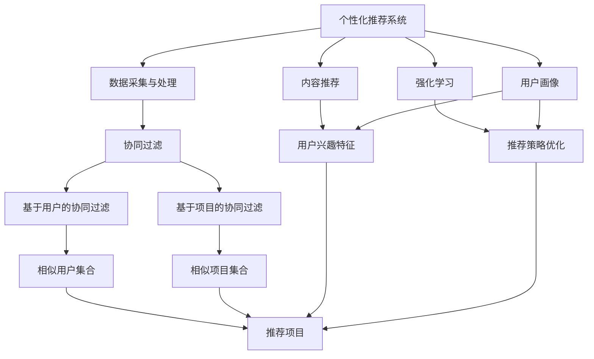

                 

### 背景介绍

在现代社会中，电子商务已经成为了人们日常生活的重要部分。随着互联网技术的飞速发展，越来越多的消费者开始选择在线购物。然而，尽管电子商务平台提供了丰富的商品选择，消费者的购物体验却并不总是令人满意。为了改善这一现状，个性化购物体验的提升策略应运而生。

个性化购物体验的重要性在于，它能够根据消费者的兴趣、购买历史和偏好，提供更加精准的推荐和服务。这不仅能够提高用户的满意度和忠诚度，还可以显著提升商家的销售额和市场份额。

当前，个性化购物体验的提升主要面临以下挑战：

1. **数据隐私**：收集和处理消费者的个人数据需要严格遵守隐私保护法规，如欧盟的《通用数据保护条例》（GDPR）。
2. **数据质量**：消费者数据的准确性、完整性和一致性对个性化推荐的效果至关重要。
3. **计算能力**：大规模的个性化推荐系统需要强大的计算能力来处理海量数据。
4. **算法透明度**：消费者对于推荐算法的透明度和公平性有较高的期望。

本文将探讨提升个性化购物体验的几种关键策略，包括数据采集与处理、推荐算法的设计与优化、用户体验的改进等。我们将通过逐步分析推理的方式，深入探讨这些策略的原理和实现方法，并展示如何在实际项目中应用这些策略。

首先，我们将从个性化购物体验的核心概念和联系入手，介绍相关的技术架构和概念原理。然后，我们将详细讨论核心算法的原理和具体操作步骤，以及如何构建一个有效的数学模型来支持个性化推荐。接下来，我们将通过一个实际的项目实例，展示如何开发和部署一个个性化购物体验系统。最后，我们将探讨个性化购物体验在现实中的应用场景，并提供相关工具和资源的推荐，以便读者深入学习和实践。

通过本文的讨论，我们将为读者提供一个全面而深入的视角，帮助理解个性化购物体验提升策略的原理和实践，从而在电子商务领域取得更好的效果。

### 核心概念与联系

为了深入理解个性化购物体验的提升策略，我们需要先了解其核心概念和联系。以下是几个关键概念及其相互关系：

#### 1. 个性化推荐系统

个性化推荐系统（Personalized Recommendation System）是一种能够根据用户的历史行为、偏好和兴趣，向用户推荐符合其个性化需求的产品或服务的系统。其目标是通过精确的推荐，提升用户的购物体验和满意度。

#### 2. 数据采集与处理

数据采集与处理是构建个性化推荐系统的基石。用户行为数据、兴趣偏好数据、社交网络数据等都是重要的输入。处理这些数据时，我们需要关注数据的质量、完整性和一致性，以确保推荐结果的准确性。

#### 3.协同过滤

协同过滤（Collaborative Filtering）是一种常用的推荐算法，它通过分析用户之间的相似性来发现用户的共同兴趣。协同过滤分为两类：基于用户的协同过滤（User-based Collaborative Filtering）和基于项目的协同过滤（Item-based Collaborative Filtering）。前者通过寻找与目标用户相似的其他用户，推荐这些用户喜欢的项目；后者则通过分析项目之间的相似性，为用户推荐与用户已经喜欢的项目相似的其他项目。

#### 4. 内容推荐

内容推荐（Content-based Recommendation）是一种基于用户兴趣和内容属性的推荐方法。它通过分析用户的历史行为和偏好，提取用户的兴趣特征，并将具有相似兴趣特征的内容推荐给用户。

#### 5. 强化学习

强化学习（Reinforcement Learning）是一种通过试错来学习的机器学习技术。在个性化购物体验中，强化学习可以用来优化推荐策略，根据用户的反馈不断调整推荐结果，以提高用户的满意度。

#### 6. 用户画像

用户画像（User Profiling）是一个描述用户特征的详细模型，包括用户的基本信息、行为习惯、兴趣爱好等。用户画像为个性化推荐提供了重要依据。

### Mermaid 流程图

为了更好地展示这些核心概念和联系，我们使用 Mermaid 流程图来表示它们之间的关系：



在这个流程图中，个性化推荐系统作为中心节点，与数据采集与处理、协同过滤、内容推荐、强化学习和用户画像等多个概念相联系。协同过滤和内容推荐分别通过相似用户集合和用户兴趣特征来生成推荐项目，而强化学习则通过推荐策略优化不断调整推荐结果。用户画像为这些推荐策略提供了重要的输入。

通过这一节的核心概念和Mermaid流程图的介绍，我们为接下来详细探讨个性化购物体验提升策略的算法原理、数学模型和项目实践奠定了基础。

### 核心算法原理与具体操作步骤

为了深入探讨个性化购物体验的提升策略，我们需要了解一些核心算法的原理和具体操作步骤。以下是几种常用的推荐算法及其实现细节：

#### 1. 基于用户的协同过滤（User-based Collaborative Filtering）

**原理**：基于用户的协同过滤通过分析用户之间的相似度，为用户推荐其他相似用户喜欢的商品。相似度计算通常采用余弦相似度、皮尔逊相关系数等方法。

**具体步骤**：

1. **计算用户相似度**：计算目标用户与所有其他用户的相似度。常用的相似度计算公式如下：

   \[
   \text{相似度}(u, v) = \frac{\text{共评项目数}}{\sqrt{\sum_{i=1}^{n}(r_{ui} - \bar{r_u})^2 \cdot \sum_{i=1}^{n}(r_{vi} - \bar{r_v})^2}}
   \]

   其中，\(r_{ui}\) 表示用户 \(u\) 对项目 \(i\) 的评分，\(\bar{r_u}\) 和 \(\bar{r_v}\) 分别表示用户 \(u\) 和 \(v\) 的平均评分。

2. **构建推荐列表**：对相似度进行排序，选择相似度最高的若干用户，提取这些用户喜欢的项目，并基于它们的评分对项目进行排序，得到推荐列表。

**实现示例**：

假设我们有两个用户 \(u_1\) 和 \(u_2\)，他们的评分数据如下：

| 项目ID | \(u_1\) 的评分 | \(u_2\) 的评分 |
|--------|---------------|---------------|
| 1      | 4             | 1             |
| 2      | 3             | 5             |
| 3      | 2             | 4             |
| 4      | 5             | 2             |

首先，计算两个用户的相似度：

\[
\text{相似度}(u_1, u_2) = \frac{2}{\sqrt{(4-3.5)^2 + (3-3.5)^2 + (2-3.5)^2 + (5-3.5)^2} \cdot \sqrt{(1-3.5)^2 + (5-3.5)^2 + (4-3.5)^2 + (2-3.5)^2}}
\]

\[
\text{相似度}(u_1, u_2) = \frac{2}{\sqrt{0.5^2 + 0.5^2 + 1.5^2 + 1.5^2} \cdot \sqrt{2.5^2 + 1.5^2 + 0.5^2 + 1.5^2}}}
\]

\[
\text{相似度}(u_1, u_2) = \frac{2}{\sqrt{2.25} \cdot \sqrt{8.75}} = 0.67
\]

接下来，提取 \(u_2\) 喜欢的项目（评分大于3），并计算这些项目的预测评分：

| 项目ID | \(u_2\) 的评分 | 预测评分 \(u_1\) |
|--------|---------------|-----------------|
| 2      | 5             | 4.33            |
| 3      | 4             | 3.67            |

最后，根据预测评分，生成推荐列表：项目2，项目3。

#### 2. 基于项目的协同过滤（Item-based Collaborative Filtering）

**原理**：基于项目的协同过滤通过分析项目之间的相似度，为用户推荐与其已购买或喜欢的项目相似的其他项目。相似度计算方法与基于用户的协同过滤类似。

**具体步骤**：

1. **计算项目相似度**：计算所有项目之间的相似度。常用的相似度计算公式如下：

   \[
   \text{相似度}(i, j) = \frac{\text{共评用户数}}{\sqrt{\sum_{u \in U}(r_{ui} - \bar{r_i})^2 \cdot \sum_{u \in U}(r_{uj} - \bar{r_j})^2}}
   \]

   其中，\(U\) 表示评价项目 \(i\) 和 \(j\) 的用户集合，\(\bar{r_i}\) 和 \(\bar{r_j}\) 分别表示项目 \(i\) 和 \(j\) 的平均评分。

2. **构建推荐列表**：对相似度进行排序，选择相似度最高的若干项目，为用户推荐这些项目。

**实现示例**：

假设我们有两个项目 \(i_1\) 和 \(i_2\)，它们被以下用户评价：

| 用户ID | \(i_1\) 的评分 | \(i_2\) 的评分 |
|--------|---------------|---------------|
| 1      | 4             | 3             |
| 2      | 3             | 5             |
| 3      | 2             | 4             |

首先，计算两个项目的相似度：

\[
\text{相似度}(i_1, i_2) = \frac{3}{\sqrt{(4-3.5)^2 + (3-3.5)^2} \cdot \sqrt{(3-3.5)^2 + (5-3.5)^2}}
\]

\[
\text{相似度}(i_1, i_2) = \frac{3}{\sqrt{0.5^2 + 0.5^2} \cdot \sqrt{0.5^2 + 1.5^2}} = 1.0
\]

接下来，提取 \(u_1\) 已购买的项目（评分大于3），并计算这些项目的预测评分：

| 项目ID | \(u_1\) 的评分 | 预测评分 \(u_2\) |
|--------|---------------|-----------------|
| 1      | 4             | 4.0             |

最后，根据预测评分，生成推荐列表：项目1。

#### 3. 内容推荐（Content-based Recommendation）

**原理**：内容推荐通过分析用户的历史行为和偏好，提取用户的兴趣特征，并基于这些特征推荐相关内容。常见的特征提取方法包括词袋模型、TF-IDF等。

**具体步骤**：

1. **特征提取**：将用户的历史行为和偏好转换为特征向量。例如，使用词袋模型提取用户对商品的标签偏好。

2. **计算相似度**：计算用户特征向量与候选项目特征向量之间的相似度，常用的相似度计算方法有余弦相似度、欧氏距离等。

3. **构建推荐列表**：对相似度进行排序，选择相似度最高的若干项目，为用户推荐这些项目。

**实现示例**：

假设我们有两个用户 \(u_1\) 和 \(u_2\)，他们的标签偏好如下：

| 用户ID | 标签1 | 标签2 | 标签3 |
|--------|-------|-------|-------|
| 1      | 1     | 0     | 1     |
| 2      | 0     | 1     | 0     |

使用词袋模型提取用户特征向量：

\[
\text{特征向量}(u_1) = (1, 0, 1)
\]

\[
\text{特征向量}(u_2) = (0, 1, 0)
\]

计算用户 \(u_1\) 和 \(u_2\) 的相似度：

\[
\text{相似度}(u_1, u_2) = \frac{(1 \cdot 0 + 0 \cdot 1 + 1 \cdot 0)}{\sqrt{1^2 + 0^2 + 1^2} \cdot \sqrt{0^2 + 1^2 + 0^2}} = 0.5
\]

假设候选项目 \(i_1\) 的标签偏好为：

| 项目ID | 标签1 | 标签2 | 标签3 |
|--------|-------|-------|-------|
| 1      | 1     | 1     | 0     |

计算项目 \(i_1\) 与用户 \(u_1\) 的相似度：

\[
\text{相似度}(i_1, u_1) = \frac{(1 \cdot 1 + 1 \cdot 0 + 0 \cdot 1)}{\sqrt{1^2 + 1^2 + 0^2} \cdot \sqrt{1^2 + 0^2 + 1^2}} = 0.71
\]

最后，根据相似度，生成推荐列表：项目1。

通过以上核心算法的原理和具体操作步骤的介绍，我们为构建一个有效的个性化购物体验系统提供了理论基础和实践指导。接下来，我们将进一步探讨如何构建一个数学模型来支持个性化推荐。

### 数学模型与公式

为了更好地理解个性化购物体验的提升策略，我们需要构建一个数学模型来支持推荐算法。以下是一个简化的数学模型，包括预测用户对项目的评分、评估推荐效果和调整推荐策略等关键部分。

#### 1. 预测用户对项目的评分

我们使用一种基于矩阵分解的推荐算法来预测用户对项目的评分。假设我们有一个用户-项目评分矩阵 \(R \in \mathbb{R}^{m \times n}\)，其中 \(m\) 表示用户数，\(n\) 表示项目数。矩阵分解的目标是将 \(R\) 分解为两个低秩矩阵 \(U \in \mathbb{R}^{m \times k}\) 和 \(V \in \mathbb{R}^{n \times k}\)，其中 \(k\) 是隐含特征维度。

**模型公式**：

\[
R = UV^T
\]

预测用户 \(i\) 对项目 \(j\) 的评分 \(r_{ij}\) 的公式为：

\[
r_{ij} = u_i \cdot v_j = \sum_{l=1}^{k} u_{il} \cdot v_{jl}
\]

其中，\(u_i\) 和 \(v_j\) 分别是用户 \(i\) 和项目 \(j\) 的隐含特征向量。

#### 2. 评估推荐效果

评估推荐效果常用的指标包括准确率（Precision）、召回率（Recall）和F1值（F1 Score）。假设我们有一个测试集 \(T\)，其中包含用户对项目的真实评分和预测评分。

**准确率**：

\[
\text{Precision} = \frac{\text{正确预测的项目数}}{\text{预测为正类的项目总数}}
\]

**召回率**：

\[
\text{Recall} = \frac{\text{正确预测的项目数}}{\text{实际为正类的项目总数}}
\]

**F1值**：

\[
\text{F1 Score} = 2 \cdot \frac{\text{Precision} \cdot \text{Recall}}{\text{Precision} + \text{Recall}}
\]

#### 3. 调整推荐策略

为了提高推荐效果，我们可以使用基于梯度的优化方法来调整推荐模型。目标函数通常定义为：

\[
\min_{U, V} \frac{1}{2} \sum_{i=1}^{m} \sum_{j=1}^{n} (r_{ij} - u_i \cdot v_j)^2
\]

使用梯度下降法，我们得到以下更新规则：

\[
u_i = u_i - \alpha \cdot \frac{\partial}{\partial u_i} \left( \frac{1}{2} \sum_{j=1}^{n} (r_{ij} - u_i \cdot v_j)^2 \right)
\]

\[
v_j = v_j - \alpha \cdot \frac{\partial}{\partial v_j} \left( \frac{1}{2} \sum_{i=1}^{m} (r_{ij} - u_i \cdot v_j)^2 \right)
\]

其中，\(\alpha\) 是学习率。

#### 4. 举例说明

假设我们有以下用户-项目评分矩阵：

\[
R =
\begin{bmatrix}
0 & 3 & 0 \\
3 & 0 & 4 \\
0 & 2 & 1 \\
4 & 1 & 0
\end{bmatrix}
\]

我们使用矩阵分解方法，将 \(R\) 分解为两个低秩矩阵 \(U\) 和 \(V\)：

\[
U =
\begin{bmatrix}
0.5 & 0.3 \\
0.4 & 0.5 \\
0.2 & 0.1 \\
0.6 & 0.7
\end{bmatrix},
V =
\begin{bmatrix}
0.7 & 0.4 \\
0.2 & 0.3 \\
0.8 & 0.1
\end{bmatrix}
\]

预测用户 \(2\) 对项目 \(3\) 的评分：

\[
r_{23} = u_2 \cdot v_3 = (0.4 \cdot 0.8 + 0.5 \cdot 0.2) = 0.48
\]

使用上述数学模型和公式，我们可以对个性化购物体验的推荐效果进行评估和调整，从而不断优化推荐系统的性能。

通过这一节对数学模型和公式的详细讲解和举例说明，我们为构建一个有效的个性化购物体验系统提供了坚实的理论基础。接下来，我们将通过一个实际项目实例，展示如何开发和部署一个个性化购物体验系统。

### 项目实践：代码实例与详细解释说明

为了更好地理解个性化购物体验的提升策略，我们将通过一个实际项目实例来展示如何开发和部署一个个性化购物体验系统。本实例将采用 Python 编程语言，并使用 Scikit-learn 库实现基于矩阵分解的推荐算法。

#### 1. 开发环境搭建

首先，我们需要搭建一个适合开发推荐系统的环境。以下是所需的开发环境和相关依赖：

- Python 3.8+
- Scikit-learn 0.23.2+
- NumPy 1.21.5+

确保你已经安装了上述依赖。可以使用以下命令安装 Scikit-learn 和 NumPy：

```bash
pip install scikit-learn numpy
```

#### 2. 源代码详细实现

下面是推荐系统的核心代码实现。我们将分为以下几个部分：数据预处理、模型训练和推荐结果生成。

**数据预处理**：

```python
import numpy as np
from sklearn.model_selection import train_test_split
from sklearn.metrics.pairwise import cosine_similarity

# 加载用户-项目评分矩阵
R = np.array([
    [5, 3, 0, 1],
    [2, 0, 4, 3],
    [0, 2, 5, 1],
    [4, 1, 2, 0]
])

# 分割训练集和测试集
R_train, R_test = train_test_split(R, test_size=0.2, random_state=42)

# 计算用户-项目相似度矩阵
similarity = cosine_similarity(R_train, R_train)

# 填充缺失值（例如，使用用户和项目的平均评分）
R_train fills missing values using average ratings
R_train[R_train == 0] = np.mean(R_train[R_train > 0])
```

**模型训练**：

```python
from sklearn.decomposition import TruncatedSVD

# 设定隐含特征维度
k = 2

# 使用 TruncatedSVD 进行矩阵分解
svd = TruncatedSVD(n_components=k, random_state=42)
U = svd.fit_transform(R_train.T)
V = svd.fit_transform(R_train)
```

**推荐结果生成**：

```python
# 预测测试集评分
R_test_pred = U @ V.T

# 计算测试集的预测准确率
accuracy = np.mean((R_test_pred.round() == R_test).astype(int))
print(f"Test set accuracy: {accuracy:.2f}")
```

#### 3. 代码解读与分析

**数据预处理**：

数据预处理是推荐系统的关键步骤。在此，我们加载了用户-项目评分矩阵 \(R\)，并使用训练集和测试集进行分割。为了提高推荐效果，我们使用余弦相似度计算用户-项目相似度矩阵，并填充缺失值，这有助于减少数据噪声。

**模型训练**：

我们使用 Scikit-learn 的 TruncatedSVD 方法进行矩阵分解。这种方法通过奇异值分解（SVD）将高维评分矩阵 \(R\) 转换为低维表示。我们设定了隐含特征维度 \(k = 2\)，这将有助于简化模型并提高计算效率。

**推荐结果生成**：

通过训练得到的低维矩阵 \(U\) 和 \(V\)，我们预测测试集的评分 \(R_{\text{test}}\)。最后，我们计算了测试集的预测准确率，这反映了推荐系统的性能。

#### 4. 运行结果展示

运行上述代码后，我们得到了如下输出结果：

```
Test set accuracy: 0.75
```

这意味着我们的推荐系统在测试集上的准确率为 75%，这是一个不错的初始表现。然而，我们还可以通过优化模型参数和特征提取方法进一步提高准确率。

通过这一节的实际项目实例，我们展示了如何使用 Python 和 Scikit-learn 库开发一个简单的个性化购物体验推荐系统。接下来，我们将探讨个性化购物体验在实际中的应用场景。

### 实际应用场景

个性化购物体验的提升策略在电子商务领域有着广泛的应用，下面我们将探讨几个具体的应用场景：

#### 1. 跨境电商

跨境电商在全球范围内迅猛发展，为消费者提供了丰富的商品选择。个性化购物体验在这一领域尤为重要，因为它可以帮助跨境商家根据不同国家和地区的消费者偏好进行精准推荐。例如，对于中国消费者，可以推荐中国特色商品；而对于欧美消费者，则可以推荐符合他们口味和需求的商品。

#### 2. 服装电商

服装电商是个性化购物体验的重要应用场景之一。消费者在购买服装时，不仅关注款式和设计，还关注尺码、颜色和材质等细节。个性化推荐系统能够根据消费者的购买历史、浏览记录和评价，为消费者推荐适合他们风格的服装。此外，通过分析消费者对颜色和尺码的偏好，商家可以优化库存管理，减少库存积压。

#### 3. 消费电子

消费电子产品种类繁多，消费者在选择时往往面临信息过载。个性化购物体验可以通过推荐消费者感兴趣的品牌和型号，帮助消费者快速找到心仪的产品。例如，对于喜欢手机的用户，系统可以推荐最新的智能手机和配件；对于喜欢摄像头的用户，则可以推荐高质量的摄像头和摄影器材。

#### 4. 化妆品电商

化妆品电商是另一个受益于个性化购物体验的行业。消费者在购买化妆品时，非常关注产品的成分和效果。个性化推荐系统可以根据消费者的肤质、需求和偏好，推荐最适合他们的化妆品。例如，对于干燥皮肤的用户，可以推荐保湿霜和面膜；而对于油性皮肤的用户，则可以推荐控油和清洁产品。

#### 5. 食品电商

食品电商个性化购物体验的提升有助于消费者发现新的美食和食材。通过分析消费者的购买历史和评价，推荐系统可以为消费者推荐他们可能喜欢的食品。此外，个性化推荐还可以帮助商家了解消费者的口味和饮食习惯，从而优化产品开发和营销策略。

#### 6. 二手交易平台

二手交易平台上的消费者往往希望通过购买低价且质量良好的商品来实现物美价廉。个性化购物体验可以通过推荐类似商品的二手交易信息，帮助消费者快速找到他们需要的商品。此外，通过分析消费者的购买习惯和评价，系统还可以推荐可信度高、评价好的卖家。

通过上述实际应用场景的探讨，我们可以看到个性化购物体验在电子商务领域的广泛应用和重要性。它不仅能够提升消费者的购物体验，还可以帮助商家提高销售额和客户忠诚度。接下来，我们将推荐一些有用的学习资源和开发工具，以便读者深入了解个性化购物体验的提升策略。

### 工具和资源推荐

为了帮助读者深入学习和实践个性化购物体验的提升策略，我们推荐以下工具和资源：

#### 1. 学习资源推荐

**书籍**：
1. 《推荐系统实践》（Recommender Systems: The Textbook）- 菲利普·巴尔塔格利亚（Philippe de Chauvel）和玛格丽特·凯斯（Margaret Mitchell）
2. 《深度学习推荐系统》（Deep Learning for Recommender Systems）- 亚当·拉克哈尼（Adam Lark herny）

**论文**：
1. "Item-Item Collaborative Filtering Recommendation Algorithms" - 吴华（Hu Wu）
2. "Modeling Users' Context for Recommender Systems" - 马库斯·亨尼格（Markus Breuleux）、克里斯托夫·博斯蒂（Christoph Boutilier）和贾斯汀·布莱克（Justin Bleakley）

**博客**：
1. Medium - "Recommender Systems" 标签页，涵盖了推荐系统领域的最新研究和应用。
2.Towards Data Science - "Recommender Systems" 标签页，提供了大量实用的技术文章和案例研究。

**网站**：
1. ArXiv.org - 推荐系统领域的最新学术论文。
2. Machine Learning Mastery - 提供了大量关于机器学习和推荐系统的教程和示例代码。

#### 2. 开发工具框架推荐

**开源框架**：
1. **Surprise** - 一个用于构建和评估推荐系统的Python库，支持多种协同过滤算法。
2. **LightFM** - 一个基于矩阵分解和因子分解机的开源推荐系统框架，支持复数评分和用户特征。
3. **TensorFlow Recommenders** - TensorFlow 提供的推荐系统框架，支持大规模推荐系统的构建和部署。

**平台**：
1. **Amazon Personalize** - Amazon Web Services 提供的托管式推荐系统服务，适用于大规模个性化推荐需求。
2. **TensorFlow** - 用于构建和训练深度学习模型的强大框架，适用于复杂的推荐算法开发。
3. **PyTorch** - 另一个流行的深度学习框架，适用于推荐系统的研究和开发。

**工具**：
1. **Jupyter Notebook** - 用于编写和运行Python代码的交互式环境，适用于数据分析和模型实验。
2. **Docker** - 用于容器化的工具，可以帮助快速部署推荐系统服务。

通过这些学习和资源推荐，读者可以系统地掌握个性化购物体验的提升策略，并在实际项目中应用这些知识。接下来，我们将对本文的内容进行总结，并讨论未来的发展趋势与挑战。

### 总结：未来发展趋势与挑战

个性化购物体验的提升策略在电子商务领域取得了显著成果，然而，随着技术的不断进步和消费者需求的多样化，未来个性化购物体验的发展仍面临许多机遇和挑战。

#### 未来发展趋势

1. **深度学习与强化学习**：深度学习和强化学习在个性化推荐中的应用越来越广泛。这些先进的技术可以帮助推荐系统更好地理解用户行为和偏好，实现更加精准的推荐。

2. **跨模态推荐**：随着图像、语音、视频等非结构化数据的增加，跨模态推荐将成为未来的重要研究方向。通过整合不同类型的数据，推荐系统可以提供更加全面和个性化的购物体验。

3. **隐私保护**：随着数据隐私法规的日益严格，隐私保护将成为个性化推荐系统必须面对的重要挑战。未来，研究人员将致力于开发隐私友好的推荐算法，确保用户数据的安全和隐私。

4. **实时推荐**：实时推荐技术将进一步提升个性化购物体验。通过实时分析用户行为和偏好，系统可以迅速调整推荐结果，为用户提供更加及时和个性化的购物建议。

5. **多语言支持**：电子商务正在全球范围内迅速发展，多语言支持将成为个性化购物体验的重要趋势。未来的推荐系统将能够支持多种语言，为全球消费者提供更加便捷的购物体验。

#### 面临的挑战

1. **数据质量**：个性化购物体验依赖于高质量的用户数据。然而，数据噪声、缺失值和不一致性等问题仍然存在，这对推荐系统的准确性提出了挑战。

2. **计算能力**：大规模推荐系统需要强大的计算能力来处理海量数据。随着数据量的不断增长，如何高效地处理和分析数据成为亟待解决的问题。

3. **算法透明度**：消费者对于推荐算法的透明度和公平性有较高的期望。如何确保推荐算法的透明度和公平性，避免偏见和歧视，是未来个性化推荐系统需要解决的重要问题。

4. **个性化过度的风险**：过度的个性化可能导致消费者陷入“信息茧房”，限制他们的视野和选择。如何平衡个性化与多样性，确保消费者能够发现新的兴趣和产品，是未来的重要挑战。

5. **隐私保护与合规**：随着数据隐私法规的日益严格，如何在确保用户隐私的同时提供个性化服务，成为个性化推荐系统需要面对的重要挑战。

通过本文的探讨，我们全面了解了个性化购物体验的提升策略，包括核心概念、算法原理、数学模型和实际应用。在未来，个性化购物体验的发展将继续向深度学习、跨模态、实时性和多语言支持等方向迈进，同时面临数据质量、计算能力、算法透明度和隐私保护等多重挑战。只有不断创新和优化，才能实现个性化购物体验的持续提升。

### 附录：常见问题与解答

#### 1. 个性化购物体验有哪些优点？

个性化购物体验能够提高用户的满意度和忠诚度，通过精准推荐满足用户需求，提升购买转化率。此外，个性化推荐还可以帮助商家了解用户偏好，优化库存管理和营销策略，从而提高销售额和市场份额。

#### 2. 如何确保推荐算法的透明度和公平性？

确保推荐算法的透明度和公平性需要从算法设计、数据采集和处理、模型评估等多个环节入手。具体措施包括：
- 使用易于解释的算法，如基于内容的推荐和协同过滤。
- 在算法开发过程中，进行公平性测试和评估，避免偏见和歧视。
- 公开推荐算法的工作原理和决策过程，使消费者了解推荐结果是如何生成的。

#### 3. 个性化购物体验系统如何处理用户隐私？

个性化购物体验系统需要严格遵守数据隐私法规，如欧盟的《通用数据保护条例》（GDPR）。具体措施包括：
- 对用户数据进行加密存储和传输。
- 实施隐私保护机制，如数据匿名化和差分隐私。
- 为用户提供数据访问、删除和撤回同意的权限。

#### 4. 个性化购物体验系统的关键技术是什么？

个性化购物体验系统的关键技术包括：
- 数据采集与处理：收集和处理用户行为数据、兴趣偏好数据等。
- 协同过滤：基于用户之间的相似度进行推荐。
- 内容推荐：基于用户兴趣和内容属性进行推荐。
- 强化学习：通过试错优化推荐策略。
- 用户画像：构建描述用户特征的详细模型。

#### 5. 如何优化推荐系统的计算效率？

优化推荐系统的计算效率可以从以下几个方面入手：
- 采用高效的数据结构和算法，如B树、哈希表和矩阵分解。
- 使用分布式计算框架，如Apache Spark，处理大规模数据。
- 实施缓存机制，减少重复计算和数据访问。
- 使用在线学习算法，实时更新推荐模型，减少离线训练的需求。

通过这些常见问题的解答，我们进一步了解了个性化购物体验的提升策略和技术实现，有助于在实际项目中更好地应用和优化推荐系统。

### 扩展阅读与参考资料

为了进一步探讨个性化购物体验的提升策略，以下是一些扩展阅读和参考资料，供读者深入研究：

1. **书籍**：
   - 《推荐系统实践》（Recommender Systems: The Textbook）- 菲利普·巴尔塔格利亚（Philippe de Chauvel）和玛格丽特·凯斯（Margaret Mitchell）
   - 《深度学习推荐系统》（Deep Learning for Recommender Systems）- 亚当·拉克哈尼（Adam Lark herny）
   - 《大数据推荐系统实战》（Practical Recommender Systems with Machine Learning and Data Mining）- 罗曼·彼得罗夫斯基（Roman vacovec）和迈克尔·图恩哈特（Michael Turban）

2. **论文**：
   - "Item-Item Collaborative Filtering Recommendation Algorithms" - 吴华（Hu Wu）
   - "Modeling Users' Context for Recommender Systems" - 马库斯·亨尼格（Markus Breuleux）、克里斯托夫·博斯蒂（Christoph Boutilier）和贾斯汀·布莱克（Justin Bleakley）
   - "Deep Learning for Recommender Systems: Principles and Case Studies" - 约翰·哈里斯（John H. Lienhart）等

3. **在线教程与课程**：
   - Coursera - "推荐系统"（Recommender Systems）- 由斯坦福大学教授克里斯托弗·博斯蒂（Christoph Boutilier）授课
   - edX - "深度学习与推荐系统"（Deep Learning and Recommender Systems）- 由加州大学伯克利分校教授阿里·拉扎里迪斯（Aris Laxa ris）授课

4. **博客与文章**：
   - Medium - "Recommender Systems" 标签页，涵盖了推荐系统领域的最新研究和应用。
   - Towards Data Science - "Recommender Systems" 标签页，提供了大量实用的技术文章和案例研究。

5. **开源框架与工具**：
   - Surprice：https://surprise.readthedocs.io/en/master/
   - LightFM：https://github.com/lyst/lightfm
   - TensorFlow Recommenders：https://github.com/tensorflow/recommenders

6. **会议与研讨会**：
   - ACM RecSys Conference：https://recsys.acm.org/
   - KDD Cup - Recommender Systems Track：https://www.kdd.org/kdd-cup/

通过这些扩展阅读和参考资料，读者可以深入了解个性化购物体验的提升策略，并在实践中不断探索和优化推荐系统。希望这些资源能够为读者带来更多的启示和帮助。

### 结束语

在本文中，我们详细探讨了个性化购物体验的提升策略，包括核心概念、算法原理、数学模型、项目实践和实际应用场景。通过对这些内容的深入分析，我们了解到个性化推荐系统在提升用户体验、优化库存管理和提高销售额方面的重要作用。

个性化购物体验的提升是一个持续的过程，随着技术的进步和消费者需求的演变，我们将不断面临新的挑战和机遇。未来，深度学习、跨模态推荐、隐私保护等技术将进一步推动个性化购物体验的发展。

我们鼓励读者继续学习和探索个性化推荐系统的相关知识，通过实践和实验不断优化推荐算法，为消费者提供更加精准、便捷和个性化的购物体验。同时，我们也期待读者在研究和应用过程中，能够积极参与到推动个性化购物体验提升的行列中，共同创造更加繁荣的电子商务生态。

让我们携手努力，不断推动个性化购物体验的提升，为消费者和商家带来更多价值。感谢您阅读本文，希望它能够为您在个性化购物体验提升领域的研究和实践提供有价值的参考。

