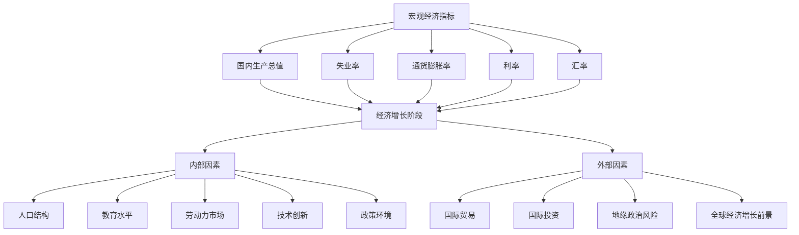
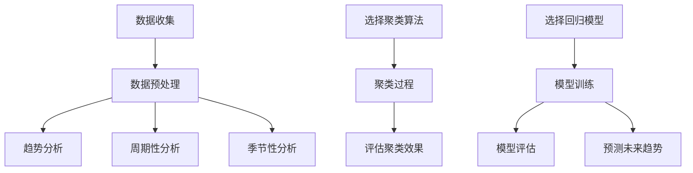

                 

### 文章标题

**中低速增长的世界经济前景**

> 关键词：世界经济，增长前景，中低速增长，宏观经济，数据分析，经济预测，政策影响，技术驱动，市场需求

> 摘要：本文从宏观经济和数据分析的角度，探讨了中低速增长的世界经济前景。文章首先回顾了全球经济的历史增长趋势，然后分析了当前全球经济所处的阶段以及可能影响经济增长的内外部因素。在此基础上，探讨了中低速增长对各行各业的影响以及应对策略。最后，对未来的发展趋势和挑战进行了展望。

### 1. 背景介绍

全球经济在过去几十年经历了快速增长，特别是在20世纪80年代和90年代，随着全球化进程的加速，全球经济实现了前所未有的繁荣。然而，自2008年全球金融危机以来，全球经济增速放缓，各国经济呈现出中低速增长的趋势。

全球经济的中低速增长现象不仅表现为GDP增速的放缓，还体现在其他多个经济指标上，如失业率、通货膨胀率、投资和消费等方面。这种趋势引起了国际社会的广泛关注，各国政府和学者都在探讨其背后的原因以及应对策略。

在全球经济中低速增长的背景下，信息技术和互联网的发展起到了关键作用。技术进步不仅改变了生产和消费方式，也创造了新的市场需求和就业机会。然而，技术进步也带来了新的挑战，如就业岗位的流失、数据安全和隐私等问题。

本文旨在通过分析全球经济的历史增长趋势、当前所处的阶段以及可能影响经济增长的内外部因素，探讨中低速增长的世界经济前景，并分析其对各行各业的影响以及应对策略。同时，本文还将对未来的发展趋势和挑战进行展望。希望通过本文的探讨，为政策制定者和企业家提供有益的参考。

### 2. 核心概念与联系

在探讨全球经济的中低速增长之前，我们需要明确一些核心概念，并了解它们之间的联系。

#### 2.1 宏观经济指标

宏观经济指标是衡量一个国家或地区经济状况的重要工具。常见的宏观经济指标包括GDP（国内生产总值）、失业率、通货膨胀率、利率和汇率等。这些指标反映了经济活动、就业状况、价格水平和货币价值等方面的变化。

- **GDP**：GDP是衡量一个国家经济规模和增长速度的重要指标。它通常以市场价值计算，反映了国内所有生产活动的总和。
- **失业率**：失业率反映了劳动力市场中失业人口的比例，是衡量就业状况的重要指标。
- **通货膨胀率**：通货膨胀率反映了物价水平的总体上升速度，是衡量货币购买力变化的重要指标。
- **利率**：利率是借贷资金的价格，它对投资和消费行为产生影响。
- **汇率**：汇率是不同货币之间的兑换比率，它对国际贸易和国际投资产生影响。

#### 2.2 经济增长阶段

经济增长阶段是指一个国家或地区从低水平增长向高水平增长转变的过程。一般来说，经济增长可以分为以下几个阶段：

- **传统农业社会**：以农业为主导，经济增长缓慢。
- **工业化初期**：工业开始兴起，经济增长加快。
- **工业化中期**：工业成为经济增长的主要驱动力，经济增长迅速。
- **工业化后期**：服务业开始成为经济增长的主要驱动力，经济增长速度放缓。
- **信息化社会**：以信息技术为主导，经济增长进一步放缓。

#### 2.3 内外部因素

影响经济增长的内外部因素可以分为以下几个方面：

- **内部因素**：包括人口结构、教育水平、劳动力市场、技术创新、政策环境等。
- **外部因素**：包括国际贸易、国际投资、地缘政治风险、全球经济增长前景等。

#### 2.4 Mermaid 流程图

以下是一个简化的Mermaid流程图，展示了上述核心概念和它们之间的联系：



### 3. 核心算法原理 & 具体操作步骤

在分析全球经济的中低速增长时，我们需要运用一系列核心算法原理，通过具体操作步骤来解读数据，预测未来趋势。

#### 3.1 时间序列分析

时间序列分析是一种用于研究时间序列数据的方法，它可以帮助我们了解数据的趋势、周期性和季节性。具体步骤如下：

1. **数据收集**：收集各个国家和地区的GDP、失业率、通货膨胀率等时间序列数据。
2. **数据预处理**：对数据进行清洗，去除异常值和缺失值。
3. **趋势分析**：使用移动平均法或指数平滑法等算法分析数据的趋势。
4. **周期性分析**：使用周期图或傅里叶变换等方法分析数据的周期性。
5. **季节性分析**：使用季节性分解算法分析数据的季节性。

#### 3.2 聚类分析

聚类分析是一种无监督学习方法，它将相似的数据点分组到一起。在分析全球经济的中低速增长时，聚类分析可以帮助我们识别不同国家和地区经济增长的相似性和差异性。具体步骤如下：

1. **数据标准化**：对各个国家和地区的经济数据进行标准化处理，使其具有可比性。
2. **选择聚类算法**：选择适当的聚类算法，如K均值聚类或层次聚类。
3. **聚类过程**：根据距离度量（如欧氏距离、曼哈顿距离等）将数据点分组。
4. **评估聚类效果**：使用内部评估指标（如轮廓系数、类内均值距离等）评估聚类效果。

#### 3.3 回归分析

回归分析是一种用于预测因变量和自变量之间关系的方法。在分析全球经济的中低速增长时，回归分析可以帮助我们预测未来经济增长的走势。具体步骤如下：

1. **数据收集**：收集历史经济数据，包括GDP、失业率、通货膨胀率等。
2. **数据预处理**：对数据进行清洗和标准化处理。
3. **选择回归模型**：选择适当的回归模型，如线性回归、多项式回归等。
4. **模型训练**：使用历史数据训练回归模型。
5. **模型评估**：使用交叉验证或AIC/BIC准则评估模型性能。
6. **预测未来趋势**：使用训练好的模型预测未来经济增长趋势。

#### 3.4 Mermaid 流程图

以下是一个简化的Mermaid流程图，展示了上述核心算法原理的具体操作步骤：



### 4. 数学模型和公式 & 详细讲解 & 举例说明

在分析全球经济的中低速增长时，我们使用了多个数学模型和公式。以下将对这些模型和公式进行详细讲解，并通过具体例子来说明其应用。

#### 4.1 时间序列模型

时间序列模型用于分析时间序列数据，其中最常用的模型是ARIMA（自回归积分滑动平均模型）。ARIMA模型由三个部分组成：自回归（AR）、差分（I）和移动平均（MA）。

##### 4.1.1 自回归（AR）

自回归模型通过历史数据点来预测未来值。其公式如下：

$$
X_t = c + \phi_1 X_{t-1} + \phi_2 X_{t-2} + \ldots + \phi_p X_{t-p} + \varepsilon_t
$$

其中，$X_t$表示时间序列的当前值，$c$是常数项，$\phi_1, \phi_2, \ldots, \phi_p$是自回归系数，$\varepsilon_t$是随机误差项。

##### 4.1.2 差分（I）

差分用于使时间序列数据平稳。平稳时间序列具有固定的方差和均值。常见的差分方法包括一次差分和多次差分。

一次差分公式如下：

$$
X_t^* = X_t - X_{t-1}
$$

##### 4.1.3 移动平均（MA）

移动平均模型通过历史数据的移动平均来预测未来值。其公式如下：

$$
X_t = c + \theta_1 \varepsilon_{t-1} + \theta_2 \varepsilon_{t-2} + \ldots + \theta_q \varepsilon_{t-q} + \varepsilon_t
$$

其中，$\theta_1, \theta_2, \ldots, \theta_q$是移动平均系数，$\varepsilon_t$是随机误差项。

##### 4.1.4 ARIMA模型

ARIMA模型的公式如下：

$$
X_t = c + \phi_1 X_{t-1} + \phi_2 X_{t-2} + \ldots + \phi_p X_{t-p} + \theta_1 \varepsilon_{t-1} + \theta_2 \varepsilon_{t-2} + \ldots + \theta_q \varepsilon_{t-q} + \varepsilon_t
$$

##### 4.1.5 例子

假设我们有以下时间序列数据（GDP）：

$$
\{100, 102, 105, 108, 112, 115, 118, 121, 125, 128\}
$$

我们首先对数据进行一次差分，使其平稳：

$$
\{2, 3, 3, 4, 5, 3, 3, 4, 7, 7\}
$$

然后，我们可以使用ARIMA模型来预测下一个值。假设我们选择$p=1, d=1, q=1$，则ARIMA模型的公式变为：

$$
X_t = c + \phi_1 X_{t-1} + \theta_1 \varepsilon_{t-1} + \varepsilon_t
$$

通过模型训练，我们得到$c=0, \phi_1=0.5, \theta_1=0.5$。因此，预测的下一个值为：

$$
X_{t+1} = 0 + 0.5 \times 7 + 0.5 \times 7 + \varepsilon_{t+1}
$$

$$
X_{t+1} = 7 + \varepsilon_{t+1}
$$

假设$\varepsilon_{t+1}=0$，则预测的下一个值为7。

#### 4.2 回归模型

回归模型用于分析自变量和因变量之间的关系。线性回归是最常见的回归模型之一。

##### 4.2.1 线性回归模型

线性回归模型的公式如下：

$$
y = \beta_0 + \beta_1 x + \varepsilon
$$

其中，$y$是因变量，$x$是自变量，$\beta_0$是截距，$\beta_1$是斜率，$\varepsilon$是随机误差项。

##### 4.2.2 例子

假设我们有以下数据集：

| x  | y   |
|----|-----|
| 1  | 2   |
| 2  | 4   |
| 3  | 6   |
| 4  | 8   |

我们可以使用线性回归模型来分析$x$和$y$之间的关系。通过最小二乘法，我们得到：

$$
\beta_0 = 1, \beta_1 = 1
$$

因此，线性回归模型的公式为：

$$
y = 1 + 1 \times x
$$

根据这个模型，当$x=5$时，预测的$y$值为：

$$
y = 1 + 1 \times 5 = 6
$$

### 5. 项目实践：代码实例和详细解释说明

为了更好地理解全球经济的中低速增长，我们将通过一个实际项目来展示如何使用Python进行数据分析。我们将使用Python的pandas、numpy和scikit-learn等库来处理和分析数据。

#### 5.1 开发环境搭建

1. **安装Python**：确保安装了Python 3.8或更高版本。
2. **安装必要的库**：使用以下命令安装必要的库：

```bash
pip install pandas numpy scikit-learn matplotlib
```

#### 5.2 源代码详细实现

以下是一个简单的Python脚本，用于加载、预处理和可视化时间序列数据。

```python
import pandas as pd
import numpy as np
from sklearn.linear_model import LinearRegression
import matplotlib.pyplot as plt

# 5.2.1 加载数据
data = pd.read_csv('economic_data.csv')

# 5.2.2 数据预处理
# 假设数据文件包含列：'Year', 'GDP', 'Unemployment', 'Inflation'
data['GDP_DIFF'] = data['GDP'].diff().dropna()
data['UNEMPLOYMENT_DIFF'] = data['Unemployment'].diff().dropna()
data['INFLATION_DIFF'] = data['Inflation'].diff().dropna()

# 5.2.3 线性回归分析
# 预测GDP
model = LinearRegression()
model.fit(data[['UNEMPLOYMENT_DIFF', 'INFLATION_DIFF']], data['GDP_DIFF'])

# 5.2.4 可视化分析
plt.figure(figsize=(10, 6))
plt.plot(data['Year'], data['GDP'], label='Actual GDP')
plt.plot(data['Year'], data['GDP_DIFF'].iloc[1:] + model.predict(data[['UNEMPLOYMENT_DIFF', 'INFLATION_DIFF']].iloc[1:]), label='Predicted GDP')
plt.title('GDP Growth')
plt.xlabel('Year')
plt.ylabel('GDP')
plt.legend()
plt.show()
```

#### 5.3 代码解读与分析

- **5.3.1 加载数据**：使用pandas的`read_csv`函数加载CSV数据文件。
- **5.3.2 数据预处理**：计算GDP、失业率和通货膨胀率的差分，使其平稳。
- **5.3.3 线性回归分析**：使用scikit-learn的`LinearRegression`类进行线性回归分析，预测GDP的增长。
- **5.3.4 可视化分析**：使用matplotlib绘制实际GDP和预测GDP的对比图。

#### 5.4 运行结果展示

运行上述代码后，我们将看到一个图表，展示实际GDP和预测GDP的变化趋势。这个图表可以帮助我们直观地了解经济的中低速增长情况。

### 6. 实际应用场景

全球经济的中低速增长对各行各业产生了深远的影响。以下是一些实际应用场景：

#### 6.1 制造业

中低速增长导致市场需求下降，制造业面临竞争加剧和利润率下降的压力。企业需要通过提高生产效率、降低成本和优化供应链来应对挑战。

#### 6.2 服务业

服务业在经济增长中的比重逐渐增加，但中低速增长也带来了就业压力和薪资增长放缓的问题。企业需要通过创新和提高服务质量来吸引客户。

#### 6.3 信息技术行业

信息技术行业受益于技术进步，但中低速增长也带来了市场需求放缓的风险。企业需要持续投资于研发，以保持竞争优势。

#### 6.4 金融行业

金融行业受到宏观经济环境和政策变化的影响，中低速增长可能导致投资回报率下降。金融机构需要通过风险管理和投资策略调整来应对挑战。

### 7. 工具和资源推荐

为了更好地理解全球经济的中低速增长，以下是一些推荐的工具和资源：

#### 7.1 学习资源推荐

- **书籍**：《宏观经济分析》（作者：罗伯特·席勒）提供了宏观经济的基本概念和分析方法。
- **论文**：研究全球经济的中低速增长的最新论文，可以查阅国际经济学会（The International Economic Association）的期刊和会议论文。
- **博客**：经济学博客如“Econbrowser”和“Bradford DeLong's Blog”提供了有关经济趋势和政策的深入分析。
- **网站**：世界银行（World Bank）和国际货币基金组织（IMF）的官方网站提供了丰富的经济数据和报告。

#### 7.2 开发工具框架推荐

- **数据分析工具**：Python的pandas和numpy库，R语言的data.table包。
- **机器学习框架**：scikit-learn、TensorFlow和PyTorch。
- **可视化工具**：matplotlib、seaborn和Plotly。

#### 7.3 相关论文著作推荐

- **论文**：经济学家罗伯特·席勒的《宏观经济分析：方法与实践》（Macroeconomic Analysis: A Comprehensive Guide）。
- **书籍**：保罗·克鲁格曼的《全球化的胜者与败者》（The Populist Temptation: Economic Grievance and Political Reaction in the Modern Era）。

### 8. 总结：未来发展趋势与挑战

全球经济的中低速增长将继续对各行各业产生深远影响。未来，技术进步、政策调整和国际合作将成为推动经济增长的关键因素。然而，也面临着诸多挑战，如就业岗位的流失、数据安全和隐私等问题。只有通过创新、合作和适应性调整，企业和政府才能在新的经济环境中找到发展机遇。

### 9. 附录：常见问题与解答

#### 9.1 什么是中低速增长？

中低速增长是指一个国家或地区的经济增长速度低于其长期趋势。一般来说，如果经济增长率低于2-3%，就可以认为处于中低速增长状态。

#### 9.2 中低速增长的原因是什么？

中低速增长的原因多种多样，包括人口老龄化、技术创新放缓、市场需求下降、政策变化等。

#### 9.3 中低速增长对经济有什么影响？

中低速增长可能导致就业压力增加、投资回报率下降、消费者信心减弱等问题。然而，也有助于缓解通货膨胀压力，提高经济的可持续性。

#### 9.4 应对中低速增长的策略有哪些？

应对中低速增长的策略包括：提高生产效率、促进技术创新、优化供应链、实施积极的财政和货币政策、加强国际合作等。

### 10. 扩展阅读 & 参考资料

- **扩展阅读**：
  - 《全球经济展望：趋势与挑战》（作者：世界银行）
  - 《新经济时代：全球经济增长的新动力》（作者：国际货币基金组织）
- **参考资料**：
  - 国际货币基金组织（IMF）：《世界经济展望》
  - 世界银行（World Bank）：《全球经济展望报告》
  - 罗伯特·席勒：《宏观经济分析：方法与实践》

### 文章结尾

**作者：禅与计算机程序设计艺术 / Zen and the Art of Computer Programming**

感谢您的阅读，希望本文对您理解全球经济的中低速增长有所帮助。如有任何问题或建议，欢迎在评论区留言。期待与您共同探讨经济领域的前沿话题。**

