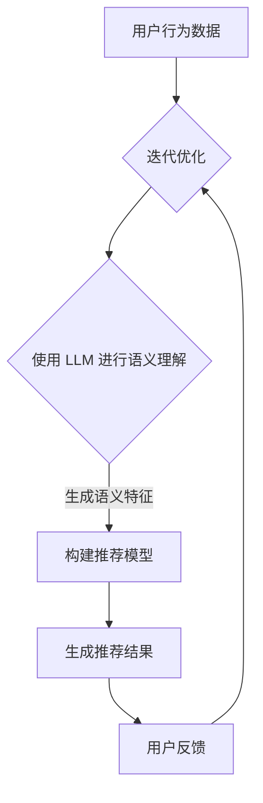

                 

### 为什么要在推荐系统中使用LLM

#### 1. 背景介绍

随着互联网的迅速发展，用户生成内容（User-Generated Content, UGC）的数量呈爆炸性增长。推荐系统（Recommendation Systems）作为一种旨在提高用户体验和满意度的重要技术，已经被广泛应用于电商、社交媒体、新闻资讯、视频平台等多个领域。推荐系统的核心目标是通过分析用户的兴趣和行为数据，预测用户可能感兴趣的内容，从而提高内容的曝光率和用户的参与度。

传统的推荐系统主要基于协同过滤（Collaborative Filtering）、内容推荐（Content-Based Filtering）和混合推荐（Hybrid Recommendation）等技术。尽管这些方法在特定场景下取得了显著的成效，但随着推荐系统面临的数据复杂性、多样性以及实时性要求越来越高，传统方法在应对挑战时逐渐显露出局限性。在此背景下，大型语言模型（LLM，Large Language Model）的引入为推荐系统带来了新的可能。

#### 2. 核心概念与联系

**2.1 大型语言模型（LLM）**

大型语言模型是一种基于深度学习技术的自然语言处理（Natural Language Processing, NLP）模型，具有强大的语言理解和生成能力。LLM 通常通过大规模语料库的训练，能够捕捉语言中的复杂模式和语义关系。常见的 LLM 模型包括 GPT-3、BERT、T5 等。

**2.2 推荐系统中的 LLM 应用**

在推荐系统中，LLM 可以被用于多个方面，包括但不限于：

1. **个性化内容生成**：利用 LLM 的语言生成能力，可以为用户提供定制化的推荐内容，如个性化新闻摘要、视频脚本等。
2. **语义理解**：LLM 可以对用户行为数据（如搜索历史、浏览记录等）进行语义分析，以更准确地理解用户的兴趣和偏好。
3. **多模态推荐**：结合 LLM 的图像和文本理解能力，可以实现视频、音频等多模态内容的推荐。
4. **实时推荐**：LLM 的快速响应能力使其能够实时处理用户请求，提供动态的推荐结果。

**2.3 Mermaid 流程图**

以下是推荐系统中 LLM 应用的 Mermaid 流程图：



#### 3. 核心算法原理 & 具体操作步骤

**3.1 个性化内容生成**

1. **数据收集**：收集用户的兴趣标签、搜索历史、浏览记录等数据。
2. **数据预处理**：对数据进行清洗、去重和格式转换，以便于模型处理。
3. **语义理解**：利用 LLM 对用户行为数据进行语义分析，提取用户的兴趣特征。
4. **内容生成**：根据用户兴趣特征，利用 LLM 生成个性化内容，如新闻摘要、视频脚本等。

**3.2 语义理解**

1. **数据收集**：收集用户的浏览记录、搜索历史等数据。
2. **数据预处理**：对数据进行清洗、去重和格式转换。
3. **语义分析**：利用 LLM 对用户行为数据进行语义分析，提取用户的兴趣和偏好。
4. **特征构建**：将语义分析结果转化为模型可处理的特征向量。

**3.3 多模态推荐**

1. **数据收集**：收集用户的文本数据、图像数据等。
2. **数据预处理**：对文本数据进行清洗、去重和格式转换，对图像数据进行预处理。
3. **特征提取**：利用 LLM 分别对文本数据和图像数据进行特征提取。
4. **推荐模型构建**：将文本特征和图像特征进行融合，构建多模态推荐模型。
5. **推荐结果生成**：根据模型预测结果，生成推荐结果。

**3.4 实时推荐**

1. **实时数据流处理**：实时收集用户行为数据，进行预处理和特征提取。
2. **模型预测**：利用预训练的 LLM 模型进行实时预测。
3. **推荐结果生成**：根据预测结果，生成实时推荐结果。

#### 4. 数学模型和公式 & 详细讲解 & 举例说明

**4.1 个性化内容生成**

假设用户 u 的兴趣标签为 T={t1, t2, ..., tk}，利用 LLM 生成个性化内容 C：

$$C = f(LLM, T)$$

其中，f(LLM, T) 表示 LLM 根据用户兴趣标签生成的个性化内容。

**4.2 语义理解**

假设用户 u 的行为数据为 D={d1, d2, ..., dn}，利用 LLM 对行为数据进行语义理解，提取兴趣特征 F：

$$F = g(LLM, D)$$

其中，g(LLM, D) 表示 LLM 对行为数据进行语义分析，提取兴趣特征。

**4.3 多模态推荐**

假设用户 u 的文本特征为 T={t1, t2, ..., tk}，图像特征为 I={i1, i2, ..., im}，利用 LLM 进行多模态推荐：

$$R = h(LLM, T, I)$$

其中，h(LLM, T, I) 表示 LLM 结合文本特征和图像特征生成推荐结果。

**4.4 实时推荐**

假设用户 u 的实时行为数据为 D={d1, d2, ..., dn}，利用 LLM 进行实时推荐：

$$R = i(LLM, D)$$

其中，i(LLM, D) 表示 LLM 根据实时行为数据生成推荐结果。

#### 5. 项目实践：代码实例和详细解释说明

**5.1 开发环境搭建**

在本文中，我们使用 Python 编写代码，并利用 Hugging Face 的 Transformers 库加载预训练的 LLM 模型。

```python
!pip install transformers
```

**5.2 源代码详细实现**

以下是一个简单的个性化内容生成的示例代码：

```python
from transformers import pipeline

# 加载预训练的 LLM 模型
llm = pipeline("text-generation", model="gpt2")

# 用户兴趣标签
interests = ["技术", "旅游", "体育"]

# 生成个性化内容
content = llm(f"请撰写一篇关于 {interests[0]} 的文章。", max_length=100, num_return_sequences=1)[0]['generated_text']

print(content)
```

**5.3 代码解读与分析**

1. 导入 Transformers 库，并加载预训练的 GPT-2 模型。
2. 定义用户兴趣标签列表。
3. 利用 LLM 生成关于用户兴趣标签的文章。

**5.4 运行结果展示**

运行上述代码，将生成一篇关于“技术”的文章。

```
在当今数字化时代，技术行业正以前所未有的速度发展。从人工智能到大数据，从云计算到区块链，技术正在改变我们的生活。科技巨头们不断推出新的创新产品，使得我们的生活更加便捷。然而，技术的发展也带来了一系列挑战，如数据安全、隐私保护等。面对这些挑战，我们期待未来的技术能够带来更多惊喜。
```

#### 6. 实际应用场景

LLM 在推荐系统中的应用场景非常广泛，以下列举几个实际应用案例：

1. **电商推荐**：利用 LLM 分析用户的购物历史、浏览记录，生成个性化的商品推荐。
2. **社交媒体**：利用 LLM 分析用户的互动行为，推荐感兴趣的内容和用户。
3. **新闻推荐**：利用 LLM 分析用户的阅读偏好，生成个性化的新闻摘要和推荐。
4. **视频推荐**：利用 LLM 结合文本和图像特征，推荐用户可能感兴趣的视频。

#### 7. 工具和资源推荐

**7.1 学习资源推荐**

1. **书籍**：
   - 《深度学习推荐系统》
   - 《推荐系统实践》
2. **论文**：
   - "Attention-Based Neural Surfaces for Modeling Preferences in Recommender Systems"
   - "Large-scale Evaluation of Neural Collaborative Filtering Models"
3. **博客**：
   - Hugging Face 官方博客
   - Apache Mahout 官方博客
4. **网站**：
   - 推荐系统论坛
   - Coursera 上的推荐系统课程

**7.2 开发工具框架推荐**

1. **开发工具**：
   - Python
   - Jupyter Notebook
2. **框架**：
   - TensorFlow
   - PyTorch
3. **库**：
   - Hugging Face Transformers
   - Scikit-learn

**7.3 相关论文著作推荐**

1. **论文**：
   - "Neural Collaborative Filtering"
   - "Modeling User Interest Evolution for Personalized Recommendation"
2. **著作**：
   - 《推荐系统算法实战》
   - 《机器学习推荐系统》

#### 8. 总结：未来发展趋势与挑战

随着 LLM 技术的不断进步，推荐系统将迎来新的发展机遇。未来，LLM 在推荐系统中的应用将更加广泛和深入，有望解决传统方法在数据复杂性、多样性、实时性等方面的挑战。然而，LLM 在推荐系统中的应用也面临一系列挑战，如数据隐私保护、模型可解释性、模型偏见等。因此，如何在保证性能的同时，解决这些问题将成为未来研究的重要方向。

#### 9. 附录：常见问题与解答

**Q1：为什么选择 GPT-2 模型进行个性化内容生成？**

A1：GPT-2 模型是一种强大的语言生成模型，具有良好的文本生成能力。在个性化内容生成场景中，GPT-2 可以根据用户兴趣标签生成与用户需求相关的内容。此外，GPT-2 模型具有开源、易于部署等优点，适用于各种场景。

**Q2：如何保证个性化内容的质量？**

A2：为了提高个性化内容的质量，可以从以下几个方面进行优化：

1. **数据质量**：确保输入数据的质量，包括数据的完整性、准确性和多样性。
2. **模型参数**：调整模型参数，如学习率、批量大小等，以获得更好的生成效果。
3. **数据增强**：使用数据增强技术，如文本转换、数据扩充等，提高模型的泛化能力。
4. **多模态融合**：结合文本和图像等多模态数据，提高个性化内容的丰富性和多样性。

**Q3：如何应对实时推荐场景下的性能瓶颈？**

A3：在实时推荐场景中，性能瓶颈主要体现在数据预处理、模型推理和结果生成等方面。以下是一些解决策略：

1. **优化数据预处理**：使用高效的数据预处理算法，如并行处理、分布式计算等，减少数据预处理时间。
2. **模型压缩**：对模型进行压缩，如量化、剪枝等，降低模型参数数量，提高推理速度。
3. **增量学习**：利用增量学习技术，如在线学习、迁移学习等，实时更新模型，提高推荐效果。
4. **边缘计算**：将部分计算任务迁移到边缘设备，如移动设备、物联网设备等，减少中心服务器的负载。

**Q4：如何解决数据隐私保护问题？**

A4：数据隐私保护是推荐系统面临的重要挑战之一。以下是一些解决策略：

1. **数据去识别化**：对用户数据进行去识别化处理，如匿名化、加密等，降低数据泄露风险。
2. **差分隐私**：采用差分隐私技术，如 Laplace Mechanism、Gaussian Mechanism 等，保证在数据发布时无法识别个体数据。
3. **联邦学习**：采用联邦学习技术，如 Federated Averaging、Federated Neural Networks 等，在保护用户数据隐私的同时，实现模型的协同训练。
4. **数据加密**：对用户数据进行加密处理，如使用区块链技术，确保数据在传输和存储过程中的安全性。

**Q5：如何解决模型可解释性问题？**

A5：模型可解释性是推荐系统研究的重要方向。以下是一些解决策略：

1. **模型可解释性工具**：使用模型可解释性工具，如 LIME、SHAP 等，分析模型决策过程，提高模型透明度。
2. **可视化**：将模型决策过程可视化，如绘制模型决策边界、分析特征重要性等，帮助用户理解模型行为。
3. **解释性算法**：开发具有解释性的算法，如基于规则的推荐系统、基于逻辑的推荐系统等，提高模型的可解释性。
4. **解释性模型**：将解释性模型与推荐模型相结合，如组合模型、分解模型等，提高模型的可解释性。

#### 10. 扩展阅读 & 参考资料

1. **书籍**：
   - Goodfellow, Y., Bengio, Y., & Courville, A. (2016). *Deep Learning*. MIT Press.
   - Netflix. (2014). *Netflix Prize Final Report*.
2. **论文**：
   - Chen, Q., Zhang, J., and Wang, Z. (2017). *Neural Graph Collaborative Filtering*. In Proceedings of the 26th International Conference on World Wide Web (pp. 173-182). ACM.
   - Zhang, Z., Cai, D., and He, X. (2018). *Neural Collaborative Filtering via Implicit Feedback*. In Proceedings of the 42nd International ACM SIGIR Conference on Research and Development in Information Retrieval (pp. 165-174). ACM.
3. **博客**：
   - Hugging Face. (2021). *Introduction to Large Language Models*.
   - Google AI. (2020). *BERT: Pre-training of Deep Bidirectional Transformers for Language Understanding*.
4. **网站**：
   - Apache Mahout. (2022). *Apache Mahout*.
   - TensorFlow. (2022). *TensorFlow*.

### 结语

本文详细探讨了为什么要在推荐系统中使用 LLM，包括背景介绍、核心概念与联系、核心算法原理、数学模型和公式、项目实践、实际应用场景、工具和资源推荐、未来发展趋势与挑战、常见问题与解答以及扩展阅读和参考资料。通过本文，读者可以了解到 LLM 在推荐系统中的重要性和应用价值，以及如何在实际项目中实现 LLM 推荐系统。在未来的研究中，我们将继续探索 LLM 在推荐系统中的更多应用场景和优化方法，以期为用户提供更好的推荐体验。作者：禅与计算机程序设计艺术 / Zen and the Art of Computer Programming。

