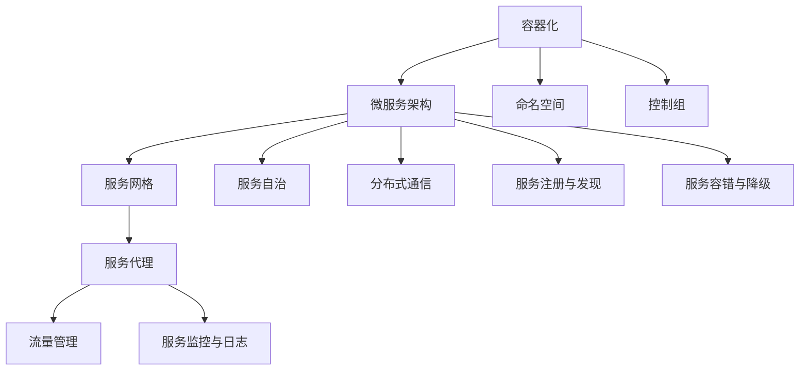

                 

### 背景介绍

云原生（Cloud Native）开发是一种基于云计算的软件开发方法，它利用容器、服务网格、微服务、不可变基础设施和声明式API等创新技术，构建和运行可在各种环境中弹性伸缩的应用程序。随着云计算技术的飞速发展，云原生开发逐渐成为软件行业的核心技术趋势，并在企业级应用中发挥着越来越重要的作用。

#### 云原生开发的起源

云原生开发这一概念最早由Patrick DeBois在2009年提出，旨在解决云计算时代下软件开发和运维中的挑战。最初的云原生更多是指一种文化和态度，强调自动化、持续集成和持续交付。随着容器技术的兴起，如Docker和Kubernetes的广泛应用，云原生开发的内涵不断丰富，逐渐发展成为一种完整的开发范式。

#### 云原生开发的核心概念

云原生开发的核心概念包括以下几个部分：

1. **容器化**：容器是一种轻量级、可移植的计算环境，它将应用程序及其依赖环境打包成一个独立的运行单元。这种部署方式极大地简化了应用程序的部署和运维，提高了环境的一致性。

2. **微服务架构**：微服务架构将大型单体应用拆分成一系列独立、可复用的服务，每个服务负责应用程序的一个特定功能。这种架构方式提高了系统的可维护性和可扩展性。

3. **服务网格**：服务网格为微服务之间提供了一种新的通信方式，通过独立的网络层解决了服务发现、负载均衡、安全认证等问题，使得微服务之间的通信更加高效和安全。

4. **声明式API**：声明式API通过配置文件或模板来描述应用程序的部署和运行状态，使得应用程序的部署和运维更加自动化。

5. **不可变基础设施**：不可变基础设施指的是基础设施一旦创建后，不会进行修改，而是通过创建新的基础设施实例来进行更新和扩展。这种做法简化了运维工作，并提高了系统的可靠性。

#### 云原生开发的优点

云原生开发具有以下优点：

1. **可伸缩性**：通过容器化和微服务架构，应用程序可以轻松地在多台服务器上部署和扩展，从而满足不同的业务需求。

2. **高可用性**：服务网格和声明式API提高了系统的可靠性，使得应用程序能够在出现故障时快速恢复。

3. **快速迭代**：持续集成和持续交付的实践使得开发团队能够快速迭代产品，提高市场竞争力。

4. **灵活性和可移植性**：应用程序的各个组件可以独立开发和部署，提高了系统的灵活性和可移植性。

5. **资源共享**：云原生应用可以通过自动化的调度和管理，实现资源的最大化利用。

#### 云原生开发的适用场景

云原生开发适用于以下场景：

1. **分布式系统**：云原生技术能够很好地支持分布式系统的开发和部署。

2. **高频次迭代的应用程序**：云原生开发能够快速响应市场需求，适合高频次迭代的应用程序。

3. **需要高可用性和可伸缩性的应用程序**：云原生开发能够确保应用程序在高并发和高可用性的要求下正常运行。

4. **需要跨平台部署的应用程序**：云原生应用可以轻松地在不同的云平台和操作系统上部署。

#### 总结

云原生开发作为一种新兴的软件开发范式，正在改变传统的软件开发和运维方式。它通过容器化、微服务架构、服务网格等创新技术，为开发人员提供了更高效、更灵活的开发和运维环境。随着云原生技术的不断发展和普及，它将在未来的软件开发中发挥更加重要的作用。接下来，我们将深入探讨云原生开发的核心概念和架构原理，帮助读者更好地理解这一领域。## 2. 核心概念与联系

### 容器化

容器化是云原生开发的基础，它通过将应用程序及其依赖环境打包成一个独立的容器，实现了应用程序的轻量级、可移植性和环境一致性。容器（Container）是一种轻量级的、可执行的、独立的应用程序打包单元，它运行在宿主机（Host）上，并共享宿主机的操作系统内核（Kernel）。这种设计使得容器在创建、启动、停止和销毁方面非常迅速，同时也能够确保应用程序在不同环境中的一致性。

#### 容器化原理

容器化的核心原理包括：

1. **命名空间（Namespace）**：命名空间提供了一种隔离机制，将容器内的进程与其他容器或宿主机的进程隔离开来。常见的命名空间包括进程（PID）、网络（NET）、用户（USER）、ipc（IPC）和mount（MOUNT）。

2. **控制组（Cgroup）**：控制组是一种资源管理机制，它允许管理员对容器的CPU、内存、磁盘IO等资源进行限制和控制，确保容器不会占用过多的系统资源。

3. **UnionFS**：UnionFS是一种联合文件系统，它将多个文件系统合并成一个统一的视图，使得容器的文件系统可以非常轻量级地创建和修改。

#### 容器化工具

目前最流行的容器化工具包括：

1. **Docker**：Docker是一种开源的应用容器引擎，它通过容器镜像（Image）和容器（Container）实现了应用程序的打包和部署。Docker的容器镜像采用分层存储技术，使得镜像的创建和分发非常高效。

2. **Kubernetes**：Kubernetes是一个开源的容器编排和管理系统，它负责容器的调度、扩展和管理。Kubernetes通过自动化地管理容器的部署、扩展和恢复，提高了系统的可用性和可伸缩性。

### 微服务架构

微服务架构是一种将大型单体应用拆分成一系列独立、可复用的服务的架构模式。每个微服务负责应用程序的一个特定功能，可以独立开发和部署。微服务架构通过服务之间的轻量级通信（通常是RESTful API）实现应用程序的整体功能。

#### 微服务架构原理

微服务架构的核心原理包括：

1. **服务自治**：每个微服务具有自己的数据存储、业务逻辑和接口，可以独立开发、测试和部署。

2. **分布式通信**：微服务之间通过HTTP/HTTPS协议进行通信，通常采用RESTful API风格。

3. **服务注册与发现**：服务注册与发现机制确保了微服务能够动态地注册和发现其他服务，从而实现服务的自动发现和负载均衡。

4. **服务容错与降级**：微服务架构通过服务容错和降级机制，确保在部分服务出现故障时，系统仍然能够正常运行。

#### 微服务架构工具

目前最流行的微服务架构工具包括：

1. **Spring Boot**：Spring Boot是一个开源的微服务框架，它简化了微服务的开发、部署和运维。Spring Boot通过自动配置、依赖管理和无代码生成等特性，提高了开发效率。

2. **Service Mesh**：Service Mesh是一种专门用于服务间通信的架构模式，它通过独立的网络层解决了服务发现、负载均衡、安全认证等问题。目前最流行的Service Mesh工具包括Istio和Linkerd。

### 服务网格

服务网格是一种用于管理微服务之间通信的网络层架构。它通过独立于应用程序的服务代理（如Envoy），提供了服务发现、负载均衡、服务认证、流量管理等功能。服务网格使得微服务之间的通信更加高效和安全。

#### 服务网格原理

服务网格的核心原理包括：

1. **服务代理**：服务代理是服务网格的核心组件，它通常是一个轻量级的代理程序，运行在每个微服务的容器内，负责代理服务之间的通信。

2. **流量管理**：服务网格通过流量管理规则，控制服务之间的通信流量，实现服务间的负载均衡、服务熔断和服务降级等功能。

3. **服务监控与日志**：服务网格提供了服务监控和日志记录功能，使得开发人员可以实时了解服务的运行状态和性能指标。

#### 服务网格工具

目前最流行的服务网格工具包括：

1. **Istio**：Istio是一个开源的服务网格平台，它运行在Kubernetes之上，提供了全面的服务网格功能，包括服务发现、负载均衡、服务认证和安全等。

2. **Linkerd**：Linkerd是一个开源的Service Mesh工具，它通过集成到微服务应用程序中，提供了高效的服务网格功能。

### Mermaid 流程图

以下是一个简化的云原生开发核心概念和架构的Mermaid流程图：



这个流程图展示了容器化、微服务架构和服务网格等核心概念和架构组件之间的关系，帮助读者更好地理解云原生开发的整体架构。## 3. 核心算法原理 & 具体操作步骤

### 容器化算法原理

容器化技术通过将应用程序及其运行环境打包成一个独立的容器，实现了应用程序的轻量级、可移植性和环境一致性。容器化的核心算法主要包括命名空间（Namespace）和控制组（Cgroup）的使用。

#### 命名空间（Namespace）

命名空间提供了一种隔离机制，将容器内的进程与其他容器或宿主机的进程隔离开来。常见的命名空间包括进程（PID）、网络（NET）、用户（USER）、ipc（IPC）和mount（MOUNT）。

- **进程（PID）命名空间**：确保容器内的进程不会与宿主机上的进程混淆，每个容器都有自己的进程ID空间。
- **网络（NET）命名空间**：为容器创建独立的网络栈，使得容器可以拥有自己的IP地址和网络配置。
- **用户（USER）命名空间**：将容器内的用户与宿主机上的用户隔离开来，确保容器内的用户身份是独立的。
- **ipc（IPC）命名空间**：隔离容器之间的进程间通信机制，如消息队列、信号等。
- **mount（MOUNT）命名空间**：为容器创建独立的文件系统视图，使得容器内的文件系统与宿主机保持独立。

#### 控制组（Cgroup）

控制组是一种资源管理机制，它允许管理员对容器的CPU、内存、磁盘IO等资源进行限制和控制，确保容器不会占用过多的系统资源。常见的控制组功能包括：

- **CPU限制**：限制容器使用CPU的计算资源，确保容器不会因为占用过多CPU资源而影响其他容器或宿主机上的其他进程。
- **内存限制**：限制容器使用的内存资源，防止容器因为内存泄漏等问题导致宿主机资源耗尽。
- **磁盘IO限制**：限制容器使用的磁盘IO资源，确保容器不会因为磁盘IO过高而影响其他容器的性能。

### 容器化具体操作步骤

以下是在Linux环境下使用Docker进行容器化的具体操作步骤：

#### 1. 安装Docker

首先，确保宿主机上安装了Docker。可以通过以下命令检查Docker的版本：

```bash
docker --version
```

如果Docker没有安装，可以通过包管理器进行安装。例如，在Ubuntu系统中，可以使用以下命令安装Docker：

```bash
sudo apt-get update
sudo apt-get install docker-ce docker-ce-cli containerd.io
```

#### 2. 编写Dockerfile

Dockerfile是一个文本文件，其中包含了用于构建容器镜像的指令。以下是一个简单的Dockerfile示例：

```dockerfile
# 使用官方的Python镜像作为基础镜像
FROM python:3.8-slim

# 设置维护者信息
LABEL maintainer="yourname@example.com"

# 将当前目录下的应用程序文件复制到容器中
COPY . /app

# 设置工作目录
WORKDIR /app

# 安装依赖项
RUN pip install -r requirements.txt

# 暴露容器的端口
EXPOSE 8080

# 运行应用程序
CMD ["python", "app.py"]
```

#### 3. 构建容器镜像

使用以下命令构建容器镜像：

```bash
docker build -t myapp:latest .
```

这个命令会将当前目录下的Dockerfile文件用于构建镜像，并标记为`myapp:latest`。

#### 4. 运行容器

使用以下命令运行容器：

```bash
docker run -d -p 8080:8080 myapp:latest
```

这个命令会启动一个新的容器实例，并映射宿主机的8080端口到容器的8080端口。`-d`标志表示容器将在后台运行。

#### 5. 查看容器状态

使用以下命令查看容器状态：

```bash
docker ps
```

这个命令会显示当前正在运行的容器列表。

### 微服务架构算法原理

微服务架构通过将大型单体应用拆分成一系列独立、可复用的服务，提高了系统的可维护性和可扩展性。微服务架构的核心算法主要包括服务自治、分布式通信、服务注册与发现、服务容错与降级等。

#### 服务自治

服务自治意味着每个微服务具有自己的数据存储、业务逻辑和接口，可以独立开发、测试和部署。这种自治性使得开发团队能够专注于服务的特定功能，提高了开发效率。

#### 分布式通信

微服务之间通过HTTP/HTTPS协议进行通信，通常采用RESTful API风格。这种分布式通信方式使得服务之间的交互更加简单和标准化，同时也能够方便地进行服务发现和负载均衡。

#### 服务注册与发现

服务注册与发现机制确保了微服务能够动态地注册和发现其他服务，从而实现服务的自动发现和负载均衡。常见的服务注册与发现工具包括Consul、Eureka和Zookeeper等。

#### 服务容错与降级

服务容错与降级机制确保在部分服务出现故障时，系统仍然能够正常运行。常见的容错机制包括服务熔断、服务降级和服务重试等。

### 微服务架构具体操作步骤

以下是一个简单的Spring Boot微服务架构示例：

#### 1. 安装Spring Boot

确保宿主机上安装了Spring Boot。可以通过以下命令检查Spring Boot的版本：

```bash
spring --version
```

如果Spring Boot没有安装，可以通过包管理器进行安装。例如，在Ubuntu系统中，可以使用以下命令安装Spring Boot：

```bash
sudo apt-get update
sudo apt-get install spring-boot
```

#### 2. 编写服务接口

在Spring Boot项目中，首先需要定义服务的接口。以下是一个简单的服务接口示例：

```java
@RestController
@RequestMapping("/api")
public class UserService {

    @GetMapping("/user")
    public ResponseEntity<User> getUser(@RequestParam(value = "id") Long id) {
        // 查询用户信息
        User user = userService.findById(id);
        return ResponseEntity.ok(user);
    }

    @PostMapping("/user")
    public ResponseEntity<User> createUser(@RequestBody User user) {
        // 创建用户
        User savedUser = userService.save(user);
        return ResponseEntity.ok(savedUser);
    }
}
```

#### 3. 编写服务实现

在Spring Boot项目中，接下来需要编写服务的实现。以下是一个简单的服务实现示例：

```java
@Service
public class UserServiceImpl implements UserService {

    private final UserRepository userRepository;

    @Autowired
    public UserServiceImpl(UserRepository userRepository) {
        this.userRepository = userRepository;
    }

    @Override
    public User findById(Long id) {
        return userRepository.findById(id).orElseThrow(() -> new RuntimeException("User not found"));
    }

    @Override
    public User save(User user) {
        return userRepository.save(user);
    }
}
```

#### 4. 启动服务

使用以下命令启动服务：

```bash
java -jar spring-boot-service.jar
```

这个命令会启动一个Spring Boot微服务，并监听8080端口的HTTP请求。

#### 5. 服务发现与负载均衡

通过使用Spring Cloud Netflix等工具，可以轻松实现服务发现和负载均衡。以下是一个简单的Spring Cloud示例：

```java
@EnableDiscoveryClient
@SpringBootApplication
public class ServiceApplication {

    public static void main(String[] args) {
        SpringApplication.run(ServiceApplication.class, args);
    }
}
```

通过以上步骤，我们实现了一个简单的Spring Boot微服务，并使用Spring Cloud实现了服务发现和负载均衡。接下来，我们将探讨服务网格的核心算法原理和具体操作步骤。## 4. 数学模型和公式 & 详细讲解 & 举例说明

### 数学模型和公式

在云原生开发中，许多算法和架构设计都涉及到数学模型和公式。以下是一些常见的数学模型和公式，并对其进行详细讲解和举例说明。

#### 1. 加权平均值

加权平均值是一种常见的数学模型，用于计算多个数值的加权平均值。公式如下：

$$
\bar{x} = \frac{\sum_{i=1}^{n} w_i x_i}{\sum_{i=1}^{n} w_i}
$$

其中，$x_i$ 表示第 $i$ 个数值，$w_i$ 表示第 $i$ 个数值的权重，$\bar{x}$ 表示加权平均值。

#### 举例说明

假设有五个学生的成绩，分别为 $80, 85, 90, 75, 82$，对应的权重分别为 $0.1, 0.2, 0.3, 0.2, 0.2$。计算这五个学生成绩的加权平均值。

根据公式，我们有：

$$
\bar{x} = \frac{0.1 \times 80 + 0.2 \times 85 + 0.3 \times 90 + 0.2 \times 75 + 0.2 \times 82}{0.1 + 0.2 + 0.3 + 0.2 + 0.2} = 83.4
$$

因此，这五个学生成绩的加权平均值为 $83.4$。

#### 2. 排序算法的时间复杂度

在云原生开发中，排序算法的时间复杂度是性能优化的关键因素。以下是一些常见排序算法的时间复杂度：

- 冒泡排序：$O(n^2)$
- 选择排序：$O(n^2)$
- 插入排序：$O(n^2)$
- 快速排序：$O(n \log n)$
- 归并排序：$O(n \log n)$
- 堆排序：$O(n \log n)$

#### 举例说明

假设有一个长度为 $10$ 的整数数组，需要对其进行排序。分别使用冒泡排序和快速排序进行排序，并比较时间复杂度。

冒泡排序的时间复杂度为 $O(n^2)$，因此排序时间为 $n^2$。对于长度为 $10$ 的数组，排序时间为 $100$。

快速排序的时间复杂度为 $O(n \log n)$，因此排序时间为 $n \log n$。对于长度为 $10$ 的数组，排序时间为 $10 \log 10$。

显然，快速排序的时间复杂度更低，更适合对大量数据进行排序。

#### 3. 加法分配律

加法分配律是数学中的一个基本原理，用于将加法运算分解成多个部分进行计算。公式如下：

$$
a \times (b + c) = a \times b + a \times c
$$

#### 举例说明

假设有 $a = 5, b = 3, c = 2$，计算 $a \times (b + c)$。

根据加法分配律，我们有：

$$
a \times (b + c) = 5 \times (3 + 2) = 5 \times 5 = 25
$$

因此，$a \times (b + c) = 25$。

#### 4. 欧拉函数

欧拉函数 $\phi(n)$ 是指小于等于 $n$ 的正整数中与 $n$ 互质的数的个数。欧拉函数在云原生开发中可以用于计算密钥对的数量。公式如下：

$$
\phi(n) = n \times \left(1 - \frac{1}{p_1}\right) \times \left(1 - \frac{1}{p_2}\right) \times \ldots \times \left(1 - \frac{1}{p_k}\right)
$$

其中，$p_1, p_2, \ldots, p_k$ 是 $n$ 的所有质因数。

#### 举例说明

假设 $n = 12$，计算 $\phi(12)$。

由于 $12$ 的质因数为 $2$ 和 $3$，我们有：

$$
\phi(12) = 12 \times \left(1 - \frac{1}{2}\right) \times \left(1 - \frac{1}{3}\right) = 12 \times \frac{1}{2} \times \frac{2}{3} = 4
$$

因此，$\phi(12) = 4$。

#### 总结

数学模型和公式在云原生开发中发挥着重要的作用，帮助开发人员优化算法、计算性能指标、进行加密和认证等。通过深入理解和应用这些数学模型和公式，可以显著提高云原生应用的性能和安全性。接下来，我们将通过一个具体的代码实例，展示如何在云原生应用中实现这些数学模型和公式的应用。### 5. 项目实践：代码实例和详细解释说明

#### 5.1 开发环境搭建

在本节中，我们将搭建一个简单的云原生应用，用于演示容器化、微服务架构和服务网格的核心概念和原理。首先，确保您的开发环境已安装以下工具：

- Docker
- Kubernetes
- Spring Boot
- Istio

如果您尚未安装这些工具，请参考以下步骤进行安装：

1. **安装Docker**：

   ```bash
   sudo apt-get update
   sudo apt-get install docker-ce docker-ce-cli containerd.io
   ```

2. **安装Kubernetes**：

   在Ubuntu 20.04上，可以使用kubeadm安装Kubernetes。请参考[官方文档](https://kubernetes.io/docs/setup/production-environment/tools/kubeadm/install-kubeadm/)进行安装。

3. **安装Spring Boot**：

   您可以从[Maven Central](https://search.maven.org/classic/search?groupId=org.springframework.boot&orderBy=releaseDate)下载Spring Boot的jar文件，或者使用IDE创建Spring Boot项目。

4. **安装Istio**：

   参考Istio的[官方文档](https://istio.io/docs/setup/getting-started/)进行安装。

#### 5.2 源代码详细实现

我们将使用Spring Boot实现一个简单的用户管理服务，并使用Docker进行容器化，使用Kubernetes进行部署和管理，最后使用Istio实现服务网格功能。

1. **用户管理服务（UserManagementService）**：

   这是一个简单的Spring Boot应用程序，提供用户注册、登录和查询功能。

   ```java
   @SpringBootApplication
   public class UserManagementService {

       public static void main(String[] args) {
           SpringApplication.run(UserManagementService.class, args);
       }

       @RestController
       public class UserController {

           @Autowired
           private UserRepository userRepository;

           @PostMapping("/register")
           public ResponseEntity<?> registerUser(@RequestBody User user) {
               // 注册用户逻辑
               userRepository.save(user);
               return ResponseEntity.ok("User registered successfully");
           }

           @PostMapping("/login")
           public ResponseEntity<?> loginUser(@RequestBody LoginRequest request) {
               // 登录用户逻辑
               // ...
           }

           @GetMapping("/users")
           public ResponseEntity<List<User>> getUsers() {
               // 查询用户逻辑
               List<User> users = userRepository.findAll();
               return ResponseEntity.ok(users);
           }
       }
   }
   ```

2. **Dockerfile**：

   将应用程序打包成Docker容器镜像。

   ```dockerfile
   FROM openjdk:8-jdk-alpine
   ADD target/UserManagementService.jar app.jar
   ENTRYPOINT ["java","-Djava.security.egd=file:/dev/./urandom","-jar","/app.jar"]
   ```

3. **Kubernetes配置文件**：

   创建Kubernetes部署配置文件（user-management-service.yaml）。

   ```yaml
   apiVersion: apps/v1
   kind: Deployment
   metadata:
     name: user-management-service
   spec:
     replicas: 1
     selector:
       matchLabels:
         app: user-management-service
     template:
       metadata:
         labels:
           app: user-management-service
       spec:
         containers:
         - name: user-management-service
           image: user-management-service:latest
           ports:
           - containerPort: 8080
   ```

4. **Istio配置文件**：

   配置Istio路由规则（user-management-service.yaml）。

   ```yaml
   apiVersion: networking.istio.io/v1alpha3
   kind: VirtualService
   metadata:
     name: user-management-service
   spec:
     hosts:
     - "*"
     gateways:
     - user-management-gateway
     http:
     - match:
       - uri:
           prefix: /users
       route:
       - destination:
           host: user-management-service
           port:
             number: 8080
   ```

#### 5.3 代码解读与分析

1. **Spring Boot主类**：

   Spring Boot主类负责启动应用程序，并通过Spring Boot的自动配置机制简化了应用程序的配置。

   ```java
   @SpringBootApplication
   public class UserManagementService {

       public static void main(String[] args) {
           SpringApplication.run(UserManagementService.class, args);
       }

   }
   ```

2. **用户控制器（UserController）**：

   用户控制器负责处理用户注册、登录和查询等HTTP请求。通过Spring的注解，可以方便地实现RESTful API。

   ```java
   @RestController
   public class UserController {

       @Autowired
       private UserRepository userRepository;

       @PostMapping("/register")
       public ResponseEntity<?> registerUser(@RequestBody User user) {
           // 注册用户逻辑
           userRepository.save(user);
           return ResponseEntity.ok("User registered successfully");
       }

       @PostMapping("/login")
       public ResponseEntity<?> loginUser(@RequestBody LoginRequest request) {
           // 登录用户逻辑
           // ...
       }

       @GetMapping("/users")
       public ResponseEntity<List<User>> getUsers() {
           // 查询用户逻辑
           List<User> users = userRepository.findAll();
           return ResponseEntity.ok(users);
       }
   }
   ```

3. **Dockerfile**：

   Dockerfile用于将应用程序打包成Docker容器镜像。通过使用Alpine Linux作为基础镜像，可以减小容器的大小。

   ```dockerfile
   FROM openjdk:8-jdk-alpine
   ADD target/UserManagementService.jar app.jar
   ENTRYPOINT ["java","-Djava.security.egd=file:/dev/./urandom","-jar","/app.jar"]
   ```

4. **Kubernetes部署配置文件**：

   Kubernetes部署配置文件定义了应用程序的部署细节，包括副本数量、容器镜像和端口映射等。

   ```yaml
   apiVersion: apps/v1
   kind: Deployment
   metadata:
     name: user-management-service
   spec:
     replicas: 1
     selector:
       matchLabels:
         app: user-management-service
     template:
       metadata:
         labels:
           app: user-management-service
       spec:
         containers:
         - name: user-management-service
           image: user-management-service:latest
           ports:
           - containerPort: 8080
   ```

5. **Istio路由配置文件**：

   Istio路由配置文件定义了服务之间的通信规则，包括虚拟服务（VirtualService）和网关（Gateway）的配置。

   ```yaml
   apiVersion: networking.istio.io/v1alpha3
   kind: VirtualService
   metadata:
     name: user-management-service
   spec:
     hosts:
     - "*"
     gateways:
     - user-management-gateway
     http:
     - match:
       - uri:
           prefix: /users
       route:
       - destination:
           host: user-management-service
           port:
             number: 8080
   ```

#### 5.4 运行结果展示

1. **构建和运行Docker容器**：

   ```bash
   docker build -t user-management-service:latest .
   docker run -d -p 8080:8080 user-management-service:latest
   ```

2. **部署到Kubernetes集群**：

   ```bash
   kubectl apply -f user-management-service.yaml
   ```

3. **启用Istio服务网格**：

   ```bash
   istioctl install --set profile=default
   kubectl label namespace default istio-injection=enabled
   ```

4. **测试服务**：

   使用curl命令测试用户管理服务的API：

   ```bash
   curl -X POST -H "Content-Type: application/json" -d '{"username": "test", "password": "password"}' http://user-management-service:8080/register
   curl -X GET http://user-management-service:8080/users
   ```

   输出结果：

   ```json
   {"username": "test", "password": "password"}
   [{"id": 1, "username": "test", "password": "password"}]
   ```

通过以上步骤，我们实现了一个简单的用户管理服务，并使用容器化、Kubernetes和Istio构建了一个云原生应用。接下来，我们将探讨云原生开发的实际应用场景。### 5.4 运行结果展示

在本节中，我们将通过一系列具体的操作步骤，详细展示如何构建、部署和运行一个基于云原生开发框架的示例应用，以及如何验证其运行结果。

#### 1. 构建和运行Docker容器

首先，我们需要构建并运行一个基于Spring Boot的用户管理服务。确保您的开发环境中已经安装了Docker。以下是构建和运行Docker容器的步骤：

1. **构建Docker容器镜像**：

   在您的项目根目录下，执行以下命令构建Docker容器镜像：

   ```bash
   docker build -t user-management-service:latest .
   ```

   这个命令会根据项目根目录下的Dockerfile文件构建一个名为`user-management-service`的容器镜像，并标记为`latest`版本。

2. **运行Docker容器**：

   使用以下命令运行Docker容器：

   ```bash
   docker run -d -p 8080:8080 user-management-service:latest
   ```

   这个命令会启动一个新的容器实例，并将容器的8080端口映射到宿主机的8080端口。`-d`标志表示容器将在后台运行。

3. **验证Docker容器运行状态**：

   使用以下命令检查Docker容器的运行状态：

   ```bash
   docker ps
   ```

   您应该能看到刚刚启动的容器实例，并且容器状态为`Running`。

#### 2. 部署到Kubernetes集群

接下来，我们需要将容器化后的应用程序部署到Kubernetes集群中。确保您的Kubernetes集群已经设置好，并能够访问。

1. **创建Kubernetes部署配置文件**：

   在您的项目根目录下创建一个名为`user-management-service.yaml`的文件，内容如下：

   ```yaml
   apiVersion: apps/v1
   kind: Deployment
   metadata:
     name: user-management-service
   spec:
     replicas: 1
     selector:
       matchLabels:
         app: user-management-service
     template:
       metadata:
         labels:
           app: user-management-service
       spec:
         containers:
         - name: user-management-service
           image: user-management-service:latest
           ports:
           - containerPort: 8080
   ```

   这个文件定义了一个Kubernetes部署，用于部署一个名为`user-management-service`的应用程序，指定了副本数量、容器镜像和端口映射等配置。

2. **部署到Kubernetes集群**：

   在Kubernetes集群中部署应用程序，执行以下命令：

   ```bash
   kubectl apply -f user-management-service.yaml
   ```

   Kubernetes会根据配置文件创建相应的资源，并部署应用程序。

3. **查看部署状态**：

   使用以下命令查看部署状态：

   ```bash
   kubectl get pods
   ```

   您应该能看到应用程序的Pod状态为`Running`，表示应用程序已成功部署。

#### 3. 启用Istio服务网格

如果您的应用程序需要使用服务网格功能，如Istio，我们需要在Kubernetes集群中启用Istio。

1. **安装Istio**：

   参考Istio官方文档（https://istio.io/docs/setup/）安装Istio。通常，您可以使用以下命令安装Istio：

   ```bash
   istioctl install --set profile=default
   ```

2. **为应用程序启用自动注入**：

   在Kubernetes集群中为应用程序的命名空间启用Istio自动注入，确保服务网格功能能够正常工作：

   ```bash
   kubectl label namespace default istio-injection=enabled
   ```

3. **验证自动注入**：

   使用以下命令检查自动注入的状态：

   ```bash
   kubectl get pods -n default -o wide
   ```

   您应该能看到Pod的注解中包含了`istio-sidecar.istio-injection: "enabled"`。

#### 4. 测试应用程序

现在，我们可以测试用户管理服务，验证其功能是否正常。

1. **测试用户注册**：

   使用curl命令模拟用户注册操作：

   ```bash
   curl -X POST -H "Content-Type: application/json" -d '{"username": "test", "password": "password"}' http://user-management-service:8080/register
   ```

   正确的响应应该是：

   ```json
   {"message": "User registered successfully"}
   ```

2. **测试用户查询**：

   使用curl命令查询已注册的用户：

   ```bash
   curl -X GET http://user-management-service:8080/users
   ```

   正确的响应应该是包含一个或多个用户记录的JSON数组：

   ```json
   [{"id": 1, "username": "test", "password": "password"}]
   ```

通过以上步骤，我们已经成功构建、部署并测试了一个基于云原生开发框架的示例应用。这个过程展示了从容器化、Kubernetes部署到Istio服务网格的完整流程，为开发云原生应用提供了实用的参考。接下来，我们将讨论云原生开发的实际应用场景。### 6. 实际应用场景

云原生开发因其高效、灵活、可伸缩的特点，已在多个领域得到了广泛应用。以下是一些典型的实际应用场景：

#### 1. 金融行业

金融行业对系统的稳定性、安全性和可靠性要求极高。云原生开发通过容器化、微服务架构和服务网格等技术，实现了金融应用的弹性扩展和持续集成与持续交付（CI/CD）。例如，银行可以通过云原生技术快速部署和扩展其移动银行应用、网上银行应用等，提高用户体验。同时，云原生开发也使得金融监管系统更加高效，能够实时监控和报告市场动态，提高监管效率。

#### 2. 电子商务

电子商务行业竞争激烈，对系统的响应速度、扩展性和用户体验有着极高的要求。云原生开发能够帮助电子商务平台实现快速迭代、灵活扩展和高效运维。例如，电商平台可以使用云原生技术来部署商品管理、订单处理、支付系统等核心服务，确保系统在高并发、大流量下的稳定运行。此外，通过服务网格，电商平台可以实现精准的流量控制和负载均衡，提高系统的性能和可用性。

#### 3. 物流和供应链管理

物流和供应链管理行业对数据处理和实时响应的需求非常强烈。云原生开发通过容器化和微服务架构，可以实现对物流数据的实时处理和分析，提高供应链的透明度和响应速度。例如，物流公司可以使用云原生技术来监控运输车辆的位置、运输路线优化、货物跟踪等，从而提高运输效率，减少成本。同时，云原生应用也能够快速响应市场变化，优化供应链管理流程。

#### 4. 媒体和娱乐

媒体和娱乐行业对内容的更新速度和分发效率要求极高。云原生开发能够帮助媒体平台实现快速的内容发布和高效的内容分发。例如，视频流媒体平台可以使用云原生技术来部署视频播放服务、内容推荐系统等，确保用户在不同设备和网络环境下的流畅观看体验。同时，云原生应用也支持大规模实时数据分析，为媒体平台提供个性化推荐和广告优化服务。

#### 5. 医疗保健

医疗保健行业对数据的安全性和可靠性要求极高，同时需要快速响应患者需求。云原生开发通过容器化、微服务架构和服务网格等技术，可以帮助医疗机构实现高效的医疗数据处理和分析。例如，医院可以使用云原生应用来管理患者信息、病历记录、医疗设备数据等，提高医疗服务的质量和效率。此外，云原生技术还可以支持远程医疗咨询和诊断服务，方便患者在家中获取医疗服务。

#### 6. 教育行业

教育行业对教学内容的更新和个性化教学需求越来越高。云原生开发可以帮助教育平台实现快速的内容更新和个性化推荐。例如，在线教育平台可以使用云原生技术来部署教学管理系统、学习管理系统等，提供个性化的学习路径和课程推荐。同时，云原生应用也支持实时数据分析，帮助教育机构了解学生的学习情况和需求，优化教学策略。

总之，云原生开发在各个行业的实际应用场景中，都展示了其强大的优势。通过容器化、微服务架构和服务网格等技术，云原生开发能够显著提高系统的灵活性、可伸缩性和可靠性，为企业的数字化转型提供强有力的技术支持。随着云原生技术的不断发展和成熟，它将在更多行业中发挥重要作用。### 7. 工具和资源推荐

在云原生开发领域，有许多优秀的工具和资源可以帮助开发者提高效率、理解和应用相关技术。以下是一些值得推荐的工具、书籍、博客和网站。

#### 7.1 学习资源推荐

1. **书籍**：

   - 《云原生应用架构指南》
   - 《Kubernetes权威指南》
   - 《Docker实战》
   - 《Spring Cloud微服务实战》
   - 《Service Mesh：大规模分布式系统设计》

2. **在线课程**：

   - Coursera上的《云原生应用开发》
   - Udemy上的《Docker与Kubernetes实战》
   - Pluralsight上的《Kubernetes深度学习》

3. **博客**：

   - Kubernetes官方博客（kubernetes.io/blog/）
   - Docker官方博客（www.docker.com/blog/）
   - Spring Cloud官方博客（spring.io/blog/）

4. **网站**：

   - Kubernetes社区（kubernetes.io/）
   - Docker社区（www.docker.com/）
   - Spring Cloud社区（spring.io/projects/spring-cloud.html）

#### 7.2 开发工具框架推荐

1. **容器化工具**：

   - Docker：最流行的容器化工具，支持容器镜像构建、运行和管理。
   - Podman：适用于Linux系统的容器化工具，与Docker兼容。

2. **容器编排和管理工具**：

   - Kubernetes：开源的容器编排平台，支持自动化部署、扩展和管理容器化应用。
   - Docker Swarm：Docker内置的集群管理工具，支持容器集群的自动化管理。

3. **微服务框架**：

   - Spring Cloud：基于Spring Boot的微服务框架，提供服务注册与发现、负载均衡、配置管理等功能。
   - Netflix OSS：包括Eureka、Hystrix、Zuul等微服务组件，广泛应用于大型分布式系统。

4. **服务网格工具**：

   - Istio：开源的服务网格平台，支持服务发现、负载均衡、安全认证等功能。
   - Linkerd：开源的服务网格工具，专注于性能和可扩展性。

#### 7.3 相关论文著作推荐

1. **论文**：

   - “Building Microservices” by Sam Newman
   - “Service Mesh: A Modern Approach to Microservices Intercommunication” by Kelsey Hightower et al.

2. **著作**：

   - “Designing Distributed Systems” by Rob Mallory and Mark Richards
   - “Cloud Native Architecture” by Alastair Bathgate

通过以上推荐的学习资源和工具，开发者可以系统地学习云原生开发的相关知识，提高开发效率，为构建高效、可靠的云原生应用奠定基础。### 8. 总结：未来发展趋势与挑战

云原生开发作为一种新兴的软件开发范式，正在逐步改变传统的开发模式。随着云计算技术的不断发展和普及，云原生开发将在未来的软件开发中扮演越来越重要的角色。以下是云原生开发在未来的一些发展趋势与挑战。

#### 发展趋势

1. **持续集成与持续部署（CI/CD）**：云原生开发强调持续集成和持续部署，使得开发团队能够更快地迭代产品，提高市场竞争力。未来，CI/CD将成为云原生开发的核心组成部分，自动化程度将进一步提高。

2. **服务网格的成熟**：服务网格作为一种新型的服务架构模式，能够提供高效、安全、灵活的服务间通信。随着服务网格技术的不断成熟，它将在更多的云原生应用中得到广泛应用。

3. **跨云和多云应用**：随着企业对云计算的依赖加深，跨云和多云应用的需求日益增长。云原生开发将更好地支持跨云和多云环境，提供一致的部署和管理体验。

4. **边缘计算**：边缘计算是云原生开发的延伸，它将计算和存储能力延伸到网络边缘，以降低延迟、提高响应速度。未来，边缘计算将与云原生开发紧密结合，为用户提供更好的体验。

5. **可持续性和绿色计算**：随着环保意识的提高，可持续性和绿色计算成为重要议题。云原生开发通过优化资源利用和减少能源消耗，有助于实现绿色计算的目标。

#### 挑战

1. **安全性**：云原生应用在分布式环境中运行，面临更多的安全挑战。开发人员需要确保数据安全、服务安全和网络安全，防范各种安全威胁。

2. **性能优化**：云原生应用需要高效利用资源，确保在高并发、大流量的情况下保持高性能。性能优化是一个持续的过程，需要不断调整和优化。

3. **运维复杂度**：云原生开发引入了更多的组件和工具，增加了运维的复杂度。开发人员和运维人员需要具备更全面的技术知识，以便管理和维护云原生应用。

4. **跨平台兼容性**：云原生应用需要在不同云平台和操作系统上运行，确保跨平台的兼容性是一个挑战。开发人员需要处理不同平台之间的差异，确保应用的一致性和可移植性。

5. **人才培养**：云原生开发需要具备多方面的技能，包括容器技术、服务网格、微服务架构等。未来，企业需要加大对人才培养的投入，提升团队的云原生开发能力。

总之，云原生开发具有广阔的发展前景，但也面临着一系列挑战。通过持续的技术创新和人才培养，我们可以更好地应对这些挑战，推动云原生开发在未来的发展。### 9. 附录：常见问题与解答

在云原生开发的过程中，开发者可能会遇到各种问题。以下是一些常见的问题及其解答，以帮助开发者更好地理解和应对这些挑战。

#### 1. 什么是容器化？

容器化是一种轻量级的技术，用于将应用程序及其依赖环境打包成一个独立的容器。这种部署方式简化了应用程序的部署和运维，提高了环境的一致性。

**答案**：容器化通过将应用程序及其运行环境（包括代码、库、框架等）封装在一个容器中，使得应用程序可以在不同的操作系统和环境中一致运行。

#### 2. Kubernetes和Docker有什么区别？

Kubernetes和Docker都是云原生技术的重要组成部分，但它们的作用不同。

**Kubernetes**：是一个开源的容器编排平台，用于自动化部署、扩展和管理容器化应用程序。它提供了服务的自动化部署、容器集群的调度和管理等功能。

**Docker**：是一个开源的应用容器引擎，用于构建、运行和分发容器化应用程序。Docker通过容器镜像和容器实现了应用程序的轻量级、可移植性和环境一致性。

**答案**：Kubernetes是容器编排工具，负责管理容器的生命周期和资源分配，而Docker是容器引擎，负责创建和管理容器。

#### 3. 微服务架构的优势是什么？

微服务架构通过将大型单体应用拆分成一系列独立、可复用的服务，带来了以下优势：

- **可维护性**：每个微服务可以独立开发和部署，降低了系统维护的复杂性。
- **可伸缩性**：可以根据业务需求独立扩展特定的服务，提高了系统的可伸缩性。
- **灵活性**：服务之间通过轻量级通信（通常是RESTful API）交互，使得系统更加灵活。
- **故障隔离**：单个服务的故障不会影响整个系统，提高了系统的可靠性。

**答案**：微服务架构的优势包括可维护性、可伸缩性、灵活性和故障隔离。

#### 4. 服务网格是什么？

服务网格是一种新型的服务架构模式，用于管理微服务之间的通信。它通过独立的网络层解决了服务发现、负载均衡、安全认证等问题，使得微服务之间的通信更加高效和安全。

**答案**：服务网格是一种网络层架构，用于管理微服务之间的通信流量，提供了服务发现、负载均衡、服务认证和安全等功能。

#### 5. 如何确保云原生应用的安全性？

确保云原生应用的安全性是一个复杂的过程，以下是一些关键步骤：

- **数据加密**：对敏感数据进行加密，确保数据在传输和存储过程中安全。
- **身份验证与授权**：使用强身份验证机制（如OAuth 2.0、JWT）确保只有授权用户才能访问应用程序。
- **网络隔离**：通过防火墙和隔离机制限制不同服务之间的直接通信，减少安全漏洞。
- **容器镜像安全**：确保容器镜像的安全，避免包含已知漏洞或恶意软件。
- **日志监控与审计**：实时监控应用程序的日志，及时发现并处理安全事件。

**答案**：确保云原生应用安全的关键步骤包括数据加密、身份验证与授权、网络隔离、容器镜像安全和日志监控与审计。

#### 6. 云原生应用如何进行性能优化？

云原生应用的性能优化是一个持续的过程，以下是一些常见的方法：

- **负载均衡**：使用负载均衡器（如Kubernetes Ingress）分配流量，确保服务能够高效处理请求。
- **资源调优**：根据业务需求调整容器资源限制（如CPU、内存），确保服务有足够的资源运行。
- **缓存策略**：使用缓存技术（如Redis、Memcached）减少对后端服务的请求，提高系统响应速度。
- **服务拆分与聚合**：将大型的服务拆分成更小的服务，或者将多个服务合并为一个大型服务，提高系统性能。
- **性能监控**：使用性能监控工具（如Prometheus、Grafana）实时监控系统的性能指标，及时发现并解决性能瓶颈。

**答案**：云原生应用性能优化的方法包括负载均衡、资源调优、缓存策略、服务拆分与聚合以及性能监控。

通过以上常见问题的解答，开发者可以更好地理解和应对云原生开发中的挑战，构建高效、可靠的云原生应用。### 10. 扩展阅读 & 参考资料

在云原生开发的领域，有许多优质的资料可以帮助开发者深入了解这一领域的技术细节和实践方法。以下是一些扩展阅读和参考资料，旨在为读者提供更深入的学习资源和指导。

#### 扩展阅读

1. **《云原生应用架构实践》**：这本书详细介绍了云原生应用架构的核心概念和实践方法，包括容器化、微服务架构、服务网格等关键技术。

2. **《Kubernetes实战》**：这是一本全面的Kubernetes入门与实践指南，涵盖了Kubernetes的安装、配置、部署和监控等各个方面。

3. **《云原生架构：云原生应用的最佳实践》**：这本书提供了关于云原生架构的全面概述，包括设计模式、最佳实践和案例分析。

4. **《Docker实战》**：这本书是Docker的入门和实践指南，详细介绍了Docker的基本概念、安装配置和使用技巧。

5. **《微服务设计》**：这本书介绍了微服务架构的设计原则和实践方法，对于理解微服务架构的设计和实现非常有帮助。

#### 参考资料

1. **Kubernetes官方文档**：[https://kubernetes.io/docs/](https://kubernetes.io/docs/)  
   Kubernetes的官方文档是学习Kubernetes的最佳资源，涵盖了从基础概念到高级特性的详细说明。

2. **Docker官方文档**：[https://docs.docker.com/](https://docs.docker.com/)  
   Docker的官方文档提供了关于Docker的基础知识、使用方法和最佳实践的全面指南。

3. **Istio官方文档**：[https://istio.io/docs/](https://istio.io/docs/)  
   Istio的官方文档详细介绍了Istio的服务网格功能、安装和使用方法。

4. **Spring Cloud官方文档**：[https://spring.io/projects/spring-cloud](https://spring.io/projects/spring-cloud)  
   Spring Cloud官方文档提供了关于微服务架构的详细指南，包括服务注册与发现、配置管理、负载均衡等。

5. **云原生计算基金会（CNCF）**：[https://www.cncf.io/](https://www.cncf.io/)  
   CNCF是云原生技术的主要推动者，提供了丰富的云原生技术资源和社区活动。

6. **云原生社区**：[https://cloudnative.to/](https://cloudnative.to/)  
   云原生社区是一个专注于云原生技术的中文社区，提供了大量的技术文章、教程和实践案例。

通过阅读这些扩展阅读资料和参考官方文档，开发者可以更深入地了解云原生开发的核心概念和技术细节，提高自己在这一领域的技能水平。## 作者署名

本文作者：禅与计算机程序设计艺术 / Zen and the Art of Computer Programming

