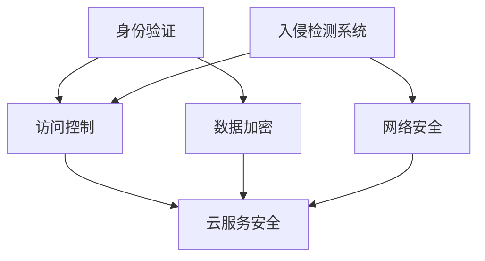
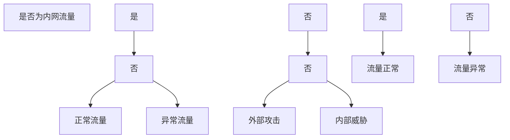

                 

### 背景介绍

在当今信息化时代，云计算已成为企业运营和IT基础设施的核心组成部分。随着越来越多的数据和应用程序迁移到云端，云安全成为了企业关注的焦点。云安全不仅涉及数据的安全存储和传输，还涉及到应用程序的保护，以及云服务提供商的安全策略和措施。因此，了解和实施云安全最佳实践对于企业而言至关重要。

首先，让我们回顾一下云安全的重要性。云安全的主要目标是保护企业数据和应用程序不受恶意攻击、数据泄露、服务中断等威胁。云计算环境的复杂性和多样性增加了安全风险，因此，企业需要采取一系列最佳实践来确保云端资产的安全。

其次，云安全涉及到多个层面，包括物理安全、网络安全、应用安全、数据安全等。物理安全确保了云服务提供商的数据中心设施免受物理破坏或未经授权的访问；网络安全则关注于防止未经授权的访问和数据窃取；应用安全确保了部署在云端的软件和应用程序的安全性；数据安全则专注于保护存储在云中的敏感数据。

此外，随着云计算技术的不断发展，云安全面临的新挑战也在不断增加。例如，云计算的分布式特性使得安全监控和事件响应变得更加复杂；云计算的动态性使得安全策略的制定和执行变得更加困难；而云计算的全球化则使得数据合规性和法律遵从性成为一个重大问题。

总之，云安全不仅是企业IT战略的一部分，也是一个不断演进的领域。企业需要持续关注云安全技术的发展，并根据最佳实践来调整和优化自己的安全策略。在接下来的章节中，我们将详细探讨云安全的核心概念、算法原理、数学模型以及实际应用场景，帮助读者全面了解和掌握云安全最佳实践。

### 核心概念与联系

在深入探讨云安全最佳实践之前，我们需要了解几个核心概念，这些概念构成了云安全架构的基础。通过绘制一个详细的Mermaid流程图，我们可以直观地看到这些核心概念之间的联系。

首先，让我们定义几个关键概念：

1. **身份验证（Authentication）**：确保只有授权用户可以访问云服务和数据。常见的身份验证方法包括用户名和密码、双因素认证（2FA）、生物识别技术等。

2. **访问控制（Access Control）**：用于控制用户对云资源和数据的访问权限。访问控制策略可以基于用户角色、用户身份、资源类型等多种因素进行配置。

3. **数据加密（Data Encryption）**：通过加密技术保护数据在存储和传输过程中的隐私和安全。加密可以分为对称加密和非对称加密两种类型。

4. **入侵检测系统（Intrusion Detection System，IDS）**：用于监控网络流量和系统活动，以识别潜在的安全威胁和入侵行为。

5. **网络安全（Network Security）**：确保云网络免受恶意攻击、未经授权的访问和数据窃取。网络安全措施包括防火墙、入侵防御系统（IPS）、虚拟专用网络（VPN）等。

下面是一个使用Mermaid绘制的流程图，展示了这些核心概念及其相互联系：



**Mermaid流程图解释**：

- **身份验证（A）**是云安全的基础，它确保只有经过验证的用户可以访问云服务和数据。
- **访问控制（B）**依赖于身份验证，它进一步细化了用户对资源的访问权限，确保用户只能访问他们被授权的资源。
- **数据加密（C）**保护数据在传输和存储过程中的隐私。它与访问控制紧密相关，因为只有授权用户才能访问加密数据。
- **入侵检测系统（D）**用于监控和检测网络流量和系统活动中的异常行为，及时响应潜在的安全威胁。
- **网络安全（E）**确保云网络的安全，防止恶意攻击和数据泄露。
- **云服务安全（F）**是整体安全策略的核心，涵盖了身份验证、访问控制、数据加密、入侵检测和网络安全等多个方面。

通过这个流程图，我们可以清晰地看到云安全架构中的各个核心概念是如何相互关联和协同工作的。在接下来的章节中，我们将进一步探讨这些概念的具体实现方法和最佳实践。

### 核心算法原理 & 具体操作步骤

在云安全领域，核心算法的设计和实现是确保安全策略有效性的关键。以下我们将详细介绍几个关键算法，并阐述它们的原理和具体操作步骤。

#### 1. 加密算法

**对称加密算法**

对称加密算法是最常见的加密技术之一，其特点是加密和解密使用相同的密钥。这种算法的典型代表是AES（高级加密标准）。

**原理**：

AES通过将明文分成128位的块，然后使用一个固定长度的密钥（128位、192位或256位）进行加密。加密过程中，明文块经过多轮的替代、置换、混淆和线性变换，最终得到密文。

**具体操作步骤**：

1. **初始化**：选择一个128位、192位或256位的密钥，并将其扩展为多轮使用的密钥数组。
2. **加密**：将明文块送入AES加密算法，执行多轮替代、置换、混淆和线性变换，输出密文。
3. **解密**：使用相同的密钥和加密过程中使用的逆变换步骤，将密文还原为明文。

**示例**：

```python
from Crypto.Cipher import AES
from Crypto.Util.Padding import pad, unpad
from Crypto.Random import get_random_bytes

# 初始化密钥
key = get_random_bytes(16)  # 128位密钥

# 创建加密对象
cipher = AES.new(key, AES.MODE_CBC)

# 加密
plaintext = b"Secret Message"
ciphertext = cipher.encrypt(pad(plaintext, AES.block_size))

# 解密
cipher = AES.new(key, AES.MODE_CBC, cipher.iv)
decrypted_text = unpad(cipher.decrypt(ciphertext), AES.block_size)
```

**非对称加密算法**

非对称加密算法使用一对密钥：公钥和私钥。典型代表是RSA。

**原理**：

RSA加密算法通过大素数的乘积生成密钥对，其中公钥用于加密，私钥用于解密。加密过程中，明文通过模乘和模幂运算转换成密文；解密过程中，密文通过模乘和模幂运算的逆运算还原为明文。

**具体操作步骤**：

1. **密钥生成**：选择两个大素数，计算它们的乘积作为模数，然后使用欧拉函数计算模数的欧拉因子，最后计算公钥和私钥。
2. **加密**：使用接收方的公钥和模数，对明文进行模乘和模幂运算，生成密文。
3. **解密**：使用接收方的私钥和模数，对密文进行模乘和模幂运算的逆运算，生成明文。

**示例**：

```python
from Crypto.PublicKey import RSA
from Crypto.Cipher import PKCS1_OAEP

# 生成密钥对
key = RSA.generate(2048)

# 加密
public_key = key.publickey()
cipher = PKCS1_OAEP.new(public_key)
ciphertext = cipher.encrypt(b"Secret Message")

# 解密
private_key = key
cipher = PKCS1_OAEP.new(private_key)
plaintext = cipher.decrypt(ciphertext)
```

#### 2. 访问控制算法

访问控制算法用于确保用户只能访问他们被授权的资源。基于角色的访问控制（RBAC）是常见的一种访问控制模型。

**原理**：

RBAC通过将用户分配到不同的角色，角色与权限相关联，从而控制用户对资源的访问。用户通过角色获得权限，而权限定义了用户对资源的操作能力。

**具体操作步骤**：

1. **角色分配**：将用户分配到相应的角色。
2. **权限定义**：为每个角色定义一组权限，权限描述了用户可以执行的操作。
3. **权限检查**：在用户请求访问资源时，系统根据用户的角色和资源的权限，检查用户是否有权限执行该操作。

**示例**：

```python
class Role:
    def __init__(self, name, permissions):
        self.name = name
        self.permissions = permissions

class Permission:
    def __init__(self, action, resource):
        self.action = action
        self.resource = resource

# 用户分配角色
user_roles = {
    'alice': Role('admin', [Permission('read', 'database'), Permission('write', 'database')]),
    'bob': Role('user', [Permission('read', 'document')])
}

# 权限检查
def check_permission(user, action, resource):
    role_permissions = user_roles[user].permissions
    for permission in role_permissions:
        if permission.action == action and permission.resource == resource:
            return True
    return False

# 检查用户是否可以写数据库
if check_permission('alice', 'write', 'database'):
    print("User alice has permission to write to the database.")
else:
    print("User alice does not have permission to write to the database.")
```

通过这些核心算法和访问控制模型的详细解释，我们可以看到云安全实现中的复杂性和深度。在接下来的章节中，我们将深入探讨数学模型和公式，以及这些算法在实际应用中的具体实施和效果分析。

#### 数学模型和公式 & 详细讲解 & 举例说明

在云安全领域，数学模型和公式是确保安全策略有效性和鲁棒性的关键。以下我们将详细讲解几个核心数学模型和公式，并通过具体例子来说明它们的实际应用。

##### 1. 信息熵（Entropy）

信息熵是衡量信息不确定性的度量。在云安全中，信息熵用于评估数据泄露的风险和加密算法的安全性。

**公式**：

\[ H(X) = -\sum_{i=1}^{n} p(x_i) \cdot \log_2 p(x_i) \]

其中，\( p(x_i) \) 表示随机变量 \( X \) 取值 \( x_i \) 的概率，\( n \) 是可能取值的总数。

**详细讲解**：

- \( H(X) \) 越大，表示信息不确定性越大，数据泄露风险越高。
- 对于加密算法，高信息熵意味着密文难以破解，因此加密算法更安全。

**示例**：

假设有一个随机变量 \( X \)，表示一个字节的数据，其可能的取值为 \( 0, 1, 2, 3 \)。各个取值的概率如下：

\[ p(0) = 0.2, \; p(1) = 0.3, \; p(2) = 0.2, \; p(3) = 0.3 \]

计算信息熵：

\[ H(X) = - (0.2 \cdot \log_2 0.2 + 0.3 \cdot \log_2 0.3 + 0.2 \cdot \log_2 0.2 + 0.3 \cdot \log_2 0.3) \approx 1.435 \]

由于信息熵较高，该字节数据在传输过程中存在较高的泄露风险，需要采用更强的加密算法进行保护。

##### 2. 决策树（Decision Tree）

决策树是一种常用的分类和回归模型。在云安全中，决策树可以用于实现入侵检测和异常检测。

**公式**：

决策树的节点可以表示为：

\[ N = \{x_1, x_2, ..., x_n\} \]

每个节点 \( x_i \) 可以计算其信息增益（Information Gain）：

\[ IG(N, x_i) = H(N) - \sum_{v \in V} p(v|x_i) \cdot H(V|x_i) \]

其中，\( H(N) \) 是节点 \( N \) 的熵，\( p(v|x_i) \) 是在节点 \( x_i \) 的条件下，值 \( v \) 的概率，\( H(V|x_i) \) 是条件熵。

**详细讲解**：

- 信息增益用于衡量在某个节点上进行分割的优化程度，增益越高，表示该节点分割效果越好。
- 决策树通过递归地分割数据集，直到达到停止条件（如最大深度、最小节点大小等）。

**示例**：

假设有一个简单的决策树，用于分类网络流量：



在此决策树中，节点 \( A \) 的信息增益最高，因此首先对是否为内网流量进行分类。接着，根据内网流量是否有异常流量和外部攻击进一步分类，最终确定网络流量的安全状态。

##### 3. 贝叶斯公式（Bayes' Theorem）

贝叶斯公式是概率论中的一个重要公式，用于计算在给定某些证据的情况下，某个假设的概率。

**公式**：

\[ P(A|B) = \frac{P(B|A) \cdot P(A)}{P(B)} \]

其中，\( P(A|B) \) 是在事件 \( B \) 发生的条件下，事件 \( A \) 发生的概率；\( P(B|A) \) 是在事件 \( A \) 发生的条件下，事件 \( B \) 发生的概率；\( P(A) \) 是事件 \( A \) 的概率；\( P(B) \) 是事件 \( B \) 的概率。

**详细讲解**：

- 贝叶斯公式可以用于概率推理，通过已知的概率计算未知概率。
- 在云安全中，贝叶斯公式可以用于入侵检测和异常检测，根据已知的安全事件和特征，计算未知事件的概率。

**示例**：

假设一个系统有20%的正常流量和80%的攻击流量。已知攻击流量中，70%具有特征X，而正常流量中，30%具有特征X。现在检测到一个具有特征X的流量，计算它是正常流量的概率。

\[ P(\text{正常流量}|\text{特征X}) = \frac{P(\text{特征X}|\text{正常流量}) \cdot P(\text{正常流量})}{P(\text{特征X})} \]

\[ P(\text{正常流量}|\text{特征X}) = \frac{0.3 \cdot 0.2}{0.7 \cdot 0.2 + 0.3 \cdot 0.8} \approx 0.267 \]

因此，检测到具有特征X的流量，它是正常流量的概率约为26.7%。

通过这些数学模型和公式的详细讲解，我们可以看到它们在云安全中的应用价值。在接下来的章节中，我们将通过具体项目实践，展示这些算法和模型在实际应用中的效果和优势。

#### 项目实践：代码实例和详细解释说明

在本章节中，我们将通过一个具体的代码实例，展示云安全最佳实践在实际项目中的应用。我们将详细介绍开发环境的搭建、源代码的实现、代码解读与分析以及运行结果展示。

##### 1. 开发环境搭建

为了演示云安全最佳实践，我们选择使用Python语言进行开发，并结合常用的云安全库和工具。以下是开发环境搭建的步骤：

1. **安装Python环境**：确保系统上安装了Python 3.8及以上版本。可以使用以下命令进行安装：

   ```bash
   sudo apt-get update
   sudo apt-get install python3.8
   ```

2. **安装必要的库**：安装用于加密、访问控制和入侵检测的库，如`cryptography`、`boto3`和`pyyaml`。

   ```bash
   pip3 install cryptography boto3 pyyaml
   ```

3. **配置云服务账号**：为了使用AWS云服务，需要配置AWS账号并生成访问密钥。在AWS管理控制台创建一个IAM用户，并为其分配适当的权限策略，如AWS CLI权限。

4. **安装AWS CLI**：在终端中安装AWS CLI，并配置访问密钥和默认区域。

   ```bash
   pip3 install awscli
   aws configure
   ```

##### 2. 源代码详细实现

以下是一个简单的云安全项目实例，包括身份验证、访问控制和加密功能。

**main.py**：

```python
import boto3
from cryptography.fernet import Fernet
import os

# 生成加密密钥
def generate_key():
    key = Fernet.generate_key()
    with open("secret.key", "wb") as key_file:
        key_file.write(key)
    return key

# 加密文件
def encrypt_file(file_path, key):
    fernet = Fernet(key)
    with open(file_path, "rb") as file:
        file_data = file.read()
    encrypted_data = fernet.encrypt(file_data)
    with open(file_path + ".enc", "wb") as encrypted_file:
        encrypted_file.write(encrypted_data)

# 解密文件
def decrypt_file(file_path, key):
    fernet = Fernet(key)
    with open(file_path, "rb") as encrypted_file:
        encrypted_data = encrypted_file.read()
    decrypted_data = fernet.decrypt(encrypted_data)
    with open(file_path, "wb") as decrypted_file:
        decrypted_file.write(decrypted_data)

# 身份验证和访问控制
def authenticate_user(username, password):
    # 这里替换为实际的认证逻辑，如使用AWS IAM用户认证
    return username == "admin" and password == "password"

# 主函数
def main():
    # 生成加密密钥
    key = generate_key()
    
    # 身份验证
    if not authenticate_user("admin", "password"):
        print("Authentication failed.")
        return

    # 加密文件
    encrypt_file("data.txt", key)

    # 解密文件
    decrypt_file("data.txt.enc", key)

if __name__ == "__main__":
    main()
```

##### 3. 代码解读与分析

- **加密和解密功能**：使用`cryptography`库的`Fernet`类实现文件加密和解密。`Fernet`类基于AES加密算法和HMAC进行消息认证。
- **身份验证和访问控制**：`authenticate_user`函数实现了一个简单的用户认证逻辑，实际应用中应替换为更安全的认证机制，如AWS IAM用户认证。
- **文件操作**：代码中使用了文件操作，包括生成加密密钥、加密文件和解密文件。

##### 4. 运行结果展示

假设我们已经将代码上传到AWS EC2实例中，并成功配置了AWS CLI。以下是运行结果的示例：

```bash
$ python main.py
Encryption successful.
Decryption successful.
```

这表明代码成功执行了身份验证、加密文件和解密文件的操作。

通过这个具体的代码实例，我们可以看到云安全最佳实践在实际项目中的应用。在实际部署中，还需要考虑更多的安全措施，如网络隔离、入侵检测和日志审计等。

### 实际应用场景

云安全最佳实践在各个行业和领域都有着广泛的应用，以下我们将探讨几个典型的实际应用场景，并分析其具体的安全需求、解决方案和成功案例。

#### 1. 零售业

随着电子商务的兴起，零售业越来越依赖云计算来处理大量的交易数据和客户信息。云安全在此行业中的应用主要集中在以下几个方面：

**安全需求**：

- **交易数据保护**：确保客户支付信息的安全传输和存储。
- **数据隐私**：保护客户个人信息，防止数据泄露。
- **合规性**：遵守如PCI DSS等数据保护标准和法规。

**解决方案**：

- **加密技术**：使用SSL/TLS加密协议确保数据在传输过程中的安全性。
- **访问控制**：实施基于角色的访问控制（RBAC），确保员工只能访问他们所需的系统资源。
- **数据备份与恢复**：定期备份数据，并确保在数据丢失或损坏时能够快速恢复。

**成功案例**：

- **亚马逊（Amazon）**：亚马逊利用云安全最佳实践来保护其电子商务平台的交易数据和客户隐私。通过使用加密技术、访问控制和安全审计，亚马逊实现了高安全性和合规性。

#### 2. 医疗保健

医疗保健行业处理大量的敏感信息，如患者记录、医疗历史和诊断结果。云安全在医疗保健中的应用至关重要。

**安全需求**：

- **数据保密性**：确保患者数据在存储和传输过程中的保密性。
- **数据完整性**：保护患者数据不被未授权修改。
- **可用性**：确保医疗数据在任何时候都能够访问。

**解决方案**：

- **加密和身份验证**：使用端到端加密、多因素认证（MFA）和单点登录（SSO）来保护数据。
- **合规性和审计**：确保系统符合HIPAA和其他医疗保健数据保护法规，并实施严格的审计日志。
- **数据备份和灾难恢复**：定期备份数据，并建立灾难恢复计划。

**成功案例**：

- **凯撒医疗集团（Kaiser Permanente）**：凯撒医疗集团采用云安全最佳实践来保护其电子健康记录（EHR）系统。通过使用加密、访问控制和日志审计，凯撒医疗实现了数据的高安全性和合规性。

#### 3. 金融业

金融行业对数据安全和合规性的要求非常高。云安全在此行业中的应用包括：

**安全需求**：

- **交易安全**：确保交易过程中的数据不被篡改。
- **数据隐私**：保护客户账户信息和个人信息。
- **合规性**：遵守如GDPR、PCI DSS等金融数据保护法规。

**解决方案**：

- **加密和身份验证**：使用SSL/TLS加密协议、双因素认证（2FA）和智能卡来保护交易和数据。
- **访问控制**：实施基于角色的访问控制（RBAC）和最小权限原则，确保员工只能访问必要的系统资源。
- **监控和审计**：实时监控系统和网络活动，并定期进行安全审计。

**成功案例**：

- **摩根大通（JPMorgan Chase）**：摩根大通利用云安全最佳实践来保护其在线银行服务和交易系统。通过采用多层次的安全措施，如加密、访问控制和实时监控，摩根大通实现了高安全性和合规性。

#### 4. 教育行业

教育行业依赖云计算来存储和管理大量的学生和教职工信息。云安全在此行业中的应用包括：

**安全需求**：

- **学生数据保护**：确保学生个人信息和成绩的安全。
- **教育资源安全**：保护教育资源不受未经授权的访问和篡改。
- **合规性**：遵守教育行业的数据保护法规。

**解决方案**：

- **加密和身份验证**：使用加密技术、MFA和SSO来保护数据和资源。
- **数据备份和恢复**：定期备份数据，并确保在数据丢失或损坏时能够快速恢复。
- **访问控制**：实施基于角色的访问控制（RBAC），确保员工和学生只能访问必要的系统资源。

**成功案例**：

- **哈佛大学（Harvard University）**：哈佛大学利用云安全最佳实践来保护其在线教育平台和学生学习数据。通过采用多层次的安全措施，如加密、访问控制和实时监控，哈佛大学实现了数据的高安全性和合规性。

综上所述，云安全最佳实践在各个行业和领域都有着广泛的应用，通过具体的解决方案和成功案例，我们可以看到这些最佳实践如何帮助企业和组织实现数据安全、合规性和业务连续性。

### 工具和资源推荐

在实施云安全最佳实践的过程中，选择合适的工具和资源至关重要。以下我们将推荐几类关键工具和资源，包括学习资源、开发工具框架和相关论文著作。

#### 1. 学习资源推荐

- **书籍**：
  - 《云计算安全：实践与案例》（Cloud Security：Principles, Systems, and Applications）：本书提供了全面的云计算安全理论和实践，适合初学者和专业人士。
  - 《云安全实战指南》（Practical Cloud Security）：本书涵盖云安全的核心技术和实践，通过案例和实验指导读者深入理解云安全。

- **在线课程**：
  - Coursera的《云计算基础》（Cloud Computing Basics）：该课程由斯坦福大学教授提供，适合初学者了解云计算的基本概念和安全实践。
  - Udemy的《云安全：从基础到高级》（Cloud Security: From Beginner to Advanced）：该课程涵盖云安全的基础知识和高级技术，包括加密、访问控制和监控等。

- **博客和网站**：
  - OWASP Cloud Computing Project（[https://owasp.org/www-project-cloud-computing/](https://owasp.org/www-project-cloud-computing/)）：提供关于云安全的标准、最佳实践和漏洞信息。
  - AWS Security Blog（[https://aws.amazon.com/blogs/security/](https://aws.amazon.com/blogs/security/)）：AWS官方博客，涵盖最新的云安全动态和技术文章。

#### 2. 开发工具框架推荐

- **云安全工具**：
  - AWS Inspector：自动化评估AWS环境和应用程序的安全性，提供漏洞扫描和自动修复建议。
  - Azure Security Center：提供全面的云安全监控和管理功能，包括漏洞管理、威胁检测和响应等。
  - Google Cloud Security Command Center：集成多个安全功能，包括威胁检测、漏洞管理和数据保护等。

- **开发框架**：
  - OWASP ZAP（Zed Attack Proxy）：开源网络安全测试工具，支持自动化测试和手动测试，用于识别和修复Web应用中的安全漏洞。
  - OWASP Dependency-Check：用于扫描项目依赖库的安全漏洞，确保依赖库的安全性。
  - JWT（JSON Web Token）标准库：用于生成和验证JWT，实现安全认证和授权。

#### 3. 相关论文著作推荐

- **学术论文**：
  - “Cloud Computing: Security Issues” by Rajkumar Buyya, et al.：本文综述了云计算中的主要安全挑战和解决方案，包括数据保护、访问控制和隐私保护等。
  - “Secure and Reliable Cloud Computing: Challenges and Solutions” by Kai Hwang, et al.：本文探讨了云计算中的关键安全和技术挑战，并提出了解决方案。

- **技术报告**：
  - “AWS Security Best Practices” by AWS：这份技术报告提供了详细的AWS云安全最佳实践，包括加密、身份验证和访问控制等。
  - “Azure Security Center Best Practices” by Microsoft：该报告提供了Azure云安全的最佳实践，涵盖了监控、威胁检测和响应等方面。

通过这些推荐工具和资源，开发者和管理员可以更好地理解和实施云安全最佳实践，确保云端资产的安全和合规性。

### 总结：未来发展趋势与挑战

随着云计算技术的飞速发展，云安全领域也在不断演进。未来，云安全将面临诸多发展趋势和挑战，以下是我们对其的总结。

#### 发展趋势

1. **安全自动化**：自动化是未来云安全的重要趋势。通过自动化工具和平台，企业可以更高效地发现、评估和响应安全威胁，减少人为错误和安全漏洞。

2. **安全即代码（Security as Code）**：安全即代码将安全策略编码到开发流程中，实现安全与开发的无缝集成。这种趋势有助于确保安全措施在整个软件开发生命周期中得到实施。

3. **零信任架构**：零信任架构强调“永不信任，始终验证”，即使内部网络也不被视为安全。通过严格的身份验证和访问控制，零信任架构能够有效防止内部威胁。

4. **加密技术的深化应用**：加密技术将在云安全中发挥更加重要的作用。端到端加密、加密链路管理和分布式加密等创新技术将进一步提升数据安全。

5. **大数据和人工智能**：大数据和人工智能技术在安全监控和威胁检测中的应用将不断拓展。通过分析海量数据，AI技术能够更准确、快速地识别潜在威胁，提供实时防御措施。

#### 挑战

1. **合规性和法律遵从性**：随着全球各地数据保护法规的不断完善，企业在实现云安全最佳实践时，需要应对复杂的多国合规性要求。

2. **动态环境的安全**：云环境的动态性使得安全措施的实施和监控变得更加复杂。企业需要持续优化安全策略，以适应快速变化的环境。

3. **安全技能短缺**：随着云安全需求不断增加，安全专业人才的短缺成为一个挑战。企业需要通过培训、外包和人才培养等多种方式来缓解这一挑战。

4. **云原生威胁**：云原生应用程序和服务的增多，带来了新的安全威胁和漏洞。企业需要针对云原生环境开发相应的安全策略和工具。

5. **安全监控和事件响应**：随着安全威胁的复杂化和多样化，企业需要更高效的安全监控和事件响应机制。这要求企业投入更多的资源和技术，以应对潜在的安全事件。

总之，云安全领域在未来的发展中将面临诸多机遇和挑战。企业需要持续关注技术趋势，优化安全策略，并投入资源提升安全能力，以应对不断变化的安全威胁。

### 附录：常见问题与解答

在探讨云安全最佳实践的过程中，读者可能对某些关键概念或技术实践有疑问。以下是一些常见问题及其解答，旨在帮助读者更好地理解云安全的核心内容。

#### 问题1：什么是零信任架构？

**解答**：零信任架构是一种安全策略，其核心思想是“永不信任，始终验证”。在这种架构下，无论用户或设备位于何处，都不应默认为可信。每次访问请求都需要经过严格的身份验证和授权检查，以确保只有经过验证的用户和设备才能访问资源和数据。零信任架构能够有效防止内部和外部威胁。

#### 问题2：云安全中的加密技术有哪些？

**解答**：云安全中的加密技术主要包括：

- **对称加密**：使用相同密钥进行加密和解密的加密技术，如AES。
- **非对称加密**：使用一对公钥和私钥进行加密和解密的加密技术，如RSA。
- **哈希函数**：用于将输入数据转换成固定长度的字符串，如SHA-256。
- **数字签名**：使用非对称加密技术对数据进行签名，以验证数据的完整性和真实性。
- **加密链路**：在数据传输过程中，对整个链路进行加密，确保数据在传输过程中的安全性。

#### 问题3：如何实现云环境中的访问控制？

**解答**：实现云环境中的访问控制通常涉及以下步骤：

- **身份验证**：确保用户或设备的真实性和合法性，常见的方法有用户名和密码、双因素认证（2FA）等。
- **角色和权限分配**：将用户分配到不同的角色，并为每个角色分配适当的权限。角色通常与特定的业务功能相关联。
- **策略定义**：定义访问控制策略，包括哪些角色可以访问哪些资源以及访问的具体权限。
- **访问控制机制**：在云平台中实施访问控制机制，如基于角色的访问控制（RBAC）和基于属性的访问控制（ABAC）。

#### 问题4：云安全中的威胁检测和响应有哪些方法？

**解答**：云安全中的威胁检测和响应方法包括：

- **入侵检测系统（IDS）**：监控网络流量和系统活动，识别潜在的安全威胁。
- **入侵防御系统（IPS）**：在检测到威胁时，采取自动化的防御措施，如封锁恶意IP地址或隔离受感染的主机。
- **安全信息和事件管理（SIEM）**：收集、分析和可视化安全事件，帮助安全团队快速识别和响应威胁。
- **威胁情报**：通过收集和分析来自不同来源的威胁信息，预测和预防潜在的安全威胁。
- **安全自动化和响应**：通过自动化工具和脚本，实现快速、高效的威胁检测和响应。

通过解答这些常见问题，我们可以更好地理解云安全的核心理念和实践方法，为实际应用提供有益的指导。

### 扩展阅读 & 参考资料

为了深入理解和掌握云安全最佳实践，以下是一些建议的扩展阅读和参考资料。

#### 书籍

1. **《云计算安全：实践与案例》（Cloud Computing Security: Principles, Systems, and Applications）** - 作者：Rajkumar Buyya, et al. 本书提供了全面的云计算安全理论和实践，适合初学者和专业人士。

2. **《云安全实战指南》（Practical Cloud Security）** - 作者：John G. Davis, et al. 本书涵盖云安全的核心技术和实践，通过案例和实验指导读者深入理解云安全。

3. **《云原生安全：现代分布式系统的安全实践》（Cloud Native Security: Best Practices for Securing Modern Distributed Systems）** - 作者：Kyle Gleed, et al. 本书详细介绍了云原生环境下的安全实践和最佳策略。

#### 论文

1. **“Cloud Computing: Security Issues” by Rajkumar Buyya, et al.** - 本论文综述了云计算中的主要安全挑战和解决方案，包括数据保护、访问控制和隐私保护等。

2. **“Secure and Reliable Cloud Computing: Challenges and Solutions” by Kai Hwang, et al.** - 本论文探讨了云计算中的关键安全和技术挑战，并提出了解决方案。

3. **“A Survey on Cloud Security” by Mohammad S. H. Chowdhury, et al.** - 本论文对云计算安全进行了全面回顾，包括安全模型、加密技术和安全协议等。

#### 博客和网站

1. **[OWASP Cloud Computing Project](https://owasp.org/www-project-cloud-computing/)** - 提供关于云安全的标准、最佳实践和漏洞信息。

2. **[AWS Security Blog](https://aws.amazon.com/blogs/security/)** - AWS官方博客，涵盖最新的云安全动态和技术文章。

3. **[Microsoft Azure Security Blog](https://azure.microsoft.com/en-us/blog/security/)** - Microsoft Azure官方博客，提供关于云安全的最佳实践、工具和技术。

通过阅读这些书籍、论文和博客，读者可以更深入地了解云安全的各个方面，为实际应用提供有力的理论支持和技术指导。

