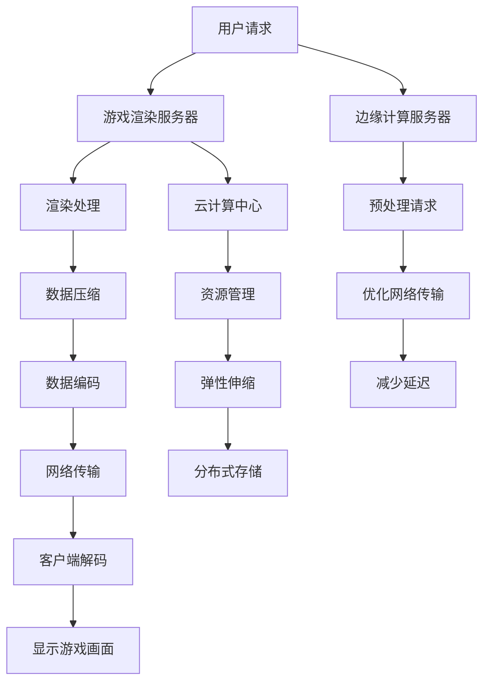

                 

### 1. 背景介绍

云游戏技术，作为近年来迅速崛起的新兴领域，正引领着游戏产业的变革。传统游戏在本地设备的运行模式已经不能满足用户对游戏性能和便捷性的不断追求。云游戏的诞生，不仅解决了设备性能限制的问题，还打破了地理和硬件的壁垒，让用户可以随时随地享受高品质的游戏体验。

#### 1.1 发展历程

云游戏的概念最早可以追溯到20世纪90年代，当时研究者们开始探索利用服务器端计算资源来运行游戏。然而，由于网络带宽和计算能力的限制，云游戏技术在当时并未得到广泛的应用。随着互联网技术的发展，尤其是宽带网络和云计算技术的成熟，云游戏开始逐渐走入公众视野。2010年后，随着HTML5、WebGL等新技术的出现，云游戏得到了进一步的发展，越来越多的游戏开发者开始尝试将游戏部署到云端。

#### 1.2 现状

目前，云游戏市场已经形成了几家主要竞争者，包括谷歌的Stadia、亚马逊的Luna、NVIDIA的GeForce Now等。这些平台都提供了一种全新的游戏体验，用户无需购买昂贵的游戏主机或高性能电脑，只需通过互联网连接到云端，就可以享受到高质量的游戏。

#### 1.3 主要挑战

尽管云游戏技术已经取得了显著的进展，但仍然面临一些挑战：

1. **网络延迟**：网络延迟是影响云游戏用户体验的关键因素。由于游戏数据需要在服务器和客户端之间来回传输，因此任何网络延迟都会影响游戏的流畅度。
2. **带宽限制**：高带宽是云游戏的基础要求，但并非所有地区都能提供足够的带宽。在一些带宽有限的地区，云游戏的体验可能会大打折扣。
3. **服务器负载**：随着用户数量的增加，服务器负载会成为限制云游戏扩展的重要因素。如果服务器无法及时响应用户请求，游戏体验将会受到影响。
4. **安全性**：云游戏涉及大量的用户数据和游戏内容，因此安全性是必须考虑的重要因素。如何确保用户数据和游戏内容的安全，是云游戏发展中必须解决的问题。

#### 1.4 目标与前景

云游戏的目标是提供一种无缝、高质量的跨平台游戏体验。未来，随着5G网络的普及和云计算技术的进一步发展，云游戏有望解决现有的技术挑战，成为游戏产业的重要组成部分。此外，云游戏还可以与其他技术如虚拟现实（VR）、增强现实（AR）相结合，创造更多新的游戏体验。

总的来说，云游戏技术正处于快速发展的阶段，尽管面临诸多挑战，但其带来的变革和机遇是毋庸置疑的。随着技术的不断进步，我们有理由相信，云游戏将在未来发挥越来越重要的作用。

### 2. 核心概念与联系

要深入理解云游戏技术，首先需要明确几个核心概念：游戏渲染、网络传输、云计算和边缘计算。

#### 2.1 游戏渲染

游戏渲染是游戏画面生成的重要环节。在传统的本地游戏中，游戏渲染主要在玩家的个人电脑或游戏主机上完成。而在云游戏中，游戏渲染过程被移到了服务器端。这意味着游戏画面由服务器生成，然后通过网络传输到玩家的设备上。这种模式带来了几个显著的好处：

1. **硬件无关性**：玩家不需要拥有高性能的硬件设备，服务器端的强大计算能力可以替代个人设备的限制。
2. **资源共享**：多个玩家可以共享同一组服务器资源，提高资源利用率。
3. **可扩展性**：服务器可以根据需求动态调整计算资源，满足不同用户的游戏需求。

然而，游戏渲染的移除也带来了一些挑战，如网络延迟和带宽限制等。为解决这些问题，云游戏技术需要优化渲染算法，提高图像传输的效率。

#### 2.2 网络传输

网络传输是云游戏中的另一个关键环节。游戏画面从服务器传输到客户端，需要经历以下几个步骤：

1. **数据压缩**：为了减少网络传输的带宽占用，游戏数据通常需要进行压缩处理。常用的压缩算法包括H.264、H.265等视频编码技术。
2. **数据编码**：压缩后的游戏数据需要编码成适合网络传输的格式，如HTTP流或WebRTC。
3. **传输优化**：网络传输过程中，需要考虑路径选择、拥塞控制和错误纠正等问题，以确保数据传输的稳定性和可靠性。

网络传输的质量直接影响到云游戏的用户体验。因此，云游戏技术需要不断优化传输算法，提高传输效率，减少延迟。

#### 2.3 云计算

云计算是云游戏技术的核心支撑。云计算通过提供灵活的计算资源，使云游戏得以实现。云计算技术包括以下几个方面：

1. **计算资源管理**：通过虚拟化技术，将物理服务器资源抽象为虚拟资源，供用户按需分配和使用。
2. **弹性伸缩**：根据用户需求动态调整计算资源，确保系统稳定运行。
3. **分布式存储**：将游戏数据存储在分布式存储系统中，提高数据存储的可靠性和访问速度。

云计算的灵活性和可扩展性，使得云游戏能够快速适应不同的用户需求，提供高质量的体验。

#### 2.4 边缘计算

边缘计算是云计算的一种补充，它将计算任务从云端转移到网络边缘。边缘计算在云游戏中具有重要作用，可以解决以下问题：

1. **减少延迟**：将部分计算任务分配到网络边缘，减少数据传输距离，降低网络延迟。
2. **优化资源分配**：在网络边缘处理部分计算任务，可以减轻云端服务器的负担，提高整体系统的性能。
3. **提高响应速度**：边缘计算能够更快地响应用户请求，提供更流畅的游戏体验。

边缘计算与云计算相结合，可以为云游戏提供更加高效、稳定的支持。

#### 2.5 Mermaid 流程图

以下是一个简化的云游戏技术架构的 Mermaid 流程图，展示上述核心概念之间的联系：



这个流程图清晰地展示了云游戏技术的核心概念和组成部分，以及它们之间的相互作用。

### 3. 核心算法原理 & 具体操作步骤

在了解了云游戏技术的基本架构和核心概念后，接下来我们将深入探讨云游戏技术中的核心算法原理和具体操作步骤。这些算法和步骤不仅决定了云游戏的性能和用户体验，还直接影响到云游戏的可靠性和可扩展性。

#### 3.1 游戏渲染算法

游戏渲染是云游戏中的核心环节，其质量直接影响用户的游戏体验。云游戏中的游戏渲染算法主要包括以下几个方面：

1. **纹理映射**：纹理映射是一种将二维图像映射到三维模型表面的技术。通过纹理映射，可以显著提升游戏画面的真实感。在云游戏中，纹理映射通常通过服务器端计算，然后将渲染结果传输到客户端。

2. **光照计算**：光照计算是游戏渲染中的另一个重要环节。正确计算光照可以显著提升游戏画面的视觉质量。云游戏中的光照计算通常采用光线追踪技术，这是一种计算光线与场景交互的方法。光线追踪可以模拟真实世界的光照效果，但计算复杂度较高。

3. **渲染优化**：为了提高渲染效率，云游戏技术采用了多种渲染优化算法。例如，光照贴图（Lightmaps）和光子映射（Photon Maps）可以减少实时光照计算的复杂度；LOD（Level of Detail）技术可以根据物体距离调整渲染细节，从而在保证视觉效果的同时减少计算资源消耗。

#### 3.2 游戏渲染的具体操作步骤

以下是游戏渲染的具体操作步骤：

1. **接收用户请求**：服务器端接收到用户的游戏请求后，根据用户的游戏配置和游戏类型，选择合适的渲染服务器。

2. **初始化渲染资源**：在渲染服务器上初始化渲染资源，包括显卡、内存和纹理资源等。

3. **加载游戏场景**：将游戏场景从分布式存储系统中加载到内存中，并设置初始状态。

4. **执行纹理映射**：根据游戏场景的纹理信息，执行纹理映射操作，将纹理图像映射到三维模型表面。

5. **计算光照**：利用光线追踪技术计算场景中的光照效果，生成光照贴图或光子映射。

6. **渲染画面**：根据光照计算结果，渲染游戏场景的每一个帧。这个过程包括多个渲染阶段，如顶点着色、片段着色等。

7. **数据压缩**：将渲染结果压缩成适合网络传输的格式，如使用H.264或H.265视频编码技术。

8. **数据编码**：将压缩后的数据编码成HTTP流或WebRTC流，准备传输到客户端。

9. **传输画面**：通过优化后的网络传输算法，将编码后的画面数据传输到客户端。

10. **客户端解码**：客户端接收到画面数据后，对其进行解码，生成游戏画面并显示在屏幕上。

#### 3.3 网络传输算法

网络传输是云游戏技术中的关键环节，其质量直接影响到游戏的流畅度和用户体验。为了提高网络传输效率，云游戏技术采用了多种网络传输算法：

1. **数据压缩**：通过数据压缩算法，减少游戏画面的数据量，降低网络带宽占用。常用的压缩算法包括H.264、H.265和VP9等。

2. **传输优化**：通过网络传输优化算法，提高数据的传输速度和稳定性。常用的传输优化算法包括拥塞控制、路径选择和错误纠正等。

3. **动态传输**：根据网络状况动态调整传输策略，如根据网络带宽和延迟调整数据传输速率。

#### 3.4 网络传输的具体操作步骤

以下是网络传输的具体操作步骤：

1. **初始化网络连接**：客户端和服务器端建立网络连接，并初始化传输参数。

2. **数据压缩**：将游戏画面数据压缩成适合网络传输的格式。

3. **数据编码**：将压缩后的数据编码成HTTP流或WebRTC流。

4. **传输数据**：通过优化后的网络传输算法，将编码后的数据传输到客户端。

5. **接收数据**：客户端接收到数据后，对其进行解码和渲染。

6. **调整传输策略**：根据网络状况动态调整传输策略，如根据网络带宽和延迟调整数据传输速率。

通过上述步骤，云游戏技术可以高效、稳定地将游戏画面从服务器传输到客户端，为用户提供优质的视觉体验。

综上所述，云游戏技术的核心算法原理和具体操作步骤决定了其性能和用户体验。通过优化渲染算法和传输算法，云游戏技术可以提供高质量、低延迟的游戏体验，满足用户对游戏性能和便捷性的要求。随着技术的不断进步，我们有理由相信，云游戏技术将迎来更加光明的发展前景。

### 4. 数学模型和公式 & 详细讲解 & 举例说明

在云游戏技术中，数学模型和公式扮演着至关重要的角色。它们不仅用于优化游戏渲染和网络传输，还用于评估系统性能和用户体验。以下是一些关键的数学模型和公式，以及它们的详细讲解和具体示例。

#### 4.1 渲染延迟模型

渲染延迟是云游戏中的一个关键性能指标。它决定了游戏画面的更新频率和用户体验的流畅度。渲染延迟可以通过以下公式计算：

$$
\text{渲染延迟} = \text{网络延迟} + \text{渲染时间} + \text{服务器处理时间}
$$

其中：
- **网络延迟**：指游戏画面数据在网络中传输的时间，可以通过以下公式计算：

$$
\text{网络延迟} = \frac{\text{数据大小}}{\text{带宽}}
$$

- **渲染时间**：指服务器渲染一帧画面所需的时间，可以通过以下公式计算：

$$
\text{渲染时间} = \frac{\text{场景复杂度}}{\text{渲染性能}}
$$

- **服务器处理时间**：指服务器处理游戏输入和输出所需的时间，可以通过以下公式计算：

$$
\text{服务器处理时间} = \text{输入处理时间} + \text{输出处理时间}
$$

举例说明：

假设网络带宽为10 Mbps，场景复杂度为1000三角形，渲染性能为1000三角形/秒，服务器处理时间为20 ms。则渲染延迟为：

$$
\text{渲染延迟} = \frac{1000 \times 1024}{10 \times 1024 \times 8} + \frac{1000}{1000} + 20 = 128 + 1 + 20 = 149 \text{ ms}
$$

#### 4.2 带宽需求模型

带宽需求是云游戏中的另一个重要性能指标。它决定了服务器需要提供多少带宽来支持所有用户的游戏需求。带宽需求可以通过以下公式计算：

$$
\text{带宽需求} = \sum_{i=1}^{n} \text{用户}_i \times \text{带宽利用率}
$$

其中：
- **用户**：指连接到云游戏服务器的用户数量。
- **带宽利用率**：指用户在特定时间内实际使用的带宽比例。

举例说明：

假设有1000个用户，每个用户的带宽利用率为50%。则总带宽需求为：

$$
\text{带宽需求} = 1000 \times 0.5 \times 8 \times 1024 \times 1024 = 400 \text{ Mbps}
$$

#### 4.3 数据压缩效率模型

数据压缩效率是云游戏中的另一个关键性能指标。它决定了服务器传输数据所需的时间。数据压缩效率可以通过以下公式计算：

$$
\text{压缩效率} = \frac{\text{原始数据大小}}{\text{压缩后数据大小}}
$$

举例说明：

假设游戏画面的原始数据大小为1 GB，压缩后数据大小为200 MB。则压缩效率为：

$$
\text{压缩效率} = \frac{1 \text{ GB}}{200 \text{ MB}} = 5
$$

#### 4.4 网络延迟优化模型

网络延迟优化是云游戏技术中的一个重要挑战。通过网络路径选择和传输优化，可以降低网络延迟，提高游戏体验。网络延迟优化模型可以通过以下公式计算：

$$
\text{优化后延迟} = \text{原始延迟} \times \text{优化因子}
$$

其中：
- **原始延迟**：指游戏画面数据在网络中的原始延迟。
- **优化因子**：指通过优化算法降低的网络延迟比例。

举例说明：

假设游戏画面的原始延迟为100 ms，优化因子为0.8。则优化后延迟为：

$$
\text{优化后延迟} = 100 \text{ ms} \times 0.8 = 80 \text{ ms}
$$

通过上述数学模型和公式的详细讲解和举例说明，我们可以更好地理解云游戏技术中的关键性能指标和优化方法。这些模型和公式不仅帮助我们评估系统性能，还为云游戏技术的进一步研究和开发提供了理论基础。

### 5. 项目实践：代码实例和详细解释说明

#### 5.1 开发环境搭建

在开始编写云游戏代码之前，我们需要搭建一个合适的环境。以下是一个基本的开发环境搭建步骤：

1. **安装编程语言**：选择一个适合的语言，如Python或JavaScript，安装相应的编译器或解释器。
2. **安装依赖库**：根据项目需求，安装所需的依赖库，例如网络传输库（如Socket.IO）和游戏渲染库（如Unity3D或Unreal Engine）。
3. **配置服务器**：搭建服务器，可以选择使用云服务器或本地服务器。配置服务器时，确保安装了必要的软件和服务，如HTTP服务器（如Nginx）和数据库（如MySQL）。
4. **安装开发工具**：安装代码编辑器（如Visual Studio Code或Atom），以及版本控制工具（如Git）。

以下是一个简单的Python环境搭建示例：

```bash
# 安装Python
pip install python

# 安装网络传输库
pip install socketio

# 安装游戏渲染库
pip install pygame
```

#### 5.2 源代码详细实现

下面是一个简单的云游戏项目示例，包括服务器端和客户端的代码。该示例使用Python和Socket.IO实现基本的云游戏功能。

**服务器端代码（server.py）：**

```python
from socketio import Server
from pygame import display, event

# 创建Socket.IO服务器实例
sio = Server()

@sio.on('connect')
def connect(req):
    print('Client connected')

    # 初始化游戏画面
    display.init()
    display.set_mode((800, 600))

    # 处理游戏输入
    while True:
        for event in event.get():
            if event.type == event.QUIT:
                sio.emit('input', {'type': 'quit'})
                break
            elif event.type == event.KEYDOWN:
                sio.emit('input', {'type': 'keydown', 'key': event.key})
            elif event.type == event.KEYUP:
                sio.emit('input', {'type': 'keyup', 'key': event.key})

        # 渲染游戏画面
        display.fill((0, 0, 0))
        sio.emit('frame', display.get_surface().convert())

        # 更新画面
        display.update()

@sio.on('disconnect')
def disconnect(req):
    print('Client disconnected')

# 启动服务器
sio.run(host='0.0.0.0', port=3000)
```

**客户端代码（client.py）：**

```python
import socketio
import pygame
import sys

# 创建Socket.IO客户端实例
sio = socketio.Client()

# 连接到服务器
sio.connect('http://127.0.0.1:3000')

# 初始化游戏画面
display.init()
display.set_mode((800, 600))

# 游戏主循环
while True:
    for event in pygame.event.get():
        if event.type == pygame.QUIT:
            sio.disconnect()
            pygame.quit()
            sys.exit()

    # 接收服务器发送的输入和画面帧
    if sio.has_connect():
        input_data = sio.receive('input')
        frame_data = sio.receive('frame')

        # 根据输入更新游戏状态
        if input_data:
            if input_data['type'] == 'keydown':
                # 处理按键按下
                print('Key pressed:', input_data['key'])
            elif input_data['type'] == 'keyup':
                # 处理按键释放
                print('Key released:', input_data['key'])

        # 解码服务器发送的画面帧
        if frame_data:
            frame = pygame.image.fromstring(frame_data.tobytes(), (800, 600), 3)
            display.blit(frame, (0, 0))

        # 更新画面
        display.update()
```

#### 5.3 代码解读与分析

以上代码实现了一个基本的云游戏项目，其中服务器端使用Socket.IO处理客户端的连接、输入和画面帧的传输，客户端则接收服务器端发送的输入和画面帧，并在本地渲染游戏画面。

**服务器端解析：**

- **连接处理**：使用`@sio.on('connect')`装饰器定义了连接事件的处理函数`connect`，当客户端连接到服务器时，打印连接信息。
- **游戏输入处理**：使用`event.get()`获取游戏输入事件，并根据输入类型（按键按下或按键释放）发送到客户端。
- **画面渲染**：使用`display.get_surface().convert()`获取当前游戏画面的表面，并将其发送到客户端。

**客户端解析：**

- **连接与接收**：使用`sio.connect()`连接到服务器，并使用`sio.receive()`接收服务器发送的输入和画面帧。
- **游戏状态更新**：根据接收到的输入数据更新游戏状态。
- **画面渲染**：使用`pygame.image.fromstring()`解码服务器发送的画面帧，并将其绘制到游戏画面上。

#### 5.4 运行结果展示

要运行上述代码，首先需要启动服务器，然后运行客户端。以下是运行结果：

1. **启动服务器**：
   ```bash
   python server.py
   ```

2. **运行客户端**：
   ```bash
   python client.py
   ```

客户端将显示一个游戏窗口，用户可以在窗口内进行操作，如按键输入。服务器端会接收客户端的输入并渲染画面帧，然后将画面帧传输回客户端。

通过这个简单的示例，我们可以看到云游戏技术的基本实现过程。虽然这个示例仅提供了最基本的功能，但它展示了云游戏的核心技术和实现方法。在此基础上，我们可以进一步扩展和优化，实现更复杂和更高效的云游戏应用。

### 6. 实际应用场景

云游戏技术在多个实际应用场景中展现了其独特的优势。以下是一些典型的应用场景：

#### 6.1 家庭娱乐

家庭娱乐是云游戏最常见的应用场景之一。随着消费者对游戏体验的需求不断提高，许多家庭不愿意或无法投资昂贵的游戏设备。云游戏提供了一个低成本、高品质的解决方案，用户只需通过互联网连接，就可以享受到高性能的游戏体验。特别是在共享家庭环境中，云游戏可以轻松实现多人游戏，增加了家庭互动的乐趣。

#### 6.2 商务办公

商务办公场景中，云游戏也有广泛的应用。员工可以在公司的内部网络或远程服务器上访问游戏，这有助于缓解工作压力，提高工作效率。此外，云游戏可以作为一种团队建设工具，通过多人在线游戏活动，增强团队合作精神。

#### 6.3 移动设备

移动设备由于其便携性和普及性，成为云游戏的重要市场。用户可以通过手机或平板电脑随时随地玩游戏，无需担心设备性能的限制。随着5G网络的普及，移动云游戏的市场潜力将进一步扩大。

#### 6.4 虚拟现实（VR）和增强现实（AR）

虚拟现实（VR）和增强现实（AR）技术对硬件设备有较高的要求。云游戏技术可以提供强大的计算资源，为VR和AR应用提供支持。用户只需通过头戴式显示器或其他设备连接到云端，就可以体验到高质量的VR和AR游戏或应用。

#### 6.5 社交互动

云游戏不仅是一种娱乐方式，还可以作为一种社交互动的工具。玩家可以在线组队、竞技，甚至与朋友一起玩，这为游戏社交提供了新的可能。云游戏平台可以集成社交媒体功能，使玩家能够更方便地分享游戏经验。

#### 6.6 教育培训

在教育领域，云游戏技术可以用于模拟教学场景，帮助学生更好地理解和掌握知识点。例如，医学教育中可以使用云游戏技术模拟手术过程，提供实时的操作指导和反馈。

总的来说，云游戏技术在各种实际应用场景中都展现了其独特的优势。随着技术的不断发展和用户需求的多样化，云游戏的应用前景将更加广阔。

### 7. 工具和资源推荐

为了更好地学习和开发云游戏技术，以下是几种推荐的工具和资源：

#### 7.1 学习资源推荐

1. **书籍**：
   - 《云游戏技术：原理与实践》
   - 《游戏引擎编程：基于Unity3D和Unreal Engine》
   - 《计算机网络：自顶向下方法》

2. **在线课程**：
   - Coursera上的“云游戏与分布式计算”课程
   - Udemy上的“云游戏开发实战：从零开始构建自己的游戏平台”

3. **论文**：
   - “Cloud Gaming: A Technical Overview” by Intel
   - “A Survey of Cloud Gaming Technologies” by Springer

4. **博客和网站**：
   - NVIDIA GeForce Now官方博客
   - Stadia社区论坛
   - 游戏开发者论坛（GDC）相关文章

#### 7.2 开发工具框架推荐

1. **游戏引擎**：
   - Unity3D：一款功能强大的跨平台游戏引擎，适合初学者和专业人士。
   - Unreal Engine：一款高性能的游戏引擎，适合制作大型游戏和VR/AR应用。

2. **云计算平台**：
   - AWS GameSparks：提供了一整套云游戏开发工具和服务。
   - Google Cloud Platform：提供了强大的云计算资源，适合构建高性能的云游戏平台。

3. **网络传输库**：
   - Socket.IO：一款基于WebSocket的实时通信库，适合开发实时交互的云游戏应用。
   - WebRTC：一款支持实时语音、视频和数据传输的开放协议，适合实现高效的云游戏传输。

4. **边缘计算平台**：
   - AWS Lambda：一种无服务器计算服务，适合在边缘设备上运行计算任务。
   - Azure Functions：一种基于云的服务，适合构建边缘计算应用。

通过使用上述工具和资源，开发者可以更高效地学习和开发云游戏技术，探索云游戏领域的无限可能。

### 8. 总结：未来发展趋势与挑战

云游戏技术自问世以来，经历了从概念验证到逐步普及的过程。当前，云游戏市场已经形成了一定的规模，主要竞争者包括谷歌的Stadia、亚马逊的Luna和NVIDIA的GeForce Now等。这些平台通过提供高性能、低延迟的云游戏体验，吸引了大量用户。然而，云游戏技术的发展并非一帆风顺，面临着诸多挑战和机遇。

#### 8.1 未来发展趋势

1. **5G网络普及**：随着5G网络的快速部署，网络带宽和延迟将显著降低，为云游戏提供了更好的基础条件。5G网络的高速度、低延迟特性将大幅提升云游戏的用户体验，使其在更多地区得到普及。

2. **云计算与边缘计算的结合**：云计算和边缘计算的结合将为云游戏提供更加灵活和高效的解决方案。边缘计算可以将部分计算任务分配到网络边缘，减少数据传输距离，降低网络延迟，提高游戏性能。

3. **VR/AR的融合**：虚拟现实（VR）和增强现实（AR）技术的快速发展，为云游戏带来了新的应用场景。通过云计算提供强大的计算支持，云游戏可以更好地满足VR/AR应用对高性能和高稳定性的需求。

4. **跨平台支持**：云游戏技术的发展将推动游戏跨平台玩的实现，用户可以在不同的设备上无缝切换游戏，享受一致的游戏体验。

5. **商业模式创新**：云游戏将推动新的商业模式的出现，如按需付费、订阅制等，为游戏开发者提供更多收入来源。

#### 8.2 面临的挑战

1. **网络延迟和带宽限制**：虽然5G网络将显著降低网络延迟和带宽限制，但在一些偏远地区，网络条件仍然较差，这将成为云游戏普及的障碍。

2. **服务器负载和扩展性**：随着用户数量的增加，服务器负载和扩展性将成为挑战。如何高效地管理服务器资源，确保系统稳定运行，是云游戏需要解决的关键问题。

3. **安全性问题**：云游戏涉及大量的用户数据和游戏内容，因此安全性是必须考虑的重要因素。如何保护用户数据不被泄露，防止游戏内容被盗用，是云游戏技术需要面对的挑战。

4. **成本问题**：云游戏需要大量的计算资源和网络带宽支持，这将对运营成本产生巨大压力。如何优化成本结构，提高资源利用率，是云游戏服务提供商需要考虑的问题。

#### 8.3 发展前景

尽管面临诸多挑战，云游戏技术在未来仍具有巨大的发展潜力。随着5G网络的普及和云计算技术的不断进步，云游戏将实现更广泛的应用，成为游戏产业的重要组成部分。同时，云游戏与其他技术的融合，如VR/AR、边缘计算等，将进一步拓展其应用场景，推动游戏体验的革新。

总之，云游戏技术正处于快速发展阶段，尽管面临挑战，但其带来的变革和机遇是显而易见的。随着技术的不断进步，我们有理由相信，云游戏将在未来发挥越来越重要的作用，为用户提供更加丰富、便捷的游戏体验。

### 9. 附录：常见问题与解答

在深入了解云游戏技术时，用户可能会遇到一些常见问题。以下是一些常见问题的解答：

#### 9.1 什么是云游戏？

云游戏是一种通过互联网连接到远程服务器，在云端运行游戏并实时传输游戏画面和输入到本地设备的游戏模式。用户无需购买高性能的游戏设备，只需通过互联网连接，就可以享受高质量的云游戏体验。

#### 9.2 云游戏有哪些优点？

云游戏的主要优点包括：
- **硬件无关性**：用户无需购买高性能的游戏设备，只需通过互联网连接即可玩游戏。
- **跨平台**：用户可以在不同的设备上（如电脑、手机、平板）无缝切换游戏，享受一致的游戏体验。
- **资源共享**：多个用户可以共享服务器资源，提高资源利用率。
- **易于扩展**：云计算平台可以动态调整计算资源，满足不同用户的需求。

#### 9.3 云游戏有哪些缺点？

云游戏的缺点主要包括：
- **网络延迟**：由于游戏数据需要在服务器和客户端之间传输，网络延迟可能会影响游戏体验。
- **带宽限制**：高带宽是云游戏的基础要求，但在一些地区，带宽资源有限。
- **服务器负载**：随着用户数量的增加，服务器负载会成为限制云游戏扩展的重要因素。
- **安全性问题**：云游戏涉及大量的用户数据和游戏内容，因此安全性是必须考虑的重要因素。

#### 9.4 云游戏技术是如何工作的？

云游戏技术通过以下步骤实现：
1. **用户请求**：用户通过互联网连接到云游戏平台。
2. **游戏渲染**：游戏在服务器端渲染，生成游戏画面。
3. **数据压缩**：游戏画面数据进行压缩，以减少带宽占用。
4. **数据编码**：压缩后的数据编码成适合网络传输的格式，如HTTP流或WebRTC。
5. **网络传输**：编码后的数据通过网络传输到客户端。
6. **客户端解码**：客户端接收到数据后进行解码，并将游戏画面显示在屏幕上。
7. **用户输入**：客户端将用户的输入发送到服务器，服务器根据输入更新游戏状态。

#### 9.5 如何选择云游戏平台？

选择云游戏平台时，可以考虑以下因素：
- **性能**：平台应提供高性能的游戏体验，低延迟和高画质是关键。
- **兼容性**：平台应支持多种设备和操作系统。
- **游戏库**：平台应提供丰富的游戏库，满足不同用户的需求。
- **价格**：平台的价格应合理，性价比高。
- **用户评价**：查看其他用户对平台的评价，了解其稳定性和服务质量。

通过了解这些常见问题，用户可以更好地理解云游戏技术，选择适合自己的云游戏平台。

### 10. 扩展阅读 & 参考资料

为了深入了解云游戏技术的最新发展和研究成果，以下是推荐的扩展阅读和参考资料：

1. **书籍**：
   - 《云游戏技术：原理与实践》
   - 《游戏引擎编程：基于Unity3D和Unreal Engine》
   - 《计算机网络：自顶向下方法》

2. **在线课程**：
   - Coursera上的“云游戏与分布式计算”课程
   - Udemy上的“云游戏开发实战：从零开始构建自己的游戏平台”

3. **论文**：
   - “Cloud Gaming: A Technical Overview” by Intel
   - “A Survey of Cloud Gaming Technologies” by Springer
   - “Scalable Cloud Gaming using Multi-Tenancy and Virtualization” by ACM

4. **博客和网站**：
   - NVIDIA GeForce Now官方博客
   - Stadia社区论坛
   - 游戏开发者论坛（GDC）相关文章

5. **开源项目**：
   - Unity Cloud Build：Unity官方提供的云构建服务，支持云游戏开发。
   - Unreal Engine Cloud：Epic Games提供的云服务，支持使用Unreal Engine开发云游戏。

通过阅读这些参考资料，可以更深入地了解云游戏技术的各个方面，为研究和开发提供有力支持。

