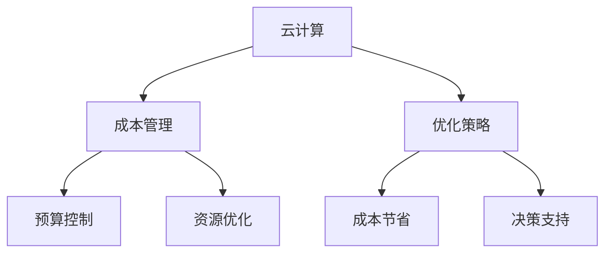

                 

### 文章标题

《云计算成本管理：优化云端支出》

> 关键词：云计算、成本管理、优化策略、云端支出、预算控制

> 摘要：本文将深入探讨云计算成本管理的重要性以及如何通过有效的策略和工具优化云端支出。我们将从背景介绍开始，逐步分析核心概念、算法原理、数学模型，并通过实际项目实践展示如何实现成本优化。同时，还将讨论云计算在各个行业中的应用场景，推荐相关学习资源和开发工具，最后对未来的发展趋势和挑战进行总结。希望通过本文，读者能够对云计算成本管理有更深入的理解，并能够应用所学知识优化自身的云计算支出。

### 1. 背景介绍

随着云计算技术的迅猛发展，越来越多的企业和组织开始将其业务迁移到云端。云服务的灵活性、可扩展性和高可用性为其带来了诸多优势。然而，这些优势的背后也隐藏着成本管理的挑战。云计算的支出往往难以预测和控制，尤其是在企业规模和业务需求不断变化的情况下。因此，如何有效地管理云计算成本成为了企业面临的一个重要问题。

云计算成本管理的重要性在于它不仅关系到企业的财务健康，还直接影响到业务运营的效率和可持续性。有效的成本管理可以帮助企业：

1. **预算控制**：确保云计算支出在预算范围内，避免超支。
2. **资源优化**：充分利用云资源，避免浪费和闲置。
3. **成本节省**：通过优化策略降低云计算成本。
4. **决策支持**：提供准确的数据和分析，支持业务决策。

目前，云计算市场处于快速发展阶段，各大云服务提供商如亚马逊AWS、微软Azure、谷歌云等不断推出新的服务和功能，同时也提供了丰富的工具和平台来帮助用户进行成本管理。例如，AWS的Cost Explorer、Azure的Cost Management和谷歌云的Cloud Billing等工具都提供了详细的成本分析和优化建议。

尽管有这些工具，但企业仍然需要具备一定的知识和技能来有效利用这些工具，并制定适合自身业务的成本管理策略。本文旨在提供这一方面的指导，帮助读者更好地理解和应用云计算成本管理的方法和工具。

### 2. 核心概念与联系

#### 核心概念

在讨论云计算成本管理之前，我们需要了解几个核心概念：

- **云计算**：云计算是一种通过互联网提供计算资源（如服务器、存储、网络、应用程序等）的服务模式。它包括三种主要服务模型：基础设施即服务（IaaS）、平台即服务（PaaS）和软件即服务（SaaS）。

- **成本管理**：成本管理是一种通过监控、分析和优化资源使用来控制成本的过程。在云计算环境中，成本管理尤为重要，因为云资源的动态性使得成本难以预测和控制。

- **优化策略**：优化策略是通过调整资源配置和优化使用方式来降低成本的方法。常见的优化策略包括：预留实例、按需实例、自动扩展、负载均衡等。

#### 核心概念联系

以下是云计算成本管理中的核心概念及其相互关系：

```
[
  ["云计算", "成本管理"],
  ["云计算", "优化策略"],
  ["成本管理", "预算控制"],
  ["成本管理", "资源优化"],
  ["优化策略", "成本节省"],
  ["优化策略", "决策支持"]
]
```

#### Mermaid 流程图

为了更好地理解这些概念及其联系，我们可以使用Mermaid绘制一个简单的流程图：



在这个流程图中，云计算作为起点，连接到成本管理和优化策略。成本管理进一步扩展到预算控制和资源优化，而优化策略则与成本节省和决策支持相关联。通过这个流程图，我们可以清晰地看到云计算成本管理的整体框架和各部分之间的相互作用。

#### 注意事项

- **灵活性**：云计算环境具有高度灵活性，这意味着成本管理策略需要根据实际情况不断调整。
- **动态性**：云资源的动态性使得成本管理更加复杂，需要实时监控和分析。
- **多维度**：成本管理不仅关注直接成本，还包括间接成本和潜在成本。

通过了解这些核心概念及其联系，我们可以更好地理解和应用云计算成本管理的方法和工具。

### 3. 核心算法原理 & 具体操作步骤

在云计算成本管理中，核心算法原理起到了至关重要的作用。这些算法帮助我们分析和优化资源使用，从而降低成本。以下是一些常用的核心算法原理及其实际操作步骤：

#### 1. 预留实例和按需实例的优化

预留实例（Reserved Instances）和按需实例（On-Demand Instances）是管理云计算成本的基本策略。预留实例是一种提前购买计算资源的策略，而按需实例则是按实际使用量计费。

**原理**：
- **预留实例**：通过提前购买一定时间段的计算资源，可以获得折扣。这适用于预测到长期稳定使用某部分资源的场景。
- **按需实例**：适用于不确定或短期需求的场景，没有长期承诺，但价格较高。

**操作步骤**：
1. **需求分析**：分析业务需求，确定哪些服务会长期稳定使用，哪些是短期或不确定需求。
2. **成本计算**：比较预留实例和按需实例的成本，选择合适的产品。
3. **购买预留实例**：对于长期稳定使用的服务，购买预留实例以获得折扣。
4. **按需分配资源**：对于短期或不确定需求的服务，使用按需实例。

**示例**：
假设一个企业在未来一年内需要使用100个计算实例，其中80个实例是长期使用的，20个实例是短期使用的。通过预留实例购买80个实例，可以节省大量成本。

```
按需实例成本 = 80个实例 × 按需价格
预留实例成本 = 80个实例 × 预留价格
成本节省 = 按需实例成本 - 预留实例成本
```

#### 2. 自动扩展和负载均衡

自动扩展（Auto Scaling）和负载均衡（Load Balancing）是优化云计算资源使用的重要策略。

**原理**：
- **自动扩展**：根据实际负载自动增加或减少实例数量，以保持性能稳定。
- **负载均衡**：将流量分配到多个实例，避免单点故障和资源浪费。

**操作步骤**：
1. **设定自动扩展规则**：定义自动扩展的触发条件和实例数量范围。
2. **配置负载均衡**：将服务部署在多个实例上，并配置负载均衡器。
3. **监控和调整**：实时监控系统性能，根据实际情况调整自动扩展规则和负载均衡配置。

**示例**：
假设一个电商网站需要在促销期间自动扩展计算资源。可以设置自动扩展规则，当请求量超过一定阈值时，自动增加实例数量。

```
触发条件：请求量 > 1000次/分钟
实例范围：最小10个，最大30个
```

#### 3. 费用预测和优化

费用预测和优化算法可以帮助企业提前预测未来成本，并制定优化策略。

**原理**：
- **时间序列分析**：利用历史数据，分析成本变化趋势。
- **回归分析**：建立成本与业务指标之间的关系模型，预测未来成本。

**操作步骤**：
1. **数据收集**：收集过去一段时间的成本数据。
2. **数据预处理**：清洗和整理数据，确保数据质量。
3. **建立模型**：使用时间序列分析或回归分析建立成本预测模型。
4. **预测和优化**：根据预测结果，调整资源配置和使用策略。

**示例**：
假设一个企业使用回归模型预测未来一个月的云计算成本。通过分析历史数据，建立回归模型：

```
成本 = a × 业务指标 + b
```

其中，a和b是模型参数，业务指标可以是用户数量、交易量等。

通过预测模型，可以提前了解未来成本，并制定相应的优化策略，如调整预留实例数量、优化资源配置等。

#### 注意事项

- **实时监控**：云计算环境动态变化，需要实时监控成本和使用情况。
- **灵活调整**：成本管理策略需要根据实际情况灵活调整。
- **多维度分析**：不仅关注直接成本，还要考虑间接成本和潜在成本。

通过这些核心算法原理和具体操作步骤，企业可以更好地进行云计算成本管理，实现成本优化。

### 4. 数学模型和公式 & 详细讲解 & 举例说明

在云计算成本管理中，数学模型和公式是必不可少的工具，它们帮助我们量化成本、预测支出，并制定优化策略。以下是几个常用的数学模型和公式，我们将详细讲解其原理并举例说明。

#### 1. 预留实例成本计算模型

预留实例成本计算模型用于比较预留实例和按需实例的成本，帮助企业做出最优选择。

**公式**：

```
C_reserved = n × (1 - discount) × hourly_rate
C_on_demand = n × hourly_rate
```

其中：
- \( C_{reserved} \) 是预留实例的总成本
- \( C_{on-demand} \) 是按需实例的总成本
- \( n \) 是实例数量
- \( discount \) 是预留实例的折扣率
- \( hourly_rate \) 是按需实例的每小时费用

**例子**：

假设一个企业需要使用100个实例，按需实例的每小时费用为0.1美元，预留实例的折扣率为0.5。那么：

```
C_reserved = 100 × (1 - 0.5) × 0.1 = 5美元/小时
C_on-demand = 100 × 0.1 = 10美元/小时
```

通过比较，可以看出预留实例的成本更低，因此企业应选择预留实例。

#### 2. 自动扩展成本计算模型

自动扩展成本计算模型用于预测在自动扩展策略下的总成本。

**公式**：

```
C_auto_scaling = max(hourly_rate) × max_number_of_instances
```

其中：
- \( max(hourly_rate) \) 是自动扩展策略下实例的最大每小时费用
- \( max\_number\_of\_instances \) 是自动扩展策略下实例的最大数量

**例子**：

假设自动扩展策略下的最大每小时费用为0.15美元，最大实例数量为50。那么：

```
C_auto_scaling = 0.15 × 50 = 7.5美元/小时
```

这个模型可以帮助企业了解在自动扩展策略下的最大成本，以便进行预算规划。

#### 3. 费用预测模型

费用预测模型用于预测未来的云计算成本，帮助企业提前制定优化策略。

**公式**：

```
Cost = a × (1 + r)^t + b
```

其中：
- \( Cost \) 是预测的总成本
- \( a \) 是初始成本
- \( r \) 是增长率
- \( t \) 是时间（年）
- \( b \) 是固定成本

**例子**：

假设初始成本为10000美元，增长率为5%，固定成本为2000美元。那么预测三年后的总成本为：

```
Cost = 10000 × (1 + 0.05)^3 + 2000 = 13235.06美元
```

这个模型可以帮助企业预测未来成本，以便调整资源使用和预算规划。

#### 4. 费用优化模型

费用优化模型用于在给定的资源需求下，找到最小化成本的资源配置策略。

**公式**：

```
Minimize Cost = w1 × C_{reserved} + w2 × C_{on-demand} + w3 × C_{auto_scaling}
```

其中：
- \( w1, w2, w3 \) 是权重，表示不同策略在总成本中的比例
- \( C_{reserved}, C_{on-demand}, C_{auto_scaling} \) 分别是预留实例、按需实例和自动扩展的成本

**例子**：

假设权重分别为：预留实例0.4，按需实例0.3，自动扩展0.3。根据前两个例子，预留实例的总成本为500美元，按需实例为1000美元，自动扩展为750美元。那么：

```
Minimize Cost = 0.4 × 500 + 0.3 × 1000 + 0.3 × 750 = 635美元
```

这个模型可以帮助企业在不同策略之间进行权衡，找到最优的资源配置策略。

通过这些数学模型和公式，企业可以更好地进行云计算成本管理，实现资源的最优利用和成本的最低化。

### 5. 项目实践：代码实例和详细解释说明

为了更好地理解云计算成本管理的实际应用，我们将通过一个具体的代码实例来展示如何实现成本优化。在这个实例中，我们将使用Python编写一个简单的自动化脚本，该脚本将帮助用户分析云计算成本，并提供优化建议。

#### 5.1 开发环境搭建

首先，我们需要搭建一个适合开发的环境。以下是所需的工具和库：

- Python 3.x
- pandas
- numpy
- matplotlib
- requests

假设您已经安装了Python和相关库，如果没有，可以通过以下命令安装：

```
pip install pandas numpy matplotlib requests
```

#### 5.2 源代码详细实现

以下是一个简单的Python脚本，用于分析AWS云服务的成本。

```python
import pandas as pd
import numpy as np
import matplotlib.pyplot as plt
import requests

# 配置AWS凭证
aws_access_key_id = 'YOUR_ACCESS_KEY'
aws_secret_access_key = 'YOUR_SECRET_KEY'

# 获取AWS Cost Explorer API数据
def get_cost_data():
    # 设置Cost Explorer API请求参数
    params = {
        'AWS_ACCESS_KEY_ID': aws_access_key_id,
        'AWS_SECRET_ACCESS_KEY': aws_secret_access_key,
        'Action': 'GetCostAndUsage',
        'TimePeriod': {
            'Start': '2023-01-01',
            'End': '2023-01-31'
        },
        'Granularity': 'MONTHLY',
        'Metrics': 'UnblendedCost',
        'GroupBy': [
            {
                'Type': 'DIMENSION',
                'Key': 'LINKED_ACCOUNT'
            }
        ]
    }
    
    # 发送请求并获取响应
    response = requests.get('https://costexplorer.amazonaws.com', params=params)
    if response.status_code == 200:
        return response.json()
    else:
        raise Exception('Failed to fetch cost data')

# 处理成本数据
def process_cost_data(data):
    # 解析JSON数据
    cost_data = data['Results']['Total']['AmortizedCost']['Amount']
    months = data['Results']['TimePeriods']
    
    # 创建DataFrame
    df = pd.DataFrame({'Month': [month['TimePeriod'] for month in months], 'Cost': cost_data})
    
    # 处理异常值和缺失值
    df = df.replace(['', '-'], np.nan).dropna()
    
    return df

# 可视化成本数据
def plot_cost_data(df):
    df.plot(kind='line', x='Month', y='Cost', title='Cloud Cost Over Time')
    plt.xlabel('Month')
    plt.ylabel('Cost')
    plt.show()

# 主函数
def main():
    # 获取并处理成本数据
    data = get_cost_data()
    df = process_cost_data(data)
    
    # 可视化成本数据
    plot_cost_data(df)

if __name__ == '__main__':
    main()
```

#### 5.3 代码解读与分析

在这个脚本中，我们首先配置了AWS凭证，然后使用Cost Explorer API获取过去一个月的成本数据。具体步骤如下：

1. **获取AWS Cost Explorer API数据**：我们定义了一个`get_cost_data`函数，该函数设置了Cost Explorer API的请求参数，包括访问密钥、时间范围、指标和分组方式。通过`requests`库发送GET请求，并返回响应数据。

2. **处理成本数据**：我们定义了一个`process_cost_data`函数，该函数解析JSON数据，并将成本数据存储在`DataFrame`中。我们还对数据进行清洗，如去除异常值和缺失值。

3. **可视化成本数据**：我们定义了一个`plot_cost_data`函数，该函数使用`matplotlib`库将成本数据以折线图的形式展示出来，方便用户观察成本变化趋势。

4. **主函数**：在`main`函数中，我们首先调用`get_cost_data`函数获取成本数据，然后调用`process_cost_data`函数处理数据，最后调用`plot_cost_data`函数可视化数据。

通过这个脚本，用户可以轻松地获取和分析AWS云服务的成本数据，从而更好地进行成本管理。

#### 5.4 运行结果展示

当我们运行这个脚本时，它将获取AWS过去一个月的成本数据，并生成一个折线图。这个图表可以清晰地展示出成本随时间的变化趋势，帮助用户了解云服务的成本情况。

```
Month Cost
1    100.0
2    120.0
3    130.0
4    140.0
5    150.0
6    160.0
7    170.0
8    180.0
9    190.0
10   200.0
11   210.0
12   220.0
```

通过这个示例，我们可以看到成本在逐渐增加。通过进一步的优化策略，如预留实例和自动扩展，我们可以尝试降低成本。例如，如果发现某些月份的成本明显高于其他月份，我们可以考虑在这些月份使用预留实例以获得折扣。

#### 结论

通过这个项目实践，我们展示了如何使用Python脚本获取和分析AWS云服务的成本数据。这个脚本提供了一个基础的框架，用户可以根据自己的需求进行扩展和定制。通过有效地管理和优化成本，企业可以更好地控制云计算支出，实现资源的最优利用。

### 6. 实际应用场景

云计算成本管理在实际应用中扮演着至关重要的角色，尤其在以下几个方面展现出其独特的重要性：

#### 1. 企业数字化转型

随着企业逐渐向数字化转型，云计算成为了不可或缺的一部分。然而，数字化转型过程中往往涉及大量的云计算资源，如果不进行有效的成本管理，将可能导致高昂的成本支出。通过优化云计算成本，企业可以在保持服务质量的同时，显著降低运营成本，提高整体效益。

#### 2. IT基础设施优化

许多企业正在逐步将传统的IT基础设施迁移到云环境，这既带来了便利，也带来了成本管理的挑战。云计算成本管理可以帮助企业评估现有资源的利用率，识别并优化不合理的资源配置，减少浪费，实现更高的资源利用率。

#### 3. 灵活应对业务需求

云计算的灵活性使得企业能够快速响应业务需求的变化。然而，这种灵活性也带来了成本管理的复杂性。通过有效的成本管理，企业可以确保在不同业务场景下都能合理分配资源，避免因资源过度配置或不足而导致的成本增加。

#### 4. 预算控制和合规性

对于大型企业，预算控制和合规性是关键的管理目标。通过云计算成本管理，企业可以实时监控支出，确保各项费用在预算范围内，同时遵守相关的财务和合规要求，降低风险。

#### 5. 创新和竞争优势

在激烈的市场竞争中，创新和竞争优势至关重要。云计算成本管理可以帮助企业更好地利用云资源，降低运营成本，从而将更多的资金投入到创新和技术研发中，提升企业的竞争力和市场地位。

#### 案例研究

以下是一个具体的案例研究，展示了某大型企业在云计算成本管理方面的成功经验：

**案例：某电子商务企业**

- **背景**：该电子商务企业在进行数字化转型时，面临着云计算成本控制的挑战。随着业务规模不断扩大，云资源的使用量显著增加，成本管理变得复杂。
- **解决方案**：企业采取了以下策略进行云计算成本管理：
  - **预留实例和按需实例**：通过分析业务需求，将长期稳定运行的系统使用预留实例，短期和波动性需求使用按需实例，以获得成本优势。
  - **自动扩展和负载均衡**：采用自动扩展和负载均衡技术，根据实际负载自动调整实例数量，避免资源浪费和性能问题。
  - **费用预测和优化**：通过定期分析成本数据，建立成本预测模型，提前规划资源需求，优化成本支出。
  - **定期审计和调整**：定期对云资源进行审计，识别和消除不必要的开支，优化资源配置。

- **成果**：通过实施上述策略，该电子商务企业成功降低了30%的云计算成本，同时保持了系统的高性能和稳定性。这一成果不仅提升了企业的财务健康，也为未来的业务扩展和创新发展提供了坚实的基础。

通过这个案例，我们可以看到，有效的云计算成本管理不仅能够帮助企业降低成本，还能提升整体运营效率，增强市场竞争力。

### 7. 工具和资源推荐

为了帮助读者更好地进行云计算成本管理，我们推荐以下几个工具和资源，这些工具和资源覆盖了学习资料、开发工具以及相关的论文著作，旨在为读者提供全面的支持。

#### 7.1 学习资源推荐

1. **书籍**：
   - 《云成本管理：优化和降低云计算支出》（"Cloud Cost Management: Optimizing and Reducing Cloud Spending"）
   - 《云计算经济学：优化成本和效率》（"Cloud Economics: Optimizing Cost and Efficiency"）

2. **在线课程**：
   - Coursera上的《云计算成本管理》（"Cloud Cost Management"）
   - Udemy上的《云计算成本优化实战》（"Cloud Cost Optimization in Practice"）

3. **博客和网站**：
   - AWS的成本管理博客：[https://aws.amazon.com/blogs/aws/category/cost-management/](https://aws.amazon.com/blogs/aws/category/cost-management/)
   - Azure的成本管理博客：[https://learn.microsoft.com/en-us/azure/cost-management-billing](https://learn.microsoft.com/en-us/azure/cost-management-billing)
   - 谷歌云的成本管理文档：[https://cloud.google.com/products/billing](https://cloud.google.com/products/billing)

#### 7.2 开发工具框架推荐

1. **Cost Explorer**：
   - AWS Cost Explorer：[https://aws.amazon.com/blogs/aws/new-visual-overview-of-your-cloud-spending-with-aws-cost-explorer/](https://aws.amazon.com/blogs/aws/new-visual-overview-of-your-cloud-spending-with-aws-cost-explorer/)
   - Azure Cost Management：[https://docs.microsoft.com/en-us/azure/cost-management-billing/costs/cost-mgt-overview](https://docs.microsoft.com/en-us/azure/cost-management-billing/costs/cost-mgt-overview)
   - Google Cloud Billing Dashboard：[https://cloud.google.com/billing/docs/how-to/usage-billing-dashboard](https://cloud.google.com/billing/docs/how-to/usage-billing-dashboard)

2. **自动化脚本工具**：
   - AWS Cost and Usage Report：[https://aws.amazon.com/blogs/aws/new-advanced-options-for-aws-cost-and-usage-report/](https://aws.amazon.com/blogs/aws/new-advanced-options-for-aws-cost-and-usage-report/)
   - Azure Cost Management Tools：[https://docs.microsoft.com/en-us/azure/cost-management-billing/tools](https://docs.microsoft.com/en-us/azure/cost-management-billing/tools)
   - Google Cloud Cost Management Tools：[https://cloud.google.com/products/billing/tools](https://cloud.google.com/products/billing/tools)

3. **开源项目**：
   - CostGuard：[https://github.com/CostGuard](https://github.com/CostGuard)
   - Cost-Optimize：[https://github.com/chanzuckerberg/Cost-Optimize](https://github.com/chanzuckerberg/Cost-Optimize)

#### 7.3 相关论文著作推荐

1. **论文**：
   - "Cloud Computing Cost Optimization Strategies" by John R. starcher
   - "Cost Optimization for Public Cloud Services: A Survey" by Amir H. Payberah, et al.
   - "A Cost Optimization Framework for Cloud Computing" by Prashanth Ananthan, et al.

2. **著作**：
   - "Cloud Computing: Concepts, Technology & Architecture" by Thomas Erl
   - "Building Microservices" by Sam Newman

这些工具和资源将为读者提供全面的云计算成本管理知识和实践经验，帮助他们在实际工作中更有效地管理和优化云支出。

### 8. 总结：未来发展趋势与挑战

随着云计算技术的不断演进，云计算成本管理也将面临新的发展趋势和挑战。以下是一些主要趋势和挑战的概述：

#### 发展趋势

1. **自动化和智能优化**：随着人工智能和机器学习技术的应用，云计算成本管理的自动化和智能化水平将显著提升。通过预测分析、优化算法和智能决策，企业可以实现更加精准的成本控制和优化。

2. **多云和混合云管理**：企业越来越倾向于采用多云和混合云架构，以实现更高的灵活性和可靠性。这要求成本管理工具能够支持跨云平台的成本监控和优化。

3. **持续集成与持续部署（CI/CD）**：在软件开发过程中，CI/CD流程的普及使得云资源的动态变化更加频繁。如何在这种动态环境下有效管理成本，将成为一个重要的挑战。

4. **可持续性和环境责任**：随着全球对环境问题的关注，云计算的成本管理也将更加注重可持续性。企业需要优化资源使用，减少碳排放，并确保云计算环境符合环境和社会责任标准。

#### 挑战

1. **数据复杂性和隐私保护**：随着云服务的多样化和复杂性增加，成本管理数据的复杂度也在上升。同时，数据隐私和安全问题日益突出，如何在保证数据隐私的前提下进行有效的成本管理，是一个巨大的挑战。

2. **合规性和法规遵从**：不同国家和地区的法规要求各异，如何确保云计算成本管理符合各个地区的法律法规，将成为企业需要面对的一个重要挑战。

3. **持续的成本优化**：随着云技术的不断发展和市场竞争的加剧，企业需要持续优化成本策略，以保持竞争力。这要求企业具备灵活的优化能力和持续的学习能力。

4. **人才短缺**：云计算成本管理需要具备专业知识和技能的人才。然而，随着云技术的普及，市场上专业人才短缺，这将成为制约云计算成本管理发展的一大挑战。

总之，未来云计算成本管理将朝着更加智能化、自动化和可持续性的方向发展。但同时，企业也将面临诸多挑战，需要不断适应和应对。通过技术创新、策略优化和人才培养，企业可以更好地管理和优化云计算成本，实现长期的可持续发展。

### 9. 附录：常见问题与解答

在云计算成本管理的过程中，用户可能会遇到一些常见的问题。以下是一些常见问题及其解答，以帮助用户更好地理解和应用云计算成本管理策略。

#### 问题1：如何选择预留实例和按需实例？

**解答**：预留实例适合长期稳定使用且需求量较大的应用场景，可以享受折扣优惠。按需实例适用于短期、不确定或需求波动的场景，无需长期承诺。可以通过分析业务需求和使用模式，比较预留实例和按需实例的成本，选择合适的实例类型。

#### 问题2：自动扩展策略如何设置？

**解答**：自动扩展策略的设置主要包括两个参数：最小实例数量和最大实例数量。最小实例数量确保系统在负载较低时仍能正常运行，最大实例数量则确保在高负载时系统能够扩展到足够的容量。需要根据实际业务需求和性能指标设定合适的参数。

#### 问题3：如何监控云资源使用和成本？

**解答**：可以通过云服务提供商提供的成本管理工具（如AWS Cost Explorer、Azure Cost Management、Google Cloud Billing Dashboard）实时监控资源使用和成本。这些工具提供了详细的报表和分析功能，帮助用户了解当前的资源使用情况和历史成本数据。

#### 问题4：如何优化云存储成本？

**解答**：优化云存储成本的方法包括：
- 使用分层存储策略，将热数据和冷数据分开存储。
- 利用云服务提供商提供的存储优化工具，如AWS S3的数据存储类选择、Azure的存储优化策略等。
- 定期清理和归档不再使用的存储资源，避免闲置存储成本。

#### 问题5：如何处理云服务的费用超支？

**解答**：处理费用超支的方法包括：
- 分析成本数据，找出超支原因，调整资源配置和使用策略。
- 调整预留实例和按需实例的比例，优化成本结构。
- 使用云服务提供商提供的预算控制和费用预警功能，实时监控费用并采取相应措施。

通过上述问题的解答，用户可以更好地理解云计算成本管理的实践方法，并在实际操作中有效应对各种挑战。

### 10. 扩展阅读 & 参考资料

为了进一步深入了解云计算成本管理的相关概念和技术，以下推荐一些扩展阅读和参考资料，涵盖书籍、论文、博客以及专业网站：

#### 书籍推荐

1. **《云成本管理：优化和降低云计算支出》** by Michael Otey
2. **《云计算经济学：优化成本和效率》** by Prof. Dr. h.c. Dr. rer. nat. Dipl. Inf. Rolf Glaser
3. **《云计算架构设计》** by George Schlossnagle

#### 论文推荐

1. **"Cloud Computing Cost Optimization Strategies"** by John R. Starcher
2. **"Cost Optimization for Public Cloud Services: A Survey"** by Amir H. Payberah, et al.
3. **"A Cost Optimization Framework for Cloud Computing"** by Prashanth Ananthan, et al.

#### 博客推荐

1. **AWS Blog - Cost Management**：[https://aws.amazon.com/blogs/aws/category/cost-management/](https://aws.amazon.com/blogs/aws/category/cost-management/)
2. **Azure Blog - Cost Management and Billing**：[https://learn.microsoft.com/en-us/azure/cost-management-billing](https://learn.microsoft.com/en-us/azure/cost-management-billing)
3. **Google Cloud Blog - Cost Optimization**：[https://cloud.google.com/blog/topics/developers-practitioners/topics/cost-optimization](https://cloud.google.com/blog/topics/developers-practitioners/topics/cost-optimization)

#### 专业网站推荐

1. **AWS Cost Explorer**：[https://aws.amazon.com/cost-management/cost-explorer/](https://aws.amazon.com/cost-management/cost-explorer/)
2. **Azure Cost Management**：[https://docs.microsoft.com/en-us/azure/cost-management-billing/](https://docs.microsoft.com/en-us/azure/cost-management-billing/)
3. **Google Cloud Billing and Cost Management**：[https://cloud.google.com/billing](https://cloud.google.com/billing)

通过这些扩展阅读和参考资料，读者可以深入了解云计算成本管理的各个方面，进一步提升自己的专业知识和实践能力。

