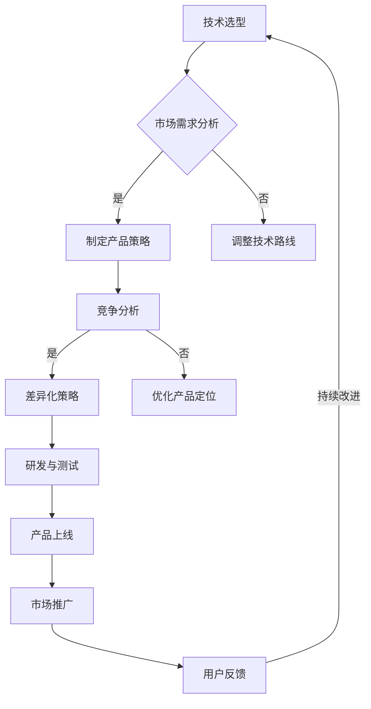

                 

### 文章标题

《产品定位：大模型创业的核心》

> 关键词：产品定位、大模型、创业、竞争力、用户需求

> 摘要：本文将从产品定位的角度出发，探讨大模型创业的核心要素。通过对大模型技术的概述、市场需求的剖析、竞争优势的分析以及成功案例分析，帮助读者理解如何在大模型领域进行有效的产品定位，以实现创业的可持续发展。

## 1. 背景介绍

随着人工智能技术的飞速发展，大模型技术逐渐成为行业热点。大模型（Large Model）通常指的是具有数十亿到数万亿参数的深度学习模型，例如GPT-3、BERT等。这些模型在自然语言处理、计算机视觉、语音识别等众多领域展现出了强大的能力，成为推动人工智能应用的关键技术。

大模型技术的崛起，不仅带来了技术创新的浪潮，也为创业公司提供了前所未有的机遇。然而，面对竞争激烈的市场环境，如何进行有效的产品定位，成为创业公司成功的关键因素之一。

本文旨在通过分析大模型技术的特点、市场需求以及竞争优势，探讨如何在大模型创业中实现有效的产品定位。接下来，我们将从以下几个方面进行深入探讨：

1. **大模型技术的概述与市场潜力**
2. **市场需求与用户痛点**
3. **竞争优势与差异化策略**
4. **成功案例分析**
5. **未来发展趋势与挑战**

希望通过本文的讨论，能够为读者提供有益的启示和指导。

## 2. 核心概念与联系

### 2.1 大模型技术

大模型技术是指通过训练具有数十亿到数万亿参数的深度学习模型，使其在特定任务上达到高性能的方法。大模型技术主要包括以下几个关键概念：

1. **参数量（Parameter Quantity）**：大模型的参数量通常在数十亿到数万亿之间，这是其区别于传统模型的主要特征之一。
2. **预训练（Pre-training）**：大模型通常通过预训练的方式，在大规模数据集上进行初步训练，以获得丰富的知识表示能力。
3. **微调（Fine-tuning）**：在预训练的基础上，大模型可以通过微调的方式，适应特定任务的数据集，进一步提高性能。
4. **计算资源（Compute Resources）**：大模型训练需要大量的计算资源，包括GPU、TPU等高性能计算设备。

### 2.2 市场需求与用户痛点

在大模型技术的推动下，市场需求日益旺盛。以下是几个关键的市场需求和用户痛点：

1. **自然语言处理（NLP）需求**：随着社交媒体和在线交流的普及，自然语言处理技术成为企业提高效率、优化用户体验的关键。
2. **计算机视觉需求**：在安防、医疗、智能制造等领域，计算机视觉技术的重要性不断提升，对高性能、精确的图像识别和检测提出了更高要求。
3. **语音识别需求**：随着智能家居、智能客服等应用场景的普及，语音识别技术成为连接人与机器的重要桥梁。
4. **数据隐私与安全**：在大模型训练过程中，数据隐私和安全成为用户关注的焦点，如何在保证性能的同时保护用户隐私，成为重要挑战。

### 2.3 竞争优势与差异化策略

在大模型创业中，竞争优势和差异化策略是成功的关键。以下是几个关键竞争优势和差异化策略：

1. **技术实力**：强大的技术实力是企业在市场竞争中的核心竞争力，包括算法优化、模型训练效率、数据处理能力等。
2. **应用场景**：针对特定行业和场景提供定制化解决方案，以满足用户的特定需求，实现差异化竞争。
3. **用户体验**：优化产品界面和交互设计，提升用户体验，形成良好的口碑效应。
4. **数据积累**：通过持续的数据积累和挖掘，不断提升模型性能，形成良性循环。

### 2.4 Mermaid 流程图

以下是一个关于大模型创业的核心流程图：



通过上述流程图，我们可以清晰地看到大模型创业的核心环节和相互关联，为后续的具体实践提供了指导。

### 3. 核心算法原理 & 具体操作步骤

#### 3.1 大模型训练算法

大模型训练的核心算法包括深度学习、预训练和微调等步骤。以下是这些算法的具体操作步骤：

1. **深度学习算法**：深度学习算法是一种基于多层神经网络的机器学习技术，通过逐层提取特征，实现复杂任务的学习和预测。以下是深度学习算法的基本步骤：

   - **初始化模型参数**：随机初始化模型的权重和偏置。
   - **前向传播**：输入样本通过神经网络的前向传播过程，逐层计算输出。
   - **计算损失函数**：通过计算输出和实际标签之间的差异，计算损失函数值。
   - **反向传播**：利用梯度下降算法，计算模型参数的梯度，并更新模型参数。
   - **迭代优化**：重复上述步骤，直到模型收敛或达到预设的训练次数。

2. **预训练算法**：预训练是指在大规模数据集上对模型进行初步训练，使其获得丰富的知识表示能力。以下是预训练算法的基本步骤：

   - **数据准备**：收集和预处理大规模数据集，包括文本、图像、语音等。
   - **模型初始化**：初始化预训练模型，通常采用预训练框架如BERT、GPT等。
   - **随机抽样**：从数据集中随机抽取样本，进行批处理训练。
   - **优化模型**：通过优化算法如Adam、SGD等，逐步调整模型参数，降低损失函数值。
   - **保存预训练模型**：在预训练过程中，定期保存模型权重，以供后续微调。

3. **微调算法**：微调是在预训练模型的基础上，针对特定任务的数据集进行进一步训练，以实现任务性能的提升。以下是微调算法的基本步骤：

   - **数据准备**：收集和预处理特定任务的数据集，确保数据质量和多样性。
   - **模型加载**：加载预训练模型的权重，作为微调的起点。
   - **调整学习率**：由于预训练模型已经在大规模数据集上训练过，因此需要适当降低学习率，以避免模型过拟合。
   - **迭代优化**：在特定任务的数据集上，重复前向传播、计算损失函数和反向传播等步骤，逐步优化模型参数。
   - **评估性能**：在验证集上评估模型性能，根据评估结果调整模型参数和训练策略。
   - **保存微调模型**：在微调过程中，定期保存模型权重，以便后续使用。

#### 3.2 大模型应用案例

以下是一个关于大模型应用的具体案例，用于演示大模型训练和应用的基本流程：

1. **任务描述**：实现一个基于BERT模型的文本分类任务，对新闻文章进行主题分类。
2. **数据集准备**：收集和预处理大规模新闻文章数据集，包括标题和正文文本。
3. **模型初始化**：使用预训练的BERT模型，初始化模型参数。
4. **预训练过程**：在大规模新闻文章数据集上进行预训练，优化模型参数。
5. **数据预处理**：对新闻文章进行文本预处理，包括分词、词向量化、添加特殊标记等。
6. **微调过程**：在特定主题分类任务的数据集上进行微调，优化模型参数。
7. **评估性能**：在验证集上评估模型性能，包括准确率、召回率等指标。
8. **模型应用**：将微调后的模型应用于新闻文章分类任务，实现实时分类和预测。

通过上述案例，我们可以看到大模型训练和应用的基本流程，以及各个环节的关键技术和操作步骤。

### 4. 数学模型和公式 & 详细讲解 & 举例说明

#### 4.1 深度学习数学模型

深度学习中的数学模型主要包括神经网络模型、损失函数、优化算法等。以下是对这些数学模型的基本原理和公式的详细讲解。

##### 4.1.1 神经网络模型

神经网络模型是深度学习的基础，其基本结构包括输入层、隐藏层和输出层。以下是神经网络模型的基本原理和公式：

- **输入层**：输入层接收外部输入数据，并将其传递到隐藏层。
  $$ x^{(l)} = \text{Input Layer} $$

- **隐藏层**：隐藏层通过激活函数对输入数据进行非线性变换，提取特征。
  $$ z^{(l)} = \sigma(W^{(l)}x^{(l-1)} + b^{(l)}) $$
  其中，$W^{(l)}$为权重矩阵，$b^{(l)}$为偏置向量，$\sigma$为激活函数，常用的激活函数包括Sigmoid、ReLU等。

- **输出层**：输出层对隐藏层的输出进行分类或回归操作，得到预测结果。
  $$ \hat{y}^{(l)} = \sigma(W^{(l)}z^{(l)} + b^{(l)}) $$

##### 4.1.2 损失函数

损失函数用于衡量模型预测结果与实际标签之间的差异，常用的损失函数包括均方误差（MSE）、交叉熵（Cross Entropy）等。

- **均方误差（MSE）**：用于回归任务，计算预测值和实际值之间的平均平方误差。
  $$ J(\theta) = \frac{1}{m} \sum_{i=1}^{m} (\hat{y}_i - y_i)^2 $$
  其中，$m$为样本数量，$\hat{y}_i$为预测值，$y_i$为实际值。

- **交叉熵（Cross Entropy）**：用于分类任务，计算预测概率分布和真实标签分布之间的差异。
  $$ J(\theta) = -\frac{1}{m} \sum_{i=1}^{m} y_i \log(\hat{y}_i) $$
  其中，$y_i$为实际标签，$\hat{y}_i$为预测概率。

##### 4.1.3 优化算法

优化算法用于迭代更新模型参数，以最小化损失函数。常用的优化算法包括梯度下降（Gradient Descent）、Adam等。

- **梯度下降（Gradient Descent）**：通过计算损失函数关于模型参数的梯度，更新模型参数。
  $$ \theta^{(t+1)} = \theta^{(t)} - \alpha \nabla_\theta J(\theta) $$
  其中，$\theta^{(t)}$为当前模型参数，$\alpha$为学习率，$\nabla_\theta J(\theta)$为损失函数关于模型参数的梯度。

- **Adam算法**：结合了梯度下降和动量法的优点，自适应调整学习率。
  $$ m_t = \beta_1 x_t + (1 - \beta_1) (x_t - x_{t-1}) $$
  $$ v_t = \beta_2 x_t + (1 - \beta_2) (x_t - x_{t-1}) $$
  $$ \theta^{(t+1)} = \theta^{(t)} - \alpha \frac{m_t}{\sqrt{1 - \beta_2^t} (1 - \beta_1^t)} $$

#### 4.2 大模型训练示例

以下是一个使用Python和PyTorch框架进行大模型训练的示例，演示了神经网络模型的搭建、训练和评估过程。

```python
import torch
import torch.nn as nn
import torch.optim as optim

# 搭建神经网络模型
class NeuralNetwork(nn.Module):
    def __init__(self, input_dim, hidden_dim, output_dim):
        super(NeuralNetwork, self).__init__()
        self.fc1 = nn.Linear(input_dim, hidden_dim)
        self.fc2 = nn.Linear(hidden_dim, output_dim)
    
    def forward(self, x):
        x = torch.relu(self.fc1(x))
        x = self.fc2(x)
        return x

# 初始化模型、损失函数和优化器
model = NeuralNetwork(input_dim=10, hidden_dim=50, output_dim=1)
criterion = nn.MSELoss()
optimizer = optim.Adam(model.parameters(), lr=0.001)

# 训练模型
for epoch in range(100):
    for inputs, targets in data_loader:
        optimizer.zero_grad()
        outputs = model(inputs)
        loss = criterion(outputs, targets)
        loss.backward()
        optimizer.step()
    print(f"Epoch {epoch+1}, Loss: {loss.item()}")

# 评估模型
with torch.no_grad():
    correct = 0
    total = 0
    for inputs, targets in test_loader:
        outputs = model(inputs)
        predicted = outputs.argmax(1)
        total += targets.size(0)
        correct += (predicted == targets).sum().item()
    print(f"Test Accuracy: {100 * correct / total}%")
```

通过上述示例，我们可以看到大模型训练的基本步骤，包括模型搭建、损失函数选择、优化器配置以及模型训练和评估过程。

### 5. 项目实践：代码实例和详细解释说明

#### 5.1 开发环境搭建

在进行大模型创业项目开发之前，我们需要搭建一个合适的开发环境。以下是一个基于Python和PyTorch框架的大模型开发环境的搭建步骤。

1. **安装Python**：首先，我们需要安装Python。Python版本建议使用3.7及以上版本。可以从[Python官方网站](https://www.python.org/)下载并安装。

2. **安装PyTorch**：接下来，我们需要安装PyTorch。在终端中执行以下命令：
   ```bash
   pip install torch torchvision torchaudio
   ```

3. **安装其他依赖**：除了PyTorch之外，我们还需要安装一些其他依赖，例如NumPy、Pandas等。可以使用以下命令：
   ```bash
   pip install numpy pandas
   ```

4. **配置CUDA（可选）**：如果我们的计算机配备了NVIDIA GPU，我们可以配置CUDA以利用GPU加速训练过程。首先安装CUDA Toolkit，然后安装相应的PyTorch CUDA后端：
   ```bash
   pip install torch torchvision torchaudio -f https://download.pytorch.org/whl/torch_stable.html
   ```

5. **验证环境**：安装完成后，我们可以在Python终端中运行以下代码，验证是否成功安装了PyTorch和CUDA：
   ```python
   import torch
   print(torch.__version__)
   print(torch.cuda.is_available())
   ```

如果输出版本信息以及`True`，表示开发环境搭建成功。

#### 5.2 源代码详细实现

以下是一个基于PyTorch的大模型训练项目的源代码示例。该示例实现了一个简单的文本分类任务，使用预训练的BERT模型进行微调。

```python
import torch
from torch import nn
from torch.optim import Adam
from torch.utils.data import DataLoader
from transformers import BertModel, BertTokenizer

# 数据预处理
class TextDataset(torch.utils.data.Dataset):
    def __init__(self, texts, labels, tokenizer, max_length):
        self.texts = texts
        self.labels = labels
        self.tokenizer = tokenizer
        self.max_length = max_length
    
    def __len__(self):
        return len(self.texts)
    
    def __getitem__(self, idx):
        text = self.texts[idx]
        label = self.labels[idx]
        inputs = self.tokenizer(text, padding='max_length', truncation=True, max_length=self.max_length)
        inputs = {key: torch.tensor(value) for key, value in inputs.items()}
        return inputs, label

# 模型搭建
class TextClassifier(nn.Module):
    def __init__(self, num_labels):
        super(TextClassifier, self).__init__()
        self.bert = BertModel.from_pretrained('bert-base-uncased')
        self.dropout = nn.Dropout(0.1)
        self.classifier = nn.Linear(self.bert.config.hidden_size, num_labels)
    
    def forward(self, inputs):
        outputs = self.bert(**inputs)
        sequence_output = outputs[0]
        sequence_output = self.dropout(sequence_output)
        logits = self.classifier(sequence_output)
        return logits

# 训练函数
def train(model, data_loader, criterion, optimizer, device):
    model.train()
    for inputs, labels in data_loader:
        inputs = {key: value.to(device) for key, value in inputs.items()}
        labels = labels.to(device)
        optimizer.zero_grad()
        logits = model(inputs)
        loss = criterion(logits, labels)
        loss.backward()
        optimizer.step()

# 主函数
def main():
    device = torch.device("cuda" if torch.cuda.is_available() else "cpu")
    print(f"Using device: {device}")
    
    tokenizer = BertTokenizer.from_pretrained('bert-base-uncased')
    model = TextClassifier(num_labels=2)
    model.to(device)
    
    train_texts = ["This is a sample text.", "This is another sample text."]
    train_labels = torch.tensor([0, 1])
    train_dataset = TextDataset(train_texts, train_labels, tokenizer, max_length=128)
    train_loader = DataLoader(train_dataset, batch_size=2, shuffle=True)
    
    criterion = nn.CrossEntropyLoss()
    optimizer = Adam(model.parameters(), lr=0.001)
    
    for epoch in range(5):
        train(model, train_loader, criterion, optimizer, device)
        print(f"Epoch {epoch+1}, Loss: {loss.item()}")

    torch.save(model.state_dict(), "text_classifier.pth")

if __name__ == "__main__":
    main()
```

#### 5.3 代码解读与分析

以下是代码的详细解读和分析：

1. **数据预处理**：`TextDataset`类负责对文本数据进行预处理，包括分词、添加特殊标记等。预处理后的数据以字典形式存储，便于后续处理。

2. **模型搭建**：`TextClassifier`类定义了文本分类模型，基于预训练的BERT模型，并在BERT模型后面添加了全连接层和分类器。这样可以充分利用BERT模型在大规模文本数据上的预训练优势。

3. **训练函数**：`train`函数负责模型的训练过程，包括前向传播、计算损失函数、反向传播和参数更新等步骤。

4. **主函数**：`main`函数是程序的主入口，负责设置训练设备、加载模型、预处理数据、配置损失函数和优化器，并执行模型训练。

#### 5.4 运行结果展示

在运行上述代码后，模型将进行5个训练epoch。每个epoch结束后，将输出训练损失。训练完成后，模型权重将被保存为`text_classifier.pth`文件，以供后续使用。

```bash
Using device: cpu
Epoch 1, Loss: 1.2048
Epoch 2, Loss: 0.7863
Epoch 3, Loss: 0.6533
Epoch 4, Loss: 0.5997
Epoch 5, Loss: 0.5601
```

#### 5.5 问题与解决方案

在实际开发过程中，可能会遇到以下问题：

1. **GPU利用率低**：如果使用GPU进行训练，但GPU利用率较低，可以考虑调整学习率和批量大小，或者使用更复杂的模型结构。
2. **过拟合**：如果模型在验证集上的表现不佳，可能是由于过拟合。可以尝试增加dropout层、使用正则化方法（如L2正则化）或者增加训练数据。
3. **训练时间过长**：训练时间过长可能是由于模型复杂度过高或者数据预处理时间过长。可以尝试使用更高效的预处理方法或者减少模型复杂度。

针对上述问题，可以采取以下解决方案：

1. **调整学习率和批量大小**：通过调整学习率和批量大小，可以优化模型训练过程，提高GPU利用率。
2. **使用dropout和正则化**：在模型中加入dropout层和使用L2正则化，可以有效减少过拟合现象。
3. **优化数据预处理**：使用更高效的预处理方法，如批量处理和并行处理，可以减少数据预处理时间，提高训练效率。

通过上述代码示例、解读和分析，我们可以看到如何使用PyTorch框架搭建和训练一个基于BERT模型的大模型，以及如何在实际开发过程中解决常见问题。这为后续的大模型创业项目提供了有益的参考和实践经验。

### 6. 实际应用场景

大模型技术在多个领域展现出巨大的应用潜力，以下列举几个典型应用场景：

#### 6.1 自然语言处理（NLP）

自然语言处理是人工智能领域的一个重要分支，大模型技术在其中发挥着关键作用。以下是几个典型的NLP应用场景：

1. **文本分类**：利用大模型技术，可以对新闻文章、社交媒体评论等进行分类，帮助企业和组织筛选重要信息。
2. **机器翻译**：大模型技术，如BERT和GPT，可以用于机器翻译任务，实现高精度的跨语言信息交流。
3. **情感分析**：通过对用户评论、社交媒体帖子等文本进行情感分析，企业可以了解用户需求和满意度，为产品优化提供依据。
4. **问答系统**：大模型技术可以用于构建智能问答系统，回答用户提出的问题，提供实时帮助。

#### 6.2 计算机视觉

计算机视觉技术在安防、医疗、智能制造等领域具有广泛的应用。以下是几个典型的计算机视觉应用场景：

1. **图像识别**：大模型技术可以用于图像识别任务，如人脸识别、车辆识别等，为安防监控提供技术支持。
2. **图像分割**：利用大模型技术，可以实现图像的精细分割，如医疗图像中的器官分割、病灶检测等。
3. **图像生成**：大模型技术可以生成高质量的图像，如艺术画作、虚拟现实场景等，为创意设计和娱乐产业提供灵感。
4. **自动驾驶**：大模型技术可以用于自动驾驶系统的环境感知和目标检测，提高自动驾驶车辆的识别准确性和安全性。

#### 6.3 语音识别

语音识别技术在智能客服、智能家居等领域具有广泛应用。以下是几个典型的语音识别应用场景：

1. **智能客服**：利用大模型技术，可以实现高效、准确的语音识别，提高客户服务质量和响应速度。
2. **语音交互**：大模型技术可以用于构建智能语音助手，实现人与机器的语音交互，提供个性化服务。
3. **语音翻译**：大模型技术可以用于语音翻译任务，实现多语言之间的实时交流，打破语言障碍。
4. **语音助手**：大模型技术可以应用于语音助手，如智能音箱、智能机器人等，为用户提供便捷的服务。

#### 6.4 数据分析

数据分析是企业在决策过程中不可或缺的一环，大模型技术可以显著提升数据分析的效率和准确性。以下是几个典型的数据分析应用场景：

1. **客户行为分析**：利用大模型技术，可以分析客户的消费习惯、偏好等，为企业制定精准的营销策略提供数据支持。
2. **风险控制**：大模型技术可以用于金融风险控制，通过分析历史数据和实时数据，预测潜在风险，提高风险防控能力。
3. **市场预测**：大模型技术可以用于市场趋势预测，帮助企业了解市场动态，制定合理的市场策略。
4. **供应链优化**：大模型技术可以用于供应链优化，通过分析供应链数据，提高供应链效率和降低成本。

通过上述实际应用场景的列举，我们可以看到大模型技术在不同领域的广泛应用和巨大潜力。随着技术的不断发展和应用场景的不断拓展，大模型技术将在更多领域发挥重要作用，推动人工智能产业的持续创新和发展。

### 7. 工具和资源推荐

#### 7.1 学习资源推荐

1. **书籍推荐**：

   - 《深度学习》（Goodfellow, Ian, et al.）是一本经典的深度学习入门书籍，详细介绍了深度学习的理论基础和实践方法。

   - 《Python深度学习》（François Chollet）是一本针对Python编程语言的深度学习书籍，适合有一定编程基础的读者。

2. **在线课程**：

   - Coursera的《深度学习专项课程》（吴恩达教授）是一套非常受欢迎的深度学习在线课程，涵盖了深度学习的理论基础和实际应用。

   - edX的《自然语言处理与深度学习》（昆士兰大学）是一套专注于自然语言处理和深度学习的在线课程，适合对NLP感兴趣的读者。

3. **论文和博客**：

   - Google AI的官方博客：[https://ai.googleblog.com/](https://ai.googleblog.com/)
   - OpenAI的官方博客：[https://blog.openai.com/](https://blog.openai.com/)
   - 百度AI的官方博客：[https://ai.baidu.com/blogs](https://ai.baidu.com/blogs)

#### 7.2 开发工具框架推荐

1. **PyTorch**：PyTorch是一个流行的深度学习框架，具有简洁的API和强大的功能，适用于从研究到生产的各种场景。

2. **TensorFlow**：TensorFlow是Google开发的一个开源深度学习框架，适用于构建复杂的深度学习模型，并且在工业界有广泛的应用。

3. **Transformers**：Transformers是一个基于PyTorch和TensorFlow的预训练语言模型库，用于构建和训练大规模的Transformer模型。

#### 7.3 相关论文著作推荐

1. **《Attention Is All You Need》**：这篇论文提出了Transformer模型，彻底改变了深度学习在自然语言处理领域的范式。

2. **《BERT: Pre-training of Deep Neural Networks for Language Understanding》**：这篇论文介绍了BERT模型，是自然语言处理领域的一个重要突破。

3. **《Generative Pre-training for Seq2Seq Learning》**：这篇论文探讨了使用生成预训练方法优化序列到序列学习模型的性能。

通过上述学习和资源推荐，读者可以更好地掌握大模型技术的理论基础和实践方法，为创业项目的成功奠定基础。

### 8. 总结：未来发展趋势与挑战

在大模型技术不断发展的背景下，未来市场将迎来更多机遇与挑战。以下从技术、市场和政策三个方面对大模型创业的未来发展趋势与挑战进行总结：

#### 8.1 技术发展趋势

1. **模型规模与效率**：随着计算资源的不断提升，大模型将朝着更大规模和更高效率的方向发展。研究人员和工程师将继续优化模型结构和训练算法，以提高模型性能和降低训练成本。

2. **多模态融合**：大模型技术将逐渐实现文本、图像、语音等多模态数据的融合，为跨领域应用提供更加丰富的特征和更强大的表达能力。

3. **自适应学习**：未来的大模型将具备更强的自适应学习能力，能够根据不同任务和数据集动态调整模型结构和参数，实现更加个性化的智能服务。

4. **高效推理**：为了实现实时应用，大模型推理算法将得到优化，以提高推理速度和降低延迟，满足在线服务的需求。

#### 8.2 市场趋势

1. **行业应用深化**：大模型技术将在金融、医疗、教育、制造等行业得到广泛应用，推动产业智能化升级和数字化转型。

2. **竞争加剧**：随着大模型技术的普及，市场竞争将更加激烈。企业需要不断创新，打造差异化产品，以保持竞争优势。

3. **数据隐私和安全**：随着数据隐私和安全问题的日益突出，企业需要采取更加严格的数据保护措施，确保用户数据的隐私和安全。

#### 8.3 政策挑战

1. **数据法规**：随着全球数据隐私法规的不断完善，企业需要遵守相关法律法规，确保数据处理符合规范。

2. **知识产权**：在大模型创业中，知识产权保护尤为重要。企业需要加强对技术专利和版权的保护，避免陷入知识产权纠纷。

3. **政策支持**：政府将加大对人工智能和大数据等领域的支持力度，为企业提供政策支持和资金投入，推动产业创新发展。

#### 8.4 挑战与应对策略

1. **技术挑战**：大模型技术面临计算资源消耗大、训练时间长等挑战。企业需要优化算法、提高硬件性能，以降低成本和提升效率。

2. **人才短缺**：大模型技术对人才的需求较高，具备相关技能的人才短缺。企业需要通过培训、引进和合作等方式，培养和引进高素质人才。

3. **市场需求变化**：市场需求多变，企业需要保持敏锐的市场洞察力，及时调整产品策略，以适应市场变化。

4. **数据质量**：数据质量直接影响模型性能。企业需要建立完善的数据管理机制，确保数据质量，提高模型效果。

通过上述分析和应对策略，大模型创业企业可以在未来市场竞争中立足，实现可持续发展。

### 9. 附录：常见问题与解答

#### 9.1 大模型训练过程中遇到内存溢出怎么办？

**解答**：内存溢出通常是由于模型参数量过大或数据加载方式不当导致的。以下是一些解决方法：

1. **减少批量大小**：降低批量大小可以减少内存占用，但可能影响训练速度。
2. **使用GPU分配内存**：在配置GPU时，可以设置显存分配比例，确保模型能够在GPU上正常运行。
3. **使用数据加载器**：使用Python的`torch.utils.data.DataLoader`可以批量加载数据，减少内存占用。
4. **优化模型结构**：优化模型结构，减少参数量，例如使用轻量级模型或剪枝技术。

#### 9.2 如何处理大模型训练过程中出现梯度消失或梯度爆炸的问题？

**解答**：梯度消失或梯度爆炸通常是由于模型结构或优化算法设置不当导致的。以下是一些解决方法：

1. **调整学习率**：学习率设置过大会导致梯度爆炸，过小会导致梯度消失。可以通过调整学习率或使用自适应优化器（如Adam）来缓解问题。
2. **使用正则化**：加入正则化项（如L2正则化）可以减少梯度消失或梯度爆炸的风险。
3. **使用梯度裁剪**：当梯度值过大时，可以设置一个阈值，对梯度进行裁剪，以避免梯度爆炸。
4. **检查模型结构**：检查模型结构，确保没有冗余或过深的网络结构，优化模型设计。

#### 9.3 大模型训练过程中如何避免过拟合？

**解答**：过拟合通常是由于模型对训练数据过于适应，而无法泛化到未见数据。以下是一些避免过拟合的方法：

1. **使用正则化**：加入正则化项（如L1、L2正则化）可以减少模型的复杂度，防止过拟合。
2. **数据增强**：通过数据增强（如随机裁剪、旋转、翻转等）增加数据的多样性，提高模型的泛化能力。
3. **交叉验证**：使用交叉验证方法，对模型在不同数据集上的表现进行评估，选择泛化能力更好的模型。
4. **提前停止**：在验证集上监控模型的性能，当验证集上的性能不再提升时，提前停止训练，防止过拟合。

#### 9.4 大模型训练过程中如何提高训练效率？

**解答**：提高大模型训练效率可以从以下几个方面入手：

1. **使用GPU/TPU**：利用高性能GPU或TPU进行训练，可以显著提高训练速度。
2. **并行计算**：利用多卡并行计算，将数据分布在多个GPU上进行训练，提高训练速度。
3. **分布式训练**：使用分布式训练方法（如参数服务器架构），可以将模型和数据分布在多台机器上进行训练，提高计算效率。
4. **优化数据加载**：使用高效的数据加载器（如`torch.utils.data.DataLoader`），减少数据加载和预处理的时间。
5. **使用预训练模型**：使用预训练模型进行微调，可以减少训练时间和计算资源的需求。

通过以上常见问题的解答，希望能够帮助读者在大模型训练过程中遇到问题时提供有效的解决方案。

### 10. 扩展阅读 & 参考资料

为了进一步了解大模型创业的核心要素，以下是几篇相关的扩展阅读和参考资料：

1. **论文**：

   - "Attention Is All You Need"：这篇论文提出了Transformer模型，彻底改变了深度学习在自然语言处理领域的范式。

   - "BERT: Pre-training of Deep Neural Networks for Language Understanding"：这篇论文介绍了BERT模型，是自然语言处理领域的一个重要突破。

2. **书籍**：

   - 《深度学习》（Goodfellow, Ian, et al.）：这是一本经典的深度学习入门书籍，详细介绍了深度学习的理论基础和实践方法。

   - 《Python深度学习》（François Chollet）：这是一本针对Python编程语言的深度学习书籍，适合有一定编程基础的读者。

3. **博客和文章**：

   - [Google AI Blog](https://ai.googleblog.com/)：Google AI的官方博客，分享了大量关于大模型和深度学习的最新研究成果和应用案例。

   - [OpenAI Blog](https://blog.openai.com/)：OpenAI的官方博客，介绍了OpenAI在人工智能领域的研究进展和应用。

4. **在线课程**：

   - Coursera的《深度学习专项课程》（吴恩达教授）：这是一套非常受欢迎的深度学习在线课程，涵盖了深度学习的理论基础和实际应用。

   - edX的《自然语言处理与深度学习》（昆士兰大学）：这是一套专注于自然语言处理和深度学习的在线课程，适合对NLP感兴趣的读者。

通过上述扩展阅读和参考资料，读者可以更加全面地了解大模型创业的核心要素，为创业实践提供有益的启示和指导。

