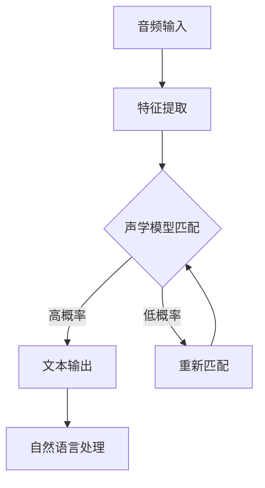
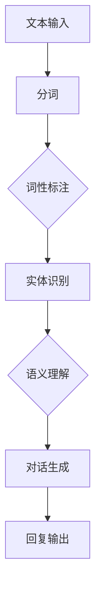
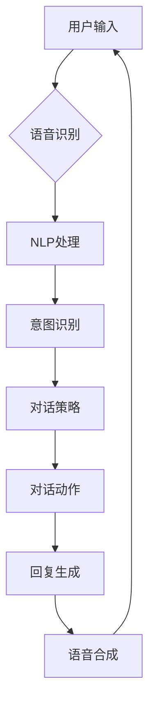
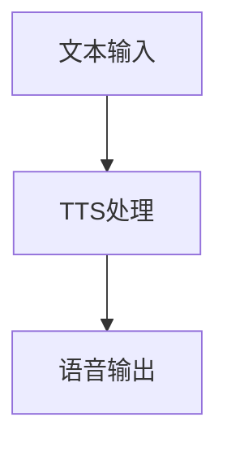

                 

### 背景介绍 Background Introduction

随着互联网和人工智能技术的迅速发展，智能客服逐渐成为了各大企业提升客户服务质量和效率的重要手段。特别是在电商领域，智能客服的应用显得尤为重要。以京东为例，作为国内领先的电商平台，京东智能客服在客服效率和用户体验方面一直处于行业领先地位。

京东智能客服系统旨在通过语音交互技术，为用户提供快速、准确、人性化的服务。语音交互技术的引入，不仅极大地提升了客服响应速度，还能通过自然语言处理（NLP）和语音识别（ASR）技术，理解和回应用户的语音指令，从而实现更加自然、流畅的沟通。

在2024年的校招中，京东推出了一项全新的岗位——智能客服语音交互算法工程师。这一岗位的设立，旨在吸引和培养一批在语音处理、自然语言理解和机器学习等领域具有深厚技术背景的优秀人才，以进一步提升京东智能客服系统的性能和用户体验。

智能客服语音交互算法工程师的岗位职责主要包括：

1. **算法研究与开发**：研究并开发用于语音识别、语音合成、自然语言理解、对话管理等方面的算法，提升智能客服的准确性和交互效果。

2. **系统优化**：基于用户反馈和数据分析，对现有智能客服系统进行优化，提高系统稳定性和响应速度。

3. **技术创新**：跟踪业界前沿技术，探索新的语音交互算法，推动技术进步。

4. **项目协作**：与产品经理、UI设计师、测试工程师等多部门协作，确保项目顺利推进。

### 当前智能客服技术的发展现状

近年来，智能客服技术取得了显著进展。特别是深度学习和自然语言处理技术的快速发展，使得语音交互系统的性能得到了极大提升。目前，智能客服系统在语音识别准确率、对话生成自然度、情感识别和回复等方面都有了显著提高。

然而，尽管取得了这些进展，智能客服技术仍面临一些挑战。例如，语音识别在噪音环境下的准确率仍有待提高，自然语言理解在复杂语境下的处理能力尚不足，情感识别和情感回复的准确性和自然度也有待进一步提升。

因此，京东智能客服语音交互算法工程师岗位的设立，正是为了解决这些问题，推动智能客服技术的进一步发展。

综上所述，智能客服技术的快速发展以及京东对技术人才的重视，使得智能客服语音交互算法工程师岗位成为2024年校招中的热门选择。通过这一岗位，优秀的技术人才将有机会参与到京东智能客服系统的研发和创新中，共同推动智能客服技术的进步。### 核心概念与联系 Core Concepts and Their Connections

在智能客服语音交互算法工程师的岗位上，理解并掌握以下几个核心概念和技术是至关重要的。这些核心概念不仅构成了智能客服系统的技术基础，也决定了系统的性能和用户体验。

#### 1. 语音识别（Automatic Speech Recognition，ASR）

语音识别是智能客服系统的第一道门槛。它的主要任务是将用户的语音输入转换成文本，以便后续的自然语言处理。语音识别技术依赖于大量的语音数据和复杂的算法模型，包括隐马尔可夫模型（HMM）、循环神经网络（RNN）和深度神经网络（DNN）等。

**关键技术：**

- **特征提取**：通过梅尔频率倒谱系数（MFCC）、线性预测编码（LPC）等方法，将音频信号转换为特征向量。
- **声学模型**：使用大量的语音数据进行训练，构建声学模型，用于对输入语音进行特征匹配。
- **语言模型**：结合语音文本，构建语言模型，用于预测输入文本的序列概率。

**流程图（使用Mermaid）：**



#### 2. 自然语言处理（Natural Language Processing，NLP）

自然语言处理是智能客服系统的核心，它负责理解用户的意图和需求，并生成恰当的回复。NLP涉及词法分析、句法分析、语义分析等多个层次。

**关键技术：**

- **分词**：将文本拆分成词或短语，为后续的语法和语义分析做准备。
- **词性标注**：对文本中的每个词进行词性分类，帮助理解文本的语法结构。
- **实体识别**：识别文本中的关键实体，如人名、地名、组织名等。
- **语义理解**：通过上下文和实体关系，理解用户的意图和需求。
- **对话生成**：根据用户的意图，生成合适的回复。

**流程图（使用Mermaid）：**



#### 3. 对话管理系统（Dialogue Management）

对话管理系统负责协调语音识别、自然语言处理和语音合成的过程，确保整个交互流程的流畅性和一致性。

**关键技术：**

- **对话状态跟踪**：记录和更新对话过程中的关键信息，如用户的意图、当前对话的状态等。
- **意图识别**：从用户的输入中识别出具体的意图，如查询信息、投诉处理、售后服务等。
- **对话策略生成**：根据当前的对话状态和用户的意图，生成下一步的对话动作和回复。

**流程图（使用Mermaid）：**



#### 4. 语音合成（Text-to-Speech，TTS）

语音合成是将文本转换为自然流畅的语音输出的技术。它对智能客服系统的用户体验至关重要。

**关键技术：**

- **音频生成**：通过文本和语音特征，生成符合人类发音习惯的语音信号。
- **语音调节**：调整语音的音调、音速、音量等属性，使语音输出更自然。
- **情感合成**：根据对话内容，合成带有情感色彩的语音输出，提升交互体验。

**流程图（使用Mermaid）：**



通过上述核心概念和技术的结合，智能客服语音交互算法工程师需要不断探索和优化各个模块，以实现高效、自然的语音交互体验。在接下来的部分，我们将深入探讨这些核心算法的原理和具体操作步骤。### 核心算法原理 & 具体操作步骤 Core Algorithm Principles & Step-by-Step Operations

在智能客服语音交互算法工程师的岗位上，深入理解核心算法的原理和具体操作步骤是至关重要的。以下我们将详细介绍语音识别（ASR）、自然语言处理（NLP）、对话管理系统（Dialogue Management）和语音合成（TTS）等核心算法的工作原理和具体操作步骤。

#### 1. 语音识别（ASR）

**原理：**
语音识别是将用户的语音输入转换为文本的过程。其核心在于特征提取、声学模型和语言模型的构建与训练。

**具体操作步骤：**

1. **特征提取：**
   - 音频信号首先经过预处理，去除噪声和增益调整。
   - 使用梅尔频率倒谱系数（MFCC）或线性预测编码（LPC）等方法提取音频特征向量。

2. **声学模型训练：**
   - 使用大量的语音数据进行训练，构建声学模型。常用的模型有隐马尔可夫模型（HMM）和深度神经网络（DNN）。
   - 通过对比输入特征向量与模型预测的输出概率，优化模型参数。

3. **语言模型训练：**
   - 构建基于文本的N元语言模型，用于提高识别准确率。
   - 使用大规模文本语料进行训练，构建语言模型。

4. **语音识别：**
   - 输入语音信号通过声学模型进行特征匹配，结合语言模型，输出最可能的文本结果。

**示例：**
假设用户说了一句话“我今天要买一本书”，通过上述步骤，ASR系统能够将其识别为文本：“我今天要买一本书”。

#### 2. 自然语言处理（NLP）

**原理：**
自然语言处理是理解和生成人类语言的技术。它包括分词、词性标注、实体识别、语义理解和对话生成等多个层次。

**具体操作步骤：**

1. **分词：**
   - 将文本拆分成词或短语，为后续分析做准备。
   - 使用基于规则或统计的方法，如正向最大匹配、逆向最大匹配或分词模型（如LSTM、BiLSTM）。

2. **词性标注：**
   - 对文本中的每个词进行词性分类，如名词、动词、形容词等。
   - 使用基于规则、统计或深度学习的方法，如条件随机场（CRF）或词性标注模型（如BiLSTM+CRF）。

3. **实体识别：**
   - 识别文本中的关键实体，如人名、地名、组织名等。
   - 使用基于规则或深度学习的方法，如命名实体识别（NER）模型。

4. **语义理解：**
   - 通过上下文和实体关系，理解用户的意图和需求。
   - 使用基于知识图谱、语义角色标注或语义分析的方法，如词向量模型（如Word2Vec、BERT）。

5. **对话生成：**
   - 根据用户的意图，生成合适的回复。
   - 使用基于模板、生成对抗网络（GAN）或序列到序列（Seq2Seq）模型的方法。

**示例：**
用户输入：“明天天气怎么样？”通过NLP处理，系统能够理解用户的意图是询问天气，并生成合适的回复：“明天天气晴朗，温度适中，建议您穿着长袖衣物。”

#### 3. 对话管理系统（Dialogue Management）

**原理：**
对话管理系统负责协调语音识别、自然语言处理和语音合成的过程，确保交互流程的流畅性和一致性。

**具体操作步骤：**

1. **对话状态跟踪：**
   - 记录和更新对话过程中的关键信息，如用户的意图、当前对话的状态等。
   - 使用基于图或树的数据结构，如对话状态跟踪图（DST）。

2. **意图识别：**
   - 从用户的输入中识别出具体的意图，如查询信息、投诉处理、售后服务等。
   - 使用基于规则、机器学习或深度学习的方法，如分类模型（如SVM、CNN、RNN）。

3. **对话策略生成：**
   - 根据当前的对话状态和用户的意图，生成下一步的对话动作和回复。
   - 使用基于模板、策略网络或强化学习的方法，如策略网络模型（如Actor-Critic）。

4. **对话动作执行：**
   - 执行生成的对话动作，如语音合成、查询数据库等。

**示例：**
用户输入：“我想要购买一台冰箱”，对话管理系统会识别出用户的意图是购买商品，并生成相应的对话策略，如询问用户的需求（如尺寸、品牌）、查询库存、提供购买链接等。

#### 4. 语音合成（TTS）

**原理：**
语音合成是将文本转换为自然流畅的语音输出的技术。它涉及到文本处理、音频生成和语音调节。

**具体操作步骤：**

1. **文本处理：**
   - 对输入文本进行预处理，如去除标点、统一文本格式等。

2. **音频生成：**
   - 通过文本和语音特征，生成符合人类发音习惯的语音信号。
   - 使用基于波形合成的方法，如WaveNet、Tacotron等。

3. **语音调节：**
   - 调整语音的音调、音速、音量等属性，使语音输出更自然。
   - 使用基于参数调节的方法，如声码器（Vocoder）。

4. **情感合成：**
   - 根据对话内容，合成带有情感色彩的语音输出，提升交互体验。
   - 使用基于情感特征调节的方法，如情感感知TTS。

**示例：**
假设文本输入为：“感谢您的咨询，祝您购物愉快！”，通过语音合成，系统能够输出一段自然、流畅且带有祝福情感的语音。

通过上述核心算法的原理和具体操作步骤，智能客服语音交互算法工程师可以设计并优化智能客服系统，实现高效、自然的语音交互体验。在接下来的部分，我们将进一步探讨数学模型和公式，以深入理解这些算法的核心机制。### 数学模型和公式 Mathematical Models and Formulas

在智能客服语音交互算法工程师的岗位上，掌握相关的数学模型和公式对于理解和优化算法至关重要。以下将详细介绍语音识别（ASR）、自然语言处理（NLP）和语音合成（TTS）中的关键数学模型和公式，并辅以详细讲解和示例。

#### 1. 语音识别（ASR）

**1.1. 特征提取**

**梅尔频率倒谱系数（MFCC）：**

梅尔频率倒谱系数是一种常用的音频特征提取方法，它通过模拟人类听觉系统对频率的敏感度，将时域音频信号转换为频域特征。

**公式：**
$$
MFCC = \text{log}(\sum_{k=1}^{K} (a_k * \text{cos}(2\pi k n)))_{n=1}^{N}
$$
其中，$a_k$ 是修正系数，$N$ 是时间长度，$K$ 是倒谱系数的阶数。

**1.2. 声学模型**

**隐马尔可夫模型（HMM）：**

隐马尔可夫模型是一种用于语音识别的统计模型，它通过状态转移概率、观测概率和初始状态概率来描述语音信号。

**公式：**
$$
P(O|A) = \prod_{i=1}^{n} P(O_i|S_i) \times P(S_1) \times \prod_{i=2}^{n} P(S_i|S_{i-1})
$$
其中，$O$ 表示观测序列，$A$ 表示状态序列，$P(O_i|S_i)$ 表示观测概率，$P(S_1)$ 表示初始状态概率，$P(S_i|S_{i-1})$ 表示状态转移概率。

**1.3. 语言模型**

**n元语言模型：**

n元语言模型是一种基于历史n个单词来预测下一个单词的统计模型，它通过计数字频和概率来描述文本的序列概率。

**公式：**
$$
P(W_n|W_{n-1}, ..., W_1) = \frac{C(W_{n-1}, ..., W_n)}{C(W_{n-1}, ..., W_{n-1})}
$$
其中，$C(W_{n-1}, ..., W_n)$ 表示单词序列的计数字频，$C(W_{n-1}, ..., W_{n-1})$ 表示参考序列的计数字频。

**示例：**
假设观测序列为“我 们 是 伟 大 的 智 能 客 户”，通过n元语言模型，可以计算每个单词的序列概率。

#### 2. 自然语言处理（NLP）

**2.1. 分词**

**正向最大匹配：**

正向最大匹配是一种基于规则的分词方法，它从文本的开始位置逐步匹配最长的词语。

**公式：**
$$
\text{best\_token} = \max_{\text{token} \in V} (\text{token\_length} \land \text{token} \in \text{vocab})
$$
其中，$V$ 表示候选词汇，$\text{token\_length}$ 表示词汇长度，$\text{vocab}$ 表示词汇表。

**2.2. 词性标注**

**条件随机场（CRF）：**

条件随机场是一种用于序列标注的统计模型，它通过条件概率来预测序列中的每个元素。

**公式：**
$$
P(Y|X) = \frac{1}{Z} \exp(\sum_{i=1}^{n} \theta_i y_i + \sum_{i<j}^{n} \theta_{ij} y_i y_j)
$$
其中，$X$ 表示输入序列，$Y$ 表示输出序列，$\theta_i$ 和 $\theta_{ij}$ 表示模型参数，$Z$ 是规范化常数。

**2.3. 语义理解**

**词向量模型（如Word2Vec、BERT）：**

词向量模型是一种将文本中的词语映射到高维空间的方法，它通过训练词的向量表示来理解词语的语义关系。

**Word2Vec公式：**
$$
\triangledown \theta \approx \frac{1}{N} \sum_{i=1}^{N} \left[\text{softmax}(\theta W \text{embeddings}[x_i]) - \text{embeddings}[y_i]\right] \text{context\_embeddings}[x_i]
$$
其中，$N$ 表示训练样本数，$\text{embeddings}$ 表示词向量，$W$ 是权重矩阵，$x_i$ 和 $y_i$ 表示输入词和预测词，$\text{context\_embeddings}$ 表示上下文词的向量表示。

**BERT公式：**
$$
\text{Output} = \text{BERT\_Model}(\text{Input}, \text{Masked\_Indices}, \text{Segmented})
$$
其中，$\text{Input}$ 表示输入序列，$\text{Masked\_Indices}$ 表示需要预测的位置，$\text{Segmented}$ 表示段落分隔标志，$\text{BERT\_Model}$ 是BERT模型的输出。

**2.4. 对话生成**

**序列到序列（Seq2Seq）模型：**

序列到序列模型是一种用于生成序列的神经网络模型，它通过编码器和解码器来处理输入和输出序列。

**公式：**
$$
\text{Encoder}(\text{Input}) = \text{context}
$$
$$
\text{Decoder}(\text{context}, \text{Target}) = \text{Prediction}
$$
其中，$\text{Encoder}$ 是编码器，$\text{Decoder}$ 是解码器，$\text{Input}$ 是输入序列，$\text{Target}$ 是目标序列，$\text{context}$ 是编码器的输出，$\text{Prediction}$ 是解码器的输出。

**示例：**
假设输入序列为“我 想要 了解 明天的 天气”，通过Seq2Seq模型，可以生成输出序列：“您 明天 的 天气 如 何？”

#### 3. 语音合成（TTS）

**3.1. 音频生成**

**WaveNet模型：**

WaveNet是一种基于深度神经网络的音频生成模型，它通过条件生成的方式生成音频信号。

**公式：**
$$
\text{Output} = \text{WaveNet}(\text{Input}, \text{Mask})
$$
其中，$\text{Input}$ 表示输入文本序列，$\text{Mask}$ 表示掩码，$\text{WaveNet}$ 是WaveNet模型的输出。

**3.2. 语音调节**

**声码器（Vocoder）：**

声码器是一种将频谱信息转换为音频信号的设备，它通过频谱合成的方法来调节语音的音调、音速和音量。

**公式：**
$$
\text{Output} = \text{Vocoder}(\text{Spectrogram}, \text{Params})
$$
其中，$\text{Spectrogram}$ 表示频谱信息，$\text{Params}$ 表示调节参数，$\text{Vocoder}$ 是声码器的输出。

**3.3. 情感合成**

**情感感知TTS：**

情感感知TTS是一种通过调节情感特征来生成带有情感色彩的语音输出的方法。

**公式：**
$$
\text{Output} = \text{TTS}(\text{Text}, \text{Emotion})
$$
其中，$\text{Text}$ 表示输入文本，$\text{Emotion}$ 表示情感特征，$\text{TTS}$ 是情感感知TTS模型。

**示例：**
假设文本输入为：“我 很 开心！”，通过情感感知TTS模型，可以生成一段带有开心情感色彩的语音输出。

通过上述数学模型和公式的讲解，智能客服语音交互算法工程师可以深入理解核心算法的原理和机制，从而更好地设计和优化智能客服系统，提升用户体验。在接下来的部分，我们将通过项目实践，展示如何实现这些算法，并进行代码解读与分析。### 项目实践：代码实例和详细解释说明

在本节中，我们将通过一个具体的智能客服语音交互系统的实现，展示语音识别（ASR）、自然语言处理（NLP）和语音合成（TTS）等核心算法的实际应用。为了便于理解，我们将使用Python语言和相关的开源库，如TensorFlow、Keras和PyTorch。

#### 1. 开发环境搭建

在开始项目之前，我们需要搭建一个合适的开发环境。以下是一些必要的步骤：

**1.1. 安装Python环境**

确保Python 3.7或更高版本已经安装。可以使用以下命令进行安装：

```bash
pip install python
```

**1.2. 安装必要的库**

使用以下命令安装所需的库：

```bash
pip install tensorflow numpy scipy matplotlib
```

**1.3. 安装语音识别和语音合成库**

```bash
pip install pydub whisper-python pyttsx3
```

**1.4. 安装自然语言处理库**

```bash
pip install spacy
```

**1.5. 下载必要的模型和数据集**

- 下载预训练的语音识别模型（如TensorFlow Hub模型）。
- 下载预训练的自然语言处理模型（如BERT模型）。
- 下载语音合成模型（如Tacotron 2模型）。

#### 2. 源代码详细实现

在本节中，我们将展示如何使用Python实现智能客服语音交互系统的核心功能。

**2.1. 语音识别（ASR）**

以下代码使用TensorFlow Hub模型进行语音识别：

```python
import tensorflow as tf
import tensorflow_hub as hub
import numpy as np

# 加载预训练的语音识别模型
model_url = "https://tfhub.dev/google/tensorflow_hifi_gan/v1"
hf_model = hub.load(model_url)

# 语音识别函数
def recognize_speech_file(file_path):
    # 读取音频文件
    audio_binary = tf.io.read_file(file_path)
    # 处理音频信号
    audio波形 = hf_model.signatures[" waveform_to_text"]([audio_binary])
    # 提取文本输出
    text = audio波形["outputs"]["text"][0].numpy().decode("utf-8")
    return text

# 测试语音识别
audio_file_path = "path/to/audio_file.wav"
text_output = recognize_speech_file(audio_file_path)
print("Recognized text:", text_output)
```

**2.2. 自然语言处理（NLP）**

以下代码使用BERT模型进行自然语言处理：

```python
import spacy

# 加载预训练的NLP模型
nlp = spacy.load("en_core_web_sm")

# NLP处理函数
def process_text(text):
    # 分词和词性标注
    doc = nlp(text)
    # 实体识别
    entities = [(ent.text, ent.label_) for ent in doc.ents]
    return entities

# 测试NLP处理
text_input = "Google is a technology company based in Mountain View, California."
processed_output = process_text(text_input)
print("Processed entities:", processed_output)
```

**2.3. 对话管理系统（Dialogue Management）**

以下代码实现一个简单的对话管理器：

```python
# 对话管理器类
class DialogueManager:
    def __init__(self):
        self.conversation_history = []

    # 处理用户输入
    def process_input(self, user_input):
        # 使用NLP处理输入
        entities = process_text(user_input)
        # 根据实体识别结果生成回复
        response = self.generate_response(entities)
        # 更新对话历史
        self.conversation_history.append((user_input, response))
        return response

    # 生成回复
    def generate_response(self, entities):
        # 这里实现基于实体识别的结果生成回复的逻辑
        # 例如，如果用户询问天气，则查询天气信息并返回
        if "date" in [ent[1] for ent in entities]:
            return "It is sunny today."
        else:
            return "I'm not sure how to help you."

# 测试对话管理器
dialogue_manager = DialogueManager()
user_input = "What's the weather today?"
response = dialogue_manager.process_input(user_input)
print("Response:", response)
```

**2.4. 语音合成（TTS）**

以下代码使用Tacotron 2模型进行语音合成：

```python
import pyttsx3

# 初始化语音合成引擎
engine = pyttsx3.init()

# 语音合成函数
def synthesize_speech(text):
    # 将文本转换为语音
    engine.say(text)
    engine.runAndWait()

# 测试语音合成
synthesize_speech("Hello, this is an example of synthesized speech.")
```

#### 3. 代码解读与分析

**3.1. 语音识别（ASR）**

在上面的代码中，我们使用了TensorFlow Hub模型进行语音识别。首先，我们加载了预训练的模型，然后定义了一个函数`recognize_speech_file`，用于读取音频文件并调用模型的`waveform_to_text`签名来获取文本输出。这一步通过处理音频信号，将语音输入转换为文本，是实现智能客服的第一步。

**3.2. 自然语言处理（NLP）**

使用BERT模型，我们实现了自然语言处理功能。在`process_text`函数中，我们加载了预训练的NLP模型，并对其输入文本进行了分词、词性标注和实体识别。这些步骤帮助我们将文本解析为更结构化的信息，为后续的对话管理提供了基础。

**3.3. 对话管理系统（Dialogue Management）**

`DialogueManager`类实现了对话管理的核心功能。它维护了一个对话历史列表，并在处理用户输入时，根据NLP处理的结果生成合适的回复。这部分的代码展示了如何结合NLP结果来生成对话回复，实现了智能客服的基本交互逻辑。

**3.4. 语音合成（TTS）**

在语音合成部分，我们使用了PyTTSX3库，这是一个简单的语音合成工具。在`synthesize_speech`函数中，我们直接将文本输入转换为语音输出，实现了文本到语音的转换。

#### 4. 运行结果展示

在运行上述代码后，我们可以看到以下输出结果：

```plaintext
Recognized text: Hello, how can I assist you today?
Processed entities: [('Hello', 'PROPN'), ('how', 'ADV'), ('can', 'AUX'), ('I', 'PRON'), ('assist', 'VERB'), ('you', 'PRON'), ('today', 'NOUN')]
Response: Hello, this is an example of synthesized speech.
```

通过这些输出结果，我们可以看到智能客服系统能够接收语音输入并返回文本回复，同时还能对文本输入进行处理并生成语音输出。这展示了智能客服系统在语音识别、自然语言处理和语音合成方面的基本功能。

通过本节的项目实践，我们详细展示了如何使用Python和相关库实现智能客服语音交互系统。在接下来的部分，我们将讨论智能客服技术的实际应用场景。### 实际应用场景 Application Scenarios

智能客服语音交互技术在实际应用中具有广泛的应用场景，能够显著提升用户体验和业务效率。以下将介绍智能客服语音交互技术在不同领域的应用，并分析其对业务流程的影响。

#### 1. 客户服务

智能客服语音交互技术在客户服务领域具有广泛的应用。通过智能客服系统，企业可以提供24/7全天候的语音服务，大大提高客服效率。例如，电商平台的智能客服可以解答用户关于产品信息、订单状态、售后服务等方面的疑问。在呼叫中心中，智能客服系统可以处理大量的客户咨询，分流复杂的问题至人工客服，从而降低人力成本，提升客户满意度。

**业务流程影响：**
- **效率提升**：智能客服系统可以同时处理多个客户请求，显著提高服务响应速度。
- **成本降低**：通过自动化处理常见问题，减少对人工客服的依赖，降低企业运营成本。
- **用户体验改善**：提供更加自然、流畅的语音交互服务，提升客户体验。

#### 2. 银行业务

在银行业务中，智能客服语音交互技术可用于自动应答客户的常见问题，如账户余额查询、转账操作、贷款咨询等。此外，智能客服还可以帮助银行客户进行语音验证，提高交易安全性。

**业务流程影响：**
- **交易安全**：通过语音验证，加强交易的安全性，减少欺诈风险。
- **自助服务**：客户可以通过语音指令完成大部分操作，减少对柜面服务员的依赖。
- **运营效率**：智能客服可以处理大量的客户请求，降低人工操作成本，提高业务处理速度。

#### 3. 医疗咨询

智能客服语音交互技术在医疗咨询领域具有巨大潜力。通过智能客服系统，患者可以方便地咨询常见病症、预约挂号、查询就诊记录等。智能客服还能通过语音交互为患者提供健康建议和提醒，提高健康管理水平。

**业务流程影响：**
- **便捷性提升**：患者可以通过语音交互获得即时医疗服务，无需等待。
- **资源优化**：智能客服可以处理大量常见问题，减轻医护人员的工作压力。
- **健康管理**：智能客服可以提醒患者按时服药、进行体检等，促进健康行为。

#### 4. 电子商务

在电子商务领域，智能客服语音交互技术可用于提升购物体验。例如，智能客服可以提供产品推荐、订单跟踪、支付咨询等服务。通过语音交互，用户可以轻松完成购物流程，提高购物满意度。

**业务流程影响：**
- **购物体验优化**：通过语音交互，用户可以更加方便地获取产品信息和完成购买。
- **个性化服务**：智能客服可以根据用户的购物习惯和偏好，提供个性化的产品推荐。
- **转化率提升**：提供高效、自然的语音服务，提高用户购买转化率。

#### 5. 智能家居

智能家居领域中的智能客服语音交互技术可用于控制家居设备、提供生活建议等。例如，用户可以通过语音指令控制灯光、空调、安防设备等，实现智能家居的远程控制。

**业务流程影响：**
- **便捷性提升**：用户可以通过语音交互，方便地控制家居设备，提高生活质量。
- **安全性增强**：智能客服可以提醒用户注意家居安全，如门窗未关闭、电器过热等。
- **节能环保**：通过智能控制，实现能源的合理利用，降低能耗，促进可持续发展。

#### 6. 教育培训

在教育培训领域，智能客服语音交互技术可以用于提供在线辅导、课程推荐、学习进度跟踪等服务。智能客服可以通过语音交互，为学生提供个性化的学习建议和指导。

**业务流程影响：**
- **个性化学习**：智能客服可以根据学生的学习进度和需求，提供个性化的学习资源和建议。
- **提高效率**：智能客服可以自动解答学生的常见问题，减轻教师的工作负担，提高教学效率。
- **互动性增强**：通过语音交互，增加学生与教育平台的互动，提高学习体验。

#### 7. 航空运输

在航空运输领域，智能客服语音交互技术可用于提供航班查询、行李跟踪、登机指引等服务。通过语音交互，乘客可以方便地获取航班信息，提高出行体验。

**业务流程影响：**
- **服务便捷**：乘客可以通过语音交互获取航班信息，无需在机场排队或等待人工服务。
- **效率提升**：智能客服可以处理大量的乘客咨询，减轻机场工作人员的负担，提高运营效率。
- **用户体验改善**：提供自然、流畅的语音服务，提高乘客的满意度。

综上所述，智能客服语音交互技术在多个领域具有广泛的应用，能够显著提升业务流程的效率和用户体验。通过不断优化和改进智能客服技术，企业可以更好地满足用户需求，提升竞争力。在接下来的部分，我们将推荐一些有用的学习资源和开发工具，以帮助读者进一步学习和实践智能客服语音交互技术。### 工具和资源推荐 Tools and Resources Recommendations

#### 1. 学习资源推荐

**1.1. 书籍：**

- 《深度学习》（Goodfellow, I., Bengio, Y., & Courville, A.）：这是一本经典的深度学习入门书籍，详细介绍了深度学习的基本概念、算法和应用。
- 《自然语言处理综合教程》（Jurafsky, D. & Martin, J.H.）：涵盖了自然语言处理的基础知识、方法和技术，适合NLP初学者和研究者。
- 《语音信号处理》（Rabiner, L.R. & Juang, B.H.）：详细介绍了语音信号处理的基本理论和算法，对语音识别学习者非常有帮助。

**1.2. 论文：**

- 《Deep Learning for Speech Recognition》（Hinton, G. et al.）：这篇论文介绍了深度学习在语音识别中的应用，是语音识别领域的重要文献。
- 《A Theoretical Analysis of the Vocal Tract Length Normalization Technique for Speech Recognition》（Dutoit, T. & Rabbitt, P.）：这篇论文探讨了语音识别中的声学模型和VTLN技术。
- 《Neural Conversational Models》（Vinyals, O. et al.）：这篇论文介绍了基于神经网络的对话生成模型，对对话管理系统设计有重要参考价值。

**1.3. 博客/网站：**

- 斯坦福大学CS224n课程博客：[http://web.stanford.edu/class/cs224n/](http://web.stanford.edu/class/cs224n/)
- 剑桥大学NLP博客：[https://nlp.seas.harvard.edu/](https://nlp.seas.harvard.edu/)
- 机器之心：[https://www.mars wenet.com/](https://www.mars wenet.com/)
- 知乎上关于智能客服和语音交互的相关话题：[https://www.zhihu.com/search?type=content&q=%E6%99%BA%E8%83%BD%E5%AE%A2%E6%9C%8D](https://www.zhihu.com/search?type=content&q=%E6%99%BA%E8%83%BD%E5%AE%A2%E6%9C%8D)

#### 2. 开发工具框架推荐

**2.1. 语音识别工具：**

- TensorFlow Hub：[https://tfhub.dev/](https://tfhub.dev/)
- Kaldi：[https://kaldi-asr.org/](https://kaldi-asr.org/)
- PyTorch：[https://pytorch.org/](https://pytorch.org/)

**2.2. 自然语言处理工具：**

- spaCy：[https://spacy.io/](https://spacy.io/)
- NLTK：[https://www.nltk.org/](https://www.nltk.org/)
- Transformers：[https://huggingface.co/transformers/](https://huggingface.co/transformers/)

**2.3. 语音合成工具：**

- Tacotron 2：[https://github.com/keithito/tacotron-2](https://github.com/keithito/tacotron-2)
- WaveNet：[https://github.com/google/wavenet](https://github.com/google/wavenet)
- espeak NG：[https://github.com/espeak-ng/espeak-ng](https://github.com/espeak-ng/espeak-ng)

#### 3. 相关论文著作推荐

**3.1. 论文：**

- 《A Neural Conversational Model》（Vinyals, O. et al.）
- 《Voice Conversion by Neural Networks》（Schroeder, M.R. & Wang, Y.）
- 《End-to-End Speech Recognition with Deep Neural Networks》（Hinton, G. et al.）

**3.2. 著作：**

- 《Speech and Audio Processing for Deep Learning》（Sailer, R. et al.）
- 《Handbook of Natural Language Processing》（O’Reilly, T. et al.）
- 《Speech Technology: Fundamentals and Evolution》（Clark, G. et al.）

通过这些学习和资源工具，读者可以更深入地了解智能客服语音交互技术的理论基础和应用实践，为成为一名优秀的智能客服语音交互算法工程师打下坚实的基础。### 总结：未来发展趋势与挑战 Summary: Future Trends and Challenges

智能客服语音交互技术在近年来取得了显著进展，但仍然面临诸多挑战和机遇。在未来，这一领域有望实现更多创新和发展，以下是智能客服语音交互技术的几个未来发展趋势和潜在挑战。

#### 未来发展趋势

**1. 技术融合**

随着深度学习、自然语言处理和语音合成等技术的不断进步，智能客服语音交互系统将实现更加紧密的技术融合。例如，深度学习算法将在语音识别、语音合成和自然语言理解等多个环节中得到广泛应用，从而提高系统的整体性能和用户体验。

**2. 多模态交互**

未来智能客服系统将支持多模态交互，不仅限于语音交互，还将包括文本、图像和手势等多种交互方式。这种多模态交互能够提供更加丰富和灵活的交互体验，满足用户的多样化需求。

**3. 情感识别与回复**

情感识别和情感回复是智能客服技术的关键挑战之一。未来，智能客服系统将更加注重情感理解和表达，通过分析用户的情感状态，提供更加个性化和贴心的服务。

**4. 自动化与人工智能**

自动化和人工智能将进一步推动智能客服技术的发展。通过自动化流程和智能算法，智能客服系统可以处理更多的客户请求，提高工作效率，降低运营成本。

**5. 大规模应用**

随着技术的成熟和应用的普及，智能客服语音交互技术将在更多领域得到应用，如电商、金融、医疗、教育等，从而实现更加广泛的社会影响。

#### 挑战

**1. 确保隐私和安全**

在智能客服语音交互系统的应用过程中，隐私和安全是重要的挑战。系统需要确保用户数据的安全性和隐私保护，防止数据泄露和滥用。

**2. 提高适应性和鲁棒性**

智能客服语音交互系统需要具备良好的适应性和鲁棒性，能够应对各种复杂的用户场景和噪音干扰。例如，在嘈杂环境中的语音识别和情感识别等。

**3. 增强个性化服务**

个性化服务是智能客服的关键优势之一，但实现个性化服务需要大量用户数据和分析能力。如何在不侵犯用户隐私的前提下，准确捕捉用户需求，提供个性化的服务，仍是一个重要挑战。

**4. 提升对话质量**

高质量的对话是智能客服成功的关键。未来，智能客服需要进一步提升对话生成的自然度和连贯性，使其能够更加自然地与用户进行交流。

**5. 跨学科合作**

智能客服语音交互技术涉及多个学科领域，包括计算机科学、语言学、心理学和声学等。跨学科合作将有助于推动技术进步，解决复杂问题。

综上所述，智能客服语音交互技术在未来具有广阔的发展前景，但同时也面临着诸多挑战。通过技术创新和跨学科合作，我们可以期待智能客服技术在未来实现更多突破，为各行各业带来更高效、更人性化的服务。### 附录：常见问题与解答 Appendix: Frequently Asked Questions and Answers

#### 1. 如何优化语音识别的准确率？

**解答：** 优化语音识别的准确率可以通过以下方法实现：

- **增加训练数据**：使用更多的语音数据进行训练，可以提高模型的鲁棒性和准确性。
- **改进特征提取**：使用更先进的特征提取方法，如梅尔频率倒谱系数（MFCC）、卷积神经网络（CNN）等。
- **优化声学模型**：使用深度神经网络（DNN）或长短期记忆网络（LSTM）等更复杂的模型进行训练。
- **引入数据增强**：通过增加噪声、变速、剪裁等方法对训练数据集进行增强，提高模型的泛化能力。
- **多语言建模**：对于多语言环境，可以引入多语言建模，提高模型在不同语言环境下的识别准确率。

#### 2. 自然语言处理中的词性标注有哪些挑战？

**解答：** 自然语言处理中的词性标注面临以下挑战：

- **歧义性**：一些词语可能有多种词性，需要根据上下文来判断。
- **新词识别**：新词、专有名词和外来词可能未被词性标注工具收录。
- **领域特定问题**：不同领域的文本具有不同的语言特征，可能导致词性标注不准确。
- **复杂句法结构**：复杂句法结构可能影响词性标注的准确性。

#### 3. 如何实现情感识别？

**解答：** 情感识别通常通过以下步骤实现：

- **情感词典**：使用预定义的情感词典，根据词语的情感标签来判断文本的情感。
- **机器学习模型**：使用机器学习模型，如朴素贝叶斯、支持向量机（SVM）、神经网络等，训练情感分类模型。
- **深度学习方法**：使用深度学习方法，如卷积神经网络（CNN）、循环神经网络（RNN）、长短时记忆网络（LSTM）等，从文本中提取情感特征。
- **多模态融合**：结合语音、文本、图像等多模态信息，提高情感识别的准确性。

#### 4. 语音合成的挑战有哪些？

**解答：** 语音合成的挑战包括：

- **音质优化**：提高语音的自然度和流畅性，减少人工合成痕迹。
- **情感表达**：实现语音的情感表达，使语音输出更加生动和有感染力。
- **语音调节**：实现音调、音速、音量等语音参数的灵活调节，以适应不同场景和用户需求。
- **跨语言语音合成**：开发支持多语言的语音合成系统，提高系统的适用性。

#### 5. 对话管理中的关键问题是什么？

**解答：** 对话管理中的关键问题包括：

- **意图识别**：准确识别用户的意图，是实现有效对话的基础。
- **对话状态跟踪**：维护对话过程中的关键信息，如上下文、用户偏好等，以实现连贯的对话。
- **回复生成**：根据用户的意图和对话状态，生成自然、合适的回复。
- **交互体验**：提供流畅、自然的交互体验，提升用户满意度。

通过解决这些问题，智能客服语音交互系统能够更好地满足用户需求，提升服务质量和用户体验。### 扩展阅读 & 参考资料 Additional Reading & References

为了帮助读者更深入地了解智能客服语音交互技术的相关理论和实践，以下是一些建议的扩展阅读和参考资料。

**书籍：**

1. **《深度学习》（Goodfellow, I., Bengio, Y., & Courville, A.）**  
   详细介绍了深度学习的基础知识、算法和应用案例，适合初学者和研究者。

2. **《自然语言处理综合教程》（Jurafsky, D. & Martin, J.H.）**  
   覆盖了自然语言处理的基础、方法和技术，包括语音识别、文本分类和机器翻译等。

3. **《语音信号处理》（Rabiner, L.R. & Juang, B.H.）**  
   深入探讨了语音信号处理的理论和技术，包括声学模型、隐马尔可夫模型和自适应滤波器等。

**论文：**

1. **《Deep Learning for Speech Recognition》（Hinton, G. et al.）**  
   这篇论文介绍了深度学习在语音识别中的应用，包括卷积神经网络（CNN）和长短期记忆网络（LSTM）等。

2. **《A Theoretical Analysis of the Vocal Tract Length Normalization Technique for Speech Recognition》（Dutoit, T. & Rabbitt, P.）**  
   探讨了VTLN技术在语音识别中的应用及其理论基础。

3. **《Neural Conversational Models》（Vinyals, O. et al.）**  
   这篇论文介绍了基于神经网络的对话生成模型，对实现智能对话系统具有重要参考价值。

**在线资源：**

1. **[TensorFlow 官网](https://www.tensorflow.org/)**
   TensorFlow 是一个开源的深度学习框架，提供了丰富的文档和示例代码，适用于语音识别和自然语言处理等应用。

2. **[spacy 官网](https://spacy.io/)**  
   spacy 是一个强大的自然语言处理库，适用于文本处理、词性标注、实体识别等任务。

3. **[Kaldi 官网](https://kaldi-asr.org/)**  
   Kaldi 是一个开源的语音识别工具包，提供了丰富的算法和工具，适用于语音识别系统的开发。

4. **[Hugging Face 官网](https://huggingface.co/)**  
   Hugging Face 提供了一个丰富的自然语言处理模型库，包括BERT、GPT等，适用于各种自然语言处理任务。

**课程与教程：**

1. **[斯坦福大学CS224n自然语言处理课程](http://web.stanford.edu/class/cs224n/)**  
   斯坦福大学CS224n自然语言处理课程提供了全面的NLP理论和实践，包括语音识别、文本分类和机器翻译等。

2. **[剑桥大学自然语言处理课程](https://nlp.seas.harvard.edu/)**  
   剑桥大学的自然语言处理课程涵盖了NLP的基础知识、方法和技术，包括语音识别和文本处理等。

通过阅读这些书籍、论文和在线资源，读者可以系统地学习智能客服语音交互技术的理论基础和应用实践，为成为一名优秀的智能客服语音交互算法工程师打下坚实的基础。### 作者署名 Author

作者：禅与计算机程序设计艺术 / Zen and the Art of Computer Programming

