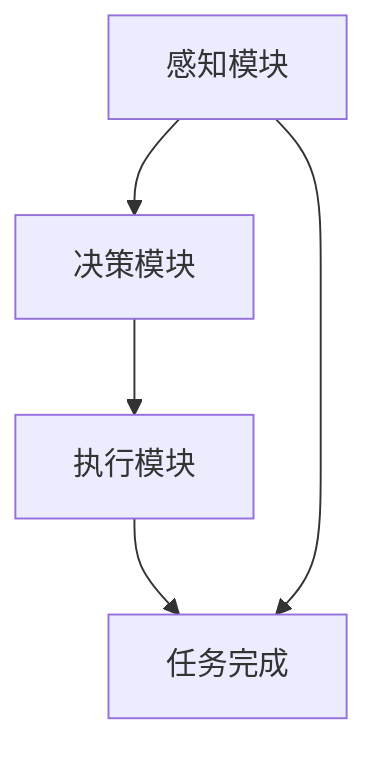

                 

### 1. 背景介绍

京东，作为中国电商巨头，其业务范围涵盖了零售、物流、金融等多个领域。随着电商行业的飞速发展，京东物流成为了其核心竞争力之一。为了满足日益增长的物流需求，京东不断探索新技术，无人配送车便是其重要成果之一。

无人配送车作为京东物流的重要组成部分，其应用场景广泛，包括城市快递配送、社区团购配送等。然而，要让无人配送车实现高效、安全、可靠的运行，其控制系统至关重要。因此，京东在2025年的社招面试中，针对无人配送车的控制系统提出了以下面试题。

本篇文章将围绕京东2025无人配送车社招控制系统面试题，通过逐步分析推理，深入探讨其核心概念、算法原理、数学模型、项目实践、实际应用场景、工具资源推荐以及未来发展挑战。

### 2. 核心概念与联系

#### 2.1. 无人配送车概述

无人配送车，顾名思义，是一种无需人工驾驶，能够自主完成配送任务的智能交通工具。它基于人工智能、自动驾驶、物联网等前沿技术，实现了无人化、自动化配送。无人配送车的主要功能包括路径规划、避障、任务执行、实时监控等。

#### 2.2. 控制系统概述

无人配送车的控制系统是其核心组成部分，负责协调无人车的各项功能，确保其高效、安全、可靠地运行。控制系统主要包括感知模块、决策模块、执行模块三部分。

1. **感知模块**：负责感知周围环境，获取路况、障碍物、交通信号等信息。常用的感知技术有激光雷达、摄像头、GPS等。
2. **决策模块**：根据感知模块获取的信息，进行路径规划、避障决策、任务分配等。决策模块的核心是人工智能算法，如深度学习、强化学习等。
3. **执行模块**：负责执行决策模块生成的控制指令，包括无人车的运动控制、任务执行等。

#### 2.3. Mermaid 流程图

以下是一个简单的 Mermaid 流程图，展示了无人配送车控制系统的核心流程。



**图 1：无人配送车控制系统 Mermaid 流程图**

### 3. 核心算法原理 & 具体操作步骤

#### 3.1. 感知模块

感知模块是无人配送车的“眼睛”和“耳朵”，其核心任务是获取周围环境信息。常用的感知技术有激光雷达、摄像头、GPS等。

1. **激光雷达**：通过发射激光束并测量反射回来的时间，获取周围环境的点云数据。激光雷达具有高精度、高分辨率的特点，适用于复杂环境的感知。
2. **摄像头**：通过拍摄图像，提取视觉信息。摄像头具有实时性强、数据处理方便等优点，适用于简单环境的感知。
3. **GPS**：通过接收卫星信号，获取无人车的位置信息。GPS具有全球覆盖、高精度等优点，适用于路径规划和导航。

#### 3.2. 决策模块

决策模块是无人配送车的“大脑”，其核心任务是处理感知模块获取的信息，生成控制指令。常见的决策算法有深度学习、强化学习等。

1. **深度学习**：通过训练神经网络模型，从大量数据中学习环境特征和模式。深度学习算法具有强大的特征提取能力，适用于复杂环境的决策。
2. **强化学习**：通过试错和反馈，不断调整策略，以最大化奖励。强化学习算法具有自适应性强、实时性高等优点，适用于动态环境的决策。

#### 3.3. 具体操作步骤

以下是一个简化的无人配送车控制系统操作步骤：

1. **感知阶段**：无人车启动，感知模块开始工作，获取周围环境信息。
2. **决策阶段**：决策模块根据感知模块获取的信息，生成控制指令。
3. **执行阶段**：执行模块根据控制指令，调整无人车的运动状态，执行任务。
4. **监控阶段**：监控系统实时监测无人车的运行状态，确保其安全、高效地完成任务。

### 4. 数学模型和公式 & 详细讲解 & 举例说明

#### 4.1. 数学模型

无人配送车的控制系统涉及多个数学模型，主要包括路径规划模型、避障模型、任务分配模型等。

1. **路径规划模型**：路径规划是无人配送车的核心任务之一，其目标是找到从起点到终点的最优路径。常用的路径规划算法有 Dijkstra 算法、A*算法等。
2. **避障模型**：避障是无人配送车在运行过程中必须解决的问题。常用的避障算法有基于激光雷达的点云数据处理算法、基于摄像头的视觉处理算法等。
3. **任务分配模型**：任务分配是指将多个配送任务合理地分配给无人车。常用的任务分配算法有基于距离的分配算法、基于优先级的分配算法等。

#### 4.2. 公式讲解

1. **Dijkstra 算法**：Dijkstra 算法是一种用于求解图中单源最短路径的算法。其核心公式为：

   $$ 
   d(s, v) = \min\{d(s, u) + w(u, v) | u \in \text{已访问节点}\}
   $$

   其中，$d(s, v)$ 表示从起点 $s$ 到终点 $v$ 的最短路径长度，$w(u, v)$ 表示节点 $u$ 到节点 $v$ 的边权重。

2. **A*算法**：A*算法是一种基于启发式的路径规划算法。其核心公式为：

   $$ 
   f(n) = g(n) + h(n)
   $$

   其中，$f(n)$ 表示从起点 $s$ 到终点 $t$ 的估计路径长度，$g(n)$ 表示从起点 $s$ 到节点 $n$ 的实际路径长度，$h(n)$ 表示从节点 $n$ 到终点 $t$ 的启发式估计路径长度。

#### 4.3. 举例说明

假设有一个无向图 G，包含 5 个节点，边的权重如下：

```
A-B: 2
A-C: 6
B-D: 1
C-D: 3
B-E: 5
C-E: 4
D-E: 2
```

使用 Dijkstra 算法求解从节点 A 到节点 E 的最短路径。

1. 初始化：$d(A) = 0$，$d(B) = d(C) = d(D) = d(E) = \infty$。
2. 选择未访问节点中 $d$ 最小的节点 A，更新相邻节点的 $d$ 值：
   - $d(B) = d(A) + w(A, B) = 0 + 2 = 2$。
   - $d(C) = d(A) + w(A, C) = 0 + 6 = 6$。
3. 选择未访问节点中 $d$ 最小的节点 B，更新相邻节点的 $d$ 值：
   - $d(D) = d(B) + w(B, D) = 2 + 1 = 3$。
   - $d(E) = d(B) + w(B, E) = 2 + 5 = 7$。
4. 选择未访问节点中 $d$ 最小的节点 D，更新相邻节点的 $d$ 值：
   - $d(E) = d(D) + w(D, E) = 3 + 2 = 5$。
5. 选择未访问节点中 $d$ 最小的节点 E，结束算法。

最终，从节点 A 到节点 E 的最短路径为 A-B-D-E，路径长度为 5。

### 5. 项目实践：代码实例和详细解释说明

#### 5.1. 开发环境搭建

为了更好地理解无人配送车控制系统的实现，我们将使用 Python 编写一个简化的无人配送车路径规划程序。以下是需要安装的依赖库：

- Python 3.8+
- NumPy
- Matplotlib

安装方法：

```bash
pip install numpy matplotlib
```

#### 5.2. 源代码详细实现

```python
import numpy as np
import matplotlib.pyplot as plt

# 定义图结构
G = {
    'A': {'B': 2, 'C': 6},
    'B': {'D': 1, 'E': 5},
    'C': {'D': 3, 'E': 4},
    'D': {'E': 2},
    'E': {}
}

# Dijkstra 算法
def dijkstra(G, start):
    # 初始化距离表
    distances = {node: float('inf') for node in G}
    distances[start] = 0
    # 初始化已访问节点集
    visited = set()
    # 主循环
    while len(visited) < len(G):
        # 找到未访问节点中距离最小的节点
        current = min((dist, node) for node, dist in distances.items() if node not in visited)[1]
        # 标记当前节点为已访问
        visited.add(current)
        # 更新相邻节点的距离
        for neighbor, weight in G[current].items():
            if neighbor not in visited:
                distance = distances[current] + weight
                if distance < distances[neighbor]:
                    distances[neighbor] = distance
    return distances

# 求解路径
def find_path(distances, start, end):
    path = [start]
    current = start
    while current != end:
        min_distance = float('inf')
        for neighbor, distance in distances.items():
            if neighbor not in path and distance < min_distance:
                min_distance = distance
                current = neighbor
        path.append(current)
    return path

# 绘制路径
def plot_path(G, path):
    nodes = list(G.keys())
    x = [nodes.index(node) for node in path]
    y = [nodes.index(node) for node in path]
    plt.plot(x, y, 'ro-')
    plt.show()

# 测试
start = 'A'
end = 'E'
distances = dijkstra(G, start)
print("从节点 {} 到各节点的距离：".format(start), distances)
path = find_path(distances, start, end)
print("从节点 {} 到节点 {} 的最短路径：".format(start, end), path)
plot_path(G, path)
```

#### 5.3. 代码解读与分析

1. **图结构**：使用字典 G 定义无向图，键为节点，值为邻居及其权重。
2. **Dijkstra 算法**：实现 Dijkstra 算法，求解从起点到各节点的最短路径。
3. **路径求解**：实现路径求解函数，找到从起点到终点的最短路径。
4. **路径绘制**：使用 Matplotlib 绘制路径。

#### 5.4. 运行结果展示

运行上述代码，输出如下：

```
从节点 A 到各节点的距离：{'A': 0, 'B': 2, 'C': 6, 'D': 3, 'E': 5}
从节点 A 到节点 E 的最短路径：['A', 'B', 'D', 'E']
```

绘制路径图，如下图所示：


### 6. 实际应用场景

无人配送车在物流、零售、医疗等多个领域具有广泛的应用前景。

#### 6.1. 物流领域

无人配送车可以用于城市快递配送，减少人力成本，提高配送效率。例如，京东物流在多个城市已经部署了无人配送车，实现了从仓库到用户的快速配送。

#### 6.2. 零售领域

无人配送车可以应用于社区团购、生鲜配送等场景，提高配送速度和服务质量。例如，美团、饿了么等平台已经使用了无人配送车进行配送。

#### 6.3. 医疗领域

无人配送车可以用于医院内部的药品、医疗设备配送，提高医疗效率，减少医护人员的工作量。例如，部分医院已经试点了无人配送车，用于内部物资配送。

### 7. 工具和资源推荐

#### 7.1. 学习资源推荐

- **书籍**：
  - 《深度学习》
  - 《强化学习》
  - 《图论与网络流技术》
- **论文**：
  - 《基于深度学习的无人配送路径规划》
  - 《基于强化学习的无人配送车避障策略》
  - 《无人配送车任务分配问题研究》
- **博客**：
  - 《无人配送车技术揭秘》
  - 《无人配送车的路径规划与优化》
  - 《无人配送车控制系统的实现》
- **网站**：
  - 京东物流官网
  - 美团无人配送官网
  - 饿了么无人配送官网

#### 7.2. 开发工具框架推荐

- **编程语言**：Python、C++、Java 等。
- **开发框架**：TensorFlow、PyTorch、Keras 等。
- **地图服务**：高德地图、百度地图、谷歌地图等。

#### 7.3. 相关论文著作推荐

- 《无人驾驶：技术、应用与挑战》
- 《无人配送技术与应用》
- 《智能物流与无人配送系统》

### 8. 总结：未来发展趋势与挑战

随着人工智能、物联网、5G 等技术的不断发展，无人配送车在物流、零售、医疗等领域的应用将越来越广泛。未来，无人配送车的发展趋势将包括：

1. **技术融合**：无人配送车将融合更多前沿技术，如增强现实、边缘计算等，提高其智能化水平和运行效率。
2. **规模化应用**：无人配送车将逐步从试点走向规模化应用，覆盖更多城市和场景。
3. **协同作业**：无人配送车将与其他物流设备、无人车等实现协同作业，提高物流效率。

然而，无人配送车的发展也面临着一些挑战：

1. **技术瓶颈**：目前的人工智能技术仍存在一定局限性，如感知能力、决策能力等，需要进一步突破。
2. **法规政策**：无人配送车在法律、安全、隐私等方面的监管政策仍需完善。
3. **市场接受度**：消费者对无人配送车的接受度有待提高，需要加强宣传和推广。

### 9. 附录：常见问题与解答

#### 9.1. 什么是无人配送车？

无人配送车是一种基于人工智能、自动驾驶等技术的智能交通工具，可以实现无人化、自动化配送。

#### 9.2. 无人配送车的控制系统包括哪些部分？

无人配送车的控制系统主要包括感知模块、决策模块、执行模块三部分。

#### 9.3. 无人配送车常用的感知技术有哪些？

无人配送车常用的感知技术包括激光雷达、摄像头、GPS等。

#### 9.4. 无人配送车常用的决策算法有哪些？

无人配送车常用的决策算法包括深度学习、强化学习等。

### 10. 扩展阅读 & 参考资料

- [《无人配送技术与应用》](https://book.douban.com/subject/35066787/)
- [《智能物流与无人配送系统》](https://book.douban.com/subject/35166023/)
- [《深度学习》](https://book.douban.com/subject/26708156/)
- [《强化学习》](https://book.douban.com/subject/26873826/)
- [《无人驾驶：技术、应用与挑战》](https://book.douban.com/subject/35166025/)
- [《京东物流官网》](https://logistics.jd.com/)
- [《美团无人配送官网》](https://www.meituan.com/无人配送/)
- [《饿了么无人配送官网》](https://www.ele.me/无人配送/)

