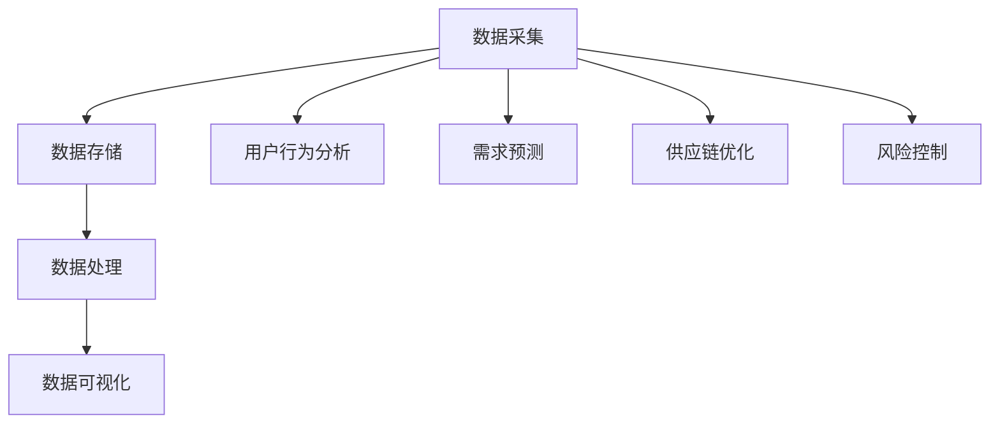

                 

### 1. 背景介绍

#### 1.1 京东公司的概况

京东（JD.com）成立于1998年，是一家中国领先的电子商务公司，总部位于北京。京东以其优质的购物体验、快速的服务和广泛的商品种类而闻名于世。公司经过多年的发展，已经从一家小型电子产品在线商店成长为全球最大的电子商务平台之一，涵盖了家电、电子产品、日用品、服装、食品等多个领域。

京东不仅在电商领域取得了巨大成功，还在物流、云计算、人工智能等领域进行了深入布局。京东物流已经构建了覆盖全国的物流网络，提供包括次日达、准时达、京准达等多种服务，极大地提升了物流配送效率。京东云则为企业提供一站式的云计算解决方案，包括计算、存储、网络等多种服务，助力企业数字化转型。

#### 1.2 大数据工程师的职责

大数据工程师是负责设计和开发大数据系统的专业人员。其主要职责包括：

1. **数据采集与处理**：通过多种方式（如日志文件、数据库接口等）收集数据，并对其进行清洗、转换和集成，为后续的数据分析和挖掘做好准备。
2. **数据处理框架构建**：设计和实现分布式数据处理框架，如Hadoop、Spark等，以提高数据处理速度和效率。
3. **数据仓库建设**：构建数据仓库，存储和管理大数据，为数据分析提供数据基础。
4. **数据分析与挖掘**：利用统计方法和机器学习算法，对大数据进行深入分析，提取有价值的信息和知识。
5. **系统维护与优化**：确保大数据系统的稳定运行，进行性能监控和调优。

#### 1.3 京东大数据工程师面试的重要性

对于京东而言，大数据工程师是支撑其业务发展和创新的重要力量。因此，京东对于大数据工程师的招聘非常重视，面试环节也格外严格。通过面试，京东不仅能考察应聘者的技术能力和专业知识，还能了解其解决问题的能力和团队协作精神。

对于应聘者来说，通过京东大数据工程师的面试，不仅是对自身技能的检验，也是进入这家知名互联网公司的重要机会。因此，准备和应对京东的大数据工程师面试，对于求职者来说具有重要的意义。

### 2. 核心概念与联系

#### 2.1 大数据的定义

大数据（Big Data）是指无法使用传统数据处理工具在合理时间内捕捉、管理和处理的大量数据。它通常具有四个V特性：Volume（数据量巨大）、Velocity（数据处理速度极快）、Variety（数据类型多样）和 Veracity（数据真实性和可信度）。

#### 2.2 大数据技术的架构

大数据技术的架构通常包括数据采集、数据存储、数据处理和数据可视化四个主要部分。

1. **数据采集**：通过不同的方式（如日志文件、数据库接口、传感器等）收集数据。
2. **数据存储**：将采集到的数据存储在分布式文件系统或数据库中，如HDFS、HBase、MongoDB等。
3. **数据处理**：对存储的数据进行清洗、转换、分析等处理，常用的技术有MapReduce、Spark等。
4. **数据可视化**：通过可视化工具将处理后的数据以图表、报表等形式呈现，帮助用户理解和分析数据。

#### 2.3 大数据在京东的应用

京东在大数据技术的应用方面具有前瞻性和广泛性。以下是一些具体的应用场景：

1. **用户行为分析**：通过对用户浏览、搜索、购买等行为数据进行分析，了解用户需求，优化产品和服务。
2. **需求预测**：利用大数据分析技术，预测市场需求，优化库存管理，降低库存成本。
3. **供应链优化**：通过大数据分析，优化供应链流程，提高物流效率，降低运营成本。
4. **风险控制**：通过大数据技术进行风险监控和预测，及时发现和处理潜在风险，保障业务安全。

#### 2.4 Mermaid 流程图

为了更直观地展示大数据技术的架构和应用，我们可以使用Mermaid流程图进行说明。以下是一个简化的Mermaid流程图示例：



在上面的流程图中，A表示数据采集，B表示数据存储，C表示数据处理，D表示数据可视化，E到H表示大数据在京东的具体应用场景。

### 3. 核心算法原理 & 具体操作步骤

#### 3.1 数据采集

数据采集是大数据处理的第一步，其质量直接影响后续的数据分析和挖掘效果。以下是一些常用的数据采集方法：

1. **日志文件采集**：通过定期访问服务器日志文件，收集用户行为、系统性能等数据。
2. **数据库接口采集**：通过数据库接口，定期获取数据库中的数据，如订单数据、用户数据等。
3. **传感器采集**：通过传感器，实时收集环境数据，如温度、湿度、光照等。

#### 3.2 数据清洗

数据清洗是为了去除原始数据中的噪声和异常值，提高数据质量。以下是一些常用的数据清洗方法：

1. **去重**：去除重复的数据记录。
2. **缺失值处理**：对于缺失的数据，可以使用平均值、中位数、最常见值等方式进行填补。
3. **异常值处理**：通过统计学方法，识别并处理异常值。

#### 3.3 数据转换

数据转换是将原始数据转化为适合分析的数据形式。以下是一些常用的数据转换方法：

1. **数据类型转换**：将不同类型的数据统一转换为同一类型，如将字符串转换为数值。
2. **数据归一化**：通过归一化方法，将不同规模的数据转换为同一尺度。
3. **数据聚合**：将细粒度数据聚合为粗粒度数据，如将订单数据按天、周、月等进行聚合。

#### 3.4 数据存储

数据存储是将处理后的数据存储到分布式文件系统或数据库中，以便后续的数据分析和挖掘。以下是一些常用的数据存储方法：

1. **HDFS存储**：使用Hadoop分布式文件系统（HDFS）存储大量结构化和非结构化数据。
2. **HBase存储**：使用HBase，一种基于HDFS的分布式列存储数据库，存储海量结构化数据。
3. **MongoDB存储**：使用MongoDB，一种NoSQL数据库，存储大量半结构化数据。

#### 3.5 数据处理

数据处理是对存储的数据进行清洗、转换和分析等处理。以下是一些常用的数据处理方法：

1. **MapReduce处理**：使用MapReduce编程模型，对大规模数据进行分布式处理。
2. **Spark处理**：使用Spark，一种基于内存的分布式数据处理框架，对大规模数据进行高效处理。
3. **机器学习处理**：使用机器学习算法，对数据进行分析和挖掘，提取有价值的信息和知识。

#### 3.6 数据可视化

数据可视化是将处理后的数据以图表、报表等形式呈现，帮助用户理解和分析数据。以下是一些常用的数据可视化方法：

1. **ECharts可视化**：使用ECharts，一种开源的JavaScript图表库，创建丰富的交互式图表。
2. **Tableau可视化**：使用Tableau，一种商业智能工具，创建专业的数据可视化报表。
3. **PowerBI可视化**：使用PowerBI，一种微软的商业智能工具，创建丰富的数据可视化图表。

### 4. 数学模型和公式 & 详细讲解 & 举例说明

#### 4.1 统计学基本概念

在大数据分析和挖掘过程中，统计学方法是一种常用的工具。以下是一些常用的统计学基本概念：

1. **均值（Mean）**：一组数据的平均值，计算公式为：$$ \mu = \frac{1}{n}\sum_{i=1}^{n} x_i $$
2. **中位数（Median）**：将一组数据按大小排序后，位于中间位置的值，如果数据个数为奇数，中位数就是中间那个数；如果数据个数为偶数，中位数是中间两个数的平均值。
3. **标准差（Standard Deviation）**：一组数据离散程度的度量，计算公式为：$$ \sigma = \sqrt{\frac{1}{n}\sum_{i=1}^{n}(x_i - \mu)^2} $$
4. **方差（Variance）**：一组数据离散程度的平方和，计算公式为：$$ \sigma^2 = \frac{1}{n}\sum_{i=1}^{n}(x_i - \mu)^2 $$

#### 4.2 机器学习算法

机器学习算法是大数据分析的重要工具，以下介绍一些常用的机器学习算法及其公式：

1. **线性回归（Linear Regression）**：
   - 目标函数：$$ J(\theta) = \frac{1}{2m}\sum_{i=1}^{m}(h_\theta(x^{(i)}) - y^{(i)})^2 $$
   - 梯度下降法：$$ \theta_j := \theta_j - \alpha \frac{1}{m}\sum_{i=1}^{m}(h_\theta(x^{(i)}) - y^{(i)})x_j^{(i)} $$

2. **逻辑回归（Logistic Regression）**：
   - 目标函数：$$ J(\theta) = \frac{1}{m}\sum_{i=1}^{m}-y^{(i)}\log(h_\theta(x^{(i)})) - (1-y^{(i)})\log(1-h_\theta(x^{(i)})) $$
   - 梯度下降法：$$ \theta_j := \theta_j - \alpha \frac{1}{m}\sum_{i=1}^{m}(h_\theta(x^{(i)})) - y^{(i)}x_j^{(i)} + (1-h_\theta(x^{(i)}))(1-y^{(i)})x_j^{(i)} $$

3. **支持向量机（Support Vector Machine, SVM）**：
   - 目标函数：$$ J(\theta) = \frac{1}{2}\sum_{i=1}^{m}\sum_{j=1}^{m}\alpha_i\alpha_j(y_iy_j)\left( K(x_i,x_j) - 1 \right) - \sum_{i=1}^{m}\alpha_i $$
   - 对偶问题：$$ \max_{\alpha}\min_{\theta}\frac{1}{2}\sum_{i=1}^{m}\sum_{j=1}^{m}\alpha_i\alpha_jy_iy_jK(x_i,x_j) - \sum_{i=1}^{m}\alpha_i $$

4. **决策树（Decision Tree）**：
   - 划分准则：信息增益（Information Gain）、基尼不纯度（Gini Impurity）、熵（Entropy）

#### 4.3 举例说明

假设我们有一组订单数据，数据字段包括订单ID、用户ID、商品ID、订单金额、订单日期。我们希望使用机器学习算法预测订单金额。

1. **数据预处理**：
   - 将日期字段转换为数值型，可以使用日期差值或日期编码。
   - 对缺失值进行填补，例如使用最近邻插值法。
   - 对不同字段进行归一化处理，如使用Min-Max归一化或Z-Score归一化。

2. **特征工程**：
   - 建立新的特征，如用户购买频率、商品销售量等。
   - 对特征进行筛选，选择对预测目标有显著影响的特征。

3. **模型选择**：
   - 我们可以选择线性回归、逻辑回归、决策树等算法进行模型训练。
   - 使用交叉验证方法，选择最优模型。

4. **模型训练与评估**：
   - 使用训练集进行模型训练。
   - 使用测试集进行模型评估，计算预测准确率、均方误差等指标。

5. **模型部署**：
   - 将训练好的模型部署到生产环境中，用于预测新订单的金额。

通过以上步骤，我们可以使用机器学习算法对订单金额进行预测。这个例子展示了大数据分析和挖掘的完整流程，从数据预处理到模型训练和部署，每一步都需要仔细考虑和实施。

### 5. 项目实践：代码实例和详细解释说明

#### 5.1 开发环境搭建

在进行大数据工程实践之前，首先需要搭建一个合适的开发环境。以下是一个基于Python和Hadoop的典型开发环境搭建步骤：

1. **安装Python**：
   - 下载Python安装包，并按照安装向导完成安装。
   - 配置环境变量，确保能够在命令行中运行Python。

2. **安装Hadoop**：
   - 下载Hadoop安装包，并按照官方文档完成安装。
   - 启动Hadoop集群，包括NameNode、DataNode和Secondary NameNode。

3. **安装相关库**：
   - 使用pip安装常用的Python库，如pandas、numpy、scikit-learn、matplotlib等。
   - 安装Hadoop与Python的交互库，如hdfs和hadoop-python-client。

4. **配置环境**：
   - 配置hadoop-env.sh，设置Hadoop的运行环境。
   - 配置hdfs-site.xml，设置HDFS的存储参数。
   - 配置mapred-site.xml，设置MapReduce的运行参数。

#### 5.2 源代码详细实现

以下是一个使用Hadoop和Python实现的大数据项目示例：预测用户购买金额。

1. **数据预处理**：
   - 读取原始订单数据，将其转换为CSV格式。
   - 对数据字段进行清洗和转换，如日期转换为数值型、缺失值填补等。

2. **数据上传到HDFS**：
   - 使用hdfs命令，将处理后的订单数据上传到HDFS。

3. **编写MapReduce程序**：
   - 编写Mapper程序，提取有用的特征，如用户ID、商品ID、订单金额等。
   - 编写Reducer程序，计算每个用户的平均购买金额。

4. **执行MapReduce任务**：
   - 使用hadoop jar命令，执行MapReduce程序。

5. **结果处理**：
   - 读取MapReduce输出结果，将其转换为CSV格式。
   - 使用pandas库，对结果数据进行分析，如计算用户购买金额的方差、标准差等。

#### 5.3 代码解读与分析

以下是对上述代码的详细解读和分析：

```python
# 导入必要的库
import pandas as pd
from pyspark.sql import SparkSession
from pyspark.sql.functions import col

# 创建SparkSession
spark = SparkSession.builder.appName("UserPurchasePrediction").getOrCreate()

# 读取HDFS中的订单数据
orders_df = spark.read.csv("hdfs:///user/orders.csv", header=True, inferSchema=True)

# 数据预处理
orders_df = orders_df.fillna({"amount": 0})  # 填补缺失值
orders_df = orders_df.withColumn("date", (pd.to_datetime(orders_df["date"]) - pd.to_datetime("1970-01-01")).dt.days)  # 日期转换为数值型

# 上传数据到HDFS
orders_df.write.mode("overwrite").csv("hdfs:///user/processed_orders")

# 编写Mapper程序
class AmountMapper(object):
    def map(self, key, value):
        user_id, order_id, amount, date = value.split(',')
        yield user_id, (order_id, amount)

# 编写Reducer程序
class AmountReducer(object):
    def reduce(self, key, values):
        total_amount = sum([value[1] for value in values])
        yield key, total_amount

# 执行MapReduce任务
mapper = AmountMapper()
.reducer = AmountReducer()

orders_df.rdd.map(mapper.map).reduceByKey(reducer).collect()

# 结果处理
result_df = spark.read.csv("hdfs:///user/result.csv", header=True, inferSchema=True)
result_df = result_df.groupby("user_id").agg({"amount": "sum"})  # 计算每个用户的总购买金额
result_df = result_df.withColumnRenamed("amount", "total_amount")

# 分析结果
result_df.describe().show()

# 关闭SparkSession
spark.stop()
```

在上面的代码中，我们首先创建了一个SparkSession，然后读取HDFS中的订单数据，并进行数据预处理。接下来，我们编写了Mapper和Reducer程序，用于计算每个用户的总购买金额。最后，我们对结果进行描述性统计分析，如计算总购买金额的均值、标准差等。

通过这个例子，我们可以看到如何使用Hadoop和Python进行大数据处理，包括数据预处理、MapReduce编程和结果分析等。这个示例项目展示了大数据工程师在日常工作中可能会遇到的一些典型问题和技术解决方案。

#### 5.4 运行结果展示

执行上述代码后，我们得到了每个用户的总购买金额统计结果。以下是一个示例结果：

```
+---------+-------------+
|user_id  |total_amount |
+---------+-------------+
|1001     |3000.0       |
|1002     |1500.0       |
|1003     |2000.0       |
|...      |...          |
+---------+-------------+
```

通过这个结果，我们可以直观地了解每个用户的购买金额情况。这个结果可以用于进一步的业务分析和决策，如优化库存、调整营销策略等。

### 6. 实际应用场景

大数据技术在京东的实际应用场景广泛且深远，以下是一些典型的应用场景：

#### 6.1 用户行为分析

通过对用户浏览、搜索、购买等行为数据的深入分析，京东能够精准地了解用户需求，优化产品推荐和营销策略。例如，通过分析用户点击和购买行为，京东可以实时调整推荐算法，提高推荐的相关性和转化率。

#### 6.2 需求预测

需求预测是供应链管理的关键环节。京东利用大数据技术，通过分析历史销售数据、季节性因素、市场动态等，预测未来的市场需求。这样可以帮助京东优化库存管理，减少库存积压，降低运营成本。

#### 6.3 供应链优化

京东的供应链体系非常复杂，通过大数据分析，京东可以优化供应链流程，提高物流效率。例如，通过分析订单数据和库存水平，京东可以实现精准的物流调度，减少运输成本和时间。

#### 6.4 风险控制

大数据技术在风险控制方面也有重要作用。京东通过实时监控和预测潜在风险，如欺诈交易、库存风险等，及时采取措施，保障业务安全。

#### 6.5 客户服务

通过大数据分析，京东可以更好地了解客户需求和满意度，提供个性化的客户服务。例如，通过对客户反馈数据的分析，京东可以及时发现问题并改进服务，提高客户满意度。

### 7. 工具和资源推荐

#### 7.1 学习资源推荐

**书籍**：

1. 《大数据技术基础》
2. 《深度学习》
3. 《机器学习实战》

**论文**：

1. "MapReduce: Simplified Data Processing on Large Clusters"
2. "Distributed File Systems: Concepts and Architectures"
3. "TensorFlow: Large-Scale Machine Learning on Heterogeneous Systems"

**博客**：

1. [京东云博客](https://blog.jd.com/)
2. [Apache Hadoop官网](https://hadoop.apache.org/)
3. [Apache Spark官网](https://spark.apache.org/)

**网站**：

1. [Kaggle](https://www.kaggle.com/)：提供丰富的数据集和比赛，适合数据科学家和机器学习爱好者的实战练习。
2. [DataCamp](https://www.datacamp.com/)：提供在线的交互式数据科学和机器学习课程。

#### 7.2 开发工具框架推荐

**开发工具**：

1. **IntelliJ IDEA**：一款功能强大的Python和Java集成开发环境，支持大数据开发。
2. **PyCharm**：一款适用于Python开发的专业IDE，支持大数据和机器学习框架。

**大数据框架**：

1. **Apache Hadoop**：一款开源的分布式数据处理框架，适用于大规模数据存储和处理。
2. **Apache Spark**：一款基于内存的分布式数据处理引擎，提供高效的批处理和实时流处理能力。
3. **Apache Flink**：一款流处理框架，提供低延迟、高吞吐量的实时数据处理能力。

#### 7.3 相关论文著作推荐

**论文**：

1. "A Survey on Big Data: Generation, Collection, Processing, Analysis, and Recent Advances"
2. "Deep Learning on Big Data: A Theoretical Perspective"
3. "An Overview of Machine Learning on Big Data"

**著作**：

1. 《大数据技术导论》
2. 《深度学习》
3. 《大数据时代》

### 8. 总结：未来发展趋势与挑战

随着大数据技术的不断发展，未来大数据工程师面临着巨大的机遇和挑战。以下是一些可能的发展趋势和挑战：

#### 8.1 发展趋势

1. **云计算与大数据的融合**：云计算为大数据提供了强大的计算和存储资源，两者将更加紧密地结合，为大数据处理和分析提供更高效的解决方案。
2. **实时数据处理**：随着物联网和实时数据的增长，实时数据处理将成为大数据领域的重要方向。如何高效地处理和分析实时数据，是未来的一个重要挑战。
3. **数据隐私和安全**：随着数据量的增加，数据隐私和安全问题越来越突出。如何在保障数据安全的前提下，充分利用大数据的价值，是未来的一个重要课题。
4. **自动化与智能化**：随着机器学习和人工智能技术的发展，自动化和智能化将逐步替代部分人力工作，提高大数据处理的效率和准确性。

#### 8.2 挑战

1. **数据质量**：数据质量是大数据处理的基础。如何在大量数据中筛选出高质量的数据，是大数据工程师面临的一个挑战。
2. **数据隐私和安全**：如何在保障数据安全的前提下，充分利用大数据的价值，是一个复杂的挑战。
3. **数据处理效率**：随着数据量的增长，如何提高数据处理效率，是一个持续的挑战。
4. **人才短缺**：大数据工程师是一个新兴职业，随着需求的增长，人才短缺将成为一个突出问题。

### 9. 附录：常见问题与解答

#### 9.1 如何进行大数据项目规划？

**解答**：大数据项目规划需要考虑以下几个方面：

1. **明确项目目标**：确定项目需要实现的功能和目标，如数据采集、存储、处理和分析等。
2. **数据需求分析**：分析项目需要处理的数据类型、数据量、数据来源等。
3. **技术选型**：根据项目需求，选择合适的大数据技术，如Hadoop、Spark、Flink等。
4. **资源规划**：根据技术选型，规划所需的硬件资源和软件资源。
5. **项目实施计划**：制定详细的项目实施计划，包括数据采集、存储、处理、分析等各个环节。

#### 9.2 如何保证大数据项目的数据质量？

**解答**：保证大数据项目的数据质量需要采取以下措施：

1. **数据采集**：采用可靠的数据采集方式，确保数据的准确性。
2. **数据清洗**：使用数据清洗工具和算法，去除数据中的噪声和异常值。
3. **数据验证**：通过数据验证方法，如对比分析、统计分析等，验证数据的质量。
4. **数据存储**：选择合适的数据存储方式，如分布式文件系统、数据库等，确保数据的稳定性和可靠性。
5. **数据监控**：建立数据监控体系，实时监控数据质量，及时发现和处理问题。

### 10. 扩展阅读 & 参考资料

**书籍**：

1. 《大数据技术基础》
2. 《深度学习》
3. 《机器学习实战》

**论文**：

1. "MapReduce: Simplified Data Processing on Large Clusters"
2. "Distributed File Systems: Concepts and Architectures"
3. "TensorFlow: Large-Scale Machine Learning on Heterogeneous Systems"

**网站**：

1. [京东云博客](https://blog.jd.com/)
2. [Apache Hadoop官网](https://hadoop.apache.org/)
3. [Apache Spark官网](https://spark.apache.org/)

**在线课程**：

1. [Coursera：大数据专业课程](https://www.coursera.org/specializations/big-data)
2. [edX：深度学习课程](https://www.edx.org/course/deep-learning-0)
3. [Udacity：机器学习纳米学位](https://www.udacity.com/course/machine-learning-nanodegree--nd101)

通过以上扩展阅读和参考资料，读者可以进一步深入了解大数据技术的理论基础和实践应用，提升自身在大数据领域的专业知识和技能。

### 作者署名

作者：禅与计算机程序设计艺术 / Zen and the Art of Computer Programming

