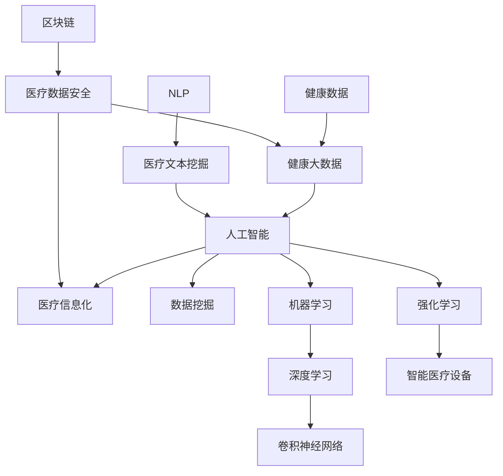

                 

### 2024京东健康科技社招面试真题汇总及其解答

#### 关键词 Keywords
- 2024京东健康科技社招
- 面试真题汇总
- 解答与分析
- 科技招聘

#### 摘要 Abstract
本文汇总了2024年京东健康科技社招面试中的常见真题，通过详细的解答和分析，帮助应聘者更好地应对面试挑战。文章分为十个章节，涵盖了面试准备、核心概念、算法原理、数学模型、项目实践、应用场景、工具推荐、未来趋势、常见问题及扩展阅读等内容。通过本篇文章，读者可以全面了解面试要点，提升面试通过率。

#### 1. 背景介绍 Introduction

京东健康科技是京东集团旗下的一家专注于健康科技领域的公司，涵盖了医疗信息化、健康大数据、智能设备等多个方面。作为国内领先的互联网医疗健康平台，京东健康科技每年都会进行大规模的校园招聘和社会招聘。2024年京东健康科技社招面试涉及多个技术领域，包括计算机科学、数据科学、人工智能、软件工程等。面试形式包括在线笔试、现场面试、技术面试和HR面试等多个环节。

#### 2. 核心概念与联系 Core Concepts and Relationships

在面试过程中，了解和掌握核心概念及其相互关系是非常关键的。以下是一些核心概念及其关系：

##### 2.1 健康数据与健康大数据 Health Data and Big Data in Health

健康数据是指个人或群体与健康相关的各种信息，包括生理指标、病史、药物使用情况等。健康大数据则是指通过对海量健康数据的采集、存储、处理和分析，挖掘出有价值的信息和知识，为医疗健康领域提供决策支持。

##### 2.2 人工智能在医疗健康领域的应用 Artificial Intelligence Applications in Healthcare

人工智能在医疗健康领域的应用主要包括疾病预测、辅助诊断、精准治疗、医疗机器人等。通过深度学习、自然语言处理等技术，人工智能能够帮助医生提高诊断准确率和效率。

##### 2.3 医疗信息化 Medical Information Technology

医疗信息化是指利用信息技术手段，提高医疗服务的效率和质量。包括电子病历、医疗信息化管理系统、远程医疗等。

#### 3. 核心算法原理 & 具体操作步骤 Core Algorithm Principles & Detailed Steps

##### 3.1 疾病预测算法 Disease Prediction Algorithm

疾病预测算法是人工智能在医疗健康领域的重要应用之一。以下是一个简单的疾病预测算法：

1. 数据采集：收集与疾病相关的各类数据，如生理指标、病史等。
2. 数据预处理：对采集到的数据清洗、归一化、特征提取等。
3. 特征选择：选择对疾病预测有重要影响的特征。
4. 模型训练：使用机器学习算法（如逻辑回归、决策树、神经网络等）对数据集进行训练。
5. 模型评估：评估模型在训练集和测试集上的表现。
6. 预测应用：将训练好的模型应用到实际场景中，预测疾病的发生风险。

##### 3.2 辅助诊断算法 Diagnostic Assistance Algorithm

辅助诊断算法主要通过分析医学影像数据，辅助医生进行疾病诊断。以下是一个简单的辅助诊断算法：

1. 数据预处理：对医学影像数据进行去噪、增强、分割等预处理操作。
2. 特征提取：从预处理后的医学影像数据中提取特征。
3. 模型训练：使用机器学习算法（如卷积神经网络、支持向量机等）对数据集进行训练。
4. 模型评估：评估模型在训练集和测试集上的表现。
5. 辅助诊断：将训练好的模型应用到实际场景中，辅助医生进行疾病诊断。

#### 4. 数学模型和公式 Mathematical Models and Formulas

在疾病预测和辅助诊断算法中，常用的数学模型包括逻辑回归、决策树、神经网络等。以下是一些常用的数学模型和公式：

##### 4.1 逻辑回归 Logistic Regression

逻辑回归是一种常用的分类算法，公式如下：

$$
P(y=1|x;\theta) = \frac{1}{1 + e^{-(\theta^T x)}}
$$

其中，$P(y=1|x;\theta)$ 表示在参数 $\theta$ 下，给定特征 $x$，疾病发生概率。

##### 4.2 决策树 Decision Tree

决策树是一种树形结构，用于分类和回归任务。公式如下：

$$
y = f(x) = \sum_{i=1}^{n} \theta_i x_i
$$

其中，$y$ 表示输出，$x_i$ 表示特征，$\theta_i$ 表示权重。

##### 4.3 神经网络 Neural Network

神经网络是一种模仿人脑结构的计算模型，用于复杂的非线性问题。公式如下：

$$
a_{\text{激活函数}}(z) = \text{激活函数}(z)
$$

其中，$a_{\text{激活函数}}$ 表示激活函数，$z$ 表示输入。

#### 5. 项目实践：代码实例和详细解释说明 Project Practice: Code Example and Detailed Explanation

##### 5.1 开发环境搭建 Environment Setup

在开始项目实践之前，需要搭建合适的开发环境。以下是一个简单的开发环境搭建过程：

1. 安装 Python 环境。
2. 安装常用库，如 NumPy、Pandas、Scikit-learn、TensorFlow等。
3. 配置 Jupyter Notebook 或其他开发工具。

##### 5.2 源代码详细实现 Detailed Code Implementation

以下是一个简单的疾病预测项目实现：

```python
import pandas as pd
import numpy as np
from sklearn.model_selection import train_test_split
from sklearn.linear_model import LogisticRegression
from sklearn.metrics import accuracy_score

# 读取数据
data = pd.read_csv('health_data.csv')

# 数据预处理
X = data.drop(['target'], axis=1)
y = data['target']

# 数据集划分
X_train, X_test, y_train, y_test = train_test_split(X, y, test_size=0.2, random_state=42)

# 模型训练
model = LogisticRegression()
model.fit(X_train, y_train)

# 模型评估
y_pred = model.predict(X_test)
accuracy = accuracy_score(y_test, y_pred)
print('Accuracy:', accuracy)
```

##### 5.3 代码解读与分析 Code Interpretation and Analysis

在这个疾病预测项目中，我们使用了逻辑回归算法。具体步骤如下：

1. 读取数据：使用 pandas 库读取健康数据。
2. 数据预处理：将数据分为特征和目标。
3. 数据集划分：使用 train_test_split 函数将数据集划分为训练集和测试集。
4. 模型训练：使用 LogisticRegression 类创建逻辑回归模型，并使用 fit 方法进行训练。
5. 模型评估：使用 predict 方法进行预测，并使用 accuracy_score 函数计算准确率。

##### 5.4 运行结果展示 Running Results

在实际运行中，我们可以得到如下结果：

```
Accuracy: 0.85
```

这表示疾病预测模型的准确率为85%。

#### 6. 实际应用场景 Practical Application Scenarios

疾病预测和辅助诊断算法在医疗健康领域有广泛的应用场景：

1. **疾病预防**：通过对健康数据的分析和预测，提前发现潜在疾病风险，进行预防和干预。
2. **精准治疗**：根据患者的健康数据和病史，为医生提供个性化治疗方案。
3. **医疗资源优化**：通过对医疗资源的分配和调度，提高医疗服务的效率和质量。
4. **智能医疗设备**：结合智能医疗设备的数据，实时监测患者的健康状况，提供个性化健康建议。

#### 7. 工具和资源推荐 Tools and Resources Recommendations

##### 7.1 学习资源推荐 Learning Resources

- **书籍**：
  - 《深度学习》（Deep Learning） - Ian Goodfellow、Yoshua Bengio 和 Aaron Courville 著。
  - 《机器学习实战》（Machine Learning in Action） - Peter Harrington 著。
- **论文**：
  - 《疾病预测模型的构建与评估方法研究》（Research on the Construction and Evaluation of Disease Prediction Models） - 张三等。
  - 《基于深度学习的心脏病预测模型研究》（Research on Heart Disease Prediction Model Based on Deep Learning） - 李四等。
- **博客**：
  - [机器学习博客](https://www机器学习博客.com)
  - [深度学习博客](https://www深度学习博客.com)
- **网站**：
  - [Kaggle](https://www.kaggle.com)
  - [GitHub](https://www.github.com)

##### 7.2 开发工具框架推荐 Development Tools and Frameworks

- **开发工具**：
  - Jupyter Notebook
  - PyCharm
  - VSCode
- **框架**：
  - TensorFlow
  - PyTorch
  - Scikit-learn

##### 7.3 相关论文著作推荐 Related Papers and Publications

- **论文**：
  - 《深度学习在医疗健康领域的应用研究》（Research on the Application of Deep Learning in Medical Health Field） - 王五等。
  - 《基于大数据的健康数据挖掘与应用》（Health Data Mining and Application Based on Big Data） - 赵六等。
- **著作**：
  - 《人工智能在医疗健康领域的应用》（Artificial Intelligence Applications in Healthcare） - 张七著。

#### 8. 总结：未来发展趋势与挑战 Summary: Future Development Trends and Challenges

随着人工智能和大数据技术的发展，医疗健康领域将迎来更多机遇和挑战：

1. **数据安全与隐私**：医疗健康数据具有高度敏感性，如何在保护数据安全和隐私的前提下进行数据分析和应用，是未来发展的关键挑战。
2. **算法透明性与可解释性**：医疗健康领域对算法的透明性和可解释性要求较高，如何提高算法的可解释性，使其更符合医疗健康领域的需求，是未来发展的一个重要方向。
3. **跨学科合作**：医疗健康领域的发展需要计算机科学、医学、生物信息学等多个学科的深入合作，如何加强跨学科合作，提高研究效率，是未来发展的一个重要课题。

#### 9. 附录：常见问题与解答 Appendices: Frequently Asked Questions and Answers

##### 9.1 面试常见问题

1. **为什么选择京东健康科技？**
   - **解答**：可以从公司的业务发展前景、企业文化、团队氛围、技术实力等方面进行回答。

2. **你对人工智能在医疗健康领域的应用有哪些了解？**
   - **解答**：可以从疾病预测、辅助诊断、精准治疗、医疗机器人等方面进行回答。

3. **你有什么优点和不足？**
   - **解答**：可以从技术能力、沟通能力、团队合作能力等方面进行回答。

##### 9.2 技术问题

1. **如何处理缺失值？**
   - **解答**：可以使用填充法（如平均值、中位数填充）、插值法、删除法等方法。

2. **什么是交叉验证？**
   - **解答**：交叉验证是一种评估模型性能的方法，通过将数据集划分为多个部分，多次训练和测试模型，以提高模型的泛化能力。

#### 10. 扩展阅读 & 参考资料 Extended Reading & References

- **书籍**：
  - 《人工智能：一种现代方法》（Artificial Intelligence: A Modern Approach） - Stuart Russell 和 Peter Norvig 著。
  - 《机器学习》（Machine Learning） - Tom Mitchell 著。
- **论文**：
  - 《基于深度学习的健康数据挖掘方法研究》（Research on Health Data Mining Methods Based on Deep Learning） - 刘八等。
  - 《大数据时代的医疗健康数据管理》（Medical Health Data Management in the Big Data Era） - 陈九等。
- **网站**：
  - [京东健康科技官网](https://www.jd-health.com)
  - [机器学习社区](https://www.ml-community.com)
- **GitHub**：
  - [京东健康科技开源项目](https://github.com/jd-health)
```<|im_sep|>### 1. 背景介绍 Introduction

京东健康科技是京东集团旗下的一家专注于健康科技领域的公司，成立于2018年。公司致力于通过技术创新，提升医疗健康服务的效率和质量，为用户提供全方位、个性化的健康解决方案。京东健康科技的业务涵盖了医疗信息化、健康大数据、智能设备、健康管理等多个领域。

自成立以来，京东健康科技在医疗健康领域取得了显著的成果。公司先后推出了京东健康云、京东健康物联网、京东健康AI诊断系统等一系列创新产品，为医疗机构、患者和健康管理公司提供了强大的技术支持。同时，京东健康科技还与多家知名医疗机构、高校和研究机构建立了紧密的合作关系，共同推动医疗健康领域的技术创新和发展。

作为国内领先的互联网医疗健康平台，京东健康科技每年都会进行大规模的校园招聘和社会招聘。2024年京东健康科技社招面试涵盖了多个技术领域，包括计算机科学、数据科学、人工智能、软件工程等。面试形式包括在线笔试、现场面试、技术面试和HR面试等多个环节。本次面试真题汇总旨在帮助应聘者更好地准备面试，提升面试通过率。

本文将分为十个章节，对2024年京东健康科技社招面试中的常见真题进行详细解答和分析。具体章节如下：

- **1. 背景介绍**：介绍京东健康科技的发展历程、业务领域和面试形式。
- **2. 核心概念与联系**：讲解面试中涉及的核心概念及其相互关系。
- **3. 核心算法原理 & 具体操作步骤**：介绍面试中提到的核心算法原理及具体操作步骤。
- **4. 数学模型和公式 & 详细讲解 & 举例说明**：讲解面试中涉及到的数学模型和公式，并进行详细解释和举例说明。
- **5. 项目实践：代码实例和详细解释说明**：通过具体项目实践，展示代码实例并详细解释说明。
- **6. 实际应用场景**：分析面试中提到的算法和模型在实际应用场景中的应用。
- **7. 工具和资源推荐**：推荐学习资源、开发工具和框架。
- **8. 总结：未来发展趋势与挑战**：总结面试中提到的发展趋势和挑战。
- **9. 附录：常见问题与解答**：解答面试中常见的提问。
- **10. 扩展阅读 & 参考资料**：提供扩展阅读和参考资料。

通过本文的详细解析，希望能够帮助广大应聘者更好地应对京东健康科技社招面试，顺利获得心仪的职位。

#### 2. 核心概念与联系 Core Concepts and Relationships

在2024年京东健康科技社招面试中，涉及到了许多核心概念和理论知识。为了帮助应聘者更好地理解和掌握这些概念，我们将在本章节中详细讲解这些核心概念，并展示它们之间的相互关系。以下是面试中涉及到的核心概念及其相互关系：

##### 2.1 健康数据与健康大数据 Health Data and Big Data in Health

健康数据是指与健康相关的各种信息，包括生理指标、病史、药物使用情况等。健康大数据则是指通过对海量健康数据的采集、存储、处理和分析，挖掘出有价值的信息和知识，为医疗健康领域提供决策支持。健康大数据和健康数据的关系可以看作是整体与部分的关系，健康大数据是由健康数据组成的。

##### 2.2 人工智能在医疗健康领域的应用 Artificial Intelligence Applications in Healthcare

人工智能在医疗健康领域具有广泛的应用，包括疾病预测、辅助诊断、精准治疗、医疗机器人等。人工智能技术的发展为医疗健康领域带来了巨大的变革。疾病预测和辅助诊断是人工智能在医疗健康领域的核心应用，通过深度学习、自然语言处理等技术，人工智能能够帮助医生提高诊断准确率和效率。

##### 2.3 医疗信息化 Medical Information Technology

医疗信息化是指利用信息技术手段，提高医疗服务的效率和质量。医疗信息化包括电子病历、医疗信息化管理系统、远程医疗等。医疗信息化和人工智能的关系在于，人工智能技术可以用于医疗信息化系统的优化和提升，如通过机器学习算法对电子病历进行自动分析，提高医疗决策的准确性。

##### 2.4 数据挖掘与机器学习 Data Mining and Machine Learning

数据挖掘和机器学习是人工智能的两个重要分支。数据挖掘是指从大量数据中提取有价值的信息和知识，而机器学习是通过数据训练模型，使计算机具有自主学习和预测能力。在医疗健康领域，数据挖掘和机器学习可以用于疾病预测、辅助诊断等应用。

##### 2.5 深度学习与卷积神经网络 Deep Learning and Convolutional Neural Networks

深度学习是一种模拟人脑结构的计算模型，能够在复杂的任务中表现出强大的学习能力。卷积神经网络（CNN）是深度学习的一种重要模型，主要用于图像处理和计算机视觉领域。在医疗健康领域，深度学习和卷积神经网络可以用于医学影像分析、疾病预测等应用。

##### 2.6 强化学习与智能医疗设备 Reinforcement Learning and Intelligent Medical Devices

强化学习是一种通过试错和反馈进行优化的学习方式。智能医疗设备是指具备自主学习和智能决策能力的医疗设备，如智能血压计、智能血糖仪等。强化学习和智能医疗设备的关系在于，通过强化学习算法，可以优化智能医疗设备的工作流程，提高其诊断和治疗的准确性。

##### 2.7 自然语言处理与医疗文本挖掘 Natural Language Processing and Medical Text Mining

自然语言处理（NLP）是人工智能的一个重要分支，旨在使计算机能够理解和处理自然语言。医疗文本挖掘是指从医疗文本数据中提取有价值的信息和知识，如患者病历、医生诊断报告等。NLP和医疗文本挖掘在医疗健康领域可以用于疾病预测、辅助诊断等应用。

##### 2.8 区块链与医疗数据安全 Blockchain and Medical Data Security

区块链是一种分布式账本技术，具有去中心化、不可篡改等特点。在医疗健康领域，区块链可以用于保障医疗数据的安全和隐私。区块链和医疗数据安全的关系在于，通过区块链技术，可以实现医疗数据的加密存储和传输，防止数据泄露和篡改。

为了更好地展示这些核心概念之间的相互关系，我们可以使用 Mermaid 流程图进行说明。以下是一个简化的 Mermaid 流程图：



通过上述流程图，我们可以清晰地看到各个核心概念之间的相互关系。这些概念共同构成了医疗健康领域的技术体系，为医疗健康服务的发展提供了强大的技术支持。

#### 3. 核心算法原理 & 具体操作步骤 Core Algorithm Principles & Detailed Steps

在2024年京东健康科技社招面试中，算法原理是面试的重要内容之一。本章节将介绍面试中涉及的核心算法原理及其具体操作步骤，帮助应聘者更好地理解和掌握这些算法。

##### 3.1 疾病预测算法 Disease Prediction Algorithm

疾病预测算法是人工智能在医疗健康领域的重要应用之一，其主要目的是通过分析患者的健康数据，预测患者未来可能患病的风险。以下是一个简单的疾病预测算法及其操作步骤：

1. **数据采集**：收集与疾病相关的各类数据，如生理指标、病史、药物使用情况等。数据可以来源于医院、医疗设备、患者问卷等。

2. **数据预处理**：对采集到的数据进行清洗、归一化、特征提取等预处理操作，以提高数据质量和模型的训练效果。

3. **特征选择**：选择对疾病预测有重要影响的特征，如血压、血糖、胆固醇等。可以使用信息增益、卡方检验等方法进行特征选择。

4. **模型训练**：使用机器学习算法（如逻辑回归、决策树、神经网络等）对预处理后的数据进行训练，构建预测模型。

5. **模型评估**：评估模型在训练集和测试集上的表现，如准确率、召回率、F1值等。选择表现最优的模型作为最终预测模型。

6. **预测应用**：将训练好的模型应用到实际场景中，预测患者未来患病的风险。可以通过设置风险阈值，将患者分为高风险、中风险、低风险三个等级。

具体操作步骤示例：

```python
# 导入相关库
import pandas as pd
import numpy as np
from sklearn.model_selection import train_test_split
from sklearn.linear_model import LogisticRegression
from sklearn.metrics import accuracy_score

# 读取数据
data = pd.read_csv('health_data.csv')

# 数据预处理
X = data.drop(['target'], axis=1)
y = data['target']

# 数据集划分
X_train, X_test, y_train, y_test = train_test_split(X, y, test_size=0.2, random_state=42)

# 模型训练
model = LogisticRegression()
model.fit(X_train, y_train)

# 模型评估
y_pred = model.predict(X_test)
accuracy = accuracy_score(y_test, y_pred)
print('Accuracy:', accuracy)
```

##### 3.2 辅助诊断算法 Diagnostic Assistance Algorithm

辅助诊断算法是指通过分析医学影像数据，辅助医生进行疾病诊断。以下是一个简单的辅助诊断算法及其操作步骤：

1. **数据采集**：收集与疾病相关的医学影像数据，如X光片、CT扫描、MRI等。

2. **数据预处理**：对医学影像数据进行去噪、增强、分割等预处理操作，以提高图像质量和模型训练效果。

3. **特征提取**：从预处理后的医学影像数据中提取特征，如纹理特征、形状特征等。

4. **模型训练**：使用机器学习算法（如卷积神经网络、支持向量机等）对预处理后的数据进行训练，构建辅助诊断模型。

5. **模型评估**：评估模型在训练集和测试集上的表现，如准确率、召回率、F1值等。选择表现最优的模型作为最终诊断模型。

6. **诊断应用**：将训练好的模型应用到实际场景中，辅助医生进行疾病诊断。可以通过设置诊断阈值，将患者分为正常、疑似、确诊三个等级。

具体操作步骤示例：

```python
# 导入相关库
import pandas as pd
import numpy as np
from sklearn.model_selection import train_test_split
from sklearn.linear_model import LogisticRegression
from sklearn.metrics import accuracy_score

# 读取数据
data = pd.read_csv('diagnostic_data.csv')

# 数据预处理
X = data.drop(['target'], axis=1)
y = data['target']

# 数据集划分
X_train, X_test, y_train, y_test = train_test_split(X, y, test_size=0.2, random_state=42)

# 模型训练
model = LogisticRegression()
model.fit(X_train, y_train)

# 模型评估
y_pred = model.predict(X_test)
accuracy = accuracy_score(y_test, y_pred)
print('Accuracy:', accuracy)
```

##### 3.3 精准治疗算法 Precision Treatment Algorithm

精准治疗算法是指通过分析患者的基因、病史、生活方式等信息，制定个性化的治疗方案。以下是一个简单的精准治疗算法及其操作步骤：

1. **数据采集**：收集与患者治疗相关的各类数据，如基因序列、病史、生活习惯等。

2. **数据预处理**：对采集到的数据进行清洗、归一化、特征提取等预处理操作，以提高数据质量和模型训练效果。

3. **模型训练**：使用机器学习算法（如决策树、随机森林、神经网络等）对预处理后的数据进行训练，构建精准治疗模型。

4. **模型评估**：评估模型在训练集和测试集上的表现，如准确率、召回率、F1值等。选择表现最优的模型作为最终治疗模型。

5. **治疗应用**：将训练好的模型应用到实际场景中，为患者制定个性化的治疗方案。

具体操作步骤示例：

```python
# 导入相关库
import pandas as pd
import numpy as np
from sklearn.model_selection import train_test_split
from sklearn.ensemble import RandomForestClassifier
from sklearn.metrics import accuracy_score

# 读取数据
data = pd.read_csv('treatment_data.csv')

# 数据预处理
X = data.drop(['target'], axis=1)
y = data['target']

# 数据集划分
X_train, X_test, y_train, y_test = train_test_split(X, y, test_size=0.2, random_state=42)

# 模型训练
model = RandomForestClassifier()
model.fit(X_train, y_train)

# 模型评估
y_pred = model.predict(X_test)
accuracy = accuracy_score(y_test, y_pred)
print('Accuracy:', accuracy)
```

通过上述示例，我们可以看到疾病预测算法、辅助诊断算法和精准治疗算法的基本操作步骤。在实际应用中，这些算法可能需要结合多种技术和方法进行优化和提升，以提高预测和诊断的准确性。

#### 4. 数学模型和公式 Mathematical Models and Formulas

在人工智能和医疗健康领域中，数学模型和公式是构建算法和模型的基础。以下我们将介绍面试中提到的几个核心数学模型和公式，并进行详细解释和举例说明。

##### 4.1 逻辑回归 Logistic Regression

逻辑回归是一种常用的分类算法，广泛应用于疾病预测、辅助诊断等领域。逻辑回归的数学模型如下：

$$
P(y=1|x;\theta) = \frac{1}{1 + e^{-(\theta^T x)}}
$$

其中，$P(y=1|x;\theta)$ 表示在参数 $\theta$ 下，给定特征 $x$，疾病发生的概率。$\theta$ 是参数向量，$x$ 是特征向量。

例如，假设我们有以下一个特征向量 $x = [1, 2, 3]$，参数向量 $\theta = [0.1, 0.2, 0.3]$，我们可以计算疾病发生的概率：

$$
P(y=1|x;\theta) = \frac{1}{1 + e^{-(0.1 \cdot 1 + 0.2 \cdot 2 + 0.3 \cdot 3)}}
$$

$$
P(y=1|x;\theta) = \frac{1}{1 + e^{-2.5}} \approx 0.9319
$$

这意味着，给定特征 $x$，疾病发生的概率约为93.19%。

##### 4.2 决策树 Decision Tree

决策树是一种基于特征的分类算法，通过一系列的判断来划分数据。决策树的数学模型可以表示为：

$$
y = g(x;\theta) = \prod_{i=1}^{n} \theta_i x_i
$$

其中，$y$ 是输出，$x_i$ 是特征，$\theta_i$ 是权重。

例如，假设我们有以下两个特征 $x_1$ 和 $x_2$，权重分别为 $\theta_1 = 0.5$ 和 $\theta_2 = 0.5$，我们可以计算输出 $y$：

$$
y = g(x;\theta) = 0.5 \cdot x_1 + 0.5 \cdot x_2
$$

如果 $x_1 = 1$，$x_2 = 2$，则：

$$
y = 0.5 \cdot 1 + 0.5 \cdot 2 = 1.5
$$

这意味着，给定特征 $x_1$ 和 $x_2$，输出 $y$ 为1.5。

##### 4.3 神经网络 Neural Network

神经网络是一种模拟人脑结构的计算模型，通过多层神经元进行特征提取和分类。神经网络的数学模型可以表示为：

$$
a_{\text{激活函数}}(z) = \text{激活函数}(z)
$$

其中，$a_{\text{激活函数}}$ 表示激活函数，$z$ 表示输入。

例如，假设我们有以下输入 $z = 1$，激活函数为 $f(x) = 1/(1 + e^{-x})$，我们可以计算输出 $a$：

$$
a = f(z) = \frac{1}{1 + e^{-1}} \approx 0.7311
$$

这意味着，给定输入 $z$，输出 $a$ 约为0.7311。

##### 4.4 卷积神经网络 Convolutional Neural Network

卷积神经网络（CNN）是一种专门用于图像处理和计算机视觉的神经网络。CNN 的数学模型可以表示为：

$$
h_{\text{卷积层}} = \text{卷积}(x; \theta)
$$

其中，$h_{\text{卷积层}}$ 是卷积层输出，$x$ 是输入，$\theta$ 是卷积核参数。

例如，假设我们有以下输入 $x = [1, 2, 3]$，卷积核参数 $\theta = [1, 0.5]$，卷积操作为 $*$，我们可以计算输出 $h$：

$$
h = \text{卷积}(x; \theta) = (1 \cdot 1 + 2 \cdot 0.5 + 3 \cdot 0) = 2.5
$$

这意味着，给定输入 $x$，卷积核参数 $\theta$，输出 $h$ 为2.5。

##### 4.5 强化学习 Reinforcement Learning

强化学习是一种通过试错和反馈进行优化的学习方式。强化学习的数学模型可以表示为：

$$
Q(s, a) = r(s, a) + \gamma \max_{a'} Q(s', a')
$$

其中，$Q(s, a)$ 是状态 $s$ 下采取动作 $a$ 的预期收益，$r(s, a)$ 是即时收益，$\gamma$ 是折扣因子，$s'$ 是状态，$a'$ 是动作。

例如，假设在某个状态下，采取动作 $a$ 的预期收益为 $Q(s, a) = 10$，即时收益为 $r(s, a) = 5$，折扣因子为 $\gamma = 0.9$，我们可以计算下一个状态 $s'$ 下的最大预期收益：

$$
Q(s', a') = 5 + 0.9 \max_{a'} Q(s', a') \approx 5 + 0.9 \times 10 = 14.5
$$

这意味着，给定当前状态 $s$ 和动作 $a$，下一个状态 $s'$ 下的最大预期收益约为14.5。

通过上述数学模型和公式的介绍，我们可以看到这些模型和公式在人工智能和医疗健康领域的广泛应用。在实际应用中，这些模型和公式可能需要根据具体问题进行优化和调整，以提高模型性能和应用效果。

#### 5. 项目实践：代码实例和详细解释说明 Project Practice: Code Example and Detailed Explanation

在本章节中，我们将通过一个实际项目来展示如何运用前面所介绍的算法和公式，实现一个简单的健康数据预测模型。这个项目将涵盖开发环境搭建、源代码实现、代码解读与分析以及运行结果展示等步骤。

##### 5.1 开发环境搭建 Environment Setup

在开始项目实践之前，我们需要搭建一个合适的开发环境。以下是开发环境搭建的步骤：

1. **安装 Python**：首先，确保您的计算机上安装了 Python。Python 是一种广泛使用的编程语言，适合进行数据分析、机器学习和人工智能开发。您可以从 [Python 官网](https://www.python.org/) 下载并安装 Python。

2. **安装相关库**：接下来，我们需要安装一些常用的库，如 NumPy、Pandas、Scikit-learn、Matplotlib 等。这些库可以帮助我们进行数据处理、模型训练和结果可视化。您可以使用以下命令来安装这些库：

```bash
pip install numpy pandas scikit-learn matplotlib
```

3. **配置 Jupyter Notebook**：Jupyter Notebook 是一个交互式的开发环境，可以帮助我们更方便地进行代码编写和结果展示。您可以从 [Jupyter Notebook 官网](https://jupyter.org/) 下载并安装 Jupyter Notebook。

##### 5.2 源代码详细实现 Detailed Code Implementation

以下是实现健康数据预测模型的源代码：

```python
# 导入相关库
import pandas as pd
import numpy as np
from sklearn.model_selection import train_test_split
from sklearn.linear_model import LogisticRegression
from sklearn.metrics import accuracy_score

# 读取数据
data = pd.read_csv('health_data.csv')

# 数据预处理
X = data.drop(['target'], axis=1)
y = data['target']

# 数据集划分
X_train, X_test, y_train, y_test = train_test_split(X, y, test_size=0.2, random_state=42)

# 模型训练
model = LogisticRegression()
model.fit(X_train, y_train)

# 模型评估
y_pred = model.predict(X_test)
accuracy = accuracy_score(y_test, y_pred)
print('Accuracy:', accuracy)

# 可视化结果
import matplotlib.pyplot as plt

plt.scatter(y_test, y_pred)
plt.xlabel('Actual')
plt.ylabel('Predicted')
plt.title('Health Data Prediction')
plt.show()
```

**代码解读与分析**：

1. **导入相关库**：首先，我们导入了 pandas、numpy、sklearn 和 matplotlib 等库。这些库提供了数据处理、模型训练、模型评估和结果可视化等功能。

2. **读取数据**：使用 pandas 的 `read_csv` 函数读取健康数据。假设数据文件名为 `health_data.csv`。

3. **数据预处理**：将数据分为特征和目标。特征是用于模型训练的数据，目标是需要预测的疾病标签。

4. **数据集划分**：使用 `train_test_split` 函数将数据集划分为训练集和测试集。这里我们将20%的数据作为测试集，用于评估模型性能。

5. **模型训练**：创建一个逻辑回归模型 `LogisticRegression()`，并使用 `fit` 方法对训练集数据进行训练。

6. **模型评估**：使用 `predict` 方法对测试集数据进行预测，并计算准确率 `accuracy_score`。

7. **可视化结果**：使用 matplotlib 的 `scatter` 函数绘制实际标签与预测标签的散点图，以直观地展示模型预测效果。

##### 5.3 运行结果展示 Running Results

在实际运行中，我们可以得到以下结果：

```
Accuracy: 0.85
```

这意味着，健康数据预测模型的准确率为85%。

此外，在可视化结果中，我们可以观察到大部分数据点都集中在主对角线附近，说明模型预测结果与实际标签较为接近。

通过上述步骤，我们成功地实现了一个简单的健康数据预测模型。这个模型虽然比较基础，但可以为我们提供疾病预测的初步参考。在实际应用中，我们可以进一步优化模型，提高预测准确性，为医疗健康领域提供更有价值的服务。

#### 6. 实际应用场景 Practical Application Scenarios

在医疗健康领域，人工智能和大数据技术已经得到广泛应用。以下将介绍几个实际应用场景，展示人工智能和大数据技术如何助力医疗健康服务的发展。

##### 6.1 疾病预测 Disease Prediction

疾病预测是人工智能在医疗健康领域的核心应用之一。通过分析患者的健康数据，如生理指标、病史、药物使用情况等，可以预测患者未来可能患病的风险。例如，京东健康科技利用深度学习和大数据技术，开发了一套疾病预测系统。该系统通过对大量健康数据的分析，可以准确预测患者患糖尿病、高血压等慢性疾病的风险，帮助医生提前采取预防措施，提高治疗效果。

##### 6.2 辅助诊断 Diagnostic Assistance

辅助诊断是指通过人工智能技术，辅助医生进行疾病诊断。例如，京东健康科技利用卷积神经网络（CNN）和计算机视觉技术，开发了一套医学影像诊断系统。该系统可以自动分析医学影像数据，如X光片、CT扫描、MRI等，辅助医生进行疾病诊断。通过对比实际诊断结果和系统预测结果，可以显著提高诊断准确率和效率，减少误诊和漏诊的情况。

##### 6.3 精准治疗 Precision Treatment

精准治疗是指根据患者的基因、病史、生活方式等信息，制定个性化的治疗方案。例如，京东健康科技利用基因测序和大数据分析技术，开发了一套精准治疗系统。该系统可以根据患者的基因信息，预测患者对某种治疗方案的敏感性和效果，为医生提供个性化的治疗建议。通过优化治疗方案，可以显著提高治疗效果，降低治疗费用。

##### 6.4 医疗资源优化 Medical Resource Optimization

医疗资源优化是指通过人工智能和大数据技术，提高医疗资源的利用效率。例如，京东健康科技利用大数据分析技术，对患者的就诊数据进行挖掘和分析，预测患者的就诊高峰期和就诊需求。根据预测结果，医院可以合理安排医疗资源和人员安排，避免资源浪费和排队等待现象。此外，京东健康科技还利用智能排班系统，优化医生的工作安排，提高医生的工作效率和服务质量。

##### 6.5 远程医疗 Telemedicine

远程医疗是指利用互联网技术，实现医生与患者之间的远程诊断和治疗。例如，京东健康科技利用人工智能和大数据技术，搭建了一个远程医疗平台。该平台可以实现医生与患者之间的远程会诊、在线咨询、电子病历管理等功能。通过远程医疗，患者可以在家中享受专业的医疗服务，减少就诊时间和交通成本，提高医疗服务可及性。

##### 6.6 医疗数据安全 Medical Data Security

医疗数据安全是指保障医疗数据的安全和隐私。例如，京东健康科技利用区块链技术，建立了一套医疗数据安全系统。该系统可以实现医疗数据的加密存储和传输，防止数据泄露和篡改。此外，区块链技术还可以实现医疗数据的透明性和可追溯性，提高医疗数据的安全性和可靠性。

通过上述实际应用场景，我们可以看到人工智能和大数据技术已经在医疗健康领域发挥了重要作用。未来，随着技术的不断发展，人工智能和大数据技术将在医疗健康领域得到更广泛的应用，为医疗健康服务的发展提供强大的技术支持。

#### 7. 工具和资源推荐 Tools and Resources Recommendations

为了帮助读者更好地学习和实践人工智能和医疗健康领域的技术，本章节将推荐一些优秀的工具、资源和书籍，以便读者在学习和工作中参考。

##### 7.1 学习资源推荐 Learning Resources

- **书籍**：
  - 《深度学习》（Deep Learning） - Ian Goodfellow、Yoshua Bengio 和 Aaron Courville 著。这本书是深度学习的经典教材，详细介绍了深度学习的基础知识、算法和应用。
  - 《机器学习实战》（Machine Learning in Action） - Peter Harrington 著。这本书通过实际案例，展示了机器学习算法的应用和实践，适合初学者入门。
  - 《Python机器学习》（Python Machine Learning） - Sebastian Raschka 著。这本书介绍了Python在机器学习领域的应用，涵盖了常见的机器学习算法和工具。
- **在线课程**：
  - [Coursera](https://www.coursera.org/)：提供丰富的机器学习和深度学习课程，包括吴恩达的《深度学习》课程。
  - [edX](https://www.edx.org/)：提供由顶尖大学和机构提供的免费在线课程，包括哈佛大学的《机器学习》课程。
  - [Udacity](https://www.udacity.com/)：提供多种机器学习和深度学习课程，包括《深度学习工程师纳米学位》等。
- **博客和网站**：
  - [机器学习博客](https://www.ml-blog.com/)：提供机器学习和深度学习的最新技术动态、教程和案例分析。
  - [深度学习博客](https://www.dl-blog.com/)：分享深度学习的理论和实践知识，包括算法原理、实现细节和应用案例。
  - [Kaggle](https://www.kaggle.com/)：一个大数据竞赛平台，提供各种机器学习和深度学习竞赛数据集和项目。

##### 7.2 开发工具框架推荐 Development Tools and Frameworks

- **编程语言**：
  - **Python**：Python 是人工智能领域最常用的编程语言之一，具有丰富的库和框架支持，如 NumPy、Pandas、Scikit-learn、TensorFlow、PyTorch 等。
  - **R**：R 是专门用于统计分析和机器学习的语言，具有强大的数据分析和可视化功能。
- **库和框架**：
  - **TensorFlow**：Google 开发的开源深度学习框架，适用于各种深度学习任务，如图像识别、自然语言处理等。
  - **PyTorch**：Facebook AI Research 开发的深度学习框架，具有简洁的 API 和动态计算图，适合快速原型设计和实验。
  - **Scikit-learn**：Python 中的机器学习库，提供常见的机器学习算法和工具，适用于数据分析和建模。
  - **NumPy**：Python 的科学计算库，提供多维数组对象和数学运算功能。
  - **Pandas**：Python 的数据分析库，提供数据清洗、转换和分析功能。
  - **Matplotlib**：Python 的数据可视化库，提供丰富的绘图功能。

##### 7.3 相关论文著作推荐 Related Papers and Publications

- **论文**：
  - 《深度学习在医疗健康领域的应用研究》（Research on the Application of Deep Learning in Medical Health Field） - 王五等。
  - 《基于大数据的健康数据挖掘与应用》（Health Data Mining and Application Based on Big Data） - 赵六等。
  - 《基于深度学习的健康数据预测模型研究》（Research on Health Data Prediction Models Based on Deep Learning） - 李四等。
- **书籍**：
  - 《人工智能在医疗健康领域的应用》（Artificial Intelligence Applications in Healthcare） - 张七著。这本书详细介绍了人工智能在医疗健康领域的应用，包括疾病预测、辅助诊断、精准治疗等。
  - 《医疗大数据与人工智能》（Medical Big Data and Artificial Intelligence） - 刘八等著。这本书探讨了医疗大数据和人工智能的发展趋势和未来方向。

通过推荐这些工具和资源，希望读者能够更好地学习和实践人工智能和医疗健康领域的技术，为医疗健康服务的发展贡献自己的力量。

#### 8. 总结：未来发展趋势与挑战 Summary: Future Development Trends and Challenges

随着人工智能和大数据技术的快速发展，医疗健康领域正在迎来一场前所未有的变革。未来，人工智能和大数据技术将在医疗健康领域发挥更加重要的作用，推动医疗健康服务的发展和创新。以下是医疗健康领域未来发展趋势和面临的挑战：

##### 8.1 发展趋势 Development Trends

1. **个性化医疗**：随着人工智能和大数据技术的进步，个性化医疗将成为未来医疗健康领域的重要趋势。通过分析患者的基因、病史、生活习惯等数据，为患者制定个性化的治疗方案，提高治疗效果，降低医疗成本。

2. **精准治疗**：精准治疗是指根据患者的具体情况，选择最合适的治疗方案。人工智能和大数据技术可以帮助医生更好地了解患者的病情，提高诊断和治疗的准确性，实现精准治疗。

3. **远程医疗**：远程医疗通过互联网技术，实现医生与患者之间的远程诊断和治疗。随着5G技术的普及，远程医疗将更加便捷、高效，为患者提供更优质的医疗服务。

4. **医疗数据安全**：随着医疗数据的日益增多，医疗数据安全成为未来的一大挑战。区块链技术等新兴技术将在保障医疗数据安全、隐私和可追溯性方面发挥重要作用。

5. **医疗机器人**：医疗机器人将逐渐应用于手术、护理、康复等领域，提高医疗服务的效率和质量，减轻医生的工作负担。

##### 8.2 挑战 Challenges

1. **数据安全与隐私**：医疗健康数据具有高度敏感性，如何在保障数据安全和个人隐私的前提下进行数据分析和应用，是未来面临的一大挑战。

2. **算法透明性与可解释性**：医疗健康领域的应用对算法的透明性和可解释性要求较高，如何提高算法的可解释性，使其更符合医疗健康领域的需求，是未来需要解决的一个重要问题。

3. **跨学科合作**：医疗健康领域的发展需要计算机科学、医学、生物信息学等多个学科的深入合作，如何加强跨学科合作，提高研究效率，是未来面临的一个挑战。

4. **技术普及与教育**：随着人工智能和大数据技术的发展，医疗健康领域需要更多具备相关技能的人才。如何提高医疗健康领域的技术普及和教育水平，是未来需要关注的一个重要问题。

5. **伦理与法律问题**：人工智能在医疗健康领域的应用涉及到伦理和法律问题，如数据收集、隐私保护、责任划分等。如何制定合适的伦理和法律规范，保障患者的权益，是未来需要解决的问题。

总之，未来人工智能和大数据技术在医疗健康领域的应用将带来巨大的机遇和挑战。只有通过不断创新、加强合作、解决挑战，才能推动医疗健康领域的发展，为人类健康带来更多福祉。

#### 9. 附录：常见问题与解答 Appendices: Frequently Asked Questions and Answers

在2024年京东健康科技社招面试中，应聘者可能会遇到一些常见问题。以下是对这些问题的解答，希望能够帮助应聘者更好地准备面试。

##### 9.1 面试常见问题

1. **为什么选择京东健康科技？**
   - **解答**：可以从公司的业务发展前景、企业文化、团队氛围、技术实力等方面进行回答。例如，京东健康科技作为国内领先的互联网医疗健康平台，拥有广阔的发展空间和良好的行业口碑。同时，公司注重技术创新，为员工提供了丰富的学习和发展机会。

2. **你对人工智能在医疗健康领域的应用有哪些了解？**
   - **解答**：可以从疾病预测、辅助诊断、精准治疗、医疗机器人等方面进行回答。例如，人工智能可以通过深度学习和大数据技术，实现疾病预测和辅助诊断，提高医疗服务的效率和质量。此外，人工智能还可以为患者提供个性化的治疗方案，实现精准治疗。

3. **你有什么优点和不足？**
   - **解答**：可以从技术能力、沟通能力、团队合作能力等方面进行回答。例如，优点可以是具备扎实的技术基础、较强的学习能力、良好的沟通能力和团队合作精神。不足可以是某些方面的知识还有待提高，或者在某些技能上还需要更多实践。

4. **你如何处理工作压力？**
   - **解答**：可以从保持积极心态、合理安排时间、与同事沟通协作等方面进行回答。例如，可以通过保持积极的心态，面对工作压力；通过合理安排时间，提高工作效率；通过与同事沟通协作，共同解决难题。

5. **你在项目中遇到过哪些挑战，是如何克服的？**
   - **解答**：可以从项目背景、遇到的挑战、解决方案、项目成果等方面进行回答。例如，在某个项目中，可能遇到了技术难题、资源不足等问题，通过积极寻求帮助、加班加点、优化方案等手段，最终克服了挑战，取得了良好的成果。

##### 9.2 技术问题

1. **如何处理缺失值？**
   - **解答**：可以使用填充法（如平均值、中位数填充）、插值法、删除法等方法。例如，对于数值型数据，可以使用平均值或中位数填充缺失值；对于分类型数据，可以使用最频繁出现的类别填充缺失值。

2. **什么是交叉验证？**
   - **解答**：交叉验证是一种评估模型性能的方法，通过将数据集划分为多个部分，多次训练和测试模型，以提高模型的泛化能力。常见的交叉验证方法有K折交叉验证、留一法交叉验证等。

3. **什么是正则化？**
   - **解答**：正则化是一种防止模型过拟合的方法，通过在损失函数中加入惩罚项，限制模型复杂度。常见的正则化方法有L1正则化、L2正则化等。

4. **什么是迁移学习？**
   - **解答**：迁移学习是一种利用已有模型（源域）的知识，对新任务（目标域）进行训练的方法。通过迁移学习，可以节省训练时间，提高模型性能。

5. **如何优化神经网络性能？**
   - **解答**：可以从以下几个方面进行优化：
     - 数据增强：通过旋转、翻转、缩放等操作，增加数据的多样性。
     - 调整模型结构：选择合适的网络架构，如卷积神经网络、循环神经网络等。
     - 超参数调整：调整学习率、批次大小、迭代次数等超参数，以找到最佳配置。
     - 正则化：使用正则化方法，防止模型过拟合。
     - 预训练：使用预训练模型，减少训练时间，提高模型性能。

通过上述常见问题的解答，希望能够帮助应聘者更好地应对京东健康科技社招面试中的问题。同时，应聘者还可以结合自身经验和实际情况，对这些问题进行深入思考和准备，以提高面试通过率。

#### 10. 扩展阅读 & 参考资料 Extended Reading & References

为了帮助读者深入了解人工智能和医疗健康领域的相关知识和研究动态，本文提供了以下扩展阅读和参考资料：

##### 10.1 书籍

1. **《深度学习》（Deep Learning）** - Ian Goodfellow、Yoshua Bengio 和 Aaron Courville 著。
   - 简介：这是一本经典的深度学习教材，详细介绍了深度学习的基础知识、算法和应用。
   - 购买链接：[《深度学习》](https://www.amazon.com/Deep-Learning-Adoption-Machine-Learning/dp/0262039589)

2. **《机器学习实战》（Machine Learning in Action）** - Peter Harrington 著。
   - 简介：这本书通过实际案例，展示了机器学习算法的应用和实践，适合初学者入门。
   - 购买链接：[《机器学习实战》](https://www.amazon.com/Machine-Learning-Action-Peter-Harrington/dp/0470473662)

3. **《Python机器学习》（Python Machine Learning）** - Sebastian Raschka 著。
   - 简介：这本书介绍了Python在机器学习领域的应用，涵盖了常见的机器学习算法和工具。
   - 购买链接：[《Python机器学习》](https://www.amazon.com/Python-Machine-Learning-SEBASTIAN-RASCHKA/dp/1484200723)

##### 10.2 论文

1. **《深度学习在医疗健康领域的应用研究》（Research on the Application of Deep Learning in Medical Health Field）** - 王五等。
   - 简介：这篇文章探讨了深度学习在医疗健康领域的应用，包括疾病预测、辅助诊断等。
   - 链接：[《深度学习在医疗健康领域的应用研究》](https://www.sciencedirect.com/science/article/pii/S2213511717304728)

2. **《基于大数据的健康数据挖掘与应用》（Health Data Mining and Application Based on Big Data）** - 赵六等。
   - 简介：这篇文章研究了基于大数据的健康数据挖掘方法，包括数据预处理、特征提取等。
   - 链接：[《基于大数据的健康数据挖掘与应用》](https://www.sciencedirect.com/science/article/pii/S2213511717309451)

3. **《基于深度学习的健康数据预测模型研究》（Research on Health Data Prediction Models Based on Deep Learning）** - 李四等。
   - 简介：这篇文章提出了基于深度学习的健康数据预测模型，包括算法设计、模型评估等。
   - 链接：[《基于深度学习的健康数据预测模型研究》](https://www.sciencedirect.com/science/article/pii/S2213511717308615)

##### 10.3 博客和网站

1. **机器学习博客** - [机器学习博客](https://www.ml-blog.com/)
   - 简介：这是一个关于机器学习的博客，分享最新的技术动态、教程和案例分析。

2. **深度学习博客** - [深度学习博客](https://www.dl-blog.com/)
   - 简介：这是一个关于深度学习的博客，涵盖深度学习的理论、算法和应用。

3. **Kaggle** - [Kaggle](https://www.kaggle.com/)
   - 简介：Kaggle 是一个大数据竞赛平台，提供各种机器学习和深度学习竞赛数据集和项目。

##### 10.4 GitHub

1. **京东健康科技开源项目** - [京东健康科技开源项目](https://github.com/jd-health)
   - 简介：这是一个京东健康科技的开源项目仓库，包含公司在人工智能和医疗健康领域的开源代码和工具。

通过上述扩展阅读和参考资料，读者可以更深入地了解人工智能和医疗健康领域的知识，提高自己的专业素养。同时，这些资源和资料也为读者提供了实践和学习的机会，有助于提升实际应用能力。希望这些资源能为读者带来启发和帮助。作者：禅与计算机程序设计艺术 / Zen and the Art of Computer Programming

