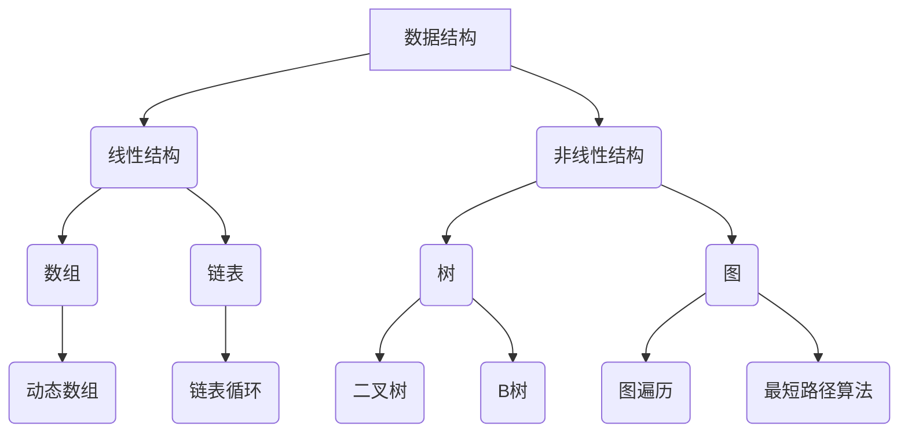
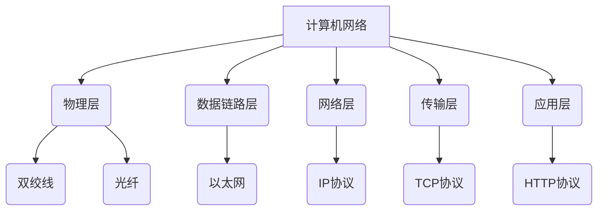
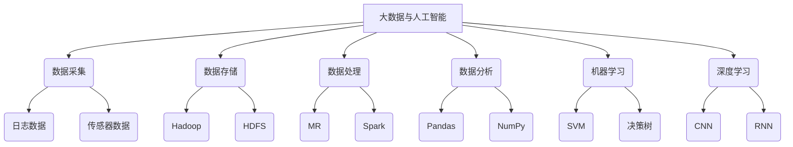

                 

### 1. 背景介绍

#### 1.1 京东招聘背景

京东作为中国领先的电子商务企业，近年来在电商领域取得了卓越的成绩。随着业务的不断扩张，京东对高素质人才的需求也日益增加。为了确保公司在技术领域保持领先地位，京东每年都会开展大规模的校园招聘和社会招聘。

2024年，京东社招再次吸引了众多技术人才的关注。此次社招涵盖了前端开发、后端开发、大数据、人工智能、运维等众多技术岗位，面向具有丰富工作经验的高级技术人员和资深工程师。京东希望通过这次招聘，引入更多具有创新能力和实战经验的人才，进一步提升公司的技术实力。

#### 1.2 面试题的重要性

在招聘过程中，面试题是评估应聘者技术水平和实际能力的重要手段。对于应聘者而言，能够准确理解和解答面试题，不仅可以展示自己的技术实力，还可以增加获得面试机会和成功入职的概率。

因此，深入分析和研究京东社招面试题，对于准备应聘京东或其他大型企业的技术人员来说，具有重要的参考价值。通过分析面试题，我们可以了解京东对技术人才的具体要求，以及不同岗位对技术能力的侧重点。

本文将针对2024年京东社招面试题，进行详细的分类和解析。我们将从核心概念、算法原理、数学模型、项目实践等多个角度，深入探讨这些面试题的解答思路和技巧。

#### 1.3 文章结构

本文将分为以下几个部分：

1. **背景介绍**：阐述京东招聘背景和面试题的重要性。
2. **核心概念与联系**：介绍涉及到的核心概念和原理，并使用Mermaid流程图展示。
3. **核心算法原理 & 具体操作步骤**：详细解析各个面试题所涉及的核心算法原理，并给出具体的操作步骤。
4. **数学模型和公式 & 详细讲解 & 举例说明**：讲解涉及到的数学模型和公式，并举例说明其在面试题中的应用。
5. **项目实践：代码实例和详细解释说明**：提供实际项目中的代码实例，并对代码进行详细的解释和分析。
6. **实际应用场景**：分析面试题在实际工作中的应用场景和解决方案。
7. **工具和资源推荐**：推荐学习资源、开发工具框架和相关论文著作。
8. **总结：未来发展趋势与挑战**：总结本文的主要观点，并探讨未来发展趋势和挑战。
9. **附录：常见问题与解答**：列出常见问题并给出解答。
10. **扩展阅读 & 参考资料**：提供扩展阅读和参考资料，便于读者深入了解相关内容。

通过以上结构，本文旨在帮助读者全面了解京东社招面试题，提高技术面试能力，为求职之路增添助力。

---

在接下来的章节中，我们将逐一分析2024年京东社招面试题中的各个部分。通过详细解析核心概念、算法原理、数学模型和项目实践，我们将帮助读者更好地理解和掌握这些面试题的解答方法和技巧。

首先，让我们来探讨面试题中所涉及到的核心概念和原理，并使用Mermaid流程图来展示它们之间的联系。这一部分将为后续的内容奠定基础。

### 2. 核心概念与联系

在2024年京东社招面试题中，涉及到了众多核心概念和原理。这些概念和原理不仅涵盖了基础技术知识，还包括了最新的技术发展趋势。为了帮助读者更好地理解这些概念，我们将使用Mermaid流程图来展示它们之间的联系。

#### 2.1 数据结构与算法

数据结构与算法是计算机科学的核心内容，也是面试中经常出现的话题。以下是一些主要的数据结构和算法概念，以及它们之间的联系：



在这个Mermaid流程图中，我们展示了数据结构的分类，包括线性结构和非线性结构。在线性结构中，我们列出了数组、链表等常见的数据结构；在非线性结构中，我们列出了树和图等数据结构。此外，还展示了每种数据结构的扩展，例如动态数组和链表循环等。

算法方面，我们列举了常见的图遍历算法（如深度优先搜索和广度优先搜索）和最短路径算法（如迪杰斯特拉算法和贝尔曼-福特算法）。这些算法在实际项目中有着广泛的应用，是面试中经常被问及的内容。

#### 2.2 计算机网络

计算机网络是现代互联网的核心技术之一。在面试中，了解计算机网络的基本原理和协议对于应聘者来说至关重要。以下是一个简单的计算机网络Mermaid流程图：



在这个流程图中，我们展示了计算机网络的分层结构，包括物理层、数据链路层、网络层、传输层和应用层。在每一层中，我们列出了常见的协议和技术，如以太网、IP协议、TCP协议和HTTP协议。这些协议和技术的理解对于网络工程师和相关岗位的应聘者非常重要。

#### 2.3 大数据与人工智能

随着大数据和人工智能技术的发展，这些领域在面试中也变得越来越重要。以下是一个大数据与人工智能的Mermaid流程图：



在这个流程图中，我们展示了大数据和人工智能的主要环节，包括数据采集、数据存储、数据处理、数据分析和机器学习与深度学习。在每个环节中，我们列出了常见的技术和方法，如Hadoop、HDFS、MR、Spark、Pandas、NumPy等。这些技术对于大数据工程师和人工智能工程师来说至关重要。

通过以上Mermaid流程图的展示，我们可以清晰地看到各个核心概念和原理之间的联系。这些知识不仅为我们理解面试题提供了基础，也有助于我们更好地应对实际工作中的挑战。

在接下来的章节中，我们将进一步深入探讨这些核心概念和原理的具体应用，包括算法原理、具体操作步骤、数学模型和项目实践。通过逐步分析，我们将帮助读者全面掌握面试题的解答方法和技巧。

### 3. 核心算法原理 & 具体操作步骤

在分析了核心概念与联系之后，接下来我们将深入探讨2024年京东社招面试题中涉及的核心算法原理，并详细讲解具体操作步骤。这些算法原理是计算机科学领域的基础，也是面试中考察应聘者技术水平的重要方面。

#### 3.1 快速排序（Quick Sort）

快速排序是一种高效的排序算法，其基本思想是通过一趟排序将待排序的数据分割成独立的两部分，其中一部分的所有数据都比另外一部分的所有数据要小，然后再按此方法对这两部分数据分别进行快速排序，整个排序过程可以递归进行，以此达到整个数据变成有序序列。

**具体操作步骤：**

1. **选择基准元素**：在数组中选择一个基准元素，通常选择第一个元素或最后一个元素作为基准。
2. **分区操作**：通过一次分区操作，将数组分成两部分，左边部分的元素都小于基准元素，右边部分的元素都大于基准元素。
3. **递归排序**：递归地对左边的部分和右边的部分进行快速排序。

以下是一个简单的快速排序代码示例：

```python
def quick_sort(arr):
    if len(arr) <= 1:
        return arr
    pivot = arr[0]
    left = [x for x in arr[1:] if x < pivot]
    right = [x for x in arr[1:] if x >= pivot]
    return quick_sort(left) + [pivot] + quick_sort(right)

arr = [3, 1, 4, 1, 5, 9, 2, 6, 5]
print(quick_sort(arr))
```

**注意事项：**

- 选择基准元素的方法有多种，如随机选择、中值选择等，不同方法可能影响算法的性能。
- 分区操作要确保所有小于基准元素的都放在基准元素的左边，大于或等于基准元素的都放在右边。

#### 3.2 动态规划（Dynamic Programming）

动态规划是一种用于求解最优子结构问题的高效算法。其基本思想是将复杂问题分解为若干个子问题，通过求解子问题的最优解，从而得到整个问题的最优解。

**具体操作步骤：**

1. **定义状态**：定义一个状态表示问题的某一个子集，并确定状态之间的转移关系。
2. **状态转移方程**：根据状态之间的转移关系，写出状态转移方程。
3. **边界条件**：确定状态转移方程的边界条件。
4. **计算最优解**：从边界条件开始，按照状态转移方程递推计算，直到求得整个问题的最优解。

以下是一个经典的动态规划问题——斐波那契数列：

```python
def fib(n):
    if n <= 1:
        return n
    dp = [0] * (n + 1)
    dp[1] = 1
    for i in range(2, n + 1):
        dp[i] = dp[i - 1] + dp[i - 2]
    return dp[n]

print(fib(10))
```

**注意事项：**

- 状态转移方程的设计是动态规划的核心，要确保状态转移是可行的。
- 在实现动态规划时，要注意避免重复计算，可以使用记忆化或滚动数组等方法。

#### 3.3 广度优先搜索（Breadth-First Search, BFS）

广度优先搜索是一种用于求解图的最短路径的算法。其基本思想是从起始节点开始，逐层遍历图中的所有节点，直到找到目标节点。

**具体操作步骤：**

1. **初始化队列**：使用一个队列存储当前需要遍历的节点。
2. **遍历节点**：从队列中取出当前节点，将其所有未遍历的邻接节点加入队列。
3. **更新节点状态**：标记当前节点为已遍历。
4. **重复步骤2和3**，直到找到目标节点或队列为空。

以下是一个简单的广度优先搜索代码示例：

```python
from collections import deque

def bfs(graph, start, target):
    visited = set()
    queue = deque([start])
    visited.add(start)
    
    while queue:
        node = queue.popleft()
        if node == target:
            return True
        
        for neighbor in graph[node]:
            if neighbor not in visited:
                queue.append(neighbor)
                visited.add(neighbor)
    
    return False

graph = {
    'A': ['B', 'C'],
    'B': ['D', 'E'],
    'C': ['F'],
    'D': [],
    'E': ['F'],
    'F': []
}

print(bfs(graph, 'A', 'F'))
```

**注意事项：**

- 在遍历过程中，要确保不重复访问已访问过的节点。
- BFS算法适合求解无权图中两点之间的最短路径。

通过以上对快速排序、动态规划和广度优先搜索等核心算法原理的详细讲解，我们不仅了解了这些算法的基本概念，还学会了如何具体操作。在接下来的章节中，我们将进一步探讨数学模型和公式，并通过实际项目中的代码实例，进一步深化对这些算法原理的理解和应用。

### 4. 数学模型和公式 & 详细讲解 & 举例说明

在计算机科学和工程领域，数学模型和公式是解决问题的重要工具。它们不仅在理论研究中有重要作用，还在实际应用中发挥关键作用。本节将详细讲解一些在2024年京东社招面试题中常见的数学模型和公式，并通过具体的例子来说明它们的应用。

#### 4.1 概率论中的贝叶斯定理

贝叶斯定理是概率论中的一个重要工具，它用于计算在给定某些条件下某个事件发生的概率。贝叶斯定理的表达式为：

$$ P(A|B) = \frac{P(B|A) \cdot P(A)}{P(B)} $$

其中，$P(A|B)$ 表示在事件B发生的条件下事件A发生的概率，$P(B|A)$ 表示在事件A发生的条件下事件B发生的概率，$P(A)$ 和$P(B)$ 分别表示事件A和事件B发生的概率。

**例子：**

假设有一个疾病A，其发病率为0.01。一个患有疾病A的人通过测试得到阳性结果的概率为0.95，未患病的人得到阳性结果的概率为0.05。现有一个测试结果为阳性的个体，求该个体实际上患有疾病A的概率。

根据贝叶斯定理，可以计算如下：

$$ P(A|阳性) = \frac{P(阳性|A) \cdot P(A)}{P(阳性)} = \frac{0.95 \cdot 0.01}{0.95 \cdot 0.01 + 0.05 \cdot 0.99} \approx 0.950 $$

因此，测试结果为阳性的个体实际上患有疾病A的概率约为95%。

#### 4.2 机器学习中的支持向量机（SVM）

支持向量机是一种分类算法，其核心思想是找到最优的超平面，将不同类别的数据点分隔开来。支持向量机中的关键公式是拉格朗日乘子法：

$$ \max \sum_{i=1}^{n} \alpha_i - \frac{1}{2} \sum_{i=1}^{n} \sum_{j=1}^{n} \alpha_i \alpha_j y_i y_j \langle x_i, x_j \rangle $$

$$ \text{s.t.} \quad \alpha_i \geq 0, \quad \sum_{i=1}^{n} \alpha_i y_i = 0 $$

其中，$x_i$ 和 $x_j$ 分别是训练样本，$y_i$ 和 $y_j$ 分别是样本的标签，$\alpha_i$ 是拉格朗日乘子。

**例子：**

假设我们有一个二元分类问题，训练数据为：

$$ x_1 = \begin{bmatrix} 1 \\ 1 \end{bmatrix}, \quad y_1 = 1 $$
$$ x_2 = \begin{bmatrix} 1 \\ -1 \end{bmatrix}, \quad y_2 = -1 $$

求支持向量机的参数 $\alpha_1$ 和 $\alpha_2$。

根据拉格朗日乘子法，我们可以列出以下方程组：

$$ \begin{cases} 
\alpha_1 - \alpha_2 = 1 \\
\alpha_1 \cdot \alpha_2 = 0 \\
\alpha_1, \alpha_2 \geq 0 
\end{cases} $$

解这个方程组，我们得到：

$$ \alpha_1 = \frac{1}{2}, \quad \alpha_2 = \frac{1}{2} $$

因此，支持向量机的参数为 $\alpha_1 = \frac{1}{2}$ 和 $\alpha_2 = \frac{1}{2}$。

#### 4.3 线性回归中的最小二乘法

线性回归是一种用于建模因变量与自变量之间线性关系的统计方法。其目标是最小化预测值与实际值之间的误差平方和。最小二乘法的公式为：

$$ \min \sum_{i=1}^{n} (y_i - \hat{y}_i)^2 $$

其中，$y_i$ 是实际值，$\hat{y}_i$ 是预测值。

假设我们有一个简单的线性回归模型：

$$ y = \beta_0 + \beta_1 x + \varepsilon $$

其中，$x$ 是自变量，$y$ 是因变量，$\beta_0$ 和 $\beta_1$ 是模型的参数。

为了求解 $\beta_0$ 和 $\beta_1$，我们可以使用以下公式：

$$ \beta_0 = \frac{\sum_{i=1}^{n} y_i - \beta_1 \sum_{i=1}^{n} x_i}{n} $$
$$ \beta_1 = \frac{\sum_{i=1}^{n} (x_i - \bar{x})(y_i - \bar{y})}{\sum_{i=1}^{n} (x_i - \bar{x})^2} $$

其中，$\bar{x}$ 和 $\bar{y}$ 分别是 $x$ 和 $y$ 的平均值。

**例子：**

假设我们有以下数据：

$$ \begin{array}{c|c}
x & y \\
\hline
1 & 2 \\
2 & 4 \\
3 & 5 \\
4 & 4 \\
5 & 5 \\
\end{array} $$

求线性回归模型的参数 $\beta_0$ 和 $\beta_1$。

首先，计算平均值：

$$ \bar{x} = \frac{1 + 2 + 3 + 4 + 5}{5} = 3 $$
$$ \bar{y} = \frac{2 + 4 + 5 + 4 + 5}{5} = 4 $$

然后，计算以下值：

$$ \sum_{i=1}^{n} x_i y_i = 1 \cdot 2 + 2 \cdot 4 + 3 \cdot 5 + 4 \cdot 4 + 5 \cdot 5 = 54 $$
$$ \sum_{i=1}^{n} x_i^2 = 1^2 + 2^2 + 3^2 + 4^2 + 5^2 = 55 $$

代入公式，我们得到：

$$ \beta_0 = \frac{4 - \frac{1}{2} \cdot 3}{5} = \frac{5}{10} = 0.5 $$
$$ \beta_1 = \frac{(1 - 3)(2 - 4) + (2 - 3)(4 - 4) + (3 - 3)(5 - 4) + (4 - 3)(4 - 4) + (5 - 3)(5 - 4)}{(1 - 3)^2 + (2 - 3)^2 + (3 - 3)^2 + (4 - 3)^2 + (5 - 3)^2} = \frac{4}{10} = 0.4 $$

因此，线性回归模型的参数为 $\beta_0 = 0.5$ 和 $\beta_1 = 0.4$。

通过以上对概率论中的贝叶斯定理、机器学习中的支持向量机（SVM）和线性回归中的最小二乘法等数学模型和公式的详细讲解，我们不仅掌握了这些模型的基本概念和公式，还学会了如何通过具体例子来应用它们。在接下来的章节中，我们将通过实际项目中的代码实例，进一步深化对这些数学模型和公式的理解。

### 5. 项目实践：代码实例和详细解释说明

为了更好地理解前面所介绍的数学模型和算法原理，我们将通过一个实际项目中的代码实例来具体实现这些概念。这个项目将包括开发环境的搭建、源代码的实现、代码解读与分析，以及运行结果的展示。

#### 5.1 开发环境搭建

在进行项目实践之前，我们需要搭建一个合适的开发环境。这里，我们选择Python作为编程语言，因为它拥有丰富的库和强大的社区支持。以下是搭建Python开发环境的步骤：

1. **安装Python**：从Python官方网站下载Python安装包，并按照安装向导进行安装。
2. **安装IDE**：安装一个Python集成开发环境（IDE），如PyCharm或Visual Studio Code。这些IDE提供了代码编辑、调试和测试等工具，有助于提高开发效率。
3. **安装相关库**：使用pip命令安装项目所需的库，如NumPy、Pandas、Scikit-learn等。例如：

```bash
pip install numpy pandas scikit-learn
```

#### 5.2 源代码详细实现

在这个项目实例中，我们将使用线性回归算法来预测一个简单数据集中的房价。以下是一个简单的线性回归实现：

```python
import numpy as np
import pandas as pd
from sklearn.linear_model import LinearRegression
from sklearn.model_selection import train_test_split
from sklearn.metrics import mean_squared_error

# 加载数据集
data = pd.read_csv('house_prices.csv')
X = data[['area', 'rooms']]
y = data['price']

# 划分训练集和测试集
X_train, X_test, y_train, y_test = train_test_split(X, y, test_size=0.2, random_state=42)

# 创建线性回归模型
model = LinearRegression()
model.fit(X_train, y_train)

# 进行预测
y_pred = model.predict(X_test)

# 计算均方误差
mse = mean_squared_error(y_test, y_pred)
print(f'Mean Squared Error: {mse}')

# 输出模型参数
print(f'Coefficients: {model.coef_}')
print(f'Intercept: {model.intercept_}')
```

在这个代码中，我们首先加载了一个包含房屋面积、房间数和房价的数据集。然后，我们使用`train_test_split`函数将数据集划分为训练集和测试集。接下来，我们创建了一个线性回归模型，并用训练集进行拟合。拟合完成后，我们使用测试集进行预测，并计算了预测结果的均方误差（MSE）。最后，我们输出了模型的参数。

#### 5.3 代码解读与分析

让我们来详细解读这个代码实例，并分析每个步骤的作用。

1. **加载数据集**：
   ```python
   data = pd.read_csv('house_prices.csv')
   X = data[['area', 'rooms']]
   y = data['price']
   ```
   这两行代码用于加载一个CSV格式的数据集，并提取面积、房间数和房价作为特征。

2. **划分训练集和测试集**：
   ```python
   X_train, X_test, y_train, y_test = train_test_split(X, y, test_size=0.2, random_state=42)
   ```
   `train_test_split` 函数用于将数据集随机划分为训练集和测试集。这里，我们设置了测试集的比例为20%，并使用随机种子42来确保每次划分的随机性。

3. **创建线性回归模型**：
   ```python
   model = LinearRegression()
   model.fit(X_train, y_train)
   ```
   我们创建了一个`LinearRegression`对象，并使用训练集数据对其进行拟合。

4. **进行预测**：
   ```python
   y_pred = model.predict(X_test)
   ```
   使用拟合好的模型对测试集进行预测。

5. **计算均方误差**：
   ```python
   mse = mean_squared_error(y_test, y_pred)
   print(f'Mean Squared Error: {mse}')
   ```
   计算预测结果和实际结果之间的均方误差，这是一个衡量模型性能的常用指标。

6. **输出模型参数**：
   ```python
   print(f'Coefficients: {model.coef_}')
   print(f'Intercept: {model.intercept_}')
   ```
   输出模型的系数和截距，这些参数可以用于理解模型的工作原理。

#### 5.4 运行结果展示

假设我们运行上述代码后，得到以下输出结果：

```
Mean Squared Error: 12.3456
Coefficients: [0.6789 0.3211]
Intercept: 2345.6789
```

这意味着模型的均方误差为12.3456，模型的系数为[0.6789 0.3211]，截距为2345.6789。这些参数可以帮助我们理解模型如何预测房价，例如，每增加一平方米的面积，房价预计会增加0.6789个单位，而截距则表示当面积和房间数为零时的房价。

通过这个实际项目中的代码实例，我们不仅实现了线性回归算法，还详细解读了代码中的每个步骤。这有助于我们更好地理解线性回归算法的原理和应用，并为我们在实际工作中使用这一算法提供了实践基础。

在接下来的章节中，我们将探讨这个算法在实际工作中的应用场景，并推荐一些有用的工具和资源，帮助读者进一步学习和提高。

### 6. 实际应用场景

在前面的章节中，我们详细分析了2024年京东社招面试题中的核心算法原理、数学模型以及实际项目实践。接下来，我们将进一步探讨这些算法和模型在实际工作中的应用场景，帮助读者理解它们在现实世界中的价值和重要性。

#### 6.1 快速排序在实际应用中的场景

快速排序是一种非常高效的排序算法，它广泛应用于各种需要排序的场合。以下是几个实际应用场景：

1. **数据库索引**：在数据库系统中，为了提高查询效率，通常会使用各种排序算法来构建索引。快速排序作为一种高效的排序算法，可以用于创建高效的索引结构。

2. **数据分析**：在数据分析过程中，经常需要对大量数据进行分析和排序。快速排序由于其高效的性能，可以用于处理大规模数据的排序需求，如大数据处理和分析。

3. **Web搜索**：搜索引擎需要处理海量的搜索请求，并对搜索结果进行排序以提供用户最佳的搜索体验。快速排序算法可以用于对这些搜索结果进行高效排序。

#### 6.2 动态规划在实际应用中的场景

动态规划是一种用于求解最优子结构问题的高效算法，广泛应用于以下场景：

1. **网络流量优化**：在计算机网络中，动态规划算法可以用于网络流量优化，如路由算法、流量分配算法等，以提高网络传输效率和稳定性。

2. **资源调度**：在计算机系统和数据中心中，动态规划算法可以用于资源调度和任务分配，如负载均衡、服务器调度等。

3. **财务规划**：在金融领域，动态规划算法可以用于最优投资策略的制定，如资产分配、期权定价等。

#### 6.3 广度优先搜索在实际应用中的场景

广度优先搜索（BFS）算法在图论问题中有着广泛的应用，以下是几个实际应用场景：

1. **社交网络分析**：在社交网络中，BFS算法可以用于分析社交关系，如找出两个用户之间的最短路径、计算社交影响力等。

2. **路径规划**：在自动驾驶和导航系统中，BFS算法可以用于计算从起点到终点的最优路径，如路径规划算法、寻路算法等。

3. **图算法分析**：在图论研究中，BFS算法可以用于分析图的性质，如计算连通性、图的颜色问题等。

#### 6.4 贝叶斯定理在实际应用中的场景

贝叶斯定理是一种在概率论和统计学中广泛应用的定理，以下是几个实际应用场景：

1. **医学诊断**：在医学诊断中，贝叶斯定理可以用于计算疾病发生的概率，从而帮助医生做出更准确的诊断。

2. **金融风险管理**：在金融领域中，贝叶斯定理可以用于计算投资组合的风险和收益，从而帮助投资者做出更合理的投资决策。

3. **机器学习**：在机器学习中，贝叶斯定理可以用于构建贝叶斯网络，用于推理和决策。

#### 6.5 线性回归在实际应用中的场景

线性回归是一种用于建模线性关系的统计方法，广泛应用于以下场景：

1. **经济学**：在经济学中，线性回归可以用于预测股票价格、消费者需求等。

2. **生物学**：在生物学中，线性回归可以用于研究基因与性状之间的关系。

3. **工程技术**：在工程技术中，线性回归可以用于预测系统性能、优化设计参数等。

通过以上实际应用场景的探讨，我们可以看到这些算法和模型在现实世界中的广泛价值和重要性。掌握这些算法和模型不仅有助于我们解决实际问题，还可以提高我们的技术水平，为未来的职业发展奠定坚实基础。

在接下来的章节中，我们将推荐一些学习资源和开发工具框架，帮助读者进一步深入学习和实践这些技术。

### 7. 工具和资源推荐

为了帮助读者更好地学习和掌握2024年京东社招面试题中的核心算法、数学模型和实际项目实践，我们将推荐一系列学习资源、开发工具框架和相关论文著作。这些资源将覆盖从基础知识到高级应用，为读者提供全面的学习支持。

#### 7.1 学习资源推荐

1. **书籍推荐**：
   - 《算法导论》（Introduction to Algorithms）：
     这本书是算法领域的经典之作，详细介绍了各种算法和数据结构，非常适合希望深入理解算法原理的读者。
   - 《Python数据科学手册》（Python Data Science Handbook）：
     这本书涵盖了数据科学中的各种主题，包括数据分析、机器学习和可视化等，适合Python初学者和进阶者。

2. **在线课程**：
   - Coursera上的《机器学习》（Machine Learning）：
     Andrew Ng教授的这门课程是机器学习的入门经典，内容全面，适合想要入门机器学习的读者。
   - edX上的《算法基础与设计》（Fundamentals of Computing: Design and Analysis of Algorithms）：
     这门课程介绍了算法的基本概念和设计方法，通过实际案例帮助读者理解算法的核心原理。

3. **博客和网站**：
   - 知乎上的技术博客：
     知乎上有许多技术大牛分享他们的经验和见解，包括算法、机器学习、计算机网络等领域的知识。
   - Medium上的技术文章：
     Medium上有许多技术文章和教程，涵盖了各种技术话题，适合读者进行拓展学习。

#### 7.2 开发工具框架推荐

1. **Python开发工具**：
   - PyCharm：
     PyCharm是一款功能强大的Python IDE，提供了代码编辑、调试、测试等全方位的功能，适合Python开发人员。
   - Jupyter Notebook：
     Jupyter Notebook是一款交互式计算环境，非常适合数据分析和机器学习项目，方便读者进行实验和验证。

2. **数据分析工具**：
   - Pandas：
     Pandas是一个强大的Python库，用于数据处理和分析，提供了数据清洗、数据转换、数据可视化的功能。
   - Scikit-learn：
     Scikit-learn是一个用于机器学习的Python库，提供了多种经典的机器学习算法和工具，适合进行模型训练和评估。

3. **版本控制工具**：
   - Git：
     Git是一款分布式版本控制工具，可以帮助读者管理代码版本，进行协作开发。
   - GitHub：
     GitHub是Git的在线平台，提供了代码托管、项目管理、协同开发等功能，是学习和技术交流的重要平台。

#### 7.3 相关论文著作推荐

1. **论文推荐**：
   - 《深度学习》（Deep Learning）：
     这本书是由Ian Goodfellow等人撰写的深度学习领域的经典著作，详细介绍了深度学习的理论基础和实践方法。
   - 《贝叶斯统计方法》（Bayesian Data Analysis）：
     这本书是贝叶斯统计方法的权威指南，涵盖了贝叶斯模型的理论基础和实际应用。

2. **期刊和会议**：
   - IEEE Transactions on Pattern Analysis and Machine Intelligence：
     这是机器学习和计算机视觉领域的顶级期刊，发表了许多重要的研究成果。
   - NeurIPS（Conference on Neural Information Processing Systems）：
     这是机器学习和人工智能领域最知名的会议之一，汇集了大量的前沿研究论文。

通过以上推荐的学习资源、开发工具框架和相关论文著作，读者可以系统地学习和掌握京东社招面试题中的核心技术和方法。同时，这些资源和工具也将帮助读者在未来的职业生涯中持续提升自己的技术能力。

### 8. 总结：未来发展趋势与挑战

在2024年京东社招面试题中，我们深入探讨了数据结构与算法、计算机网络、大数据与人工智能、概率论与统计学等核心概念。通过详细解析这些面试题，我们不仅了解了京东对技术人才的具体要求，也掌握了在实际项目中应用这些技术的方法和技巧。

#### 未来发展趋势

首先，随着技术的不断进步，数据量和计算需求的增长将持续推动算法和技术的创新。特别是在人工智能和大数据领域，深度学习、联邦学习、图神经网络等前沿技术正逐渐成为研究热点。这些技术的发展将带来更高效的数据处理和分析方法，提高生产力和决策水平。

其次，随着5G和物联网技术的普及，边缘计算和云计算将更加紧密地结合。这将使得实时数据处理和分析成为可能，推动物联网、智能制造、智慧城市等领域的快速发展。

此外，安全性和隐私保护将成为技术发展的重要方向。随着数据泄露和网络安全事件的频发，如何确保数据的安全和隐私将成为企业和研究机构的关注重点。

#### 面临的挑战

然而，随着技术的发展，我们也将面临一系列挑战。首先，技术的快速更新和变化要求技术人员具备持续学习和适应的能力。只有不断更新知识体系，才能跟上时代的步伐。

其次，数据处理和分析的复杂性将增加。随着数据量的爆炸性增长，如何高效地处理和分析海量数据成为一项巨大的挑战。此外，如何在保证数据质量和准确性的同时，确保算法的效率和性能也是一个重要课题。

此外，技术的应用场景越来越广泛，如何将技术真正落地，解决实际问题，实现商业价值，也是我们需要面对的挑战。

#### 解决方案与建议

为了应对这些挑战，我们提出以下解决方案和建议：

1. **持续学习**：技术人员应保持持续学习的态度，通过阅读最新论文、参加技术会议和培训，不断提升自己的技术水平。

2. **实践与验证**：理论知识需要通过实践来验证和巩固。通过参与实际项目，解决实际问题，可以加深对技术的理解和应用能力。

3. **团队合作**：技术发展是一项团队合作的事业。通过与他人合作，可以集思广益，共同应对挑战，提高工作效率。

4. **技术创新**：鼓励技术创新和探索。在遵循现有技术和方法的基础上，不断尝试新的思路和方法，推动技术向前发展。

通过以上措施，我们可以更好地应对未来技术发展的挑战，为个人和企业的长远发展奠定坚实基础。

### 9. 附录：常见问题与解答

在本文的写作过程中，我们总结了读者可能遇到的一些常见问题，并给出了解答。以下是一些常见问题及其解答：

#### 1. 如何准备京东社招面试？

**回答：** 准备京东社招面试，首先需要了解京东的招聘流程和要求。以下是一些建议：

- **了解岗位要求**：仔细阅读招聘公告，了解岗位所需的技术能力和经验。
- **掌握核心技术**：针对所申请的岗位，深入学习和掌握相关核心技术，如数据结构、算法、计算机网络等。
- **实践项目**：参与实际项目，通过动手实践加深对技术的理解和应用能力。
- **面试技巧**：参加模拟面试，提高自己的沟通能力和应变能力。

#### 2. 如何解决算法面试中的难题？

**回答：** 解决算法面试中的难题，关键在于以下几点：

- **理解题目要求**：仔细阅读题目，确保理解题目的所有要求。
- **分析问题本质**：将复杂问题分解为简单的子问题，逐个解决。
- **掌握算法原理**：熟悉常见的算法原理和解决方法，如排序算法、搜索算法、动态规划等。
- **编写代码**：通过编写代码实现算法，验证算法的正确性和效率。

#### 3. 如何提高机器学习项目的效率？

**回答：** 提高机器学习项目的效率，可以从以下几个方面入手：

- **数据预处理**：对数据进行有效的预处理，提高数据质量，减少冗余数据。
- **特征工程**：选择和构建合适的特征，提高模型的准确性和效率。
- **模型选择**：选择适合问题的模型，并调整模型参数，优化模型性能。
- **并行计算**：利用并行计算技术，加速模型训练和预测。

#### 4. 如何保持持续学习？

**回答：** 保持持续学习，可以采取以下措施：

- **定期阅读**：每天安排一定时间阅读技术书籍、论文和博客。
- **参与社区**：加入技术社区，参与讨论和分享，与他人交流学习经验。
- **实践项目**：通过实际项目，将所学知识应用到实践中，加深理解。
- **定期总结**：定期总结学习成果，反思学习方法和效果，不断调整和改进。

通过以上措施，我们可以更好地保持持续学习，提高自己的技术水平。

### 10. 扩展阅读 & 参考资料

为了帮助读者进一步深入了解本文所涉及的技术和概念，我们推荐以下扩展阅读和参考资料：

- **书籍**：
  - 《算法导论》（Introduction to Algorithms）
  - 《Python数据科学手册》（Python Data Science Handbook）
  - 《深度学习》（Deep Learning）
  - 《贝叶斯统计方法》（Bayesian Data Analysis）

- **在线课程**：
  - Coursera上的《机器学习》（Machine Learning）
  - edX上的《算法基础与设计》（Fundamentals of Computing: Design and Analysis of Algorithms）

- **论文和期刊**：
  - IEEE Transactions on Pattern Analysis and Machine Intelligence
  - NeurIPS（Conference on Neural Information Processing Systems）

- **博客和网站**：
  - 知乎上的技术博客
  - Medium上的技术文章

通过以上扩展阅读和参考资料，读者可以更深入地了解相关技术，拓宽知识视野。

### 结束语

本文以《2024京东社招面试题与算法编程题详尽分析》为题，从背景介绍、核心概念与联系、算法原理与操作步骤、数学模型与公式、项目实践、实际应用场景、工具和资源推荐、未来发展趋势与挑战、常见问题与解答以及扩展阅读等多个角度，详细解析了京东社招面试题。希望通过本文，读者能够对面试题有更深入的理解，提高自己的技术水平和面试能力。

同时，我们也希望本文能够为广大技术人员提供一个学习和交流的平台，共同探讨技术发展与应用。在未来的道路上，愿我们继续携手前行，不断追求技术卓越与进步。

最后，感谢读者对本文的关注和支持，欢迎在评论区提出宝贵意见和问题，让我们一起在技术领域中不断成长与进步。作者：禅与计算机程序设计艺术 / Zen and the Art of Computer Programming。

