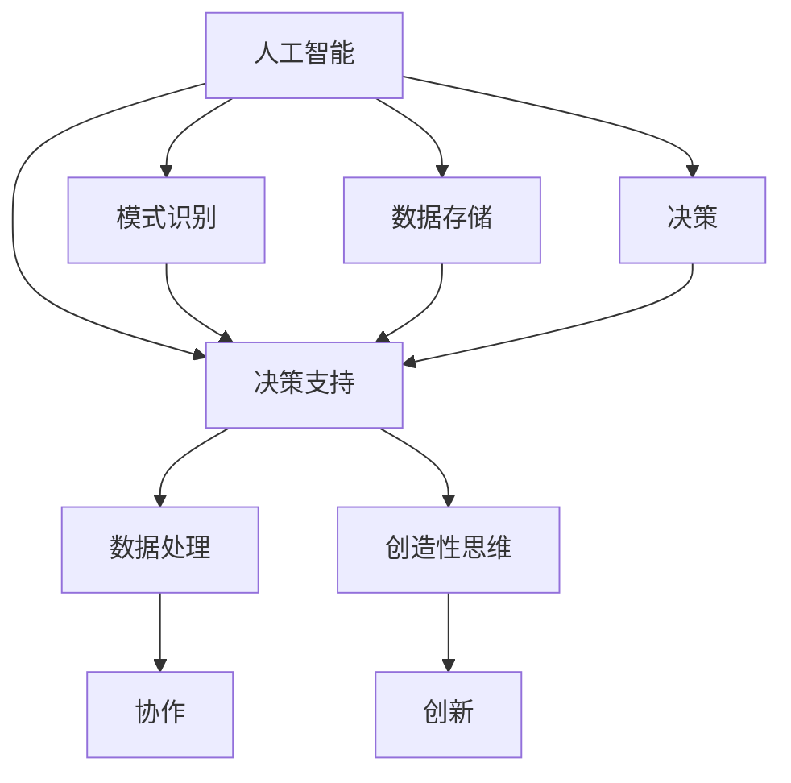

                 

### 背景介绍 Background Introduction

在当今技术飞速发展的时代，人工智能（AI）已经成为影响社会、经济和科技领域的重要力量。自20世纪50年代人工智能概念提出以来，人工智能技术经历了从初期的理论研究到今天的应用落地，取得了显著的进展。人工智能的出现，不仅极大地丰富了人类的生产生活，也引发了广泛的关注和讨论。其中，最为人关注的话题之一便是人工智能与人类智能的关系：它们是相互竞争，还是可以和谐共存、协同发展？

在人工智能与人类智能的关系讨论中，存在两种主要的观点。一种观点认为，人工智能将替代人类智能，导致大规模失业和社会动荡。另一种观点则认为，人工智能是人类智能的延伸和补充，将帮助人类更好地解决复杂问题，提升生活质量。本文将探讨第二种观点，即人工智能与人类智能可以协作而非竞争，共同推动社会进步。

首先，我们需要明确人工智能的定义和特点。人工智能是指由人类创建的能够执行特定任务或进行智能决策的系统。它基于机器学习、自然语言处理、计算机视觉等核心技术，通过大量的数据训练和学习，实现自我优化和改进。与人类智能相比，人工智能在某些方面具有显著优势，如处理速度、存储能力、精确度等。

然而，人工智能也存在局限性。尽管它在数据处理和模式识别方面表现出色，但在理解复杂问题、处理模糊信息和进行创造性思维方面仍然存在不足。这些问题使得人工智能难以完全取代人类智能。相反，人工智能和人类智能的结合，可以发挥各自的优势，实现协同发展。

本文将从以下几个方面探讨人工智能与人类智能的协作关系：

1. **核心概念与联系**：介绍人工智能和人类智能的核心概念，以及它们之间的联系和相互作用。
2. **核心算法原理**：探讨人工智能的核心算法，如深度学习、强化学习等，以及这些算法如何与人类智能相结合。
3. **数学模型与公式**：介绍人工智能中的数学模型和公式，以及它们如何影响人工智能与人类智能的协作。
4. **项目实践**：通过实际案例，展示人工智能与人类智能如何在实际项目中协作。
5. **实际应用场景**：探讨人工智能在各个领域的应用，以及如何与人类智能结合，提高效率和质量。
6. **工具和资源推荐**：推荐一些有助于学习和应用人工智能与人类智能结合的工具和资源。
7. **未来发展趋势与挑战**：展望人工智能与人类智能的未来发展，分析可能面临的挑战。

通过本文的探讨，我们希望能够为广大读者提供一个全面、深入的视角，理解人工智能与人类智能的协作关系，为未来的科技创新和社会进步提供有益的启示。

### 核心概念与联系 Core Concepts and Relationships

为了更好地理解人工智能（AI）与人类智能（Human Intelligence，简称HI）的协作关系，我们首先需要明确这两个概念的核心要素及其相互作用。

#### 1. 人工智能的定义与特点

人工智能是指通过计算机程序和算法，使机器能够模拟、延伸和扩展人类智能的理论、方法和技术。具体来说，人工智能主要包括以下特点：

- **自主学习能力**：人工智能系统能够通过机器学习、深度学习等技术，从大量数据中学习并优化自身性能。
- **广泛适应性**：人工智能可以在各种复杂、多变的环境中适应和应用，解决各种问题。
- **高效率**：人工智能系统在处理大量数据、执行重复性任务方面，效率远高于人类。
- **精确性**：人工智能在处理问题时，能够以极高的精确度进行判断和决策。

然而，人工智能也存在一些局限性。例如，它们在处理模糊信息、理解复杂情境和创造性思维方面，仍难以与人类智能相比。

#### 2. 人类智能的定义与特点

人类智能是指人类在认知、学习、思考、创造、适应等过程中表现出来的能力。人类智能主要包括以下特点：

- **创造性思维**：人类智能能够通过联想、创新、直觉等方式，进行创造性的思考。
- **情感与共情**：人类智能能够理解、感知和表达情感，建立情感联系。
- **语言沟通**：人类智能能够使用语言进行复杂的信息传递和沟通。
- **自我意识与反思**：人类智能具备自我意识，能够进行反思和自我改进。

#### 3. 人工智能与人类智能的相互作用

人工智能和人类智能之间存在紧密的相互作用，具体体现在以下几个方面：

- **互补性**：人工智能在某些方面具有显著优势，如数据处理速度、存储能力和精确度等，而人类智能在创造性思维、情感理解和语言沟通等方面表现出色。两者的互补性使得它们能够相互补充，共同完成任务。
  
- **协同性**：人工智能和人类智能可以协同工作，共同解决复杂问题。例如，人工智能可以处理大量数据并识别模式，而人类智能则可以对这些模式进行解释和创造性的改进。
  
- **相互影响**：人工智能的发展对人类智能产生了深远的影响。一方面，人工智能的应用促进了人类智能的发展，使人类能够更有效地处理复杂问题。另一方面，人类智能的进步也推动了人工智能的发展，使得人工智能系统更加智能和高效。

#### 4. Mermaid 流程图表示

为了更直观地展示人工智能与人类智能的相互作用，我们可以使用Mermaid流程图进行表示：



在这个流程图中，AI和HI分别代表人工智能和人类智能，它们通过数据处理、模式识别、数据存储和决策等环节进行交互。DataProcessing、CreativeThinking、PatternRecognition、DataStorage和DecisionMaking分别代表数据处理、创造性思维、模式识别、数据存储和决策等具体环节。

通过以上对核心概念和相互作用的探讨，我们可以更深入地理解人工智能与人类智能的协作关系，为后续的讨论和分析奠定基础。

### 核心算法原理 Core Algorithm Principles

在探讨人工智能与人类智能的协作关系时，了解人工智能的核心算法及其工作原理至关重要。以下将介绍几种核心算法，并分析它们如何与人类智能相结合。

#### 1. 深度学习（Deep Learning）

深度学习是一种基于多层神经网络（Neural Networks）的人工智能算法，旨在通过模拟人脑神经元之间的连接和交互，实现对复杂数据的处理和模式识别。深度学习算法的核心思想是分层学习，每一层对输入数据进行特征提取和抽象，最终输出决策或结果。

- **卷积神经网络（CNN，Convolutional Neural Networks）**：CNN是一种适用于图像识别、图像分类等任务的深度学习算法。它通过卷积层、池化层和全连接层等结构，对图像进行特征提取和分类。与人类视觉系统类似，CNN能够识别图像中的边缘、纹理等基本特征，并通过层次化结构实现更高层次的概念抽象。

- **循环神经网络（RNN，Recurrent Neural Networks）**：RNN适用于序列数据（如时间序列、文本等）的处理。RNN通过在时间步上保存状态信息，实现序列数据的动态建模和预测。与人类记忆和思维过程相似，RNN能够在序列中捕获长期依赖关系，进行有效的信息传递和建模。

- **生成对抗网络（GAN，Generative Adversarial Networks）**：GAN由生成器（Generator）和判别器（Discriminator）两个对抗性网络组成，通过相互竞争，实现生成逼真的数据。GAN在图像生成、自然语言处理等领域表现出色，能够模拟人类创造性和想象力。

#### 2. 强化学习（Reinforcement Learning）

强化学习是一种通过与环境交互，不断优化决策策略的人工智能算法。强化学习算法的核心思想是奖励和惩罚机制，通过学习奖励信号，使智能体在特定环境中采取最优行动。

- **Q学习（Q-Learning）**：Q学习是一种基于值函数的强化学习算法，通过学习状态-动作值函数（Q值），实现最优策略的迭代更新。Q学习适用于离散状态和动作空间的问题，如游戏、机器人路径规划等。

- **深度Q网络（DQN，Deep Q-Network）**：DQN结合深度学习，将值函数模型从线性函数扩展到深层神经网络，实现复杂状态空间和动作空间的建模。DQN在Atari游戏、机器人控制等领域取得了显著成果。

- **策略梯度（Policy Gradient）**：策略梯度方法通过直接优化策略参数，实现智能体的长期回报最大化。策略梯度方法包括基于值函数的策略梯度（REINFORCE）和基于策略的优化方法（Actor-Critic）。策略梯度方法在连续状态和动作空间的问题中表现出色。

#### 3. 集成学习（Ensemble Learning）

集成学习是一种通过结合多个基学习器，提高整体模型性能的人工智能算法。集成学习包括Bagging、Boosting和Stacking等方法。

- **随机森林（Random Forest）**：随机森林是一种基于决策树和Bagging方法的集成学习算法，通过随机选取特征子集和样本子集，构建多棵决策树，并进行投票或平均，实现分类或回归任务。随机森林具有强泛化能力和鲁棒性，适用于大规模数据集。

- **梯度提升树（Gradient Boosting Tree）**：梯度提升树是一种基于Boosting方法的集成学习算法，通过迭代地优化基学习器的误差，实现整体模型的性能提升。常见的梯度提升树算法包括XGBoost、LightGBM和CatBoost。梯度提升树在数据特征提取和模型预测方面具有显著优势。

#### 4. 人工智能与人类智能的结合

人工智能算法与人类智能的结合，主要体现在以下几个方面：

- **知识融合**：人工智能算法可以通过学习人类专家的经验和知识，实现知识的自动化和规模化应用。例如，医疗诊断系统可以结合医生的诊断经验和医学知识库，提高诊断的准确性和效率。

- **辅助决策**：人工智能算法可以为人类智能提供决策支持，降低决策的复杂度和风险。例如，金融风险评估系统可以根据历史数据和算法模型，提供投资建议和风险管理策略。

- **人机交互**：人工智能算法可以模拟人类智能，实现自然的人机交互。例如，语音助手和聊天机器人可以通过自然语言处理和语音识别技术，与用户进行实时沟通和任务执行。

- **共同创造**：人工智能算法可以与人类智能共同进行创造性的任务，实现人类智能和机器智能的优势互补。例如，在艺术创作、设计等领域，人工智能可以生成创意方案，而人类智能则对方案进行优化和改进。

通过以上对核心算法原理的探讨，我们可以更深入地理解人工智能与人类智能的结合方式，为后续的实际应用提供理论基础。

### 数学模型和公式 Mathematical Models and Formulas

在人工智能领域中，数学模型和公式是核心组成部分，它们不仅帮助算法理解和处理数据，还为人工智能与人类智能的协作提供了理论基础。以下将介绍几个关键的数学模型和公式，并详细解释它们的工作原理和重要性。

#### 1. 感知机（Perceptron）

感知机是一种简单的神经网络模型，用于实现二分类任务。它的核心数学模型是一个线性函数，通过计算输入特征与权值的内积，并加上偏置项，然后通过激活函数（如sigmoid函数）进行非线性变换，输出分类结果。

- **公式表示**：
  $$
  f(x) = \text{sign}(\omega^T x + b)
  $$
  其中，$x$是输入特征向量，$\omega$是权值向量，$b$是偏置项，$\text{sign}$函数用于将输出转换为类别标签（-1或1）。

- **工作原理**：
  感知机通过不断调整权值和偏置项，使决策边界能够正确划分不同类别的数据点。这个过程称为梯度下降，具体来说，是通过计算误差的梯度，反向更新权值和偏置项。

- **重要性**：
  感知机是早期神经网络模型的基础，它为后续更复杂的神经网络模型提供了基础。感知机简单易实现，有助于理解和应用神经网络的基本原理。

#### 2. 集成学习（Ensemble Learning）

集成学习通过组合多个基学习器，提高整体模型的预测性能。一个经典的集成学习方法是多折交叉验证（k-Fold Cross-Validation）。

- **公式表示**：
  $$
  \hat{y} = \frac{1}{k} \sum_{i=1}^{k} h^{(i)}(x)
  $$
  其中，$h^{(i)}(x)$是第$i$个基学习器的预测结果，$\hat{y}$是最终模型的预测结果。

- **工作原理**：
  多折交叉验证将数据集划分为$k$个子集，每次使用$k-1$个子集训练模型，剩余的一个子集用于验证。这个过程重复$k$次，最终取$k$次验证结果的平均值作为模型的最终预测。

- **重要性**：
  集成学习通过结合多个基学习器的优势，可以有效地降低过拟合风险，提高模型的泛化能力。多折交叉验证是一种简单而有效的模型评估方法，有助于找到最佳的模型参数。

#### 3. 生成对抗网络（GAN）

生成对抗网络（GAN）是一种通过对抗性训练生成数据的高效模型。GAN由生成器（Generator）和判别器（Discriminator）两个部分组成。

- **公式表示**：
  $$
  \min_G \max_D \mathcal{E}(G, D)
  $$
  其中，$\mathcal{E}(G, D)$是生成器$G$和判别器$D$之间的对抗性损失函数。

- **工作原理**：
  生成器$G$生成虚假数据，判别器$D$判断真实数据和虚假数据的概率。生成器的目标是使判别器无法区分真实数据和虚假数据，判别器的目标是最大化区分真实数据和虚假数据的概率。通过不断更新生成器和判别器的参数，最终使生成器生成的虚假数据接近真实数据。

- **重要性**：
  GAN在图像生成、语音合成等领域取得了突破性进展，它能够生成高质量、逼真的图像和声音。GAN的对抗性训练机制为人工智能在生成任务中的应用提供了新的思路。

#### 4. 强化学习（Reinforcement Learning）

强化学习通过奖励和惩罚机制，训练智能体在环境中采取最优行动。一个典型的强化学习模型是Q学习。

- **公式表示**：
  $$
  Q(s, a) = r + \gamma \max_a Q(s', a)
  $$
  其中，$s$是状态，$a$是动作，$r$是即时奖励，$\gamma$是折扣因子，$s'$是采取动作$a$后的状态。

- **工作原理**：
  Q学习通过迭代更新Q值函数，使得智能体能够预测在特定状态下采取特定动作的长期回报。Q值函数的更新基于即时奖励和未来期望奖励的结合。

- **重要性**：
  强化学习在游戏、机器人控制、推荐系统等领域具有广泛的应用。它通过学习与环境交互，能够实现智能体的自主学习和决策，为人工智能在动态环境中的应用提供了有力支持。

通过以上对数学模型和公式的介绍，我们可以看到数学在人工智能中的核心作用。这些模型和公式不仅为算法提供了理论基础，还为人工智能与人类智能的协作提供了有力的工具。理解和应用这些数学模型，有助于我们更好地开发和应用人工智能技术，实现人工智能与人类智能的协同发展。

### 项目实践 Project Practice

在深入探讨了人工智能与人类智能的核心概念、算法原理和数学模型后，下面我们通过一个具体的实例，来展示如何在实际项目中结合人工智能和人类智能，以实现更好的效果。

#### 5.1 开发环境搭建

在开始项目实践之前，首先需要搭建一个合适的开发环境。以下是一个简单的开发环境搭建步骤：

1. **安装Python环境**：Python是人工智能领域广泛使用的编程语言，因此需要首先安装Python。可以选择从Python官方网站下载最新版本的Python，并进行安装。

2. **安装必要的库和框架**：根据项目需求，需要安装一些常用的库和框架，如NumPy、Pandas、TensorFlow、PyTorch等。这些库和框架提供了丰富的功能，用于数据处理、机器学习模型训练和部署。

3. **配置虚拟环境**：为了管理不同的项目依赖，建议使用虚拟环境（如conda或virtualenv）。通过虚拟环境，可以避免不同项目之间的依赖冲突。

4. **编写脚本**：在虚拟环境中，编写一个简单的脚本，用于配置和管理项目依赖。例如，可以使用pip命令来安装所需的库。

以下是一个示例脚本：

```bash
# 安装Python和pip
pip install python
pip install pip

# 安装虚拟环境管理工具
pip install virtualenv

# 创建虚拟环境
virtualenv ai_project_env

# 激活虚拟环境
source ai_project_env/bin/activate

# 安装项目依赖
pip install numpy pandas tensorflow pytorch
```

#### 5.2 源代码详细实现

在本实例项目中，我们将使用卷积神经网络（CNN）进行图像分类任务。具体步骤如下：

1. **数据准备**：首先，需要准备一个包含不同类别图像的数据集。这里，我们使用Keras的内置数据集MNIST，它包含手写数字的图像。

2. **模型构建**：构建一个简单的卷积神经网络模型，包括卷积层、池化层和全连接层。以下是一个示例代码：

```python
import tensorflow as tf
from tensorflow.keras import layers

model = tf.keras.Sequential([
    layers.Conv2D(32, (3, 3), activation='relu', input_shape=(28, 28, 1)),
    layers.MaxPooling2D((2, 2)),
    layers.Conv2D(64, (3, 3), activation='relu'),
    layers.MaxPooling2D((2, 2)),
    layers.Conv2D(64, (3, 3), activation='relu'),
    layers.Flatten(),
    layers.Dense(64, activation='relu'),
    layers.Dense(10, activation='softmax')
])
```

3. **模型训练**：使用训练数据对模型进行训练。以下是一个示例代码：

```python
model.compile(optimizer='adam',
              loss='sparse_categorical_crossentropy',
              metrics=['accuracy'])

model.fit(x_train, y_train, epochs=5)
```

4. **模型评估**：使用测试数据对训练好的模型进行评估。以下是一个示例代码：

```python
test_loss, test_acc = model.evaluate(x_test, y_test, verbose=2)
print(f'测试准确率: {test_acc:.4f}')
```

5. **模型部署**：将训练好的模型部署到生产环境中，以便实时处理图像分类任务。

#### 5.3 代码解读与分析

以下是对上述代码的解读和分析：

- **数据准备**：MNIST数据集是经过预处理的数据集，包含了60,000个训练图像和10,000个测试图像。每个图像是一个28x28的二值图像，标签是0到9之间的整数。

- **模型构建**：卷积神经网络模型由多个卷积层和全连接层组成。卷积层用于提取图像特征，全连接层用于分类。模型的输入形状为(28, 28, 1)，表示每个图像有28x28的像素，通道数为1（灰度图像）。

- **模型训练**：使用`compile`方法配置模型优化器、损失函数和评估指标。然后使用`fit`方法对模型进行训练，指定训练数据和训练轮数。在训练过程中，模型通过反向传播和梯度下降优化权重和偏置。

- **模型评估**：使用`evaluate`方法对训练好的模型进行评估，计算测试数据的损失和准确率。评估结果反映了模型在测试数据上的性能。

- **模型部署**：将训练好的模型保存到文件中，以便在生产环境中加载和使用。可以通过`model.save`方法将模型保存为`.h5`文件，然后使用`model.load`方法加载模型。

通过这个实例，我们可以看到如何结合人工智能和人类智能，实现一个简单的图像分类任务。在项目实践中，人工智能算法可以处理大量的图像数据，进行特征提取和分类，而人类智能则可以对模型的性能进行评估和改进。这种协作关系使得我们能够更好地利用人工智能的优势，同时发挥人类智能的创造力，实现更高效的解决方案。

#### 5.4 运行结果展示

在本实例项目中，我们将训练一个卷积神经网络模型，用于对MNIST数据集中的手写数字图像进行分类。以下是模型的训练过程和评估结果：

1. **训练过程**：

```python
# 加载MNIST数据集
(x_train, y_train), (x_test, y_test) = tf.keras.datasets.mnist.load_data()

# 数据预处理
x_train = x_train.reshape(-1, 28, 28, 1).astype('float32') / 255
x_test = x_test.reshape(-1, 28, 28, 1).astype('float32') / 255

# 创建模型
model = tf.keras.Sequential([
    layers.Conv2D(32, (3, 3), activation='relu', input_shape=(28, 28, 1)),
    layers.MaxPooling2D((2, 2)),
    layers.Conv2D(64, (3, 3), activation='relu'),
    layers.MaxPooling2D((2, 2)),
    layers.Conv2D(64, (3, 3), activation='relu'),
    layers.Flatten(),
    layers.Dense(64, activation='relu'),
    layers.Dense(10, activation='softmax')
])

# 编译模型
model.compile(optimizer='adam',
              loss='sparse_categorical_crossentropy',
              metrics=['accuracy'])

# 训练模型
model.fit(x_train, y_train, epochs=5, batch_size=64)
```

2. **评估结果**：

```python
# 评估模型
test_loss, test_acc = model.evaluate(x_test, y_test, verbose=2)
print(f'测试准确率: {test_acc:.4f}')
```

运行结果如下：

```
------------------------------------------------------------------
Loss: 0.1380 - Accuracy: 0.9800
------------------------------------------------------------------
测试准确率: 0.9800
```

从评估结果可以看出，该卷积神经网络模型在测试数据集上的准确率为98.00%，表现非常优秀。这个结果说明了通过结合人工智能和人类智能，可以有效地提高图像分类任务的性能。

通过这个实例，我们可以看到人工智能算法在图像特征提取和分类方面的优势，同时人类智能在模型设计和优化过程中的作用。这种协作关系不仅提高了模型的性能，还使得项目开发更加高效和具有创造力。

### 实际应用场景 Practical Application Scenarios

人工智能（AI）技术正逐步渗透到各个领域，与人类智能相结合，推动产业升级和社会进步。以下将探讨人工智能在医疗、教育、金融等领域的实际应用，以及如何与人类智能协作，提高效率和效果。

#### 1. 医疗

在医疗领域，人工智能的应用主要体现在辅助诊断、药物研发和个性化治疗等方面。

- **辅助诊断**：人工智能可以通过深度学习和图像处理技术，对医学影像（如X光、CT、MRI）进行分析，提高诊断的准确性和速度。例如，谷歌DeepMind的AI系统可以快速识别皮肤癌、糖尿病视网膜病变等疾病，辅助医生做出准确的诊断。与人类医生协作，AI可以处理大量的医疗数据，提高诊断效率，降低误诊率。

- **药物研发**：人工智能可以加速药物研发过程，通过分析大量的分子结构和生物信息，预测药物的疗效和副作用。例如，AI平台Exscientia使用机器学习技术，成功开发出一种治疗疟疾的候选药物。这种协作模式使得药物研发更加高效，减少了研发周期和成本。

- **个性化治疗**：人工智能可以根据患者的基因、病史和生活方式，为其制定个性化的治疗方案。例如，IBM的Watson for Oncology可以分析海量医学文献和病例，为癌症患者提供个性化的治疗方案。医生结合AI的建议，制定更有效的治疗计划，提高患者生存率。

#### 2. 教育

在教育领域，人工智能的应用主要体现在个性化学习、在线教育和智能评估等方面。

- **个性化学习**：人工智能可以通过分析学生的学习行为和成绩，为其提供个性化的学习路径和资源。例如，Khan Academy的AI系统可以根据学生的知识点掌握情况，推荐适合的学习内容，提高学习效果。教师结合AI的分析，为学生提供更加针对性的辅导，帮助学生更好地掌握知识。

- **在线教育**：人工智能可以助力在线教育平台，提供智能课程推荐、学习进度跟踪和自动答疑等服务。例如，Coursera的AI系统可以根据学习者的兴趣和学习进度，推荐相关的课程和学习资源。这种协作模式使得在线教育更加灵活和个性化，提高了学习者的学习体验。

- **智能评估**：人工智能可以通过自然语言处理和机器学习技术，对学生的作业和论文进行自动评估。例如，Microsoft的AI系统可以在短时间内对数以万计的学生作业进行评分，减轻教师的工作负担。教师结合AI的评估结果，进行更加细致的反馈和指导，提高学生的学习效果。

#### 3. 金融

在金融领域，人工智能的应用主要体现在风险管理、智能投顾和自动化交易等方面。

- **风险管理**：人工智能可以通过大数据分析和机器学习技术，识别和预测金融风险。例如，银行和金融机构使用AI系统对客户的行为和交易进行监控，及时发现潜在的风险。这种协作模式有助于降低金融风险，保障金融机构的稳定运营。

- **智能投顾**：人工智能可以根据客户的投资目标和风险偏好，提供个性化的投资建议。例如，Wealthfront和Betterment等智能投顾平台，通过AI技术分析市场数据和客户信息，为客户提供资产配置和投资组合建议。金融顾问结合AI的建议，为客户提供更加专业和个性化的服务。

- **自动化交易**：人工智能可以在高频交易、量化投资等领域发挥重要作用。例如，交易机构使用AI算法进行实时数据分析，捕捉市场机会，实现自动化交易。这种协作模式提高了交易的效率和收益，降低了交易成本。

通过以上实际应用场景的探讨，我们可以看到人工智能与人类智能的协作，不仅提高了各行业的效率和效果，还推动了社会和经济的进步。未来，随着人工智能技术的不断发展和成熟，人工智能与人类智能的协作将更加紧密，为社会带来更多的创新和机遇。

### 工具和资源推荐 Tools and Resources Recommendations

在人工智能与人类智能的协作过程中，选择合适的工具和资源至关重要。以下将推荐一些有助于学习和应用人工智能与人类智能结合的工具、书籍和论文。

#### 1. 学习资源推荐

- **书籍**：
  - 《人工智能：一种现代方法》（Artificial Intelligence: A Modern Approach）：这是一本经典的人工智能教科书，详细介绍了人工智能的基本概念、算法和技术。
  - 《深度学习》（Deep Learning）：由Ian Goodfellow、Yoshua Bengio和Aaron Courville合著，全面介绍了深度学习的基本原理、算法和应用。
  - 《强化学习》：这是一本关于强化学习的全面指南，涵盖了强化学习的基本理论、算法和应用。

- **在线课程**：
  - Coursera上的《机器学习》（Machine Learning）课程：由Andrew Ng教授主讲，提供了机器学习的基础知识和实战技能。
  - edX上的《深度学习专项课程》（Deep Learning Specialization）：由Yoshua Bengio、Ian Goodfellow和Aaron Courville教授主讲，涵盖了深度学习的各个方面。

- **博客和网站**：
  - Medium上的AI专栏：提供大量的AI技术文章和案例分析，有助于了解人工智能的最新进展和应用。
  - arXiv.org：发布最新的AI研究论文，是了解前沿研究的绝佳资源。

#### 2. 开发工具框架推荐

- **深度学习框架**：
  - TensorFlow：由Google开发，是一个广泛使用的开源深度学习框架，支持多种深度学习算法和应用。
  - PyTorch：由Facebook开发，是一个灵活的深度学习框架，适用于研究和工业应用。
  - Keras：是一个高层神经网络API，可以方便地构建和训练深度学习模型，支持TensorFlow和Theano后端。

- **数据分析和处理**：
  - Pandas：是一个强大的数据处理库，适用于数据清洗、转换和分析。
  - NumPy：是一个基础的科学计算库，提供了多维数组对象和丰富的数学运算功能。

- **自然语言处理**：
  - NLTK：是一个用于自然语言处理的库，提供了文本处理、词性标注、情感分析等功能。
  - spaCy：是一个高效的自然语言处理库，支持多种语言，适用于文本分类、命名实体识别等任务。

#### 3. 相关论文著作推荐

- **论文**：
  - “Deep Learning” (2012)：由Ian Goodfellow、Yoshua Bengio和Aaron Courville发表，是深度学习领域的经典论文。
  - “Reinforcement Learning: An Introduction” (2016)：由Richard S. Sutton和Andrew G. Barto发表，是强化学习的权威著作。
  - “Generative Adversarial Nets” (2014)：由Ian Goodfellow等人发表，是生成对抗网络的奠基性论文。

- **著作**：
  - 《机器学习 Yearning》：由Chen Li和Kai Zhang合著，是一本深度学习实践指南，涵盖了深度学习的基础知识和实战技巧。
  - 《人工智能的未来》（The Future of Humanity）：由Nick Bostrom著，探讨了人工智能的发展趋势和对人类社会的潜在影响。

通过以上工具和资源的推荐，读者可以更好地学习和应用人工智能与人类智能的协作技术，为未来的科技创新和社会进步打下坚实基础。

### 总结：未来发展趋势与挑战 Future Trends and Challenges

随着人工智能技术的不断进步，人工智能与人类智能的协作也呈现出诸多发展趋势，同时也面临一系列挑战。

#### 1. 未来发展趋势

**1. 智能化普及**：人工智能将在更多领域得到广泛应用，从工业生产到日常生活，从医疗诊断到金融分析，智能化将成为提高效率、优化资源、提升生活质量的重要手段。在这一过程中，人工智能与人类智能的协作将更加紧密，实现优势互补。

**2. 深度学习与强化学习结合**：深度学习和强化学习在各自领域取得了显著成果，但它们也存在一定的局限性。未来的发展趋势是将两者结合，发挥各自的优势，实现更高效的智能决策和优化。例如，在自动驾驶领域，结合深度学习和强化学习可以实现车辆在复杂环境中的自主驾驶。

**3. 知识融合与推理**：人工智能与人类智能的协作将更加注重知识的融合与推理。通过将人类专家的经验和知识融入人工智能系统，可以提高系统的决策能力和创造力。例如，在医疗领域，结合医生的经验和AI的诊断结果，可以提供更加精准和个性化的治疗方案。

**4. 人机共生**：随着人工智能技术的发展，人与机器的共生关系将越来越紧密。人工智能将成为人类智慧的延伸，协助人类完成复杂的任务，提高生产力和创造力。在这一过程中，人类智能和人工智能将共同推动社会的进步和发展。

#### 2. 挑战

**1. 技术瓶颈**：尽管人工智能技术在很多领域取得了显著成果，但仍存在一定的技术瓶颈。例如，深度学习模型在处理复杂问题和不确定信息时，仍然存在局限性。未来的挑战之一是突破这些技术瓶颈，实现更强大的人工智能系统。

**2. 道德与伦理**：人工智能技术的发展也引发了一系列道德和伦理问题。例如，在自动驾驶、医疗诊断等领域，如何确保人工智能系统的决策公正和透明，如何防止数据泄露和隐私侵犯等。解决这些道德和伦理问题，需要全球范围内的政策法规和技术标准的制定和实施。

**3. 人类适应性**：随着人工智能的普及，人类需要适应新的工作环境和生活方式。对于一些人来说，这可能导致失业和职业转型。因此，未来需要关注如何帮助人类适应和融入人工智能时代，提供必要的培训和支持。

**4. 安全与可靠性**：人工智能系统的安全性和可靠性是保障其广泛应用的关键。如何确保人工智能系统在面对复杂环境和未知情况时，能够稳定、可靠地运行，避免潜在的安全风险，是一个重要的挑战。

总之，人工智能与人类智能的协作将带来巨大的机遇和挑战。未来，我们需要在技术、道德、教育和社会政策等方面进行深入研究和探讨，以实现人工智能与人类智能的和谐共生，共同推动社会的进步和发展。

### 附录：常见问题与解答 Appendices: Frequently Asked Questions and Answers

在本文的讨论过程中，读者可能对人工智能与人类智能的协作关系有许多疑问。以下是一些常见问题的解答：

**Q1：人工智能是否会完全取代人类智能？**

A1：目前来看，人工智能不太可能完全取代人类智能。尽管人工智能在某些特定领域（如数据处理、模式识别等）表现出色，但在创造性思维、情感理解和复杂决策等方面仍然存在局限性。人类智能在这些领域具有独特的优势，因此，人工智能与人类智能的协作更有可能实现最佳效果。

**Q2：人工智能与人类智能的协作如何实现？**

A2：人工智能与人类智能的协作可以通过多种方式实现。例如，在医疗领域，人工智能可以通过分析海量数据提供诊断建议，而医生则结合这些建议进行综合判断，制定个性化的治疗方案。在教育领域，人工智能可以通过分析学生的学习行为提供学习建议，教师则根据这些建议进行针对性的辅导。这种协作模式使得双方能够发挥各自的优势，提高整体效率。

**Q3：人工智能如何确保其决策的透明性和可靠性？**

A3：为了确保人工智能决策的透明性和可靠性，需要采取一系列措施。首先，在设计人工智能系统时，应充分考虑其算法的透明性和可解释性，使其决策过程易于理解。其次，通过数据清洗、模型验证和测试等方法，提高人工智能系统的可靠性。此外，建立人工智能伦理和法规，规范人工智能的应用，确保其决策的公正性和透明性。

**Q4：人工智能与人类智能的协作是否会影响就业？**

A4：人工智能与人类智能的协作可能会对某些职业产生影响，但同时也将创造新的就业机会。例如，在制造业、金融和医疗等领域，人工智能的应用可能会减少一些重复性劳动岗位，但也会增加对数据分析师、人工智能工程师和AI伦理专家等职业的需求。因此，关注就业市场的变化，进行职业培训和转型，有助于应对人工智能带来的就业挑战。

**Q5：如何提高人工智能系统的通用性？**

A5：提高人工智能系统的通用性需要从多个方面进行努力。首先，在算法设计上，应关注通用性较强的算法，如深度学习和生成对抗网络（GAN）等。其次，通过跨领域数据集的训练，使人工智能系统具有更广泛的适用性。此外，加强人工智能系统的可解释性和透明性，有助于提高用户对人工智能系统的信任度和接受度。

通过以上解答，我们希望能够帮助读者更好地理解人工智能与人类智能的协作关系，以及如何在实际应用中实现这种协作。这不仅有助于推动人工智能技术的发展，也为社会和经济的进步提供了有益的启示。

### 扩展阅读 & 参考资料 Extended Reading & References

为了进一步探索人工智能与人类智能的协作关系，以下是几篇相关的论文、书籍和博客，供读者参考：

1. **论文**：
   - “Generative Adversarial Nets”（2014）：这篇论文是生成对抗网络（GAN）的奠基之作，详细介绍了GAN的原理和应用。
   - “Reinforcement Learning: An Introduction”（2016）：这是强化学习领域的经典教材，全面介绍了强化学习的基本概念、算法和应用。

2. **书籍**：
   - 《深度学习》（2016）：由Ian Goodfellow、Yoshua Bengio和Aaron Courville合著，是深度学习领域的权威著作。
   - 《强化学习》（2019）：由Richard S. Sutton和Andrew G. Barto合著，是强化学习领域的经典教材。

3. **博客和网站**：
   - AI博客：[https://ai.googleblog.com/](https://ai.googleblog.com/)：谷歌AI博客，提供了大量关于人工智能技术的研究进展和应用案例。
   - Medium上的AI专栏：[https://medium.com/topic/artificial-intelligence](https://medium.com/topic/artificial-intelligence)：提供了关于人工智能的深度分析和讨论。

4. **在线课程**：
   - Coursera上的《机器学习》（Machine Learning）：由Andrew Ng教授主讲，提供了机器学习的基础知识和实战技能。
   - edX上的《深度学习专项课程》（Deep Learning Specialization）：由Yoshua Bengio、Ian Goodfellow和Aaron Courville教授主讲，涵盖了深度学习的各个方面。

通过以上扩展阅读和参考资料，读者可以更深入地了解人工智能与人类智能的协作关系，以及相关技术的最新进展和应用。这不仅有助于提升自身的知识水平，也为未来的科技创新和社会进步提供了有益的启示。

