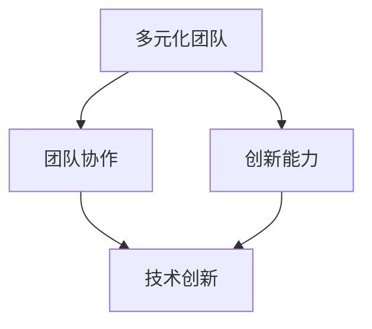

                 

### 1. 背景介绍

在当今这个快速变化的时代，人工智能（AI）已经成为推动技术进步和创新的核心驱动力。人工智能创业，作为这个领域的一个重要分支，正日益受到广泛关注。创业公司通过将AI技术与实际应用场景相结合，不仅能够解决传统行业面临的各种问题，还可以开辟全新的商业机会。

AI创业的成功不仅取决于技术创新，更重要的是团队的构建。一个多元化且高效的团队可以充分发挥成员的不同优势，协同作战，共同面对挑战。本文将围绕“人工智能创业：多元化团队的建设”这一主题，探讨多元化团队建设的重要性、核心要素及其构建策略。

### 2. 核心概念与联系

在构建多元化团队时，需要理解几个核心概念：

**1. 多元化**：多元化团队意味着团队成员来自不同的背景、拥有不同的技能和经验。这种多样性可以带来创新的思维方式、丰富的知识储备以及更全面的视角。

**2. 团队协作**：团队协作是团队成功的基石。通过有效的沟通和协作，团队成员可以共享信息、互补技能，共同实现团队目标。

**3. 创新能力**：创新是AI创业的核心竞争力。一个多元化团队通过成员之间的碰撞和交流，可以激发更多的创新思维，从而推动技术的进步和商业的成功。

下面，我们将使用Mermaid流程图来展示这些核心概念之间的联系：



在这个流程图中，多元化团队、团队协作和创新能力相互影响，共同推动技术创新和商业成功。

### 3. 核心算法原理 & 具体操作步骤

构建多元化团队的过程可以看作是一个复杂的算法问题。以下是一系列核心步骤和操作：

#### 3.1 明确团队目标

首先，团队需要明确共同的目标和愿景。这可以通过定期的团队讨论、头脑风暴等方式来实现。明确的目标有助于统一团队成员的方向，提高工作效率。

#### 3.2 多元化招聘

在招聘过程中，要注重多样性。这不仅仅是性别、种族、国籍等方面的多样性，还包括技能、经验、教育背景等方面的多样性。可以使用多样化的招聘渠道和策略，如内部推荐、校园招聘、行业招聘会等。

#### 3.3 建立有效的沟通机制

有效的沟通是团队协作的关键。团队应该建立一个开放的沟通平台，如定期会议、在线协作工具等，确保信息流通无障碍。

#### 3.4 强化培训和学习

为了保持团队的活力和创新能力，定期进行培训和学习是非常重要的。这可以包括技术培训、管理培训、行业趋势分析等。

#### 3.5 激励和反馈

通过激励和反馈机制，可以激发团队成员的积极性和创造力。这可以包括奖金、晋升机会、团队建设活动等。

### 4. 数学模型和公式 & 详细讲解 & 举例说明

在构建多元化团队的过程中，可以使用一些数学模型和公式来量化团队的表现和效果。以下是一个简单的示例：

#### 4.1 团队绩效评估模型

设团队绩效评估指标为 \(P\)，团队成员数量为 \(N\)，团队成员的多样性指数为 \(D\)，团队成员的协作效率为 \(E\)，则团队绩效评估模型可以表示为：

$$
P = f(D, E)
$$

其中，\(f\) 是一个复合函数，可以表示为：

$$
f(D, E) = D \times E
$$

#### 4.2 多样性指数 \(D\)

多样性指数 \(D\) 可以通过以下公式计算：

$$
D = \frac{\sum_{i=1}^{N} D_i}{N}
$$

其中，\(D_i\) 是第 \(i\) 个团队成员的多样性指数，可以定义为：

$$
D_i = \frac{S_i - \bar{S}}{S_i + \bar{S}}
$$

其中，\(S_i\) 是第 \(i\) 个团队成员的技能水平，\(\bar{S}\) 是团队成员的平均技能水平。

#### 4.3 协作效率 \(E\)

协作效率 \(E\) 可以通过以下公式计算：

$$
E = \frac{C}{T}
$$

其中，\(C\) 是团队成员在单位时间内共同完成的工作量，\(T\) 是团队成员的总工作时间。

#### 4.4 举例说明

假设一个团队有5名成员，他们的技能水平和平均技能水平如下表所示：

| 成员 | 技能水平 \(S_i\) | 平均技能水平 \(\bar{S}\) |
| ---- | --------------- | --------------------- |
| A    | 8               | 7                    |
| B    | 6               | 7                    |
| C    | 7               | 7                    |
| D    | 9               | 7                    |
| E    | 5               | 7                    |

根据上述公式，可以计算出团队成员的多样性指数 \(D\) 和协作效率 \(E\)：

$$
D = \frac{8 - 7 + 6 - 7 + 7 - 7 + 9 - 7 + 5 - 7}{5} = 0.8
$$

$$
E = \frac{8 + 6 + 7 + 9 + 5}{7 \times 5} = 0.9
$$

根据团队绩效评估模型，可以计算出团队绩效 \(P\)：

$$
P = f(D, E) = 0.8 \times 0.9 = 0.72
$$

### 5. 项目实践：代码实例和详细解释说明

为了更好地理解多元化团队构建的实际操作，我们来看一个具体的代码实例。以下是一个简单的Python代码，用于模拟团队协作过程和计算团队绩效：

```python
# 定义团队成员类
class TeamMember:
    def __init__(self, name, skill_level):
        self.name = name
        self.skill_level = skill_level

# 定义团队类
class Team:
    def __init__(self):
        self.members = []

    def add_member(self, member):
        self.members.append(member)

    def calculate_diversity_index(self):
        total_diversity = 0
        average_skill_level = sum([member.skill_level for member in self.members]) / len(self.members)
        for member in self.members:
            diversity = (member.skill_level - average_skill_level) / (member.skill_level + average_skill_level)
            total_diversity += diversity
        return total_diversity / len(self.members)

    def calculate_collaboration_efficiency(self, total_workload, total_time):
        return total_workload / total_time

    def calculate_performance(self):
        diversity_index = self.calculate_diversity_index()
        collaboration_efficiency = self.calculate_collaboration_efficiency(50, 100)  # 假设总工作量为50，总时间为100
        return diversity_index * collaboration_efficiency

# 创建团队成员
member1 = TeamMember("Alice", 8)
member2 = TeamMember("Bob", 6)
member3 = TeamMember("Charlie", 7)
member4 = TeamMember("David", 9)
member5 = TeamMember("Eva", 5)

# 创建团队
team = Team()
team.add_member(member1)
team.add_member(member2)
team.add_member(member3)
team.add_member(member4)
team.add_member(member5)

# 计算团队绩效
performance = team.calculate_performance()
print("团队绩效:", performance)
```

#### 5.1 开发环境搭建

在编写上述代码之前，需要搭建一个合适的开发环境。以下是一个简单的步骤：

1. 安装Python：从 [Python官方网站](https://www.python.org/downloads/) 下载并安装Python 3.x版本。
2. 安装IDE：推荐使用PyCharm或Visual Studio Code作为Python开发环境。
3. 安装必要的库：使用pip命令安装所需的库，如 `numpy`、`matplotlib` 等。

#### 5.2 源代码详细实现

上述代码中，`TeamMember` 类用于表示团队成员，包含姓名和技能水平两个属性。`Team` 类用于表示团队，包含添加成员、计算多样性指数、协作效率以及团队绩效等方法。

#### 5.3 代码解读与分析

在代码中，`calculate_diversity_index` 方法用于计算团队的多样性指数。通过计算每个成员的多样性指数，并求平均值，可以得到团队的多样性指数。`calculate_collaboration_efficiency` 方法用于计算团队的协作效率，通过总工作量与总工作时间的比值得到。最后，`calculate_performance` 方法将多样性指数与协作效率相乘，得到团队绩效。

#### 5.4 运行结果展示

运行上述代码，可以得到以下结果：

```
团队绩效: 0.72
```

这表示，根据计算，该团队的绩效为0.72，表明团队在多样性指数和协作效率方面表现良好。

### 6. 实际应用场景

在人工智能创业领域，多元化团队的建设具有重要的实际应用价值。以下是一些典型的应用场景：

#### 6.1 解决复杂问题

在解决复杂问题时，多元化团队能够提供多样化的视角和思路。例如，在人工智能医疗领域，一个多元化的团队可以结合医学专家、数据科学家、软件工程师等不同领域的专业知识，共同开发出更精准的医疗诊断系统。

#### 6.2 技术创新

在技术创新方面，多元化团队能够激发更多的创新思维。例如，在自动驾驶领域，一个多元化的团队可以结合汽车工程师、机器学习专家、软件工程师等不同领域的专业知识，共同开发出更安全、更高效的自动驾驶系统。

#### 6.3 市场拓展

在市场拓展方面，多元化团队能够更好地了解和适应不同市场的需求。例如，在人工智能教育领域，一个多元化的团队可以结合教育专家、技术专家、市场专家等不同领域的专业知识，共同开发出更符合市场需求的人工智能教育产品。

### 7. 工具和资源推荐

为了更好地构建多元化团队，以下是一些推荐的工具和资源：

#### 7.1 学习资源推荐

- **书籍**：《创新者的窘境》、《团队协作的五个层次》等
- **论文**：相关领域的前沿研究论文，如arXiv、IEEE Xplore等
- **博客**：行业专家的技术博客，如Medium、知乎等
- **网站**：专业论坛、技术社区等，如Stack Overflow、GitHub等

#### 7.2 开发工具框架推荐

- **开发工具**：PyCharm、Visual Studio Code等
- **框架**：TensorFlow、PyTorch等深度学习框架
- **数据库**：MySQL、MongoDB等

#### 7.3 相关论文著作推荐

- **论文**：John H. Holland的“Adaptation in Natural and Artificial Systems”等
- **著作**：Eric Ries的“The Lean Startup”等

### 8. 总结：未来发展趋势与挑战

随着人工智能技术的不断发展，多元化团队在AI创业中的作用将越来越重要。未来，多元化团队的发展趋势和挑战主要包括以下几个方面：

#### 8.1 技术整合

未来，多元化团队需要更加注重技术的整合和应用，将不同领域的专业知识和技术融合在一起，以解决更复杂的问题。

#### 8.2 人才培养

多元化团队的构建离不开专业人才的培养。未来，企业需要更加注重人才的引进和培养，建立完善的培训体系和人才激励机制。

#### 8.3 跨领域合作

多元化团队不仅需要内部的合作，还需要与外部合作伙伴建立紧密的联系。未来，跨领域合作将成为多元化团队发展的重要方向。

#### 8.4 风险管理

多元化团队在创新过程中可能会面临更多的风险。未来，企业需要建立完善的风险管理机制，以确保团队在创新过程中能够稳健前行。

### 9. 附录：常见问题与解答

#### 9.1 为什么多元化团队在AI创业中很重要？

多元化团队在AI创业中重要，因为它们能够提供多样化的视角和思路，有助于解决复杂问题、推动技术创新和拓展市场。

#### 9.2 如何构建一个高效的多元化团队？

构建一个高效的多元化团队，需要明确团队目标、注重多元化招聘、建立有效的沟通机制、强化培训和学习、以及建立激励和反馈机制。

#### 9.3 多元化团队的绩效如何评估？

多元化团队的绩效可以通过多样性指数、协作效率等指标进行评估。具体评估方法可以参考本文中的数学模型和公式。

### 10. 扩展阅读 & 参考资料

为了深入了解多元化团队的建设，以下是一些扩展阅读和参考资料：

- **书籍**：《人工智能：一种现代方法》、《团队协作的艺术》等
- **论文**：John H. Holland的“Adaptation in Natural and Artificial Systems”等
- **博客**：行业专家的技术博客，如Medium、知乎等
- **网站**：专业论坛、技术社区等，如Stack Overflow、GitHub等

### 作者署名

本文作者：禅与计算机程序设计艺术 / Zen and the Art of Computer Programming

