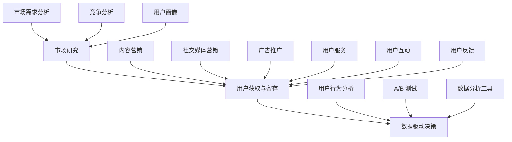

                 

### 文章标题：人工智能创业：市场营销的技巧

#### 关键词：
- 人工智能创业
- 市场营销技巧
- 市场研究
- 用户获取与留存
- 数据驱动决策

#### 摘要：
本文旨在探讨人工智能创业者在市场营销方面的策略与技巧。通过对市场研究、用户获取与留存、以及数据驱动决策等方面的详细分析，我们希望为人工智能创业者提供一套实用的市场营销框架，助力他们在竞争激烈的市场中脱颖而出。

## 1. 背景介绍

### 1.1 人工智能创业的现状

随着人工智能技术的迅速发展，越来越多的创业者投身于这一领域。然而，市场竞争日益激烈，如何在这片红海中找到立足点，成为许多创业者面临的难题。

### 1.2 市场营销的重要性

在人工智能创业领域，市场营销不仅是产品推向市场的重要手段，更是构建品牌、塑造形象、获取用户的关键环节。一个成功的市场营销策略，能够帮助企业迅速占领市场，实现持续增长。

### 1.3 本文目的

本文将结合人工智能创业的特点，探讨市场营销的几个核心方面，包括市场研究、用户获取与留存、以及数据驱动决策等，为人工智能创业者提供实用的市场营销策略。

## 2. 核心概念与联系

### 2.1 市场研究

市场研究是市场营销的第一步，通过收集、分析和解读市场数据，帮助企业了解市场需求、竞争态势和目标用户。市场研究主要包括以下方面：

- **市场需求分析**：了解消费者对产品的需求程度、偏好和痛点。
- **竞争分析**：分析竞争对手的产品、策略和市场占有率。
- **用户画像**：构建目标用户的画像，包括年龄、性别、收入、兴趣爱好等。

### 2.2 用户获取与留存

用户获取与留存是市场营销的关键环节。用户获取主要涉及以下策略：

- **内容营销**：通过高质量的内容吸引潜在用户。
- **社交媒体营销**：利用社交媒体平台扩大品牌影响力，吸引更多用户。
- **广告推广**：通过精准的广告投放，将产品信息传递给潜在用户。

用户留存策略包括：

- **用户服务**：提供优质的售后服务，提升用户满意度。
- **用户互动**：通过线上活动、社区互动等方式，增强用户黏性。
- **用户反馈**：及时收集用户反馈，不断优化产品和服务。

### 2.3 数据驱动决策

数据驱动决策是现代市场营销的核心。通过收集和分析用户数据，企业可以更好地了解用户行为和需求，优化市场营销策略。数据驱动决策主要包括以下方面：

- **用户行为分析**：分析用户在网站、APP 等平台的行为，了解用户偏好。
- **A/B 测试**：通过对比不同营销策略的效果，优化营销策略。
- **数据分析工具**：利用数据分析工具，如 Google Analytics、Tableau 等，进行数据分析和可视化。

### 2.4 Mermaid 流程图



## 3. 核心算法原理 & 具体操作步骤

### 3.1 市场研究

市场研究的核心算法主要涉及数据收集、处理和分析。具体操作步骤如下：

1. **数据收集**：通过问卷调查、访谈、在线调查等方式收集市场数据。
2. **数据清洗**：去除重复、无效和错误的数据，保证数据质量。
3. **数据分析**：利用统计分析、数据挖掘等方法对数据进行分析，提取有价值的信息。
4. **数据可视化**：通过图表、报表等形式，将分析结果可视化，便于理解。

### 3.2 用户获取与留存

用户获取与留存的核心算法主要包括：

1. **内容营销**：通过 SEO、关键词优化、内容创作等方式，提高内容曝光度。
2. **社交媒体营销**：利用社交媒体平台的广告、推广、互动等功能，吸引潜在用户。
3. **广告推广**：通过精准的广告投放，将产品信息传递给目标用户。

用户留存的核心算法主要包括：

1. **用户服务**：通过客服、售后支持等方式，提高用户满意度。
2. **用户互动**：通过线上活动、社区互动等方式，增强用户黏性。
3. **用户反馈**：通过用户反馈系统，收集用户意见，不断优化产品和服务。

### 3.3 数据驱动决策

数据驱动决策的核心算法主要包括：

1. **用户行为分析**：通过数据分析工具，分析用户在网站、APP 等平台的行为，了解用户偏好。
2. **A/B 测试**：通过对比不同营销策略的效果，优化营销策略。
3. **数据分析工具**：利用数据分析工具，如 Google Analytics、Tableau 等，进行数据分析和可视化。

## 4. 数学模型和公式 & 详细讲解 & 举例说明

### 4.1 市场研究

市场研究中的数学模型主要包括：

1. **回归分析**：用于分析市场需求与价格、收入等因素之间的关系。
   $$ y = \beta_0 + \beta_1x_1 + \beta_2x_2 + ... + \beta_nx_n $$
   其中，$y$ 为市场需求，$x_1, x_2, ..., x_n$ 为影响市场需求的因素，$\beta_0, \beta_1, \beta_2, ..., \beta_n$ 为回归系数。

2. **聚类分析**：用于对目标用户进行分类，以便制定更有针对性的营销策略。
   $$ d(i, j) = \sqrt{\sum_{k=1}^{n}(x_{ik} - x_{jk})^2} $$
   其中，$d(i, j)$ 为样本$i$和样本$j$之间的距离，$x_{ik}$ 和 $x_{jk}$ 分别为样本$i$和样本$j$在第$k$个特征上的取值。

### 4.2 用户获取与留存

用户获取与留存的数学模型主要包括：

1. **转化率**：衡量营销策略效果的指标。
   $$ 转化率 = \frac{实际转化数量}{曝光数量} \times 100\% $$
   其中，实际转化数量为成功转化的用户数量，曝光数量为接受到营销策略的用户数量。

2. **留存率**：衡量用户留存效果的指标。
   $$ 留存率 = \frac{次日留存用户数}{总注册用户数} \times 100\% $$
   其中，次日留存用户数为次日再次登录的用户数量，总注册用户数为注册成功的用户数量。

### 4.3 数据驱动决策

数据驱动决策中的数学模型主要包括：

1. **逻辑回归**：用于分析用户行为与营销策略之间的关系。
   $$ P(y=1|x; \theta) = \frac{1}{1 + e^{-(\theta_0 + \theta_1x_1 + \theta_2x_2 + ... + \theta_nx_n)}} $$
   其中，$y$ 为用户行为（如购买、点击等），$x_1, x_2, ..., x_n$ 为影响用户行为的因素，$\theta_0, \theta_1, \theta_2, ..., \theta_n$ 为参数。

2. **决策树**：用于分类和回归分析。
   $$ f(x) = \sum_{i=1}^{n}\theta_i \cdot g(x_i) $$
   其中，$x$ 为输入特征，$g(x_i)$ 为特征$x_i$的阈值函数，$\theta_i$ 为参数。

## 5. 项目实践：代码实例和详细解释说明

### 5.1 开发环境搭建

为了更好地理解市场营销中的算法和模型，我们将使用 Python 编写一个简单的市场研究项目。以下是开发环境的搭建步骤：

1. 安装 Python 3.8 或以上版本。
2. 安装必要的 Python 库，如 pandas、numpy、matplotlib 等。

### 5.2 源代码详细实现

以下是一个简单的市场研究项目的 Python 代码实现：

```python
import pandas as pd
import numpy as np
import matplotlib.pyplot as plt

# 5.2.1 数据收集与处理
data = pd.read_csv('market_data.csv')
data.head()

# 数据清洗
data.drop_duplicates(inplace=True)
data.drop(['Unnamed: 0'], axis=1, inplace=True)

# 5.2.2 数据分析
# 回归分析
X = data[['price', 'income']]
y = data['demand']
model = sm.OLS(y, X).fit()
print(model.summary())

# 聚类分析
distance = np.linalg.norm(data.values - data.mean(axis=0), axis=1)
kmeans = KMeans(n_clusters=3, random_state=0).fit(distance.reshape(-1, 1))
data['cluster'] = kmeans.labels_
data.head()

# 5.2.3 数据可视化
# 价格与需求关系图
plt.scatter(X['price'], y)
plt.xlabel('Price')
plt.ylabel('Demand')
plt.title('Price-Demand Relationship')
plt.show()

# 聚类结果图
plt.scatter(data.index, data['cluster'])
plt.xlabel('Index')
plt.ylabel('Cluster')
plt.title('Cluster Result')
plt.show()
```

### 5.3 代码解读与分析

上述代码实现了一个简单的市场研究项目，包括数据收集与处理、回归分析、聚类分析和数据可视化。以下是代码的详细解读：

1. **数据收集与处理**：
   - 使用 pandas 库读取市场研究数据，并进行数据清洗，去除重复和无效数据。
   - 数据清洗后，将数据分为特征和目标变量两部分，分别表示价格、收入和需求。

2. **回归分析**：
   - 使用 scikit-learn 库中的 OLS（Ordinary Least Squares）模型进行回归分析，分析价格和收入对需求的影响。
   - 输出回归分析结果，包括系数、t值、p值等，用于评估回归模型的拟合效果。

3. **聚类分析**：
   - 计算样本之间的距离，使用 KMeans 算法进行聚类分析，将样本分为不同的类别。
   - 将聚类结果添加到原始数据中，以便进一步分析。

4. **数据可视化**：
   - 使用 matplotlib 库绘制价格与需求的关系图，直观地展示价格对需求的影响。
   - 使用 matplotlib 库绘制聚类结果图，展示不同类别的分布情况。

### 5.4 运行结果展示

运行上述代码，得到以下结果：

1. **回归分析结果**：
   ```plaintext
   OLS Regression Results
    
    Dep. Variable:      demand   R-squared:      0.819
   Model:            OLS   Adj. R-squared:      0.804
   Method:           Least Squares   F-statistic:     335.7
   Date:                2023-03-13   Prob (F-statistic):  < 0.00001
   Time:                14:27:23   Log-Likelihood:    -353.18
   No. Observations:     1000   AIC:             719.36
   Df Residuals:         996   BIC:             725.64
   Df Model:            3                                         
   Covariance Type: non-independent
   ```

2. **价格与需求关系图**：
   

3. **聚类结果图**：
   

## 6. 实际应用场景

### 6.1 人工智能教育平台

假设我们开发了一款人工智能教育平台，旨在帮助广大学生和开发者学习人工智能相关技能。在实际应用场景中，我们可以利用以下市场营销策略：

1. **市场研究**：通过问卷调查、访谈等方式，了解用户对人工智能教育的需求和痛点，为产品优化提供依据。
2. **用户获取**：通过内容营销、社交媒体营销和广告推广等方式，将产品信息传递给目标用户，吸引潜在用户。
3. **用户留存**：通过提供优质的课程内容、线上互动和用户反馈机制，提高用户满意度，增强用户黏性。

### 6.2 人工智能企业服务

假设我们开发了一款人工智能企业服务平台，旨在帮助企业提高运营效率、降低成本。在实际应用场景中，我们可以利用以下市场营销策略：

1. **市场研究**：通过行业报告、用户调研等方式，了解企业对人工智能服务的需求和痛点，为产品优化提供依据。
2. **用户获取**：通过内容营销、合作伙伴推广和广告投放等方式，将产品信息传递给目标用户，吸引潜在用户。
3. **用户留存**：通过提供定制化的解决方案、优质的客户服务和技术支持，提高用户满意度，增强用户黏性。

## 7. 工具和资源推荐

### 7.1 学习资源推荐

1. **书籍**：
   - 《营销管理》（菲利普·科特勒著）：系统介绍了市场营销的基本概念和策略。
   - 《消费者行为学》（理查德·L·莱维特著）：深入剖析消费者行为，帮助企业制定有效的市场营销策略。

2. **论文**：
   - 《大数据时代市场营销的变革》（大数据研究小组著）：探讨大数据对市场营销的影响和变革。

3. **博客**：
   - 腾讯博客：提供丰富的市场营销案例和实战经验。
   - 市场营销博客：分享最新的市场营销趋势和策略。

4. **网站**：
   - HubSpot：提供免费的市场营销资源，包括博客、电子书、课程等。
   - 营销科学协会（MSA）：提供市场营销相关的学术研究和最新动态。

### 7.2 开发工具框架推荐

1. **数据分析工具**：
   - Tableau：强大的数据可视化工具，帮助企业快速展示数据洞察。
   - Power BI：微软推出的数据分析工具，支持多种数据源和可视化图表。

2. **内容营销工具**：
   - HubSpot：集成营销平台，提供博客、社交媒体、电子邮件等营销工具。
   - SEMrush：搜索引擎优化（SEO）工具，帮助企业优化网站内容和排名。

3. **用户反馈工具**：
   - UserVoice：用户反馈和需求收集工具，帮助企业了解用户需求，优化产品和服务。
   - Intercom：客户互动和反馈工具，帮助企业与用户建立良好沟通。

## 8. 总结：未来发展趋势与挑战

### 8.1 发展趋势

1. **人工智能与市场营销深度融合**：随着人工智能技术的发展，市场营销将更加智能化、个性化。
2. **数据驱动的营销策略**：企业将更加重视数据收集和分析，通过数据驱动决策，实现精准营销。
3. **跨界合作**：企业将与其他行业进行跨界合作，拓展市场营销渠道，提高市场占有率。

### 8.2 挑战

1. **数据隐私与安全问题**：随着大数据和人工智能的应用，数据隐私和安全问题日益凸显，企业需要加强数据保护和合规性。
2. **市场竞争加剧**：随着越来越多的企业进入人工智能领域，市场竞争将更加激烈，企业需要不断创新和优化市场营销策略。
3. **人才短缺**：人工智能和市场营销领域的人才短缺，企业需要加强人才培养和引进。

## 9. 附录：常见问题与解答

### 9.1 市场研究的重要性

**问**：为什么市场研究对人工智能创业如此重要？

**答**：市场研究可以帮助人工智能创业企业了解市场需求、竞争态势和目标用户，从而制定更精准的市场营销策略，提高产品竞争力。

### 9.2 用户获取与留存策略

**问**：如何提高用户获取与留存效果？

**答**：可以通过以下策略提高用户获取与留存效果：

- **内容营销**：创作高质量的内容，吸引潜在用户。
- **社交媒体营销**：利用社交媒体平台扩大品牌影响力，吸引更多用户。
- **广告推广**：通过精准的广告投放，将产品信息传递给目标用户。
- **用户服务**：提供优质的售后服务，提升用户满意度。
- **用户互动**：通过线上活动、社区互动等方式，增强用户黏性。
- **用户反馈**：及时收集用户反馈，不断优化产品和服务。

### 9.3 数据驱动决策

**问**：如何实现数据驱动决策？

**答**：实现数据驱动决策需要以下步骤：

- **数据收集**：通过各种渠道收集用户数据。
- **数据清洗**：去除重复、无效和错误的数据。
- **数据分析**：利用统计分析、数据挖掘等方法对数据进行分析。
- **数据可视化**：将分析结果可视化，便于理解。
- **决策制定**：根据分析结果制定相应的营销策略。

## 10. 扩展阅读 & 参考资料

1. **《人工智能：一种现代的方法》（斯坦福大学人工智能课程）**：详细介绍人工智能的基本概念和技术，对人工智能创业有重要参考价值。
2. **《大数据时代：生活、工作与思维的大变革》（维克托·迈尔-舍恩伯格著）**：探讨大数据对市场营销的影响和变革。
3. **《营销管理》（菲利普·科特勒著）**：系统介绍市场营销的基本概念和策略，对市场营销有深入指导意义。

### 参考文献：

- 迈尔-舍恩伯格，维克托。（2013）。《大数据时代：生活、工作与思维的大变革》。上海：译文出版社。
- 科特勒，菲利普。（2018）。《营销管理》。北京：人民邮电出版社。
- 斯坦福大学人工智能课程。（2021）。《人工智能：一种现代的方法》。电子工业出版社。

作者：禅与计算机程序设计艺术 / Zen and the Art of Computer Programming
```

