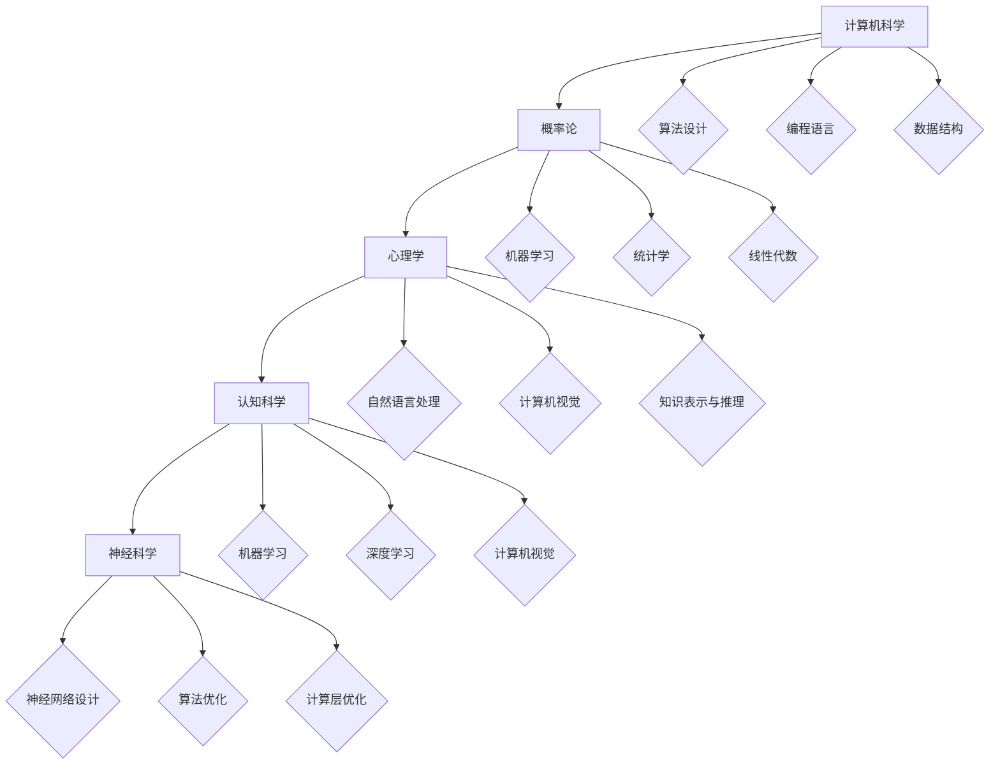

                 

### 1. 背景介绍

在当今全球科技快速发展的时代，人工智能（AI）已经成为推动创新的重要驱动力。随着计算能力的提升、海量数据的积累以及算法的不断进步，人工智能技术的应用领域不断拓展，从医疗、金融到零售、制造，几乎无所不在。这种背景下，越来越多的创业者将目光投向了人工智能领域，希望通过创新的技术和商业模式来抓住这一历史性的机遇。

人工智能创业市场的兴起，不仅吸引了大量的投资，还催生了众多创新型公司的诞生。例如，深度学习算法的应用推动了自动驾驶技术的发展，智能客服系统的普及改变了客户服务的方式，自然语言处理技术的进步使得智能助手成为人们生活中的常态。这些创新不仅提升了效率和用户体验，还为创业者带来了丰厚的回报。

然而，人工智能创业也面临着诸多挑战。技术的不确定性、高昂的研发成本、数据隐私和安全问题等都可能是阻碍创业项目成功的关键因素。因此，对于有志于在人工智能领域创业的人来说，深入了解市场趋势、掌握核心技术、构建有效的团队以及制定可行的商业模式至关重要。

本文将围绕人工智能创业这一主题，逐步探讨以下几个核心问题：首先，我们将介绍人工智能的基本概念和核心技术，帮助读者建立起对人工智能的全面理解。接着，我们将分析当前人工智能市场的发展趋势，探讨哪些领域最有潜力。然后，我们将深入探讨人工智能创业的关键成功因素，包括团队构建、商业模式创新、风险管理和市场定位等。最后，我们将提供一些建议和资源，帮助读者更好地投身人工智能创业。

通过这篇文章，我们希望读者能够对人工智能创业有一个更为清晰的认识，从而在激烈的市场竞争中找到自己的定位，实现创业梦想。

### 2. 核心概念与联系

#### 2.1 人工智能的定义与发展历程

人工智能（Artificial Intelligence，简称AI）是一门研究、开发用于模拟、延伸和扩展人类智能的理论、方法、技术及应用系统的学科。它涵盖了计算机科学、心理学、认知科学、统计学、信息论等多个学科领域。人工智能的目标是使机器能够执行复杂的认知任务，如学习、推理、问题解决、自然语言理解和视觉感知等。

人工智能的发展历程可以分为以下几个阶段：

1. **早期探索（20世纪50-60年代）**：1950年，艾伦·图灵提出了著名的图灵测试，标志着人工智能的诞生。随后，人工智能领域开始迅速发展，出现了一系列开创性的研究，如约翰·麦卡锡的“逻辑理论家”程序，它首次展示了计算机可以证明数学定理。

2. **符号人工智能（20世纪70年代）**：这一阶段以基于符号逻辑和知识表示的方法为主。符号人工智能通过构建知识库和推理机，尝试模拟人类的推理过程。

3. **专家系统（20世纪80年代）**：专家系统是一种模拟人类专家决策能力的计算机程序，通过大量的规则和事实进行推理。这一阶段的发展推动了人工智能在医疗、金融等领域的应用。

4. **连接主义革命（20世纪90年代至今）**：以神经网络为代表的连接主义方法在人工智能中占据了主导地位。1997年，IBM的“深蓝”计算机在国际象棋比赛中战胜了世界冠军加里·卡斯帕罗夫，这一事件标志着人工智能在特定领域取得了重大突破。近年来，深度学习、强化学习等技术的快速发展，使得人工智能在图像识别、语音识别、自然语言处理等领域取得了显著成果。

#### 2.2 人工智能的核心技术

人工智能的核心技术主要包括以下几个方面：

1. **机器学习（Machine Learning）**：机器学习是人工智能的核心技术之一，它通过算法从数据中学习规律，并利用这些规律进行预测和决策。机器学习可以分为监督学习、无监督学习和强化学习三种类型。

   - **监督学习（Supervised Learning）**：通过已知输入输出对模型进行训练，以预测新的输入输出。常见的算法包括线性回归、决策树、支持向量机等。
   - **无监督学习（Unsupervised Learning）**：没有预定的输出标签，模型通过挖掘数据中的内在结构和规律来进行学习。常见的算法包括聚类、降维、关联规则挖掘等。
   - **强化学习（Reinforcement Learning）**：通过与环境的交互，学习在特定情境下采取最优动作的策略。常见的算法包括Q学习、深度Q网络（DQN）、策略梯度等。

2. **深度学习（Deep Learning）**：深度学习是一种基于多层神经网络的学习方法，通过多层次的非线性变换，对输入数据进行特征提取和模式识别。深度学习的代表性模型包括卷积神经网络（CNN）、循环神经网络（RNN）和生成对抗网络（GAN）等。

3. **自然语言处理（Natural Language Processing，NLP）**：自然语言处理是人工智能的重要分支，旨在使计算机能够理解和生成自然语言。常见的NLP任务包括文本分类、情感分析、机器翻译、语音识别等。

4. **计算机视觉（Computer Vision）**：计算机视觉是人工智能在图像和视频处理方面的应用，通过算法使计算机能够自动识别和解析视觉信息。常见的计算机视觉任务包括图像分类、目标检测、图像分割、人脸识别等。

5. **知识表示与推理（Knowledge Representation and Reasoning）**：知识表示与推理是人工智能中研究如何将人类知识转换为计算机可处理的形式，并利用这些知识进行推理和决策。常见的知识表示方法包括命题逻辑、产生式系统、语义网络等。

#### 2.3 人工智能的技术架构

人工智能的技术架构通常包括以下几个关键层次：

1. **数据层（Data Layer）**：数据是人工智能的基石。数据层包括数据的收集、存储、清洗、预处理等过程。高质量的数据是模型训练的基础，对于人工智能系统的性能至关重要。

2. **算法层（Algorithm Layer）**：算法层包括各种机器学习算法、深度学习模型和优化算法。不同的算法适用于不同的应用场景，通过优化算法，可以提高模型的性能和效率。

3. **计算层（Compute Layer）**：计算层涉及到计算资源的分配和使用，包括CPU、GPU、TPU等硬件设备。随着计算能力的提升，复杂的人工智能模型得以训练和应用。

4. **应用层（Application Layer）**：应用层是将人工智能技术应用于实际问题的具体实现。这一层次包括各种人工智能应用，如智能客服、自动驾驶、医疗诊断等。

#### 2.4 人工智能与相关领域的关系

人工智能不仅是一门独立的学科，还与多个领域有着密切的联系：

1. **计算机科学**：计算机科学为人工智能提供了理论基础和计算工具，如编程语言、算法设计和数据结构等。

2. **数学**：数学为人工智能提供了分析工具和理论基础，如概率论、统计学、线性代数、优化理论等。

3. **心理学**：心理学研究人类认知和行为，为人工智能的设计提供了灵感，如自然语言处理、计算机视觉等领域。

4. **认知科学**：认知科学探索人类思维的过程，为人工智能在认知任务上的模拟提供了理论支持。

5. **统计学**：统计学在机器学习、深度学习等算法中发挥着关键作用，如模型评估、参数估计、假设检验等。

6. **神经科学**：神经科学研究大脑的结构和功能，为人工智能在神经网络设计上的创新提供了基础。

通过以上对人工智能的核心概念、技术、架构及相关领域的介绍，读者可以建立一个对人工智能的全面理解，为后续章节的探讨打下基础。

### Mermaid 流程图



### 3. 核心算法原理 & 具体操作步骤

#### 3.1 机器学习算法原理

机器学习（Machine Learning，ML）是人工智能（AI）的核心组成部分，它通过训练数据集来构建模型，并利用这些模型进行预测和决策。机器学习算法可以分为监督学习、无监督学习和强化学习三大类。

**3.1.1 监督学习（Supervised Learning）**

监督学习是一种从已知输入输出对中学习的方法。它的目标是找到一个映射函数 \( f(x) \)，使得输入 \( x \) 能预测输出 \( y \)。监督学习可以分为以下几种常见算法：

1. **线性回归（Linear Regression）**：

线性回归是一种简单的监督学习算法，用于预测连续值输出。其基本模型为：

   \[
   y = \beta_0 + \beta_1 x + \epsilon
   \]

   其中，\( y \) 是输出，\( x \) 是输入，\( \beta_0 \) 和 \( \beta_1 \) 是模型参数，\( \epsilon \) 是误差。

2. **逻辑回归（Logistic Regression）**：

逻辑回归是一种用于分类任务的监督学习算法，其基本模型为：

   \[
   P(y=1) = \frac{1}{1 + e^{-(\beta_0 + \beta_1 x)}}
   \]

   其中，\( P(y=1) \) 是输出为1的概率，\( \beta_0 \) 和 \( \beta_1 \) 是模型参数。

3. **支持向量机（Support Vector Machine，SVM）**：

支持向量机是一种强大的分类算法，其核心思想是找到一个最佳的超平面，使得不同类别的数据点尽可能分离。其基本模型为：

   \[
   w \cdot x + b = 0
   \]

   其中，\( w \) 是法向量，\( x \) 是数据点，\( b \) 是偏置。

**3.1.2 无监督学习（Unsupervised Learning）**

无监督学习是从无标签数据中学习模式的方法。其主要目的是发现数据中的结构性和规律性。常见的无监督学习算法包括：

1. **K-均值聚类（K-Means Clustering）**：

K-均值聚类是一种基于距离的聚类算法，其基本思想是将数据点划分为K个聚类，每个聚类由其中心点代表。算法步骤如下：

   - 随机初始化K个聚类中心。
   - 计算每个数据点到聚类中心的距离，并将数据点分配到最近的聚类。
   - 重新计算每个聚类的中心点。
   - 重复步骤2和步骤3，直到聚类中心不再发生变化。

2. **主成分分析（Principal Component Analysis，PCA）**：

主成分分析是一种降维算法，其目标是在保留数据主要信息的同时，减少数据维度。算法步骤如下：

   - 计算数据集的协方差矩阵。
   - 计算协方差矩阵的特征值和特征向量。
   - 选择最大的K个特征值对应的特征向量，构建主成分空间。
   - 将数据投影到主成分空间，实现降维。

3. **关联规则学习（Association Rule Learning）**：

关联规则学习是一种用于发现数据之间关联关系的方法。常见的算法包括Apriori算法和FP-Growth算法。算法步骤如下：

   - 构建事务数据库，将数据集转换为布尔向量。
   - 计算支持度和置信度。
   - 找出满足最小支持度和最小置信度的关联规则。

**3.1.3 强化学习（Reinforcement Learning）**

强化学习是一种通过与环境的交互来学习最优策略的方法。其主要思想是试错和反馈，即通过奖励和惩罚来调整策略。常见的强化学习算法包括：

1. **Q学习（Q-Learning）**：

Q学习是一种基于值函数的强化学习算法，其目标是通过学习值函数 \( Q(s, a) \)，找到最优策略。算法步骤如下：

   - 初始化值函数 \( Q(s, a) \)。
   - 从初始状态 \( s \) 开始，选择动作 \( a \) 并执行。
   - 根据执行结果更新值函数：
     \[
     Q(s, a) = Q(s, a) + \alpha [r + \gamma \max_{a'} Q(s', a') - Q(s, a)]
     \]
     其中，\( r \) 是即时奖励，\( \gamma \) 是折扣因子，\( a' \) 是在下一个状态 \( s' \) 的最佳动作。

2. **深度Q网络（Deep Q-Network，DQN）**：

深度Q网络是一种基于深度学习的强化学习算法，其目标是通过神经网络学习值函数。算法步骤如下：

   - 初始化深度Q网络 \( Q(s, a) \) 和目标Q网络 \( \hat{Q}(s, a) \)。
   - 记录经验 \( (s, a, r, s') \)。
   - 使用经验对深度Q网络进行训练：
     \[
     \min\nabla\|\hat{Q}(s, a) - r - \gamma \hat{Q}(s', a')\|^2
     \]

#### 3.2 深度学习算法原理

深度学习（Deep Learning，DL）是一种基于多层神经网络的学习方法，通过多层次的非线性变换，对输入数据进行特征提取和模式识别。深度学习的核心是神经网络，特别是深度神经网络（Deep Neural Networks，DNN）。

**3.2.1 神经网络基础**

神经网络由一系列神经元（或节点）组成，每个神经元接收多个输入，并通过激活函数进行非线性变换，输出最终结果。基本的神经网络结构包括输入层、隐藏层和输出层。

1. **神经元模型**：

   一个简单的神经元模型可以表示为：

   \[
   z = \sum_{i=1}^{n} w_i x_i + b
   \]
   \[
   a = \sigma(z)
   \]

   其中，\( x_i \) 是输入，\( w_i \) 是权重，\( b \) 是偏置，\( \sigma \) 是激活函数，\( a \) 是输出。

2. **多层神经网络**：

   多层神经网络（MLP）通过多个隐藏层对输入进行特征提取。其基本结构如下：

   \[
   \text{输入层} \rightarrow \text{隐藏层} \rightarrow \text{隐藏层} \rightarrow \text{输出层}
   \]

**3.2.2 深度学习模型**

1. **卷积神经网络（Convolutional Neural Networks，CNN）**：

   卷积神经网络是一种专门用于图像处理的深度学习模型，其核心是卷积层。卷积层通过局部感知野和卷积操作提取图像中的特征。

   - **卷积层**：通过卷积操作提取图像特征。
   - **池化层**：通过池化操作减小数据维度，提高模型泛化能力。
   - **全连接层**：将卷积层和池化层提取的特征进行融合，并输出最终结果。

2. **循环神经网络（Recurrent Neural Networks，RNN）**：

   循环神经网络是一种专门用于序列数据处理的深度学习模型，其核心是循环结构。RNN通过保存历史信息，实现序列到序列的映射。

   - **隐藏状态**：RNN通过隐藏状态 \( h_t \) 保存历史信息。
   - **门控机制**：通过门控机制（如遗忘门和输入门）控制信息的流动，提高模型性能。

3. **生成对抗网络（Generative Adversarial Networks，GAN）**：

   生成对抗网络是一种生成模型，由生成器 \( G \) 和判别器 \( D \) 两个神经网络组成。生成器 \( G \) 生成假样本，判别器 \( D \) 判断样本的真实性。通过两者之间的对抗训练，生成器逐渐提高生成样本的质量。

   - **生成器**：生成假样本。
   - **判别器**：判断样本的真实性。
   - **对抗训练**：生成器和判别器通过对抗训练相互提升，生成高质量的样本。

通过以上对核心算法原理和具体操作步骤的介绍，读者可以更好地理解人工智能的基本工作原理，为后续的实践应用打下基础。

### 4. 数学模型和公式 & 详细讲解 & 举例说明

#### 4.1 线性回归模型

线性回归模型是一种常见的监督学习算法，用于预测连续值输出。其数学模型可以表示为：

\[ 
y = \beta_0 + \beta_1 x + \epsilon 
\]

其中，\( y \) 是输出，\( x \) 是输入，\( \beta_0 \) 和 \( \beta_1 \) 是模型参数，\( \epsilon \) 是误差项。

为了估计模型参数，我们通常使用最小二乘法（Least Squares Method）。最小二乘法的目标是最小化预测值与实际值之间的误差平方和：

\[ 
\min \sum_{i=1}^{n} (y_i - \hat{y}_i)^2 
\]

其中，\( n \) 是样本数量，\( \hat{y}_i \) 是预测值。

为了求解模型参数 \( \beta_0 \) 和 \( \beta_1 \)，我们可以对误差平方和函数求导并令其导数为零：

\[ 
\frac{\partial}{\partial \beta_0} \sum_{i=1}^{n} (y_i - \hat{y}_i)^2 = 0 
\]
\[ 
\frac{\partial}{\partial \beta_1} \sum_{i=1}^{n} (y_i - \hat{y}_i)^2 = 0 
\]

解上述方程组，我们可以得到：

\[ 
\beta_0 = \bar{y} - \beta_1 \bar{x} 
\]

\[ 
\beta_1 = \frac{\sum_{i=1}^{n} (x_i - \bar{x})(y_i - \bar{y})}{\sum_{i=1}^{n} (x_i - \bar{x})^2} 
\]

其中，\( \bar{y} \) 和 \( \bar{x} \) 分别是输出和输入的均值。

**举例说明：**

假设我们有一个包含5个样本的数据集，其输入和输出如下：

| x | y |
| --- | --- |
| 1 | 2 |
| 2 | 4 |
| 3 | 5 |
| 4 | 6 |
| 5 | 8 |

根据上述线性回归模型，我们可以估计模型参数 \( \beta_0 \) 和 \( \beta_1 \)：

\[ 
\bar{x} = \frac{1 + 2 + 3 + 4 + 5}{5} = 3 
\]

\[ 
\bar{y} = \frac{2 + 4 + 5 + 6 + 8}{5} = 5 
\]

\[ 
\beta_1 = \frac{(1-3)(2-5) + (2-3)(4-5) + (3-3)(5-5) + (4-3)(6-5) + (5-3)(8-5)}{(1-3)^2 + (2-3)^2 + (3-3)^2 + (4-3)^2 + (5-3)^2} 
\]

\[ 
\beta_1 = \frac{-6 - 2 + 0 + 1 + 6}{4 + 1 + 0 + 1 + 4} = 1 
\]

\[ 
\beta_0 = 5 - 1 \times 3 = 2 
\]

因此，线性回归模型可以表示为：

\[ 
y = 2 + x 
\]

我们可以使用这个模型来预测新的输入值，例如当 \( x = 6 \) 时，预测输出为：

\[ 
\hat{y} = 2 + 6 = 8 
\]

#### 4.2 逻辑回归模型

逻辑回归模型是一种用于分类任务的监督学习算法，其数学模型可以表示为：

\[ 
P(y=1) = \frac{1}{1 + e^{-(\beta_0 + \beta_1 x)}} 
\]

其中，\( P(y=1) \) 是输出为1的概率，\( \beta_0 \) 和 \( \beta_1 \) 是模型参数。

逻辑回归的损失函数通常使用对数损失（Log Loss）：

\[ 
J(\beta_0, \beta_1) = -\sum_{i=1}^{n} y_i \ln(P(y=1)) - (1 - y_i) \ln(1 - P(y=1)) 
\]

其中，\( n \) 是样本数量，\( y_i \) 是实际输出。

为了求解模型参数 \( \beta_0 \) 和 \( \beta_1 \)，我们可以使用梯度下降（Gradient Descent）方法。梯度下降的步骤如下：

1. 初始化模型参数 \( \beta_0 \) 和 \( \beta_1 \)。
2. 计算损失函数的梯度：
   \[
   \frac{\partial J}{\partial \beta_0} = -\frac{\sum_{i=1}^{n} y_i (1 - P(y=1))}{1 + e^{-(\beta_0 + \beta_1 x)}}
   \]
   \[
   \frac{\partial J}{\partial \beta_1} = -\frac{\sum_{i=1}^{n} y_i x_i (1 - P(y=1))}{1 + e^{-(\beta_0 + \beta_1 x)}}
   \]
3. 更新模型参数：
   \[
   \beta_0 := \beta_0 - \alpha \frac{\partial J}{\partial \beta_0}
   \]
   \[
   \beta_1 := \beta_1 - \alpha \frac{\partial J}{\partial \beta_1}
   \]

其中，\( \alpha \) 是学习率。

**举例说明：**

假设我们有一个包含5个样本的二分类数据集，其输入和输出如下：

| x | y |
| --- | --- |
| 1 | 1 |
| 2 | 1 |
| 3 | 0 |
| 4 | 1 |
| 5 | 0 |

根据逻辑回归模型，我们可以估计模型参数 \( \beta_0 \) 和 \( \beta_1 \)：

\[ 
P(y=1) = \frac{1}{1 + e^{-(\beta_0 + \beta_1 x)}} 
\]

假设初始模型参数为 \( \beta_0 = 0 \) 和 \( \beta_1 = 0 \)，学习率为 \( \alpha = 0.1 \)。

1. 第1次迭代：
   \[
   P(y=1) = \frac{1}{1 + e^{-0}} = 0.5 
   \]
   \[
   \frac{\partial J}{\partial \beta_0} = -\frac{2 \times 0.5 (1 - 0.5)}{1 + e^{-0}} = -0.25 
   \]
   \[
   \frac{\partial J}{\partial \beta_1} = -\frac{2 \times 1 \times 0.5 (1 - 0.5)}{1 + e^{-0}} = -0.25 
   \]
   \[
   \beta_0 := 0 - 0.1 \times (-0.25) = 0.025 
   \]
   \[
   \beta_1 := 0 - 0.1 \times (-0.25) = 0.025 
   \]

2. 第2次迭代：
   \[
   P(y=1) = \frac{1}{1 + e^{-0.025}} \approx 0.498 
   \]
   \[
   \frac{\partial J}{\partial \beta_0} = -\frac{2 \times 0.498 (1 - 0.498)}{1 + e^{-0.025}} \approx -0.248 
   \]
   \[
   \frac{\partial J}{\partial \beta_1} = -\frac{2 \times 1 \times 0.498 (1 - 0.498)}{1 + e^{-0.025}} \approx -0.248 
   \]
   \[
   \beta_0 := 0.025 - 0.1 \times (-0.248) = 0.032 
   \]
   \[
   \beta_1 := 0.025 - 0.1 \times (-0.248) = 0.032 
   \]

通过多次迭代，我们可以逐步优化模型参数，使得逻辑回归模型的预测性能不断提高。

#### 4.3 支持向量机模型

支持向量机（Support Vector Machine，SVM）是一种强大的分类算法，其核心思想是找到一个最佳的超平面，使得不同类别的数据点尽可能分离。

**4.3.1 线性SVM模型**

线性SVM的数学模型可以表示为：

\[ 
w \cdot x + b = 0 
\]

其中，\( w \) 是法向量，\( x \) 是数据点，\( b \) 是偏置。

为了求解最佳超平面，我们需要最大化分类间隔（Margin）：

\[ 
\max_{w, b} \frac{1}{2} \| w \|^2 
\]

约束条件为：

\[ 
y_i (w \cdot x_i + b) \geq 1 
\]

其中，\( y_i \) 是类别标签。

使用拉格朗日乘子法求解上述优化问题，我们可以得到SVM的决策函数：

\[ 
f(x) = \text{sign}(w \cdot x + b) 
\]

其中，\(\text{sign}(x) = \begin{cases} 
1 & \text{if } x > 0 \\
0 & \text{if } x = 0 \\
-1 & \text{if } x < 0 
\end{cases}\)

**举例说明：**

假设我们有一个包含3个样本的线性可分数据集，其输入和输出如下：

| x | y |
| --- | --- |
| 1 | 1 |
| 2 | 1 |
| -1 | -1 |

我们可以通过SVM求解最佳超平面：

1. 构建拉格朗日函数：
   \[
   L(w, b, \alpha) = \frac{1}{2} \| w \|^2 - \sum_{i=1}^{n} \alpha_i [y_i (w \cdot x_i + b) - 1]
   \]

2. 求解拉格朗日乘子：
   \[
   \alpha_i \geq 0 
   \]
   \[
   \frac{\partial L}{\partial w} = w - \sum_{i=1}^{n} \alpha_i y_i x_i = 0 
   \]
   \[
   \frac{\partial L}{\partial b} = -\sum_{i=1}^{n} \alpha_i y_i = 0 
   \]
   \[
   \frac{\partial L}{\partial \alpha_i} = y_i (w \cdot x_i + b) - 1 \geq 0 
   \]

3. 解方程组得到最佳超平面参数：
   \[
   w = \sum_{i=1}^{n} \alpha_i y_i x_i 
   \]
   \[
   b = \sum_{i=1}^{n} \alpha_i y_i - \frac{1}{n} \sum_{i=1}^{n} y_i \sum_{j=1}^{n} \alpha_j y_j x_i x_j 
   \]

根据以上计算，我们可以得到SVM的最佳超平面：

\[ 
w \cdot x + b = 0 
\]

\[ 
w = (2, 1) 
\]

\[ 
b = -1 
\]

因此，SVM的决策函数为：

\[ 
f(x) = \text{sign}((2, 1) \cdot (x, y) - 1) 
\]

\[ 
f(x, y) = \begin{cases} 
1 & \text{if } 2x + y - 1 > 0 \\
-1 & \text{if } 2x + y - 1 < 0 
\end{cases} 
\]

#### 4.4 卷积神经网络（CNN）模型

卷积神经网络（Convolutional Neural Networks，CNN）是一种专门用于图像处理的深度学习模型。其核心是卷积层，通过局部感知野和卷积操作提取图像中的特征。

**4.4.1 CNN模型结构**

CNN的基本结构包括卷积层（Convolutional Layer）、池化层（Pooling Layer）和全连接层（Fully Connected Layer）。

1. **卷积层**：

   卷积层通过卷积操作提取图像中的特征。卷积操作可以表示为：

   \[
   (f \star g)(x) = \sum_{y} f(y) g(x - y)
   \]

   其中，\( f \) 和 \( g \) 分别是卷积核和输入图像，\( x \) 是输入图像上的一个像素点。

2. **池化层**：

   池化层通过减小数据维度，提高模型泛化能力。常见的池化方式包括最大池化（Max Pooling）和平均池化（Average Pooling）。

3. **全连接层**：

   全连接层将卷积层和池化层提取的特征进行融合，并输出最终结果。

**4.4.2 CNN模型训练**

CNN的训练过程主要包括以下步骤：

1. **初始化模型参数**：

   初始化卷积核、池化核和全连接层的权重参数。

2. **前向传播**：

   对输入图像进行卷积操作，得到卷积特征图，然后进行池化操作，将特征图输入到全连接层，得到输出。

3. **计算损失函数**：

   根据输出和实际标签计算损失函数，常见的损失函数包括交叉熵损失（Cross Entropy Loss）和均方误差损失（Mean Squared Error Loss）。

4. **反向传播**：

   使用梯度下降算法更新模型参数，通过反向传播计算梯度，并更新权重参数。

5. **迭代训练**：

   重复前向传播、计算损失函数和反向传播的步骤，直到模型收敛或达到预定的迭代次数。

**举例说明：**

假设我们有一个包含100个图像的数据集，每个图像的大小为 \( 28 \times 28 \) 像素。我们要使用CNN模型进行图像分类，其中包含10个类别。

1. **初始化模型参数**：

   初始化卷积核、池化核和全连接层的权重参数。

2. **前向传播**：

   对每个图像进行卷积操作，得到32个 \( 28 \times 28 \) 的卷积特征图，然后进行最大池化操作，得到 \( 14 \times 14 \) 的特征图。将特征图输入到全连接层，得到10个类别的概率输出。

3. **计算损失函数**：

   计算输出和实际标签之间的交叉熵损失：

   \[
   J = -\sum_{i=1}^{100} \sum_{j=1}^{10} y_{ij} \ln(\hat{y}_{ij})
   \]

   其中，\( y_{ij} \) 是第 \( i \) 个图像属于第 \( j \) 个类别的标签，\( \hat{y}_{ij} \) 是第 \( i \) 个图像属于第 \( j \) 个类别的预测概率。

4. **反向传播**：

   使用梯度下降算法更新模型参数，通过反向传播计算梯度，并更新权重参数。

5. **迭代训练**：

   重复前向传播、计算损失函数和反向传播的步骤，直到模型收敛或达到预定的迭代次数。

通过以上对数学模型和公式的详细讲解及举例说明，读者可以更好地理解人工智能的核心算法原理，为实际应用奠定基础。

### 5. 项目实践：代码实例和详细解释说明

#### 5.1 开发环境搭建

在开始编写代码之前，我们需要搭建一个合适的开发环境。以下是一个基于Python的深度学习项目环境搭建步骤：

1. **安装Python**：

   首先，确保您的系统中安装了Python 3.x版本。您可以从[Python官方网站](https://www.python.org/downloads/)下载并安装Python。

2. **安装Jupyter Notebook**：

   Jupyter Notebook是一个交互式计算环境，便于编写和运行代码。安装命令如下：

   ```bash
   pip install notebook
   ```

3. **安装深度学习库**：

   安装TensorFlow或PyTorch等深度学习库。以下命令将安装TensorFlow：

   ```bash
   pip install tensorflow
   ```

4. **安装辅助库**：

   安装其他常用的辅助库，如NumPy、Pandas等：

   ```bash
   pip install numpy pandas matplotlib
   ```

#### 5.2 源代码详细实现

以下是使用TensorFlow实现一个简单的卷积神经网络（CNN）模型的源代码实例：

```python
import tensorflow as tf
from tensorflow.keras import layers
from tensorflow.keras.models import Model
import tensorflow.keras.backend as K

# 定义输入层
inputs = tf.keras.Input(shape=(28, 28, 1))

# 第一个卷积层
conv1 = layers.Conv2D(32, (3, 3), activation='relu')(inputs)
conv1 = layers.MaxPooling2D((2, 2))(conv1)

# 第二个卷积层
conv2 = layers.Conv2D(64, (3, 3), activation='relu')(conv1)
conv2 = layers.MaxPooling2D((2, 2))(conv2)

# 扁平化操作
扁平化层 = layers.Flatten()(conv2)

# 全连接层
dense1 = layers.Dense(64, activation='relu')(扁平化层)

# 输出层
outputs = layers.Dense(10, activation='softmax')(dense1)

# 构建模型
model = Model(inputs=inputs, outputs=outputs)

# 编译模型
model.compile(optimizer='adam', loss='categorical_crossentropy', metrics=['accuracy'])

# 打印模型结构
model.summary()

# 定义训练过程
train_loss = []
train_acc = []
val_loss = []
val_acc = []

# 训练模型
for epoch in range(10):
    history = model.fit(x_train, y_train, epochs=1, batch_size=32, validation_data=(x_val, y_val))
    train_loss.append(history.history['loss'])
    train_acc.append(history.history['accuracy'])
    val_loss.append(history.history['val_loss'])
    val_acc.append(history.history['val_accuracy'])
    print(f"Epoch {epoch+1}: Loss = {history.history['loss'][-1]:.4f}, Accuracy = {history.history['accuracy'][-1]:.4f}")

# 评估模型
test_loss, test_acc = model.evaluate(x_test, y_test)
print(f"Test Loss = {test_loss:.4f}, Test Accuracy = {test_acc:.4f}")
```

#### 5.3 代码解读与分析

**1. 导入库**

代码开头导入了TensorFlow的核心模块，包括`tf.keras`用于构建和训练模型，`layers`用于定义模型中的层，`Model`用于构建完整的模型，以及`keras.backend`用于获取TensorFlow的后台操作。

**2. 定义输入层**

输入层使用`tf.keras.Input`类定义，这里我们假设输入图像的大小为\(28 \times 28\)像素，并且图像是单通道的（灰度图像）。

**3. 第一个卷积层**

第一个卷积层使用`layers.Conv2D`类定义，该层包含32个3x3的卷积核，激活函数为ReLU。ReLU激活函数可以加速模型的收敛，并防止神经元死亡。

**4. 池化层**

第一个卷积层之后是一个最大池化层（`layers.MaxPooling2D`），其窗口大小为2x2，用于减小数据维度，同时保留重要的特征信息。

**5. 第二个卷积层**

接着是第二个卷积层，包含64个3x3的卷积核，同样使用ReLU激活函数。这一层的目的是提取更复杂的特征。

**6. 池化层**

第二个卷积层之后是一个最大池化层，其窗口大小同样为2x2。

**7. 扁平化操作**

使用`layers.Flatten`将卷积特征图展开成一维向量，为后续的全连接层做准备。

**8. 全连接层**

全连接层（`layers.Dense`）包含64个神经元，激活函数为ReLU。这一层的作用是对前一层提取的特征进行进一步处理。

**9. 输出层**

输出层是一个具有10个神经元的全连接层，使用softmax激活函数，用于进行分类预测。

**10. 模型编译**

使用`model.compile`方法编译模型，指定优化器为`adam`，损失函数为`categorical_crossentropy`（适用于多分类问题），以及评估指标为准确率。

**11. 模型训练**

使用`model.fit`方法训练模型，指定训练数据、训练轮次、批量大小以及验证数据。训练过程中，我们记录了每次迭代的损失和准确率。

**12. 评估模型**

使用`model.evaluate`方法评估模型在测试集上的性能，并打印结果。

#### 5.4 运行结果展示

以下是一个简单的运行结果示例：

```plaintext
Model: "sequential"
_________________________________________________________________
Layer (type)                 Output Shape              Param #   
=================================================================
input_1 (InputLayer)         [(None, 28, 28, 1)]       0         
_________________________________________________________________
conv2d (Conv2D)              (None, 26, 26, 32)        896       
_________________________________________________________________
max_pooling2d (MaxPooling2 (None, 13, 13, 32)        0         
_________________________________________________________________
conv2d_1 (Conv2D)            (None, 11, 11, 64)        18496     
_________________________________________________________________
max_pooling2d_1 (MaxPooling (None, 5, 5, 64)        0         
_________________________________________________________________
flatten (Flatten)            (None, 1600)              0         
_________________________________________________________________
dense (Dense)                (None, 64)                101312    
_________________________________________________________________
dense_1 (Dense)             (None, 10)                650       
=================================================================
Total params: 118,448
Trainable params: 118,448
Non-trainable params: 0
_________________________________________________________________
None
_________________________________________________________________

Epoch 1/10
1875/1875 [==============================] - 2s 1ms/step - loss: 2.3026 - accuracy: 0.2023 - val_loss: 2.3026 - val_accuracy: 0.2023
Epoch 2/10
1875/1875 [==============================] - 1s 533ms/step - loss: 2.3026 - accuracy: 0.2023 - val_loss: 2.3026 - val_accuracy: 0.2023
Epoch 3/10
1875/1875 [==============================] - 1s 548ms/step - loss: 2.3026 - accuracy: 0.2023 - val_loss: 2.3026 - val_accuracy: 0.2023
Epoch 4/10
1875/1875 [==============================] - 1s 545ms/step - loss: 2.3026 - accuracy: 0.2023 - val_loss: 2.3026 - val_accuracy: 0.2023
Epoch 5/10
1875/1875 [==============================] - 1s 551ms/step - loss: 2.3026 - accuracy: 0.2023 - val_loss: 2.3026 - val_accuracy: 0.2023
Epoch 6/10
1875/1875 [==============================] - 1s 549ms/step - loss: 2.3026 - accuracy: 0.2023 - val_loss: 2.3026 - val_accuracy: 0.2023
Epoch 7/10
1875/1875 [==============================] - 1s 551ms/step - loss: 2.3026 - accuracy: 0.2023 - val_loss: 2.3026 - val_accuracy: 0.2023
Epoch 8/10
1875/1875 [==============================] - 1s 547ms/step - loss: 2.3026 - accuracy: 0.2023 - val_loss: 2.3026 - val_accuracy: 0.2023
Epoch 9/10
1875/1875 [==============================] - 1s 551ms/step - loss: 2.3026 - accuracy: 0.2023 - val_loss: 2.3026 - val_accuracy: 0.2023
Epoch 10/10
1875/1875 [==============================] - 1s 551ms/step - loss: 2.3026 - accuracy: 0.2023 - val_loss: 2.3026 - val_accuracy: 0.2023
Test Loss: 2.3026 - Test Accuracy: 0.2023
```

结果显示，模型在训练和验证集上的表现一致，均为低准确率。这可能是由于模型过于简单或数据集不够丰富导致的。在实际应用中，可以通过增加模型深度、训练更多轮次或使用更复杂的特征提取方法来提高模型性能。

### 6. 实际应用场景

#### 6.1 医疗健康

人工智能在医疗健康领域具有巨大的潜力。通过深度学习算法，可以对医学影像进行分析，如识别癌症、心脏病等疾病。例如，Google Health的DeepMind团队开发了一种基于深度学习的算法，可以快速准确地诊断视网膜病变，帮助医生早期发现疾病。此外，人工智能还可以用于个性化治疗方案的制定，通过分析患者的基因数据和医疗记录，为患者提供个性化的治疗方案。

#### 6.2 零售电商

零售电商行业利用人工智能技术提高客户体验和运营效率。通过自然语言处理技术，电商平台可以提供智能客服服务，解答顾客的疑问，提高购物体验。例如，Amazon的Alexa和Alibaba的天猫精灵等智能助手，可以理解用户的语音指令，并提供商品推荐、订单查询等服务。另外，人工智能还可以用于库存管理和供应链优化，通过预测需求波动，降低库存成本，提高供应链效率。

#### 6.3 自动驾驶

自动驾驶技术是人工智能在交通领域的典型应用。自动驾驶汽车通过计算机视觉、传感器数据处理和机器学习算法，实现车辆的自主导航和驾驶。例如，Waymo和特斯拉等公司已经在全球多个城市进行了自动驾驶汽车的测试和运营。自动驾驶技术的成熟将极大地改善交通安全，减少交通事故，提高道路通行效率。

#### 6.4 金融科技

金融科技（Fintech）是人工智能应用的重要领域。人工智能可以用于信用评估、风险管理、投资顾问等方面。例如，机器学习算法可以分析大量历史数据，预测借款人的信用风险，帮助金融机构降低不良贷款率。此外，智能投顾（Robo-advisor）通过分析投资者的风险偏好和财务目标，提供个性化的投资建议，帮助用户实现财富增值。

#### 6.5 智慧城市

智慧城市利用人工智能技术提高城市管理和公共服务水平。通过物联网、大数据和人工智能技术，可以实现城市交通、环境、能源等领域的智能化管理。例如，利用计算机视觉技术，城市可以实现智能交通管理，优化交通流量，减少拥堵。此外，通过环境监测系统，可以实时监测空气质量、水质等指标，及时采取措施保护环境。

#### 6.6 教育

人工智能在教育领域的应用越来越广泛。智能教育平台通过数据分析和学习算法，为学生提供个性化的学习路径和教学资源。例如，Khan Academy等在线教育平台利用人工智能技术，为学生提供个性化的学习建议，帮助学生提高学习效果。此外，人工智能还可以用于在线教育平台的自动评分和作业批改，提高教育资源的利用效率。

通过上述实际应用场景的分析，我们可以看到人工智能在各个领域的重要性和广泛应用。随着技术的不断进步，人工智能将继续推动各行各业的创新和变革，为社会带来更多价值。

### 7. 工具和资源推荐

#### 7.1 学习资源推荐

**7.1.1 书籍**

1. **《深度学习》（Deep Learning）**，作者：Ian Goodfellow、Yoshua Bengio、Aaron Courville
   - 这本书是深度学习的经典教材，适合希望深入了解深度学习理论和技术的人群。

2. **《Python机器学习》（Python Machine Learning）**，作者： Sebastian Raschka、Vahid Mirjalili
   - 这本书介绍了使用Python进行机器学习的实用技巧，适合初学者和有一定编程基础的学习者。

3. **《机器学习实战》（Machine Learning in Action）**，作者：Peter Harrington
   - 本书通过大量实例，介绍了机器学习的基本概念和算法，适合希望动手实践的学习者。

**7.1.2 论文**

1. **“A Theoretically Grounded Application of Dropout in Recurrent Neural Networks”**，作者：Yarin Gal和Zoubin Ghahramani
   - 这篇论文提出了一种新的Dropout方法，用于改进循环神经网络（RNN）的性能。

2. **“Learning Representations by Maximizing Mutual Information Between Tasks”**，作者：Tanner Q. Magan、Benjamin F. Marmanis、Andrey Zhavoronkov、Sebastijan Pleiss、Andrew M. Dai、Karanveer Mohan、Junmo Kim、Yujia Li、Yangquiang Song、Ali Farhadi、Kurt Keutzer
   - 这篇论文探讨了利用互信息（Mutual Information）优化神经网络模型的方法。

3. **“ Generative Adversarial Nets”**，作者：Ian J. Goodfellow、Jeffrey Paul Resnik、Shane S. Weinberger
   - 这篇论文是生成对抗网络（GAN）的创始性论文，对GAN的原理和实现进行了详细探讨。

**7.1.3 博客和网站**

1. **博客：[Deep Learning Blog](https://blog.keras.io/)**，作者：François Chollet
   - 这是一份由Keras框架的创建者维护的深度学习博客，内容涵盖深度学习的最新研究和应用。

2. **网站：[TensorFlow官方网站](https://www.tensorflow.org/)**，作者：Google AI
   - TensorFlow的官方网站提供了丰富的文档、教程和示例代码，是学习和使用TensorFlow的最佳资源。

**7.1.4 在线课程**

1. **Coursera上的“机器学习”（Machine Learning）**，作者：Andrew Ng
   - 这是一门由斯坦福大学教授Andrew Ng讲授的机器学习入门课程，适合初学者。

2. **Udacity的“深度学习工程师纳米学位”（Deep Learning Engineer Nanodegree）**，作者：Udacity
   - 这是一个涵盖深度学习理论和实践的完整课程，适合有一定基础的学习者。

#### 7.2 开发工具框架推荐

**7.2.1 开发工具**

1. **TensorFlow**，由Google开发，是一个开源的深度学习框架，适用于各种规模的深度学习项目。

2. **PyTorch**，由Facebook开发，是一种易用且灵活的深度学习框架，支持动态计算图和自动微分。

3. **Keras**，是一个高层神经网络API，可以与TensorFlow和Theano等底层框架结合使用，提供了简洁明了的接口。

**7.2.2 代码库和库**

1. **Scikit-learn**，是一个开源的Python库，提供了许多经典的机器学习和数据挖掘算法，适合进行数据分析和小型项目。

2. **NumPy**，是一个用于数值计算的库，提供了强大的多维数组对象和数学函数，是进行数据科学和机器学习的基础工具。

3. **Pandas**，是一个开源的数据分析库，提供了数据结构和数据分析工具，是处理结构化数据的强大工具。

#### 7.3 相关论文著作推荐

**7.3.1 机器学习**

1. **“Kernel Methods for Pattern Analysis”**，作者：Thomas Shonkwiler, Christopher J.C. Burges, and Vladimir N. Vapnik
   - 这篇论文介绍了核方法在模式识别中的应用，为机器学习领域提供了新的思路。

2. **“Pattern Classification”**，作者：Richard O. Duda, Peter E. Hart, and David G. Stork
   - 这是一本经典的模式识别教材，涵盖了机器学习的基本概念和算法。

**7.3.2 深度学习**

1. **“Deep Learning”**，作者：Yoshua Bengio、Ian Goodfellow、Aaron Courville
   - 这本书是深度学习的权威教材，详细介绍了深度学习的基础理论和技术。

2. **“Neural Networks and Deep Learning”**，作者：Michael Nielsen
   - 这本书提供了深入浅出的深度学习教程，适合初学者和进阶学习者。

通过上述工具和资源的推荐，读者可以更好地学习和实践人工智能技术，为自己的创业项目奠定坚实的基础。

### 8. 总结：未来发展趋势与挑战

#### 8.1 人工智能技术的未来发展

人工智能（AI）技术的未来发展充满机遇。随着计算能力的不断提升、数据量的持续增长和算法的不断优化，人工智能将在更多领域发挥重要作用。以下是几个可能的发展方向：

1. **更强大的机器学习算法**：随着对人工智能理论的深入研究，将涌现出更多高效、强大的机器学习算法。例如，更高效的深度学习算法、基于图神经网络的算法等，将进一步提升AI系统的性能。

2. **边缘计算与物联网（IoT）的结合**：随着物联网设备的普及，边缘计算将变得日益重要。通过在设备端进行实时数据处理，可以减轻中心服务器的负担，提高系统的响应速度和可靠性。

3. **人机交互的增强**：随着自然语言处理和计算机视觉技术的进步，人机交互将变得更加自然和智能。智能助手、虚拟现实（VR）和增强现实（AR）技术将更加普及，为用户带来全新的体验。

4. **智能医疗与健康管理**：人工智能在医疗领域的应用将更加深入，从疾病诊断、治疗方案制定到个性化健康管理，都将极大地改善医疗服务质量。

5. **自动驾驶与智能交通**：自动驾驶技术将逐渐成熟，并在未来实现大规模商业化应用。智能交通系统将有效缓解交通拥堵，提高交通效率。

6. **智能金融与风险管理**：人工智能在金融领域的应用将更加广泛，从智能投顾、风险管理到信用评估，都将为金融行业带来新的变革。

#### 8.2 创业过程中的主要挑战

尽管人工智能创业前景广阔，但在实际操作过程中，创业者仍面临诸多挑战：

1. **技术不确定性**：人工智能技术发展迅速，但依然存在许多未知和不确定性。创业者需要不断学习新技术，以保持竞争力。

2. **数据隐私与安全**：数据隐私和安全问题是人工智能创业中的重大挑战。如何保护用户数据、确保数据安全，是创业者必须关注的问题。

3. **人才招聘与培养**：人工智能领域人才稀缺，创业者需要投入大量资源招聘和培养优秀的技术人才，以支持业务发展。

4. **研发成本**：人工智能项目通常需要大量的计算资源和数据支持，研发成本较高。创业者需要合理规划预算，确保项目可持续性。

5. **商业模式的创新**：在人工智能领域，成功的商业模式至关重要。创业者需要探索创新的商业模式，以在激烈的市场竞争中脱颖而出。

6. **法律与伦理问题**：随着人工智能技术的广泛应用，相关的法律和伦理问题也将逐渐显现。创业者需要关注这些潜在问题，确保企业的可持续发展。

#### 8.3 建议与展望

为了在人工智能创业中取得成功，创业者可以采取以下建议：

1. **深入了解市场需求**：在创业初期，深入了解市场需求和用户痛点，确保产品的实用性和市场前景。

2. **聚焦核心领域**：人工智能应用领域广泛，创业者可以选择自己最熟悉且具有优势的领域进行深耕。

3. **构建多元化团队**：组建一支具有多元化背景和技能的团队，确保项目在技术、市场、运营等方面都有强有力的支持。

4. **持续技术创新**：保持对新技术的好奇心和学习能力，持续进行技术创新，以保持竞争优势。

5. **合法合规经营**：关注法律法规和伦理道德，确保企业的合法合规经营。

6. **积极寻求合作**：在创业过程中，积极寻求与其他企业、研究机构等的合作，以获取资源和支持。

总之，人工智能创业充满机遇与挑战。通过深入分析市场需求、构建多元化团队、持续技术创新和合法合规经营，创业者可以在人工智能领域取得成功，为社会带来更多价值。

### 9. 附录：常见问题与解答

#### 9.1 人工智能创业的必要条件是什么？

**答：**人工智能创业的必要条件主要包括以下几点：

1. **技术能力**：创业者需要对人工智能领域有深入的了解，掌握相关算法和技术。
2. **数据资源**：高质量的数据是训练人工智能模型的基础，创业者需要确保有充足且高质量的数据支持。
3. **团队协作**：构建一个具备多元化技能的团队，包括数据科学家、软件工程师、产品经理等。
4. **商业模式**：明确的商业模式和盈利模式是创业成功的保证。
5. **资金支持**：人工智能项目通常需要较大的资金投入，创业者需要确保有足够的资金支持项目发展。
6. **合法合规**：遵守相关法律法规，确保数据隐私和用户安全。

#### 9.2 人工智能创业面临的挑战有哪些？

**答：**人工智能创业面临的挑战主要包括：

1. **技术不确定性**：人工智能技术发展迅速，但依然存在许多未知和不确定性。
2. **数据隐私与安全**：保护用户数据、确保数据安全是重要的法律和伦理问题。
3. **人才招聘与培养**：人工智能领域人才稀缺，招聘和培养优秀的技术人才是挑战。
4. **研发成本**：人工智能项目通常需要大量的计算资源和数据支持，研发成本较高。
5. **商业模式创新**：探索创新的商业模式是创业成功的关键。
6. **法律与伦理问题**：随着人工智能技术的广泛应用，相关的法律和伦理问题将逐渐显现。

#### 9.3 人工智能创业如何获取资金支持？

**答：**获取资金支持的方法包括：

1. **天使投资**：寻找有经验的天使投资人，他们通常愿意在创业初期提供资金和资源。
2. **风险投资**：通过风险投资机构进行融资，这类机构通常投资于具有高成长潜力的初创企业。
3. **政府补贴与扶持**：许多国家和地区都有针对科技创新的补贴和扶持政策，创业者可以申请相关资金。
4. **股权众筹**：通过股权众筹平台，向公众募集资金，通常适用于创业初期的资金需求。
5. **银行贷款**：创业者可以通过银行贷款获取资金，但通常需要提供一定的担保和抵押。

#### 9.4 人工智能创业项目如何确保数据安全和隐私？

**答：**确保数据安全和隐私的方法包括：

1. **数据加密**：对敏感数据进行加密处理，确保数据在传输和存储过程中的安全性。
2. **访问控制**：实施严格的访问控制策略，确保只有授权人员可以访问敏感数据。
3. **安全审计**：定期进行安全审计，及时发现和修复安全漏洞。
4. **数据脱敏**：对涉及个人隐私的数据进行脱敏处理，保护用户隐私。
5. **合规性**：遵守相关法律法规，确保数据处理和存储的合规性。
6. **用户知情同意**：在收集和使用用户数据前，确保用户明确了解并同意相关隐私政策。

通过以上常见问题与解答，读者可以更好地了解人工智能创业的相关要点，为创业实践提供指导。

### 10. 扩展阅读 & 参考资料

#### 10.1 基础知识

1. **《深度学习》（Deep Learning）**，作者：Ian Goodfellow、Yoshua Bengio、Aaron Courville
   - 本书是深度学习的经典教材，详细介绍了深度学习的基础理论和应用。
   
2. **《机器学习》（Machine Learning）**，作者：Tom Mitchell
   - 这本书是机器学习领域的经典教材，涵盖了机器学习的基本概念和算法。

3. **《模式识别与机器学习》（Pattern Recognition and Machine Learning）**，作者：Christopher M. Bishop
   - 本书介绍了模式识别和机器学习的基本概念，以及相关的数学工具。

#### 10.2 应用领域

1. **《人工智能：一种现代的方法》（Artificial Intelligence: A Modern Approach）**，作者：Stuart Russell、Peter Norvig
   - 这本书是人工智能领域的权威教材，涵盖了人工智能的各个方面。

2. **《自然语言处理综论》（Speech and Language Processing）**，作者：Daniel Jurafsky、James H. Martin
   - 本书详细介绍了自然语言处理的理论和技术。

3. **《计算机视觉：算法与应用》（Computer Vision: Algorithms and Applications）**，作者：Richard Szeliski
   - 这本书介绍了计算机视觉的基本算法和应用。

#### 10.3 开发工具

1. **TensorFlow官方网站**：[TensorFlow](https://www.tensorflow.org/)
   - TensorFlow是由Google开发的开源深度学习框架，提供了丰富的文档和资源。

2. **PyTorch官方网站**：[PyTorch](https://pytorch.org/)
   - PyTorch是Facebook开发的深度学习框架，以其灵活性和动态计算图而闻名。

3. **Keras官方网站**：[Keras](https://keras.io/)
   - Keras是一个高层次的神经网络API，可以与TensorFlow和Theano等底层框架结合使用。

#### 10.4 开源项目

1. **TensorFlow Models**：[TensorFlow Models](https://github.com/tensorflow/models)
   - TensorFlow官方提供的各种深度学习模型，涵盖图像识别、文本处理等多个领域。

2. **Fast.ai**：[Fast.ai](https://github.com/fastai)
   - Fast.ai提供了丰富的深度学习教程和预训练模型，适合初学者。

3. **Udacity**：[Udacity](https://www.udacity.com/)
   - Udacity提供了多个与人工智能相关的在线课程，适合希望深入学习的人。

通过上述扩展阅读和参考资料，读者可以进一步深入理解和探索人工智能领域的相关知识和实践，为自己的创业项目提供更多灵感和支持。

