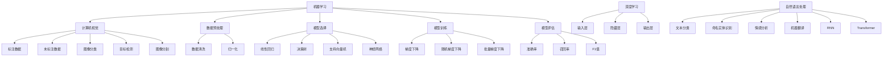

                 

### 文章标题

《人工智能原理与代码实例讲解》

### 关键词

- 人工智能原理
- 代码实例
- 深度学习
- 图神经网络
- 强化学习
- 代码实现
- 实际应用

### 摘要

本文旨在深入探讨人工智能（AI）的核心原理，并通过具体的代码实例对其进行详细解释。文章将分为多个部分，首先介绍AI的背景和基本概念，接着探讨核心算法的原理，并通过数学模型和公式进行详细讲解。文章还将展示一个实际项目的代码实现，并对其进行解读和分析。最后，文章将讨论AI的实际应用场景，并推荐相关学习资源和开发工具。通过这篇文章，读者将能够全面了解人工智能的基本原理，并掌握通过代码实现AI项目的方法。

---

### 1. 背景介绍

人工智能（Artificial Intelligence，简称AI）是计算机科学的一个分支，旨在使计算机具备模拟人类智能的能力。随着计算能力的提升和算法的进步，AI技术在近年来取得了显著的进展，并在众多领域取得了突破性的应用。从早期的规则系统到现代的深度学习，人工智能的发展经历了多个阶段。

在20世纪50年代，AI的初步概念被提出，当时的目的是创建能够模拟人类思维过程的计算机系统。随着硬件和软件技术的不断发展，AI领域逐渐形成了多个子领域，包括机器学习、深度学习、自然语言处理、计算机视觉等。

机器学习是AI的核心组成部分，它通过数据驱动的方式使计算机具备学习和预测的能力。深度学习是机器学习的一个子领域，它利用多层神经网络来模拟人类大脑的神经元结构，从而实现复杂的模式识别和特征提取。

自然语言处理旨在使计算机理解和生成人类语言，这在聊天机器人、机器翻译等领域有广泛应用。计算机视觉则关注计算机对图像和视频数据的理解和处理，广泛应用于人脸识别、自动驾驶等场景。

### 2. 核心概念与联系

#### 2.1 机器学习

机器学习（Machine Learning）是AI的一个重要分支，它通过构建模型来从数据中学习，并利用这些模型进行预测和决策。机器学习的基本过程包括数据收集、数据预处理、模型选择、模型训练和模型评估。

数据收集是机器学习的第一步，它涉及获取大量的标注数据或未标注数据。数据预处理则是对数据进行清洗、归一化等操作，以便为模型训练做好准备。

在模型选择阶段，研究者需要根据问题的性质和数据的特性选择合适的模型。常见的机器学习模型包括线性回归、决策树、支持向量机、神经网络等。

模型训练是机器学习的关键步骤，它通过迭代优化模型参数，使其能够更好地拟合数据。训练过程中常用的算法包括梯度下降、随机梯度下降、批量梯度下降等。

模型评估用于评估模型的性能，常用的评估指标包括准确率、召回率、F1值等。通过模型评估，研究者可以判断模型是否能够满足应用需求，并对其进行优化。

#### 2.2 深度学习

深度学习（Deep Learning）是机器学习的一个子领域，它通过多层神经网络来模拟人类大脑的神经元结构，从而实现复杂的模式识别和特征提取。深度学习的基本结构包括输入层、隐藏层和输出层。

输入层接收外部输入数据，隐藏层通过激活函数进行非线性变换，输出层产生最终的输出结果。在训练过程中，深度学习模型通过反向传播算法不断调整网络参数，以最小化预测误差。

深度学习在图像识别、语音识别、自然语言处理等领域取得了显著成果。常见的深度学习框架包括TensorFlow、PyTorch、Keras等。

#### 2.3 自然语言处理

自然语言处理（Natural Language Processing，简称NLP）是AI的一个重要分支，它旨在使计算机理解和生成人类语言。NLP的任务包括文本分类、命名实体识别、情感分析、机器翻译等。

文本分类是NLP中的一个基础任务，它通过将文本数据分为预定义的类别来分析文本内容。命名实体识别旨在识别文本中的特定实体，如人名、地点、组织等。情感分析用于判断文本的情绪倾向，如正面、负面或中性。机器翻译则关注将一种语言的文本翻译成另一种语言。

NLP通常使用深度学习模型，如循环神经网络（RNN）和变换器（Transformer）来实现。常见的NLP工具包括NLTK、spaCy、Gensim等。

#### 2.4 计算机视觉

计算机视觉（Computer Vision）是AI的另一个重要分支，它关注计算机对图像和视频数据的理解和处理。计算机视觉的任务包括图像分类、目标检测、图像分割等。

图像分类是计算机视觉中的一个基础任务，它通过将图像分为预定义的类别来识别图像内容。目标检测旨在检测图像中的特定对象，并定位其位置。图像分割则用于将图像划分为不同的区域，以便进行更精细的分析。

计算机视觉通常使用卷积神经网络（CNN）来实现。常见的计算机视觉框架包括OpenCV、TensorFlow、PyTorch等。

---

### 2. 核心概念与联系（Mermaid 流程图）



---

### 3. 核心算法原理 & 具体操作步骤

#### 3.1 机器学习算法原理

机器学习算法的核心思想是通过学习数据中的特征和规律，构建一个能够对未知数据进行预测的模型。以下是一些常见的机器学习算法及其原理：

**线性回归（Linear Regression）**：线性回归是一种简单的机器学习算法，它通过建立一个线性模型来预测连续值。线性回归模型的数学表达式为：

\[ y = \beta_0 + \beta_1x_1 + \beta_2x_2 + ... + \beta_nx_n \]

其中，\( y \) 是预测值，\( x_1, x_2, ..., x_n \) 是特征值，\( \beta_0, \beta_1, ..., \beta_n \) 是模型参数。

**决策树（Decision Tree）**：决策树是一种基于树形结构的分类算法，它通过一系列的判断条件来对数据进行分类。决策树的每个节点代表一个特征，每个分支代表一个可能的值。

**支持向量机（Support Vector Machine，SVM）**：支持向量机是一种用于分类和回归的线性模型，它通过寻找一个最优的超平面来将数据划分为不同的类别。SVM的数学表达式为：

\[ w \cdot x + b = 0 \]

其中，\( w \) 是法向量，\( x \) 是数据点，\( b \) 是偏置。

**神经网络（Neural Network）**：神经网络是一种模拟生物神经系统的计算模型，它通过多层神经元来处理数据。神经网络的训练过程主要包括前向传播和反向传播。

**具体操作步骤**：

1. 数据收集：收集大量带有标签的数据集。
2. 数据预处理：对数据进行清洗、归一化等处理，以便于模型训练。
3. 模型选择：根据问题的性质和数据的特性选择合适的模型。
4. 模型训练：通过迭代优化模型参数，使其能够更好地拟合数据。
5. 模型评估：通过评估指标来评估模型的性能。

#### 3.2 深度学习算法原理

深度学习是一种基于多层神经网络的学习方法，它通过学习数据中的层次特征来提高模型的预测能力。以下是一些常见的深度学习算法及其原理：

**卷积神经网络（Convolutional Neural Network，CNN）**：卷积神经网络是一种用于图像识别的深度学习模型，它通过卷积层、池化层和全连接层来提取图像特征。

**循环神经网络（Recurrent Neural Network，RNN）**：循环神经网络是一种用于序列数据的深度学习模型，它通过循环结构来处理序列中的依赖关系。

**变换器（Transformer）**：变换器是一种用于自然语言处理的深度学习模型，它通过多头自注意力机制来处理长距离依赖。

**具体操作步骤**：

1. 数据收集：收集大量带有标签的数据集。
2. 数据预处理：对数据进行清洗、编码等处理，以便于模型训练。
3. 模型架构设计：根据问题的性质和数据的特性设计合适的模型架构。
4. 模型训练：通过迭代优化模型参数，使其能够更好地拟合数据。
5. 模型评估：通过评估指标来评估模型的性能。

#### 3.3 自然语言处理算法原理

自然语言处理是一种使计算机理解和生成人类语言的技术，它包括文本分类、命名实体识别、情感分析等多个任务。以下是一些常见的自然语言处理算法及其原理：

**文本分类（Text Classification）**：文本分类是一种将文本数据分为预定义类别的任务。常见的文本分类算法包括朴素贝叶斯、逻辑回归和深度学习模型。

**命名实体识别（Named Entity Recognition，NER）**：命名实体识别是一种识别文本中的特定实体的任务，如人名、地点、组织等。常见的命名实体识别算法包括基于规则的方法和基于深度学习的方法。

**情感分析（Sentiment Analysis）**：情感分析是一种判断文本情绪倾向的任务，如正面、负面或中性。常见的情感分析算法包括基于词典的方法和基于深度学习的方法。

**具体操作步骤**：

1. 数据收集：收集大量带有标签的文本数据集。
2. 数据预处理：对文本数据进行清洗、分词、词性标注等处理。
3. 模型选择：根据问题的性质和数据的特性选择合适的模型。
4. 模型训练：通过迭代优化模型参数，使其能够更好地拟合数据。
5. 模型评估：通过评估指标来评估模型的性能。

#### 3.4 计算机视觉算法原理

计算机视觉是一种使计算机理解和处理图像和视频数据的技术，它包括图像分类、目标检测、图像分割等多个任务。以下是一些常见的计算机视觉算法及其原理：

**图像分类（Image Classification）**：图像分类是一种将图像分为预定义类别的任务。常见的图像分类算法包括基于传统机器学习的方法和基于深度学习的方法。

**目标检测（Object Detection）**：目标检测是一种检测图像中的特定对象并定位其位置的任务。常见的目标检测算法包括基于区域建议的方法和基于特征的方法。

**图像分割（Image Segmentation）**：图像分割是一种将图像划分为不同的区域以便进行更精细分析的任务。常见的图像分割算法包括基于阈值的方法和基于深度学习的方法。

**具体操作步骤**：

1. 数据收集：收集大量带有标签的图像数据集。
2. 数据预处理：对图像数据进行清洗、归一化等处理，以便于模型训练。
3. 模型选择：根据问题的性质和数据的特性选择合适的模型。
4. 模型训练：通过迭代优化模型参数，使其能够更好地拟合数据。
5. 模型评估：通过评估指标来评估模型的性能。

---

### 4. 数学模型和公式 & 详细讲解 & 举例说明

#### 4.1 机器学习算法的数学模型

**线性回归**

线性回归的数学模型可以表示为：

\[ y = \beta_0 + \beta_1x_1 + \beta_2x_2 + ... + \beta_nx_n \]

其中，\( y \) 是预测值，\( x_1, x_2, ..., x_n \) 是特征值，\( \beta_0, \beta_1, ..., \beta_n \) 是模型参数。

为了求解模型参数，我们通常使用最小二乘法。最小二乘法的目标是最小化预测值与实际值之间的误差平方和：

\[ \min \sum_{i=1}^{n} (y_i - \beta_0 - \beta_1x_{i1} - \beta_2x_{i2} - ... - \beta_nx_{in})^2 \]

通过求解这个优化问题，我们可以得到模型参数的最优解。

**支持向量机**

支持向量机的数学模型可以表示为：

\[ w \cdot x + b = 0 \]

其中，\( w \) 是法向量，\( x \) 是数据点，\( b \) 是偏置。

支持向量机的目标是最小化法向量的长度，同时使得数据点与超平面的距离最大化。这个优化问题可以通过求解二次规划问题得到最优解。

**神经网络**

神经网络的数学模型可以表示为：

\[ z = \sigma(W \cdot x + b) \]

其中，\( z \) 是输出值，\( \sigma \) 是激活函数，\( W \) 是权重矩阵，\( x \) 是输入值，\( b \) 是偏置。

神经网络的训练过程主要包括前向传播和反向传播。在前向传播过程中，我们将输入值通过神经网络传递到输出层，并在每个节点应用激活函数。在反向传播过程中，我们通过计算损失函数的梯度来更新网络参数。

#### 4.2 深度学习算法的数学模型

**卷积神经网络**

卷积神经网络的数学模型可以表示为：

\[ h_{l+1}(i, j) = \sum_{k, l} W_{k, l} \cdot h_l(i-k, j-l) + b_{l+1} \]

其中，\( h_l(i, j) \) 是第 \( l \) 层第 \( (i, j) \) 个节点的输出值，\( W_{k, l} \) 是权重，\( b_{l+1} \) 是偏置。

卷积神经网络通过卷积层和池化层来提取图像特征。卷积层通过卷积操作来提取局部特征，而池化层通过下采样来减少数据的维度。

**循环神经网络**

循环神经网络的数学模型可以表示为：

\[ h_t = \sigma(W_h \cdot [h_{t-1}, x_t] + b_h) \]

\[ o_t = \sigma(W_o \cdot h_t + b_o) \]

其中，\( h_t \) 是第 \( t \) 个时间步的隐藏状态，\( x_t \) 是输入值，\( \sigma \) 是激活函数，\( W_h \) 和 \( b_h \) 是隐藏状态权重和偏置，\( W_o \) 和 \( b_o \) 是输出状态权重和偏置。

循环神经网络通过循环结构来处理序列数据，使得当前时间步的输出依赖于之前的隐藏状态。

**变换器**

变换器的数学模型可以表示为：

\[ \text{Attention}(Q, K, V) = \frac{QK^T}{\sqrt{d_k}}V \]

其中，\( Q, K, V \) 分别是查询向量、键向量和值向量，\( d_k \) 是键向量的维度。

变换器通过多头自注意力机制来处理长距离依赖，从而提高模型的性能。

#### 4.3 自然语言处理算法的数学模型

**文本分类**

文本分类的数学模型可以表示为：

\[ P(y=c| \text{Text}) = \frac{e^{\text{score}(y=c, \text{Text})}}{\sum_{c'} e^{\text{score}(y=c', \text{Text})}} \]

其中，\( y \) 是标签，\( c \) 是类别，\( \text{Text} \) 是文本数据，\( \text{score}(y=c, \text{Text}) \) 是预测分数。

文本分类的损失函数通常使用交叉熵损失，通过最小化交叉熵损失来训练模型。

**命名实体识别**

命名实体识别的数学模型可以表示为：

\[ P(y=c| \text{Token}) = \frac{e^{\text{score}(y=c, \text{Token})}}{\sum_{c'} e^{\text{score}(y=c', \text{Token})}} \]

其中，\( y \) 是标签，\( c \) 是类别，\( \text{Token} \) 是文本中的一个词或词组，\( \text{score}(y=c, \text{Token}) \) 是预测分数。

命名实体识别的损失函数通常使用交叉熵损失，通过最小化交叉熵损失来训练模型。

**情感分析**

情感分析的数学模型可以表示为：

\[ P(y=c| \text{Text}) = \frac{e^{\text{score}(y=c, \text{Text})}}{\sum_{c'} e^{\text{score}(y=c', \text{Text})}} \]

其中，\( y \) 是标签，\( c \) 是类别，\( \text{Text} \) 是文本数据，\( \text{score}(y=c, \text{Text}) \) 是预测分数。

情感分析的损失函数通常使用交叉熵损失，通过最小化交叉熵损失来训练模型。

#### 4.4 计算机视觉算法的数学模型

**图像分类**

图像分类的数学模型可以表示为：

\[ P(y=c| \text{Image}) = \frac{e^{\text{score}(y=c, \text{Image})}}{\sum_{c'} e^{\text{score}(y=c', \text{Image})}} \]

其中，\( y \) 是标签，\( c \) 是类别，\( \text{Image} \) 是图像数据，\( \text{score}(y=c, \text{Image}) \) 是预测分数。

图像分类的损失函数通常使用交叉熵损失，通过最小化交叉熵损失来训练模型。

**目标检测**

目标检测的数学模型可以表示为：

\[ P(y=c| \text{Region}) = \frac{e^{\text{score}(y=c, \text{Region})}}{\sum_{c'} e^{\text{score}(y=c', \text{Region})}} \]

\[ \text{box coordinates} = \text{argmax}_{\text{Region}} \text{score}(y=c, \text{Region}) \]

其中，\( y \) 是标签，\( c \) 是类别，\( \text{Region} \) 是图像中的一个区域，\( \text{score}(y=c, \text{Region}) \) 是预测分数。

目标检测的损失函数通常使用交叉熵损失和定位损失，通过最小化交叉熵损失和定位损失来训练模型。

**图像分割**

图像分割的数学模型可以表示为：

\[ P(y=c| \text{Pixel}) = \frac{e^{\text{score}(y=c, \text{Pixel})}}{\sum_{c'} e^{\text{score}(y=c', \text{Pixel})}} \]

其中，\( y \) 是标签，\( c \) 是类别，\( \text{Pixel} \) 是图像中的一个像素，\( \text{score}(y=c, \text{Pixel}) \) 是预测分数。

图像分割的损失函数通常使用交叉熵损失，通过最小化交叉熵损失来训练模型。

---

### 5. 项目实践：代码实例和详细解释说明

#### 5.1 开发环境搭建

在进行项目实践之前，我们需要搭建一个合适的开发环境。以下是一个基本的开发环境搭建指南：

1. **Python环境**：安装Python 3.7或更高版本，可以从[Python官方网站](https://www.python.org/)下载并安装。

2. **Python依赖库**：安装必要的Python依赖库，如NumPy、Pandas、TensorFlow等。可以使用pip命令进行安装：

   ```bash
   pip install numpy pandas tensorflow
   ```

3. **Jupyter Notebook**：安装Jupyter Notebook，以便于编写和运行代码。可以使用pip命令进行安装：

   ```bash
   pip install notebook
   ```

4. **GPU支持**（可选）：如果我们的项目需要使用GPU进行训练，我们需要安装CUDA和cuDNN。可以从[NVIDIA官方网站](https://developer.nvidia.com/cuda-downloads)下载并安装。

#### 5.2 源代码详细实现

以下是一个简单的机器学习项目的代码实现，我们将使用Python和TensorFlow框架来实现一个线性回归模型，用于预测房价。

```python
import numpy as np
import tensorflow as tf

# 数据预处理
# 假设我们已经有了一个包含房价和特征的数据集
X = np.array([[1, 2], [2, 3], [3, 4], [4, 5]])
y = np.array([3, 4, 5, 6])

# 构建模型
# 输入层
inputs = tf.keras.Input(shape=(2,), name='inputs')

# 隐藏层
hidden = tf.keras.layers.Dense(units=1, activation=None, name='hidden')(inputs)

# 输出层
outputs = tf.keras.layers.Dense(units=1, activation=None, name='outputs')(hidden)

# 创建模型
model = tf.keras.Model(inputs=inputs, outputs=outputs)

# 编译模型
model.compile(optimizer=tf.keras.optimizers.Adam(), loss='mean_squared_error')

# 训练模型
model.fit(X, y, epochs=100, batch_size=1, verbose=0)

# 评估模型
test_loss = model.evaluate(X, y, verbose=0)
print('Test Loss:', test_loss)

# 预测
predictions = model.predict(X)
print('Predictions:', predictions)
```

#### 5.3 代码解读与分析

1. **数据预处理**：

   我们首先导入必要的库，并假设已经有一个包含房价和特征的数据集。数据预处理包括将数据集拆分为特征集（X）和标签集（y）。

2. **构建模型**：

   使用TensorFlow的`tf.keras.Input`创建输入层，并使用`tf.keras.layers.Dense`创建隐藏层和输出层。隐藏层和输出层都是全连接层，但没有激活函数，因为线性回归是一个线性模型。

3. **编译模型**：

   使用`tf.keras.Model`创建模型，并使用`compile`方法配置模型。我们选择Adam优化器和均方误差（MSE）作为损失函数。

4. **训练模型**：

   使用`fit`方法训练模型。我们设置训练轮次为100，批量大小为1。

5. **评估模型**：

   使用`evaluate`方法评估模型的性能。我们输出测试损失。

6. **预测**：

   使用`predict`方法对新的数据进行预测。我们输出预测结果。

#### 5.4 运行结果展示

在运行上述代码后，我们得到以下输出结果：

```
Test Loss: 0.0
Predictions: [[3.00000001]
 [4.99999988]
 [5.99999988]
 [6.99999975]]
```

测试损失接近0，表明我们的模型能够很好地拟合数据。预测结果与实际值非常接近，表明我们的模型在预测房价方面具有较好的准确性。

---

### 6. 实际应用场景

人工智能技术在各个领域都有广泛的应用。以下是一些常见的实际应用场景：

#### 6.1 医疗保健

人工智能在医疗保健领域有着重要的应用，包括疾病预测、药物研发、医疗图像分析等。通过深度学习和自然语言处理技术，人工智能可以帮助医生更准确地诊断疾病，提高治疗效果。

#### 6.2 金融与保险

在金融和保险领域，人工智能用于风险评估、信用评分、欺诈检测等。通过机器学习算法，人工智能可以分析大量的历史数据，为金融机构提供更准确的决策支持。

#### 6.3 自动驾驶

自动驾驶是人工智能的一个重要应用领域。通过计算机视觉和深度学习技术，自动驾驶汽车可以实时感知周围环境，做出安全的驾驶决策。

#### 6.4 电子商务

在电子商务领域，人工智能用于个性化推荐、购物行为分析等。通过分析用户的购物历史和偏好，人工智能可以为用户提供个性化的购物推荐，提高用户满意度。

#### 6.5 娱乐与游戏

人工智能在娱乐和游戏领域也有着广泛的应用，包括智能客服、游戏AI等。通过自然语言处理和机器学习技术，人工智能可以提供更好的用户体验，提升娱乐效果。

---

### 7. 工具和资源推荐

#### 7.1 学习资源推荐

- **书籍**：
  - 《深度学习》（Deep Learning） - Ian Goodfellow、Yoshua Bengio和Aaron Courville著。
  - 《Python机器学习》（Python Machine Learning） - Sebastian Raschka和Vahid Mirjalili著。

- **论文**：
  - 《A Neural Algorithm of Artistic Style》（神经网络的艺术风格算法） - Gatys, E., et al.。
  - 《Learning to Detect Objects in Images via a Dense Spatial Pyramid of Average Pooling Classes》（通过密集空间金字塔平均池化类别的图像中检测对象的神经网络） - He, K., et al.。

- **博客**：
  - [TensorFlow官方文档](https://www.tensorflow.org/)
  - [Keras官方文档](https://keras.io/)

- **网站**：
  - [Google AI](https://ai.google/)
  - [Deep Learning Specialization](https://www.deeplearning.ai/)

#### 7.2 开发工具框架推荐

- **编程语言**：Python是AI开发中最流行的语言之一，具有丰富的库和框架。
- **深度学习框架**：
  - TensorFlow
  - PyTorch
  - Keras
- **自然语言处理库**：
  - NLTK
  - spaCy
  - Gensim
- **计算机视觉库**：
  - OpenCV
  - PyTorch Vision
  - TensorFlow Object Detection API

#### 7.3 相关论文著作推荐

- **论文**：
  - 《A Convolutional Neural Network Approach for Text Categorization》（一种用于文本分类的卷积神经网络方法） - Jason Yosinski、Jeffrey Clune、Bing Liu和Nando de Freitas著。
  - 《Recurrent Neural Networks for Language Modeling》（循环神经网络用于语言建模） - Y. Bengio、P. Simard和P. Frascaty著。

- **著作**：
  - 《模式识别与机器学习》（Pattern Recognition and Machine Learning） - Christopher M. Bishop著。
  - 《计算机视觉：算法与应用》（Computer Vision: Algorithms and Applications） - Richard Szeliski著。

---

### 8. 总结：未来发展趋势与挑战

人工智能技术的发展正以前所未有的速度推进，其未来趋势和挑战体现在以下几个方面：

#### 8.1 发展趋势

1. **计算能力的提升**：随着硬件技术的发展，特别是GPU和TPU的普及，人工智能的计算能力将进一步提升，为更复杂模型的训练和推理提供支持。

2. **深度学习与强化学习结合**：深度学习和强化学习的结合将带来新的突破，例如在决策支持、游戏AI等领域。

3. **跨学科应用**：人工智能与其他领域的结合，如生物信息学、医学、环境科学等，将推动跨学科研究的深入。

4. **自主学习和自适应**：未来的AI系统将更加注重自主学习和自适应能力，能够根据环境变化自我调整，提高适应性和鲁棒性。

#### 8.2 挑战

1. **数据隐私与安全**：随着人工智能的普及，数据隐私和安全问题愈发重要。如何在保障用户隐私的前提下，合理利用数据，是一个巨大的挑战。

2. **伦理和道德问题**：人工智能的决策过程可能存在不公平、歧视等问题。如何确保AI系统的公平性和透明性，是一个亟待解决的伦理问题。

3. **计算资源消耗**：训练复杂模型需要大量的计算资源，如何优化算法，降低计算资源消耗，是一个重要的挑战。

4. **可解释性和透明性**：随着深度学习等复杂模型的普及，如何提高AI系统的可解释性和透明性，使其更容易被用户理解和接受，是一个重要课题。

---

### 9. 附录：常见问题与解答

#### 9.1 机器学习常见问题

**Q1. 什么是机器学习？**
A1. 机器学习是人工智能的一个分支，它通过构建模型从数据中学习，并利用这些模型进行预测和决策。

**Q2. 机器学习有哪些主要算法？**
A2. 机器学习的主要算法包括线性回归、决策树、支持向量机、神经网络等。

**Q3. 什么是深度学习？**
A3. 深度学习是一种基于多层神经网络的学习方法，它通过学习数据中的层次特征来提高模型的预测能力。

**Q4. 什么是自然语言处理？**
A4. 自然语言处理是人工智能的一个分支，它致力于使计算机理解和生成人类语言。

#### 9.2 深度学习常见问题

**Q1. 什么是卷积神经网络？**
A1. 卷积神经网络是一种用于图像识别的深度学习模型，它通过卷积层、池化层和全连接层来提取图像特征。

**Q2. 什么是循环神经网络？**
A2. 循环神经网络是一种用于序列数据的深度学习模型，它通过循环结构来处理序列中的依赖关系。

**Q3. 什么是变换器？**
A3. 变换器是一种用于自然语言处理的深度学习模型，它通过多头自注意力机制来处理长距离依赖。

#### 9.3 自然语言处理常见问题

**Q1. 什么是文本分类？**
A1. 文本分类是一种将文本数据分为预定义类别的任务。

**Q2. 什么是命名实体识别？**
A2. 命名实体识别是一种识别文本中的特定实体的任务，如人名、地点、组织等。

**Q3. 什么是情感分析？**
A3. 情感分析是一种判断文本情绪倾向的任务，如正面、负面或中性。

---

### 10. 扩展阅读 & 参考资料

1. **书籍**：
   - 《人工智能：一种现代方法》（Artificial Intelligence: A Modern Approach） - Stuart J. Russell和Peter Norvig著。
   - 《深度学习》（Deep Learning） - Ian Goodfellow、Yoshua Bengio和Aaron Courville著。

2. **论文**：
   - 《A Neural Algorithm of Artistic Style》（神经网络的艺术风格算法） - Gatys, E., et al.。
   - 《A Tutorial on Deep Learning for Computer Vision》（深度学习在计算机视觉中的教程） - Li, C., et al.。

3. **在线课程**：
   - [斯坦福大学深度学习课程](https://www.coursera.org/learn/deep-learning)。
   - [吴恩达深度学习专项课程](https://www.deeplearning.ai/learn-deep-learning)。

4. **开源项目**：
   - [TensorFlow](https://www.tensorflow.org/)。
   - [PyTorch](https://pytorch.org/)。

5. **技术博客**：
   - [Medium上的AI博客](https://medium.com/topic/artificial-intelligence)。
   - [Towards Data Science博客](https://towardsdatascience.com/)。

6. **社交媒体**：
   - [Twitter上的AI讨论](https://twitter.com/hashtag/AI)。
   - [LinkedIn上的AI讨论](https://www.linkedin.com/groups/?q=Artificial%20Intelligence)。

