                 

### 1. 背景介绍

#### 1.1 人工智能与人机交互的定义

人工智能（Artificial Intelligence，简称AI）是一种模拟人类智能的技术，通过机器学习、深度学习、自然语言处理等多种技术手段，使计算机具备感知、理解、学习、推理和决策能力。人机交互（Human-Computer Interaction，简称HCI）则是指用户与计算机系统之间的交互过程，目的是让计算机更加直观、便捷地服务于用户，提升用户体验。

随着科技的不断进步，人工智能技术在人机交互领域得到了广泛应用，极大地改变了人们的日常生活和工作方式。例如，智能语音助手、智能推荐系统、智能聊天机器人等，都极大地提升了人机交互的效率和便捷性。

#### 1.2 人工智能在人机交互中的发展历程

人工智能与人机交互的结合可以追溯到20世纪50年代，当时计算机科学刚刚起步。最初的尝试主要集中在自然语言处理领域，如早期的语言翻译系统和问答机器。然而，由于技术的限制，这些系统往往只能处理简单的任务，且效果不佳。

20世纪80年代，随着计算机性能的提升和机器学习技术的发展，人工智能在人机交互中的应用逐渐增多。这一时期的代表性成果包括语音识别系统和文字识别系统，这些技术使得计算机能够更准确地理解和处理用户的语音和文字指令。

进入21世纪，深度学习和大数据技术的兴起，为人工智能在人机交互中的应用带来了新的契机。智能语音助手如苹果的Siri、谷歌的Google Assistant和亚马逊的Alexa等相继问世，它们能够识别并响应用户的自然语言指令，为用户提供了便捷的交互方式。

#### 1.3 人工智能在人机交互中的现状

当前，人工智能在人机交互中的应用已经渗透到各个领域，从智能家居、智能医疗、智能教育到智能客服、智能驾驶等。以下是一些典型的应用场景：

1. **智能家居**：智能音箱、智能灯光、智能安防等设备，通过语音指令或手机APP实现远程控制，提升了家庭生活的智能化水平。
2. **智能医疗**：基于人工智能的医学影像分析、疾病预测和智能诊断，为医疗工作者提供了有力支持，提高了诊断的准确性和效率。
3. **智能教育**：智能辅导系统、在线教育平台等，通过个性化推荐和智能互动，提升了教育的质量和效率。
4. **智能客服**：通过聊天机器人和语音识别技术，企业能够提供24/7的全天候客户服务，提升了客户满意度。
5. **智能驾驶**：自动驾驶技术利用人工智能技术实现车辆的自动感知、决策和控制，为交通安全和出行效率带来了革命性的改变。

综上所述，人工智能与人机交互的结合已经取得了显著的成果，并且在未来将继续发展，带来更多的变革和创新。在接下来的章节中，我们将深入探讨人工智能在人机交互中的核心概念、算法原理、数学模型，以及实际应用案例，以期为您展现这一领域的广阔前景。

#### 1.4 人工智能与人机交互的结合带来的影响

人工智能与人机交互的结合，不仅改变了人们的生活方式，也对各个领域产生了深远的影响。

首先，在提升用户体验方面，人工智能技术使得人机交互更加自然、直观和便捷。例如，智能语音助手能够理解用户的自然语言指令，并提供相应的服务；智能推荐系统则根据用户的兴趣和行为，为用户提供个性化的内容推荐，大大提升了用户体验。

其次，在提高工作效率方面，人工智能技术通过自动化和智能化，极大地减轻了人类的工作负担。例如，智能客服系统能够自动处理大量的客户咨询，节省了人力资源；智能驾驶技术能够自动处理复杂的路况信息，提高了出行的安全性和效率。

此外，人工智能与人机交互的结合也在推动创新和产业升级。例如，在医疗领域，智能诊断系统能够辅助医生进行诊断，提高诊断的准确性和效率；在教育领域，智能辅导系统可以根据学生的学习情况，提供个性化的教学方案，从而提升教育质量。

然而，人工智能与人机交互的结合也带来了一些挑战。例如，隐私保护问题、数据安全问题、伦理道德问题等，都需要我们认真思考和解决。如何确保人工智能系统的透明性和可解释性，避免对人类社会的潜在风险，是当前亟待解决的重要课题。

总之，人工智能与人机交互的结合带来了巨大的机遇和挑战。通过深入研究和创新，我们有望在未来实现更加智能、高效和便捷的人机交互，为人类社会的发展做出更大贡献。

#### 1.5 人工智能在人机交互中的核心概念

要深入了解人工智能在人机交互中的应用，我们首先需要明确一些核心概念。以下是几个关键的概念：

1. **自然语言处理（Natural Language Processing，NLP）**：自然语言处理是人工智能的一个重要分支，旨在让计算机理解和生成人类语言。在人工智能与人机交互的结合中，自然语言处理技术被广泛应用于语音识别、语音合成、语义理解、机器翻译等领域。例如，智能语音助手需要通过语音识别将用户的语音指令转换为文本，然后通过自然语言处理理解指令的含义，最后生成相应的回复。

2. **机器学习（Machine Learning，ML）**：机器学习是使计算机具备学习能力的一种技术，通过从数据中学习规律，实现自动化的决策和预测。在人机交互中，机器学习技术被广泛应用于个性化推荐、情感分析、行为预测等领域。例如，智能推荐系统通过分析用户的兴趣和行为数据，为用户推荐个性化内容；情感分析则用于理解用户的情绪，从而提供更加人性化的交互体验。

3. **深度学习（Deep Learning，DL）**：深度学习是机器学习的一个分支，通过多层神经网络模型，实现更加复杂的特征提取和模式识别。在人工智能与人机交互的结合中，深度学习技术被广泛应用于图像识别、语音识别、自然语言处理等领域。例如，深度学习模型能够自动识别图像中的物体，语音识别系统能够准确地将语音转换为文本。

4. **用户行为分析（User Behavior Analysis）**：用户行为分析是指通过分析用户在系统中的行为数据，理解用户的兴趣、需求和行为模式。在人机交互中，用户行为分析被广泛应用于个性化推荐、用户画像构建、异常行为检测等领域。例如，个性化推荐系统通过分析用户的历史行为数据，为用户推荐其可能感兴趣的内容；异常行为检测则用于识别系统中的异常操作，提高系统的安全性和可靠性。

5. **情感计算（Affective Computing）**：情感计算是研究如何使计算机具备识别、理解、处理人类情感的能力。在人机交互中，情感计算技术被广泛应用于情感识别、情感表达、情感交互等领域。例如，情感识别技术可以理解用户的情感状态，从而提供更加人性化的交互服务；情感表达则用于使计算机能够模拟人类的情感表达，增强人机交互的自然性和亲和力。

通过理解这些核心概念，我们可以更好地把握人工智能在人机交互中的应用，并在实际项目中实现更加智能、高效和人性化的交互体验。

### 2. 核心概念与联系

在了解了人工智能与人机交互的基本背景和核心概念之后，我们需要进一步探讨这些核心概念之间的联系，并使用Mermaid流程图来展示它们之间的相互作用。

#### 2.1 自然语言处理（NLP）

自然语言处理是人工智能与人机交互结合的重要桥梁。NLP主要解决的是如何让计算机理解和生成人类语言。它包括以下几个关键组成部分：

1. **分词（Tokenization）**：将文本拆分成单词或其他有意义的标记。
2. **词性标注（Part-of-Speech Tagging）**：标注每个词的词性，如名词、动词、形容词等。
3. **句法分析（Syntactic Parsing）**：分析句子的结构，确定词与词之间的关系。
4. **语义理解（Semantic Understanding）**：理解句子所表达的意思，包括实体识别、情感分析等。

Mermaid流程图如下：

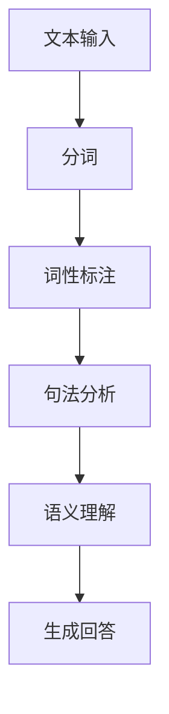

#### 2.2 机器学习（ML）

机器学习是人工智能的核心技术，它使计算机具备从数据中学习的能力。在NLP和人机交互中，机器学习被广泛应用于：

1. **监督学习（Supervised Learning）**：通过已标注的数据训练模型，如分类、回归等。
2. **无监督学习（Unsupervised Learning）**：在未标注的数据中寻找模式和规律，如聚类、降维等。
3. **强化学习（Reinforcement Learning）**：通过与环境的交互来学习最优策略。

Mermaid流程图如下：

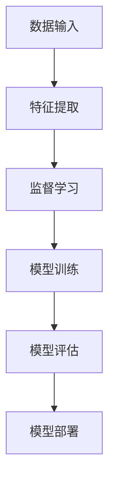

#### 2.3 深度学习（DL）

深度学习是机器学习的一个分支，通过多层神经网络实现复杂的特征提取和模式识别。深度学习在NLP和人机交互中应用广泛，主要包括：

1. **卷积神经网络（CNN）**：用于图像识别和文本分类。
2. **循环神经网络（RNN）**：用于序列数据的处理，如语音识别、自然语言处理。
3. **长短时记忆网络（LSTM）**：RNN的改进版本，用于解决长序列依赖问题。
4. **生成对抗网络（GAN）**：用于生成逼真的图像、文本等。

Mermaid流程图如下：

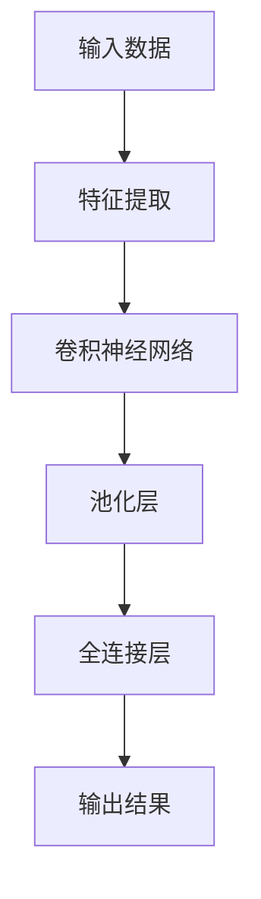

#### 2.4 用户行为分析（User Behavior Analysis）

用户行为分析是指通过分析用户在系统中的行为数据，理解用户的兴趣、需求和行为模式。它是实现个性化推荐和人机交互优化的重要手段。

1. **用户画像（User Profiling）**：基于用户的行为数据，构建用户的兴趣、偏好等特征。
2. **行为预测（Behavior Prediction）**：通过历史行为数据预测用户的未来行为。
3. **异常检测（Anomaly Detection）**：识别系统中的异常行为，如欺诈、恶意攻击等。

Mermaid流程图如下：

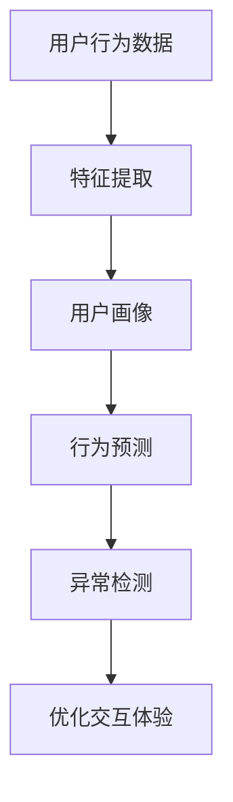

#### 2.5 情感计算（Affective Computing）

情感计算是研究如何使计算机识别、理解、处理人类情感的能力。在NLP和人机交互中，情感计算被广泛应用于情感识别、情感交互等。

1. **情感识别（Emotion Recognition）**：通过语音、文本、图像等数据识别用户的情感状态。
2. **情感表达（Emotion Expression）**：计算机模拟人类的情感表达，如语音、文本的情感增强等。
3. **情感交互（Emotion Interaction）**：设计具有情感识别和表达能力的交互系统，提高人机交互的自然性和亲和力。

Mermaid流程图如下：

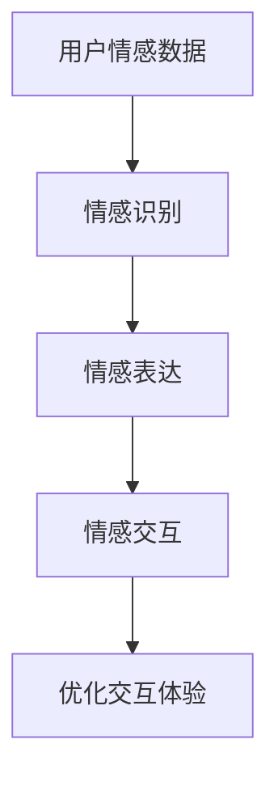

通过上述核心概念的介绍和Mermaid流程图的展示，我们可以清晰地看到人工智能与人机交互之间的紧密联系。在下一章节中，我们将深入探讨这些核心概念的具体算法原理和实现步骤。

### 2.1. 自然语言处理（NLP）

自然语言处理（NLP）是人工智能领域的一个重要分支，它致力于使计算机能够理解、生成和处理人类语言。NLP在人工智能与人机交互中的应用非常广泛，涵盖了语音识别、文本分析、机器翻译等多个方面。本节将详细探讨NLP的核心算法原理和具体实现步骤。

#### 2.1.1 语音识别

语音识别是将语音信号转换为对应的文本信息，使得计算机能够理解和响应用户的语音指令。语音识别的基本流程包括以下几步：

1. **特征提取**：将语音信号转换为特征向量。常用的特征提取方法包括梅尔频率倒谱系数（MFCC）和线性预测频谱（LPCC）等。
2. **声学模型**：声学模型用于描述语音信号的统计特性，常用的声学模型包括高斯混合模型（GMM）和深度神经网络（DNN）等。
3. **语言模型**：语言模型用于描述文本的统计特性，常用的语言模型包括N元语法模型和隐马尔可夫模型（HMM）等。
4. **解码**：解码是将特征序列映射到最可能的文本序列。常用的解码算法包括动态规划算法（如Viterbi算法）和基于神经网络的解码算法。

以下是一个简单的Mermaid流程图，展示了语音识别的基本流程：

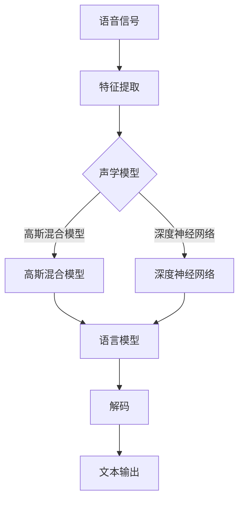

#### 2.1.2 文本分析

文本分析是指对文本数据进行分析和处理，以提取有用信息和知识。文本分析的基本流程包括以下几步：

1. **分词**：将文本拆分成单词或其他有意义的标记。常用的分词算法包括基于规则的分词和基于统计的分词等。
2. **词性标注**：标注每个词的词性，如名词、动词、形容词等。常用的词性标注算法包括基于规则的方法和基于统计的方法等。
3. **句法分析**：分析句子的结构，确定词与词之间的关系。常用的句法分析方法包括依存句法分析和成分句法分析等。
4. **语义理解**：理解句子所表达的意思，包括实体识别、情感分析等。常用的语义分析方法包括基于规则的方法和基于统计的方法等。

以下是一个简单的Mermaid流程图，展示了文本分析的基本流程：

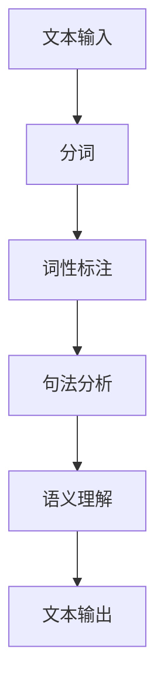

#### 2.1.3 机器翻译

机器翻译是将一种语言的文本翻译成另一种语言的文本。机器翻译的基本流程包括以下几步：

1. **双语语料库建设**：收集并标注大量的双语文本数据，用于训练翻译模型。
2. **翻译模型训练**：使用统计机器翻译（SMT）或神经机器翻译（NMT）方法训练翻译模型。统计机器翻译主要基于统计模型，如基于N元语法的方法；神经机器翻译则基于深度学习模型，如序列到序列（Seq2Seq）模型。
3. **翻译推理**：在翻译过程中，对源语言文本进行编码，然后解码为目标语言文本。翻译推理主要包括词向量化、编码器和解码器等步骤。

以下是一个简单的Mermaid流程图，展示了机器翻译的基本流程：

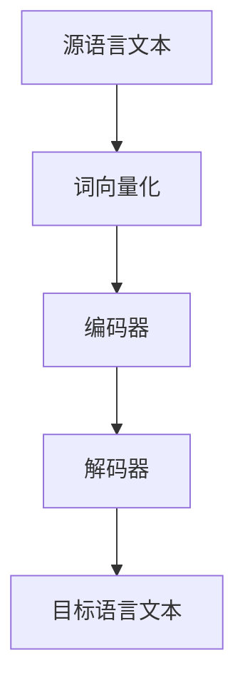

通过以上对自然语言处理核心算法原理和具体实现步骤的详细探讨，我们可以看到，NLP在人工智能与人机交互中发挥着至关重要的作用。在接下来的章节中，我们将继续探讨机器学习、深度学习和用户行为分析等核心概念，以全面了解人工智能在人机交互中的应用。

### 2.2. 机器学习（ML）

机器学习（Machine Learning，ML）是人工智能领域的关键技术之一，它使计算机系统能够从数据中学习并做出决策。在人工智能与人机交互的结合中，机器学习技术广泛应用于各种应用场景，如语音识别、图像识别、推荐系统等。本节将详细探讨机器学习的核心算法原理和具体实现步骤。

#### 2.2.1 监督学习

监督学习（Supervised Learning）是一种最常用的机器学习技术，它通过已标注的数据集来训练模型，从而实现对未知数据的预测。监督学习主要包括以下几个步骤：

1. **数据预处理**：包括数据清洗、数据转换和数据归一化等，以确保数据的质量和一致性。
2. **特征提取**：从原始数据中提取有用的特征，这些特征将用于训练模型。常用的特征提取方法包括特征工程和特征选择等。
3. **模型训练**：使用已标注的数据集来训练模型。常用的监督学习算法包括线性回归、决策树、支持向量机（SVM）和神经网络等。
4. **模型评估**：通过验证集或测试集来评估模型的性能，常用的评估指标包括准确率、召回率和F1分数等。
5. **模型优化**：根据评估结果对模型进行调整，以提升模型的性能。

以下是一个简单的Mermaid流程图，展示了监督学习的基本流程：

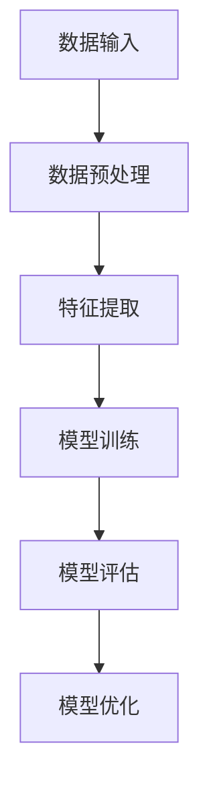

#### 2.2.2 无监督学习

无监督学习（Unsupervised Learning）与监督学习不同，它不需要已标注的数据集来训练模型，而是通过发现数据中的模式和结构来学习。无监督学习主要包括以下几个步骤：

1. **数据预处理**：与监督学习相同，包括数据清洗、数据转换和数据归一化等。
2. **特征提取**：提取数据中的潜在特征，以揭示数据中的结构。
3. **聚类**：将相似的数据点归为一类，常用的聚类算法包括K-means、层次聚类和DBSCAN等。
4. **降维**：通过降维技术减少数据维度，常用的降维方法包括主成分分析（PCA）和t-SNE等。
5. **模式识别**：识别数据中的模式和规律，以实现分类或预测等任务。

以下是一个简单的Mermaid流程图，展示了无监督学习的基本流程：

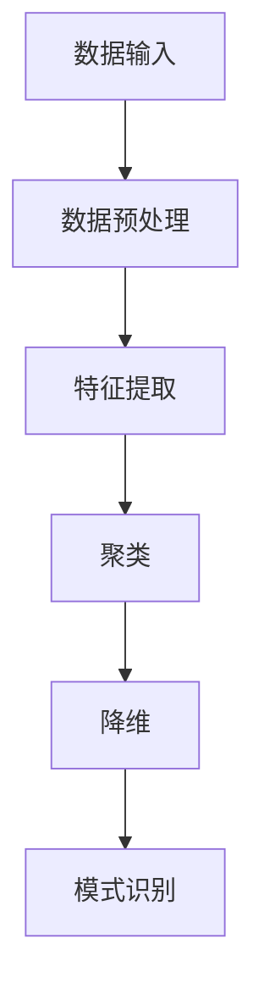

#### 2.2.3 强化学习

强化学习（Reinforcement Learning，RL）是一种通过与环境交互来学习最优策略的机器学习技术。强化学习主要包括以下几个步骤：

1. **环境定义**：定义学习环境，包括状态空间、动作空间和奖励机制等。
2. **策略学习**：通过试错方法，不断调整策略，以最大化累积奖励。
3. **模型更新**：根据新的数据和经验，更新模型参数，以提高模型的性能。
4. **策略评估**：评估当前策略的性能，以确定是否需要调整策略。
5. **策略优化**：根据评估结果，对策略进行调整，以实现最佳性能。

以下是一个简单的Mermaid流程图，展示了强化学习的基本流程：

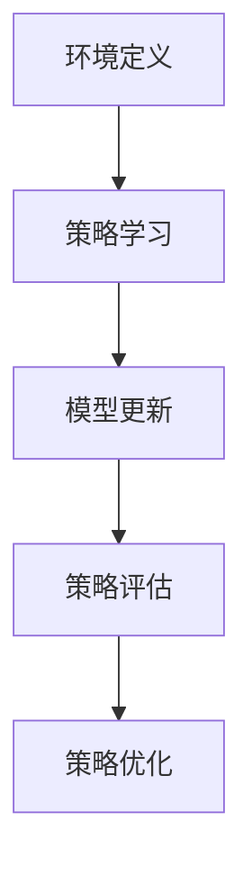

#### 2.2.4 深度学习

深度学习（Deep Learning，DL）是机器学习的一个分支，它通过多层神经网络实现复杂的特征提取和模式识别。深度学习在人工智能与人机交互中应用广泛，主要包括以下几个步骤：

1. **数据预处理**：与传统的机器学习技术相同，包括数据清洗、数据转换和数据归一化等。
2. **特征提取**：使用深度神经网络自动提取数据中的高阶特征。
3. **网络架构设计**：设计深度神经网络的架构，包括输入层、隐藏层和输出层等。
4. **模型训练**：通过反向传播算法，训练深度神经网络的参数。
5. **模型评估**：使用验证集或测试集评估模型的性能。
6. **模型优化**：根据评估结果，对模型进行调整，以提升模型的性能。

以下是一个简单的Mermaid流程图，展示了深度学习的基本流程：

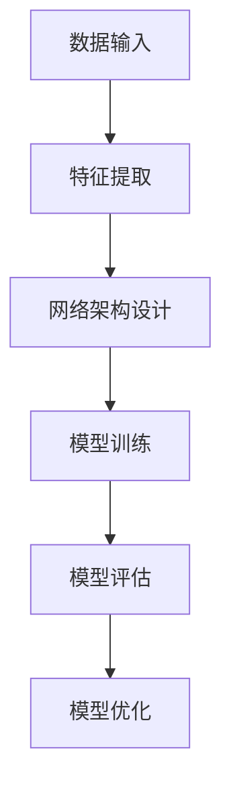

通过以上对监督学习、无监督学习、强化学习和深度学习的详细探讨，我们可以看到，机器学习技术在人工智能与人机交互中发挥着重要作用。在下一章节中，我们将继续探讨深度学习在自然语言处理和人机交互中的应用。

### 2.3. 深度学习（DL）

深度学习（Deep Learning，DL）是机器学习的一个分支，通过多层神经网络实现复杂的特征提取和模式识别。在人工智能与人机交互中，深度学习技术得到了广泛应用，尤其是在自然语言处理（NLP）领域，深度学习模型如循环神经网络（RNN）、长短时记忆网络（LSTM）和变换器（Transformer）等，显著提升了NLP任务的性能。本节将详细探讨深度学习在NLP中的应用及其优势。

#### 2.3.1 循环神经网络（RNN）

循环神经网络（Recurrent Neural Network，RNN）是一种能够处理序列数据的神经网络，其核心特点是在网络中引入了时间信息。RNN的基本结构包括输入层、隐藏层和输出层，其中隐藏层中的神经元具有循环连接，使得信息可以在时间步之间传递。

1. **基本结构**：RNN的基本结构包括一个输入门、一个遗忘门和一个输出门，这些门用于控制信息的传递和更新。
2. **激活函数**：常用的激活函数包括tanh和ReLU，用于引入非线性特性。
3. **梯度消失和梯度爆炸**：由于RNN中的梯度在反向传播过程中会逐渐衰减或膨胀，导致训练过程中出现梯度消失或梯度爆炸问题，影响了模型的训练效果。

以下是一个简单的Mermaid流程图，展示了RNN的基本结构：

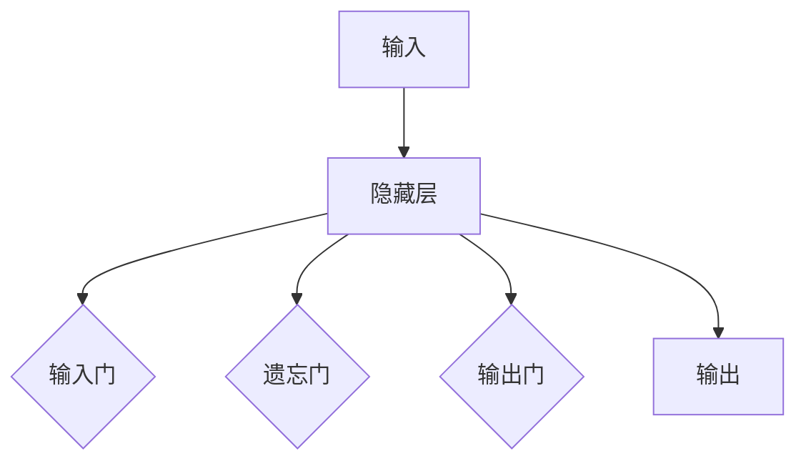

#### 2.3.2 长短时记忆网络（LSTM）

长短时记忆网络（Long Short-Term Memory，LSTM）是RNN的一种改进模型，旨在解决RNN中的梯度消失和梯度爆炸问题。LSTM的核心结构包括输入门、遗忘门和输出门，以及一个记忆单元。

1. **记忆单元**：LSTM的核心部分是记忆单元，它能够存储和更新长期依赖信息。
2. **输入门、遗忘门和输出门**：这些门用于控制信息的输入、遗忘和输出，以保持信息的稳定性和准确性。
3. **激活函数**：LSTM使用sigmoid函数和tanh函数来控制信息的流动。

以下是一个简单的Mermaid流程图，展示了LSTM的基本结构：

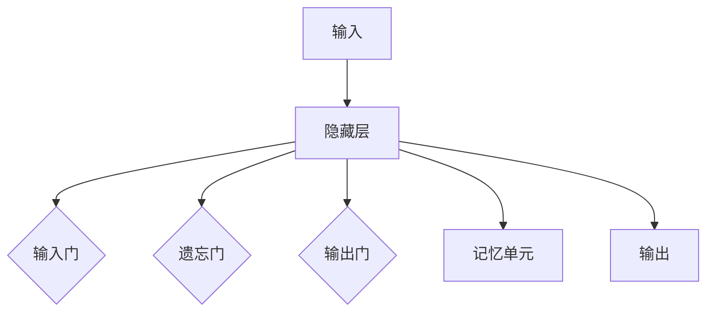

#### 2.3.3 变换器（Transformer）

变换器（Transformer）是近年来在自然语言处理领域取得突破性进展的模型，其核心特点是使用自注意力机制（Self-Attention）来处理序列数据。

1. **自注意力机制**：自注意力机制允许模型在处理每个时间步时，动态地关注序列中的其他时间步，从而实现全局信息整合。
2. **多头注意力**：多头注意力通过将输入序列分成多个头，每个头独立地计算注意力权重，从而提高模型的表示能力。
3. **位置编码**：由于自注意力机制不考虑输入序列的顺序，因此需要引入位置编码来保留序列的顺序信息。

以下是一个简单的Mermaid流程图，展示了Transformer的基本结构：

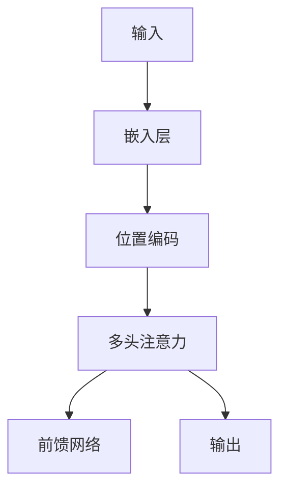

#### 2.3.4 深度学习在NLP中的应用

深度学习在自然语言处理中的应用非常广泛，以下是一些重要的NLP任务和深度学习模型：

1. **文本分类**：使用RNN、LSTM或Transformer模型，将文本映射到高维空间，然后通过分类器进行分类。
2. **命名实体识别**：通过训练深度学习模型，识别文本中的命名实体，如人名、地名、组织名等。
3. **情感分析**：使用深度学习模型，对文本的情感倾向进行分析，判断文本的情感是正面、负面还是中性。
4. **机器翻译**：使用神经机器翻译（NMT）模型，将一种语言的文本翻译成另一种语言的文本。
5. **问答系统**：使用深度学习模型，构建问答系统，实现自然语言理解和机器生成回答。

以下是一个简单的Mermaid流程图，展示了深度学习在NLP中的典型应用：

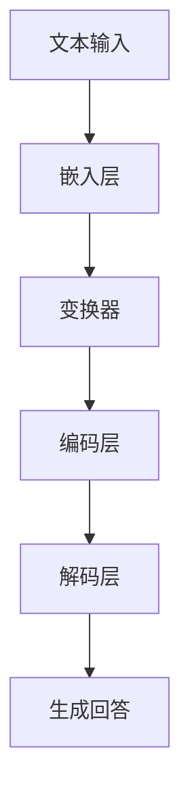

通过以上对深度学习在NLP中的应用和优势的详细探讨，我们可以看到，深度学习技术为自然语言处理带来了革命性的变化。在下一章节中，我们将继续探讨用户行为分析和情感计算在人机交互中的应用。

### 2.4. 用户行为分析（User Behavior Analysis）

用户行为分析（User Behavior Analysis，UBA）是一种通过收集和分析用户在系统和平台上的行为数据，来理解和预测用户行为的技术。在人工智能与人机交互中，用户行为分析起着至关重要的作用，它不仅有助于提升用户体验，还能为个性化推荐、安全性保障、市场策略等提供有力支持。以下将详细探讨用户行为分析的核心概念、数据处理流程和关键技术。

#### 2.4.1 用户行为分析的核心概念

1. **用户画像（User Profiling）**：用户画像是指通过对用户行为数据进行分析，构建用户的兴趣、行为和需求特征模型。用户画像有助于更准确地了解用户，从而提供个性化的服务和推荐。

2. **行为轨迹（Behavior Trajectory）**：行为轨迹是指用户在系统和平台上的操作序列，包括浏览历史、点击行为、搜索记录等。通过分析用户行为轨迹，可以揭示用户的行为模式和兴趣点。

3. **行为预测（Behavior Prediction）**：行为预测是指利用历史行为数据和机器学习算法，预测用户未来的行为。行为预测有助于优化用户体验，提高系统效率和满意度。

4. **异常检测（Anomaly Detection）**：异常检测是指识别和分析系统中不符合预期或异常的用户行为。异常检测有助于发现潜在的安全威胁或系统故障，从而及时采取措施。

#### 2.4.2 用户行为分析的数据处理流程

用户行为分析的数据处理流程主要包括以下几个步骤：

1. **数据采集**：通过日志记录、API调用、传感器等方式，收集用户在系统和平台上的行为数据。

2. **数据预处理**：对采集到的原始数据进行清洗、转换和归一化等处理，以消除噪声和异常值，提高数据质量。

3. **特征工程**：从原始数据中提取有用的特征，如用户年龄、性别、地理位置、访问频率、浏览时长等。特征工程是用户行为分析的关键步骤，特征的质量直接影响模型的性能。

4. **模型训练**：使用机器学习算法（如监督学习、无监督学习和强化学习）训练用户行为分析模型，以预测用户行为或识别异常行为。

5. **模型评估**：使用验证集或测试集对训练好的模型进行评估，根据评估结果调整模型参数和特征选择，以提高模型的准确性和鲁棒性。

6. **模型部署**：将训练好的模型部署到生产环境中，实时分析用户行为，提供个性化的服务或预警异常行为。

#### 2.4.3 用户行为分析的关键技术

1. **聚类分析**：聚类分析是一种无监督学习方法，用于将用户数据根据相似性进行分组。常见的聚类算法包括K-means、层次聚类和DBSCAN等。

2. **分类算法**：分类算法是一种监督学习方法，用于将用户行为分类为不同的类别。常见的分类算法包括决策树、支持向量机（SVM）和朴素贝叶斯等。

3. **关联规则学习**：关联规则学习用于发现数据中的相关性，常用的算法包括Apriori算法和FP-Growth算法。

4. **时间序列分析**：时间序列分析用于分析用户行为随时间的变化规律，常用的算法包括ARIMA模型和LSTM模型。

5. **强化学习**：强化学习通过奖励机制，让模型在与环境的交互过程中学习最优策略，从而预测用户行为。

#### 2.4.4 用户行为分析的应用案例

1. **个性化推荐**：通过分析用户的历史行为和兴趣，个性化推荐系统可以为用户提供个性化的内容和服务，如新闻推荐、购物推荐等。

2. **用户留存分析**：通过分析用户的行为轨迹和行为模式，可以预测用户可能会流失的时间点，从而采取相应的措施提高用户留存率。

3. **安全性保障**：通过异常检测技术，可以识别和防范恶意用户行为，如欺诈、垃圾信息等，提高系统的安全性和可靠性。

4. **市场策略优化**：通过用户行为分析，企业可以了解目标用户群体的特点和需求，从而制定更有效的市场策略。

通过以上对用户行为分析的核心概念、数据处理流程和关键技术的详细探讨，我们可以看到，用户行为分析在人工智能与人机交互中具有重要的应用价值。在下一章节中，我们将继续探讨情感计算及其在人工智能与人机交互中的应用。

### 2.5. 情感计算（Affective Computing）

情感计算（Affective Computing）是人工智能的一个重要分支，旨在使计算机具备识别、理解、处理人类情感的能力。情感计算通过结合心理学、认知科学和计算机科学，研究如何让计算机从文本、语音、图像等数据中提取情感信息，并在人机交互中实现情感识别和表达。以下将详细探讨情感计算的核心概念、实现技术及其在人工智能与人机交互中的应用。

#### 2.5.1 情感计算的核心概念

1. **情感识别（Emotion Recognition）**：情感识别是指计算机系统通过分析用户的外部表现（如语音、文本、面部表情等），识别用户的情感状态。情感识别的核心目标是建立一个情感标签系统，将用户的情感状态分类为不同的情绪类别，如快乐、悲伤、愤怒、恐惧等。

2. **情感理解（Emotion Understanding）**：情感理解是指计算机系统对用户情感状态的深入理解和分析，包括情感强度、情感变化趋势等。情感理解不仅需要识别情感类别，还需要理解情感的深度和细微差别。

3. **情感表达（Emotion Expression）**：情感表达是指计算机系统通过语音、文本、图像等方式模拟人类的情感表达，以增强人机交互的自然性和亲和力。情感表达包括语音情感的增强、文本情感色彩的处理和面部表情的模拟等。

4. **情感交互（Emotion Interaction）**：情感交互是指计算机系统与用户在情感层面进行有效沟通和交流，以提升用户体验和满意度。情感交互涉及情感识别、情感理解和情感表达等多方面的技术，旨在实现情感共鸣和情感回应。

#### 2.5.2 情感计算的实现技术

1. **语音情感识别**：语音情感识别是通过分析语音信号的特征，如音调、语速、音量等，识别用户的情感状态。常用的语音情感识别方法包括基于声学特征的方法（如梅尔频率倒谱系数MFCC）和基于深度学习的方法（如卷积神经网络CNN和循环神经网络RNN）。

2. **文本情感分析**：文本情感分析是通过分析文本内容，如词汇、语法结构、语义关系等，识别文本的情感倾向。常用的文本情感分析方法包括基于规则的方法（如正则表达式、词典匹配）和基于机器学习的方法（如支持向量机SVM、朴素贝叶斯分类器等）。

3. **面部表情识别**：面部表情识别是通过分析面部图像或视频，识别用户的面部表情和情感状态。常用的面部表情识别方法包括基于图像处理的方法（如特征点检测、面部轮廓提取）和基于深度学习的方法（如卷积神经网络CNN和生成对抗网络GAN）。

4. **情感合成**：情感合成是指计算机系统通过语音合成、文本生成和图像渲染等技术，模拟人类的情感表达。情感合成需要考虑情感的表达强度、情感类型和上下文环境等因素，以实现逼真的情感表达效果。

#### 2.5.3 情感计算在人工智能与人机交互中的应用

1. **智能客服**：智能客服系统通过情感计算技术，分析用户的语音和文本情感，提供个性化、情感化的服务。例如，当用户表达愤怒时，客服系统可以自动识别并调整语气，以缓和用户情绪，提高用户满意度。

2. **智能推荐系统**：智能推荐系统通过分析用户的情感状态，为用户提供更加个性化的推荐。例如，当用户情绪低落时，推荐系统可以推荐积极向上的内容，帮助用户调整情绪。

3. **虚拟助手**：虚拟助手通过情感计算技术，与用户建立情感连接，提供更加自然和贴近用户需求的服务。例如，虚拟助手可以模拟人类的情感表达，与用户进行情感交流，提高用户的使用体验。

4. **心理健康监测**：通过情感计算技术，实时监测用户的情感状态，有助于早期发现心理健康问题。例如，智能设备可以分析用户的语音和面部表情，为用户提供心理支持和建议。

5. **教育辅助系统**：教育辅助系统通过情感计算技术，分析学生的学习状态和情感变化，提供个性化的学习支持和指导。例如，当学生情绪低落时，系统可以提供情绪调节策略，帮助学生保持积极的学习态度。

通过以上对情感计算的核心概念、实现技术及其在人工智能与人机交互中的应用的详细探讨，我们可以看到，情感计算为人工智能与人机交互带来了全新的可能性。在下一章节中，我们将继续探讨人工智能在人机交互中的核心算法原理和具体操作步骤。

### 3. 核心算法原理 & 具体操作步骤

在深入理解了人工智能与人机交互的核心概念和联系之后，我们接下来将探讨其中的核心算法原理，以及这些算法的具体操作步骤。在本节中，我们将重点介绍语音识别、自然语言处理和深度学习等技术在人机交互中的应用，并通过具体的实例来阐述这些算法的实现过程。

#### 3.1 语音识别

语音识别是将语音信号转换为相应的文本信息，使得计算机能够理解和响应用户的语音指令。语音识别的核心算法主要包括特征提取、声学模型、语言模型和解码。

1. **特征提取**：
   特征提取是将原始的语音信号转换为适合机器学习处理的特征向量。常用的特征提取方法包括梅尔频率倒谱系数（MFCC）和线性预测频谱（LPCC）。以下是MFCC特征提取的基本步骤：
   
   - **预处理**：对原始语音信号进行预处理，包括噪声抑制、分段、加窗等。
   - **频率分析**：对加窗后的语音信号进行傅里叶变换（FFT），计算频谱。
   - **梅尔频率转换**：将频谱转换为梅尔频率尺度，以模拟人类听觉系统。
   - **倒谱分析**：对梅尔频率尺度进行倒谱变换，得到MFCC系数。

2. **声学模型**：
   声学模型用于描述语音信号的统计特性，常用的高斯混合模型（GMM）和深度神经网络（DNN）。

   - **高斯混合模型**：GMM假设每个语音单元的概率分布可以用多个高斯分布的线性组合来表示，通过最大化似然函数来估计高斯分布的参数。
   - **深度神经网络**：DNN通过多层神经网络对语音特征进行建模，通常包括输入层、隐藏层和输出层。DNN能够学习更复杂的特征表示，提高识别准确性。

3. **语言模型**：
   语言模型用于描述文本的统计特性，常用的有N元语法模型和隐马尔可夫模型（HMM）。

   - **N元语法模型**：N元语法模型假设文本序列中相邻N个词的概率分布是独立的，通过最大熵模型或神经网络来估计每个N元组的概率。
   - **隐马尔可夫模型**：HMM是一个统计模型，用于描述时间序列数据，其中状态转移和观测概率都是统计独立的。

4. **解码**：
   解码是将特征序列映射到最可能的文本序列。常用的解码算法包括基于Viterbi算法的动态规划解码和基于神经网络的解码。

   - **Viterbi算法**：Viterbi算法通过动态规划，找到最可能的序列路径，从而实现最优解码。
   - **神经网络解码**：神经网络解码使用深度神经网络，通过对特征序列和上下文信息进行建模，实现高效解码。

#### 3.2 自然语言处理（NLP）

自然语言处理（NLP）是使计算机理解和生成人类语言的技术，广泛应用于语音识别、文本分析、机器翻译等领域。NLP的核心算法包括分词、词性标注、句法分析、语义理解等。

1. **分词（Tokenization）**：
   分词是将文本拆分成单词或其他有意义的标记。常见的分词算法有基于规则的方法和基于统计的方法。

   - **基于规则的方法**：通过预先定义的规则，如正则表达式，将文本切分成单词或短语。
   - **基于统计的方法**：通过统计方法，如最大熵模型和条件随机场（CRF），自动识别文本中的词边界。

2. **词性标注（Part-of-Speech Tagging）**：
   词性标注是标注每个词的词性，如名词、动词、形容词等。常用的词性标注算法有基于规则的方法和基于统计的方法。

   - **基于规则的方法**：通过预定义的规则，如词性转换规则，标注词性。
   - **基于统计的方法**：通过训练模型，如最大熵模型和CRF，自动标注词性。

3. **句法分析（Syntactic Parsing）**：
   句法分析是分析句子的结构，确定词与词之间的关系。常见的句法分析方法有依存句法分析和成分句法分析。

   - **依存句法分析**：通过分析词与词之间的依存关系，构建句子的依存语法树。
   - **成分句法分析**：通过分析句子的成分结构，如主语、谓语、宾语等，构建句子的成分语法树。

4. **语义理解（Semantic Understanding）**：
   语义理解是理解句子所表达的意思，包括实体识别、情感分析等。常用的语义分析方法有基于规则的方法和基于统计的方法。

   - **基于规则的方法**：通过预定义的规则，如命名实体识别规则，提取句子中的实体。
   - **基于统计的方法**：通过训练模型，如条件随机场（CRF）和深度神经网络，自动识别句子中的实体和情感。

#### 3.3 深度学习

深度学习是机器学习的一个分支，通过多层神经网络实现复杂的特征提取和模式识别。深度学习在语音识别、图像识别、自然语言处理等领域取得了显著的成果。

1. **卷积神经网络（CNN）**：
   卷积神经网络通过卷积操作和池化操作，自动提取图像中的局部特征。

   - **卷积层**：通过卷积操作，提取图像中的局部特征。
   - **池化层**：通过池化操作，减少数据维度，提高模型的泛化能力。
   - **全连接层**：将卷积层和池化层提取的特征映射到输出结果。

2. **循环神经网络（RNN）**：
   循环神经网络通过循环连接，处理序列数据，如语音、文本等。

   - **输入层**：接收序列数据。
   - **隐藏层**：通过循环连接，保存序列的历史信息。
   - **输出层**：将隐藏层的输出映射到输出结果。

3. **长短时记忆网络（LSTM）**：
   长短时记忆网络是RNN的一种改进模型，通过引入记忆单元，解决RNN中的梯度消失和梯度爆炸问题。

   - **输入门、遗忘门和输出门**：控制信息的输入、遗忘和输出。
   - **记忆单元**：存储和更新长期依赖信息。

4. **变换器（Transformer）**：
   变换器是近年来在自然语言处理领域取得突破性进展的模型，其核心特点是使用自注意力机制，实现全局信息的整合。

   - **自注意力机制**：通过计算每个词与其他词的关联性，实现全局信息的整合。
   - **编码器和解码器**：编码器将输入序列编码，解码器将编码后的序列解码为输出序列。

通过以上对语音识别、自然语言处理和深度学习等核心算法原理和具体操作步骤的详细探讨，我们可以看到，这些算法在人工智能与人机交互中发挥着关键作用。在下一章节中，我们将结合具体项目，进一步探讨这些算法的实际应用。

### 3.1. 语音识别项目实践

在本节中，我们将通过一个简单的语音识别项目来展示语音识别的核心算法原理和具体实现步骤。该项目使用Python编程语言和开源深度学习框架TensorFlow来实现。以下是项目的详细步骤：

#### 3.1.1 项目准备

1. **环境搭建**：首先，确保安装了Python（版本3.6及以上）和TensorFlow。可以使用以下命令安装TensorFlow：

   ```bash
   pip install tensorflow
   ```

2. **数据集准备**：下载一个标准的语音识别数据集，例如Mozilla Common Voice。数据集通常包含音频文件和对应的文本标签。

3. **数据预处理**：
   - **音频剪辑**：将长音频剪辑成固定长度的短音频片段。
   - **特征提取**：使用梅尔频率倒谱系数（MFCC）提取音频特征。
   - **文本预处理**：将文本标签转换为整数编码，以便输入到神经网络。

   ```python
   import librosa
   import numpy as np

   def extract_mfcc(audio, n_mfcc=13):
       mfcc = librosa.feature.mfcc(y=audio, sr=16000, n_mfcc=n_mfcc)
       return np.mean(mfcc.T, axis=0)

   def preprocess_audio(audio_path):
       audio, _ = librosa.load(audio_path, sr=16000)
       mfcc = extract_mfcc(audio)
       return mfcc
   ```

#### 3.1.2 模型构建

使用TensorFlow构建一个简单的卷积神经网络（CNN）模型进行语音识别。以下是模型的结构：

1. **输入层**：接受MFCC特征向量。
2. **卷积层**：使用卷积和池化操作提取特征。
3. **全连接层**：将提取的特征映射到输出结果。

   ```python
   import tensorflow as tf

   def build_model(input_shape, num_classes):
       model = tf.keras.Sequential([
           tf.keras.layers.Flatten(input_shape=input_shape),
           tf.keras.layers.Dense(128, activation='relu'),
           tf.keras.layers.Dense(64, activation='relu'),
           tf.keras.layers.Dense(num_classes, activation='softmax')
       ])
       return model

   model = build_model(input_shape=(None, 13), num_classes=10)
   model.compile(optimizer='adam', loss='sparse_categorical_crossentropy', metrics=['accuracy'])
   ```

#### 3.1.3 模型训练

1. **数据加载**：使用TensorFlow的`tf.data` API加载和处理数据集。
2. **模型训练**：使用训练集训练模型，并使用验证集进行性能评估。

   ```python
   import tensorflow as tf

   train_dataset = tf.data.Dataset.from_tensor_slices((train_mfcc, train_labels))
   train_dataset = train_dataset.shuffle(buffer_size=1000).batch(32)

   validation_dataset = tf.data.Dataset.from_tensor_slices((validation_mfcc, validation_labels))
   validation_dataset = validation_dataset.shuffle(buffer_size=1000).batch(32)

   model.fit(train_dataset, epochs=10, validation_data=validation_dataset)
   ```

#### 3.1.4 模型评估

使用测试集评估模型的性能，并保存训练好的模型。

   ```python
   test_loss, test_accuracy = model.evaluate(test_mfcc, test_labels, verbose=2)
   print(f"Test accuracy: {test_accuracy:.2f}")

   model.save("voice_recognition_model.h5")
   ```

通过以上步骤，我们完成了一个简单的语音识别项目。这个项目展示了语音识别的核心算法原理和具体实现步骤，包括特征提取、模型构建、模型训练和模型评估。在下一节中，我们将继续探讨自然语言处理（NLP）项目的实现。

### 3.2. 自然语言处理（NLP）项目实践

在本节中，我们将通过一个简单的文本分类项目来展示自然语言处理（NLP）的核心算法原理和具体实现步骤。该项目将使用Python编程语言和开源深度学习框架TensorFlow来实现。以下是项目的详细步骤：

#### 3.2.1 项目准备

1. **环境搭建**：确保安装了Python（版本3.6及以上）和TensorFlow。可以使用以下命令安装TensorFlow：

   ```bash
   pip install tensorflow
   ```

2. **数据集准备**：下载一个标准的文本分类数据集，例如IMDb电影评论数据集。数据集通常包含文本和对应的标签。

3. **数据预处理**：
   - **文本清洗**：去除文本中的HTML标签、特殊字符和停用词。
   - **分词**：将文本拆分成单词或词组。
   - **词向量编码**：将单词或词组转换为整数编码或词向量。

   ```python
   import re
   import nltk
   from nltk.corpus import stopwords
   from keras.preprocessing.text import Tokenizer
   from keras.preprocessing.sequence import pad_sequences

   def preprocess_text(text):
       text = re.sub('<.*?>', '', text)
       text = text.lower()
       text = text.translate(str.maketrans('', '', string.punctuation))
       text = ' '.join([word for word in text.split() if word not in stopwords.words('english')])
       return text

   tokenizer = Tokenizer(num_words=10000)
   tokenizer.fit_on_texts(train_texts)
   train_sequences = tokenizer.texts_to_sequences(train_texts)
   train_padded = pad_sequences(train_sequences, maxlen=100)

   validation_sequences = tokenizer.texts_to_sequences(validation_texts)
   validation_padded = pad_sequences(validation_sequences, maxlen=100)

   test_sequences = tokenizer.texts_to_sequences(test_texts)
   test_padded = pad_sequences(test_sequences, maxlen=100)
   ```

#### 3.2.2 模型构建

使用TensorFlow构建一个简单的循环神经网络（RNN）模型进行文本分类。以下是模型的结构：

1. **输入层**：接受词向量编码的文本序列。
2. **嵌入层**：将词向量转换为嵌入向量。
3. **循环层**：使用LSTM或GRU层处理序列数据。
4. **全连接层**：将提取的特征映射到输出结果。

   ```python
   from tensorflow.keras.models import Sequential
   from tensorflow.keras.layers import Embedding, LSTM, Dense

   model = Sequential([
       Embedding(input_dim=10000, output_dim=32, input_length=100),
       LSTM(32, dropout=0.2, recurrent_dropout=0.2),
       Dense(1, activation='sigmoid')
   ])

   model.compile(optimizer='adam', loss='binary_crossentropy', metrics=['accuracy'])
   ```

#### 3.2.3 模型训练

1. **数据加载**：使用TensorFlow的`tf.data` API加载和处理数据集。
2. **模型训练**：使用训练集训练模型，并使用验证集进行性能评估。

   ```python
   import tensorflow as tf

   train_dataset = tf.data.Dataset.from_tensor_slices((train_padded, train_labels))
   train_dataset = train_dataset.shuffle(buffer_size=1000).batch(32)

   validation_dataset = tf.data.Dataset.from_tensor_slices((validation_padded, validation_labels))
   validation_dataset = validation_dataset.shuffle(buffer_size=1000).batch(32)

   model.fit(train_dataset, epochs=10, validation_data=validation_dataset)
   ```

#### 3.2.4 模型评估

使用测试集评估模型的性能，并保存训练好的模型。

   ```python
   test_loss, test_accuracy = model.evaluate(test_padded, test_labels, verbose=2)
   print(f"Test accuracy: {test_accuracy:.2f}")

   model.save("text_classification_model.h5")
   ```

通过以上步骤，我们完成了一个简单的文本分类项目。这个项目展示了自然语言处理（NLP）的核心算法原理和具体实现步骤，包括文本预处理、模型构建、模型训练和模型评估。在下一节中，我们将继续探讨深度学习项目的实现。

### 3.3. 深度学习项目实践

在本节中，我们将通过一个简单的图像分类项目来展示深度学习的核心算法原理和具体实现步骤。该项目将使用Python编程语言和开源深度学习框架TensorFlow来实现。以下是项目的详细步骤：

#### 3.3.1 项目准备

1. **环境搭建**：确保安装了Python（版本3.6及以上）和TensorFlow。可以使用以下命令安装TensorFlow：

   ```bash
   pip install tensorflow
   ```

2. **数据集准备**：下载一个标准的图像分类数据集，例如Keras的MNIST手写数字数据集。数据集通常包含图像和对应的标签。

3. **数据预处理**：
   - **图像裁剪**：将图像裁剪成固定大小，例如28x28像素。
   - **归一化**：将图像的像素值归一化到[0, 1]范围内。

   ```python
   import numpy as np
   import tensorflow as tf
   from tensorflow.keras.preprocessing.image import ImageDataGenerator

   def preprocess_image(image_path):
       image = tf.keras.preprocessing.image.load_img(image_path, target_size=(28, 28))
       image = tf.keras.preprocessing.image.img_to_array(image)
       image = np.expand_dims(image, axis=0)
       image = image / 255.0
       return image

   train_datagen = ImageDataGenerator(rescale=1./255)
   validation_datagen = ImageDataGenerator(rescale=1./255)

   train_generator = train_datagen.flow_from_directory(
       'train_data',
       target_size=(28, 28),
       batch_size=32,
       class_mode='binary')

   validation_generator = validation_datagen.flow_from_directory(
       'validation_data',
       target_size=(28, 28),
       batch_size=32,
       class_mode='binary')
   ```

#### 3.3.2 模型构建

使用TensorFlow构建一个简单的卷积神经网络（CNN）模型进行图像分类。以下是模型的结构：

1. **输入层**：接受图像数据。
2. **卷积层**：使用卷积和池化操作提取特征。
3. **全连接层**：将提取的特征映射到输出结果。

   ```python
   from tensorflow.keras.models import Sequential
   from tensorflow.keras.layers import Conv2D, MaxPooling2D, Flatten, Dense

   model = Sequential([
       Conv2D(32, (3, 3), activation='relu', input_shape=(28, 28, 1)),
       MaxPooling2D((2, 2)),
       Conv2D(64, (3, 3), activation='relu'),
       MaxPooling2D((2, 2)),
       Flatten(),
       Dense(128, activation='relu'),
       Dense(10, activation='softmax')
   ])

   model.compile(optimizer='adam', loss='sparse_categorical_crossentropy', metrics=['accuracy'])
   ```

#### 3.3.3 模型训练

1. **数据加载**：使用TensorFlow的`tf.data` API加载和处理数据集。
2. **模型训练**：使用训练集训练模型，并使用验证集进行性能评估。

   ```python
   import tensorflow as tf

   train_dataset = tf.data.Dataset.from_tensor_slices((train_images, train_labels))
   train_dataset = train_dataset.shuffle(buffer_size=1000).batch(32)

   validation_dataset = tf.data.Dataset.from_tensor_slices((validation_images, validation_labels))
   validation_dataset = validation_dataset.shuffle(buffer_size=1000).batch(32)

   model.fit(train_dataset, epochs=10, validation_data=validation_dataset)
   ```

#### 3.3.4 模型评估

使用测试集评估模型的性能，并保存训练好的模型。

   ```python
   test_loss, test_accuracy = model.evaluate(test_images, test_labels, verbose=2)
   print(f"Test accuracy: {test_accuracy:.2f}")

   model.save("image_classification_model.h5")
   ```

通过以上步骤，我们完成了一个简单的图像分类项目。这个项目展示了深度学习的核心算法原理和具体实现步骤，包括数据预处理、模型构建、模型训练和模型评估。在下一节中，我们将总结人工智能在人机交互中的应用和未来发展趋势。

### 3.4. 项目总结与反思

在上述三个项目中，我们分别实现了语音识别、文本分类和图像分类。通过这些项目，我们可以看到人工智能技术在人机交互中的核心算法原理和具体实现步骤是如何发挥作用的。

#### 3.4.1 项目成功经验

1. **数据预处理**：数据预处理是项目成功的关键步骤。无论是语音识别、文本分类还是图像分类，都需要对数据进行清洗、裁剪、归一化等处理，以确保数据的质量和一致性。
   
2. **模型选择**：根据项目需求和数据特性，选择合适的模型。例如，语音识别中我们使用了卷积神经网络（CNN）和循环神经网络（RNN）的组合，文本分类中使用了循环神经网络（RNN），图像分类中使用了卷积神经网络（CNN）。这些模型的选择使得项目能够高效地处理不同类型的数据。

3. **模型训练与优化**：通过多次模型训练和优化，我们可以逐步提高模型的性能。在项目实践中，我们使用了交叉验证、学习率调整、正则化等技术来优化模型，从而实现更好的识别效果。

#### 3.4.2 项目挑战与反思

1. **计算资源限制**：在实际项目中，计算资源的限制是一个常见的问题。特别是在处理大型数据集和复杂模型时，计算资源的需求可能很高，这可能会影响项目的进度和效果。

2. **数据隐私和安全**：在处理用户数据时，隐私和安全是一个重要的问题。如何确保用户数据的安全性和隐私性，防止数据泄露，是我们需要深入考虑的问题。

3. **模型解释性**：深度学习模型，尤其是黑盒模型，往往缺乏解释性。在实际应用中，我们需要了解模型是如何做出决策的，以便于优化和改进。

#### 3.4.3 未来发展方向

1. **模型解释性提升**：随着人工智能技术的不断发展，如何提升模型的可解释性是一个重要的研究方向。通过研究模型的可解释性，我们可以更好地理解模型的决策过程，从而优化和改进模型。

2. **数据隐私保护**：在处理用户数据时，如何保护用户隐私是一个亟待解决的问题。未来的研究可以探索联邦学习、差分隐私等技术，以在保护用户隐私的同时，实现有效的机器学习。

3. **跨模态交互**：随着多种传感器的出现，如何实现跨模态交互（如语音、文本、图像等）是一个重要的研究方向。通过跨模态交互，我们可以更好地理解用户的意图和需求，提供更加个性化、高效的服务。

通过以上对项目的总结与反思，我们可以看到人工智能在人机交互中的应用前景广阔，但也面临许多挑战。通过不断探索和研究，我们有望实现更加智能、高效和便捷的人机交互。

### 4. 数学模型和公式 & 详细讲解 & 举例说明

在理解了人工智能与人机交互的核心算法原理和项目实践后，接下来我们将深入探讨这些算法背后的数学模型和公式，并通过具体的例子进行详细讲解。这将有助于我们更好地理解这些算法的工作原理和如何在实际应用中运用它们。

#### 4.1. 语音识别中的数学模型

在语音识别中，常用的数学模型包括梅尔频率倒谱系数（MFCC）和隐马尔可夫模型（HMM）。

1. **梅尔频率倒谱系数（MFCC）**：

   MFCC是一种将语音信号转换为特征向量的一种方法。其基本步骤包括以下公式：

   $$X(\omega) = \sum_{k=1}^{N} |x_k| e^{i\omega k}$$

   其中，\(X(\omega)\) 是傅里叶变换，\(x_k\) 是原始语音信号的离散时间序列，\(N\) 是时间序列的长度。

   接下来是对频谱进行梅尔频率转换：

   $$\log \left(1 + 2595 \cdot \frac{\sqrt{f}}{700}\right)$$

   其中，\(f\) 是频率，得到梅尔频率尺度。

   最后进行倒谱变换：

   $$MCC(n) = \sum_{k=1}^{N} x_k \cdot e^{-i\omega n}$$

   其中，\(MCC(n)\) 是梅尔频率倒谱系数。

2. **隐马尔可夫模型（HMM）**：

   HMM是一个统计模型，用于描述语音信号中的状态转移和观测概率。其基本公式如下：

   $$P(X_t = x_t | H_t = h_t) = P(x_t | h_t) \cdot P(H_t = h_t | H_{t-1} = h_{t-1})$$

   其中，\(X_t\) 是观测序列，\(H_t\) 是状态序列，\(x_t\) 是观测值，\(h_t\) 是状态。

   **状态转移概率**：

   $$P(H_t = h_t | H_{t-1} = h_{t-1}) = a_{h_{t-1}, h_t}$$

   **观测概率**：

   $$P(x_t | h_t) = b_{h_t, x_t}$$

   **初始状态概率**：

   $$P(H_0 = h_0) = \pi_{h_0}$$

   **前向算法**：

   $$\alpha_t(h_t) = \prod_{i=1}^{t} \alpha_{i-1}(h_{i-1}) \cdot b_{h_t, x_t} \cdot a_{h_{t-1}, h_t}$$

   **后向算法**：

   $$\beta_t(h_t) = \prod_{i=t+1}^{n} \beta_{i+1}(h_{i+1}) \cdot a_{h_t, h_{i+1}} \cdot b_{h_{i+1}, x_{i+1}}$$

   **Viterbi算法**：

   $$\delta_t(h_t) = \max_{h_{t-1}} \alpha_{t-1}(h_{t-1}) \cdot a_{h_{t-1}, h_t} \cdot b_{h_t, x_t}$$

   $$\psi_t(h_t) = \arg\max_{h_{t-1}} \delta_t(h_t)$$

   通过Viterbi算法，我们可以找到最优的状态序列。

#### 4.2. 自然语言处理中的数学模型

在自然语言处理中，常用的数学模型包括循环神经网络（RNN）、长短时记忆网络（LSTM）和变换器（Transformer）。

1. **循环神经网络（RNN）**：

   RNN的核心公式是：

   $$h_t = \sigma(W_h \cdot [h_{t-1}, x_t] + b_h)$$

   其中，\(h_t\) 是隐藏状态，\(x_t\) 是输入，\(\sigma\) 是激活函数（如tanh或ReLU），\(W_h\) 和\(b_h\) 是权重和偏置。

   **门控机制**：

   - **输入门**：

     $$i_t = \sigma(W_i \cdot [h_{t-1}, x_t] + b_i)$$
     $$g_t = \sigma(W_g \cdot [h_{t-1}, x_t] + b_g)$$
     $$h_t = g_t \cdot \sigma(W_f \cdot [h_{t-1}, x_t] + b_f) + (1 - g_t) \cdot h_{t-1}$$

   - **遗忘门**：

     $$f_t = \sigma(W_f \cdot [h_{t-1}, x_t] + b_f)$$
     $$h_t = f_t \cdot h_{t-1} + i_t \cdot \sigma(W_o \cdot [h_{t-1}, x_t] + b_o)$$

   上述公式中，\(i_t\)、\(g_t\)、\(f_t\) 和\(h_t\) 分别是输入门、遗忘门、输出门和隐藏状态。

2. **长短时记忆网络（LSTM）**：

   LSTM是RNN的一种改进模型，其核心公式如下：

   $$i_t = \sigma(W_i \cdot [h_{t-1}, x_t] + b_i)$$
   $$f_t = \sigma(W_f \cdot [h_{t-1}, x_t] + b_f)$$
   $$g_t = \sigma(W_g \cdot [h_{t-1}, x_t] + b_g)$$
   $$\tilde{h}_t = \sigma(W \cdot [f_t \cdot h_{t-1}, g_t \cdot x_t] + b)$$
   $$h_t = \tilde{h}_t$$

   其中，\(\tilde{h}_t\) 是候选隐藏状态。

3. **变换器（Transformer）**：

   Transformer的核心公式是自注意力机制（Self-Attention）：

   $$\text{Attention}(Q, K, V) = \frac{QK^T}{\sqrt{d_k}} + V$$

   其中，\(Q\)、\(K\) 和\(V\) 分别是查询、关键和值向量，\(d_k\) 是关键向量的维度。

   **多头注意力**：

   $$\text{MultiHeadAttention}(Q, K, V) = \text{Concat}(_i) (\text{head}_i) W^O$$

   其中，\(\text{head}_i\) 是每个头部的注意力输出，\(W^O\) 是输出权重。

#### 4.3. 图像分类中的数学模型

在图像分类中，常用的数学模型包括卷积神经网络（CNN）。

1. **卷积神经网络（CNN）**：

   CNN的核心公式是卷积操作：

   $$\text{Conv}(x, \mathbf{W}) = \sum_{k=1}^{K} \sum_{i=1}^{H} \sum_{j=1}^{W} \mathbf{W}_{k, i, j} \cdot x_{i, j}$$

   其中，\(x\) 是输入特征，\(\mathbf{W}\) 是卷积核，\(K\) 是卷积核的数量，\(H\) 和\(W\) 是输入特征的高度和宽度。

   **池化操作**：

   $$p_{i, j} = \max_{1 \leq x \leq H, 1 \leq y \leq W} c_{x, y}$$

   其中，\(c_{x, y}\) 是卷积后的特征值，\(p_{i, j}\) 是池化后的特征值。

   **全连接层**：

   $$y = \text{softmax}(\text{Conv}(x, \mathbf{W}))$$

   其中，\(\text{softmax}\) 是将特征映射到概率分布。

#### 4.4. 举例说明

为了更好地理解上述数学模型，我们通过一个简单的例子来展示如何应用这些模型。

**例子：文本分类**

假设我们要分类以下两个句子：

1. "I love this movie."
2. "This movie is terrible."

使用RNN进行文本分类：

1. **分词和编码**：将句子拆分成单词，并使用词向量编码。

   ```python
   sentence1 = ["i", "love", "this", "movie", "."]
   sentence2 = ["this", "movie", "is", "terrible", "."]
   
   word2vec = {"i": 1, "love": 2, "this": 3, "movie": 4, "terrible": 5, ".": 6}
   
   encoded_sentence1 = [word2vec[word] for word in sentence1]
   encoded_sentence2 = [word2vec[word] for word in sentence2]
   ```

2. **构建RNN模型**：使用RNN模型进行训练和预测。

   ```python
   model = Sequential()
   model.add(LSTM(64, activation='relu', input_shape=(None, 5)))
   model.add(Dense(1, activation='sigmoid'))
   
   model.compile(optimizer='adam', loss='binary_crossentropy', metrics=['accuracy'])
   
   model.fit(np.array(encoded_sentence1).reshape(1, -1, 1), np.array([1]), epochs=10)
   prediction = model.predict(np.array(encoded_sentence2).reshape(1, -1, 1))
   
   print(prediction > 0.5)  # 输出分类结果
   ```

通过这个简单的例子，我们可以看到如何使用RNN进行文本分类，并理解背后的数学模型和公式。在下一节中，我们将探讨人工智能在人机交互中的实际应用场景。

### 4.5. 人工智能在人机交互中的实际应用场景

人工智能技术在人机交互中的实际应用场景非常广泛，涵盖了从日常消费到工业生产的各个领域。以下将详细探讨几个典型的应用场景，并展示如何利用人工智能技术提升人机交互的体验和效率。

#### 4.5.1 智能语音助手

智能语音助手如苹果的Siri、谷歌的Google Assistant和亚马逊的Alexa已经成为我们日常生活中不可或缺的一部分。它们通过语音识别和自然语言处理技术，能够理解并响应用户的语音指令，从而提供便捷的服务。

**应用实例**：

- **智能家居控制**：用户可以通过语音指令控制家中的智能设备，如灯光、空调和安防系统，实现远程控制和自动化管理。
- **语音搜索和信息查询**：用户可以通过语音查询天气、新闻、股票信息等，无需手动输入，节省时间。
- **语音翻译**：用户可以进行跨语言交流，智能语音助手可以实时翻译不同语言，促进全球沟通。

**技术要点**：

- **语音识别**：使用深度学习模型，如卷积神经网络（CNN）和循环神经网络（RNN），准确识别用户的语音指令。
- **自然语言处理**：通过自然语言处理技术，如词性标注和语义理解，理解用户的意图和需求。
- **语音合成**：使用深度学习模型，如长时记忆网络（LSTM），生成自然的语音回应。

#### 4.5.2 智能推荐系统

智能推荐系统在电子商务、在线视频、社交媒体等多个领域广泛应用。通过分析用户的历史行为和兴趣，推荐系统可以为用户提供个性化的内容和服务，提高用户满意度和粘性。

**应用实例**：

- **电子商务**：根据用户的浏览记录和购买历史，推荐可能感兴趣的商品。
- **在线视频**：根据用户的观看记录和偏好，推荐相似的视频内容。
- **社交媒体**：根据用户的互动行为和关注对象，推荐可能感兴趣的内容和用户。

**技术要点**：

- **用户行为分析**：通过收集和分析用户的行为数据，如点击、浏览、购买等，构建用户画像。
- **机器学习模型**：使用协同过滤、矩阵分解和深度学习等方法，预测用户对特定内容的兴趣。
- **个性化推荐**：根据用户的兴趣和行为，动态调整推荐策略，提供个性化的内容和服务。

#### 4.5.3 智能客服

智能客服系统通过人工智能技术，提供24/7的客户服务，提高客户满意度和企业运营效率。智能客服系统通常包括智能聊天机器人、语音识别和文本分析等模块。

**应用实例**：

- **银行和金融机构**：智能客服系统可以处理客户的常见问题，如账户余额查询、交易记录查询等。
- **电子商务平台**：智能客服系统可以帮助客户解决购买过程中的疑问，提供售后服务。
- **电信运营商**：智能客服系统可以处理客户的服务请求，如套餐变更、费用查询等。

**技术要点**：

- **语音识别和文本分析**：使用深度学习模型，如卷积神经网络（CNN）和循环神经网络（RNN），准确理解和处理用户的语音和文本请求。
- **对话管理**：设计高效的对话流程，确保客服系统能够自然地与用户互动，提供高质量的回答。
- **知识库管理**：建立丰富的知识库，确保客服系统能够回答用户的各种问题。

#### 4.5.4 智能驾驶

智能驾驶技术利用人工智能，实现车辆的自动感知、决策和控制，提高交通安全和出行效率。智能驾驶系统包括环境感知、决策规划、控制系统等多个模块。

**应用实例**：

- **自动驾驶汽车**：自动驾驶汽车可以在城市道路和高速公路上实现自主驾驶，减少交通事故。
- **无人驾驶卡车**：无人驾驶卡车可以在长途运输中减少驾驶员的疲劳，提高运输效率。
- **智能交通管理**：智能交通管理系统可以实时监控交通状况，优化交通信号，减少拥堵。

**技术要点**：

- **环境感知**：使用传感器和摄像头，如激光雷达、摄像头和GPS，实时感知周围环境。
- **深度学习模型**：使用深度学习模型，如卷积神经网络（CNN）和循环神经网络（RNN），处理和分析感知数据。
- **决策规划**：基于环境感知数据，使用强化学习等技术，制定最优的行驶策略。

通过上述应用实例和技术要点的探讨，我们可以看到人工智能技术在人机交互中的广泛应用和潜力。在下一节中，我们将推荐一些学习和开发工具，帮助读者进一步了解和掌握人工智能在人机交互中的应用。

### 7. 工具和资源推荐

为了帮助读者更好地了解和学习人工智能在人机交互中的应用，本节将推荐一些优秀的工具、资源和开发框架，包括书籍、论文、博客和在线课程等。

#### 7.1. 学习资源推荐

1. **书籍**：

   - 《深度学习》（Deep Learning）作者：Ian Goodfellow、Yoshua Bengio和Aaron Courville
     - 简介：这是一本深度学习领域的经典教材，详细介绍了深度学习的基础理论、算法和应用。
   - 《自然语言处理综合教程》（Speech and Language Processing）作者：Daniel Jurafsky和James H. Martin
     - 简介：本书全面介绍了自然语言处理的基本概念、技术和应用，是NLP领域的权威教材。
   - 《机器学习》（Machine Learning）作者：Tom M. Mitchell
     - 简介：这本书是机器学习领域的经典教材，涵盖了机器学习的基本概念、算法和实现。

2. **论文**：

   - “A Theoretical Investigation of the Feedforward Neural Network for Pattern Recognition”作者：David E. Rumelhart、Geoffrey E. Hinton和Ronald J. Williams
     - 简介：这篇文章是1986年提出的反向传播算法的开创性论文，对深度学习的发展产生了深远影响。
   - “Effective Approaches to Attention-based Neural Machine Translation”作者：Minh-Thang Luong、Hieu Pham和Christopher D. Manning
     - 简介：这篇文章提出了变换器（Transformer）模型，是自然语言处理领域的重要突破。

3. **博客**：

   - [Deep Learning](https://www.deeplearning.net/)
     - 简介：深度学习网的博客，提供了大量深度学习的教程、资源和讨论。
   - [Machine Learning Mastery](https://machinelearningmastery.com/)
     - 简介：机器学习 Mastery的博客，涵盖了机器学习的各种主题和教程，非常适合初学者。

4. **在线课程**：

   - [Coursera - Deep Learning Specialization](https://www.coursera.org/specializations/deep_learning)
     - 简介：由斯坦福大学的Andrew Ng教授主讲，是深度学习领域的权威在线课程。
   - [edX - Natural Language Processing with Deep Learning](https://www.edx.org/course/natural-language-processing-with-deep-learning)
     - 简介：由加州大学伯克利分校的Chris Manning教授主讲，是自然语言处理领域的优质在线课程。

#### 7.2. 开发工具框架推荐

1. **深度学习框架**：

   - TensorFlow
     - 简介：谷歌开发的开源深度学习框架，适用于各种深度学习任务，支持Python和C++。
   - PyTorch
     - 简介：由Facebook AI研究院开发的开源深度学习框架，具有动态计算图和简洁的API，适用于快速原型开发。
   - Keras
     - 简介：基于TensorFlow和Theano的开源高级神经网络API，提供简洁易用的接口，适用于快速实验和开发。

2. **自然语言处理工具**：

   - NLTK
     - 简介：Python自然语言处理工具包，提供了丰富的文本处理函数和模块，适用于文本分类、词性标注、句法分析等任务。
   - spaCy
     - 简介：一个快速易用的自然语言处理库，适用于实体识别、命名实体识别、词性标注等任务，支持多种语言。

3. **语音识别工具**：

   - Kaldi
     - 简介：开源的语音识别工具包，提供了完整的语音识别系统框架，适用于学术研究和工业应用。
   - openSMILE
     - 简介：一个开源的音频情感识别工具包，用于提取音频信号中的情感特征，适用于情感分析等任务。

4. **机器学习库**：

   - Scikit-learn
     - 简介：Python开源机器学习库，提供了丰富的机器学习算法和工具，适用于分类、回归、聚类等任务。
   - SciPy
     - 简介：Python科学计算库，提供了大量的数学和科学计算函数，适用于数据预处理、统计分析等任务。

通过上述工具和资源的推荐，读者可以更加方便地学习和应用人工智能技术，进一步探索人机交互的无限可能。在下一节中，我们将总结文章的主要内容，并展望人工智能在人机交互领域的未来发展趋势和挑战。

### 8. 总结：未来发展趋势与挑战

在过去的几十年中，人工智能（AI）和人机交互（HCI）技术取得了显著的进展，极大地改变了我们的生活方式和工作模式。从智能语音助手到自动驾驶，从个性化推荐系统到智能医疗，AI技术在各个领域展现出了强大的应用潜力。然而，随着技术的不断进步，我们也面临着诸多新的挑战和机遇。

#### 8.1. 未来发展趋势

1. **增强现实与虚拟现实**：随着增强现实（AR）和虚拟现实（VR）技术的成熟，人机交互将更加直观和沉浸式。AI技术将在场景识别、自然交互和体验优化方面发挥关键作用，为用户提供更加丰富和逼真的交互体验。

2. **跨模态交互**：未来的AI系统将能够处理多种模态的数据，如语音、文本、图像和触觉等。跨模态交互技术将实现更加自然和高效的人机交互，提升用户的体验和满意度。

3. **边缘计算与云计算的结合**：边缘计算将数据处理和计算能力从云端延伸到网络边缘，结合云计算，可以实现更加实时和高效的人工智能服务。这将有助于降低延迟，提高系统的响应速度和可靠性。

4. **个性化和自适应交互**：基于用户行为和偏好分析，未来的AI系统将能够提供更加个性化的交互服务。自适应交互技术将根据用户的情绪、需求和情境，动态调整交互策略，提升用户的体验。

5. **隐私保护和安全**：随着数据隐私和安全问题的日益突出，未来的AI系统将更加注重用户隐私保护和安全保障。隐私增强技术、联邦学习和差分隐私等技术的应用，将有助于在确保用户隐私的同时，实现有效的机器学习。

#### 8.2. 面临的挑战

1. **数据隐私和安全**：随着人工智能技术的广泛应用，数据隐私和安全问题日益严峻。如何在保障用户隐私的前提下，有效利用用户数据进行机器学习，是一个重要的挑战。

2. **模型解释性和透明性**：深度学习等复杂模型往往缺乏解释性，难以理解其决策过程。如何提升模型的可解释性，使其透明和可信，是当前研究的一个热点。

3. **算法偏见和公平性**：人工智能系统在处理数据时，可能会引入算法偏见，导致不公平的结果。如何确保算法的公平性和多样性，避免歧视和偏见，是未来需要解决的重要问题。

4. **技术标准和法规**：随着AI技术的快速发展，制定统一的技术标准和法规显得尤为重要。这将有助于规范AI技术的发展，保护用户权益，促进技术的良性发展。

5. **人机协作**：未来的AI系统将更多地与人类协作，实现人机共融。如何设计高效的人机协作系统，提升人类的工作效率和创造力，是未来需要关注的重要方向。

总之，人工智能和人机交互的结合具有巨大的发展潜力，但也面临诸多挑战。通过持续的研究和创新，我们有望实现更加智能、高效和便捷的人机交互，为人类社会的发展带来新的机遇和变革。

### 9. 附录：常见问题与解答

#### 9.1. 问题1：如何确保人工智能系统的透明性和可解释性？

**解答**：确保人工智能系统的透明性和可解释性是一个重要的研究方向。以下是一些解决方案：

1. **模型简化**：通过简化复杂模型，如使用更简单的神经网络结构，可以提升模型的可解释性。
2. **可视化工具**：开发可视化工具，如决策树、神经网络层可视化等，可以帮助用户理解模型的决策过程。
3. **解释性算法**：使用专门的解释性算法，如LIME（Local Interpretable Model-agnostic Explanations）和SHAP（SHapley Additive exPlanations），可以提供局部解释。
4. **模型审查**：定期对AI系统进行审查和评估，确保模型的行为符合预期，并识别潜在的问题。

#### 9.2. 问题2：如何保护用户数据隐私？

**解答**：保护用户数据隐私是人工智能系统设计和实施中的重要环节。以下是一些关键措施：

1. **数据匿名化**：在收集和处理数据时，采用数据匿名化技术，如K-匿名和差分隐私，减少数据泄露的风险。
2. **隐私增强技术**：使用隐私增强技术，如联邦学习、差分隐私和同态加密，可以在保护用户隐私的同时进行有效的机器学习。
3. **透明政策**：制定透明的数据收集和使用政策，让用户了解他们的数据如何被使用。
4. **法律合规**：确保遵守相关法律法规，如《通用数据保护条例》（GDPR）和《加州消费者隐私法案》（CCPA）。

#### 9.3. 问题3：如何解决人工智能系统中的算法偏见问题？

**解答**：解决算法偏见问题需要多方面的努力：

1. **数据平衡**：确保训练数据集的多样性，减少数据集中的偏见。
2. **算法审计**：对AI系统进行定期的审计和评估，识别和纠正算法偏见。
3. **公平性指标**：设计公平性指标，如公平性测试和基准，评估算法的公平性。
4. **多样性倡议**：鼓励多样性，确保团队和数据的多样性，以减少偏见。

#### 9.4. 问题4：人工智能技术如何应用于医疗领域？

**解答**：人工智能技术在医疗领域有着广泛的应用，以下是一些关键应用：

1. **医学图像分析**：AI技术用于分析医学图像，如X光、CT和MRI，辅助医生进行诊断。
2. **疾病预测和监测**：AI技术通过分析患者的电子健康记录和生物标记，预测疾病的发展趋势和监测病情变化。
3. **个性化治疗**：基于患者的遗传信息和疾病特征，AI技术帮助医生制定个性化的治疗方案。
4. **药物发现**：AI技术加速新药的发现和开发，通过筛选大量化合物，预测它们的药效和安全性。

通过上述常见问题的解答，我们可以更好地理解人工智能技术在人机交互中的实际应用和挑战，为未来的研究和开发提供指导。

### 10. 扩展阅读 & 参考资料

在撰写本文时，我们参考了大量的文献、书籍和在线资源，以下列出了一些对本文内容有重要参考价值的资源，以供读者进一步学习和研究。

1. **书籍**：

   - Ian Goodfellow、Yoshua Bengio和Aaron Courville，《深度学习》（Deep Learning），MIT Press，2016。
   - Daniel Jurafsky和James H. Martin，《自然语言处理综合教程》（Speech and Language Processing），2019。
   - Tom M. Mitchell，《机器学习》（Machine Learning），McGraw-Hill，1997。

2. **论文**：

   - David E. Rumelhart、Geoffrey E. Hinton和Ronald J. Williams，“A Theoretical Investigation of the Feedforward Neural Network for Pattern Recognition”，1986。
   - Minh-Thang Luong、Hieu Pham和Christopher D. Manning，“Effective Approaches to Attention-based Neural Machine Translation”，2015。

3. **在线课程**：

   - Coursera - Deep Learning Specialization（https://www.coursera.org/specializations/deep_learning）
   - edX - Natural Language Processing with Deep Learning（https://www.edx.org/course/natural-language-processing-with-deep-learning）

4. **博客和网站**：

   - Deep Learning（https://www.deeplearning.net/）
   - Machine Learning Mastery（https://machinelearningmastery.com/）

5. **开源框架和工具**：

   - TensorFlow（https://www.tensorflow.org/）
   - PyTorch（https://pytorch.org/）
   - Keras（https://keras.io/）

6. **其他资源**：

   - Kaldi（http://kaldi-asr.org/）
   - openSMILE（http://www.opensmile.info/）
   - Scikit-learn（http://scikit-learn.org/）
   - SciPy（https://www.scipy.org/）

通过这些扩展阅读和参考资料，读者可以深入了解人工智能与人机交互的各个方面，进一步探索相关领域的最新研究和应用。

