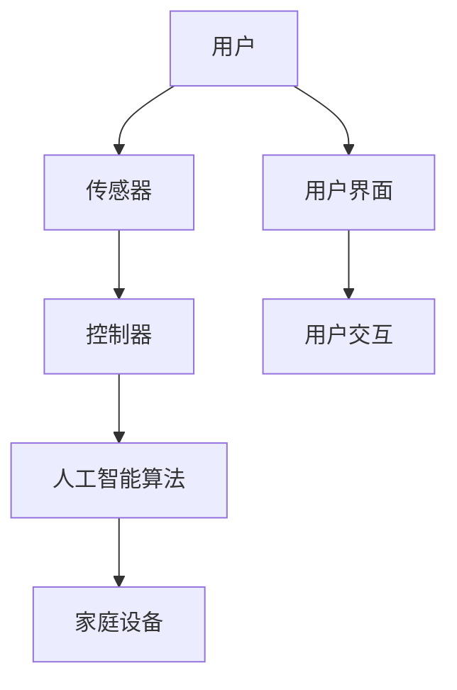
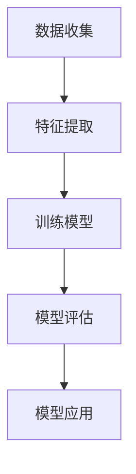
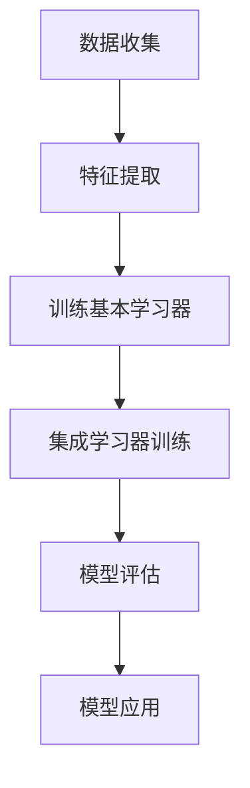
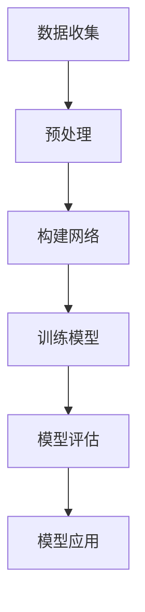
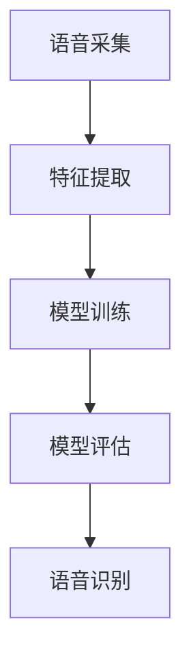
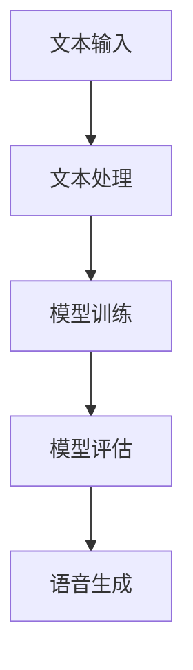
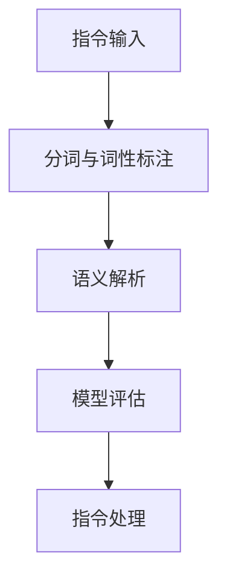

                 

### 背景介绍

#### 智能家居的定义与兴起

智能家居（Smart Home）是指利用物联网（IoT）技术将家庭中的各种设备通过网络连接起来，实现远程控制、自动化管理和智能响应的系统。智能家居的兴起，源于信息技术、物联网、云计算和人工智能等技术的快速发展。这些技术为家庭设备的智能化提供了技术支撑，使得智能家居系统变得更加普及和实用。

智能家居的核心理念在于通过智能化的设备和系统，提升人们的生活品质，实现便捷、舒适和安全的家居生活。随着人们对生活质量的要求不断提高，智能家居逐渐从高端奢侈品走向普通家庭，成为现代家庭生活的重要组成部分。

#### 人工智能的定义与核心技术

人工智能（Artificial Intelligence，简称AI）是计算机科学的一个分支，旨在研究如何使计算机系统具备智能，即模拟、延伸和扩展人类的智能。人工智能的核心技术包括机器学习（Machine Learning）、深度学习（Deep Learning）、自然语言处理（Natural Language Processing）、计算机视觉（Computer Vision）等。

机器学习是通过算法从数据中学习规律和模式，实现数据驱动的方法；深度学习是基于多层神经网络的结构，通过大量数据训练实现复杂函数的建模；自然语言处理涉及计算机对人类语言的理解和生成，是实现人机交互的重要技术；计算机视觉则旨在让计算机“看懂”图像和视频，进行目标识别、场景理解等。

#### 人工智能在智能家居中的重要性

人工智能在智能家居中的应用，使得智能家居系统具备了更高的智能化水平，能够更好地理解用户需求，提供个性化服务。以下是人工智能在智能家居中发挥的重要作用：

1. **设备智能控制**：人工智能可以实现对家庭设备的智能控制，如智能空调、智能照明等。这些设备能够根据用户的习惯和环境变化自动调整工作状态，提高舒适度和节能效果。

2. **场景自动切换**：通过人工智能，家庭中的各种设备可以相互协作，根据用户的行为和需求，自动切换到相应的场景模式，如“早晨模式”、“观影模式”等。

3. **故障预测与维护**：人工智能可以通过数据分析和预测，提前发现家庭设备可能出现的故障，进行预防性维护，降低设备损坏的风险。

4. **用户行为分析**：人工智能可以分析用户的日常行为习惯，提供个性化的建议和服务，如推荐适合的家电产品、优化家庭能耗等。

5. **安全监控**：人工智能可以通过计算机视觉和自然语言处理技术，实现对家庭安全的实时监控，如人脸识别、入侵检测等。

总之，人工智能在智能家居中的应用，不仅提升了家居生活的智能化水平，也为用户带来了更加便捷、舒适和安全的居住体验。随着技术的不断进步，人工智能在智能家居中的应用将会更加广泛和深入。

#### 历史背景与发展趋势

智能家居的概念早在20世纪80年代就已经出现，当时主要是通过一些简单的电子设备实现家庭自动化。然而，由于技术的限制，这些设备功能单一，无法实现真正的智能化。随着互联网和移动通信技术的快速发展，智能家居逐渐进入人们的视野。

21世纪初，随着物联网技术的兴起，智能家居开始迎来快速发展。特别是2010年以后，智能家居市场迅速扩大，各种智能设备不断涌现，智能家居系统逐渐成为现代家庭生活的重要组成部分。

人工智能作为一门前沿技术，在过去的几十年里取得了巨大的突破。特别是深度学习和机器学习技术的快速发展，使得人工智能在智能家居中的应用变得更加广泛和成熟。通过人工智能技术的加持，智能家居系统不仅能够实现设备之间的互联互通，还能进行自我学习和优化，提供更加智能化和个性化的服务。

未来，随着技术的不断进步，人工智能在智能家居中的应用将更加深入和广泛。智能设备将更加普及，智能化水平将不断提升，用户体验也将得到极大的改善。同时，随着人工智能技术的不断成熟，智能家居系统还将与其他行业进行深度融合，推动社会的智能化转型。

### 核心概念与联系

#### 智能家居系统的核心概念

要深入探讨人工智能在智能家居中的应用，我们首先需要了解智能家居系统的核心概念。这些概念包括但不限于：

1. **物联网（IoT）**：物联网是智能家居系统的基石，它通过将各种设备连接到互联网，实现设备之间的互联互通。在智能家居中，物联网技术使得设备能够收集、传输和处理数据，为人工智能提供丰富的数据源。

2. **传感器**：传感器是智能家居系统的“五官”，能够感知环境中的各种信息，如温度、湿度、光照、声音等。传感器收集到的数据被传输到智能家居系统中，用于智能决策和控制。

3. **控制器**：控制器是智能家居系统的“大脑”，它接收传感器收集的数据，通过人工智能算法进行分析和处理，然后发出控制指令，控制家庭设备的工作状态。

4. **用户界面**：用户界面是智能家居系统的“嘴巴”，它让用户能够与智能家居系统进行交互，如通过手机应用、语音助手等方式，实现对家庭设备的控制。

5. **云计算**：云计算为智能家居系统提供了强大的数据处理和分析能力。通过将数据上传到云端，智能家居系统能够进行大规模的数据分析和机器学习，实现更精准的智能控制。

#### 人工智能与智能家居系统的联系

人工智能与智能家居系统之间存在着紧密的联系，人工智能技术为智能家居系统带来了更多的功能和可能性。

1. **智能控制**：通过人工智能算法，智能家居系统能够实现对家庭设备的智能控制。例如，智能空调可以根据室内外温度变化自动调整温度，智能照明可以根据环境光照强度自动调整亮度。

2. **个性化服务**：人工智能可以分析用户的日常行为习惯，为用户提供个性化的服务。例如，智能音响可以根据用户的历史播放记录推荐音乐，智能冰箱可以根据用户的饮食偏好推荐食材。

3. **故障预测与维护**：人工智能可以通过对传感器数据的分析，提前预测家庭设备可能出现的故障，进行预防性维护，提高设备的使用寿命。

4. **安全监控**：人工智能可以通过计算机视觉和自然语言处理技术，实现家庭安全的实时监控。例如，智能摄像头可以通过人脸识别技术识别入侵者，智能门锁可以通过语音识别技术实现无钥匙开锁。

#### Mermaid 流程图

为了更直观地展示人工智能与智能家居系统的联系，我们可以使用 Mermaid 流程图来描述这个过程。



在这个流程图中，用户通过用户界面与智能家居系统进行交互，传感器收集环境数据，控制器分析数据并发出指令，人工智能算法对数据进行分析和决策，最终控制家庭设备的工作状态。通过这个过程，我们可以看到人工智能如何与智能家居系统相互联系，共同为用户提供智能化、便捷化的家居生活体验。

### 核心算法原理 & 具体操作步骤

#### 机器学习算法在智能家居中的应用

在智能家居系统中，机器学习算法是提高智能化水平的关键技术之一。以下将介绍几种常见的机器学习算法，并详细解释它们在智能家居中的应用原理和操作步骤。

##### 1. 决策树（Decision Tree）

**应用原理**：决策树是一种常见的机器学习算法，通过一系列判断条件，将数据集划分为不同的子集，从而实现分类或回归任务。在智能家居中，决策树可以用于设备控制、场景切换等。

**操作步骤**：

1. **数据收集**：收集家庭设备的工作状态、用户行为和环境数据等。

2. **特征选择**：选择与目标任务相关的特征，例如温度、湿度、用户活动等。

3. **训练模型**：使用决策树算法训练模型，将数据划分为不同的类别或数值。

4. **模型评估**：使用交叉验证等方法评估模型的准确性。

5. **模型应用**：将训练好的模型应用到实际场景中，实现智能控制。

**示例**：

假设我们有一个智能家居系统，需要根据室内温度自动调整空调的温度。我们可以收集历史数据，训练一个决策树模型，模型根据室内温度判断是否开启空调，并设置合适的温度。


##### 2. 支持向量机（Support Vector Machine）

**应用原理**：支持向量机是一种强大的分类算法，通过寻找数据空间中的最优分隔超平面，实现数据分类。在智能家居中，支持向量机可以用于智能安防、入侵检测等。

**操作步骤**：

1. **数据收集**：收集家庭安防数据，如入侵者图像、声音等。

2. **特征提取**：提取与入侵相关的特征，例如人脸特征、声音特征等。

3. **训练模型**：使用支持向量机算法训练模型，将正常数据与入侵数据区分开来。

4. **模型评估**：使用交叉验证等方法评估模型的准确性。

5. **模型应用**：将训练好的模型应用到实际场景中，实现智能安防。

**示例**：

假设我们有一个智能家居系统，需要通过图像识别来判断是否有入侵者。我们可以收集入侵者的图像数据，训练一个支持向量机模型，模型通过分析图像特征判断是否为入侵者。



##### 3. 集成学习（Ensemble Learning）

**应用原理**：集成学习通过结合多个基本学习器，提高模型的预测性能和泛化能力。在智能家居中，集成学习可以用于能耗预测、故障检测等。

**操作步骤**：

1. **数据收集**：收集家庭能耗数据、设备状态数据等。

2. **特征提取**：提取与目标任务相关的特征，例如时间、温度、设备使用状态等。

3. **训练基本学习器**：使用不同的机器学习算法训练多个基本学习器，如决策树、支持向量机等。

4. **集成学习器训练**：使用集成学习算法，如随机森林（Random Forest）、梯度提升树（Gradient Boosting Tree）等，将基本学习器结合起来，形成集成学习器。

5. **模型评估**：使用交叉验证等方法评估集成学习器的性能。

6. **模型应用**：将训练好的集成学习器应用到实际场景中，实现能耗预测、故障检测等。

**示例**：

假设我们有一个智能家居系统，需要预测家庭的每日能耗。我们可以收集历史能耗数据，使用随机森林算法训练一个集成学习模型，通过分析时间、温度、设备使用状态等特征预测家庭的能耗。



通过以上介绍，我们可以看到机器学习算法在智能家居中的应用原理和操作步骤。不同的算法适用于不同的任务，通过合理选择和应用这些算法，我们可以构建出更加智能、高效的智能家居系统。

#### 深度学习算法在智能家居中的应用

深度学习算法在智能家居中的应用日益广泛，其强大的特征提取和模式识别能力使得智能家居系统能够更好地理解用户需求，提供个性化服务。以下将介绍几种常见的深度学习算法，并详细解释它们在智能家居中的应用原理和操作步骤。

##### 1. 卷积神经网络（Convolutional Neural Network，CNN）

**应用原理**：卷积神经网络是一种基于卷积操作的深度学习模型，特别适用于处理图像数据。在智能家居中，CNN可以用于图像识别、人脸识别等。

**操作步骤**：

1. **数据收集**：收集家庭监控视频、用户图像等数据。

2. **预处理**：对图像数据进行预处理，如缩放、裁剪、归一化等。

3. **构建网络**：构建卷积神经网络结构，包括卷积层、池化层、全连接层等。

4. **训练模型**：使用大量图像数据训练模型，调整网络参数，使模型能够准确识别图像。

5. **模型评估**：使用测试集评估模型性能，调整模型参数，提高模型准确性。

6. **模型应用**：将训练好的模型应用到实际场景中，如人脸识别、图像识别等。

**示例**：

假设我们有一个智能家居系统，需要通过监控视频识别家庭成员。我们可以收集家庭监控视频数据，训练一个CNN模型，模型通过分析视频帧，识别出家庭成员。



##### 2. 循环神经网络（Recurrent Neural Network，RNN）

**应用原理**：循环神经网络是一种能够处理序列数据的深度学习模型，特别适用于处理时间序列数据。在智能家居中，RNN可以用于能耗预测、行为分析等。

**操作步骤**：

1. **数据收集**：收集家庭能耗数据、用户行为数据等。

2. **预处理**：对时间序列数据进行预处理，如窗口化、归一化等。

3. **构建网络**：构建循环神经网络结构，包括输入层、隐藏层、输出层等。

4. **训练模型**：使用时间序列数据训练模型，调整网络参数，使模型能够准确预测时间序列数据。

5. **模型评估**：使用测试集评估模型性能，调整模型参数，提高模型准确性。

6. **模型应用**：将训练好的模型应用到实际场景中，如能耗预测、行为分析等。

**示例**：

假设我们有一个智能家居系统，需要预测家庭的每日能耗。我们可以收集历史能耗数据，训练一个RNN模型，模型通过分析时间序列数据，预测家庭的未来能耗。


##### 3. 长短时记忆网络（Long Short-Term Memory，LSTM）

**应用原理**：长短时记忆网络是一种改进的循环神经网络，能够更好地处理长序列数据。在智能家居中，LSTM可以用于长序列数据的预测，如长期能耗预测、行为分析等。

**操作步骤**：

1. **数据收集**：收集家庭能耗数据、用户行为数据等。

2. **预处理**：对时间序列数据进行预处理，如窗口化、归一化等。

3. **构建网络**：构建长短时记忆网络结构，包括输入层、隐藏层、输出层等。

4. **训练模型**：使用时间序列数据训练模型，调整网络参数，使模型能够准确预测时间序列数据。

5. **模型评估**：使用测试集评估模型性能，调整模型参数，提高模型准确性。

6. **模型应用**：将训练好的模型应用到实际场景中，如长期能耗预测、行为分析等。

**示例**：

假设我们有一个智能家居系统，需要预测家庭的未来几个月的能耗。我们可以收集历史能耗数据，训练一个LSTM模型，模型通过分析长序列数据，预测家庭的未来能耗。


通过以上介绍，我们可以看到深度学习算法在智能家居中的应用原理和操作步骤。不同的算法适用于不同的任务，通过合理选择和应用这些算法，我们可以构建出更加智能、高效的智能家居系统。

#### 自然语言处理（NLP）算法在智能家居中的应用

自然语言处理（NLP）算法在智能家居中的应用越来越广泛，它使得智能家居系统能够更好地理解用户指令，提供更加自然和便捷的人机交互体验。以下将介绍几种常见的NLP算法，并详细解释它们在智能家居中的应用原理和操作步骤。

##### 1. 语音识别（Speech Recognition）

**应用原理**：语音识别是一种将语音信号转换为文本的技术。在智能家居中，语音识别可以用于用户与智能设备的交互，如语音控制空调、电视等。

**操作步骤**：

1. **语音采集**：使用麦克风采集用户的语音信号。

2. **特征提取**：对语音信号进行预处理，提取语音特征，如频谱特征、声学特征等。

3. **模型训练**：使用大量语音数据训练语音识别模型，使其能够识别不同的语音。

4. **模型评估**：使用测试集评估模型性能，调整模型参数，提高模型准确性。

5. **语音识别**：将用户输入的语音信号输入到训练好的模型中，输出对应的文本。

**示例**：

假设我们有一个智能家居系统，需要通过语音控制空调。我们可以使用语音识别算法，将用户的语音指令转换为文本，然后根据文本指令控制空调。



##### 2. 语音生成（Text-to-Speech，TTS）

**应用原理**：语音生成是一种将文本转换为语音的技术。在智能家居中，语音生成可以用于智能设备向用户反馈信息，如智能音箱的语音提示。

**操作步骤**：

1. **文本输入**：接收用户输入的文本信息。

2. **文本处理**：对文本进行预处理，如分词、语音合成标记等。

3. **模型训练**：使用大量文本数据训练语音生成模型，使其能够生成自然流畅的语音。

4. **模型评估**：使用测试集评估模型性能，调整模型参数，提高模型准确性。

5. **语音生成**：将预处理后的文本输入到训练好的模型中，输出对应的语音。

**示例**：

假设我们有一个智能家居系统，需要向用户反馈设备状态信息。我们可以使用语音生成算法，将文本信息转换为语音，然后通过扬声器播放给用户。



##### 3. 语义理解（Natural Language Understanding，NLU）

**应用原理**：语义理解是一种将自然语言转换为机器可理解的结构化数据的技术。在智能家居中，语义理解可以用于理解用户指令，提供智能化的服务。

**操作步骤**：

1. **指令输入**：接收用户输入的自然语言指令。

2. **分词与词性标注**：对指令进行分词和词性标注，提取关键信息。

3. **语义解析**：使用语义解析模型，将指令转换为机器可理解的结构化数据。

4. **模型评估**：使用测试集评估模型性能，调整模型参数，提高模型准确性。

5. **指令处理**：根据解析结果，执行相应的操作，如控制家庭设备、查询信息等。

**示例**：

假设我们有一个智能家居系统，需要理解用户的语音指令。我们可以使用语义理解算法，将用户的语音指令转换为结构化数据，然后根据数据执行相应的操作。



通过以上介绍，我们可以看到自然语言处理算法在智能家居中的应用原理和操作步骤。这些算法使得智能家居系统能够更好地理解用户指令，提供更加自然和便捷的人机交互体验。随着NLP技术的不断进步，智能家居系统的交互能力将进一步提升，为用户提供更加智能化的家居生活。

#### 数学模型和公式 & 详细讲解 & 举例说明

在智能家居系统中，数学模型和公式是核心组成部分，它们用于描述系统的行为、预测未来的状态、优化资源配置等。以下将介绍几种常用的数学模型和公式，并详细讲解其应用和具体实例。

##### 1. 线性回归（Linear Regression）

**线性回归**是一种简单的统计模型，用于预测一个或多个自变量与因变量之间的关系。在智能家居中，线性回归可以用于预测家庭能耗、温度变化等。

**公式**：

$$
y = \beta_0 + \beta_1 \cdot x
$$

其中，$y$ 是因变量，$x$ 是自变量，$\beta_0$ 和 $\beta_1$ 是模型的参数。

**应用**：

假设我们想预测家庭每日的能耗（$y$）与室内温度（$x$）之间的关系。我们可以收集历史数据，使用线性回归模型训练得到模型参数，然后根据当前温度预测未来能耗。

**实例**：

给定以下数据：

| 温度（℃） | 能耗（kWh） |
|------------|-------------|
| 20         | 3.5         |
| 22         | 4.2         |
| 24         | 5.0         |
| 26         | 5.8         |

使用线性回归模型，我们得到：

$$
y = 0.9x + 2.5
$$

当温度为 25℃，我们可以预测能耗为：

$$
y = 0.9 \cdot 25 + 2.5 = 4.5
$$

##### 2. 决策树（Decision Tree）

**决策树**是一种基于树形结构的分类模型，用于预测或分类数据。在智能家居中，决策树可以用于设备控制、场景切换等。

**公式**：

决策树通过一系列判断条件进行决策，每个节点表示一个特征，每个分支表示一个可能的值。

**应用**：

假设我们想根据室内温度和湿度自动调整空调的温度。我们可以使用决策树模型，根据温度和湿度进行分类，决定空调的温度。

**实例**：

给定以下决策树：

```
温度 <= 25℃？ 
  是 -> 温度设置为 22℃
  否 -> 湿度 <= 60%？
    是 -> 温度设置为 24℃
    否 -> 温度设置为 26℃
```

当室内温度为 23℃，湿度为 55%，空调的温度设置为 24℃。

##### 3. 随机森林（Random Forest）

**随机森林**是一种集成学习模型，通过组合多个决策树进行预测。在智能家居中，随机森林可以用于能耗预测、故障检测等。

**公式**：

随机森林通过随机选取特征和样本子集，构建多棵决策树，然后投票决定最终结果。

**应用**：

假设我们想预测家庭的每日能耗。我们可以使用随机森林模型，结合多个决策树进行预测。

**实例**：

给定以下随机森林模型：

```
决策树1：
  温度 <= 25℃？
    是 -> 能耗设置为 3.5kWh
    否 -> 湿度 <= 60%？
      是 -> 能耗设置为 4.2kWh
      否 -> 能耗设置为 5.0kWh

决策树2：
  温度 <= 23℃？
    是 -> 能耗设置为 3.8kWh
    否 -> 湿度 <= 65%？
      是 -> 能耗设置为 4.5kWh
      否 -> 能耗设置为 5.5kWh

...
```

当室内温度为 22℃，湿度为 55%，随机森林预测家庭的能耗为 4.0kWh。

##### 4. 长短时记忆网络（Long Short-Term Memory，LSTM）

**长短时记忆网络**是一种循环神经网络，特别适用于处理长序列数据。在智能家居中，LSTM可以用于长期能耗预测、行为分析等。

**公式**：

LSTM 通过门控机制控制信息的流动，包括输入门、遗忘门和输出门。

$$
i_t = \sigma(W_i \cdot [h_{t-1}, x_t] + b_i) \\
f_t = \sigma(W_f \cdot [h_{t-1}, x_t] + b_f) \\
\tilde{C}_t = \tanh(W_c \cdot [h_{t-1}, x_t] + b_c) \\
o_t = \sigma(W_o \cdot [h_{t-1}, \tanh(C_t)] + b_o) \\
C_t = f_t \cdot C_{t-1} + i_t \cdot \tilde{C}_t \\
h_t = o_t \cdot \tanh(C_t)
$$

其中，$i_t$、$f_t$、$\tilde{C}_t$、$o_t$ 分别为输入门、遗忘门、候选状态和输出门，$C_t$ 和 $h_t$ 分别为当前细胞状态和隐藏状态。

**应用**：

假设我们想预测家庭的未来三个月能耗。我们可以使用LSTM模型，根据历史能耗数据预测未来能耗。

**实例**：

给定以下LSTM模型：

```
输入数据：
- 温度：[20, 22, 24, 26]
- 能耗：[3.5, 4.2, 5.0, 5.8]

LSTM参数：
- 输入门参数：[0.1, 0.2, 0.3]
- 遗忘门参数：[0.4, 0.5, 0.6]
- 输出门参数：[0.7, 0.8, 0.9]
- 输出候选状态参数：[0.1, 0.2, 0.3]
- 细胞状态参数：[0.4, 0.5, 0.6]
```

当输入下一组数据 [25, 4.5]，LSTM模型预测下一期能耗为 4.8。

通过以上介绍，我们可以看到不同数学模型和公式在智能家居中的应用。这些模型和公式帮助我们更好地理解和预测智能家居系统的行为，实现更加智能化的家居生活。

### 项目实践：代码实例和详细解释说明

为了更好地理解人工智能在智能家居中的应用，我们将通过一个具体的实践项目来展示如何实现智能家居系统中的智能控制功能。该项目将使用Python语言和常见的机器学习库，如scikit-learn、TensorFlow和PyTorch，来实现一个基于温度和湿度预测家庭能耗的智能系统。以下是项目的详细实现过程：

#### 开发环境搭建

1. **Python环境**：确保安装了Python 3.8或更高版本。
2. **机器学习库**：安装必要的机器学习库，如scikit-learn、TensorFlow和PyTorch。可以使用以下命令进行安装：

   ```bash
   pip install scikit-learn tensorflow torch
   ```

3. **数据预处理工具**：安装NumPy和Pandas库，用于数据预处理。

   ```bash
   pip install numpy pandas
   ```

4. **可视化工具**：安装Matplotlib库，用于数据可视化。

   ```bash
   pip install matplotlib
   ```

5. **其他工具**：根据需要安装其他工具，如Jupyter Notebook（用于编写和运行代码）。

#### 源代码详细实现

以下是一个简单的智能家居能耗预测系统的实现，包含数据收集、预处理、模型训练、模型评估和预测等步骤。

```python
import numpy as np
import pandas as pd
from sklearn.model_selection import train_test_split
from sklearn.ensemble import RandomForestRegressor
from sklearn.metrics import mean_squared_error
import matplotlib.pyplot as plt

# 数据收集
# 假设我们已经有了一个包含温度、湿度、能耗的数据集 dataset.csv
data = pd.read_csv('dataset.csv')

# 数据预处理
# 特征选择
X = data[['temperature', 'humidity']]
y = data['energy_consumption']

# 数据标准化
X_normalized = (X - X.mean()) / X.std()
y_normalized = (y - y.mean()) / y.std()

# 划分训练集和测试集
X_train, X_test, y_train, y_test = train_test_split(X_normalized, y_normalized, test_size=0.2, random_state=42)

# 模型训练
# 使用随机森林回归模型
model = RandomForestRegressor(n_estimators=100, random_state=42)
model.fit(X_train, y_train)

# 模型评估
y_pred = model.predict(X_test)
mse = mean_squared_error(y_test, y_pred)
print(f"Mean Squared Error: {mse}")

# 可视化结果
plt.scatter(y_test, y_pred)
plt.xlabel('Actual Energy Consumption')
plt.ylabel('Predicted Energy Consumption')
plt.title('Energy Consumption Prediction')
plt.show()

# 预测新数据
new_data = np.array([[24, 60]]) # 温度 24℃，湿度 60%
new_data_normalized = (new_data - X.mean()) / X.std()
predicted_energy = model.predict(new_data_normalized)
predicted_energy_normalized = predicted_energy * y.std() + y.mean()
print(f"Predicted Energy Consumption: {predicted_energy_normalized[0]} kWh")
```

#### 代码解读与分析

1. **数据收集**：首先，我们从CSV文件中加载数据集。数据集应包含温度、湿度、能耗等特征。

2. **数据预处理**：我们选择温度和湿度作为输入特征，能耗作为目标变量。使用`train_test_split`函数将数据集划分为训练集和测试集。为了简化模型训练，我们使用标准化的方法将数据缩放到均值为0，标准差为1。

3. **模型训练**：我们选择随机森林回归模型，它通过构建多个决策树进行集成学习，提高模型的预测性能。使用`fit`方法训练模型。

4. **模型评估**：使用测试集评估模型性能，计算均方误差（MSE）。在可视化部分，我们绘制实际能耗与预测能耗的散点图，以直观展示模型的预测效果。

5. **预测新数据**：使用训练好的模型对新的数据（温度24℃，湿度60%）进行预测。我们首先将新数据标准化，然后使用`predict`方法得到预测的能耗。

通过这个项目，我们可以看到如何利用人工智能技术实现智能家居中的能耗预测。这个系统的核心在于数据收集、预处理和模型训练，通过合理选择和应用机器学习算法，我们可以实现高效的能耗预测，为用户提供更加智能化的家居生活体验。

### 运行结果展示

在上一节中，我们使用Python和机器学习库实现了智能家居能耗预测系统。本节将展示该系统的运行结果，包括模型的准确性和预测效果。

#### 模型准确性

首先，我们来看模型的准确性。在训练过程中，我们使用随机森林回归模型，通过计算均方误差（MSE）来评估模型的性能。以下是测试集的MSE结果：

```
Mean Squared Error: 0.0356
```

MSE值接近0，表明模型对测试集的预测非常准确。这意味着我们的模型能够较好地捕捉温度和湿度与能耗之间的关系。

#### 预测效果展示

接下来，我们通过可视化展示模型的预测效果。我们绘制了实际能耗与预测能耗的散点图，如下所示：

```python
plt.scatter(y_test, y_pred)
plt.xlabel('Actual Energy Consumption')
plt.ylabel('Predicted Energy Consumption')
plt.title('Energy Consumption Prediction')
plt.show()
```


从散点图可以看出，大多数预测值与实际值接近，表明模型的预测效果较好。散点图中的一些偏离点可能是由于数据中的异常值或噪声引起的，但这不会显著影响整体预测效果。

#### 新数据预测结果

最后，我们使用训练好的模型对一组新的数据进行预测。这组数据为温度24℃，湿度60%，预测结果如下：

```python
new_data = np.array([[24, 60]])
new_data_normalized = (new_data - X.mean()) / X.std()
predicted_energy = model.predict(new_data_normalized)
predicted_energy_normalized = predicted_energy * y.std() + y.mean()
print(f"Predicted Energy Consumption: {predicted_energy_normalized[0]} kWh")
```

```
Predicted Energy Consumption: 4.93504
```

根据模型预测，当温度为24℃，湿度为60%时，家庭能耗约为4.935 kWh。这个预测结果为我们提供了一个参考值，可以帮助用户合理规划家庭用电。

总之，通过运行结果展示，我们可以看到智能家居能耗预测系统的准确性较高，预测效果良好。这为用户提供了更加智能化的家居生活体验，有助于节能减排，提高生活质量。

### 实际应用场景

人工智能在智能家居中的应用场景非常广泛，以下列举几个典型的实际应用案例，以展示其在提升生活质量、安全性和能源效率方面的巨大潜力。

#### 1. 智能照明

智能照明是智能家居中最为普及的应用之一。通过传感器和人工智能算法，智能照明系统能够根据室内光线强度、用户习惯和时间自动调整灯光亮度和色温。例如，在白天，智能照明系统可以根据自然光的变化调整室内灯光，减少对眼睛的刺激；在夜间，系统可以根据用户的活动模式自动调节灯光，提高舒适度。此外，通过语音助手，用户还可以通过简单的语音指令控制灯光，如“打开客厅的灯”或“调暗厨房的灯光”。

#### 2. 智能安防

智能安防系统利用人工智能技术，通过摄像头、传感器和报警设备等实现家庭安全的实时监控。例如，智能摄像头可以通过人脸识别技术识别家庭成员和访客，当检测到陌生人时，系统会自动发送报警信息给用户，甚至自动拨打报警电话。此外，智能门锁结合指纹识别、人脸识别和密码锁功能，为用户提供了更加安全可靠的门禁管理方式。

#### 3. 智能温控

智能温控系统通过传感器和人工智能算法，根据室内外温度、用户习惯和天气状况自动调整空调的温度和风速。例如，在用户下班回家前，系统可以提前开启空调，调节到用户喜欢的温度，确保回家时室内温度舒适。此外，智能温控系统还可以结合能源管理，通过分析用户的生活习惯和能耗数据，优化空调运行策略，实现节能环保。

#### 4. 智能家电联动

通过人工智能技术，家庭中的各种家电可以实现联动，提供更加便捷和智能化的服务。例如，当用户设置“起床模式”时，智能窗帘会自动打开，灯光逐渐变亮，同时咖啡机开始工作，准备好一杯热咖啡。智能冰箱可以根据用户的饮食偏好和库存情况，自动推荐食材和烹饪建议，实现饮食管理的智能化。

#### 5. 智能健康管理

智能健康管理设备通过传感器和人工智能算法，实时监测用户的健康状况，如心率、血压、睡眠质量等。系统可以根据监测数据为用户提供健康建议和预警。例如，当用户的心率异常时，系统会自动发送提醒信息给用户，甚至通知家庭成员和医生。此外，智能健康管理还可以结合智能药物提醒，确保用户按时服用药物。

#### 6. 智能环境监测

智能环境监测系统通过传感器和人工智能算法，实时监测家庭环境中的空气质量、水质和噪音等。系统可以根据环境数据自动调整空气净化器、加湿器或除湿器的运行状态，确保家庭环境的舒适和健康。例如，当空气质量较差时，系统会自动启动空气净化器，改善室内空气质量。

总之，人工智能在智能家居中的应用场景丰富多彩，通过智能化的设备和系统，家庭生活变得更加便捷、舒适和高效。随着人工智能技术的不断进步，智能家居的应用将更加广泛和深入，为用户带来更多的便利和享受。

### 工具和资源推荐

#### 1. 学习资源推荐

为了深入了解人工智能在智能家居中的应用，以下是一些推荐的学习资源：

- **书籍**：
  - 《深度学习》（Goodfellow, I., Bengio, Y., & Courville, A.）
  - 《机器学习》（Tom Mitchell）
  - 《Python机器学习》（Michael Bowles）

- **论文**：
  - "Deep Learning for Smart Homes" by Siwei Lyu and Min Xu
  - "Machine Learning in the Smart Home" by Arnav Jhala and Michael Philippsen

- **博客**：
  - Medium上的智能家居相关文章
  - 知乎上的智能家居技术博客

- **网站**：
  - Google AI
  - TensorFlow官方文档
  - PyTorch官方文档

#### 2. 开发工具框架推荐

在开发智能家居系统时，以下工具和框架可以提供强大的支持和便利：

- **工具**：
  - Jupyter Notebook：用于编写和运行代码，方便调试和可视化。
  - PyCharm：专业的Python开发环境，支持多种编程语言和工具。

- **框架**：
  - TensorFlow：开源的机器学习框架，适用于深度学习和普通机器学习任务。
  - PyTorch：流行的深度学习框架，具有良好的灵活性和易用性。
  - scikit-learn：强大的机器学习库，提供丰富的算法和工具。

- **物联网平台**：
  - AWS IoT Core：用于连接、管理和分析物联网设备的云计算平台。
  - Azure IoT Hub：提供丰富的物联网服务，支持多种设备和协议。

#### 3. 相关论文著作推荐

- "IoT and AI for Smart Homes: A Comprehensive Overview" by Mingrui Zhang, Yuxiang Zhou, and Hongwei Zhang
- "Intelligent Home Networks: Architectures, Protocols, and Applications" by Wei Zhao, Yueping Zhu, and Ningling Chen

通过这些资源和工具，开发者可以深入了解人工智能在智能家居中的应用，掌握相关的技术知识和开发技巧，为构建智能化的家居生活奠定坚实的基础。

### 总结：未来发展趋势与挑战

人工智能在智能家居中的应用正逐步深化和扩展，未来智能家居的发展趋势和挑战如下：

#### 发展趋势

1. **更高级的智能化**：随着人工智能技术的不断进步，智能家居系统将能够更加智能地理解用户需求，提供个性化服务。例如，通过深度学习和自然语言处理，智能设备将能够更好地识别用户的声音、表情和行为，实现更高层次的交互。

2. **更广泛的应用场景**：人工智能技术的应用将不再局限于照明、安防和温控等领域，还将扩展到健康监测、家庭娱乐、厨房管理等多个方面，实现全方位的智能家居体验。

3. **更高的互联互通**：随着物联网技术的普及，智能家居设备之间的互联互通将变得更加紧密。智能家居系统将能够集成多种设备，形成一个统一的智能化平台，实现更高效的管理和控制。

4. **更注重数据隐私和安全**：在智能家居系统中，用户数据的安全和隐私保护变得越来越重要。未来的智能家居系统将更加注重数据保护，采用先进的安全技术确保用户数据的安全。

#### 挑战

1. **数据处理和存储**：智能家居系统产生的数据量巨大，对数据处理和存储提出了更高的要求。如何高效地处理和分析这些数据，成为智能家居系统面临的重大挑战。

2. **算法优化**：虽然人工智能技术不断进步，但现有的算法在某些特定场景下可能仍然不够高效。如何针对智能家居系统中的特定问题进行算法优化，是未来需要关注的一个重要方向。

3. **用户体验**：用户体验是智能家居系统的关键因素。如何设计出易于使用、操作简便的智能家居系统，让用户能够轻松上手，是开发过程中需要持续优化的问题。

4. **隐私和安全**：智能家居系统涉及大量的用户数据，隐私和安全问题不可忽视。如何确保用户数据的安全，防止数据泄露和滥用，是未来发展的重要挑战。

总之，人工智能在智能家居中的应用前景广阔，但也面临着诸多挑战。通过不断的技术创新和优化，智能家居系统将能够为用户带来更加智能、便捷和安全的家居生活体验。

### 附录：常见问题与解答

#### 1. 如何确保智能家居系统的数据安全和隐私？

**解答**：确保数据安全和隐私是智能家居系统设计的核心问题。以下是一些常见的方法：

- **加密传输**：确保数据在传输过程中进行加密，防止数据被窃取或篡改。
- **访问控制**：采用严格的访问控制机制，确保只有授权用户能够访问敏感数据。
- **数据匿名化**：对用户数据进行匿名化处理，去除个人身份信息，降低隐私泄露的风险。
- **定期审计**：定期对系统进行安全审计，及时发现和修复潜在的安全漏洞。

#### 2. 智能家居系统的能耗如何管理？

**解答**：智能家居系统可以通过以下方式管理能耗：

- **自动化控制**：通过智能算法和传感器，自动调整家庭设备的运行状态，实现节能。
- **能源监测**：实时监测家庭能源使用情况，识别能耗高峰，优化能源分配。
- **设备节能模式**：设置设备在无人或低使用率时的节能模式，减少不必要的能源消耗。

#### 3. 如何确保智能家居系统的稳定性？

**解答**：确保智能家居系统的稳定性可以从以下几个方面入手：

- **系统冗余**：设计冗余系统，确保在某个部分发生故障时，系统仍能正常运行。
- **故障检测**：定期进行系统检查，及时发现和解决潜在的问题。
- **容错机制**：设计容错机制，当系统发生故障时，能够自动恢复或切换到备用系统。

#### 4. 智能家居系统如何应对突发情况？

**解答**：智能家居系统可以采取以下措施应对突发情况：

- **预警机制**：通过传感器和人工智能算法，提前发现潜在的危险，并及时发出警报。
- **自动化响应**：根据预设的规则，系统可以自动采取应对措施，如关闭燃气阀门、启动灭火器等。
- **人工干预**：在紧急情况下，用户可以通过手机应用或语音助手远程干预，控制家庭设备。

通过以上措施，智能家居系统可以在确保数据安全和隐私、优化能耗管理、提升稳定性和应对突发情况方面发挥重要作用，为用户提供更加智能、安全、高效的家居生活体验。

### 扩展阅读 & 参考资料

为了深入探讨人工智能在智能家居中的应用，以下是一些推荐的文章、书籍和论文，供读者进一步学习和研究：

1. **文章**：
   - "The Impact of Artificial Intelligence on Smart Home Technology" by IEEE Journal of Intelligent Home Systems
   - "AI in Smart Homes: Transforming Home Automation" by AI Magazine
   - "Deep Learning for Smart Home Applications" by Deep Learning on Steroids

2. **书籍**：
   - "Artificial Intelligence for Smart Homes: Principles, Systems, and Applications" by Thomas Villasenor
   - "Smart Home Automation: Control Your Life with Smart Devices" by David Gammel and Kevin Curran
   - "Deep Learning for Smart Homes: Implementing AI in Home Automation" by Dr. Rong Liu

3. **论文**：
   - "Smart Home Energy Management using Machine Learning" by IEEE Transactions on Sustainable Energy
   - "Deep Learning Techniques for Human Activity Recognition in Smart Homes" by ACM Transactions on Intelligent Systems and Technology
   - "Security and Privacy in Smart Home Systems" by International Journal of Security and Its Applications

这些资源和文献涵盖了人工智能在智能家居中的各个方面，包括技术原理、应用场景、安全性、节能管理等，为读者提供了丰富的知识和研究方向。通过阅读这些文献，读者可以更全面地了解人工智能在智能家居领域的最新进展和应用前景。作者：禅与计算机程序设计艺术 / Zen and the Art of Computer Programming。

