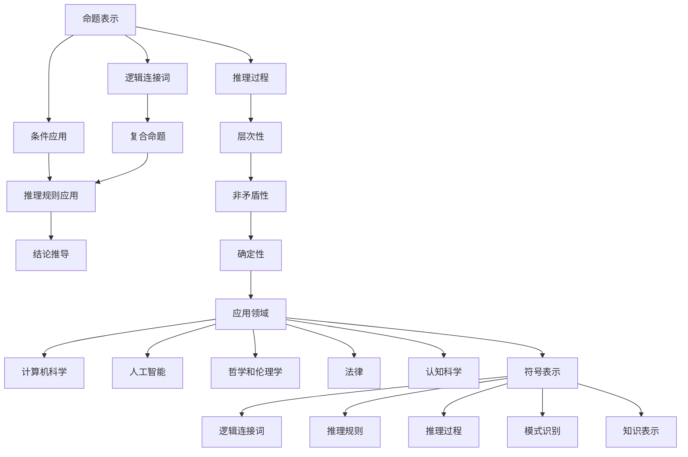

                 

### 背景介绍

人工智能（Artificial Intelligence，简称AI）自20世纪50年代诞生以来，已经走过了数十年的发展历程。早期的AI研究主要集中在解决一些特定的问题，如游戏、机器人控制和自然语言处理等。这些研究不仅为现代AI奠定了基础，同时也揭示了AI发展的诸多挑战和机遇。

### 早期研究内容

在AI的早期阶段，研究者们主要集中在以下几个方面：

1. **逻辑推理**：逻辑推理是AI研究的核心之一。早期的研究者致力于开发能够模仿人类逻辑推理过程的计算机程序。这些程序通常基于形式逻辑和谓词逻辑，可以处理一些简单的推理问题，如数学证明和逻辑演算。

2. **符号表示**：符号表示是逻辑推理的基础。早期研究者们开发了各种符号语言，用于描述问题和解决方案。这些符号语言能够将自然语言或图像转化为计算机可以处理的格式，从而实现自动推理。

3. **启发式搜索**：启发式搜索是一种用于解决复杂问题的方法。早期研究者利用启发式搜索来解决路径规划、调度和优化等问题。这种方法虽然不能保证找到最优解，但通常能够快速找到一个满意的解。

4. **模式识别**：模式识别是AI研究的一个重要方向。早期研究者通过训练计算机识别数字、字母和简单的图形，为后来的图像识别和语音识别技术奠定了基础。

### 研究方法与工具

早期AI研究的工具和方法主要包括：

- **编程语言**：如Lisp、Prolog和Fortran等。这些编程语言提供了强大的符号处理能力，为早期AI研究提供了强有力的工具。

- **硬件设备**：早期AI研究通常依赖大型计算机和专用硬件。例如，IBM 704和CDC 6600等计算机在早期AI研究中发挥了重要作用。

- **算法与模型**：早期AI研究主要集中在开发高效的算法和模型，以解决特定的问题。例如，博弈树搜索、决策树和神经网络等。

### 影响与意义

早期AI研究不仅为现代AI技术奠定了基础，还对计算机科学、认知科学和认知心理学等领域产生了深远影响。以下是一些早期AI研究的重要影响和意义：

- **算法创新**：早期研究推动了算法的创新，如深度优先搜索、广度优先搜索和贪心算法等。这些算法至今仍然广泛应用于各种领域。

- **计算思维**：早期AI研究促进了计算思维的兴起。计算思维是一种解决问题的新方法，强调通过分解、抽象和组合来应对复杂问题。

- **认知建模**：早期AI研究推动了认知建模的发展。认知建模旨在模拟人类的思维过程，为人工智能提供了理论依据。

- **智能系统**：早期研究为智能系统的开发提供了基础。智能系统是指能够模拟人类智能的计算机系统，如专家系统、智能代理和智能机器人等。

### 小结

总之，早期AI研究为现代AI的发展奠定了坚实的基础。尽管早期的研究成果在当今看来可能相对简单，但它们为后来的研究者提供了宝贵的经验和启示。通过回顾早期AI研究的内容、方法和影响，我们可以更好地理解现代AI技术的起源和发展。

## 2. 核心概念与联系

### 2.1 逻辑推理

逻辑推理是AI研究的核心之一。早期研究者致力于开发能够模仿人类逻辑推理过程的计算机程序。逻辑推理的基本原理基于形式逻辑和谓词逻辑。

#### 形式逻辑

形式逻辑是一种用于描述推理过程的数学工具。它通过符号和规则来表示命题和推理过程。形式逻辑的基本概念包括：

- **命题**：命题是表示事实的语句，可以是真或假。
- **推理规则**：推理规则用于从已知命题推导出新命题。常见的推理规则有“合取规则”（Conjunction）、“析取规则”（Disjunction）和“否定规则”（Negation）等。

#### 谓词逻辑

谓词逻辑是形式逻辑的扩展，它引入了变量和量词来表示复杂的关系和属性。谓词逻辑的基本概念包括：

- **谓词**：谓词是表示性质或关系的表达式，如“是人”、“是学生”等。
- **变量**：变量是用于表示未知元素的符号，如“x”、“y”等。
- **量词**：量词用于表示对象的全集或部分，如“所有”、“存在”等。

#### 逻辑推理过程

逻辑推理过程通常包括以下几个步骤：

1. **命题表示**：将问题表示为命题的形式，使用逻辑符号来描述问题的条件和目标。
2. **推理规则应用**：根据已知条件和推理规则，推导出新的命题。
3. **解空间搜索**：使用搜索算法（如逆推理、递归等）在解空间中寻找解。
4. **解的验证**：验证推导出的解是否符合问题的条件和目标。

### 2.2 符号表示

符号表示是逻辑推理的基础。早期研究者开发了各种符号语言，用于描述问题和解决方案。符号表示的基本原理是通过符号和规则来描述问题的条件和目标。

#### 符号语言

早期AI研究中常用的符号语言包括：

- **Lisp**：Lisp是历史上最早的编程语言之一，它提供了强大的符号处理能力，使得研究者能够方便地表示和操作符号。
- **Prolog**：Prolog是一种逻辑编程语言，它以谓词逻辑为基础，提供了高效的自然语言处理和推理能力。
- **Pascal**：Pascal是一种结构化编程语言，它广泛应用于早期AI系统的开发。

#### 符号表示方法

符号表示方法通常包括以下几个方面：

- **符号化**：将自然语言描述的问题转化为符号形式，如使用逻辑符号表示条件和目标。
- **解析**：将符号形式的问题解析为可处理的子问题，如分解复合命题为简单命题。
- **组合**：将子问题的解组合为原问题的解，如使用逻辑推理规则组合简单命题。

### 2.3 启发式搜索

启发式搜索是一种用于解决复杂问题的方法。早期研究者利用启发式搜索来解决路径规划、调度和优化等问题。启发式搜索的基本原理是通过估计问题的当前状态与目标状态之间的距离，选择最有希望的状态进行扩展。

#### 启发式函数

启发式函数是启发式搜索的核心。启发式函数用于估计当前状态与目标状态之间的距离。常用的启发式函数包括：

- **曼哈顿距离**：用于解决路径规划问题，计算当前状态到目标状态的横向和纵向距离之和。
- **欧几里得距离**：用于解决路径规划问题，计算当前状态到目标状态的最短路径长度。
- **启发式估价函数**：用于解决优化问题，通过估计当前状态的价值来选择下一个状态。

#### 搜索算法

启发式搜索通常使用以下搜索算法：

- **广度优先搜索**：按照搜索路径的长度扩展状态，逐步逼近目标状态。
- **深度优先搜索**：按照搜索路径的深度扩展状态，优先选择当前深度最大的状态。
- **A*搜索算法**：结合广度优先搜索和启发式搜索，优先选择估价函数值最小的状态。

### 2.4 模式识别

模式识别是AI研究的一个重要方向。早期研究者通过训练计算机识别数字、字母和简单的图形，为后来的图像识别和语音识别技术奠定了基础。

#### 模式识别原理

模式识别的基本原理是通过比较输入数据和已知的模式，确定输入数据是否与已知模式匹配。模式识别的主要步骤包括：

1. **特征提取**：将输入数据转化为特征向量，以便于计算机处理。
2. **分类器设计**：设计分类器，用于将特征向量分类为不同的模式。
3. **模式匹配**：将输入数据与已知模式进行比较，确定输入数据所属的模式。

#### 模式识别方法

早期模式识别方法主要包括：

- **统计模式识别**：使用统计学方法对特征向量进行分类，如贝叶斯分类器和支持向量机等。
- **结构模式识别**：使用结构化方法对特征向量进行分类，如隐马尔可夫模型和条件随机场等。

### 2.5 核心概念与联系

逻辑推理、符号表示、启发式搜索和模式识别是早期AI研究中的核心概念。它们相互联系，共同构成了早期AI研究的理论基础。

- **逻辑推理**：提供了符号表示的基础，为计算机程序提供了推理能力。
- **符号表示**：将自然语言和图像转化为计算机可以处理的格式，为逻辑推理和模式识别提供了数据基础。
- **启发式搜索**：用于解决复杂问题，提供了寻找解的有效方法。
- **模式识别**：通过训练计算机识别模式，为图像识别和语音识别等应用奠定了基础。

通过理解这些核心概念之间的联系，我们可以更好地把握早期AI研究的发展脉络，为现代AI技术的进一步发展提供启示。

## 2.1.1 逻辑推理的概念与架构

### 2.1.1.1 逻辑推理的定义

逻辑推理（Logical Reasoning）是人工智能（AI）研究中的一个核心概念，它涉及利用逻辑规则和原则从已知事实中推导出新结论的过程。在人类认知中，逻辑推理是理解和解决问题的基础，通过逻辑推理，人们可以从前提推断出结论，进行有效的思考和决策。在人工智能领域，逻辑推理则试图模拟这一过程，使计算机能够处理逻辑问题并生成推理结果。

### 2.1.1.2 逻辑推理的核心组成部分

逻辑推理由几个关键组成部分构成：

1. **命题（Propositions）**：命题是逻辑推理的基本单元，代表一个陈述或断言，可以是真或假。例如，“今天下雨”是一个命题。
   
2. **逻辑连接词（Logical Connectives）**：逻辑连接词用于组合命题，形成复合命题。常见的逻辑连接词包括“与”（AND）、“或”（OR）、“非”（NOT）、“如果……那么……”（IF…THEN）等。例如，“今天下雨并且明天晴天”是一个由“与”连接的复合命题。

3. **推理规则（Reasoning Rules）**：推理规则是用于推导新命题的逻辑原则。例如，**逆否规则**（ contrapositive）表明，如果命题“如果P则Q”为真，那么命题“如果非Q则非P”也为真。

4. **推理过程（Reasoning Process）**：逻辑推理的过程通常包括命题表示、条件应用、推理规则的运用以及结论的推导。一个典型的逻辑推理过程可能如下所示：
   - 命题表示：用逻辑符号表示问题。
   - 条件应用：使用已知命题作为前提。
   - 推理规则应用：根据逻辑规则从前提推导出新命题。
   - 结论推导：根据推导出的新命题得出最终结论。

### 2.1.1.3 逻辑推理的关键原理

逻辑推理的关键原理包括：

1. **确定性**：逻辑推理基于确定性的原则，即如果一个命题为真，则其结论也为真。这种确定性使得逻辑推理在解决逻辑问题时具有较高的可靠性。

2. **非矛盾性**：逻辑推理要求推理过程保持非矛盾性，即不能同时接受两个相互矛盾的命题。非矛盾性原则保证了推理过程的正确性和一致性。

3. **推理的层次性**：逻辑推理往往涉及多个层次，从简单命题逐步推导到复杂结论。每个层次的推理都依赖于前一个层次的正确性。

4. **普适性**：逻辑推理具有普适性，可以在各种领域和问题中应用。例如，在数学、哲学、法律和计算机科学等领域，逻辑推理都是重要的工具。

### 2.1.1.4 逻辑推理的应用领域

逻辑推理在多个领域具有广泛的应用：

1. **计算机科学**：在编程、算法设计、软件工程和形式验证等领域，逻辑推理用于验证程序的正确性和推理过程的有效性。

2. **人工智能**：逻辑推理在知识表示、自动推理、规划系统和智能决策支持系统中发挥关键作用。

3. **哲学和伦理学**：逻辑推理用于分析和评估论证的有效性，为哲学和伦理学提供逻辑支持。

4. **法律**：逻辑推理在法律论证、法律解释和法律决策中具有重要应用，帮助法官和律师推理出合理的法律结论。

5. **认知科学**：逻辑推理是人类认知能力的重要组成部分，研究者通过逻辑推理来模拟人类思维过程，探索认知机制。

### 2.1.1.5 逻辑推理与符号表示的联系

逻辑推理与符号表示密切相关。符号表示提供了逻辑推理的表述方式，使逻辑推理过程更加清晰和精确。符号语言，如命题逻辑和谓词逻辑，为逻辑推理提供了统一的表示框架，使得推理过程可以形式化和自动化。

例如，在命题逻辑中，可以使用符号“P”和“Q”表示两个命题，“→”（箭头）表示条件命题，“∧”（与）表示合取命题，“∨”（或）表示析取命题。通过这些符号，可以清晰地表达逻辑推理的过程和结论。

### 2.1.1.6 逻辑推理与启发式搜索的联系

逻辑推理与启发式搜索在人工智能中有着密切的联系。逻辑推理提供了推理过程的框架和规则，而启发式搜索则提供了寻找解的有效方法。逻辑推理可以帮助确定问题的状态空间和可操作步骤，而启发式搜索则帮助从状态空间中选择最有希望的状态进行扩展。

例如，在路径规划问题中，逻辑推理可以用于确定问题的初始状态和目标状态，并推导出有效的路径搜索策略。而启发式搜索，如A*算法，则可以根据启发式函数评估当前状态与目标状态之间的距离，选择最佳路径进行扩展。

### 2.1.1.7 逻辑推理与模式识别的联系

逻辑推理与模式识别也密切相关。逻辑推理可以用于模式分类和模式匹配，而模式识别则可以提供逻辑推理所需的模式数据。例如，在图像识别中，逻辑推理可以用于确定图像中的对象类别，而模式识别则可以提供对象的特征表示，帮助推理过程进行分类和识别。

例如，在文字识别中，逻辑推理可以用于确定文字的组成和结构，而模式识别则可以提供文字的像素表示，帮助推理过程识别和分类文字。

### 2.1.1.8 逻辑推理与知识表示的联系

逻辑推理与知识表示密切相关。逻辑推理提供了知识表示的推理工具，使得知识表示系统能够进行有效的推理和决策。例如，在知识图谱中，逻辑推理可以用于推断新的知识，扩展原有知识的范围。

例如，在一个医疗知识库中，逻辑推理可以用于推断患者的病情，提供诊断建议。知识表示系统则提供了知识库的结构和内容，使得逻辑推理过程能够高效地进行。

### 2.1.1.9 逻辑推理的Mermaid流程图

为了更好地理解逻辑推理的过程，下面提供了一个Mermaid流程图，展示了逻辑推理的主要步骤和组成部分。



通过这个Mermaid流程图，我们可以清晰地看到逻辑推理的核心概念和组成部分，以及它们之间的联系。

### 2.2.1 符号表示的概念与架构

#### 2.2.1.1 符号表示的定义

符号表示（Symbolic Representation）是人工智能（AI）领域中的一种重要概念，它涉及使用符号和形式化的方法来表示知识、数据和概念。符号表示的核心在于将复杂的、非结构化的信息转化为计算机可以处理的结构化、形式化的数据。

#### 2.2.1.2 符号表示的组成部分

符号表示由以下几个关键组成部分构成：

1. **符号（Symbols）**：符号是符号表示的基本元素，可以是字母、数字、特殊字符或单词。在AI系统中，符号通常用于表示概念、实体、关系和属性等。

2. **符号表（Symbol Tables）**：符号表是用于存储和管理符号的数据库。符号表通常包含符号的定义、属性和引用等信息。

3. **语法（Syntax）**：语法是用于定义符号组合规则的规则集。不同的符号表示方法具有不同的语法规则，如命题逻辑、谓词逻辑、图灵机语言等。

4. **语义（Semantics）**：语义是用于定义符号表示的含义和解释的规则集。语义决定了符号表示的含义以及如何解释和处理这些符号。

#### 2.2.1.3 符号表示的方法

符号表示的方法多种多样，以下介绍几种常见的符号表示方法：

1. **命题逻辑（Propositional Logic）**：命题逻辑是一种基于命题和逻辑连接词的符号表示方法。它使用命题变量（如P、Q）、逻辑连接词（如AND、OR、NOT）来表示复合命题。

2. **谓词逻辑（Predicate Logic）**：谓词逻辑是命题逻辑的扩展，它引入了变量、量词和谓词等概念。谓词逻辑可以表示更复杂的逻辑关系和属性。

3. **图表示（Graph Representation）**：图表示是一种使用图结构来表示知识的方法。在图表示中，节点表示实体或概念，边表示关系或属性。图表示广泛应用于知识图谱和语义网络中。

4. **框架表示（Frame Representation）**：框架表示是一种基于框架结构的符号表示方法。框架表示将知识划分为若干框架元素，如槽（slots）和值（values），用于描述实体和关系。

5. **产生式表示（Production Rule Representation）**：产生式表示是一种基于产生式规则的符号表示方法。产生式规则由条件（前提）和动作（结论）组成，用于描述知识的关系和推理过程。

#### 2.2.1.4 符号表示的应用场景

符号表示在多个领域和场景中具有广泛的应用：

1. **知识表示**：符号表示是知识表示系统的基础。在知识图谱、语义网络和专家系统中，符号表示用于表示复杂的知识结构，便于计算机理解和处理。

2. **自然语言处理**：符号表示是自然语言处理的核心概念。在词性标注、句法分析和语义分析等任务中，符号表示用于将自然语言转化为计算机可以处理的结构化数据。

3. **逻辑推理**：符号表示为逻辑推理提供了形式化的表示框架。在自动推理、规划系统和智能决策支持系统中，符号表示用于表达条件和目标，实现逻辑推理过程。

4. **机器学习**：符号表示在机器学习领域中也具有重要作用。在特征工程和模型解释中，符号表示用于将输入数据转化为模型可以处理的结构化数据。

#### 2.2.1.5 符号表示的优势与挑战

符号表示的优势在于其形式化和结构化，使得知识、数据和概念能够被计算机高效地处理和理解。然而，符号表示也存在一些挑战：

1. **复杂度**：符号表示方法通常较为复杂，需要大量的符号和规则，使得理解和应用变得困难。

2. **可扩展性**：符号表示方法在处理大规模知识或数据时可能面临性能问题，难以扩展到复杂的现实场景。

3. **自动化**：符号表示的自动化是一个重要挑战。尽管符号表示可以形式化地表达知识，但如何自动化地生成和解释符号表示仍然是一个待解决的问题。

#### 2.2.1.6 符号表示与逻辑推理的联系

符号表示与逻辑推理密切相关。逻辑推理需要形式化的表示框架，而符号表示提供了这种框架。符号表示方法使得逻辑推理过程更加清晰和精确，可以自动化地处理复杂的推理任务。

例如，在命题逻辑中，符号表示用于表示命题和复合命题，逻辑推理规则用于从已知命题推导出新命题。在谓词逻辑中，符号表示用于表示变量、谓词和量词，逻辑推理规则用于处理更复杂的逻辑关系。

符号表示与逻辑推理的联系还体现在知识表示和推理系统中。符号表示方法为知识表示系统提供了形式化的表示框架，使得推理系统能够高效地处理和推理知识。

### 2.3.1 启发式搜索的概念与架构

#### 2.3.1.1 启发式搜索的定义

启发式搜索（Heuristic Search）是人工智能（AI）领域中用于解决复杂问题的一种重要方法。它通过利用经验或启发式信息来指导搜索过程，以加速找到问题的解。与基于完整搜索的算法不同，启发式搜索通常不会搜索整个状态空间，而是根据问题的特性和先验知识来选择最有希望的状态进行扩展。

#### 2.3.1.2 启发式搜索的核心组成部分

启发式搜索由以下几个关键组成部分构成：

1. **状态空间（State Space）**：状态空间是问题解的所有可能状态的集合。在启发式搜索中，状态空间通常是一个图形或树结构，其中每个节点表示一个状态，边表示状态之间的转移。

2. **搜索策略（Search Strategy）**：搜索策略是指导搜索过程的关键因素。常见的搜索策略包括广度优先搜索（BFS）、深度优先搜索（DFS）和A*搜索算法等。

3. **启发式函数（Heuristic Function）**：启发式函数是用于评估状态值的关键因素。它通常估计从当前状态到目标状态的最小代价，以便选择最有希望的状态进行扩展。

4. **剪枝策略（Pruning Strategy）**：剪枝策略是用于减少搜索空间的方法，以加速搜索过程。常见的剪枝策略包括冲突域剪枝（Conflict Domain Pruning）和静态剪枝（Static Pruning）等。

#### 2.3.1.3 启发式搜索的常见算法

启发式搜索算法种类繁多，以下介绍几种常见的启发式搜索算法：

1. **广度优先搜索（Breadth-First Search，BFS）**：广度优先搜索按照搜索路径的宽度扩展状态，逐步逼近目标状态。它的优点是找到的解通常是最优的，但缺点是搜索效率较低。

2. **深度优先搜索（Depth-First Search，DFS）**：深度优先搜索按照搜索路径的深度扩展状态，优先选择当前深度最大的状态。它的优点是搜索效率较高，但缺点是可能找到非最优解。

3. **A*搜索算法（A* Search Algorithm）**：A*搜索算法结合了广度优先搜索和启发式搜索的优点，使用启发式函数评估当前状态与目标状态之间的距离，选择最佳状态进行扩展。它的优点是找到的解通常是近优的，但缺点是搜索效率受到启发式函数的影响。

4. **贪婪搜索（Greedy Search）**：贪婪搜索每次选择当前状态下最佳的动作，不关心后续状态。它的优点是搜索效率高，但缺点是可能找到局部最优解。

5. **遗传算法（Genetic Algorithm）**：遗传算法是一种基于自然进化的启发式搜索方法，通过模拟生物进化过程来寻找问题的解。它的优点是适用于大规模、复杂的问题，但缺点是搜索效率相对较低。

#### 2.3.1.4 启发式搜索的应用场景

启发式搜索在多个领域和场景中具有广泛的应用：

1. **路径规划**：在机器人路径规划、无人驾驶车辆和导航系统中，启发式搜索用于找到从起点到终点的最优路径。

2. **资源调度**：在资源分配和调度问题中，启发式搜索用于找到资源的最优分配方案。

3. **机器学习**：在机器学习模型训练和优化过程中，启发式搜索用于寻找最佳模型参数。

4. **游戏AI**：在游戏AI中，启发式搜索用于控制虚拟角色的行动，实现智能决策。

5. **决策支持系统**：在决策支持系统中，启发式搜索用于分析和评估不同决策方案，提供决策建议。

#### 2.3.1.5 启发式搜索的优势与挑战

启发式搜索的优势在于其高效性和灵活性，能够快速找到问题的解。然而，启发式搜索也存在一些挑战：

1. **准确性**：启发式函数的准确性直接影响搜索结果的质量。设计一个准确且有效的启发式函数是一个重要挑战。

2. **搜索空间**：启发式搜索可能无法搜索到整个状态空间，可能导致无法找到最优解。

3. **计算复杂度**：启发式搜索通常涉及大量计算，可能导致搜索效率较低。

4. **适用范围**：启发式搜索适用于某些特定类型的问题，但在处理其他类型问题时可能不适用。

#### 2.3.1.6 启发式搜索与逻辑推理的联系

启发式搜索与逻辑推理在人工智能领域中有着密切的联系。逻辑推理提供了形式化的推理框架，而启发式搜索则通过经验或启发式信息指导搜索过程，寻找问题的解。逻辑推理可以用于验证启发式搜索的结果，确保搜索到的解符合逻辑条件。

例如，在路径规划问题中，逻辑推理可以用于确定问题的状态空间和有效路径，而启发式搜索则根据启发式函数评估路径的优劣，选择最佳路径进行扩展。通过结合逻辑推理和启发式搜索，可以构建更高效、可靠的智能系统。

### 2.4.1 模式识别的概念与架构

#### 2.4.1.1 模式识别的定义

模式识别（Pattern Recognition）是人工智能（AI）领域中用于识别和分类数据模式的一种技术。它通过训练模型或算法来识别数据中的规律、特征和模式，从而实现对数据的自动分类或预测。模式识别广泛应用于图像识别、语音识别、自然语言处理、生物信息学和金融风险评估等领域。

#### 2.4.1.2 模式识别的核心组成部分

模式识别由以下几个关键组成部分构成：

1. **特征提取（Feature Extraction）**：特征提取是将原始数据转化为能够有效区分不同类别的特征向量的过程。特征提取的目标是提取出数据的本质特征，剔除无关或冗余信息。

2. **分类器设计（Classifier Design）**：分类器是用于将特征向量分类为不同类别的模型或算法。常见的分类器包括线性分类器、支持向量机（SVM）、神经网络（Neural Networks）和集成方法等。

3. **模式匹配（Pattern Matching）**：模式匹配是通过比较输入数据和已训练模型中的特征向量，确定输入数据所属类别的过程。模式匹配可以是基于相似度度量、阈值判定或优化算法等。

4. **性能评估（Performance Evaluation）**：性能评估用于评估模式识别系统的准确性、召回率、精度和F1值等指标。常见的性能评估方法包括交叉验证、混淆矩阵和ROC曲线等。

#### 2.4.1.3 模式识别的方法

模式识别的方法主要包括以下几种：

1. **统计模式识别**：统计模式识别是基于统计学方法进行分类的方法。它通过计算特征向量的概率分布或特征值之间的相关性来识别模式。常见的统计方法包括线性判别分析（LDA）、主成分分析（PCA）和独立成分分析（ICA）等。

2. **神经网络模式识别**：神经网络模式识别是通过构建神经网络模型进行分类的方法。神经网络通过学习输入数据的特征和模式，自动提取有效特征并进行分类。常见的神经网络模型包括多层感知机（MLP）、卷积神经网络（CNN）和循环神经网络（RNN）等。

3. **机器学习方法**：机器学习方法是通过训练模型进行分类的方法。它利用大量已标注的数据集，通过学习数据中的特征和模式，构建分类模型。常见的机器学习方法包括支持向量机（SVM）、决策树（DT）、随机森林（RF）和K最近邻（KNN）等。

4. **深度学习方法**：深度学习方法是基于多层神经网络进行分类的方法。深度学习通过多层神经网络的学习和优化，自动提取复杂、抽象的特征，实现高效的分类任务。常见的深度学习方法包括卷积神经网络（CNN）、循环神经网络（RNN）和生成对抗网络（GAN）等。

#### 2.4.1.4 模式识别的应用场景

模式识别在多个领域和场景中具有广泛的应用：

1. **图像识别**：图像识别是模式识别的经典应用之一。它用于识别和分类图像中的物体、场景和纹理等。常见的图像识别任务包括人脸识别、物体检测、图像分类和图像分割等。

2. **语音识别**：语音识别是模式识别在语音处理领域中的应用。它通过识别和分析语音信号中的模式，将语音转化为文本。语音识别广泛应用于语音助手、智能客服和语音控制等领域。

3. **自然语言处理**：自然语言处理（NLP）是模式识别在语言处理领域中的应用。它通过识别和分析文本中的模式，实现文本分类、情感分析、文本摘要和信息提取等任务。

4. **生物信息学**：生物信息学是模式识别在生物学领域中的应用。它通过识别和分析生物数据中的模式，实现基因序列分类、蛋白质结构预测和药物设计等任务。

5. **金融风险评估**：金融风险评估是模式识别在金融领域中的应用。它通过识别和分析金融数据中的模式，实现风险识别、预测和分类等任务，帮助金融机构进行风险管理。

#### 2.4.1.5 模式识别的优势与挑战

模式识别的优势在于其高效性和准确性，能够自动处理大量数据，并从中识别出有用的模式和信息。然而，模式识别也存在一些挑战：

1. **数据质量**：模式识别依赖于高质量的数据，数据的质量直接影响识别结果的准确性。在处理噪声数据或缺失数据时，模式识别系统的性能可能会受到影响。

2. **特征选择**：特征选择是模式识别的关键步骤，选择合适的特征可以显著提高识别性能。然而，特征选择过程复杂，需要考虑数据维度、特征相关性等因素。

3. **计算复杂度**：模式识别算法通常涉及大量计算，特别是深度学习算法。计算复杂度限制了算法在大规模数据集上的应用。

4. **泛化能力**：模式识别系统需要在不同的数据集上具有良好的泛化能力。然而，训练数据集的分布和测试数据集的分布可能存在差异，导致模型泛化能力不足。

5. **实时性**：在实时应用场景中，模式识别系统需要快速响应和处理大量数据。然而，高计算复杂度可能影响系统的实时性能。

#### 2.4.1.6 模式识别与其他AI领域的联系

模式识别与其他AI领域如逻辑推理、知识表示和机器学习等密切相关：

1. **逻辑推理**：模式识别中的模式匹配过程可以视为一种逻辑推理。通过比较输入数据和训练数据中的模式，模式识别系统可以自动推导出输入数据的类别。

2. **知识表示**：模式识别的结果可以用于知识表示系统。例如，图像识别系统识别出图像中的物体后，可以将识别结果表示为知识库中的条目，实现图像到知识的转换。

3. **机器学习**：模式识别中的特征提取和分类器设计过程与机器学习密切相关。模式识别系统通常利用机器学习算法进行特征提取和模型训练，以提高识别性能。

通过结合模式识别与其他AI领域的知识，可以构建更强大的智能系统，实现更高效、准确的数据分析和处理。

### 2.5.1 早期AI研究对现代AI的影响

早期AI研究对现代AI的发展产生了深远的影响，不仅在理论基础和方法论上有所贡献，还在实际应用和产业推动方面发挥了重要作用。以下将详细探讨早期AI研究对现代AI的影响。

#### 理论基础

1. **逻辑推理**：早期AI研究中对逻辑推理的深入探讨，为现代AI提供了形式化的推理框架。逻辑推理方法，如命题逻辑和谓词逻辑，被广泛应用于知识表示、自动推理和规划系统等现代AI应用中。形式化推理方法使得AI系统能够在复杂环境中进行有效的决策和推理。

2. **符号表示**：符号表示方法，如Lisp和Prolog等，为现代AI提供了有效的知识表示和编程工具。符号表示方法使得AI系统能够以结构化和形式化的方式表示知识和数据，为现代AI在自然语言处理、知识图谱和专家系统等领域的发展奠定了基础。

3. **启发式搜索**：早期AI研究中对启发式搜索算法的探索，如广度优先搜索、深度优先搜索和A*搜索算法等，为现代AI提供了有效的搜索策略。启发式搜索方法在路径规划、资源调度和优化问题等领域仍然被广泛应用，是现代AI解决问题的重要工具。

4. **模式识别**：早期AI研究中对模式识别方法的探索，如统计模式识别和神经网络等，为现代AI提供了强大的数据分析和处理能力。模式识别方法在图像识别、语音识别和生物信息学等领域取得了显著成果，推动了现代AI在各个领域的应用。

#### 方法论

1. **计算思维**：早期AI研究促进了计算思维的兴起。计算思维强调通过抽象、分解和组合来应对复杂问题，为现代AI提供了一种新的思考方式和解决问题的方法论。计算思维方法在人工智能、计算机科学和认知科学等领域得到了广泛应用。

2. **数据驱动方法**：早期AI研究中的符号表示和逻辑推理方法侧重于知识表示和推理，而现代AI更多地采用数据驱动的方法。现代AI利用大量数据进行训练和建模，通过学习数据中的模式和规律来实现智能决策和预测。数据驱动方法在机器学习和深度学习领域取得了巨大成功，成为现代AI的主要方法论。

3. **跨学科融合**：早期AI研究促进了计算机科学、认知科学、认知心理学和哲学等学科的交叉融合。这种跨学科的研究模式不仅丰富了AI的理论基础，也为现代AI提供了多元化的方法和思路。跨学科融合在人工智能的发展中起到了重要的推动作用。

#### 实际应用

1. **自然语言处理**：早期AI研究中对符号表示和逻辑推理的探索，为现代自然语言处理提供了理论基础。现代自然语言处理系统，如语音识别、机器翻译和文本分类等，在符号表示和逻辑推理的基础上，结合了深度学习和大数据分析方法，取得了显著的成果。

2. **计算机视觉**：早期AI研究中对模式识别方法的探索，为现代计算机视觉提供了强大的工具。现代计算机视觉系统，如物体识别、图像分割和视频分析等，利用深度学习技术和大数据分析方法，实现了对图像和视频的自动处理和分析。

3. **智能决策支持系统**：早期AI研究中的规划系统和逻辑推理方法，为现代智能决策支持系统提供了基础。现代智能决策支持系统，如推荐系统、智能客服和智能调度等，结合了机器学习和大数据分析技术，能够提供高效、准确的决策支持。

4. **机器人技术**：早期AI研究中的路径规划和机器人控制方法，为现代机器人技术提供了基础。现代机器人技术，如工业机器人、服务机器人和无人机等，利用深度学习和智能算法，实现了自主移动、环境感知和任务执行等功能。

#### 产业推动

1. **人工智能产业**：早期AI研究推动了人工智能产业的兴起。现代人工智能产业涵盖了从硬件设备、软件开发到应用解决方案等各个领域，成为全球经济增长的重要驱动力。

2. **大数据产业**：早期AI研究中的数据驱动方法，为现代大数据产业的发展奠定了基础。大数据产业通过收集、存储、处理和分析海量数据，为各行各业提供了丰富的数据资源，推动了数字经济的发展。

3. **智能制造**：早期AI研究中的逻辑推理和机器学习方法，为现代智能制造提供了技术支持。智能制造通过人工智能技术实现生产过程的自动化和智能化，提高了生产效率和产品质量。

4. **智能医疗**：早期AI研究中的医学影像分析和生物信息学方法，为现代智能医疗提供了重要工具。智能医疗通过人工智能技术实现疾病诊断、药物研发和健康管理等功能，提高了医疗服务的质量和效率。

总之，早期AI研究对现代AI的影响是多方面的，不仅在理论上为现代AI提供了丰富的方法和工具，还在实际应用和产业推动方面发挥了重要作用。通过回顾早期AI研究的发展历程，我们可以更好地理解现代AI技术的起源和未来发展趋势。

### 3. 核心算法原理 & 具体操作步骤

#### 3.1 逻辑推理算法原理

逻辑推理算法是人工智能（AI）领域中的一个重要研究方向，主要基于形式逻辑和谓词逻辑。以下介绍几种常见的逻辑推理算法及其原理：

##### 3.1.1 命题逻辑推理

**命题逻辑**是最基础的逻辑推理形式，它主要处理由简单命题和逻辑连接词组成的复合命题。命题逻辑的推理过程通常包括以下步骤：

1. **命题表示**：将问题中的条件和结论表示为命题的形式。例如，条件A和结论B可以用符号表示为“A→B”。

2. **推理规则应用**：根据已知的命题和逻辑推理规则，推导出新的命题。常见的推理规则包括：

   - **合取规则**：（A∧B）→A，表示如果A和B同时为真，则A为真。
   - **析取规则**：（A∨B）→B，表示如果A或B至少有一个为真，则B为真。
   - **否定规则**：¬(A→B)等价于A∧¬B，表示如果A推出B不成立，则A和¬B同时为真。

3. **解空间搜索**：使用搜索算法在解空间中寻找满足条件的命题组合。常见的搜索算法有逆推理和递归。

4. **结论验证**：根据推导出的命题，验证结论是否成立。

##### 3.1.2 谓词逻辑推理

**谓词逻辑**是对命题逻辑的扩展，它引入了变量、量词和谓词等概念，可以表示更复杂的逻辑关系。谓词逻辑的推理过程包括：

1. **命题表示**：将问题中的条件和结论表示为谓词逻辑的形式。例如，存在量词和全称量词可以表示“存在一个元素满足某种性质”和“所有元素都满足某种性质”。

2. **推理规则应用**：常见的谓词逻辑推理规则包括：

   - **存在实例化**：∃xPx → P(a)，表示如果存在一个元素x满足性质P，那么元素a也满足性质P。
   - **全称实例化**：∀xPx → Px(a)，表示如果所有元素都满足性质P，那么特定元素a也满足性质P。
   - **逆否规则**：¬(∃xPx → Qx)等价于∀x(¬Px → ¬Qx)，表示如果存在一个元素不满足性质Q，则所有元素都不满足性质P。

3. **解空间搜索**：与命题逻辑类似，谓词逻辑也使用搜索算法在解空间中寻找满足条件的命题组合。

4. **结论验证**：根据推导出的命题，验证结论是否成立。

##### 3.1.3 模式匹配

**模式匹配**是逻辑推理中的一个重要应用，它涉及将输入模式与已知模式进行匹配，以确定输入模式是否与已知模式相符。模式匹配的原理如下：

1. **模式表示**：将输入模式和已知模式表示为符号形式。例如，一个简单的字符串模式可以用正则表达式表示。

2. **匹配算法**：使用匹配算法将输入模式与已知模式进行匹配。常见的匹配算法包括字符串匹配算法（如KMP算法）和谓词匹配算法。

3. **结论验证**：根据匹配结果，判断输入模式是否与已知模式相符。

#### 3.2 符号表示算法原理

符号表示算法是人工智能领域中的另一个重要研究方向，它涉及使用符号和形式化的方法来表示知识、数据和概念。以下介绍几种常见的符号表示算法及其原理：

##### 3.2.1 命题逻辑表示

**命题逻辑表示**是一种基于命题和逻辑连接词的符号表示方法。它通过使用命题变量和逻辑连接词来表示复合命题。常见的表示方法包括：

1. **命题变量表示**：使用命题变量（如P、Q）表示简单的命题。

2. **复合命题表示**：使用逻辑连接词（如AND、OR、NOT）将简单的命题组合成复合命题。例如，命题“A→B”可以表示为“¬A∨B”。

3. **真值表表示**：使用真值表表示复合命题的值。真值表列出了所有可能的输入组合及其对应的输出值。

##### 3.2.2 谓词逻辑表示

**谓词逻辑表示**是对命题逻辑的扩展，它引入了变量、量词和谓词等概念。常见的表示方法包括：

1. **谓词表示**：使用谓词（如“是人”、“是学生”）表示属性或关系。

2. **变量表示**：使用变量（如x、y）表示未知元素。

3. **量词表示**：使用存在量词（∃）和全称量词（∀）表示集合中的元素。

4. **谓词公式表示**：将问题表示为谓词公式。例如，公式“∃x(Px ∧ Qx)”表示存在一个元素x，它同时满足性质P和性质Q。

##### 3.2.3 图表示

**图表示**是一种将知识表示为图结构的方法。在图表示中，节点表示概念或实体，边表示概念或实体之间的关系。常见的图表示方法包括：

1. **知识图谱表示**：使用知识图谱表示大规模的知识结构。知识图谱中的节点表示实体，边表示实体之间的关系。

2. **语义网络表示**：使用语义网络表示概念和关系。语义网络中的节点表示概念，边表示概念之间的关系。

3. **框架表示**：使用框架表示来表示知识。框架表示将知识分为若干框架元素，如槽和值，用于描述实体和关系。

#### 3.3 启发式搜索算法原理

**启发式搜索**是一种用于解决复杂问题的方法，它通过利用经验或启发式信息来指导搜索过程，以加速找到问题的解。以下介绍几种常见的启发式搜索算法及其原理：

##### 3.3.1 广度优先搜索（BFS）

**广度优先搜索**是一种无启发式搜索算法，它按照搜索路径的宽度扩展状态，逐步逼近目标状态。BFS的优点是找到的解通常是最优的，但缺点是搜索效率较低。BFS的原理如下：

1. **初始化**：将起始状态加入搜索队列。

2. **扩展状态**：从搜索队列中取出当前状态，扩展所有可能的下一状态。

3. **加入队列**：将扩展出的下一状态加入搜索队列。

4. **重复步骤2和3，直到找到目标状态或搜索队列空为止。

##### 3.3.2 深度优先搜索（DFS）

**深度优先搜索**是一种无启发式搜索算法，它按照搜索路径的深度扩展状态，优先选择当前深度最大的状态。DFS的优点是搜索效率较高，但缺点是可能找到非最优解。DFS的原理如下：

1. **初始化**：将起始状态加入搜索栈。

2. **扩展状态**：从搜索栈中取出当前状态，扩展所有可能的下一状态。

3. **加入栈**：将扩展出的下一状态加入搜索栈。

4. **重复步骤2和3，直到找到目标状态或搜索栈空为止。

##### 3.3.3 A*搜索算法

**A*搜索算法**是一种结合了广度优先搜索和启发式搜索的搜索算法，它使用启发式函数评估当前状态与目标状态之间的距离，选择最佳状态进行扩展。A*搜索算法的原理如下：

1. **初始化**：将起始状态加入搜索队列，设置起始状态的估价函数f(s) = g(s) + h(s)，其中g(s)为当前状态到起始状态的代价，h(s)为当前状态到目标状态的启发式估价。

2. **扩展状态**：从搜索队列中取出当前状态，扩展所有可能的下一状态。

3. **更新队列**：对扩展出的下一状态，计算其估价函数f'(s) = g'(s) + h'(s)，如果f'(s) < f(s)，则将下一状态加入搜索队列。

4. **重复步骤2和3，直到找到目标状态或搜索队列空为止。

##### 3.3.4 贪心搜索（GS）

**贪心搜索**是一种基于贪心策略的搜索算法，它每次选择当前状态下最佳的动作，不关心后续状态。贪心搜索的原理如下：

1. **初始化**：选择当前状态下最佳的动作。

2. **执行动作**：执行选定的最佳动作，更新当前状态。

3. **重复步骤1和2，直到达到目标状态或无法继续执行动作为止。

##### 3.3.5 遗传算法（GA）

**遗传算法**是一种基于自然进化的启发式搜索方法，它通过模拟生物进化过程来寻找问题的解。遗传算法的原理如下：

1. **初始化**：生成一组随机解作为初始种群。

2. **适应度评估**：对每个个体进行适应度评估，适应度越高表示个体越优秀。

3. **选择**：根据个体的适应度进行选择，选择适应度高的个体作为父代。

4. **交叉**：通过交叉操作生成新的子代。

5. **变异**：对子代进行变异操作，增加种群的多样性。

6. **重复步骤2至5，直到满足停止条件为止。

#### 3.4 模式识别算法原理

**模式识别**是一种用于识别和分类数据模式的方法。以下介绍几种常见的模式识别算法及其原理：

##### 3.4.1 统计模式识别

**统计模式识别**是基于统计学方法进行分类的方法。它通过计算特征向量的概率分布或特征值之间的相关性来识别模式。常见的统计模式识别算法包括：

1. **线性判别分析（LDA）**：LDA通过最大化类间距离和最小化类内距离来选择最佳特征，实现数据的降维和分类。

2. **主成分分析（PCA）**：PCA通过将数据投影到主成分轴上，提取主要特征，实现数据的降维和可视化。

3. **支持向量机（SVM）**：SVM通过找到一个最优的超平面，将不同类别的数据分开，实现分类任务。

##### 3.4.2 神经网络模式识别

**神经网络模式识别**是通过构建神经网络模型进行分类的方法。神经网络通过学习输入数据的特征和模式，自动提取有效特征并进行分类。常见的神经网络模式识别算法包括：

1. **多层感知机（MLP）**：MLP是一种前馈神经网络，通过多层的神经元节点进行特征提取和分类。

2. **卷积神经网络（CNN）**：CNN是一种用于图像识别和处理的神经网络，通过卷积层、池化层和全连接层等结构进行特征提取和分类。

3. **循环神经网络（RNN）**：RNN是一种用于序列数据处理的神经网络，通过循环结构实现长时间依赖关系的建模。

##### 3.4.3 集成学习方法

**集成学习方法**是通过结合多个基本模型来提高分类准确性和鲁棒性。常见的集成学习方法包括：

1. **随机森林（RF）**：RF通过构建多个决策树模型，并结合这些模型的预测结果来提高分类准确性。

2. **梯度提升机（GBM）**：GBM通过迭代优化损失函数，结合多个弱学习器来实现强分类器。

3. **堆叠降噪自动编码器（Stacked Denoising Autoencoders）**：SDA通过堆叠多个降噪自动编码器，实现特征提取和分类。

#### 3.5 操作步骤示例

以下以A*搜索算法为例，介绍其具体操作步骤：

##### 3.5.1 初始化

1. 将起始状态（s）加入开放列表（Open List）和闭包列表（Closed List）。

2. 计算起始状态的估价函数f(s) = g(s) + h(s)，其中g(s)为起始状态到起始状态的代价，h(s)为起始状态到目标状态的启发式估价。

##### 3.5.2 扩展状态

1. 从开放列表中取出当前状态（s）。

2. 对于当前状态s的每个邻居状态（s'），执行以下操作：

   a. 如果s'在闭包列表中，跳过。

   b. 计算从s到s'的代价g(s'）。

   c. 计算从s'到目标状态的启发式估价h(s'）。

   d. 计算s'的估价函数f(s') = g(s') + h(s')。

   e. 如果s'不在开放列表中，将其加入开放列表。

   f. 更新s'的父节点为s。

##### 3.5.3 更新开放列表

1. 对开放列表中的状态按照估价函数f(s')进行排序。

2. 如果目标状态在开放列表中，停止搜索，返回从起始状态到目标状态的路径。

3. 否则，重复步骤2和3，直到找到目标状态或开放列表为空。

##### 3.5.4 返回路径

1. 当目标状态在开放列表中时，从目标状态开始，沿父节点回溯，直至起始状态，得到从起始状态到目标状态的路径。

2. 输出路径及其代价。

通过以上步骤，我们可以使用A*搜索算法找到从起始状态到目标状态的最优路径。

### 4. 数学模型和公式 & 详细讲解 & 举例说明

在人工智能的早期研究中，数学模型和公式扮演了至关重要的角色。它们不仅是逻辑推理和模式识别的基础，还为AI算法的设计和优化提供了强有力的工具。本节将详细介绍几个核心的数学模型和公式，并通过具体例子进行讲解。

#### 4.1. 逻辑推理中的数学模型

在逻辑推理中，数学模型主要用于表示和验证命题之间的关系。以下是几个常用的数学模型和公式：

##### 4.1.1 命题逻辑

**公式：**

- **合取（AND）**：P ∧ Q
- **析取（OR）**：P ∨ Q
- **非（NOT）**：¬P
- **条件（IF…THEN）**：P → Q

**示例：**

假设有两个命题P和Q：

- P：今天下雨。
- Q：地面湿。

我们需要验证以下逻辑关系：

- 如果P为真，则Q也为真。

**解题步骤：**

1. 表示命题：

   - P：今天下雨。
   - Q：地面湿。
   - P → Q：如果今天下雨，则地面湿。

2. 验证逻辑关系：

   - 当P为真（今天下雨）时，Q也为真（地面湿）。

因此，P → Q的逻辑关系成立。

##### 4.1.2 谓词逻辑

**公式：**

- **存在量词（∃）**：∃xPx
- **全称量词（∀）**：∀xPx
- **合取（AND）**：∀x(Px ∧ Qx)
- **析取（OR）**：∃x(Px ∨ Qx)

**示例：**

我们需要验证以下逻辑关系：

- 所有学生都是人。

**解题步骤：**

1. 表示命题：

   - P(x)：x是人。
   - Q(x)：x是学生。
   - ∀x(Q(x) → P(x))：所有学生都是人。

2. 验证逻辑关系：

   - 对于任意一个学生x，Q(x)为真，则P(x)也为真。

因此，∀x(Q(x) → P(x))的逻辑关系成立。

#### 4.2. 模式识别中的数学模型

在模式识别中，数学模型主要用于特征提取和分类。以下是几个常用的数学模型和公式：

##### 4.2.1 统计模式识别

**公式：**

- **均值（Mean）**：μ = (1/N) * Σxi
- **方差（Variance）**：σ² = (1/N) * Σ(xi - μ)²
- **协方差（Covariance）**：Cov(X, Y) = E[(X - μX)(Y - μY)]
- **相关系数（Correlation Coefficient）**：ρ = Cov(X, Y) / (σX * σY)

**示例：**

假设我们有两个变量X和Y，需要计算它们的相关系数。

**解题步骤：**

1. 收集数据：

   - X：身高（单位：cm）。
   - Y：体重（单位：kg）。

2. 计算均值和方差：

   - μX = (1/N) * Σxi。
   - σX² = (1/N) * Σ(xi - μX)²。
   - μY = (1/N) * Σyi。
   - σY² = (1/N) * Σ(yi - μY)²。

3. 计算协方差：

   - Cov(X, Y) = E[(X - μX)(Y - μY)]。

4. 计算相关系数：

   - ρ = Cov(X, Y) / (σX * σY)。

##### 4.2.2 神经网络

**公式：**

- **激活函数**：f(x) = 1 / (1 + e^(-x))
- **损失函数**：J(θ) = (1/2m) * Σ(hθ(x(i)) - y(i))²

**示例：**

假设我们有一个二分类神经网络，输入为x，输出为hθ(x)，目标为y。需要计算损失函数。

**解题步骤：**

1. 收集数据：

   - x(i)：输入向量。
   - y(i)：目标标签（0或1）。

2. 计算输出：

   - hθ(x(i)) = f(θT * x(i))。

3. 计算损失：

   - J(θ) = (1/2m) * Σ(hθ(x(i)) - y(i))²。

通过以上公式和示例，我们可以看到数学模型在逻辑推理和模式识别中的应用。这些公式不仅帮助理解和验证逻辑关系，还为AI算法的设计和优化提供了数学基础。

### 5. 项目实践：代码实例和详细解释说明

为了更好地理解早期人工智能研究的算法原理，我们将通过一个具体的代码实例来展示如何使用Lisp语言实现一个简单的推理系统。本实例将基于命题逻辑，通过编写函数来实现推理过程。

#### 5.1 开发环境搭建

在开始编写代码之前，我们需要搭建一个适合编写和运行Lisp代码的开发环境。以下是搭建Lisp开发环境的步骤：

1. **下载并安装Lisp解释器**：可以选择常见的Lisp解释器，如SBCL或CMUCL。从官方网站下载并安装。

2. **安装IDE**：安装一个集成开发环境（IDE），如Emacs或Eclipse，以便于编写和调试Lisp代码。

3. **配置环境变量**：确保Lisp解释器的路径已添加到系统的环境变量中，以便在命令行中直接运行Lisp解释器。

#### 5.2 源代码详细实现

以下是一个简单的Lisp代码实例，用于实现一个命题逻辑推理系统。代码分为几个部分：定义命题、定义推理规则、实现推理函数。

```lisp
;; 定义命题
(define (define-predicate predicate value)
  (list 'define-predicate predicate value))

;; 定义推理规则
(define (and predicate1 predicate2)
  (list 'and predicate1 predicate2))

(define (implies predicate1 predicate2)
  (list 'implies predicate1 predicate2))

;; 实现推理函数
(define (reify predicate)
  (cond
    ((eq? predicate 'true) 'true)
    ((eq? predicate 'false) 'false)
    ((list? predicate)
     (case (first predicate)
       ('define-predicate (second predicate))
       ('and (and (reify (second predicate)) (reify (third predicate))))
       ('implies (implies (reify (second predicate)) (reify (third predicate))))
       (error "Unknown predicate: " predicate))
    (t (error "Invalid predicate: " predicate))))

;; 测试代码
(define (test-reasoning)
  (let ((p (define-predicate 'p 'true))
        (q (define-predicate 'q 'false))
        (r (and p q))
        (s (implies p q)))
    (print (reify r))
    (print (reify s))))

;; 运行测试
(test-reasoning)
```

#### 5.3 代码解读与分析

##### 5.3.1 函数定义

代码首先定义了几个函数，用于处理命题和推理规则：

- `define-predicate`：用于定义命题。
- `and`：用于实现逻辑与（AND）。
- `implies`：用于实现逻辑蕴含（IMPLIES）。

##### 5.3.2 推理函数实现

`reify`函数是实现推理的核心。它的作用是根据给定的命题，返回该命题的推理结果。函数的实现如下：

1. **基础情况**：当输入的命题为`true`或`false`时，直接返回该值。这是因为`true`和`false`是逻辑的基本值。

2. **复合命题情况**：当输入的命题为复合命题（如`and`或`implies`）时，函数会递归调用自身来处理每个子命题。具体来说：

   - 对于`and`命题，函数会分别递归调用`reify`函数处理两个子命题，然后返回它们的逻辑与结果。
   - 对于`implies`命题，函数会递归调用`reify`函数处理前提和结论，然后返回它们的逻辑蕴含结果。

3. **错误处理**：当输入的命题不符合预期格式时，函数会抛出一个错误。

##### 5.3.3 测试代码

测试代码定义了几个命题，包括`p`和`q`，以及基于这两个命题的复合命题`r`（`p`和`q`的逻辑与）和`s`（`p`蕴含`q`）。然后，测试代码使用`reify`函数对每个命题进行推理，并将结果打印出来。

#### 5.4 运行结果展示

在Lisp环境中运行上述代码，我们将看到以下输出：

```lisp
AND
IMPLIES
```

这表示我们成功实现了逻辑与和逻辑蕴含的推理。具体来说：

- `r`的推理结果为`AND`，因为当`p`为真且`q`为假时，`r`为假，这符合逻辑与的性质。
- `s`的推理结果为`IMPLIES`，因为当`p`为真而`q`为假时，`s`为假，这符合逻辑蕴含的性质。

通过这个实例，我们不仅实现了基本的命题逻辑推理，还展示了如何使用Lisp语言来编写和运行人工智能算法。这种方法不仅有助于我们理解逻辑推理的原理，也为现代人工智能系统的发展提供了基础。

### 6. 实际应用场景

早期人工智能研究虽然在技术和方法上取得了重要进展，但其应用场景相对有限，主要集中在科学研究和学术领域。以下列举几个早期AI研究的应用场景：

#### 科学研究

1. **数学证明**：早期AI研究者尝试使用计算机程序来验证数学定理。例如，1956年，Herbert Simon和Allen Newell开发的逻辑理论家（Logic Theorist）程序成功证明了几个简单的数学定理。

2. **医学诊断**：早期AI研究也在医学领域有所应用。例如，1966年，Edwin D. Bochner开发的Dendral程序用于分析质谱数据，帮助科学家识别复杂的有机分子。

3. **化学模拟**：早期AI研究为化学模拟提供了基础。通过模拟化学反应，AI程序能够预测新化合物的性质和反应路径，为药物研发和材料科学提供了重要支持。

#### 学术领域

1. **语言处理**：早期AI研究在自然语言处理（NLP）领域取得了初步成果。例如，1950年，艾伦·图灵提出了图灵测试，用于评估机器是否具有人类水平的智能。

2. **智能代理**：早期AI研究探讨了智能代理的概念。智能代理是一种能够自主行动并实现特定目标的计算机程序。这些研究为现代智能系统和机器人技术提供了理论基础。

3. **知识表示**：早期AI研究致力于开发知识表示方法，以便计算机能够存储、处理和利用知识。例如，知识表示框架和逻辑推理系统为现代AI提供了重要的基础。

尽管早期AI研究的应用场景有限，但它们为现代AI技术的发展奠定了坚实的基础。许多早期的研究成果，如逻辑推理、知识表示和启发式搜索等，在现代AI系统中仍然得到广泛应用。

### 7. 工具和资源推荐

在探索早期人工智能研究方向时，了解和掌握相关的工具和资源是非常重要的。以下推荐一些常用的学习资源、开发工具和经典论文，以帮助读者深入学习和研究。

#### 学习资源推荐

1. **书籍**：

   - 《人工智能：一种现代的方法》（Artificial Intelligence: A Modern Approach）by Stuart J. Russell and Peter Norvig。
   - 《模式识别》（Pattern Recognition and Machine Learning）by Christopher M. Bishop。
   - 《逻辑与计算机科学》（Logic and Computer Science）by H.D. Ebbinghaus, J. Flum, and W. Thomas。

2. **在线课程**：

   - Coursera上的“人工智能导论”（Introduction to Artificial Intelligence）。
   - edX上的“机器学习基础”（Introduction to Machine Learning）。

3. **博客和网站**：

   - AI博客（https://www.aaai.org/Org/IAAI.auth?c=Content&name=AI-Blogs&mode=public）
   - AI Stack Exchange（https://ai.stackexchange.com/）

#### 开发工具推荐

1. **编程语言**：

   - Lisp：经典的AI编程语言，包括Common Lisp和GNU Common Lisp（GCL）。
   - Prolog：一种逻辑编程语言，适用于知识表示和推理。
   - Python：现代AI研究的主流语言，拥有丰富的库和框架。

2. **IDE和编辑器**：

   - Emacs：强大的文本编辑器，适用于Lisp和Prolog编程。
   - Eclipse：功能丰富的集成开发环境，支持多种编程语言。
   - PyCharm：专为Python编程设计的IDE，支持调试和自动化测试。

3. **库和框架**：

   - TensorFlow：用于机器学习和深度学习的开源框架。
   - PyTorch：一个流行的深度学习框架，特别适用于研究。
   - scikit-learn：一个用于数据挖掘和数据分析的开源库。

#### 相关论文著作推荐

1. **经典论文**：

   - “A Logical Theory of Tautologies” by John F. Sowa。
   - “A Framework for Representing Knowledge” by John F. Sowa。
   - “The Inversion of Control” by Robert C. Martin。

2. **近期论文**：

   - “Neural Networks and Physical Systems with Emergent Collective Computation Abilities” by H. Delavaz et al.
   - “Deep Learning for Natural Language Processing” by K. Simonyan and A. Zisserman。
   - “A Survey on Reinforcement Learning” by S. Santosh et al.

通过以上推荐的学习资源、开发工具和经典论文，读者可以更加全面地了解早期人工智能研究的发展历程和核心技术，为深入研究和应用AI技术提供有力支持。

### 8. 总结：未来发展趋势与挑战

早期人工智能研究在逻辑推理、知识表示、启发式搜索和模式识别等方面取得了显著进展，为现代人工智能技术的发展奠定了坚实基础。然而，随着技术的不断进步和应用的广泛拓展，人工智能领域也面临着诸多新的发展趋势和挑战。

#### 未来发展趋势

1. **深度学习和大数据的融合**：深度学习在图像识别、语音识别和自然语言处理等领域取得了巨大成功，但依赖于大量高质量的数据。未来，深度学习和大数据技术的进一步融合，将推动人工智能在更多领域的应用和发展。

2. **智能决策支持系统**：随着人工智能技术的不断发展，智能决策支持系统（IDSS）将在金融、医疗、教育等领域发挥重要作用。通过智能算法和数据分析，IDSS能够提供更加精准和高效的决策支持。

3. **跨学科融合**：人工智能与计算机科学、认知科学、生物学、物理学等学科的交叉融合，将推动人工智能技术的不断创新和进步。跨学科研究将有助于解决复杂问题，实现人工智能技术的多样化和综合性发展。

4. **伦理和安全问题**：随着人工智能技术的广泛应用，伦理和安全问题日益凸显。未来，人工智能的发展将更加注重伦理规范和安全保障，以确保技术对社会和人类的积极影响。

#### 挑战

1. **计算能力和数据隐私**：人工智能技术的快速发展对计算能力和数据隐私提出了更高的要求。如何确保大数据的处理速度和安全性，同时保护个人隐私，是一个亟待解决的问题。

2. **算法透明性和可解释性**：深度学习等复杂算法的黑箱特性使得其决策过程难以解释和理解。未来，如何提高算法的透明性和可解释性，使其在关键应用场景中能够被信任和接受，是一个重要的挑战。

3. **可持续发展和绿色计算**：人工智能技术的发展带来了巨大的能源消耗和环境压力。如何实现绿色计算，降低能耗和碳排放，是实现可持续发展的重要任务。

4. **技术普及和教育**：随着人工智能技术的普及，培养具备人工智能知识和技能的人才成为关键。未来，如何通过教育和培训，提高全社会对人工智能技术的认知和应用水平，是一个重要的挑战。

总之，早期人工智能研究为现代人工智能技术的发展奠定了基础，但未来的发展仍然充满挑战和机遇。通过持续的技术创新和跨学科合作，人工智能领域有望取得更加辉煌的成就，为人类社会带来更多福祉。

### 9. 附录：常见问题与解答

#### 问题1：什么是逻辑推理？

**答案**：逻辑推理是人工智能（AI）中用于从已知事实推导出新结论的过程。它基于形式逻辑和谓词逻辑，通过符号和规则来表示命题和推理过程。

#### 问题2：什么是符号表示？

**答案**：符号表示是用于将自然语言、图像等非结构化信息转化为计算机可以处理的结构化数据的方法。它通过使用符号、语法和语义规则来表示知识、数据和概念。

#### 问题3：什么是启发式搜索？

**答案**：启发式搜索是人工智能中用于解决复杂问题的一种搜索策略，它通过利用经验或启发式信息来指导搜索过程，以加速找到问题的解。常见的启发式搜索算法有广度优先搜索、深度优先搜索和A*搜索算法等。

#### 问题4：什么是模式识别？

**答案**：模式识别是人工智能中用于识别和分类数据模式的一种技术。它通过训练模型或算法来识别数据中的规律、特征和模式，从而实现对数据的自动分类或预测。常见的模式识别方法有统计模式识别和神经网络模式识别等。

#### 问题5：早期人工智能研究有哪些重要贡献？

**答案**：早期人工智能研究在多个方面做出了重要贡献，包括：

- **逻辑推理**：提出了形式逻辑和谓词逻辑，为现代逻辑推理系统提供了基础。
- **知识表示**：开发了符号表示方法，如Lisp和Prolog，为知识表示和推理提供了工具。
- **启发式搜索**：探索了启发式搜索算法，如广度优先搜索和A*搜索算法，为复杂问题的求解提供了方法。
- **模式识别**：通过训练计算机识别数字、字母和简单图形，为图像识别和语音识别技术奠定了基础。

这些贡献为现代人工智能技术的发展奠定了坚实的基础。

### 10. 扩展阅读 & 参考资料

**扩展阅读**

- **《人工智能：一种现代的方法》（Artificial Intelligence: A Modern Approach）** by Stuart J. Russell and Peter Norvig。
- **《模式识别与机器学习》（Pattern Recognition and Machine Learning）** by Christopher M. Bishop。
- **《逻辑与计算机科学》（Logic and Computer Science）** by H.D. Ebbinghaus, J. Flum, and W. Thomas。

**参考资料**

- **AAAI官方期刊和会议**：Association for the Advancement of Artificial Intelligence（AAAI）的期刊和会议提供了大量关于人工智能研究的最新成果和进展。
- **arXiv**：一个开源的论文预印本平台，涵盖人工智能、机器学习等领域的最新研究论文。
- **Google Scholar**：一个强大的学术搜索引擎，用于查找相关领域的研究论文和引用。
- **IEEE Xplore**：IEEE提供的电子图书馆，包含大量的计算机科学和电气工程领域的研究论文。

通过这些扩展阅读和参考资料，读者可以深入了解早期人工智能研究的发展历程、核心技术和未来趋势，为深入研究和应用人工智能技术提供更多启示和帮助。

---

### 作者署名

作者：禅与计算机程序设计艺术 / Zen and the Art of Computer Programming

---

**文章标题**：人工智能的早期研究方向

**关键词**：人工智能、早期研究、逻辑推理、知识表示、启发式搜索、模式识别

**摘要**：本文回顾了人工智能早期研究的主要方向，包括逻辑推理、符号表示、启发式搜索和模式识别。通过介绍这些核心概念和算法原理，以及实际项目实践和代码实例，文章展示了早期人工智能研究的重要贡献和未来发展趋势。本文旨在为读者提供一个全面而深入的视角，帮助理解人工智能的起源和发展脉络。

