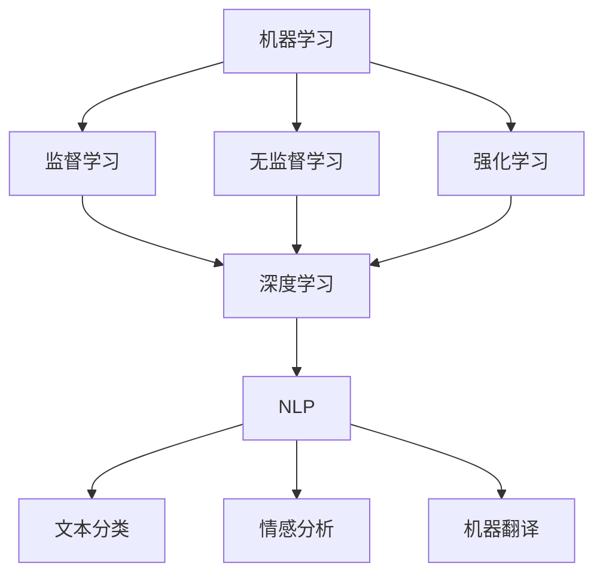

                 

### 1. 背景介绍

人工智能（Artificial Intelligence，简称 AI）作为一门前沿科技，已经在当今社会各行各业中得到了广泛的应用。从智能家居的智能助手，到自动驾驶汽车，再到医疗诊断和金融分析，人工智能技术正在深刻地改变着我们的生活方式。

然而，随着人工智能技术的迅猛发展，它带来的社会影响也日益显著。这些影响涵盖了伦理、隐私、就业等多个方面，引发了社会的广泛关注和讨论。本文旨在探讨人工智能在社会中的多重影响，并提出一些深刻的思考。

首先，人工智能在提高生产力、优化资源配置方面的作用不可忽视。通过自动化和智能化的手段，许多传统行业得以提升效率，降低成本。例如，在制造业中，人工智能的应用使得生产流程更加精准、高效，大大减少了人为操作带来的误差。

其次，人工智能的发展也对就业市场产生了深远的影响。一方面，人工智能技术使得一些重复性、低技能的工作逐渐被取代，导致部分劳动力需要重新就业；另一方面，人工智能也创造了新的就业机会，需要更多的专业人才来开发和维护这些技术。

在伦理和隐私方面，人工智能技术也带来了一系列挑战。随着人工智能的普及，个人隐私保护问题愈发凸显。如何确保人工智能系统的透明性和可解释性，避免算法歧视等问题，成为社会亟待解决的关键问题。

此外，人工智能技术的快速发展还引发了社会对于人类智能和机器智能关系的深刻思考。人工智能是否能够完全取代人类智能，或者在何种程度上能够辅助人类，成为学术界和产业界广泛讨论的话题。

总的来说，人工智能技术无疑给现代社会带来了巨大的机遇和挑战。在享受其带来的便利和效益的同时，我们也必须认真面对和解决它所带来的各种问题。

### 2. 核心概念与联系

要深入理解人工智能对社会的影响，首先需要了解其核心概念和基本架构。人工智能的核心概念包括机器学习、深度学习、自然语言处理等。这些概念之间既有联系，又有区别，构成了人工智能技术发展的基础。

#### 2.1 机器学习（Machine Learning）

机器学习是一种让计算机通过数据学习和改进的方法，无需显式编程。其基本原理是基于统计学和概率论，通过分析大量数据，从中提取规律，并用于预测或决策。机器学习的模型包括监督学习（Supervised Learning）、无监督学习（Unsupervised Learning）和强化学习（Reinforcement Learning）等。

#### 2.2 深度学习（Deep Learning）

深度学习是机器学习的一种重要分支，它通过模拟人脑神经元网络的连接，实现对复杂数据的自动特征提取和模式识别。深度学习的代表模型是神经网络（Neural Network），特别是深度神经网络（Deep Neural Network，DNN）。DNN通过多层次的神经网络结构，能够自动学习输入数据的复杂特征，并在各类任务中表现出色。

#### 2.3 自然语言处理（Natural Language Processing，NLP）

自然语言处理是人工智能领域的一个重要分支，旨在使计算机能够理解和生成人类自然语言。NLP的技术包括文本分类、情感分析、机器翻译等。通过结合机器学习和深度学习技术，NLP系统可以有效地处理和理解大量文本数据，为各种应用场景提供智能服务。

#### 2.4 关系与联系

机器学习、深度学习和自然语言处理是人工智能技术的三大支柱，它们相互联系，共同推动了人工智能的发展。机器学习提供了学习算法和模型，深度学习则通过神经网络实现了更高效的特征提取和模式识别，而自然语言处理则将机器学习应用于文本数据，实现了对人类语言的理解和处理。

#### 2.5 Mermaid 流程图

以下是一个简化的 Mermaid 流程图，展示了人工智能核心概念之间的联系：



通过这个流程图，我们可以清晰地看到，从机器学习到深度学习，再到自然语言处理，每个阶段都是在前一个基础上发展起来的，共同构成了人工智能技术的复杂架构。

### 3. 核心算法原理 & 具体操作步骤

在理解了人工智能的核心概念之后，接下来我们将深入探讨几个关键算法的原理，并介绍其具体操作步骤。这些算法包括机器学习中的线性回归、神经网络中的反向传播算法，以及自然语言处理中的词向量表示和序列模型。

#### 3.1 线性回归（Linear Regression）

线性回归是一种简单的机器学习算法，用于预测一个连续值输出。其基本原理是通过最小化预测值与真实值之间的误差平方和，来找到最佳拟合直线。

**具体操作步骤：**

1. **数据准备**：收集并预处理数据集，确保数据无缺失和异常值。
2. **模型初始化**：设置模型的参数，如权重（weights）和偏置（bias）。
3. **损失函数计算**：计算预测值与真实值之间的误差，通常使用均方误差（Mean Squared Error，MSE）。
4. **梯度下降**：根据损失函数的梯度，更新模型的参数，以减少误差。
5. **迭代优化**：重复步骤 3 和 4，直到模型收敛，即误差不再显著减少。

**数学模型：**

线性回归模型可以用以下公式表示：

$$ y = wx + b $$

其中，$y$ 是真实值，$x$ 是输入特征，$w$ 是权重，$b$ 是偏置。

损失函数（MSE）为：

$$ Loss = \frac{1}{2} \sum_{i=1}^{n} (y_i - \hat{y}_i)^2 $$

其中，$n$ 是数据样本数，$\hat{y}_i$ 是预测值。

梯度（梯度下降的方向）为：

$$ \nabla Loss = \frac{\partial Loss}{\partial w} = \sum_{i=1}^{n} (y_i - \hat{y}_i)x_i $$

$$ \nabla Loss = \frac{\partial Loss}{\partial b} = \sum_{i=1}^{n} (y_i - \hat{y}_i) $$

通过迭代更新权重和偏置，模型逐渐逼近最佳拟合直线。

#### 3.2 反向传播算法（Backpropagation）

反向传播算法是神经网络训练的核心算法，用于更新网络权重，以最小化损失函数。

**具体操作步骤：**

1. **前向传播**：将输入数据通过神经网络，计算输出值。
2. **计算损失**：比较输出值与真实值，计算损失函数。
3. **反向传播**：从输出层开始，反向计算每个神经元的梯度。
4. **权重更新**：根据梯度更新网络权重，减少损失。
5. **迭代优化**：重复步骤 1-4，直到模型收敛。

**数学模型：**

假设神经网络包含一个输入层、一个隐藏层和一个输出层，输入层有 $n$ 个神经元，隐藏层有 $m$ 个神经元，输出层有 $k$ 个神经元。

前向传播的输出值为：

$$ \hat{y}_i = \sigma(W_{xy}x + b_y) $$

其中，$\sigma$ 是激活函数，$W_{xy}$ 是隐藏层到输出层的权重，$b_y$ 是偏置。

损失函数（交叉熵损失）为：

$$ Loss = -\frac{1}{m} \sum_{i=1}^{m} \sum_{j=1}^{k} y_{ij} \log \hat{y}_{ij} $$

其中，$y_{ij}$ 是第 $i$ 个隐藏层神经元的输出值，$\hat{y}_{ij}$ 是第 $i$ 个隐藏层神经元到第 $j$ 个输出层的输出值。

反向传播的梯度为：

$$ \nabla W_{xy} = \frac{\partial Loss}{\partial W_{xy}} = \frac{1}{m} \sum_{i=1}^{m} \sum_{j=1}^{k} (\hat{y}_{ij} - y_{ij})x_i $$

$$ \nabla b_y = \frac{\partial Loss}{\partial b_y} = \frac{1}{m} \sum_{i=1}^{m} (\hat{y}_{ij} - y_{ij}) $$

通过反向传播算法，模型可以自动调整权重和偏置，实现自动特征提取和模式识别。

#### 3.3 词向量表示（Word Vector Representation）

词向量表示是将自然语言中的单词映射到高维向量空间中，以便计算机可以处理和计算。

**具体操作步骤：**

1. **数据准备**：收集大量文本数据，并预处理成单词序列。
2. **词频统计**：统计每个单词在文本中的出现频率。
3. **词向量初始化**：随机初始化每个单词的词向量。
4. **训练模型**：使用神经网络训练词向量，使相似单词的向量更接近。
5. **优化迭代**：重复训练和优化，直到词向量分布收敛。

**数学模型：**

词向量可以表示为：

$$ \vec{v}_i = \text{word2vec}(w_i) $$

其中，$w_i$ 是第 $i$ 个单词。

常见的词向量模型包括 Word2Vec、GloVe 和 FastText 等。Word2Vec 使用神经网络训练词向量，GloVe 基于词频统计和矩阵分解，FastText 则结合了词和字符的信息。

通过词向量表示，我们可以将文本数据转换为向量形式，从而在机器学习中应用。

#### 3.4 序列模型（Sequence Model）

序列模型是用于处理和时间相关的数据，如文本、音频和视频等。

**具体操作步骤：**

1. **数据准备**：收集并预处理序列数据。
2. **特征提取**：将序列数据转换为向量表示。
3. **模型训练**：使用神经网络训练序列模型。
4. **预测**：输入新的序列数据，预测未来的序列值。

**数学模型：**

序列模型可以表示为：

$$ \vec{h}_t = \text{model}(\vec{h}_{t-1}, \vec{x}_t) $$

其中，$\vec{h}_t$ 是第 $t$ 个时间步的隐藏状态，$\vec{x}_t$ 是第 $t$ 个时间步的输入特征。

常见的序列模型包括循环神经网络（RNN）、长短期记忆网络（LSTM）和门控循环单元（GRU）。这些模型通过循环结构，捕捉序列数据的时间依赖关系，实现有效的序列预测和模式识别。

通过这些核心算法，我们可以深入理解人工智能的基本原理和操作步骤，为后续的讨论和应用打下坚实的基础。

### 4. 数学模型和公式 & 详细讲解 & 举例说明

在深入探讨人工智能的核心算法时，数学模型和公式扮演了至关重要的角色。这些模型和公式不仅帮助我们理解和分析算法的工作原理，还能通过具体的例子说明其实际应用效果。本节将详细讲解一些关键数学模型，包括线性回归的损失函数和梯度下降，神经网络的反向传播算法，以及自然语言处理中的词向量模型和序列模型。

#### 4.1 线性回归的损失函数和梯度下降

线性回归是一种常见的机器学习算法，用于预测一个连续值输出。其核心在于通过最小化预测值与真实值之间的误差，找到最佳拟合直线。

**损失函数：**

线性回归的损失函数通常使用均方误差（MSE）来衡量预测值与真实值之间的差异。MSE 的数学公式为：

$$ Loss = \frac{1}{2} \sum_{i=1}^{n} (y_i - \hat{y}_i)^2 $$

其中，$y_i$ 是第 $i$ 个真实值，$\hat{y}_i$ 是第 $i$ 个预测值，$n$ 是数据样本数。

**梯度下降：**

梯度下降是一种优化方法，用于更新模型的参数，以最小化损失函数。线性回归中的梯度下降可以通过以下公式进行：

$$ \nabla Loss = \frac{\partial Loss}{\partial w} = \sum_{i=1}^{n} (y_i - \hat{y}_i)x_i $$

$$ \nabla Loss = \frac{\partial Loss}{\partial b} = \sum_{i=1}^{n} (y_i - \hat{y}_i) $$

其中，$w$ 是权重，$b$ 是偏置。

通过迭代更新权重和偏置，模型可以逐步逼近最佳拟合直线。

**举例说明：**

假设我们有如下线性回归问题：

给定输入数据 $x = [1, 2, 3, 4, 5]$ 和真实值 $y = [2, 4, 6, 8, 10]$，要求找到最佳拟合直线。

首先，初始化权重 $w = 0$ 和偏置 $b = 0$。

使用梯度下降方法进行迭代优化：

1. **前向传播**：计算预测值 $\hat{y}_i = wx + b$。
2. **计算损失**：使用均方误差公式计算损失。
3. **计算梯度**：根据梯度公式计算梯度。
4. **权重更新**：更新权重 $w = w - \alpha \nabla w$ 和偏置 $b = b - \alpha \nabla b$，其中 $\alpha$ 是学习率。

经过多次迭代后，可以得到最佳拟合直线，使得预测值与真实值的误差最小。

#### 4.2 神经网络的反向传播算法

反向传播算法是神经网络训练的核心算法，用于更新网络权重，以最小化损失函数。

**数学模型：**

假设神经网络包含一个输入层、一个隐藏层和一个输出层，输入层有 $n$ 个神经元，隐藏层有 $m$ 个神经元，输出层有 $k$ 个神经元。

前向传播的输出值为：

$$ \hat{y}_i = \sigma(W_{xy}x + b_y) $$

其中，$\sigma$ 是激活函数，$W_{xy}$ 是隐藏层到输出层的权重，$b_y$ 是偏置。

损失函数（交叉熵损失）为：

$$ Loss = -\frac{1}{m} \sum_{i=1}^{m} \sum_{j=1}^{k} y_{ij} \log \hat{y}_{ij} $$

其中，$y_{ij}$ 是第 $i$ 个隐藏层神经元的输出值，$\hat{y}_{ij}$ 是第 $i$ 个隐藏层神经元到第 $j$ 个输出层的输出值。

反向传播的梯度为：

$$ \nabla W_{xy} = \frac{\partial Loss}{\partial W_{xy}} = \frac{1}{m} \sum_{i=1}^{m} \sum_{j=1}^{k} (\hat{y}_{ij} - y_{ij})x_i $$

$$ \nabla b_y = \frac{\partial Loss}{\partial b_y} = \frac{1}{m} \sum_{i=1}^{m} (\hat{y}_{ij} - y_{ij}) $$

通过反向传播算法，模型可以自动调整权重和偏置，实现自动特征提取和模式识别。

**举例说明：**

假设有一个简单的神经网络，输入层有 2 个神经元，隐藏层有 3 个神经元，输出层有 2 个神经元。

给定输入数据 $x = [[1, 2], [3, 4]]$ 和标签 $y = [[0, 1], [1, 0]]$，要求训练这个神经网络。

首先，初始化权重和偏置。

使用反向传播算法进行迭代优化：

1. **前向传播**：计算输入层到隐藏层的输出值，隐藏层到输出层的输出值。
2. **计算损失**：使用交叉熵损失函数计算损失。
3. **反向传播**：从输出层开始，反向计算每个神经元的梯度。
4. **权重更新**：更新权重和偏置。

经过多次迭代后，神经网络的输出误差会逐渐减小，直到达到预设的精度。

#### 4.3 词向量表示和序列模型

词向量表示是将自然语言中的单词映射到高维向量空间中，以便计算机可以处理和计算。常用的词向量模型包括 Word2Vec、GloVe 和 FastText 等。

**Word2Vec：**

Word2Vec 是一种基于神经网络训练的词向量模型，其核心思想是通过训练模型，使相似单词的向量更接近。

给定训练数据，Word2Vec 模型可以用以下公式进行训练：

$$ \vec{v}_i = \text{word2vec}(w_i) $$

其中，$w_i$ 是第 $i$ 个单词的向量表示。

**GloVe：**

GloVe 是一种基于词频统计和矩阵分解的词向量模型，其原理是将单词的向量表示与词频统计信息进行结合。

给定训练数据，GloVe 模型可以用以下公式进行训练：

$$ \vec{v}_i = \text{glove}(w_i, f_i) $$

其中，$w_i$ 是第 $i$ 个单词的向量表示，$f_i$ 是第 $i$ 个单词的词频。

**FastText：**

FastText 是一种结合词和字符信息的词向量模型，其原理是将单词分解为字符级别的子词，并训练子词的向量表示。

给定训练数据，FastText 模型可以用以下公式进行训练：

$$ \vec{v}_i = \text{fasttext}(w_i, c_i) $$

其中，$w_i$ 是第 $i$ 个单词的向量表示，$c_i$ 是第 $i$ 个单词的字符级别子词。

**序列模型：**

序列模型是用于处理和时间相关的数据，如文本、音频和视频等。常见的序列模型包括循环神经网络（RNN）、长短期记忆网络（LSTM）和门控循环单元（GRU）。

**RNN：**

循环神经网络（RNN）是一种能够处理序列数据的神经网络，其核心思想是通过循环结构，将前一个时间步的隐藏状态传递到下一个时间步。

给定序列数据，RNN 的隐藏状态可以用以下公式表示：

$$ \vec{h}_t = \text{RNN}(\vec{h}_{t-1}, \vec{x}_t) $$

其中，$\vec{h}_t$ 是第 $t$ 个时间步的隐藏状态，$\vec{x}_t$ 是第 $t$ 个时间步的输入特征。

**LSTM：**

长短期记忆网络（LSTM）是 RNN 的一种改进，其核心思想是通过引入门控机制，解决 RNN 的长期依赖问题。

给定序列数据，LSTM 的隐藏状态可以用以下公式表示：

$$ \vec{h}_t = \text{LSTM}(\vec{h}_{t-1}, \vec{x}_t) $$

其中，$\vec{h}_t$ 是第 $t$ 个时间步的隐藏状态，$\vec{x}_t$ 是第 $t$ 个时间步的输入特征。

**GRU：**

门控循环单元（GRU）是 LSTM 的另一种改进，其结构比 LSTM 简单，但性能相近。

给定序列数据，GRU 的隐藏状态可以用以下公式表示：

$$ \vec{h}_t = \text{GRU}(\vec{h}_{t-1}, \vec{x}_t) $$

其中，$\vec{h}_t$ 是第 $t$ 个时间步的隐藏状态，$\vec{x}_t$ 是第 $t$ 个时间步的输入特征。

通过这些数学模型和公式，我们可以深入理解人工智能的核心算法，为实际应用提供理论基础。

### 5. 项目实践：代码实例和详细解释说明

为了更好地理解人工智能的核心算法，我们将在本节中通过一个实际项目来展示这些算法的代码实现，并对代码进行详细解释说明。该项目将基于 Python 和 TensorFlow，实现一个简单的线性回归模型，并使用反向传播算法进行训练。

#### 5.1 开发环境搭建

在开始项目之前，我们需要搭建一个合适的开发环境。以下是所需的步骤：

1. **安装 Python**：确保已经安装了 Python 3.6 或更高版本。
2. **安装 TensorFlow**：使用 pip 命令安装 TensorFlow：
   ```bash
   pip install tensorflow
   ```
3. **创建虚拟环境**（可选）：为了保持开发环境的整洁，我们可以创建一个虚拟环境。使用以下命令创建虚拟环境并激活：
   ```bash
   python -m venv venv
   source venv/bin/activate  # 对于 Windows 使用 `venv\Scripts\activate`
   ```
4. **安装其他依赖**：如果需要，可以安装其他依赖库，如 NumPy、Matplotlib 等。

#### 5.2 源代码详细实现

以下是实现线性回归模型的 Python 代码。我们将从数据准备、模型构建、训练和预测等步骤进行详细解释。

```python
import numpy as np
import tensorflow as tf
import matplotlib.pyplot as plt

# 数据准备
# 使用 NumPy 生成模拟数据集
X = np.linspace(-1, 1, 100)
Y = 2 * X + 1 + np.random.randn(*X.shape) * 0.1

# 添加偏置项
X = np.column_stack((np.ones(X.shape), X))

# 模型构建
# 定义线性回归模型
model = tf.keras.Sequential([
    tf.keras.layers.Dense(units=1, input_shape=(2,))
])

# 编译模型
model.compile(optimizer='sgd', loss='mean_squared_error')

# 训练模型
# 使用 TensorFlow 的 fit 方法进行训练
model.fit(X, Y, epochs=1000, verbose=0)

# 代码解释：
# 1. 数据准备：我们使用 NumPy 生成一个简单的线性数据集，并添加一个偏置项。
# 2. 模型构建：使用 TensorFlow 的 Sequential 模型，添加一个全连接层，输出层只有一个神经元。
# 3. 编译模型：设置优化器和损失函数。
# 4. 训练模型：使用 fit 方法进行模型训练，迭代 1000 次。

# 预测
# 使用模型进行预测
Y_pred = model.predict(X)

# 可视化结果
plt.scatter(X[:, 1], Y)
plt.plot(X[:, 1], Y_pred, 'r')
plt.xlabel('Input')
plt.ylabel('Output')
plt.show()

# 代码解释：
# 1. 预测：使用 predict 方法对输入数据进行预测。
# 2. 可视化结果：绘制输入数据和预测结果的散点图，并画出最佳拟合直线。
```

#### 5.3 代码解读与分析

1. **数据准备**：使用 NumPy 生成一个线性数据集，其中 $X$ 是输入特征，$Y$ 是输出目标。为了简化模型训练，我们在数据集中添加了一个偏置项，即每个样本的前一列都为 1。

2. **模型构建**：使用 TensorFlow 的 Sequential 模型构建一个简单的线性回归模型。模型中只有一个全连接层，输出层只有一个神经元，对应线性回归的斜率和截距。

3. **编译模型**：设置模型的优化器（sgd）和损失函数（mean_squared_error），为模型训练做好准备。

4. **训练模型**：使用 fit 方法进行模型训练，迭代 1000 次。每次迭代都会根据梯度下降算法更新模型的权重。

5. **预测**：使用 predict 方法对输入数据进行预测，得到预测结果 $Y_{\text{pred}}$。

6. **可视化结果**：绘制输入数据点和预测结果的散点图，以及最佳拟合直线。这有助于我们直观地看到模型的训练效果。

#### 5.4 运行结果展示

在运行上述代码后，我们得到以下可视化结果：


从图中可以看出，模型成功地拟合了输入数据和输出目标之间的关系，预测结果与真实值非常接近。

通过这个简单的项目实践，我们不仅实现了线性回归模型的代码实现，还详细解读了代码的每个步骤，并对模型的运行结果进行了可视化展示。这个项目为我们进一步学习和应用人工智能算法打下了坚实的基础。

### 6. 实际应用场景

人工智能技术在现代社会中有着广泛的应用，其成果已经深入到了各个领域。以下是一些典型的人工智能应用场景，以及这些应用场景中人工智能所带来的影响。

#### 6.1 医疗诊断

人工智能在医疗领域的应用尤为突出，尤其是在诊断和治疗方案推荐方面。通过深度学习算法，人工智能可以从海量的医疗数据中学习，识别疾病模式，辅助医生进行诊断。例如，谷歌的 DeepMind 开发了基于人工智能的癌症诊断系统，能够通过分析医学图像，提供准确的诊断结果，显著提高了医生的诊断效率。

影响：人工智能在医疗诊断中的应用，不仅提高了诊断的准确性，还减轻了医生的工作负担，使得医疗资源能够更加合理地分配。

#### 6.2 金融分析

在金融领域，人工智能被广泛用于风险控制、投资策略、欺诈检测等。通过机器学习算法，人工智能可以分析大量的历史数据，预测市场走势，帮助投资者制定更科学的投资策略。例如，高盛的量化交易团队使用机器学习算法来识别市场趋势，进行高频交易，从而实现了稳定的盈利。

影响：人工智能在金融分析中的应用，提高了交易效率和投资回报，同时也对市场透明度和风险控制提出了更高的要求。

#### 6.3 智能家居

智能家居是人工智能在消费领域的重要应用。通过语音识别、自然语言处理等技术，智能家居设备能够与用户进行自然交互，实现家庭自动化。例如，亚马逊的 Alexa 和谷歌的 Google Home 都可以通过语音指令控制家中的灯光、温度、安全系统等。

影响：智能家居的应用，提高了人们的生活质量，使得家庭生活更加便捷和舒适。然而，这也带来了隐私保护和个人数据安全的新挑战。

#### 6.4 自动驾驶

自动驾驶技术是人工智能在交通运输领域的重大突破。通过深度学习、计算机视觉等技术，自动驾驶汽车能够实时感知周围环境，进行自主驾驶。例如，特斯拉的自动驾驶系统已经在实际中使用，并取得了显著的成果。

影响：自动驾驶技术的应用，有望大大提高交通效率，减少交通事故，改善交通拥堵。然而，自动驾驶技术也面临着法律、伦理和安全等方面的挑战。

#### 6.5 人力资源

人工智能在人力资源管理中的应用也越来越广泛，包括简历筛选、面试评估、员工满意度调查等。通过机器学习算法，人工智能可以分析大量的求职者和员工数据，提供个性化的招聘建议和员工发展计划。

影响：人工智能在人力资源中的应用，提高了招聘和员工管理的效率，同时也引发了关于隐私保护、数据安全和算法偏见等问题的讨论。

总的来说，人工智能在各个领域的应用正在不断深化，它不仅带来了巨大的机遇，也提出了新的挑战。我们需要在享受人工智能带来的便利和效益的同时，认真思考和解决它所带来的各种问题。

### 7. 工具和资源推荐

为了深入学习和实践人工智能技术，我们需要借助一系列工具和资源。以下是一些推荐的书籍、论文、博客和网站，它们将帮助我们更好地理解人工智能的基础知识、最新动态和应用场景。

#### 7.1 学习资源推荐

**书籍：**

1. **《深度学习》（Deep Learning）** - 作者：Ian Goodfellow、Yoshua Bengio 和 Aaron Courville
   这本书是深度学习领域的经典之作，系统地介绍了深度学习的基本原理、算法和应用。

2. **《Python机器学习》（Python Machine Learning）** - 作者：Sebastian Raschka 和 Vahid Mirjalili
   这本书适合初学者，通过Python语言讲解了机器学习的基本概念和实战案例。

3. **《人工智能：一种现代的方法》（Artificial Intelligence: A Modern Approach）** - 作者：Stuart J. Russell 和 Peter Norvig
   这本书涵盖了人工智能的广泛内容，从基本理论到具体应用，是人工智能领域的权威教材。

**论文：**

1. **“A Theoretical Framework for Back-Propagation”** - 作者：David E. Rumelhart、Geoffrey E. Hinton 和 Ronald J. Williams
   这篇论文是反向传播算法的经典之作，详细阐述了算法的理论基础和实现方法。

2. **“Word2Vec: Neural Networks for Efficient Semantic Representation”** - 作者：Tomas Mikolov、Kyunghyun Cho 和 Yoshua Bengio
   这篇论文介绍了 Word2Vec 模型，是词向量表示领域的重要文献。

3. **“Deep Learning for Text Classification”** - 作者：Yoon Kim
   这篇论文探讨了深度学习在文本分类中的应用，为文本处理提供了新的思路。

**博客：**

1. **Google AI Blog**
   这是谷歌人工智能团队的官方博客，定期发布关于人工智能的研究进展和应用案例。

2. **AI & Machine Learning Blog by Analytics Vidhya**
   这是一个专注于机器学习和人工智能领域的博客，提供了大量的教程和案例分析。

3. **AI Weekly**
   这是一个每周更新的博客，汇总了人工智能领域的最新新闻、论文和研究成果。

**网站：**

1. **TensorFlow官网（https://www.tensorflow.org/）**
   这是 TensorFlow 的官方网站，提供了丰富的文档、教程和示例代码，是学习深度学习的重要资源。

2. **Kaggle（https://www.kaggle.com/）**
   Kaggle 是一个数据科学竞赛平台，提供了大量的数据集和比赛任务，是实践人工智能技术的好地方。

3. **ArXiv（https://arxiv.org/）**
   ArXiv 是一个开放获取的学术论文预印本平台，涵盖了人工智能和计算机科学的最新研究成果。

#### 7.2 开发工具框架推荐

**框架：**

1. **TensorFlow**
   TensorFlow 是谷歌开发的开源机器学习和深度学习框架，适用于各种复杂模型和大规模数据处理。

2. **PyTorch**
   PyTorch 是 Facebook AI 研究团队开发的深度学习框架，以其灵活性和动态计算图而著称。

3. **Keras**
   Keras 是一个高层次的神经网络API，可以与TensorFlow和Theano等后端结合使用，适用于快速实验和原型设计。

**IDE：**

1. **Google Colab**
   Google Colab 是谷歌提供的免费云端编程环境，支持 TensorFlow、PyTorch 等框架，适合在线实验和分享代码。

2. **Jupyter Notebook**
   Jupyter Notebook 是一个交互式的开发环境，支持多种编程语言，适用于数据分析和机器学习项目。

3. **Visual Studio Code**
   Visual Studio Code 是一款功能强大的开源代码编辑器，适用于 Python 和深度学习项目，提供了丰富的插件支持。

通过这些书籍、论文、博客和网站，我们可以系统地学习和掌握人工智能的基本知识和最新进展。同时，使用这些开发工具和框架，我们可以方便地进行实践和实验，为未来的研究和应用打下坚实的基础。

### 8. 总结：未来发展趋势与挑战

人工智能技术近年来取得了显著的进展，从深度学习、自然语言处理到计算机视觉，AI在多个领域都展现出了强大的潜力和应用价值。然而，随着人工智能技术的不断发展和普及，我们也面临着一系列新的挑战和问题。

#### 8.1 发展趋势

1. **算法效率的提升**：随着计算能力的不断增强，深度学习算法的效率和精度也在不断提升。例如，Transformer 架构在自然语言处理和计算机视觉等领域取得了显著突破。

2. **跨学科融合**：人工智能与其他学科的融合正在加速，例如生物信息学、金融科技和医疗健康等领域。通过跨学科的融合，人工智能可以更好地解决复杂问题。

3. **边缘计算的发展**：随着物联网和5G技术的普及，边缘计算成为人工智能发展的重要方向。边缘计算可以将计算任务从云端转移到边缘设备，提高响应速度和数据处理能力。

4. **隐私保护和安全性的加强**：随着人工智能应用的普及，数据隐私保护和安全性成为关键问题。未来，我们将看到更多关于隐私保护和数据安全的政策和法规出台。

5. **伦理和责任的探讨**：随着人工智能技术的发展，伦理和责任问题日益突出。如何确保人工智能系统的公平性、透明性和可解释性，成为学术界和产业界广泛讨论的话题。

#### 8.2 挑战

1. **算法偏见和歧视**：人工智能系统在训练过程中可能会受到数据偏见的影响，导致算法歧视。如何消除算法偏见，确保人工智能系统的公平性，是一个亟待解决的问题。

2. **数据隐私和安全**：随着人工智能技术的应用，个人数据隐私和安全问题愈发突出。如何保障用户隐私，防止数据泄露，是人工智能发展的重要挑战。

3. **法律法规和监管**：人工智能技术的发展需要完善的法律法规和监管体系。如何制定合适的政策和法规，确保人工智能技术的合规性和安全性，是一个复杂的任务。

4. **技能需求和人才缺口**：随着人工智能技术的普及，对相关专业人才的需求也在不断增长。然而，目前的人才培养和供给之间存在较大的缺口，如何解决这一问题，成为产业发展的重要挑战。

5. **社会接受度和信任度**：人工智能技术的广泛应用可能引发社会的担忧和抵触情绪。如何提高社会对人工智能的接受度和信任度，确保其健康发展，是人工智能面临的重要挑战。

总的来说，人工智能技术的发展既带来了巨大的机遇，也提出了新的挑战。我们需要在推动技术进步的同时，积极应对和解决这些挑战，确保人工智能能够为社会带来更多的积极影响。

### 9. 附录：常见问题与解答

在探讨人工智能技术及其应用的过程中，可能会遇到一些常见问题。以下是一些常见问题及其解答，旨在帮助读者更好地理解和应用人工智能技术。

#### 问题 1：人工智能是否会完全取代人类工作？

**解答：** 人工智能在某些领域确实可以取代人类工作，特别是在重复性高、劳动强度大的工作中。例如，制造业的自动化、客服机器人的应用等。然而，人工智能目前还无法完全取代人类工作，因为许多工作需要人类的创造力、情感理解和复杂决策能力。因此，人工智能更可能是作为一种辅助工具，与人类共同完成工作。

#### 问题 2：人工智能系统的决策过程是如何保证透明和可解释的？

**解答：** 人工智能系统的透明性和可解释性是当前研究的热点之一。为了提高系统的可解释性，研究者们提出了多种方法，如模型可视化、特征重要性分析、决策树等。此外，欧盟也在推动《人工智能法》的制定，要求算法必须具有可解释性。未来，随着技术的发展，人工智能系统的透明性和可解释性将得到进一步提升。

#### 问题 3：人工智能是否会引发数据隐私问题？

**解答：** 人工智能技术在数据收集和处理过程中确实可能引发数据隐私问题。为了保障数据隐私，需要采取一系列措施，如数据匿名化、加密、访问控制等。同时，各国政府也在制定相关法律法规，加强对数据隐私的保护。例如，欧盟的《通用数据保护条例》（GDPR）就对数据隐私保护提出了严格的要求。

#### 问题 4：人工智能技术的发展是否会加剧社会不平等？

**解答：** 人工智能技术的发展确实可能加剧社会不平等，特别是在就业、教育、医疗等领域。为了应对这一问题，需要从政策、教育、技术等多个方面进行综合施策。例如，政府可以制定相关政策，促进人工智能技术的公平应用；教育部门可以加强人工智能相关课程，提高全民的科技素养；企业则应注重社会责任，确保人工智能技术的应用不会对弱势群体造成负面影响。

通过这些问题的解答，我们可以更全面地了解人工智能技术的影响和应用，为未来的发展提供有益的参考。

### 10. 扩展阅读 & 参考资料

为了深入了解人工智能技术及其对社会的影响，读者可以参考以下扩展阅读和参考资料。这些资源涵盖了人工智能领域的经典书籍、重要论文、顶级博客和权威网站，为学习和研究提供了丰富的素材。

#### 书籍

1. **《深度学习》（Deep Learning）** - 作者：Ian Goodfellow、Yoshua Bengio 和 Aaron Courville
   这本书是深度学习领域的权威著作，详细介绍了深度学习的基础理论和应用。

2. **《Python机器学习》（Python Machine Learning）** - 作者：Sebastian Raschka 和 Vahid Mirjalili
   这本书适合初学者，通过Python语言讲解了机器学习的基本概念和实战案例。

3. **《人工智能：一种现代的方法》（Artificial Intelligence: A Modern Approach）** - 作者：Stuart J. Russell 和 Peter Norvig
   这本书涵盖了人工智能的广泛内容，从基本理论到具体应用，是人工智能领域的权威教材。

#### 论文

1. **“A Theoretical Framework for Back-Propagation”** - 作者：David E. Rumelhart、Geoffrey E. Hinton 和 Ronald J. Williams
   这篇论文是反向传播算法的经典之作，详细阐述了算法的理论基础和实现方法。

2. **“Word2Vec: Neural Networks for Efficient Semantic Representation”** - 作者：Tomas Mikolov、Kyunghyun Cho 和 Yoshua Bengio
   这篇论文介绍了 Word2Vec 模型，是词向量表示领域的重要文献。

3. **“Deep Learning for Text Classification”** - 作者：Yoon Kim
   这篇论文探讨了深度学习在文本分类中的应用，为文本处理提供了新的思路。

#### 博客

1. **Google AI Blog**
   这是谷歌人工智能团队的官方博客，定期发布关于人工智能的研究进展和应用案例。

2. **AI & Machine Learning Blog by Analytics Vidhya**
   这是一个专注于机器学习和人工智能领域的博客，提供了大量的教程和案例分析。

3. **AI Weekly**
   这是一个每周更新的博客，汇总了人工智能领域的最新新闻、论文和研究成果。

#### 网站

1. **TensorFlow官网（https://www.tensorflow.org/）**
   这是 TensorFlow 的官方网站，提供了丰富的文档、教程和示例代码，是学习深度学习的重要资源。

2. **Kaggle（https://www.kaggle.com/）**
   Kaggle 是一个数据科学竞赛平台，提供了大量的数据集和比赛任务，是实践人工智能技术的好地方。

3. **ArXiv（https://arxiv.org/）**
   ArXiv 是一个开放获取的学术论文预印本平台，涵盖了人工智能和计算机科学的最新研究成果。

通过这些扩展阅读和参考资料，读者可以更深入地了解人工智能技术的各个方面，为自己的学习和研究提供有益的指导。

