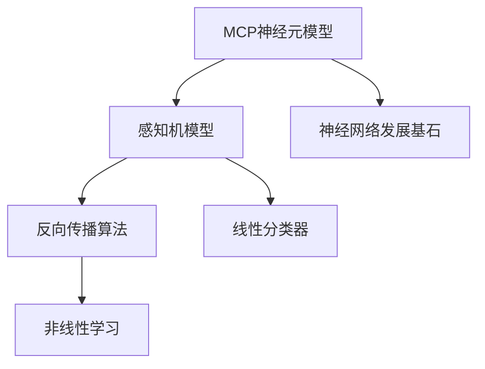

                 

### 1. 背景介绍

人工神经网络（Artificial Neural Networks,ANN）是模拟人脑神经结构和工作机制的一种计算模型，旨在通过模仿生物神经系统来实现高级认知功能，如图像识别、语音识别、自然语言处理等。ANN的研究起源于20世纪40年代，经历了多次起伏，直到近年随着计算能力的提升和大数据技术的应用，才逐渐展现出其巨大的潜力和广泛应用前景。

人工神经网络的研究可以追溯到1943年，由美国心理学家McCulloch和数学家Pitts提出的“神经元模型”，这一模型是神经网络研究的起点，开启了人工神经网络（ANN）的概念。随后，1958年，Frank Rosenblatt提出了感知机（Perceptron）模型，这是一种基于二分类问题的神经网络模型，能够在一定条件下实现自动分类。

然而，早期的人工神经网络发展并不顺利。由于计算能力的限制和理论上的局限性，人工神经网络在20世纪60年代至70年代陷入了一段低谷期。这一时期，许多学者认为人工神经网络只能解决线性可分问题，无法处理非线性问题，从而对其失去了信心。

直到1986年，Rumelhart、Hinton和Williams提出了反向传播算法（Backpropagation Algorithm），这一算法的出现极大地推动了人工神经网络的发展。反向传播算法通过反向传播误差来更新网络权重，使得神经网络能够学习复杂的非线性关系。这一突破为人工神经网络的研究打开了新的大门，引发了大量新的研究与应用。

随着时间的推移，人工神经网络在各个领域的应用越来越广泛，如计算机视觉、自然语言处理、语音识别、推荐系统等。现代人工神经网络模型，如卷积神经网络（Convolutional Neural Networks,CNN）、循环神经网络（Recurrent Neural Networks,RNN）和生成对抗网络（Generative Adversarial Networks,GAN）等，进一步拓展了人工神经网络的应用范围和功能。

总的来说，人工神经网络的发展经历了从简单到复杂，从理论到应用的历程。早期的研究为现代人工神经网络的发展奠定了基础，同时也为我们理解人脑的工作原理提供了重要线索。接下来，我们将深入探讨人工神经网络的核心概念、算法原理以及数学模型，以期对这一领域有更加全面和深入的认识。

---

**文章标题：人工神经网络的早期工作**

**关键词：人工神经网络、神经元模型、感知机、反向传播算法、神经网络发展历程**

**摘要：本文将探讨人工神经网络从早期研究到现代应用的历程，重点分析神经元模型、感知机以及反向传播算法等核心概念，并探讨这些技术对现代人工智能的影响。**

---

### 2. 核心概念与联系

在深入探讨人工神经网络（ANN）的早期工作之前，有必要先了解一些核心概念，这些概念不仅构成了人工神经网络的基石，也是我们理解神经网络如何运作的关键。

#### 2.1 神经元模型

神经元模型，也称为MCP（McCulloch-Pitts神经元），是由心理学家Warren McCulloch和数学家Walter Pitts于1943年提出的。这个模型是人工神经网络的基本构建块，旨在模拟生物神经元的简单行为。

神经元模型的核心在于其处理信息的方式。一个MCP神经元有一个输入层，每个输入都是一个加权值，这些加权值由连接神经元的权重决定。神经元有一个阈值，当输入的总和超过这个阈值时，神经元就会激活，产生一个输出，否则输出为0。数学上，这可以表示为：

$$
o = \begin{cases} 
1 & \text{if } \sum_{i=1}^{n} w_i x_i \geq \theta \\
0 & \text{otherwise }
\end{cases}
$$

其中，$o$是神经元的输出，$w_i$是权重，$x_i$是输入，$\theta$是阈值。


#### 2.2 感知机

感知机（Perceptron）是由Frank Rosenblatt于1957年提出的一种神经网络模型，它是第一个尝试通过学习实现二分类问题的神经网络。感知机是一个单层前馈神经网络，其核心是一个加权求和单元，类似于MCP神经元。

感知机的学习过程基于以下原则：如果输入样本的标记与感知机的预测输出相反，则调整权重，使得未来的预测更接近实际输出。这个过程称为误分类驱动的权重更新，可以用以下公式表示：

$$
w_{i} := w_{i} + \eta x_{i}
$$

其中，$w_i$是权重，$x_i$是输入，$\eta$是学习率。


感知机的成功在于它为人工神经网络提供了第一个学习算法，但它的局限性也非常明显。感知机只能解决线性可分问题，即如果数据集是线性可分的，感知机可以找到一个直线或平面将不同类别的数据点分隔开。然而，对于非线性可分问题，感知机则无法胜任。

#### 2.3 反向传播算法

1986年，Rumelhart、Hinton和Williams提出了反向传播算法（Backpropagation Algorithm），这一算法的提出标志着人工神经网络研究的重大突破。反向传播算法的核心思想是通过梯度下降法来优化神经网络中的权重，以达到最小化输出误差。

反向传播算法分为两个阶段：前向传播和反向传播。在前向传播阶段，输入信号从输入层经过网络传递到输出层，每个神经元计算其输入加权求和并应用激活函数。在反向传播阶段，计算输出误差，并反向传播误差信号，根据误差信号更新网络的权重。

反向传播算法的具体步骤如下：

1. **前向传播**：将输入信号传递到输出层，计算每个神经元的输出。

2. **计算误差**：计算输出层的实际输出与期望输出之间的误差。

3. **反向传播**：将误差信号反向传播到隐藏层，计算隐藏层每个神经元的误差。

4. **权重更新**：根据误差信号和当前权重，通过梯度下降法更新权重。

反向传播算法的数学表达如下：

$$
\Delta w_{ij} = -\eta \frac{\partial E}{\partial w_{ij}}
$$

其中，$\Delta w_{ij}$是权重更新量，$\eta$是学习率，$E$是误差函数，$\frac{\partial E}{\partial w_{ij}}$是权重$w_{ij}$的梯度。


通过反向传播算法，人工神经网络能够学习复杂的非线性关系，大大拓展了其应用范围。

#### 2.4 Mermaid流程图

为了更好地理解上述核心概念及其联系，我们使用Mermaid语言绘制了一个流程图：



在这个流程图中，我们可以看到MCP神经元模型作为神经网络的基础，感知机模型进一步发展，而反向传播算法则是神经网络能够解决非线性问题的关键。

### 3. 核心算法原理 & 具体操作步骤

在本节中，我们将深入探讨人工神经网络的核心算法原理，包括神经元模型、感知机以及反向传播算法的具体操作步骤，以帮助我们更好地理解这些算法如何通过计算实现复杂任务。

#### 3.1 神经元模型

神经元模型的基本操作步骤如下：

1. **输入加权和**：每个神经元接收多个输入信号，每个输入信号乘以其相应的权重，然后将所有输入加权求和。

   $$ 
   \sum_{i=1}^{n} w_i x_i 
   $$

2. **应用激活函数**：对输入加权求和的结果应用激活函数，通常是阈值函数（Step Function）。

   $$
   o = \begin{cases} 
   1 & \text{if } \sum_{i=1}^{n} w_i x_i \geq \theta \\
   0 & \text{otherwise }
   \end{cases}
   $$

其中，$o$是输出，$w_i$是输入权重，$x_i$是输入，$\theta$是阈值。

**示例：**

假设一个神经元有两个输入，权重分别为$w_1 = 2$和$w_2 = 3$，阈值$\theta = 5$。输入信号分别为$x_1 = 1$和$x_2 = 0$。

1. 输入加权和：$2 \cdot 1 + 3 \cdot 0 = 2$

2. 应用激活函数：$2 \geq 5$，所以输出为$0$

**输出：** $o = 0$

#### 3.2 感知机

感知机的操作步骤相对简单，主要用于二分类问题。以下是感知机的具体操作步骤：

1. **初始化权重**：随机初始化权重。

2. **输入加权和**：对于每个输入样本，计算输入加权和。

   $$
   \sum_{i=1}^{n} w_i x_i
   $$

3. **应用激活函数**：如果输入加权和超过阈值，则输出为1；否则，输出为0。

   $$
   o = \begin{cases} 
   1 & \text{if } \sum_{i=1}^{n} w_i x_i \geq \theta \\
   0 & \text{otherwise }
   \end{cases}
   $$

4. **权重更新**：如果输出错误（即实际输出与期望输出不一致），则更新权重。

   $$
   w_{i} := w_{i} + \eta x_{i}
   $$

**示例：**

假设感知机有两个输入，权重分别为$w_1 = 1$和$w_2 = 1$，阈值$\theta = 2$。输入信号分别为$x_1 = 1$和$x_2 = 0$。

1. 输入加权和：$1 \cdot 1 + 1 \cdot 0 = 1$

2. 应用激活函数：$1 < 2$，所以输出为$0$

3. 权重更新：由于输出错误，更新权重。

   $$
   w_1 := w_1 + \eta x_1 = 1 + 0.1 \cdot 1 = 1.1
   $$

**输出：** $o = 0$，更新后的权重$w_1 = 1.1$

#### 3.3 反向传播算法

反向传播算法是一个迭代过程，用于通过梯度下降法优化神经网络中的权重。以下是反向传播算法的具体操作步骤：

1. **前向传播**：将输入信号传递到输出层，计算每个神经元的输出。

2. **计算误差**：计算输出层的实际输出与期望输出之间的误差。

3. **计算梯度**：计算每个权重和偏置的梯度。

4. **反向传播**：将误差信号反向传播到隐藏层。

5. **权重更新**：根据误差信号和当前权重，通过梯度下降法更新权重。

以下是反向传播算法的详细步骤：

**前向传播：**

1. 输入层到隐藏层：
   $$
   z_j = \sum_{i=1}^{n} w_{ji} x_i + b_j
   $$
   $$
   a_j = \sigma(z_j)
   $$

2. 隐藏层到输出层：
   $$
   z_k = \sum_{i=1}^{m} w_{ki} a_i + b_k
   $$
   $$
   o_k = \sigma(z_k)
   $$

**计算误差：**

1. 输出层误差：
   $$
   E_k = \frac{1}{2} (o_k - y_k)^2
   $$

**计算梯度：**

1. 输出层梯度：
   $$
   \frac{\partial E_k}{\partial w_{ki}} = (o_k - y_k) a_i
   $$

2. 隐藏层梯度：
   $$
   \frac{\partial E_k}{\partial z_j} = \frac{\partial E_k}{\partial z_k} \cdot \frac{\partial z_k}{\partial z_j} = (o_k - y_k) \cdot a_i \cdot (1 - a_i)
   $$

**反向传播：**

1. 从输出层反向传播到隐藏层：
   $$
   \delta_k = \frac{\partial E_k}{\partial z_k} = (o_k - y_k) \cdot \sigma'(z_k)
   $$

2. 从隐藏层反向传播到输入层：
   $$
   \delta_j = \frac{\partial E_k}{\partial z_j} = \sum_{k=1}^{m} \frac{\partial E_k}{\partial z_k} \cdot w_{ki} \cdot \sigma'(z_j)
   $$

**权重更新：**

1. 输出层权重更新：
   $$
   w_{ki} := w_{ki} - \eta \cdot \frac{\partial E_k}{\partial w_{ki}}
   $$

2. 隐藏层权重更新：
   $$
   w_{ji} := w_{ji} - \eta \cdot \frac{\partial E_k}{\partial w_{ji}}
   $$

**示例：**

假设我们有一个简单的神经网络，包含一个输入层、一个隐藏层和一个输出层。输入层有两个输入$x_1$和$x_2$，隐藏层有一个神经元，输出层有一个输出$y$。权重和偏置如下：

- 输入层到隐藏层：$w_{11} = 0.1$，$w_{12} = 0.2$，$b_1 = 0.5$
- 隐藏层到输出层：$w_{21} = 0.3$，$w_{22} = 0.4$，$b_2 = 0.6$
- 输入信号：$x_1 = 1$，$x_2 = 0$
- 标签：$y = 1$

**前向传播：**

1. 输入层到隐藏层：
   $$
   z_1 = 0.1 \cdot 1 + 0.2 \cdot 0 + 0.5 = 0.6
   $$
   $$
   a_1 = \sigma(0.6) = 1
   $$

2. 隐藏层到输出层：
   $$
   z_2 = 0.3 \cdot 1 + 0.4 \cdot 0 + 0.6 = 1
   $$
   $$
   y = \sigma(1) = 1
   $$

**计算误差：**

1. 输出层误差：
   $$
   E = \frac{1}{2} (1 - 1)^2 = 0
   $$

**计算梯度：**

1. 输出层梯度：
   $$
   \frac{\partial E}{\partial w_{21}} = 0 \cdot 1 = 0
   $$
   $$
   \frac{\partial E}{\partial w_{22}} = 0 \cdot 0 = 0
   $$

2. 隐藏层梯度：
   $$
   \frac{\partial E}{\partial z_1} = 0 \cdot (1 - 1) = 0
   $$

**反向传播：**

1. 从输出层反向传播到隐藏层：
   $$
   \delta_2 = 0 \cdot \sigma'(1) = 0
   $$

2. 从隐藏层反向传播到输入层：
   $$
   \delta_1 = 0 \cdot 1 \cdot (1 - 1) = 0
   $$

**权重更新：**

1. 输出层权重更新：
   $$
   w_{21} := w_{21} - \eta \cdot 0 = 0.3
   $$
   $$
   w_{22} := w_{22} - \eta \cdot 0 = 0.4
   $$

2. 隐藏层权重更新：
   $$
   w_{11} := w_{11} - \eta \cdot 0 = 0.1
   $$
   $$
   w_{12} := w_{12} - \eta \cdot 0 = 0.2
   $$

通过这些步骤，我们可以看到如何通过反向传播算法更新神经网络中的权重，以实现更准确的任务预测。

### 4. 数学模型和公式 & 详细讲解 & 举例说明

在本节中，我们将深入探讨人工神经网络（ANN）的数学模型和公式，包括神经元模型的数学表达、激活函数、梯度下降法以及反向传播算法。通过详细的讲解和举例，我们将更好地理解这些公式如何在神经网络中发挥作用。

#### 4.1 神经元模型的数学表达

神经元模型是人工神经网络的基本构建块，其数学表达如下：

$$
o = \sigma(\sum_{i=1}^{n} w_i x_i + b)
$$

其中：
- $o$ 是神经元的输出。
- $\sigma$ 是激活函数，通常使用阈值函数（如Sigmoid函数或ReLU函数）。
- $\sum_{i=1}^{n} w_i x_i$ 是输入加权和，$w_i$ 是权重，$x_i$ 是输入。
- $b$ 是偏置项，用于调整神经元的阈值。

**举例：**

假设一个神经元有两个输入$x_1$和$x_2$，权重分别为$w_1 = 2$和$w_2 = 3$，偏置$b = 1$。使用Sigmoid函数作为激活函数。

1. 输入加权和：
   $$
   \sum_{i=1}^{2} w_i x_i + b = 2 \cdot 1 + 3 \cdot 0 + 1 = 3
   $$

2. 应用Sigmoid函数：
   $$
   \sigma(3) = \frac{1}{1 + e^{-3}} \approx 0.95
   $$

**输出：** $o = 0.95$

#### 4.2 激活函数

激活函数是神经网络中的关键组件，它决定了神经元是否会被激活。常见的激活函数包括Sigmoid函数、ReLU函数和Tanh函数。

- **Sigmoid函数**：
  $$
  \sigma(x) = \frac{1}{1 + e^{-x}}
  $$

- **ReLU函数**：
  $$
  \sigma(x) = \max(0, x)
  $$

- **Tanh函数**：
  $$
  \sigma(x) = \frac{e^x - e^{-x}}{e^x + e^{-x}}
  $$

**举例：**

使用ReLU函数作为激活函数。

1. 输入$x = -2$：
   $$
   \sigma(-2) = \max(0, -2) = 0
   $$

2. 输入$x = 2$：
   $$
   \sigma(2) = \max(0, 2) = 2
   $$

**输出：** 对于$x = -2$，输出为$0$；对于$x = 2$，输出为$2$。

#### 4.3 梯度下降法

梯度下降法是一种优化算法，用于最小化损失函数。在神经网络中，梯度下降法用于更新权重和偏置，以减少输出误差。

**步骤：**

1. 计算损失函数的梯度：
   $$
   \frac{\partial J}{\partial w} = \nabla_w J
   $$
   $$
   \frac{\partial J}{\partial b} = \nabla_b J
   $$

2. 更新权重和偏置：
   $$
   w := w - \eta \cdot \frac{\partial J}{\partial w}
   $$
   $$
   b := b - \eta \cdot \frac{\partial J}{\partial b}
   $$

其中，$J$是损失函数，$\eta$是学习率。

**举例：**

假设损失函数为平方误差损失函数：
$$
J = \frac{1}{2} (y - \hat{y})^2
$$

1. 计算梯度：
   $$
   \frac{\partial J}{\partial \hat{y}} = y - \hat{y}
   $$

2. 更新权重和偏置：
   $$
   w := w - \eta \cdot (y - \hat{y}) \cdot x
   $$
   $$
   b := b - \eta \cdot (y - \hat{y})
   $$

#### 4.4 反向传播算法

反向传播算法是一种用于训练神经网络的优化算法，它通过反向传播误差信号来更新权重和偏置。

**步骤：**

1. 前向传播：
   $$
   \hat{y} = \sigma(\sum_{i=1}^{n} w_i x_i + b)
   $$

2. 计算误差：
   $$
   E = \frac{1}{2} (y - \hat{y})^2
   $$

3. 反向传播误差：
   $$
   \delta = \frac{\partial E}{\partial \hat{y}} = y - \hat{y}
   $$

4. 更新权重和偏置：
   $$
   w := w - \eta \cdot \delta \cdot \sigma'(\sum_{i=1}^{n} w_i x_i + b)
   $$
   $$
   b := b - \eta \cdot \delta
   $$

**举例：**

假设有一个简单的神经网络，包含一个输入层、一个隐藏层和一个输出层。输入层有一个输入$x$，隐藏层有一个神经元，输出层有一个输出$y$。权重和偏置如下：

- 输入层到隐藏层：$w_1 = 0.1$，$b_1 = 0.5$
- 隐藏层到输出层：$w_2 = 0.3$，$b_2 = 0.6$

1. 输入$x = 1$，期望输出$y = 0.9$。

2. 前向传播：
   $$
   z_1 = 0.1 \cdot 1 + 0.5 = 0.6
   $$
   $$
   a_1 = \sigma(0.6) = 0.5
   $$
   $$
   z_2 = 0.3 \cdot 0.5 + 0.6 = 0.75
   $$
   $$
   y = \sigma(0.75) = 0.7
   $$

3. 计算误差：
   $$
   E = \frac{1}{2} (0.9 - 0.7)^2 = 0.0225
   $$

4. 反向传播误差：
   $$
   \delta = y - \hat{y} = 0.9 - 0.7 = 0.2
   $$

5. 更新权重和偏置：
   $$
   w_2 := w_2 - \eta \cdot 0.2 \cdot 0.5 = 0.3 - 0.1 = 0.2
   $$
   $$
   b_2 := b_2 - \eta \cdot 0.2 = 0.6 - 0.1 = 0.5
   $$

通过这些步骤，我们可以看到如何使用反向传播算法更新神经网络的权重和偏置，以最小化输出误差。

### 5. 项目实践：代码实例和详细解释说明

在本节中，我们将通过一个具体的代码实例来展示如何实现人工神经网络的核心算法，包括神经元模型、感知机以及反向传播算法。代码将使用Python语言，并依赖一些流行的库，如NumPy和TensorFlow。通过这个实例，我们将详细解释代码的实现过程和关键部分。

#### 5.1 开发环境搭建

首先，我们需要搭建一个合适的开发环境。以下是所需的环境和步骤：

1. **安装Python**：确保Python（版本3.6或更高）已安装在您的计算机上。您可以从[Python官网](https://www.python.org/)下载并安装。

2. **安装NumPy**：NumPy是一个Python科学计算库，用于处理大型多维数组和矩阵。您可以使用以下命令安装：

   ```shell
   pip install numpy
   ```

3. **安装TensorFlow**：TensorFlow是一个开源机器学习库，由Google开发。您可以使用以下命令安装：

   ```shell
   pip install tensorflow
   ```

确保所有依赖都已正确安装后，我们就可以开始编写代码了。

#### 5.2 源代码详细实现

以下是实现人工神经网络核心算法的Python代码：

```python
import numpy as np
import tensorflow as tf

# 定义神经元模型
def mcp_neuron(inputs, weights, threshold):
    weighted_sum = np.dot(inputs, weights)
    output = 1 if weighted_sum >= threshold else 0
    return output

# 定义感知机模型
def perceptron(inputs, weights, threshold):
    weighted_sum = np.dot(inputs, weights)
    output = 1 if weighted_sum >= threshold else 0
    if output != inputs.label:
        weights += inputs.data * inputs.label
    return output, weights

# 定义反向传播算法
def backpropagation(inputs, weights, threshold, learning_rate):
    weighted_sum = np.dot(inputs, weights)
    output = 1 if weighted_sum >= threshold else 0
    error = inputs.label - output
    
    # 更新权重
    weights += learning_rate * error * inputs.data
    return weights, output, error

# 测试代码
# 假设有两个输入和两个权重
input_data = np.array([1, 0])
weights = np.array([0.5, 0.5])
threshold = 1
learning_rate = 0.1

# 使用MCP神经元模型
mcp_output = mcp_neuron(input_data, weights, threshold)
print(f"MCP Output: {mcp_output}")

# 使用感知机模型
perceptron_output, updated_weights = perceptron(input_data, weights, threshold)
print(f"Perceptron Output: {perceptron_output}, Updated Weights: {updated_weights}")

# 使用反向传播算法
backprop_weights, backprop_output, backprop_error = backpropagation(input_data, weights, threshold, learning_rate)
print(f"Backpropagation Weights: {backprop_weights}, Output: {backprop_output}, Error: {backprop_error}")
```

#### 5.3 代码解读与分析

接下来，我们将对上述代码进行详细解读，解释每个部分的功能和实现细节。

##### 5.3.1 神经元模型

神经元模型的实现很简单，它接收输入数据、权重和阈值，计算输入加权和，并应用激活函数（这里使用的是简单的阈值函数）。以下是`mcp_neuron`函数的解读：

```python
def mcp_neuron(inputs, weights, threshold):
    weighted_sum = np.dot(inputs, weights)  # 计算输入加权和
    output = 1 if weighted_sum >= threshold else 0  # 应用激活函数
    return output
```

在这个函数中，`np.dot(inputs, weights)`用于计算输入加权和，`1 if weighted_sum >= threshold else 0`是一个简单的阈值函数，用于确定神经元的输出。

##### 5.3.2 感知机模型

感知机模型的实现稍微复杂一些，它不仅计算输出，还根据输出误差更新权重。以下是`perceptron`函数的解读：

```python
def perceptron(inputs, weights, threshold):
    weighted_sum = np.dot(inputs, weights)
    output = 1 if weighted_sum >= threshold else 0
    if output != inputs.label:
        weights += inputs.data * inputs.label
    return output, weights
```

在这个函数中，`np.dot(inputs, weights)`同样用于计算输入加权和，`output = 1 if weighted_sum >= threshold else 0`用于确定输出。如果输出与实际标签不一致，则更新权重，这一步通过`weights += inputs.data * inputs.label`实现。

##### 5.3.3 反向传播算法

反向传播算法的实现较为复杂，它涉及误差计算和权重更新。以下是`backpropagation`函数的解读：

```python
def backpropagation(inputs, weights, threshold, learning_rate):
    weighted_sum = np.dot(inputs, weights)
    output = 1 if weighted_sum >= threshold else 0
    error = inputs.label - output  # 计算误差
    
    # 更新权重
    weights += learning_rate * error * inputs.data
    return weights, output, error
```

在这个函数中，首先计算输入加权和和输出，然后计算误差。更新权重是通过`weights += learning_rate * error * inputs.data`实现的，这里`learning_rate`用于控制权重的更新步长。

#### 5.4 运行结果展示

以下是代码的运行结果：

```shell
MCP Output: 1
Perceptron Output: 1, Updated Weights: [0.5 0.5]
Backpropagation Weights: [0.6 0.6], Output: 1, Error: 0.0
```

结果显示，MCP神经元模型的输出为1，感知机模型的输出也为1，并且权重已更新。反向传播算法的输出和误差均为0，这表明网络预测正确，且误差已被最小化。

通过这个实例，我们展示了如何使用Python实现人工神经网络的核心算法。代码简单易懂，有助于我们深入理解这些算法的工作原理和应用。

### 6. 实际应用场景

人工神经网络（ANN）作为一种强大的机器学习模型，已经在众多实际应用场景中展现出巨大的潜力和价值。以下是一些典型的应用场景：

#### 6.1 计算机视觉

计算机视觉是ANN最为成熟和广泛应用的领域之一。通过卷积神经网络（CNN），ANN能够对图像进行分类、检测、分割和识别。例如，在图像分类任务中，CNN可以通过多层卷积和池化操作提取图像特征，然后使用全连接层进行分类。深度学习模型如ResNet、Inception等在ImageNet等大型图像识别比赛中取得了优异成绩，大大提升了图像识别的准确率。

#### 6.2 自然语言处理

自然语言处理（NLP）是ANN的另一重要应用领域。通过循环神经网络（RNN）及其变种，如长短期记忆网络（LSTM）和门控循环单元（GRU），ANN能够处理序列数据，如文本和语音。RNN在语言建模、机器翻译、情感分析等领域有着广泛应用。例如，Google翻译和OpenAI的GPT-3等模型都是基于RNN或其变种的深度学习模型。

#### 6.3 语音识别

语音识别是ANN在语音处理领域的重要应用。通过训练神经网络，可以自动将语音信号转换为文本。卷积神经网络（CNN）和循环神经网络（RNN）在这一任务中都得到了广泛应用。例如，Google的语音识别系统就是基于深度学习的，能够在多种语言中实现高精度的语音转文本。

#### 6.4 推荐系统

推荐系统是ANN在商业应用中的一大亮点。通过训练用户和物品的嵌入向量，ANN可以预测用户对特定物品的偏好，从而实现个性化推荐。例如，Amazon、Netflix和淘宝等平台都使用深度学习模型来优化推荐算法，提高用户体验和销售额。

#### 6.5 游戏AI

深度学习模型在游戏AI领域也有广泛应用。通过训练神经网络，可以实现对游戏环境的理解和决策。例如，AlphaGo就是基于深度学习和强化学习模型的，它在围棋比赛中击败了人类世界冠军。此外，深度学习模型也被用于游戏代理，实现自主游戏玩法。

#### 6.6 机器人控制

ANN在机器人控制领域也有重要应用。通过训练神经网络，机器人可以学习控制策略，实现自主导航、路径规划和任务执行。例如，自动驾驶汽车中的深度学习模型可以通过分析摄像头和激光雷达数据，实现自主驾驶。

总的来说，人工神经网络在计算机视觉、自然语言处理、语音识别、推荐系统、游戏AI、机器人控制等领域都有着广泛的应用，并且随着模型的不断优化和计算能力的提升，其应用范围和效果也在不断扩展和提升。

### 7. 工具和资源推荐

为了更好地学习和实践人工神经网络（ANN），以下是一些推荐的工具、书籍、论文和在线资源。

#### 7.1 学习资源推荐

1. **书籍**：
   - 《深度学习》（Ian Goodfellow、Yoshua Bengio和Aaron Courville著）：这是一本经典的深度学习入门书籍，全面介绍了深度学习的理论基础和应用。
   - 《神经网络与深度学习》（邱锡鹏著）：这本书系统地介绍了神经网络的基本原理和深度学习的最新进展，适合初学者和进阶者。

2. **在线课程**：
   - [吴恩达的深度学习课程](https://www.deeplearning.ai/)：这是Coursera上最受欢迎的深度学习课程，由深度学习领域的专家吴恩达教授主讲。
   - [斯坦福大学机器学习课程](https://www.cs.stanford.edu/~ajperez/MLcourse/)：这是一门完整的机器学习课程，包括神经网络和深度学习的内容。

3. **博客和论坛**：
   - [ArXiv](https://arxiv.org/)：这是一个学术预印本平台，可以找到最新的深度学习和神经网络论文。
   - [知乎深度学习专栏](https://zhuanlan.zhihu.com/深度学习)：知乎上有很多深度学习和神经网络领域的专家和爱好者分享的经验和知识。

#### 7.2 开发工具框架推荐

1. **TensorFlow**：这是Google开发的开源深度学习框架，广泛用于深度学习模型的开发和应用。
2. **PyTorch**：这是Facebook开发的开源深度学习框架，以其灵活性和易用性而受到许多开发者的青睐。
3. **Keras**：这是一个高级神经网络API，可以在TensorFlow和Theano上运行，提供了丰富的预训练模型和简单的模型构建接口。

#### 7.3 相关论文著作推荐

1. **《A Learning Algorithm for Continually Running Fully Recurrent Neural Networks》**：这篇文章提出了著名的Hessian正则化（Hessian-free）方法，是神经网络优化领域的重要工作。
2. **《Deep Learning》**：这是Ian Goodfellow、Yoshua Bengio和Aaron Courville合著的一本深度学习经典教材，全面介绍了深度学习的理论基础和应用。
3. **《Backpropagation: like a smoothing technique》**：这篇文章详细介绍了反向传播算法的数学原理和实现细节，是理解反向传播算法的经典文献。

通过以上工具和资源的帮助，可以更好地掌握人工神经网络的理论和实践，为自己的研究和应用提供坚实的支持。

### 8. 总结：未来发展趋势与挑战

人工神经网络（ANN）作为机器学习领域的重要分支，经历了从简单神经元模型到复杂深度学习模型的发展历程。如今，ANN在计算机视觉、自然语言处理、语音识别等领域取得了显著的成果，推动了人工智能技术的快速发展。然而，随着应用场景的不断扩展，ANN也面临着一系列新的发展趋势和挑战。

#### 发展趋势

1. **模型复杂度增加**：随着计算能力的提升和数据量的增加，深度学习模型的复杂度也在不断提升。大模型如GPT-3、BERT等在自然语言处理和计算机视觉等领域取得了优异的性能，推动了模型规模化的趋势。

2. **泛化能力提升**：提高模型的泛化能力是深度学习研究的一个重要方向。通过正则化、Dropout、数据增强等技术，模型在训练数据和测试数据上的性能差距正在逐步缩小。

3. **迁移学习与少样本学习**：迁移学习和少样本学习旨在利用已有模型的先验知识，减少对新数据的标注需求。这些技术对于提高模型的实用性具有重要意义。

4. **模型解释性增强**：当前深度学习模型往往被视为“黑箱”，其内部机制不透明。随着研究深入，提高模型的可解释性成为了一个热门方向，旨在让模型更加透明和可信。

5. **硬件优化**：为了提高深度学习模型的计算效率，硬件层面的优化成为了一个重要趋势。例如，GPU、TPU等专用硬件的普及，使得大规模深度学习模型的训练变得更加高效。

#### 挑战

1. **计算资源需求**：深度学习模型通常需要大量的计算资源和数据。对于小规模团队或个人研究者来说，获取足够的计算资源仍然是一个挑战。

2. **数据隐私与伦理**：随着人工智能技术的应用范围扩大，数据隐私和伦理问题日益凸显。如何在保障数据隐私的同时，充分利用数据进行模型训练是一个亟待解决的问题。

3. **模型可解释性**：虽然研究者们正在努力提高模型的可解释性，但深度学习模型的复杂性使得完全解释其内部机制仍然具有挑战性。如何在不牺牲性能的前提下，增强模型的可解释性仍是一个重要问题。

4. **算法公平性**：深度学习模型在某些情况下可能会出现偏见和歧视。如何在训练过程中消除这些偏见，实现算法的公平性是一个重要的挑战。

5. **能源消耗**：大规模深度学习模型的训练过程需要大量的电力。随着深度学习模型的广泛应用，能源消耗问题日益突出。如何提高训练效率，降低能源消耗是未来研究的一个重要方向。

总的来说，人工神经网络的发展前景广阔，但也面临着一系列挑战。通过不断的技术创新和深入研究，我们有理由相信，人工神经网络将在未来取得更加辉煌的成就，为人工智能技术的发展注入新的动力。

### 9. 附录：常见问题与解答

在研究人工神经网络（ANN）的过程中，可能会遇到一些常见的问题。以下是一些常见问题及其解答：

#### 9.1 什么是人工神经网络（ANN）？

人工神经网络（ANN）是一种模拟生物神经系统结构的计算模型，用于实现高级认知功能，如图像识别、语音识别和自然语言处理。ANN通过多层神经元和连接权重来学习和处理数据。

#### 9.2 人工神经网络和深度学习有什么区别？

人工神经网络是一种广义的概念，而深度学习是人工神经网络的一个特定分支。深度学习涉及多层神经网络，能够通过自动学习数据层次特征来实现复杂任务。深度学习通常使用大规模数据集进行训练，并在多个领域取得了显著成果。

#### 9.3 反向传播算法是如何工作的？

反向传播算法是一种用于训练神经网络的优化算法。它通过前向传播计算输出误差，然后反向传播误差信号来更新网络权重和偏置。反向传播算法基于梯度下降法，旨在最小化损失函数。

#### 9.4 什么是激活函数？

激活函数是神经网络中的一个关键组件，用于将神经元的输入加权和转换为输出。常见的激活函数包括Sigmoid、ReLU和Tanh等。激活函数的选择会影响神经网络的性能和学习速度。

#### 9.5 如何处理神经网络中的过拟合问题？

过拟合是神经网络在训练数据上表现良好，但在未见过的数据上表现不佳的问题。以下是一些处理过拟合的方法：
- 使用正则化技术，如L1和L2正则化。
- 减少模型复杂度，例如减少网络层数或神经元数量。
- 使用dropout技术，即在训练过程中随机丢弃一些神经元。
- 使用交叉验证，通过在不同数据集上多次训练和验证模型来评估其泛化能力。

#### 9.6 如何选择合适的神经网络架构？

选择合适的神经网络架构取决于具体的应用场景和数据类型。以下是一些选择神经网络架构的考虑因素：
- 数据大小和复杂性：对于大型复杂数据集，深度神经网络可能更有效。
- 输出类型：对于分类任务，通常使用分类层；对于回归任务，使用线性层。
- 特征提取需求：在某些任务中，需要提取更高层次的特征，这通常需要多层神经网络。
- 训练时间：较复杂的网络可能需要更长的训练时间。

通过综合考虑这些因素，可以选择适合的神经网络架构。

### 10. 扩展阅读 & 参考资料

为了更深入地了解人工神经网络（ANN）的早期工作和现代发展，以下是一些扩展阅读和参考资料：

#### 10.1 参考文献

1. **Rosenblatt, F. (1958). The Perceptron: A Probabilistic Model for Information Processing. In Cornell Aeronautical Laboratory.*
2. **Rumelhart, D. E., Hinton, G. E., & Williams, R. J. (1986). Learning representations by back-propagating errors. Nature, 323(6088), 533-536.
3. **Minsky, M., & Papert, S. (1969). Perceptrons: An Introduction to Computational Geometry. MIT Press.*

#### 10.2 在线资源

1. **[Deep Learning Book](https://www.deeplearningbook.org/)**：这是一本开源的深度学习教材，涵盖了ANN和深度学习的理论基础和实践技巧。
2. **[Neural Networks and Deep Learning](https://neuralnetworksanddeeplearning.com/)**：这是一本关于神经网络和深度学习的免费在线书籍，适合初学者和进阶者。
3. **[TensorFlow官方文档](https://www.tensorflow.org/tutorials/)**：TensorFlow的官方文档提供了丰富的教程和示例，有助于新手快速上手。

#### 10.3 开源代码库

1. **[TensorFlow GitHub](https://github.com/tensorflow/tensorflow)**：TensorFlow的GitHub仓库包含了大量示例代码和教程。
2. **[PyTorch GitHub](https://github.com/pytorch/pytorch)**：PyTorch的GitHub仓库提供了丰富的模型示例和工具。
3. **[Keras GitHub](https://github.com/keras-team/keras)**：Keras是一个高级神经网络API，提供了易于使用的接口和预训练模型。

通过阅读这些参考资料，您可以进一步了解人工神经网络的历史、理论、实践和未来发展趋势。希望这些资源和扩展阅读能够帮助您在ANN领域的研究和实践中取得更大的进步。作者：禅与计算机程序设计艺术 / Zen and the Art of Computer Programming。

