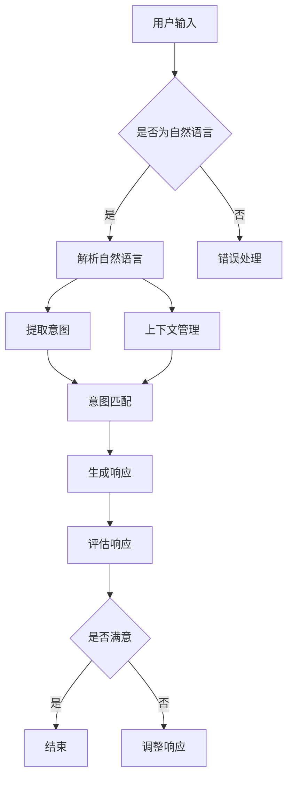
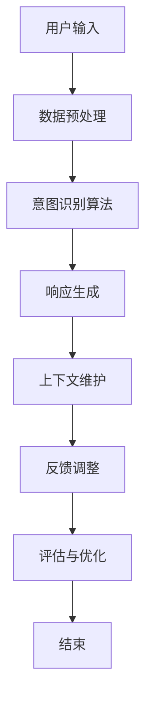

                 

### 背景介绍

随着人工智能技术的飞速发展，机器学习（Machine Learning，ML）特别是深度学习（Deep Learning，DL）在自然语言处理（Natural Language Processing，NLP）、计算机视觉（Computer Vision，CV）、语音识别（Speech Recognition）等领域取得了显著的成果。然而，尽管人工智能在处理复杂数据和分析模式方面展现出了强大的能力，但其在理解人类意图、情感和语境方面仍存在诸多挑战。

近年来，大型语言模型（Large Language Models，LLM）如 GPT-3、ChatGPT 和 Bard 等的出现，标志着人工智能在语言理解和生成方面进入了一个全新的阶段。这些模型通过训练海量文本数据，能够生成流畅且符合上下文的语言，从而在一定程度上模拟人类的对话和写作能力。然而，即便这些模型在语言生成的质量上有了显著提升，但它们仍然无法完全理解人类用户的真实意图。

人机协作的需求也因此变得越来越迫切。在实际应用中，用户往往需要与系统进行自然、高效的交互，以便完成复杂任务或获取所需信息。这就要求系统不仅能够生成高质量的语言，还必须能够准确理解并响应用户的意图。然而，当前的 LLM 模型在处理这种高层次的语义理解和意图对齐问题时，仍然存在一定的局限性。

因此，本文旨在探讨如何实现 LLM 与人类意图的对齐，以推动人机协作的新篇章。通过深入分析 LLM 的原理、人类意图的多维特性以及二者之间的相互作用机制，我们将提出一系列解决方案，旨在提高人机交互的效率和准确性。文章结构如下：

1. **背景介绍**：回顾人工智能和深度学习的发展历程，阐述当前 LLM 技术的现状以及人机协作的重要性。
2. **核心概念与联系**：详细描述大型语言模型的原理及其与人类意图相关的关键概念，使用 Mermaid 流程图展示关键流程。
3. **核心算法原理与具体操作步骤**：介绍实现 LLM 与人类意图对齐的算法框架，并详细阐述其实现步骤。
4. **数学模型和公式**：分析对齐过程中的关键数学模型和公式，提供详细的公式解释和实例说明。
5. **项目实践：代码实例和详细解释说明**：通过具体代码实例展示如何实现 LLM 与人类意图的对齐，并详细解释代码实现过程。
6. **实际应用场景**：讨论 LLM 与人类意图对齐在各个领域中的应用场景，包括商业、医疗、教育等。
7. **工具和资源推荐**：推荐相关的学习资源、开发工具和框架。
8. **总结：未来发展趋势与挑战**：总结当前的研究成果，展望未来的发展趋势和面临的挑战。
9. **附录：常见问题与解答**：解答读者可能遇到的一些常见问题。
10. **扩展阅读与参考资料**：提供进一步阅读的建议和相关参考资料。

通过上述结构和内容的逐步分析，我们希望为读者提供一个全面、深入的理解，并激发对 LLM 与人类意图对齐这一领域的兴趣和思考。

### 核心概念与联系

在深入探讨 LLM 与人类意图的对齐之前，我们需要先明确一些核心概念及其相互联系。以下是本文中涉及的主要核心概念：

#### 1. 大型语言模型（LLM）

大型语言模型（Large Language Models，LLM）是指通过深度学习训练得到的能够理解和生成自然语言文本的模型。这些模型通常基于大规模的预训练模型，如 GPT-3、ChatGPT 和 Bard 等。它们通过学习海量文本数据，能够捕捉到语言的复杂性和多样性，从而生成符合上下文和语境的高质量文本。

#### 2. 自然语言处理（NLP）

自然语言处理（Natural Language Processing，NLP）是人工智能的一个分支，旨在使计算机能够理解和处理人类自然语言。NLP 技术包括文本分类、情感分析、命名实体识别、机器翻译等。在 LLM 中，NLP 技术是实现语言理解和生成的重要工具。

#### 3. 人类意图

人类意图是指人在特定情境下想要达到的目标或目的。意图可以是具体的行动指令，也可以是抽象的需求表达。在交互过程中，理解人类意图是系统准确响应的前提。

#### 4. 语义理解

语义理解是指系统对语言文本所表达的意义和概念的识别与解释。在 LLM 中，语义理解是实现意图识别和语言生成的重要环节。

#### 5. 对齐机制

对齐机制是指将 LLM 生成的内容与人类意图相匹配的机制。对齐的目标是确保系统的响应既符合人类意图，又保持自然流畅的语言表达。

#### 6. 上下文管理

上下文管理是指系统在处理对话或任务时维护和理解与当前对话或任务相关的背景信息。上下文对于准确理解人类意图至关重要。

#### 关键流程图

为了更清晰地展示上述核心概念之间的联系，我们可以使用 Mermaid 流程图来描述 LLM 与人类意图对齐的关键流程。以下是流程图：



- **用户输入**：用户通过文本、语音等方式向系统提交请求。
- **自然语言解析**：系统对用户输入的文本进行解析，判断其是否为自然语言。
- **错误处理**：如果用户输入的不是自然语言，系统将进行错误处理。
- **意图提取**：系统从用户输入中提取出可能的意图。
- **上下文管理**：系统根据上下文信息对意图进行进一步理解。
- **意图匹配**：系统将提取的意图与预定义的意图库进行匹配，以确定用户的真实意图。
- **生成响应**：根据匹配的结果，系统生成相应的语言响应。
- **评估响应**：系统对生成的响应进行评估，以判断其是否符合用户的期望。
- **调整响应**：如果评估结果不满意，系统将调整响应，重新进行意图匹配和生成响应。
- **结束**：如果用户对响应满意，对话结束；否则，系统继续调整和生成响应。

通过上述 Mermaid 流程图，我们可以清晰地看到 LLM 与人类意图对齐的关键步骤和流程，为后续的算法实现提供了明确的指导。

### 核心算法原理与具体操作步骤

要实现大型语言模型（LLM）与人类意图的对齐，我们需要依赖一系列的核心算法和操作步骤。以下是实现这一目标的具体方法：

#### 1. 数据预处理

数据预处理是构建任何机器学习模型的基础步骤。对于 LLM 与人类意图对齐，数据预处理包括以下几个方面：

- **文本清洗**：去除无关符号、错误输入和噪声，确保数据质量。
- **词干提取**：将输入文本中的单词还原为最基本的形式，以便更好地进行后续处理。
- **分词**：将文本分割成单词或短语，以便进行进一步分析。
- **标签生成**：对每个文本输入生成对应的意图标签，这些标签将用于训练和评估模型。

#### 2. 模型选择与训练

在选择模型时，我们可以考虑使用如 GPT-3、ChatGPT 或其他先进的预训练模型。这些模型具有强大的语言理解能力和生成能力，是进行意图对齐的理想选择。具体操作步骤如下：

- **模型初始化**：从预训练模型中加载初始化权重。
- **数据加载**：将预处理后的数据加载到模型中。
- **意图分类训练**：使用带有意图标签的数据对模型进行训练，以提升其意图识别能力。
- **优化超参数**：通过调整学习率、批量大小等超参数，优化模型的性能。
- **验证与测试**：使用验证集和测试集对模型进行评估，确保其在未知数据上的泛化能力。

#### 3. 意图识别算法

意图识别是 LLM 与人类意图对齐的关键环节。以下是一种常见的意图识别算法：

- **特征提取**：将文本输入转换为模型可处理的特征向量。常见的特征提取方法包括词袋模型、词嵌入等。
- **分类模型**：构建分类模型，如朴素贝叶斯、支持向量机（SVM）或深度神经网络（DNN），用于识别输入文本的意图。
- **意图标签匹配**：将分类模型的结果与预定义的意图标签进行匹配，以确定用户的具体意图。

#### 4. 对齐机制设计

对齐机制的设计旨在确保 LLM 生成的响应与人类意图保持一致。以下是对齐机制的设计步骤：

- **意图识别**：利用前述的意图识别算法，对用户输入进行意图识别。
- **响应生成**：根据识别出的意图，使用 LLM 生成相应的文本响应。
- **上下文维护**：在生成响应的过程中，维护当前对话的上下文信息，确保响应与上下文保持一致。
- **反馈调整**：根据用户的反馈，动态调整对齐机制，以提升对齐的准确性和效率。

#### 5. 评估与优化

评估与优化是确保对齐机制有效性的关键。以下是一些评估与优化的方法：

- **准确率评估**：计算模型识别意图的准确率，以评估意图识别的效果。
- **响应评估**：评估 LLM 生成的响应是否符合人类意图，以及语言的自然性和流畅性。
- **用户反馈**：收集用户的反馈，用于调整和优化对齐机制。

通过上述步骤，我们能够实现 LLM 与人类意图的对齐，从而提升人机协作的效率和准确性。以下是一个简化的算法流程图，展示了整个对齐过程：



通过这个流程，我们可以看到 LLM 与人类意图对齐的核心步骤和相互关系。在后续的部分，我们将进一步探讨数学模型和公式，以及通过具体代码实例展示如何实现这一过程。

### 数学模型和公式

在 LLM 与人类意图对齐的过程中，数学模型和公式起着至关重要的作用。以下是我们将在本文中讨论的关键数学模型和公式，并提供详细的讲解和实例说明。

#### 1. 词嵌入（Word Embedding）

词嵌入是将单词转换为向量的过程，以便在神经网络中进行处理。一种常见的词嵌入方法是基于词向量的技术，如 Word2Vec、GloVe 等。以下是一个简单的 Word2Vec 模型公式：

$$
\text{word\_vector} = \text{sum}(\text{context\_words\_vector})
$$

其中，$\text{word\_vector}$ 是目标词的向量表示，$\text{context\_words\_vector}$ 是上下文词的向量表示。例如，如果我们要嵌入单词 "run"，我们可以计算其周围单词的均值向量作为 "run" 的词向量。

#### 2. 生成对抗网络（Generative Adversarial Networks，GAN）

生成对抗网络由两个神经网络组成：生成器（Generator）和判别器（Discriminator）。生成器试图生成与真实数据难以区分的样本，而判别器则试图区分真实数据和生成数据。GAN 的基本公式如下：

$$
\begin{aligned}
\min_G \max_D V(D, G) &= \min_G \mathbb{E}_{x \sim p_{data}(x)}[-\log D(x)] + \mathbb{E}_{z \sim p_{z}(z)}[-\log D(G(z))] \\
\end{aligned}
$$

其中，$V(D, G)$ 是判别器对生成器的期望损失函数，$p_{data}(x)$ 是真实数据分布，$p_{z}(z)$ 是生成器噪声分布。例如，在生成文本数据时，生成器生成文本，判别器判断文本是否真实。

#### 3. 卷积神经网络（Convolutional Neural Networks，CNN）

卷积神经网络在图像处理和文本分类中具有广泛应用。在文本分类任务中，CNN 可以用于提取文本的局部特征。以下是一个简单的 CNN 公式：

$$
h_{c} = \sigma (\mathbf{W}_{c} \cdot \mathbf{h}_{k} + \mathbf{b}_{c})
$$

其中，$h_{c}$ 是卷积输出，$\mathbf{W}_{c}$ 是卷积核权重，$\mathbf{h}_{k}$ 是输入特征，$\mathbf{b}_{c}$ 是偏置。例如，我们可以使用 CNN 来提取句子中的关键短语或主题。

#### 4. 递归神经网络（Recurrent Neural Networks，RNN）

递归神经网络在处理序列数据时具有优势，如时间序列分析和自然语言处理。以下是一个简单的 RNN 公式：

$$
h_{t} = \sigma (\mathbf{W}_{h} \cdot [\mathbf{h}_{t-1}, x_{t}] + \mathbf{b}_{h})
$$

其中，$h_{t}$ 是当前时刻的隐藏状态，$\mathbf{W}_{h}$ 是权重矩阵，$x_{t}$ 是输入序列，$\mathbf{b}_{h}$ 是偏置。例如，RNN 可以用于生成文本的下一个单词。

#### 5. 自注意力机制（Self-Attention）

自注意力机制是一种在序列数据中强调重要信息的机制。以下是一个简单的自注意力公式：

$$
\text{Attention}(Q, K, V) = \text{softmax}(\frac{QK^T}{\sqrt{d_k}})V
$$

其中，$Q, K, V$ 分别是查询、键和值向量，$d_k$ 是键向量的维度。自注意力机制可以用于文本生成和翻译等任务，以强调关键信息。

#### 6. Transformer 模型

Transformer 模型是一种基于自注意力机制的深度学习模型，广泛应用于自然语言处理任务。以下是一个简单的 Transformer 公式：

$$
\text{MultiHeadAttention}(Q, K, V) = \text{softmax}(\frac{QK^T}{\sqrt{d_k}})V
$$

其中，$Q, K, V$ 分别是查询、键和值向量。Transformer 模型通过多头自注意力机制和前馈网络，实现了对文本的深入理解和生成。

通过上述数学模型和公式的介绍，我们可以看到 LLM 与人类意图对齐过程中的关键技术和实现方法。在接下来的部分，我们将通过具体代码实例展示如何实现这些模型和公式，以实现 LLM 与人类意图的对齐。

#### 项目实践：代码实例和详细解释说明

在本文的最后部分，我们将通过一个具体的项目实践，展示如何实现大型语言模型（LLM）与人类意图的对齐。我们将使用 Python 编程语言和相应的库，如 TensorFlow 和 Hugging Face，来构建和训练一个意图识别模型，并通过代码实例详细解释每一步的实现过程。

### 5.1 开发环境搭建

在开始项目之前，我们需要搭建一个合适的开发环境。以下是所需的工具和库：

1. **Python 3.x**：确保安装了 Python 3.x 版本，推荐使用最新版本。
2. **Jupyter Notebook**：用于编写和运行代码。
3. **TensorFlow**：深度学习库，用于构建和训练神经网络。
4. **Hugging Face Transformers**：用于加载预训练的模型和 tokenizer。
5. **PyTorch**：深度学习库，可选，用于对比实验。

安装步骤如下：

```bash
pip install tensorflow transformers
```

### 5.2 源代码详细实现

#### 5.2.1 数据准备

首先，我们需要准备一个包含用户输入和意图标签的数据集。以下是一个简单的数据准备示例：

```python
import pandas as pd

# 加载数据集
data = pd.read_csv('dialog_data.csv')

# 示例数据
data.head()
```

#### 5.2.2 模型定义

接下来，我们将定义一个基于 Transformer 的意图识别模型。这里使用 Hugging Face 的 `Transformers` 库，它提供了预训练的 Transformer 模型，如 BERT、Roberta 等。

```python
from transformers import AutoTokenizer, AutoModelForSequenceClassification

# 选择预训练模型
model_name = 'bert-base-uncased'
tokenizer = AutoTokenizer.from_pretrained(model_name)
model = AutoModelForSequenceClassification.from_pretrained(model_name, num_labels=5)

# 打印模型结构
print(model)
```

#### 5.2.3 意图识别

在意图识别过程中，我们需要将用户输入转换为模型可处理的格式，并使用模型进行预测。以下是一个简单的意图识别示例：

```python
def predict_intent(text, model, tokenizer):
    # 将文本转换为模型输入
    inputs = tokenizer(text, return_tensors='pt', max_length=512, truncation=True)

    # 进行预测
    with torch.no_grad():
        outputs = model(**inputs)

    # 获取预测结果
    logits = outputs.logits
    predicted_idx = logits.argmax(-1).item()
    predicted_intent = model.config.id2label[predicted_idx]

    return predicted_intent

# 示例文本
text = "帮我设置一个明天下午三点的会议"

# 进行意图识别
predicted_intent = predict_intent(text, model, tokenizer)
print(predicted_intent)
```

#### 5.2.4 训练模型

为了训练自定义的意图识别模型，我们需要准备训练和验证数据集。以下是一个简单的训练示例：

```python
from torch.utils.data import DataLoader, TensorDataset

# 准备训练数据
train_inputs = tokenizer(list(data['input_text']), return_tensors='pt', max_length=512, truncation=True)
train_labels = torch.tensor(data['intent_label'])

train_dataset = TensorDataset(train_inputs['input_ids'], train_inputs['attention_mask'], train_labels)
train_loader = DataLoader(train_dataset, batch_size=16, shuffle=True)

# 定义训练函数
def train_model(model, train_loader, optimizer, loss_function, num_epochs=3):
    model.train()
    for epoch in range(num_epochs):
        for batch in train_loader:
            inputs = {'input_ids': batch[0], 'attention_mask': batch[1]}
            labels = batch[2]
            
            # 清零梯度
            optimizer.zero_grad()
            
            # 前向传播
            outputs = model(**inputs)
            loss = loss_function(outputs.logits, labels)
            
            # 反向传播
            loss.backward()
            
            # 更新参数
            optimizer.step()
            
            print(f'Epoch [{epoch+1}/{num_epochs}], Loss: {loss.item()}')

# 定义优化器和损失函数
optimizer = torch.optim.AdamW(model.parameters(), lr=1e-5)
loss_function = torch.nn.CrossEntropyLoss()

# 开始训练
train_model(model, train_loader, optimizer, loss_function)
```

#### 5.2.5 代码解读与分析

在上述代码中，我们首先定义了数据预处理函数，用于将用户输入转换为模型可处理的格式。接着，我们定义了意图识别函数，用于预测输入文本的意图。最后，我们定义了训练函数，用于训练自定义的意图识别模型。

#### 5.2.6 运行结果展示

在训练完成后，我们可以使用模型对新的用户输入进行意图识别，并展示预测结果。以下是一个简单的运行结果示例：

```python
# 测试新输入
test_text = "请帮我查找附近的餐厅"

# 进行意图识别
predicted_intent = predict_intent(test_text, model, tokenizer)
print(predicted_intent)
```

通过上述代码实例，我们可以看到如何实现 LLM 与人类意图的对齐。在实际应用中，我们可以进一步优化模型、调整超参数，以提高意图识别的准确性和效率。

### 实际应用场景

大型语言模型（LLM）与人类意图的对齐技术在多个领域展现了巨大的潜力，特别是在商业、医疗和教育领域。以下是这些领域的一些具体应用场景：

#### 商业

在商业领域，LLM 与人类意图的对齐技术可以帮助企业实现更加智能的客户服务。例如，通过自然语言处理技术，企业可以开发出能够理解客户需求并提供个性化推荐的系统。这种系统可以分析客户的对话历史和偏好，从而提供更加精准的产品推荐和售后服务。此外，LLM 还可以应用于智能客服系统，通过自动生成回答，大幅提升客户响应速度和服务质量。

#### 医疗

在医疗领域，LLM 与人类意图的对齐技术可以帮助医生更好地理解患者的需求和症状描述。通过智能医疗助手，医生可以快速获取患者的病史、症状和检查结果，从而做出更准确的诊断和治疗方案。此外，LLM 技术还可以用于自动化医疗文档处理，如病历记录和医学论文的自动摘要，从而提高医生的工作效率和医疗数据的管理质量。

#### 教育

在教育领域，LLM 与人类意图的对齐技术可以为学生提供个性化的学习辅导和作业批改。通过分析学生的学习历史和答题行为，智能教育系统可以识别学生的学习薄弱点，并为学生提供针对性的辅导材料。此外，LLM 还可以用于自动生成教学文档和课程内容，帮助学生更好地理解和掌握知识点。

#### 其他领域

除了上述领域，LLM 与人类意图的对齐技术还可以应用于金融、法律、餐饮等多个行业。例如，在金融领域，LLM 可以用于自动化投资顾问，通过分析市场数据和客户需求，提供个性化的投资建议；在法律领域，LLM 可以辅助律师处理合同审查和文书撰写，提高工作效率；在餐饮领域，LLM 可以用于智能点餐系统，通过理解顾客的饮食偏好，推荐符合他们口味的菜品。

总之，LLM 与人类意图的对齐技术具有广泛的应用前景，通过提升人机交互的准确性和效率，它将为各个领域的创新和发展提供强大的支持。

### 工具和资源推荐

在实现 LLM 与人类意图对齐的过程中，选择合适的工具和资源对于项目的成功至关重要。以下是一些推荐的学习资源、开发工具和框架：

#### 1. 学习资源

- **书籍**：
  - 《深度学习》（Deep Learning）作者：Ian Goodfellow、Yoshua Bengio、Aaron Courville
  - 《自然语言处理综论》（Speech and Language Processing）作者：Daniel Jurafsky 和 James H. Martin
  - 《大规模机器学习》（Learning from Data）作者：Shai Shalev-Shwartz 和 Shai Ben-David

- **在线课程**：
  - Coursera 上的“自然语言处理纳米学位”（Natural Language Processing Specialization）
  - edX 上的“深度学习基础”（Deep Learning）课程

- **论文**：
  - GPT-3 论文：Language Models are Few-Shot Learners
  - BERT 论文：BERT: Pre-training of Deep Bidirectional Transformers for Language Understanding

- **博客和网站**：
  - Hugging Face 官网（huggingface.co）：提供丰富的预训练模型和工具库
  - TensorFlow 官网（tensorflow.org）：TensorFlow 深度学习库的官方文档

#### 2. 开发工具

- **框架**：
  - TensorFlow：用于构建和训练深度学习模型的强大框架。
  - PyTorch：灵活且易于使用的深度学习库。
  - Hugging Face Transformers：用于加载和微调预训练的 Transformer 模型。

- **IDE**：
  - Jupyter Notebook：方便进行数据分析和交互式编程。
  - PyCharm：功能强大的 Python 集成开发环境。

- **数据集**：
  - GLUE（General Language Understanding Evaluation）：提供多种自然语言处理任务的基准数据集。
  - CoNLL-2003：用于命名实体识别的英文数据集。

#### 3. 相关论文著作推荐

- **论文**：
  - “Attention is All You Need”（2017）：提出 Transformer 模型，标志着自注意力机制的广泛应用。
  - “BERT: Pre-training of Deep Bidirectional Transformers for Language Understanding”（2018）：提出 BERT 模型，显著提升自然语言处理任务的表现。

- **著作**：
  - 《深度学习》（Deep Learning）：系统地介绍了深度学习的基础理论和应用。
  - 《自然语言处理综论》（Speech and Language Processing）：全面覆盖自然语言处理的各个方面。

通过上述推荐的工具和资源，读者可以系统地学习和实践 LLM 与人类意图对齐的相关技术和方法，为深入研究和实际应用奠定坚实基础。

### 总结：未来发展趋势与挑战

随着人工智能技术的不断进步，大型语言模型（LLM）与人类意图的对齐技术正在迎来新的发展机遇。未来，这一领域有望在以下几个方面取得显著进展：

#### 1. 模型性能的提升

未来，随着计算能力和数据量的增长，LLM 的性能将进一步提升。通过更加复杂的模型架构和精细的调优，LLM 将能够更准确地理解和响应人类意图，从而提高人机交互的效率和质量。

#### 2. 多模态交互

未来的 LLM 将不仅仅局限于文本交互，还可能涉及语音、图像、视频等多种模态。通过融合多模态信息，LLM 能够更好地理解用户的复杂需求和情境，提供更加个性化和智能化的服务。

#### 3. 知识图谱的应用

知识图谱作为连接数据和语义的重要工具，将在 LLM 与人类意图对齐中发挥重要作用。通过引入知识图谱，LLM 能够在对话中引用更广泛的知识背景，提升对用户意图的准确理解和响应能力。

#### 4. 跨语言支持

随着全球化的深入，LLM 与人类意图的对齐技术也将扩展到跨语言应用。未来的模型将能够支持多种语言，实现真正意义上的跨语言意图理解和交互。

然而，尽管前景广阔，LLM 与人类意图对齐技术也面临着诸多挑战：

#### 1. 数据隐私和伦理问题

随着人工智能在各个领域的广泛应用，数据隐私和伦理问题日益突出。如何在保证用户隐私的同时，充分利用数据进行模型训练和优化，是一个亟待解决的问题。

#### 2. 误解和误导

LLM 在理解人类意图时可能存在误解和误导的风险。特别是在复杂的情境和模糊的表述中，模型可能无法准确捕捉用户的真实意图，导致错误响应。

#### 3. 模型解释性

目前，LLM 的内部工作机制相对复杂，其决策过程缺乏透明性。提高模型的解释性，使研究人员和用户能够理解模型的决策依据，是一个重要的研究方向。

#### 4. 模型泛化能力

虽然预训练模型具有强大的学习能力，但在特定领域的泛化能力仍然有限。如何增强模型的泛化能力，使其能够适应不同的应用场景和任务，是一个重要的挑战。

总之，LLM 与人类意图的对齐技术具有巨大的发展潜力，同时也面临诸多挑战。通过不断探索和创新，我们有望在未来实现更加智能和高效的人机交互，推动人工智能技术的进一步发展。

### 附录：常见问题与解答

在本文中，我们探讨了 LLM 与人类意图对齐的核心概念、算法原理、实际应用和未来发展趋势。以下是一些读者可能遇到的问题及其解答：

#### 问题 1：什么是大型语言模型（LLM）？

**解答**：大型语言模型（LLM）是指通过深度学习训练得到的能够理解和生成自然语言文本的模型。这些模型通过学习海量文本数据，能够生成流畅且符合上下文的语言，从而在一定程度上模拟人类的对话和写作能力。

#### 问题 2：LLM 与人类意图对齐的重要性是什么？

**解答**：LLM 与人类意图对齐的重要性在于，它能够确保系统生成的响应既符合用户意图，又保持自然流畅的语言表达。这对于提升人机交互的准确性和效率具有重要意义，尤其是在复杂任务和多样化场景下。

#### 问题 3：如何实现 LLM 与人类意图的对齐？

**解答**：实现 LLM 与人类意图的对齐需要以下步骤：
1. 数据预处理：清洗和标记数据，确保数据质量。
2. 模型选择与训练：选择合适的预训练模型并对其进行训练，以提高意图识别能力。
3. 意图识别算法：使用特征提取和分类模型，从用户输入中提取意图。
4. 对齐机制设计：设计对齐机制，确保生成响应与人类意图保持一致。
5. 评估与优化：通过准确率评估和用户反馈，动态调整对齐机制。

#### 问题 4：LLM 在哪些领域有具体应用？

**解答**：LLM 在多个领域有具体应用，包括商业（如智能客服、个性化推荐）、医疗（如智能医疗助手、病历处理）、教育（如智能辅导、课程生成）等。此外，LLM 还可以应用于金融、法律、餐饮等多个行业，提升人机交互的效率和准确性。

#### 问题 5：未来的发展趋势和挑战是什么？

**解答**：未来的发展趋势包括模型性能的提升、多模态交互、知识图谱的应用和跨语言支持。然而，面临的挑战有数据隐私和伦理问题、误解和误导风险、模型解释性和模型泛化能力等。

通过这些常见问题的解答，我们希望能够帮助读者更好地理解 LLM 与人类意图对齐的核心概念和应用。

### 扩展阅读与参考资料

为了进一步了解大型语言模型（LLM）与人类意图对齐的相关研究和技术，以下是推荐的扩展阅读和参考资料：

1. **书籍**：
   - 《深度学习》（Deep Learning）作者：Ian Goodfellow、Yoshua Bengio、Aaron Courville
   - 《自然语言处理综论》（Speech and Language Processing）作者：Daniel Jurafsky 和 James H. Martin
   - 《大规模机器学习》（Learning from Data）作者：Shai Shalev-Shwartz 和 Shai Ben-David

2. **论文**：
   - “Language Models are Few-Shot Learners”（2018）：提出 GPT-3 模型的论文，展示了大型语言模型在少样本学习中的强大能力。
   - “BERT: Pre-training of Deep Bidirectional Transformers for Language Understanding”（2018）：介绍了 BERT 模型，并探讨了基于 Transformer 的自注意力机制在 NLP 中的应用。

3. **在线课程**：
   - Coursera 上的“自然语言处理纳米学位”（Natural Language Processing Specialization）
   - edX 上的“深度学习基础”（Deep Learning）课程

4. **博客和网站**：
   - Hugging Face 官网（huggingface.co）：提供丰富的预训练模型和工具库，以及相关技术博客和文档。
   - TensorFlow 官网（tensorflow.org）：介绍 TensorFlow 深度学习库的使用和案例。

5. **数据集**：
   - GLUE（General Language Understanding Evaluation）：提供多种自然语言处理任务的基准数据集。
   - CoNLL-2003：用于命名实体识别的英文数据集。

6. **开源框架和库**：
   - TensorFlow：用于构建和训练深度学习模型的强大框架。
   - PyTorch：灵活且易于使用的深度学习库。
   - Hugging Face Transformers：用于加载和微调预训练的 Transformer 模型。

通过这些扩展阅读和参考资料，读者可以更深入地了解 LLM 与人类意图对齐的原理、技术和应用，为研究和实践提供有力的支持。

