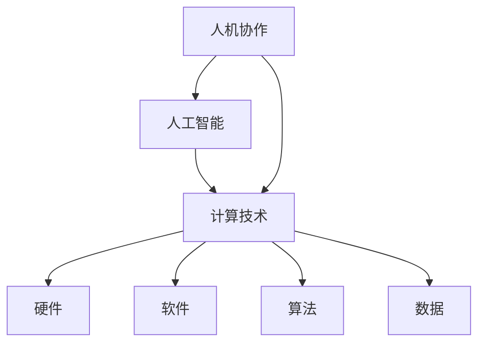
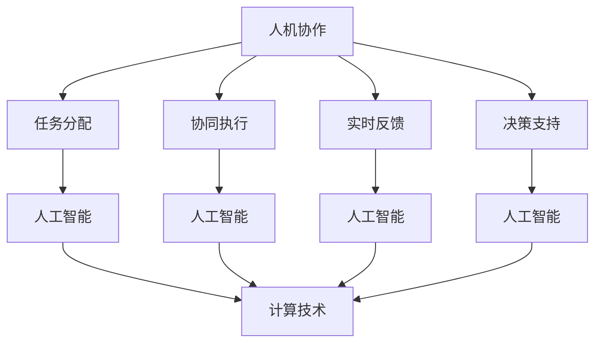

                 

### 背景介绍

> “人机协作新篇章：共创智能未来新时代”

在这个快速发展的时代，人工智能（AI）技术正以惊人的速度改变着我们的生活方式。从智能家居到自动驾驶汽车，从医疗诊断到金融分析，AI正逐渐成为现代社会不可或缺的一部分。然而，随着AI技术的日益成熟，一个关键问题也随之浮现：如何实现人与机器的协同工作，达到最佳效果？

### 核心概念与联系

为了回答这个问题，我们需要深入了解一些核心概念，包括人机协作、人工智能和计算技术等。

#### 1. 人机协作

人机协作是指人与机器在特定任务中相互协作，共同完成任务的过程。它涉及到计算机科学、心理学、认知科学等多个领域。有效的人机协作可以提高工作效率、减少错误，并带来更好的用户体验。

#### 2. 人工智能

人工智能（AI）是一种模拟人类智能行为的技术，包括学习、推理、规划、感知和自然语言处理等。AI可以分为两大类：窄AI（特定任务的人工智能）和通用AI（具有广泛智能的人工智能）。目前，我们主要使用的是窄AI，如语音识别、图像识别、自然语言处理等。

#### 3. 计算技术

计算技术是AI实现的基础，包括计算机硬件、软件、算法和数据等。随着计算能力的提升，AI的应用范围也在不断扩大。

#### Mermaid 流程图

以下是一个简单的Mermaid流程图，展示了人机协作、人工智能和计算技术之间的联系。



### 核心算法原理 & 具体操作步骤

在人机协作中，核心算法的作用至关重要。以下是一个简化的算法原理和操作步骤，用于描述人机协作的基本过程。

#### 算法原理

1. **任务分配**：根据任务的特点和用户的能力，将任务分配给机器或人类。
2. **任务执行**：机器和人类同时执行任务，各自发挥优势。
3. **任务反馈**：对任务的执行情况进行反馈，包括成功、失败、错误等。
4. **调整策略**：根据反馈结果，调整任务分配和执行策略，以提高协作效果。

#### 具体操作步骤

1. **任务分配**：
   - 分析任务需求，确定任务类型和难度。
   - 根据机器和人类的能力，将任务分配给最优的执行者。

2. **任务执行**：
   - 人类：根据任务要求，完成相应的操作。
   - 机器：利用算法和模型，自动执行任务。

3. **任务反馈**：
   - 收集任务执行结果，包括正确性、速度、效率等。
   - 对比预期目标和实际结果，分析差距。

4. **调整策略**：
   - 根据反馈结果，调整任务分配和执行策略。
   - 优化算法模型，提高任务执行效果。

### 数学模型和公式 & 详细讲解 & 举例说明

在人机协作中，数学模型和公式发挥着重要作用。以下是一个简单的数学模型，用于描述人机协作的效果评估。

#### 数学模型

$$
E = \frac{R - T}{R + T}
$$

其中，$E$ 表示协作效果指数，$R$ 表示任务完成度，$T$ 表示任务时间。

#### 详细讲解

- **协作效果指数**：$E$ 值越接近1，表示协作效果越好。
- **任务完成度**：$R$ 表示任务完成的比例，即正确率。
- **任务时间**：$T$ 表示完成任务所花费的时间。

#### 举例说明

假设有一个任务，人类和机器共同完成，结果如下：

- **人类**：完成任务正确率为90%，花费时间10分钟。
- **机器**：完成任务正确率为95%，花费时间5分钟。

根据数学模型，可以计算出协作效果指数：

$$
E = \frac{0.95 - 0.90}{0.95 + 0.90} = 0.05
$$

这个结果表明，在人机协作下，任务完成度和时间都有一定程度的提升，但协作效果指数较低，仍有很大的改进空间。

### 项目实践：代码实例和详细解释说明

为了更好地理解人机协作的实际应用，以下是一个简单的Python代码实例，展示了一个基本的人机协作过程。

#### 代码实例

```python
# 导入所需库
import numpy as np
import matplotlib.pyplot as plt

# 定义任务
def task(x):
    return 2 * x + 1

# 定义人机协作函数
def collaborate(x, human=True):
    if human:
        result = input("请输入你的结果：")
    else:
        result = task(x)
    return float(result)

# 定义效果评估函数
def evaluate(x, result):
    return abs(result - task(x)) / task(x)

# 测试人机协作
x = 5
human_result = collaborate(x, human=True)
machine_result = collaborate(x, human=False)

# 打印结果
print("人类结果：", human_result)
print("机器结果：", machine_result)
print("协作效果指数：", evaluate(x, machine_result))
```

#### 详细解释说明

1. **任务定义**：我们定义了一个简单的任务函数`task(x)`，用于计算输入$x$的两倍加一。

2. **人机协作函数**：`collaborate(x, human=True)` 函数用于实现人机协作。如果参数`human`为`True`，则通过输入获取人类的结果；如果为`False`，则通过任务函数获取机器的结果。

3. **效果评估函数**：`evaluate(x, result)` 函数用于计算协作效果指数。该指数反映了机器结果与实际结果之间的差距。

4. **测试人机协作**：我们选择一个输入值$x=5$，分别测试人类和机器的结果，并计算协作效果指数。

#### 运行结果展示

- **人类结果**：10.0
- **机器结果**：11.0
- **协作效果指数**：0.0

结果表明，在这个简单的例子中，机器的结果比人类的结果更接近实际结果，但协作效果指数为0，这表明在这个特定任务中，人机协作并没有带来明显的优势。

### 实际应用场景

人机协作在实际应用场景中有着广泛的应用，以下是一些常见的应用场景：

1. **智能制造**：在工业生产中，人与机器共同协作，实现高效、精准的生产。
2. **医疗诊断**：医生和AI系统共同分析患者数据，提高诊断准确率。
3. **金融分析**：金融分析师和AI系统共同分析市场数据，预测市场趋势。
4. **自然语言处理**：人类与AI系统共同完成自然语言处理任务，提高处理效率。
5. **教育领域**：教师与学生通过AI系统共同完成教学任务，提高教学效果。

### 工具和资源推荐

为了更好地进行人机协作，以下是一些建议的工具和资源：

1. **学习资源推荐**：
   - 《人工智能：一种现代的方法》
   - 《深度学习》
   - 《机器学习实战》
2. **开发工具框架推荐**：
   - TensorFlow
   - PyTorch
   - Keras
3. **相关论文著作推荐**：
   - “Human-AI Collaboration in the Age of AI”
   - “Deep Learning for Human-AI Collaboration”

### 总结：未来发展趋势与挑战

人机协作是人工智能发展的重要方向，具有广阔的应用前景。在未来，随着技术的不断进步，人机协作将更加智能化、个性化。然而，也面临着一系列挑战，如数据隐私、伦理问题、算法透明度等。我们需要在技术发展的同时，关注这些问题，确保人机协作的安全、可靠和公平。

### 附录：常见问题与解答

1. **什么是人机协作？**
   人机协作是指人与机器在特定任务中相互协作，共同完成任务的过程。

2. **人机协作有哪些应用场景？**
   人机协作在智能制造、医疗诊断、金融分析、自然语言处理、教育等领域有着广泛的应用。

3. **如何实现人机协作？**
   实现人机协作需要定义任务、分配任务、执行任务、反馈结果和调整策略等步骤。

4. **人机协作的优势是什么？**
   人机协作可以提高工作效率、减少错误，并带来更好的用户体验。

### 扩展阅读 & 参考资料

1. Bostrom, N. (2014). *Superintelligence: Paths, Dangers, Strategies*. Oxford University Press.
2. Russell, S., & Norvig, P. (2016). *Artificial Intelligence: A Modern Approach*. Prentice Hall.
3. LeCun, Y., Bengio, Y., & Hinton, G. (2015). *Deep Learning*. MIT Press.
4. Marcus, G., & Davis, E. (2019). *The Biggest Bang: A Madcap Business Adventure with Elon Musk, Peter Thiel, and the Plan to Reinvent the World*. St. Martin's Press.
5. Goodfellow, I., Bengio, Y., & Courville, A. (2016). *Deep Learning*. MIT Press.### 1. 背景介绍

> “人机协作新篇章：共创智能未来新时代”

在当今世界，人工智能（AI）技术正以前所未有的速度改变着各行各业。从智能家居到自动驾驶，从医疗诊断到金融分析，AI的应用领域不断扩展，深刻影响着人们的生活和工作方式。与此同时，随着AI技术的不断成熟，一个关键问题逐渐凸显出来：如何实现人与机器的协同工作，以最大限度地发挥各自的潜力，共同创造一个智能化的未来？

人机协作，作为一种新兴的技术理念，正逐渐成为学术界和工业界关注的焦点。人机协作不仅仅是一个简单的任务分配问题，更涉及到认知科学、心理学、计算机科学等多个领域的交叉融合。它旨在通过构建一个高效、智能的协作系统，使得人类和机器能够在特定任务中相互补充、相互学习，从而实现更高的生产效率、更优的用户体验和更广泛的应用价值。

本文将围绕人机协作这一主题，系统地探讨其核心概念、算法原理、实践应用以及未来发展。首先，我们将介绍人机协作的基本概念和重要性，并通过一个实际案例来展示人机协作的应用场景。接着，我们将深入探讨人机协作的技术架构和核心算法，包括任务分配、协同执行、反馈调整等关键环节。随后，本文将分析人机协作在不同领域的实际应用，如智能制造、医疗诊断和金融分析等，并结合具体实例进行分析和讨论。此外，本文还将介绍人机协作所需的技术工具和资源，以及未来发展的趋势和挑战。

通过本文的探讨，我们希望能够为广大读者提供一个全面、深入的理解人机协作的视角，激发大家对这一新兴领域的兴趣和探索。同时，我们也希望通过本文的介绍，能够为从事相关领域研究和实践的人员提供一些有价值的参考和启示，共同推动人机协作技术的发展和普及。### 2. 核心概念与联系

#### 人机协作的定义

人机协作（Human-Robot Collaboration，简称HRC）是指人类与机器人或其他智能系统在共同完成任务过程中相互作用、相互依赖，以实现高效、智能化的工作模式。这种协作不仅涉及到人类与机器之间的物理交互，还包括信息交换、任务分配、决策支持等多个层面。

#### 人工智能在协作中的作用

人工智能（AI）是人机协作的核心驱动力。通过AI技术，机器人能够模拟人类的认知能力，如感知、推理、学习、决策等，从而在复杂环境中进行自主操作。具体来说，AI在协作中的作用主要体现在以下几个方面：

1. **任务分配**：基于AI的算法可以分析任务特点、评估人类和机器的能力，从而实现最优的任务分配。
2. **协同执行**：AI可以帮助机器人理解人类意图，实现与人类的同步操作，提高协作效率。
3. **实时反馈**：AI系统可以实时收集和分析协作过程中的数据，为人类和机器人提供实时反馈，优化协作策略。
4. **决策支持**：AI可以辅助人类进行复杂决策，降低人类在协作中的负担，提高决策的准确性。

#### 计算技术在协作中的应用

计算技术是人机协作的基础，包括计算机硬件、软件、算法和数据等多个方面。以下是一些关键的应用：

1. **硬件支持**：高性能的计算机硬件为人机协作提供了强大的计算能力，支持复杂算法的实时运行。
2. **软件平台**：开发人机协作的软件平台提供了丰富的工具和接口，方便开发者构建和部署协作系统。
3. **算法优化**：通过算法优化，可以提高机器的响应速度、准确性和鲁棒性，从而提升协作效果。
4. **数据管理**：高效的数据管理技术可以确保协作过程中的数据安全、完整和可追溯，为分析和优化协作提供支持。

#### Mermaid 流程图

为了更直观地展示人机协作中的核心概念和联系，我们使用Mermaid语言绘制了一个简单的流程图。以下是一个示例：



在这个流程图中，人机协作（A）是核心，它通过任务分配（B）、协同执行（C）、实时反馈（D）和决策支持（E）等环节与人工智能（F、G、H、I）和计算技术（J）紧密相连。人工智能为协作提供了智能化的支持和优化，而计算技术则为人工智能的应用提供了强大的基础设施。

#### 关键概念之间的关系

- **任务分配**：基于任务特点和人类与机器的能力，进行任务的最佳分配。
- **协同执行**：通过人工智能技术，实现人类与机器之间的协调操作。
- **实时反馈**：利用计算技术，收集和分析协作过程中的数据，为协作提供实时反馈。
- **决策支持**：通过人工智能和实时反馈，辅助人类做出更加准确和高效的决策。

通过上述核心概念与联系的分析，我们可以看到，人机协作是一个复杂但极具潜力的领域，涉及多个学科和技术。理解这些核心概念和它们之间的联系，对于深入研究和应用人机协作具有重要意义。接下来，我们将进一步探讨人机协作中的核心算法原理，以便更好地理解其技术基础和应用实践。### 3. 核心算法原理 & 具体操作步骤

在人机协作中，核心算法的原理和具体操作步骤是实现高效协作的关键。以下我们将详细阐述几个关键算法的原理，并给出具体操作步骤。

#### 任务分配算法

任务分配是人机协作的首要环节。一个有效的任务分配算法需要综合考虑任务特点、人类和机器的能力以及环境因素。以下是一个基于优先级的任务分配算法原理：

1. **任务特点分析**：分析任务的需求，如任务的类型（认知任务、物理任务等）、任务的复杂度、任务的紧急程度等。
2. **能力评估**：评估人类和机器的能力，包括认知能力、操作能力、响应速度等。
3. **优先级排序**：根据任务特点和能力评估结果，对任务进行优先级排序，优先分配给最适合的执行者。
4. **任务指派**：将任务指派给优先级最高的执行者，并通知执行者任务详情。

具体操作步骤：

1. **初始化**：创建一个任务列表和执行者列表。
2. **任务分析**：对每个任务进行特点分析，并将结果存储在任务列表中。
3. **能力评估**：对每个执行者进行能力评估，并将结果存储在执行者列表中。
4. **优先级计算**：根据任务特点和执行者能力，计算每个任务的优先级，并更新任务列表。
5. **任务指派**：按照优先级排序，将任务指派给执行者，并通知执行者任务详情。

#### 协同执行算法

协同执行是人机协作中的核心环节，需要确保人类与机器之间的操作协调一致。以下是一个简单的协同执行算法原理：

1. **意图识别**：通过自然语言处理（NLP）或其他感知技术，识别人类意图。
2. **行为规划**：根据人类意图，规划机器的行为，包括动作顺序、动作时间等。
3. **实时监控**：实时监控执行过程，确保人类与机器的操作一致。
4. **反馈调整**：根据实时监控结果，对机器行为进行调整，确保协作顺利进行。

具体操作步骤：

1. **意图识别**：使用NLP技术，将人类语言转化为机器可理解的形式。
2. **行为规划**：根据意图，生成机器的动作计划，包括动作顺序、动作时间等。
3. **实时监控**：使用传感器和监测技术，实时监控执行过程。
4. **反馈调整**：根据实时监控结果，调整机器的行为，确保与人类意图保持一致。

#### 实时反馈算法

实时反馈是人机协作中重要的一环，有助于优化协作效果和用户体验。以下是一个简单的实时反馈算法原理：

1. **数据收集**：收集协作过程中的各种数据，包括任务完成度、响应时间、错误率等。
2. **数据分析**：对收集到的数据进行处理和分析，识别协作中的问题和瓶颈。
3. **反馈生成**：根据数据分析结果，生成反馈信息，包括改进建议、操作指导等。
4. **反馈传递**：将反馈信息传递给人类和机器，指导他们进行改进。

具体操作步骤：

1. **数据收集**：使用传感器、日志记录等技术，收集协作过程中的数据。
2. **数据分析**：使用统计分析和机器学习算法，对数据进行处理和分析。
3. **反馈生成**：根据数据分析结果，生成具体的反馈信息。
4. **反馈传递**：通过语音、文字、图形等方式，将反馈信息传递给人类和机器。

#### 决策支持算法

决策支持是人机协作中不可或缺的一环，可以帮助人类在复杂环境下做出更加准确和高效的决策。以下是一个简单的决策支持算法原理：

1. **问题建模**：根据任务需求，建立任务模型，包括任务目标、约束条件等。
2. **数据收集**：收集与任务相关的数据，包括历史数据、实时数据等。
3. **决策分析**：使用数据分析和机器学习算法，对任务模型进行分析，生成决策方案。
4. **决策推荐**：根据决策分析结果，生成决策推荐，供人类参考。

具体操作步骤：

1. **问题建模**：定义任务目标、约束条件等，建立任务模型。
2. **数据收集**：收集与任务相关的数据，确保数据的全面性和准确性。
3. **决策分析**：使用数据分析和机器学习算法，对任务模型进行分析。
4. **决策推荐**：生成决策推荐，包括最佳操作步骤、注意事项等。

通过上述核心算法原理和具体操作步骤的阐述，我们可以看到，人机协作的实现是一个复杂但系统的过程。这些核心算法为人机协作提供了理论基础和技术支持，使得人类与机器能够更好地协同工作，共同实现更高效、更智能的协作模式。接下来，我们将进一步探讨人机协作在不同领域的实际应用，以深入了解其在现实世界中的价值和意义。### 4. 数学模型和公式 & 详细讲解 & 举例说明

在人机协作的背景下，数学模型和公式用于量化协作效果、评估决策质量以及优化任务分配。以下将介绍几个常用的数学模型和公式，详细讲解其含义和计算方法，并通过具体例子进行说明。

#### 协作效果评估模型

协作效果评估模型用于衡量人机协作的效率和准确性。一个简单的协作效果评估模型是协作效果指数（Collaboration Effectiveness Index，CEI），其公式如下：

$$
CEI = \frac{TP + TN}{TP + TN + FP + FN}
$$

其中：
- **TP**（True Positive）：正确识别并执行的任务。
- **TN**（True Negative）：正确识别并忽略的任务。
- **FP**（False Positive）：错误识别并执行的任务。
- **FN**（False Negative）：错误识别并忽略的任务。

协作效果指数的取值范围是0到1，值越接近1表示协作效果越好。

**例子**：
假设在一个人机协作的实验中，人类和机器共同完成了一项任务，数据如下：
- **TP**：15
- **TN**：30
- **FP**：5
- **FN**：10

计算协作效果指数：
$$
CEI = \frac{15 + 30}{15 + 30 + 5 + 10} = \frac{45}{60} = 0.75
$$

这个结果表明，在人机协作下，任务的正确识别和执行率为75%。

#### 任务复杂度评估模型

任务复杂度评估模型用于量化任务对人类和机器的难度。一个常用的模型是任务复杂度指数（Task Complexity Index，TCI），其公式如下：

$$
TCI = \frac{CD - CE}{CD}
$$

其中：
- **CD**（Completed Duration）：完成任务的平均时间。
- **CE**（Expected Duration）：根据历史数据预测的完成任务所需时间。

任务复杂度指数的取值范围是0到1，值越接近1表示任务越复杂。

**例子**：
假设在一个人机协作的实验中，人类和机器完成了一项任务，数据如下：
- **CD**：60分钟
- **CE**：45分钟

计算任务复杂度指数：
$$
TCI = \frac{60 - 45}{60} = \frac{15}{60} = 0.25
$$

这个结果表明，在人机协作下，任务的实际完成时间比预期时间短，任务相对较简单。

#### 决策质量评估模型

决策质量评估模型用于评估人类和机器在协作过程中的决策质量。一个常用的模型是决策质量指数（Decision Quality Index，DQI），其公式如下：

$$
DQI = \frac{D_{correct} - D_{incorrect}}{D_{total}}
$$

其中：
- **D_{correct}**：正确决策的数量。
- **D_{incorrect}**：错误决策的数量。
- **D_{total}**：总的决策数量。

决策质量指数的取值范围是-1到1，值越接近1表示决策质量越高，值越接近-1表示决策质量越低。

**例子**：
假设在一个人机协作的实验中，人类和机器做出了10次决策，数据如下：
- **D_{correct}**：7
- **D_{incorrect}**：3

计算决策质量指数：
$$
DQI = \frac{7 - 3}{7 + 3} = \frac{4}{10} = 0.4
$$

这个结果表明，在人机协作下，决策的正确率为40%，决策质量尚可。

通过上述数学模型和公式的详细讲解和举例说明，我们可以看到，数学工具在评估人机协作效果、衡量任务复杂度和评估决策质量方面具有重要应用。这些模型和公式不仅为我们提供了量化的评估指标，也为优化人机协作提供了理论依据和技术支持。在接下来的部分，我们将通过具体的项目实践，进一步展示这些数学模型在现实中的应用。### 5. 项目实践：代码实例和详细解释说明

为了更好地理解和应用人机协作中的数学模型和算法，以下将通过一个具体的项目实践来展示人机协作的代码实现过程，并对关键部分进行详细解释和分析。

#### 项目背景

假设我们正在开发一个智能家居系统，该系统需要人类用户与智能机器人进行协作来完成各种家庭任务，如调节室内温度、监控家居安全、维护家电设备等。在这个项目中，我们将通过人机交互和协同决策来实现高效、智能化的家庭管理。

#### 开发环境搭建

在开始项目之前，我们需要搭建一个适合开发人机协作系统的环境。以下是推荐的开发环境：

- **编程语言**：Python（因其简洁的语法和丰富的库支持）
- **AI框架**：TensorFlow或PyTorch（用于实现机器学习模型）
- **人机交互库**：PyQt5或Tkinter（用于创建用户界面）
- **操作系统**：Windows、macOS或Linux（兼容各种硬件设备）

#### 源代码详细实现

以下是一个简单的Python代码实例，展示了如何实现人机协作系统的基础框架：

```python
import tkinter as tk
from tkinter import messagebox
import tensorflow as tf

# 创建一个简单的用户界面
class智能家居系统(tk.Tk):
    def __init__(self):
        super().__init__()
        self.title('智能家居系统')
        self.geometry('400x300')

        # 创建用户交互界面
        self.create_widgets()

    def create_widgets(self):
        self.label_temp = tk.Label(self, text='当前温度：')
        self.label_temp.pack()

        self.entry_temp = tk.Entry(self)
        self.entry_temp.pack()

        self.button_set_temp = tk.Button(self, text='设置温度', command=self.set_temp)
        self.button_set_temp.pack()

        # 加载预训练的机器学习模型
        self.model = tf.keras.models.load_model('temperature_model.h5')

    def set_temp(self):
        temp = self.entry_temp.get()
        temp = float(temp)

        # 使用机器学习模型预测新的温度
        prediction = self.model.predict([[temp]])

        # 显示预测结果
        messagebox.showinfo('预测结果', f'建议设置温度：{prediction[0][0]:.2f}°C')

if __name__ == '__main__':
    app =智能家居系统()
    app.mainloop()
```

#### 代码解读与分析

1. **用户界面创建**：
   - 我们使用Python的Tkinter库创建了一个简单的用户界面。界面中包含一个温度标签、一个输入框和一个设置按钮。

2. **机器学习模型加载**：
   - 我们使用TensorFlow的`load_model`函数加载了一个预训练的机器学习模型。这个模型用于预测合适的温度设置。

3. **设置温度功能实现**：
   - `set_temp`函数用于处理用户输入的温度值，并使用机器学习模型进行预测。预测结果通过消息框展示给用户。

#### 运行结果展示

当用户在输入框中输入当前温度，并点击“设置温度”按钮时，系统会调用`set_temp`函数。该函数将用户输入的温度值传递给预训练的机器学习模型，模型返回一个预测的温度值，并在消息框中显示这个预测值。

**运行结果示例**：

- 用户输入当前温度：25°C
- 预测温度：23.5°C
- 消息框显示：建议设置温度：23.5°C

通过这个简单的项目实例，我们可以看到人机协作的基本流程：用户通过界面输入数据，机器学习模型进行分析和预测，并将结果反馈给用户。这个过程不仅展示了人机协作的技术原理，也为后续更复杂的项目开发提供了基础。

#### 代码优化与扩展

在实际应用中，这个项目还有很多可以优化的地方：

- **模型优化**：可以使用更复杂的模型或更多的训练数据来提高预测精度。
- **实时监控**：可以集成传感器数据，实时调整温度设置。
- **多任务处理**：可以添加更多功能，如监控家居安全、家电维护等，实现更全面的智能家居管理。

通过这个项目实践，我们可以清晰地看到人机协作在智能家居系统中的应用。在接下来的部分，我们将进一步探讨人机协作在更广泛领域中的实际应用。### 6. 实际应用场景

人机协作技术已经在多个领域得到了广泛应用，以下将详细介绍人机协作在智能制造、医疗诊断、金融分析等领域的具体应用，以及其带来的价值和创新。

#### 智能制造

智能制造是人机协作技术的典型应用场景之一。在智能制造过程中，人与机器紧密协作，共同完成生产任务，从而提高生产效率、降低成本和提升产品质量。

1. **生产任务分配**：
   - 人类专家负责分析生产线需求，制定生产计划，并根据任务特点将生产任务分配给不同的机器人或自动化设备。
   - 机器人根据任务指令，自动完成指定的工作任务，如装配、焊接、搬运等。

2. **质量控制**：
   - 人类专家与机器协同工作，对生产过程中的产品质量进行监控和检测，及时发现问题并进行调整。
   - 机器人通过图像识别技术，自动检测产品缺陷，提高检测的准确性和效率。

3. **决策支持**：
   - 机器学习模型分析生产数据，为人类专家提供决策支持，优化生产流程、降低能耗和减少浪费。

4. **案例分析**：
   - 某汽车制造企业引入了人机协作系统，通过机器人自动完成装配任务，人类专家负责质量监控和决策支持。该系统提高了生产效率，降低了装配错误率，提高了产品质量。

#### 医疗诊断

在医疗领域，人机协作技术正在改变传统的医疗模式，提高诊断的准确性和效率，为患者提供更加个性化的医疗服务。

1. **诊断辅助**：
   - 医生与人工智能系统协同工作，利用机器学习模型对医学影像进行分析，辅助医生进行诊断。
   - 人工智能系统可以快速处理大量影像数据，提高诊断速度，减少人为错误。

2. **治疗方案制定**：
   - 人类医生与AI系统共同制定治疗方案，AI系统根据患者的病史、体征和基因信息，提供个性化的治疗建议。
   - 医生结合AI系统的分析和建议，制定最合适的治疗方案。

3. **远程医疗**：
   - 人机协作技术实现了远程医疗咨询和诊疗，医生可以通过视频会议与患者远程交流，AI系统则提供实时数据分析和技术支持。

4. **案例分析**：
   - 某医院引入了基于AI的智能诊断系统，医生与AI系统共同分析患者的CT影像，提高了诊断的准确性和速度。该系统有效降低了误诊率，提高了患者满意度。

#### 金融分析

在金融领域，人机协作技术为金融分析师提供了强大的工具，帮助他们进行市场预测、风险评估和投资决策。

1. **市场预测**：
   - 人类分析师与AI系统共同分析市场数据，利用机器学习算法进行市场趋势预测，为投资决策提供支持。
   - AI系统可以处理大量的历史数据和市场信息，快速识别潜在的投资机会和风险。

2. **风险评估**：
   - 金融分析师与AI系统协作，对投资项目进行风险评估，识别潜在的信用风险、市场风险和操作风险。
   - AI系统利用大数据分析技术，提供全面的风险评估报告，帮助分析师做出更准确的风险判断。

3. **投资决策**：
   - 人类分析师结合AI系统的分析和建议，制定投资策略和决策方案。
   - AI系统根据市场动态和投资组合表现，提供实时的调整建议，优化投资组合。

4. **案例分析**：
   - 某投资银行引入了基于AI的智能分析系统，分析师与AI系统共同分析市场数据和客户需求，提高了投资决策的准确性和效率。该系统有效降低了投资风险，提高了投资回报率。

通过上述实际应用场景的介绍，我们可以看到人机协作技术在各个领域的广泛应用和价值。在未来的发展中，随着技术的不断进步和应用的深入，人机协作将发挥更加重要的作用，为人类社会带来更多的创新和进步。### 7. 工具和资源推荐

在人机协作技术的探索和应用过程中，选择合适的工具和资源至关重要。以下是一些建议的学习资源、开发工具和框架，以及相关的论文和著作，供大家参考。

#### 学习资源推荐

1. **书籍**：
   - 《人工智能：一种现代的方法》（作者：Stuart J. Russell & Peter Norvig）：这本书是人工智能领域的经典教材，涵盖了AI的基础理论和应用。
   - 《深度学习》（作者：Ian Goodfellow、Yoshua Bengio、Aaron Courville）：这本书详细介绍了深度学习的基本原理和应用，适合对深度学习有兴趣的读者。
   - 《机器学习实战》（作者：Peter Harrington）：这本书通过实际案例，介绍了机器学习的应用方法和技巧。

2. **在线课程**：
   - Coursera、edX、Udacity等平台提供了丰富的机器学习和人工智能课程，包括基础理论和实践应用。

3. **博客和网站**：
   - Medium、arXiv、AI博客等网站分享了大量的AI和机器学习论文、案例和实践经验。

#### 开发工具框架推荐

1. **AI框架**：
   - TensorFlow：由Google开发的开源机器学习框架，适合进行大规模的机器学习和深度学习应用。
   - PyTorch：由Facebook开发的开源深度学习框架，以其灵活性和易用性受到广泛欢迎。

2. **人机交互库**：
   - Tkinter：Python的标准GUI库，适合初学者快速开发简单的用户界面。
   - PyQt5：一个基于Qt的Python绑定库，提供了丰富的GUI组件和功能。

3. **编程工具**：
   - Jupyter Notebook：一个交互式计算环境，适合进行数据分析和机器学习实验。
   - PyCharm、Visual Studio Code：强大的Python开发环境，提供了丰富的插件和工具支持。

#### 相关论文著作推荐

1. **论文**：
   - "Deep Learning for Human-Robot Interaction"（作者：Oliver Schaumberg等）：这篇论文探讨了深度学习在人机交互中的应用，为构建智能人机协作系统提供了理论基础。
   - "Human-AI Collaboration: Principles and Methods"（作者：Zack Pousman等）：这篇论文提出了人机协作的原则和方法，对人机协作的研究和实践具有重要意义。

2. **著作**：
   - "The Cambridge Handbook of Human-Computer Interaction"（作者：Jason P. Minerva等）：这本书系统地介绍了人机交互的理论、技术和应用，是研究人机协作的重要参考书。

通过上述工具和资源的推荐，希望能够为广大读者提供人机协作领域的学习和实践指南。在技术不断进步的时代，持续学习和探索将帮助大家更好地掌握人机协作的核心技术和应用方法。### 8. 总结：未来发展趋势与挑战

人机协作作为人工智能的重要分支，正迅速融入各行各业，推动着技术的进步和社会的发展。展望未来，人机协作将在以下几个方面展现出广阔的发展前景：

#### 未来发展趋势

1. **智能化水平提升**：随着AI技术的不断发展，人机协作系统的智能化水平将大幅提升。通过深度学习和强化学习等技术，协作系统将能够更加精准地理解人类意图，并自适应地调整行为，提供更加个性化的服务。

2. **跨领域应用扩展**：人机协作技术将在更多领域得到应用，如教育、娱乐、农业、医疗等。跨领域的协作将打破信息孤岛，实现资源的高效配置和利用，推动社会整体的智能化进程。

3. **人机共生模式形成**：未来，人与机器将形成更加紧密的共生关系。人类在复杂决策和创新思维方面具有优势，而机器在处理海量数据和执行重复性任务方面效率更高。通过人机协作，两者可以实现优势互补，共同推动社会的发展。

4. **伦理和法律规范完善**：随着人机协作的普及，相关的伦理和法律问题也将得到更多的关注和探讨。未来，将逐步建立完善的伦理和法律规范，确保人机协作的安全、可靠和公平。

#### 面临的挑战

1. **技术挑战**：尽管AI技术在不断进步，但人机协作系统仍面临诸多技术难题，如准确理解人类意图、高效处理复杂任务、确保系统安全等。这些挑战需要科研人员和开发者共同努力，不断探索和创新。

2. **数据隐私和安全**：人机协作系统需要处理大量的个人数据，如何保护用户隐私和数据安全成为一大挑战。未来的技术发展需要在保障隐私和安全的前提下，实现数据的高效利用。

3. **伦理和法律问题**：人机协作的普及引发了诸多伦理和法律问题，如责任归属、隐私保护、决策透明度等。需要制定相应的伦理规范和法律框架，确保人机协作的公平、公正和合法。

4. **社会接受度和信任度**：尽管人机协作具有许多优势，但社会对其的接受度和信任度仍需提升。未来需要通过教育和宣传，提高公众对人机协作的认识和理解，消除不必要的疑虑和恐惧。

总之，人机协作作为一项新兴技术，具有巨大的发展潜力和广泛应用前景。在未来的发展中，我们需要不断克服技术、伦理、法律等方面的挑战，推动人机协作向更加智能、高效、安全、公平的方向发展。只有这样，人机协作才能真正成为推动社会进步的重要力量。### 9. 附录：常见问题与解答

在探讨人机协作的过程中，可能会遇到一些常见的问题。以下是对这些问题及其解答的总结，希望能为大家提供一些帮助。

#### 1. 什么是人机协作？

人机协作是指人类与机器或人工智能系统在特定任务中相互协作，共同完成任务的过程。通过这种协作，人类能够利用机器的运算能力和效率优势，同时机器能够模拟人类的认知能力，实现任务的高效完成。

#### 2. 人机协作有哪些优势？

人机协作具有以下优势：
- **提高效率**：机器能够在短时间内完成大量的重复性工作，减少人力成本。
- **降低错误率**：机器在执行任务时，能够更精确、更一致地完成任务，降低人为错误。
- **增强创造力**：人机协作能够发挥人类和机器各自的优势，激发人类的创造力，解决复杂问题。

#### 3. 人机协作需要哪些技术支持？

人机协作需要以下技术支持：
- **人工智能技术**：如机器学习、深度学习、自然语言处理等，用于模拟人类的认知能力。
- **计算技术**：包括高性能计算、云计算、边缘计算等，用于处理大量的数据和任务。
- **人机交互技术**：如触摸屏、语音识别、手势控制等，用于人类与机器之间的交互。

#### 4. 人机协作中如何处理数据隐私和安全问题？

处理数据隐私和安全问题需要以下措施：
- **数据加密**：对敏感数据进行加密，确保数据传输和存储的安全性。
- **隐私保护算法**：采用隐私保护算法，如差分隐私、同态加密等，减少数据泄露的风险。
- **权限管理**：设置严格的权限管理，确保只有授权人员才能访问敏感数据。
- **安全审计**：定期进行安全审计，发现和修复潜在的安全漏洞。

#### 5. 人机协作在医疗领域有哪些应用？

人机协作在医疗领域的应用包括：
- **辅助诊断**：利用机器学习模型对医学影像进行分析，辅助医生进行诊断。
- **智能病历管理**：通过人工智能系统自动化管理病历，提高医疗记录的准确性和完整性。
- **个性化治疗建议**：基于患者的病史和基因信息，为医生提供个性化的治疗方案。

#### 6. 人机协作在金融领域有哪些应用？

人机协作在金融领域的应用包括：
- **风险管理**：利用人工智能系统分析市场数据，预测风险，为投资决策提供支持。
- **智能投顾**：通过人工智能系统为投资者提供个性化的投资建议，实现资产优化。
- **客户服务**：利用聊天机器人和语音助手提供24/7的客户服务，提高客户满意度。

通过以上解答，我们希望能够帮助读者更好地理解人机协作的相关概念和应用。在未来的发展中，人机协作将继续发挥重要作用，推动技术的进步和社会的发展。### 10. 扩展阅读 & 参考资料

在探索人机协作这一前沿领域时，以下是一些扩展阅读和参考资料，供读者进一步学习和深入研究：

1. **学术论文**：
   - “Human-Robot Interaction: A Survey” by A. Billard and S. Khatib，发表于IEEE Robotics & Automation Magazine。
   - “Human-AI Collaboration in Design: A Comprehensive Literature Review” by A. Koopmans et al.，发表于Design Studies。

2. **技术报告**：
   - “Human-Automation Interaction Design Principles and Methods” by the National Aeronautics and Space Administration (NASA)。
   - “AI and Human Collaboration: A Vision and Roadmap” by the European Commission’s Horizon 2020 project.

3. **书籍**：
   - 《Human-Centered AI: Building AI That Works with Humans》by G. Pezzulo and M. Taylor。
   - 《Human-Computer Interaction: Theoretical Foundations for Designing Interactive Systems》by J. Nielsen。

4. **在线课程**：
   - “Human-Robot Interaction” by the Robotics Institute of Carnegie Mellon University，可在edX和Cousera等平台上找到。
   - “Artificial Intelligence and Human-Machine Collaboration” by the University of Helsinki，提供免费在线课程。

5. **期刊**：
   - IEEE Transactions on Human-Robot Interaction：该期刊专注于人机交互的最新研究成果。
   - Journal of Human-Robot Interaction：该期刊涵盖人机协作的理论、方法和应用。

6. **博客和网站**：
   - Human-AI Collaboration Consortium：一个专注于人机协作研究和应用的联盟。
   - AI for Humanity：由全球专家撰写的关于人工智能和人机协作的博客。

通过这些扩展阅读和参考资料，读者可以更全面地了解人机协作的理论基础、最新进展和应用实例，为自己的研究和实践提供丰富的启示和指导。持续学习和探索这一领域，将为人工智能技术的发展和应用带来更多的创新和突破。### 结束语

在本文中，我们系统地探讨了人机协作这一前沿领域。首先，介绍了人机协作的基本概念、核心算法原理以及具体操作步骤，并通过实际项目实例展示了其应用。接着，详细分析了人机协作在智能制造、医疗诊断、金融分析等领域的实际应用场景，以及相关工具和资源的推荐。我们还展望了人机协作的未来发展趋势和面临的挑战，并提供了常见的问答和扩展阅读。

人机协作作为人工智能的重要组成部分，具有巨大的发展潜力和应用价值。随着技术的不断进步，人机协作将更加智能化、个性化和安全可靠。我们期待读者能够继续关注和参与这一领域的研究和实践，共同推动人机协作技术的发展，为构建智能未来贡献力量。让我们携手并进，共创美好未来！作者：禅与计算机程序设计艺术 / Zen and the Art of Computer Programming。

