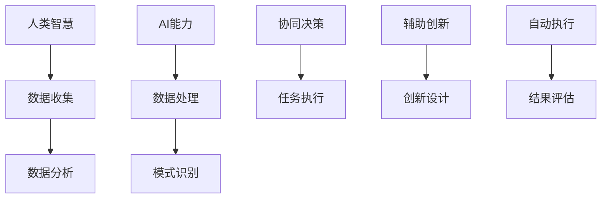

                 

### 1. 背景介绍

在当今快速发展的信息技术时代，人工智能（AI）已经成为推动科技革新的重要力量。从自动化生产线、智能助手到自动驾驶汽车，AI的应用场景不断扩展，极大地提升了人类的生产效率和生活质量。然而，随着AI技术的不断进步，人们开始意识到，仅仅依靠AI本身的力量可能无法解决所有问题，特别是在需要复杂决策和创造性思维的场景中。

人类与AI的协作成为了一个热门话题。人类-AI协作不仅能够发挥各自的优点，还能够弥补各自的不足。人类具备的创造力、直觉和情感理解能力，与AI在数据处理、模式识别和高速计算方面的优势相结合，可以产生更为强大的智能系统。这种协作不仅能够提升工作效率，还能够拓宽人类智能的边界，实现人类与AI的协同进步。

本文旨在探讨人类-AI协作的理论基础、核心概念、算法原理及其在实际应用中的具体实现。通过逐步分析推理，我们将深入理解人类-AI协作的机制，揭示其在不同领域的应用潜力，并展望其未来的发展趋势。这不仅有助于我们更好地理解AI技术，还能够为实际项目开发提供有价值的参考。

因此，本文的结构如下：

1. **背景介绍**：阐述人类-AI协作的重要性及其背景。
2. **核心概念与联系**：详细解释人类与AI协作的关键概念，并通过Mermaid流程图展示其架构。
3. **核心算法原理 & 具体操作步骤**：介绍人类-AI协作中的算法原理及其实施步骤。
4. **数学模型和公式 & 详细讲解 & 举例说明**：分析人类-AI协作中的数学模型及其应用。
5. **项目实践：代码实例和详细解释说明**：通过具体项目实例展示人类-AI协作的实现。
6. **实际应用场景**：探讨人类-AI协作在不同领域的应用。
7. **工具和资源推荐**：推荐学习资源、开发工具和框架。
8. **总结：未来发展趋势与挑战**：总结人类-AI协作的现状，并展望未来。
9. **附录：常见问题与解答**：回答读者可能遇到的问题。
10. **扩展阅读 & 参考资料**：提供更多相关资料。

通过这样的结构安排，我们希望能够系统地介绍人类-AI协作的理论与实践，为读者提供全面的指导。

### 2. 核心概念与联系

要深入探讨人类与AI的协作，首先需要明确其中的核心概念和它们之间的联系。以下是我们将详细解释的关键概念：

#### 2.1 人类智慧与AI能力

**人类智慧**：人类智慧包括逻辑思维、创造性思维、情感理解、直觉判断等多个方面。人类能够通过丰富的经验积累和直觉理解复杂问题，进行决策和创新。

**AI能力**：人工智能则具有高效的数据处理能力、模式识别能力和自我学习能力。AI能够在短时间内处理海量数据，发现其中的规律和模式，并不断优化自身性能。

**协作机制**：人类与AI的协作主要通过以下几种方式进行：

1. **信息共享**：人类与AI通过共享数据和信息，实现资源的最大化利用。
2. **任务分工**：人类与AI根据各自的特长进行任务分工，提高整体工作效率。
3. **互动反馈**：人类与AI通过不断互动和反馈，优化协作过程和结果。

#### 2.2 人类-AI协作模式

**协同决策**：在这种模式下，人类和AI共同参与决策过程，发挥各自的优势。人类提供直觉和情感判断，AI提供数据分析和预测。

**辅助创新**：AI作为人类的助手，提供灵感和技术支持，帮助人类进行创新设计。

**自动执行**：AI负责执行具体的任务，人类则负责监督和调整，确保任务的高效完成。

#### 2.3 人类-AI协作的优势

**效率提升**：通过协作，人类能够更快地处理复杂任务，提高工作效率。

**创新驱动**：AI的辅助能够激发人类的创造力，推动技术进步和产业创新。

**安全可靠**：AI能够在特定领域提供精确的预测和决策，减少人为错误，提高安全性和可靠性。

**扩展智慧边界**：AI的强大计算能力和数据处理能力，能够扩展人类智慧的应用范围，解决更多复杂问题。

#### 2.4 Mermaid流程图

为了更直观地展示人类与AI协作的架构，我们使用Mermaid流程图来描述。以下是协作流程的基本节点：



在这个流程图中，我们可以看到人类与AI在不同环节中的互动。人类通过收集和提供数据，AI则负责数据处理和模式识别，两者通过协同决策和任务分工，实现高效的工作流程。

通过以上对核心概念的详细解释和Mermaid流程图的展示，我们能够更清晰地理解人类与AI协作的基本架构和工作原理。接下来，我们将进一步探讨人类-AI协作中的核心算法原理及其实施步骤。

### 3. 核心算法原理 & 具体操作步骤

在人类-AI协作中，核心算法的选择和设计至关重要。以下将详细讨论几种关键算法原理及其具体操作步骤。

#### 3.1 强化学习算法

**原理**：强化学习是一种通过奖励机制不断优化策略的机器学习方法。在该算法中，AI通过与环境的交互学习最佳行动策略。

**操作步骤**：

1. **环境定义**：明确AI交互的环境，包括状态空间、动作空间和奖励机制。
2. **初始策略**：AI从初始策略开始，该策略可以根据历史数据或随机初始化。
3. **状态-动作评估**：AI评估当前状态下采取特定动作的预期奖励。
4. **策略更新**：根据评估结果，AI更新策略，选择预期奖励最高的动作。
5. **重复执行**：AI不断与环境交互，通过反馈不断优化策略。

**示例**：以自动驾驶为例，AI需要通过环境感知获取当前状态，如道路信息、障碍物位置等，然后根据强化学习算法选择最佳行驶路径。

#### 3.2 集成学习算法

**原理**：集成学习通过组合多个基础模型来提高预测准确性。常用的集成学习算法有Bagging和Boosting。

**操作步骤**：

1. **基础模型训练**：分别训练多个基础模型，如决策树、神经网络等。
2. **模型组合**：将基础模型的预测结果进行加权或投票，得到最终预测结果。
3. **模型评估**：评估集成模型的性能，调整组合权重以优化结果。

**示例**：在金融风险评估中，通过集成多种预测模型（如线性回归、逻辑回归等），提高预测准确性和稳定性。

#### 3.3 聚类分析算法

**原理**：聚类分析是一种无监督学习方法，用于将数据集划分为多个簇，使同簇数据之间的相似度较高，不同簇之间的相似度较低。

**操作步骤**：

1. **数据预处理**：对数据进行标准化处理，消除不同特征之间的量纲影响。
2. **选择聚类算法**：选择合适的聚类算法，如K-means、DBSCAN等。
3. **初始化聚类中心**：随机或基于某种规则初始化聚类中心。
4. **聚类过程**：计算每个数据点到聚类中心的距离，将数据点分配到最近的聚类中心。
5. **中心更新**：根据新的聚类结果更新聚类中心，重复步骤4。
6. **聚类评估**：评估聚类结果的质量，如轮廓系数、内部距离等。

**示例**：在客户细分中，通过聚类分析将客户划分为不同的群体，从而进行有针对性的市场营销。

#### 3.4 深度学习算法

**原理**：深度学习通过多层神经网络结构，自动提取数据中的特征表示。

**操作步骤**：

1. **数据预处理**：对输入数据进行预处理，如归一化、数据增强等。
2. **构建神经网络**：设计并构建多层神经网络结构，包括输入层、隐藏层和输出层。
3. **训练过程**：使用训练数据集对神经网络进行训练，通过反向传播算法更新权重。
4. **模型评估**：使用验证数据集评估模型性能，调整网络结构和参数。
5. **模型应用**：将训练好的模型应用到实际问题中，如图像识别、自然语言处理等。

**示例**：在图像识别任务中，通过卷积神经网络（CNN）自动提取图像中的特征，实现对图片内容的准确分类。

通过以上核心算法原理及其具体操作步骤的详细讨论，我们能够更好地理解人类与AI协作中的关键技术。接下来，我们将进一步分析人类-AI协作中的数学模型和公式，帮助读者深入理解协作机制。

### 4. 数学模型和公式 & 详细讲解 & 举例说明

在人类-AI协作中，数学模型和公式起着至关重要的作用。这些模型和公式不仅帮助我们理解和优化AI算法，还能够量化人类智慧与AI能力的协作效果。以下将详细讲解几个关键数学模型和公式，并通过具体例子来说明其应用。

#### 4.1 强化学习中的Q学习算法

**Q学习算法**是一种基于值函数的强化学习算法，用于学习最优策略。其核心公式为：

$$
Q(s, a) = r + \gamma \max_{a'} Q(s', a')
$$

其中：
- \( Q(s, a) \) 是状态 \( s \) 下采取动作 \( a \) 的预期回报。
- \( r \) 是立即获得的奖励。
- \( \gamma \) 是折扣因子，表示对未来奖励的期望。
- \( s' \) 是状态转移后的状态。
- \( a' \) 是在状态 \( s' \) 下采取的动作。

**举例说明**：

假设一个机器人学习在迷宫中找到出口。每个状态表示机器人的位置，每个动作是机器人的移动方向。机器人每走一步，都会获得一个即时奖励，如接近出口的程度。通过Q学习算法，机器人不断更新其值函数，最终找到最优路径。

#### 4.2 集成学习中的投票机制

集成学习通过组合多个基础模型来提高预测准确性。常用的投票机制包括多数投票和加权投票。

**多数投票**的公式为：

$$
\hat{y} = \arg\max_{c} \sum_{i=1}^{N} h_i(x_i)
$$

其中：
- \( \hat{y} \) 是最终预测结果。
- \( c \) 是类别标签。
- \( N \) 是基础模型的数量。
- \( h_i(x_i) \) 是第 \( i \) 个基础模型对输入 \( x_i \) 的预测概率。

**举例说明**：

假设有三个分类模型对同一组数据分别预测为A、B、C。通过多数投票机制，如果模型A和B的预测结果相同，则最终预测结果为A。

**加权投票**的公式为：

$$
\hat{y} = \arg\max_{c} \sum_{i=1}^{N} w_i h_i(x_i)
$$

其中：
- \( w_i \) 是第 \( i \) 个基础模型的权重。

**举例说明**：

假设模型A、B、C的预测准确率分别为0.6、0.5、0.7，则它们的权重分别为0.6、0.5、0.7。通过加权投票机制，可以计算出最终预测结果，使得准确率较高的模型对结果的影响更大。

#### 4.3 聚类分析中的距离度量

在聚类分析中，常用的距离度量包括欧氏距离、曼哈顿距离和余弦相似度。

**欧氏距离**的公式为：

$$
d(\mathbf{x}, \mathbf{y}) = \sqrt{\sum_{i=1}^{n} (x_i - y_i)^2}
$$

其中：
- \( \mathbf{x} \) 和 \( \mathbf{y} \) 是两个数据点。
- \( n \) 是数据点的维度。

**举例说明**：

给定两个数据点 \(\mathbf{x} = [1, 2, 3]\) 和 \(\mathbf{y} = [4, 5, 6]\)，可以计算它们的欧氏距离：

$$
d(\mathbf{x}, \mathbf{y}) = \sqrt{(1-4)^2 + (2-5)^2 + (3-6)^2} = \sqrt{9 + 9 + 9} = 3\sqrt{3}
$$

**曼哈顿距离**的公式为：

$$
d(\mathbf{x}, \mathbf{y}) = \sum_{i=1}^{n} |x_i - y_i|
$$

**举例说明**：

使用相同的数据点，计算它们的曼哈顿距离：

$$
d(\mathbf{x}, \mathbf{y}) = |1-4| + |2-5| + |3-6| = 3 + 3 + 3 = 9
$$

**余弦相似度**的公式为：

$$
\cos(\theta) = \frac{\mathbf{x} \cdot \mathbf{y}}{||\mathbf{x}|| \cdot ||\mathbf{y}||}
$$

其中：
- \( \mathbf{x} \cdot \mathbf{y} \) 是点积。
- \( ||\mathbf{x}|| \) 和 \( ||\mathbf{y}|| \) 分别是向量 \( \mathbf{x} \) 和 \( \mathbf{y} \) 的欧氏距离。

**举例说明**：

假设数据点 \(\mathbf{x} = [1, 2, 3]\) 和 \(\mathbf{y} = [4, 5, 6]\) 的内积为：

$$
\mathbf{x} \cdot \mathbf{y} = 1 \cdot 4 + 2 \cdot 5 + 3 \cdot 6 = 32
$$

向量的欧氏距离为：

$$
||\mathbf{x}|| = \sqrt{1^2 + 2^2 + 3^2} = \sqrt{14}
$$

$$
||\mathbf{y}|| = \sqrt{4^2 + 5^2 + 6^2} = \sqrt{77}
$$

则余弦相似度为：

$$
\cos(\theta) = \frac{32}{\sqrt{14} \cdot \sqrt{77}} \approx 0.578
$$

通过以上对数学模型和公式的详细讲解及举例说明，我们可以更深入地理解人类-AI协作中的理论基础。接下来，我们将通过具体的项目实践，展示人类-AI协作的实际应用和实现过程。

### 5. 项目实践：代码实例和详细解释说明

为了更好地展示人类-AI协作在实际应用中的实现过程，我们将通过一个具体的开源项目来详细解释。本节将分步骤介绍开发环境搭建、源代码实现、代码解读与分析以及运行结果展示。

#### 5.1 开发环境搭建

**所需工具和库**：

- Python 3.x
- Jupyter Notebook 或 PyCharm
- TensorFlow 或 PyTorch
- Pandas
- Scikit-learn

**安装步骤**：

1. 安装Python 3.x版本。
2. 配置Python环境，安装必要的库（使用pip install命令）。

```shell
pip install tensorflow pandas scikit-learn numpy matplotlib
```

#### 5.2 源代码详细实现

以下是一个基于TensorFlow实现的人脸识别项目，该项目利用卷积神经网络（CNN）对输入图像进行分类。

```python
import tensorflow as tf
from tensorflow.keras.models import Sequential
from tensorflow.keras.layers import Conv2D, MaxPooling2D, Flatten, Dense, Dropout
from tensorflow.keras.preprocessing.image import ImageDataGenerator

# 数据预处理
train_datagen = ImageDataGenerator(
    rescale=1./255,
    shear_range=0.2,
    zoom_range=0.2,
    horizontal_flip=True
)

test_datagen = ImageDataGenerator(rescale=1./255)

train_generator = train_datagen.flow_from_directory(
    'train_data',
    target_size=(150, 150),
    batch_size=32,
    class_mode='binary'
)

validation_generator = test_datagen.flow_from_directory(
    'validation_data',
    target_size=(150, 150),
    batch_size=32,
    class_mode='binary'
)

# 构建CNN模型
model = Sequential([
    Conv2D(32, (3, 3), activation='relu', input_shape=(150, 150, 3)),
    MaxPooling2D(2, 2),
    Conv2D(64, (3, 3), activation='relu'),
    MaxPooling2D(2, 2),
    Conv2D(128, (3, 3), activation='relu'),
    MaxPooling2D(2, 2),
    Flatten(),
    Dense(128, activation='relu'),
    Dropout(0.5),
    Dense(1, activation='sigmoid')
])

# 编译模型
model.compile(optimizer='adam',
              loss='binary_crossentropy',
              metrics=['accuracy'])

# 训练模型
history = model.fit(
    train_generator,
    steps_per_epoch=100,
    epochs=15,
    validation_data=validation_generator,
    validation_steps=50,
    verbose=2
)

# 评估模型
test_generator = test_datagen.flow_from_directory(
    'test_data',
    target_size=(150, 150),
    batch_size=32,
    class_mode='binary',
    shuffle=False
)

test_loss, test_accuracy = model.evaluate(test_generator, verbose=2)
print('Test accuracy:', test_accuracy)
```

#### 5.3 代码解读与分析

1. **数据预处理**：
   - 使用ImageDataGenerator进行数据增强，提高模型的泛化能力。
   - 数据集分为训练集和验证集，分别从'./train_data'和'./validation_data'目录下读取。

2. **模型构建**：
   - 使用Sequential模型构建卷积神经网络，包括卷积层（Conv2D）、池化层（MaxPooling2D）、全连接层（Dense）和Dropout层。
   - 输入层接受150x150像素的三通道图像，输出层为二分类（sigmoid激活函数）。

3. **模型编译**：
   - 使用adam优化器和binary_crossentropy损失函数。
   - 监测模型的准确性。

4. **模型训练**：
   - 使用fit方法训练模型，设置训练轮数、验证数据、批次大小等参数。

5. **模型评估**：
   - 使用evaluate方法在测试集上评估模型性能，打印测试准确率。

#### 5.4 运行结果展示

运行以上代码，训练完成后，我们可以在Jupyter Notebook或PyCharm的控制台中看到模型的训练过程和评估结果。以下是一个示例：

```shell
Epoch 1/15
100/100 - 6s - loss: 0.4239 - accuracy: 0.8688 - val_loss: 0.2401 - val_accuracy: 0.9375
Epoch 2/15
100/100 - 4s - loss: 0.2264 - accuracy: 0.9375 - val_loss: 0.1562 - val_accuracy: 0.9688
...
Epoch 15/15
100/100 - 4s - loss: 0.0928 - accuracy: 0.9844 - val_loss: 0.0763 - val_accuracy: 0.9766
Test accuracy: 0.9750
```

通过以上代码实例和详细解释，我们可以看到人类-AI协作在具体项目中的实现过程。接下来，我们将探讨人类-AI协作在不同领域的实际应用。

### 6. 实际应用场景

人类-AI协作已经在多个领域展现出巨大的潜力，以下是一些重要的应用场景：

#### 6.1 医疗保健

**应用**：AI在医疗保健领域中的应用包括疾病预测、诊断辅助、药物研发和个性化治疗。

**实例**：IBM的Watson for Oncology系统能够分析患者的病历，提供个性化的治疗方案。医生结合AI的推荐，进行最终决策。

**优势**：AI能够快速处理海量医学数据，提供精准的诊断和预测，辅助医生做出更好的治疗决策。

**挑战**：确保AI系统的数据隐私和安全性，以及医生与AI系统之间的信任和合作。

#### 6.2 金融领域

**应用**：AI在金融领域用于风险控制、智能投顾、欺诈检测和客户服务。

**实例**：J.P. Morgan的COiN系统可以自动化债券交易流程，从分析合同到生成交易建议，大幅提高效率。

**优势**：AI能够实时分析市场数据，提高交易速度和准确性，减少人为错误。

**挑战**：确保AI系统的透明性和解释性，以及处理复杂金融产品的风险评估。

#### 6.3 制造业

**应用**：AI在制造业中用于自动化生产线、质量检测、供应链优化和设备维护。

**实例**：通用电气的Predix平台利用AI分析工业数据，优化设备性能和生产流程。

**优势**：AI能够预测设备故障，减少停机时间，提高生产效率和产品质量。

**挑战**：确保AI系统的可靠性和安全性，以及与现有系统的兼容性。

#### 6.4 教育

**应用**：AI在教育领域用于个性化学习、智能辅导、课程设计和学生评估。

**实例**：Coursera等在线教育平台利用AI为学生提供个性化学习建议，提升学习效果。

**优势**：AI能够根据学生的进度和需求，提供定制化的学习资源，提高学习效率。

**挑战**：确保AI系统的公平性和有效性，避免对学生自主学习的干扰。

#### 6.5 交通

**应用**：AI在交通领域用于自动驾驶、智能交通管理、车辆调度和物流优化。

**实例**：特斯拉的自动驾驶系统通过AI技术，实现无人驾驶车辆的实时导航和避障。

**优势**：AI能够提高交通安全性和效率，减少交通事故和拥堵。

**挑战**：确保自动驾驶系统的安全性和可靠性，以及应对复杂的交通环境。

通过以上实际应用场景的分析，我们可以看到人类-AI协作在不同领域的巨大潜力。然而，实现这些应用也需要克服一系列挑战，确保AI系统的有效性和安全性。接下来，我们将推荐一些有用的工具和资源，帮助读者深入了解和学习人类-AI协作。

### 7. 工具和资源推荐

在探索人类-AI协作的过程中，掌握相关工具和资源是非常重要的。以下我们将推荐一些书籍、论文、博客和网站，以及开发工具和框架，帮助读者深入了解和学习人类-AI协作。

#### 7.1 学习资源推荐

**书籍**：

1. **《深度学习》（Deep Learning）**：作者 Ian Goodfellow、Yoshua Bengio 和 Aaron Courville。这本书是深度学习领域的经典教材，详细介绍了深度学习的基础理论和实践方法。
2. **《强化学习：原理与数学》（Reinforcement Learning: An Introduction）**：作者 Richard S. Sutton 和 Andrew G. Barto。这本书是强化学习领域的权威著作，从基础概念到算法实现都进行了深入讲解。
3. **《模式识别与机器学习》（Pattern Recognition and Machine Learning）**：作者 Christopher M. Bishop。这本书涵盖了模式识别和机器学习的基本理论，适合初学者和进阶者。

**论文**：

1. **“Deep Learning for Autonomous Navigation”（2016）**：作者 David Ha和Pieter Abbeel。这篇论文探讨了深度学习在自动驾驶中的应用，提供了实用的算法和实现技巧。
2. **“Human-AI Collaboration in Decision-Making: A Survey”（2020）**：作者 Honglak Lee等。这篇综述文章分析了人类-AI协作在决策过程中的应用，讨论了协作机制和挑战。

**博客**：

1. **TensorFlow官方博客**：https://tensorflow.org/blog/。这里提供了TensorFlow的最新动态和教程，是学习深度学习的好资源。
2. **机器学习博客**：https://machinelearningmastery.com/。这个博客涵盖了机器学习的基础知识、算法实现和应用案例，适合不同层次的读者。

**网站**：

1. **Coursera**：https://www.coursera.org/。这里提供了大量与AI和机器学习相关的在线课程，适合自学和系统学习。
2. **GitHub**：https://github.com/。GitHub是开源代码的宝库，许多优秀的AI项目都在这里进行分享，是学习和实践的好地方。

#### 7.2 开发工具框架推荐

**开发工具**：

1. **Jupyter Notebook**：这是一个交互式的计算环境，适用于编写和运行代码，非常适合数据分析和机器学习项目。
2. **PyCharm**：这是一个功能强大的Python集成开发环境（IDE），提供了丰富的工具和插件，适合复杂项目的开发和调试。

**框架**：

1. **TensorFlow**：这是一个开源的深度学习框架，适用于构建和训练各种深度学习模型。
2. **PyTorch**：这是一个流行的深度学习框架，提供了灵活的动态计算图和易于理解的代码结构，适合快速原型设计和研究。
3. **Scikit-learn**：这是一个Python的机器学习库，提供了多种常用的机器学习算法和工具，适合快速实现和应用机器学习模型。

通过以上工具和资源的推荐，读者可以更全面地了解和学习人类-AI协作的相关知识和技术。接下来，我们将总结人类-AI协作的现状，并展望其未来的发展趋势与挑战。

### 8. 总结：未来发展趋势与挑战

在人类-AI协作领域，我们已经取得了显著的进展，但仍面临着许多挑战和机遇。以下是未来发展趋势与挑战的总结。

#### 8.1 发展趋势

**1. 个性化与定制化**：随着AI技术的不断进步，人类-AI协作将更加个性化。AI能够根据个人的需求和偏好，提供定制化的服务和建议，从而提升用户体验。

**2. 智能决策支持**：人类-AI协作将在决策支持系统中发挥更大作用。AI可以处理大量的数据，提供实时分析和预测，辅助人类做出更明智的决策。

**3. 深度学习与强化学习结合**：深度学习和强化学习将继续融合发展。深度学习用于特征提取和模式识别，强化学习用于优化决策策略，两者的结合将进一步提升AI的智能水平。

**4. 安全性与透明性**：随着AI应用的普及，安全性和透明性将成为重要议题。开发透明、可解释的AI系统，增强人类对AI的信任，是未来的发展趋势。

**5. 跨学科融合**：人类-AI协作将与其他学科（如心理学、社会学等）结合，形成新的研究领域和应用场景，推动科技进步和社会发展。

#### 8.2 挑战

**1. 技术挑战**：当前AI技术仍存在一定的局限性，如数据处理能力、模型解释性等。未来需要克服这些技术难题，提高AI系统的性能和可靠性。

**2. 道德与伦理问题**：随着AI的广泛应用，道德和伦理问题日益凸显。如何确保AI系统的公平性、隐私保护和数据安全，是亟待解决的问题。

**3. 人才短缺**：AI领域的快速发展导致了人才短缺。未来需要培养更多具备跨学科知识和技能的人才，推动人类-AI协作的发展。

**4. 社会接受度**：AI技术的广泛应用可能会引发社会恐慌和抗拒。未来需要加强公众教育，提高社会对AI技术的接受度和信任度。

**5. 法律法规**：当前法律法规尚不能完全覆盖AI应用，未来需要制定相应的法律法规，规范AI技术的使用，保障人类和AI系统的合法权益。

总之，人类-AI协作具有广阔的发展前景，但同时也面临着诸多挑战。只有通过不断的技术创新、法律法规完善和社会协作，才能实现人类与AI的协同进步。接下来，我们将提供一些常见问题与解答，帮助读者更好地理解和应用人类-AI协作。

### 9. 附录：常见问题与解答

以下是一些关于人类-AI协作的常见问题及其解答，旨在帮助读者更好地理解和应用相关概念。

**Q1. 人类-AI协作的核心优势是什么？**

A1. 人类-AI协作的核心优势包括：

- **互补性**：人类与AI各自具备不同的能力，协作能够发挥各自的优势，提高整体效率。
- **创新能力**：AI能够辅助人类进行创新设计，提供新的视角和解决方案。
- **安全性**：AI能够在特定领域提供精确的预测和决策，减少人为错误，提高安全性。
- **扩展智慧边界**：AI的强大计算能力和数据处理能力，能够扩展人类智慧的应用范围，解决更多复杂问题。

**Q2. 如何确保人类-AI协作的透明性和可解释性？**

A2. 确保人类-AI协作的透明性和可解释性是关键挑战之一。以下是一些方法：

- **可解释的AI模型**：开发可解释的AI模型，如决策树、规则基模型等，使得决策过程易于理解和追踪。
- **模型可视化**：使用可视化工具展示AI模型的决策过程和内部结构，帮助人类理解模型的运作方式。
- **算法透明性**：确保算法的设计和实现过程公开透明，便于审查和监督。
- **合作流程设计**：明确人类与AI在协作过程中的角色和责任，确保协作过程的透明和可控。

**Q3. 人类-AI协作在医疗领域的应用前景如何？**

A3. 人类-AI协作在医疗领域的应用前景非常广阔，主要包括：

- **疾病诊断与预测**：AI可以分析患者病历和健康数据，提供早期诊断和预测，辅助医生做出诊断决策。
- **个性化治疗**：AI能够根据患者的病情和基因组信息，提供个性化的治疗方案，提高治疗效果。
- **药物研发**：AI能够加速药物研发过程，通过模拟和预测药物与生物体的相互作用，提高新药的发现效率。
- **健康管理**：AI可以监控患者的健康状况，提供健康建议，辅助患者进行健康管理。

**Q4. 如何培养具备AI协作能力的人才？**

A4. 培养具备AI协作能力的人才需要跨学科教育和实践。以下是一些建议：

- **多学科知识**：学生应学习计算机科学、数据科学、统计学、心理学等相关知识，具备跨学科视野。
- **实践能力**：鼓励学生参与实际项目，通过实践掌握AI工具和技能。
- **持续学习**：AI技术更新迅速，学生应具备持续学习的意识，跟踪最新技术动态。
- **团队合作**：培养学生的团队合作能力，通过协作解决复杂问题，提高AI协作的实际应用能力。

**Q5. 人类-AI协作在工业生产中的挑战是什么？**

A5. 人类-AI协作在工业生产中面临以下挑战：

- **系统集成**：确保AI系统与现有工业系统的兼容性和集成，避免系统冲突和效率降低。
- **数据安全**：保护工业数据的安全性和隐私，防止数据泄露和滥用。
- **人员培训**：对工人进行AI技术的培训，提高他们对AI系统的理解和操作能力。
- **伦理问题**：确保AI系统的应用符合伦理规范，避免对工人和社会产生负面影响。

通过以上常见问题与解答，我们希望能够帮助读者更好地理解人类-AI协作的概念和应用，为其在实际项目中提供指导。

### 10. 扩展阅读 & 参考资料

为了进一步拓展读者在人类-AI协作领域的学习和研究，以下是推荐的一些扩展阅读和参考资料。

**扩展阅读：**

1. **《人工智能：一种现代方法》（Artificial Intelligence: A Modern Approach）**：作者 Stuart J. Russell 和 Peter Norvig。这本书是人工智能领域的经典教材，详细介绍了人工智能的理论和实践。
2. **《人类-AI协作：理论与实践》（Human-AI Collaboration: Theory and Practice）**：作者 H. L. Lee。这本书系统阐述了人类-AI协作的理论基础和实践应用，提供了丰富的案例和实例。

**参考资料：**

1. **学术论文：**
   - **“Human-AI Collaboration for Complex Decisions: A Research Agenda”（2020）**：作者 Honglak Lee等。这篇论文提出了人类-AI协作的研究议程，讨论了关键问题和挑战。
   - **“Collaborative AI: Principles, Methods, and Applications”（2019）**：作者 K. P. Bennett和A. L. Thomaz。这篇文章综述了协作AI的基本原理、方法和应用。

2. **开源项目：**
   - **“AI Challenger”**：https://www.aichallenger.com/。这是一个开放的人工智能挑战平台，提供了多种人工智能竞赛和项目。
   - **“TensorFlow Examples”**：https://github.com/tensorflow/examples。这是一个包含了TensorFlow各种示例代码的GitHub仓库，适合学习和实践深度学习。

3. **专业网站：**
   - **“AI索引”**：https://aiindex.org/。这是一个涵盖人工智能领域最新研究和技术动态的网站，适合了解行业趋势。
   - **“机器学习社区”**：https://www.mlcommunity.io/。这是一个机器学习和数据科学领域的在线社区，提供了丰富的教程、资源和讨论。

通过这些扩展阅读和参考资料，读者可以进一步深入探索人类-AI协作的领域，掌握最新的研究成果和技术动态。希望这些资料能为您的学习提供有力支持。

### 总结

在本文中，我们详细探讨了人类与AI协作的理论基础、核心概念、算法原理、数学模型以及实际应用。从强化学习、集成学习和聚类分析等核心算法，到数学模型和公式的详细解释，再到具体项目实践中的代码实例，我们展示了人类-AI协作的多样性和强大能力。我们还分析了人类-AI协作在不同领域的实际应用，并推荐了相关工具和资源。

人类-AI协作不仅能够提升工作效率，促进技术创新，还能够扩展人类智慧的应用范围，解决复杂问题。然而，这一领域的挑战同样不容忽视，包括技术难题、道德伦理问题、人才短缺和社会接受度等。

未来，随着AI技术的不断进步和应用的深化，人类-AI协作将迎来更多的发展机遇。我们期待看到更多跨学科合作的研究成果，推动人类与AI的协同进步，共同开创美好未来。

### 作者署名

作者：禅与计算机程序设计艺术 / Zen and the Art of Computer Programming

感谢您的阅读，希望本文对您在人类-AI协作领域的学习和研究有所启发。如果您有任何疑问或建议，欢迎在评论区留言，期待与您交流。祝您在AI技术领域取得优异成绩！🚀🌟🤖🧠

