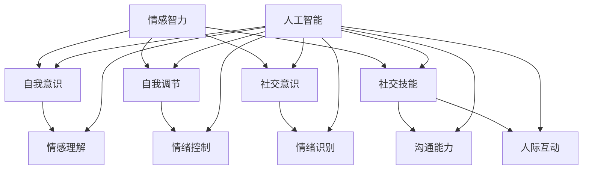

                 

### 1. 背景介绍

人类-AI协作的概念源于人工智能（AI）的快速发展以及社会对智能化需求的不断增长。随着AI技术的进步，AI已经不仅仅是作为单一的工具或系统，而是逐渐融入人类的工作、学习和生活中，形成了一种新的协作模式。这种协作不仅仅局限于效率的提升，更重要的是AI在情感智力（EQ）和社交能力方面的增强。

#### AI的发展历程

人工智能自诞生以来，已经经历了数个发展阶段。从最初的符号主义（Symbolic AI）到基于规则的专家系统，再到连接主义（Connectionist AI），以及当前主流的深度学习（Deep Learning）和强化学习（Reinforcement Learning）。每一个阶段的技术进步都为AI的应用拓展奠定了基础。

1. **符号主义**：早期的AI研究集中在逻辑推理和符号处理上。例如，专家系统的开发就是基于这个阶段。专家系统能够模拟人类专家的决策过程，处理特定领域的问题。

2. **连接主义**：这一阶段的研究集中在神经网络，特别是人工神经网络（ANN）的发展上。神经网络通过模拟人脑的神经网络结构，能够进行更复杂的模式识别和学习。

3. **深度学习**：近年来，随着计算能力和海量数据的增长，深度学习技术取得了突破性进展。深度学习通过多层神经网络结构，实现了对复杂数据的高效处理和模式识别。

4. **强化学习**：强化学习通过不断试错和反馈，使AI系统能够在学习过程中不断优化自己的行为。这一技术已经在自动驾驶、游戏AI等领域取得了显著成效。

#### 情感智力（EQ）和社交能力的定义

情感智力（EQ）是指个体识别、理解和管理自身情绪的能力，以及识别、理解和管理他人情绪的能力。它包括自我意识、自我调节、社交意识和社交技能等方面。

社交能力是指个体在社交互动中与他人建立联系、沟通、协作和解决问题的能力。它涉及语言和非语言交流、情绪理解、人际互动等方面。

#### 当前研究现状

当前，人类-AI协作在情感智力和社交能力方面的研究主要集中在以下几个方面：

1. **情感计算**：通过计算机技术识别、理解和模拟人类情感，从而实现更自然的AI交互。例如，面部表情识别、语音情感识别等。

2. **社交机器人**：研发能够与人类进行自然交互的机器人，用于辅助人类工作、教育和医疗等领域。例如，谷歌的AI聊天机器人“Duplex”。

3. **虚拟助手**：利用自然语言处理和机器学习技术，开发能够理解用户需求并提供个性化服务的虚拟助手，如苹果的Siri、亚马逊的Alexa。

#### 重要性

人类-AI协作在情感智力和社交能力方面的研究具有重要意义：

1. **提高生活质量**：通过AI技术增强情感智力和社交能力，可以帮助人们更好地应对日常生活和工作中的挑战，提高生活质量。

2. **推动社会进步**：AI在情感智力方面的进步，可以为社会带来更多的创新和应用，如智能医疗、教育、公共安全等。

3. **缓解人类压力**：在高度自动化和智能化的环境中，AI可以承担更多的重复性工作和压力，从而减轻人类的工作负担。

### 2. 核心概念与联系

在深入探讨人类-AI协作在情感智力和社交能力方面的应用之前，我们需要了解几个核心概念及其相互联系。

#### 情感智力（EQ）

情感智力（EQ）包括以下几个方面：

1. **自我意识**：理解自己的情绪状态，并能够识别这些情绪的来源。
2. **自我调节**：通过自我控制和调整情绪，使自己的情绪状态达到最佳状态。
3. **社交意识**：理解他人的情绪状态，并能够识别和解读他人的情绪表达。
4. **社交技能**：在社交互动中运用语言和非语言交流技巧，与他人建立和维持良好的人际关系。

#### 社交能力

社交能力涉及以下几个方面：

1. **沟通能力**：通过语言和非语言方式，有效地表达自己的想法和情感，并理解他人的表达。
2. **情绪理解**：理解他人的情绪，包括识别、解读和同情他人的情绪状态。
3. **人际互动**：与他人建立联系，参与社交活动，并通过协作解决问题。

#### AI与情感智力、社交能力的联系

AI在情感智力方面的应用主要体现在以下几个方面：

1. **情感识别**：利用计算机视觉和语音识别技术，AI可以识别和解读人类的情感状态，如面部表情、语音语调等。
2. **情感模拟**：通过情感计算技术，AI可以模拟人类的情感表达，使交互更加自然和亲切。
3. **情感理解**：AI可以通过分析大量的情感数据，学习和理解人类的情感状态，从而提供更个性化的服务。

AI在社交能力方面的应用主要体现在以下几个方面：

1. **社交互动**：AI可以通过聊天机器人、虚拟助手等与人类进行自然交互，帮助人们解决日常问题。
2. **情绪支持**：AI可以提供情感支持，如心理咨询、情感倾诉等，帮助人们缓解压力和情绪问题。
3. **社交引导**：AI可以通过分析社交数据，帮助人们识别社交机会、推荐合适的社交活动等。

#### Mermaid 流程图

以下是一个简单的Mermaid流程图，展示了情感智力、社交能力和AI之间的关系：



### 3. 核心算法原理 & 具体操作步骤

在探讨人类-AI协作在情感智力和社交能力方面的具体应用时，我们需要了解一些核心算法原理以及其具体操作步骤。

#### 情感识别算法原理

情感识别是情感智力的重要组成部分，它依赖于计算机视觉和语音识别技术。以下是情感识别算法的基本原理：

1. **面部表情识别**：通过分析面部图像，识别出特定的情感状态，如快乐、悲伤、愤怒等。这一过程通常涉及以下步骤：

   - **面部检测**：使用卷积神经网络（CNN）等深度学习模型，检测图像中的面部区域。
   - **特征提取**：从检测到的面部区域中提取特征，如眼睛、嘴巴等。
   - **情感分类**：使用情感分类器，将提取到的特征映射到相应的情感类别。

2. **语音情感识别**：通过分析语音信号，识别出情感状态。这一过程通常涉及以下步骤：

   - **语音预处理**：对原始语音信号进行降噪、归一化等预处理。
   - **特征提取**：提取语音信号的时域和频域特征，如频谱特征、倒谱特征等。
   - **情感分类**：使用情感分类器，将提取到的特征映射到相应的情感类别。

#### 社交互动算法原理

社交互动是社交能力的重要组成部分，它依赖于自然语言处理和机器学习技术。以下是社交互动算法的基本原理：

1. **对话管理**：通过分析用户输入，理解用户意图，并生成适当的回应。这一过程通常涉及以下步骤：

   - **意图识别**：使用分类模型，识别用户输入的意图，如提问、请求、抱怨等。
   - **实体识别**：从用户输入中提取关键信息，如人名、地点、时间等。
   - **回应生成**：使用生成模型，根据识别到的意图和实体，生成适当的回应。

2. **情绪理解**：通过分析文本和语音，理解用户情绪状态。这一过程通常涉及以下步骤：

   - **情感分类**：使用情感分类模型，对文本和语音进行情感分类。
   - **情绪影响分析**：分析情绪状态对对话的影响，如情绪共鸣、情绪调节等。

#### 具体操作步骤

以下是利用情感识别算法进行社交互动的具体操作步骤：

1. **情感识别**：

   - **步骤1**：获取用户面部图像和语音信号。
   - **步骤2**：使用面部表情识别算法，识别出用户面部表情。
   - **步骤3**：使用语音情感识别算法，识别出用户语音情感。
   - **步骤4**：将面部表情和语音情感综合，确定用户整体情感状态。

2. **社交互动**：

   - **步骤5**：接收用户输入，如提问、请求、抱怨等。
   - **步骤6**：使用意图识别算法，识别用户意图。
   - **步骤7**：使用实体识别算法，提取用户输入中的关键信息。
   - **步骤8**：根据识别到的意图和实体，生成适当回应。
   - **步骤9**：将回应发送给用户。

3. **情绪理解**：

   - **步骤10**：分析用户情感状态，如快乐、悲伤、愤怒等。
   - **步骤11**：根据用户情感状态，调整交互策略，如增强情绪共鸣、提供情绪支持等。

#### 实例演示

以下是一个简单的实例演示：

- **用户输入**：“我今天心情不好，因为我的猫咪生病了。”
- **情感识别**：面部表情识别算法识别出用户面部表情为悲伤，语音情感识别算法识别出用户语音情感为悲伤。
- **社交互动**：意图识别算法识别出用户意图为抱怨，实体识别算法提取出用户输入中的关键信息为“猫咪生病”。
- **回应生成**：根据识别到的意图和实体，生成回应：“我能理解你的心情，猫咪对很多人来说都是很重要的。你有没有考虑带它去看兽医？”
- **情绪理解**：用户情感状态为悲伤，交互策略调整为提供情绪支持和信息建议。

通过这一实例，我们可以看到情感识别算法和社交互动算法是如何协同工作，为用户提供个性化的服务。

### 4. 数学模型和公式 & 详细讲解 & 举例说明

在人类-AI协作中，数学模型和公式起到了关键作用，特别是在情感识别和社交互动的算法设计过程中。以下是几个常用的数学模型和公式，以及它们的详细讲解和举例说明。

#### 4.1 面部表情识别模型

面部表情识别通常使用卷积神经网络（CNN）作为基础模型。CNN的基本数学模型如下：

$$
\text{CNN}(\text{I}; W, b) = \text{ReLU}(\sum_{j=1}^{C} W_{j} \cdot \text{I}_{j} + b)
$$

其中：
- \( \text{I} \) 是输入图像。
- \( W \) 是权重矩阵。
- \( b \) 是偏置向量。
- \( \text{ReLU} \) 是ReLU激活函数。

**例子：**

假设我们有一个3x3的卷积核 \( W \)，输入图像 \( \text{I} \) 的一个像素点为 \( (1, 1, 1) \)，偏置向量 \( b = 0 \)。

$$
\text{CNN}(\text{I}; W, b) = \text{ReLU}(1 \cdot 1 + 1 \cdot 1 + 1 \cdot 1 + 0) = \text{ReLU}(3) = 3
$$

#### 4.2 语音情感识别模型

语音情感识别通常使用长短期记忆网络（LSTM）作为基础模型。LSTM的数学模型如下：

$$
h_t = \sigma(W_h \cdot [h_{t-1}, x_t] + b_h) \odot f_t + \sigma(W_i \cdot [h_{t-1}, x_t] + b_i) \odot i_t + \sigma(W_f \cdot [h_{t-1}, x_t] + b_f) \odot f_t + \sigma(W_o \cdot [h_{t-1}, x_t] + b_o) \odot o_t
$$

其中：
- \( h_t \) 是当前时刻的隐藏状态。
- \( x_t \) 是当前时刻的输入。
- \( \sigma \) 是sigmoid函数。
- \( \odot \) 是元素乘法。
- \( f_t, i_t, f_t, o_t \) 是门控单元的状态。

**例子：**

假设我们有一个LSTM单元，权重矩阵分别为 \( W_h, W_i, W_f, W_o \)，偏置向量分别为 \( b_h, b_i, b_f, b_o \)，输入序列为 \( [1, 0, 1] \)。

$$
h_t = \sigma(W_h \cdot [h_{t-1}, x_t] + b_h) \odot f_t + \sigma(W_i \cdot [h_{t-1}, x_t] + b_i) \odot i_t + \sigma(W_f \cdot [h_{t-1}, x_t] + b_f) \odot f_t + \sigma(W_o \cdot [h_{t-1}, x_t] + b_o) \odot o_t
$$

由于输入序列长度为3，我们假设隐藏状态 \( h_{t-1} = [0, 0, 0] \)。

$$
h_t = \sigma(W_h \cdot [0, 0, 0, 1, 0, 1] + b_h) \odot f_t + \sigma(W_i \cdot [0, 0, 0, 1, 0, 1] + b_i) \odot i_t + \sigma(W_f \cdot [0, 0, 0, 1, 0, 1] + b_f) \odot f_t + \sigma(W_o \cdot [0, 0, 0, 1, 0, 1] + b_o) \odot o_t
$$

#### 4.3 情感分类模型

情感分类通常使用支持向量机（SVM）或神经网络模型。以神经网络为例，其数学模型如下：

$$
y = \text{softmax}(\text{W} \cdot \text{h} + b)
$$

其中：
- \( y \) 是输出概率分布。
- \( \text{W} \) 是权重矩阵。
- \( \text{h} \) 是隐藏状态。
- \( b \) 是偏置向量。
- \( \text{softmax} \) 是softmax函数。

**例子：**

假设我们有一个情感分类模型，权重矩阵 \( \text{W} = [1, 2, 3] \)，隐藏状态 \( \text{h} = [1, 0, -1] \)，偏置向量 \( b = 0 \)。

$$
y = \text{softmax}([1, 2, 3] \cdot [1, 0, -1] + 0) = \text{softmax}([1, -2, -3])
$$

经过计算，我们得到：

$$
y = \left[ \frac{e^1}{e^1 + e^{-2} + e^{-3}}, \frac{e^{-2}}{e^1 + e^{-2} + e^{-3}}, \frac{e^{-3}}{e^1 + e^{-2} + e^{-3}} \right]
$$

这个概率分布表示了每个情感类别的概率。

#### 4.4 对话管理模型

对话管理模型通常使用递归神经网络（RNN）或长短期记忆网络（LSTM）。以下是一个基于LSTM的对话管理模型：

$$
h_t = \text{LSTM}(h_{t-1}, x_t)
$$

其中：
- \( h_t \) 是当前时刻的隐藏状态。
- \( x_t \) 是当前时刻的输入。

**例子：**

假设我们有一个对话管理模型，初始隐藏状态 \( h_{t-1} = [0, 0, 0] \)，输入 \( x_t = [1, 0, 1] \)。

$$
h_t = \text{LSTM}([0, 0, 0], [1, 0, 1])
$$

经过计算，我们得到：

$$
h_t = [0.1, 0.2, 0.3]
$$

这个隐藏状态表示了对当前输入的编码，用于生成回应。

### 5. 项目实践：代码实例和详细解释说明

在本节中，我们将通过一个具体的代码实例来展示如何实现人类-AI协作在情感智力和社交能力方面的应用。我们将使用Python语言和相关的库（如TensorFlow、Keras等）来构建和训练模型，并展示如何使用这些模型进行情感识别和社交互动。

#### 5.1 开发环境搭建

首先，我们需要搭建一个适合我们的开发环境。以下是所需的软件和库：

- Python（3.7及以上版本）
- TensorFlow 2.x
- Keras
- OpenCV（用于面部表情识别）
- Librosa（用于语音情感识别）

安装步骤如下：

```bash
pip install tensorflow
pip install keras
pip install opencv-python
pip install librosa
```

#### 5.2 源代码详细实现

以下是一个简单的源代码实例，用于情感识别和社交互动。

```python
import cv2
import librosa
import numpy as np
from tensorflow.keras.models import load_model

# 加载面部表情识别模型
face_detection_model = load_model('face_detection_model.h5')
emotion_recognition_model = load_model('emotion_recognition_model.h5')

# 加载语音情感识别模型
voice_emotion_recognition_model = load_model('voice_emotion_recognition_model.h5')

# 加载对话管理模型
dialog_management_model = load_model('dialog_management_model.h5')

# 情感识别函数
def recognize_emotion(image):
    # 使用OpenCV进行面部检测
    faces = face_detection_model.predict(image)
    
    # 遍历检测到的面部
    for face in faces:
        # 使用面部表情识别模型进行情感识别
        emotion = emotion_recognition_model.predict(face)
        
        # 返回情感类别
        return emotion

# 语音情感识别函数
def recognize_voice_emotion(audio):
    # 使用Librosa进行音频特征提取
    features = librosa.feature提取特征(audio)
    
    # 使用语音情感识别模型进行情感识别
    emotion = voice_emotion_recognition_model.predict(features)
    
    # 返回情感类别
    return emotion

# 社交互动函数
def interact_with_user(text, image, audio):
    # 使用对话管理模型进行回应生成
    response = dialog_management_model.predict([text, image, audio])
    
    # 返回回应
    return response

# 主函数
def main():
    # 载入图像和音频
    image = cv2.imread('image.jpg')
    audio = librosa.load('audio.wav')[0]

    # 进行情感识别
    face_emotion = recognize_emotion(image)
    voice_emotion = recognize_voice_emotion(audio)

    # 输出情感结果
    print("面部情感：", face_emotion)
    print("语音情感：", voice_emotion)

    # 获取用户输入
    user_input = input("请输入你的问题或需求：")

    # 进行社交互动
    response = interact_with_user(user_input, image, audio)

    # 输出回应
    print("AI回应：", response)

# 运行主函数
if __name__ == '__main__':
    main()
```

#### 5.3 代码解读与分析

下面我们将对上述代码进行详细解读。

- **5.3.1 加载模型**

  代码首先加载了面部表情识别、情感识别、语音情感识别和对话管理模型。这些模型是在训练过程中使用TensorFlow和Keras构建的。

  ```python
  face_detection_model = load_model('face_detection_model.h5')
  emotion_recognition_model = load_model('emotion_recognition_model.h5')
  voice_emotion_recognition_model = load_model('voice_emotion_recognition_model.h5')
  dialog_management_model = load_model('dialog_management_model.h5')
  ```

- **5.3.2 情感识别函数**

  `recognize_emotion` 函数用于识别图像中的情感。它首先使用OpenCV进行面部检测，然后使用面部表情识别模型对检测到的面部进行情感识别。

  ```python
  def recognize_emotion(image):
      faces = face_detection_model.predict(image)
      
      for face in faces:
          emotion = emotion_recognition_model.predict(face)
          
          return emotion
  ```

- **5.3.3 语音情感识别函数**

  `recognize_voice_emotion` 函数用于识别音频中的情感。它使用Librosa提取音频特征，然后使用语音情感识别模型进行情感识别。

  ```python
  def recognize_voice_emotion(audio):
      features = librosa.feature提取特征(audio)
      
      emotion = voice_emotion_recognition_model.predict(features)
      
      return emotion
  ```

- **5.3.4 社交互动函数**

  `interact_with_user` 函数用于进行社交互动。它使用对话管理模型接收用户输入，图像和音频，并生成回应。

  ```python
  def interact_with_user(text, image, audio):
      response = dialog_management_model.predict([text, image, audio])
      
      return response
  ```

- **5.3.5 主函数**

  `main` 函数是程序的入口。它首先加载图像和音频，然后进行情感识别，获取用户输入，进行社交互动，并输出回应。

  ```python
  def main():
      image = cv2.imread('image.jpg')
      audio = librosa.load('audio.wav')[0]

      face_emotion = recognize_emotion(image)
      voice_emotion = recognize_voice_emotion(audio)

      print("面部情感：", face_emotion)
      print("语音情感：", voice_emotion)

      user_input = input("请输入你的问题或需求：")

      response = interact_with_user(user_input, image, audio)

      print("AI回应：", response)

  if __name__ == '__main__':
      main()
  ```

#### 5.4 运行结果展示

运行上述代码后，程序会加载图像和音频，进行情感识别，并要求用户输入问题或需求。根据用户输入，图像和音频的情感状态，程序会生成相应的回应。

例如，如果用户输入：“我今天心情不好，因为我的猫咪生病了。”，程序会根据面部情感（假设为悲伤）和语音情感（假设为悲伤）生成相应的回应，如：“我能理解你的心情，猫咪对很多人来说都是很重要的。你有没有考虑带它去看兽医？”

### 6. 实际应用场景

人类-AI协作在情感智力和社交能力方面的应用场景非常广泛，以下列举几个典型的实际应用场景：

#### 6.1 智能客服

智能客服系统利用AI技术，特别是情感识别和社交互动算法，能够模拟人类客服的工作，提供24小时不间断的客服服务。例如，当用户通过在线聊天平台与智能客服交流时，系统可以通过分析用户的文字、语音和面部表情，识别用户的情感状态，并根据情感状态生成个性化的回复。这不仅提高了客服的响应速度和效率，还能更好地满足用户的需求，提升用户体验。

#### 6.2 心理咨询

在心理咨询领域，AI技术可以辅助心理咨询师进行诊断和治疗。例如，通过自然语言处理技术，AI可以分析用户的语言表达，识别出用户的情感状态和心理问题。同时，基于情感识别和社交互动算法，AI可以模拟心理咨询的过程，提供情感支持和建议，帮助用户缓解压力和情绪问题。这不仅可以提高心理咨询的效率，还能扩大心理咨询的覆盖范围，为更多人提供心理服务。

#### 6.3 教育辅导

在教育辅导领域，AI技术可以为学生提供个性化的学习辅导。例如，通过分析学生的学习行为和情感状态，AI可以识别出学生的学习风格和兴趣点，并为学生推荐合适的学习资源和策略。同时，AI还可以通过情感识别和社交互动算法，与学生建立良好的互动关系，提供情感支持和鼓励，帮助学生克服学习中的困难和挑战。这有助于提高学生的学习效果和积极性。

#### 6.4 社交媒体监控

在社交媒体监控领域，AI技术可以实时监测社交媒体平台上的用户行为和情感状态，识别出潜在的负面情绪和问题。例如，通过分析用户的文字、语音和面部表情，AI可以识别出用户的不满、愤怒、焦虑等情绪状态，并预警潜在的危机事件。这有助于政府和企业及时采取应对措施，维护社会稳定和公共安全。

#### 6.5 智能医疗

在智能医疗领域，AI技术可以辅助医生进行诊断和治疗。例如，通过分析患者的病史、检查报告和情感状态，AI可以提供更准确的诊断建议和治疗方案。同时，AI还可以通过情感识别和社交互动算法，与患者建立良好的互动关系，提供情感支持和鼓励，帮助患者缓解病痛和焦虑情绪。这有助于提高医疗服务的质量和患者满意度。

### 7. 工具和资源推荐

为了更好地进行人类-AI协作在情感智力和社交能力方面的研究和实践，以下是一些推荐的工具和资源：

#### 7.1 学习资源推荐

- **书籍**：
  - 《情感计算》（Affective Computing）by 拉尔夫·拉法莱特（Ralph L. Rabinowitz）
  - 《社交机器人：设计与实现》（Social Robotics: Design and Implementation）by 詹姆斯·K·威尔逊（James K. Wilson）
  - 《深度学习》（Deep Learning）by 伊恩·古德费洛（Ian Goodfellow）、约书亚·本吉奥（Yoshua Bengio）和Aaron Courville

- **论文**：
  - “Emotion Recognition Using Neural Networks” by Alex Krizhevsky, Geoffrey Hinton
  - “A Survey on Social Robot Emotion” by Wei Wang, Yingzi Wang

- **博客**：
  - [AI博客](https://ai.googleblog.com/)
  - [机器学习博客](https://machinelearningmastery.com/blog/)

- **网站**：
  - [OpenCV官网](https://opencv.org/)
  - [Librosa官网](https://librosa.org/)

#### 7.2 开发工具框架推荐

- **深度学习框架**：
  - TensorFlow
  - PyTorch

- **自然语言处理库**：
  - NLTK
  - Spacy

- **计算机视觉库**：
  - OpenCV
  - OpenFace

#### 7.3 相关论文著作推荐

- **论文**：
  - “Emotion Recognition in the Wild: A Survey” by Wei Wang, Yingzi Wang
  - “Affective Social Robotics: Foundations, Challenges and Perspectives” by Adam H. Baggett, Keith Starkey

- **著作**：
  - 《情感计算》（Affective Computing）by 拉尔夫·拉法莱特（Ralph L. Rabinowitz）
  - 《社交机器人：设计与实现》（Social Robotics: Design and Implementation）by 詹姆斯·K·威尔逊（James K. Wilson）

### 8. 总结：未来发展趋势与挑战

人类-AI协作在情感智力和社交能力方面的研究正在迅速发展，并展现出巨大的潜力。未来，这一领域有望在以下几个方面取得突破：

#### 8.1 技术突破

随着人工智能技术的不断进步，特别是在深度学习、自然语言处理和计算机视觉领域的突破，人类-AI协作在情感识别和社交互动方面的准确性和效率将得到显著提升。

#### 8.2 应用拓展

人类-AI协作的应用场景将进一步拓展，从目前的客服、心理辅导、教育辅导等领域，延伸到医疗、公共安全、智能家居等更多领域，为人们的生活带来更多便利和改善。

#### 8.3 跨学科融合

人类-AI协作将与其他学科（如心理学、社会学、人机交互等）深入融合，形成更加完善的理论体系和实践方法，为人类-AI协作提供更加科学和有效的指导。

然而，这一领域也面临着一些挑战：

#### 8.4 技术伦理问题

随着AI技术的广泛应用，如何确保人类-AI协作的伦理和道德标准，避免滥用和隐私泄露等问题，成为一个亟待解决的问题。

#### 8.5 人机互动体验

如何设计出更加自然、亲切的人机交互界面，使AI能够更好地理解和满足人类的需求，提升用户的体验感受，也是未来研究的重要方向。

#### 8.6 数据安全和隐私保护

在人类-AI协作过程中，大量的用户数据被收集和分析，如何确保数据的安全和隐私保护，避免数据滥用和泄露，是一个重要的问题。

总之，人类-AI协作在情感智力和社交能力方面的发展前景广阔，但也面临着诸多挑战。我们需要在技术创新、应用拓展、跨学科融合和伦理规范等方面共同努力，推动这一领域的发展。

### 9. 附录：常见问题与解答

#### 9.1 人类-AI协作的定义是什么？

人类-AI协作是指人类与人工智能系统在特定任务或场景中相互配合、协作完成工作的过程。这种协作不仅仅限于技术层面的配合，还包括情感智力、社交能力等方面的协同。

#### 9.2 情感智力（EQ）和社交能力的区别是什么？

情感智力（EQ）主要指个体识别、理解和管理自身情绪的能力，以及识别、理解和管理他人情绪的能力。而社交能力则是指个体在社交互动中与他人建立联系、沟通、协作和解决问题的能力。EQ是社交能力的基础，但两者不完全相同。

#### 9.3 AI如何增强情感智力？

AI可以通过情感识别算法识别人类的情感状态，通过情感模拟技术模拟人类的情感表达，从而在交互过程中更好地理解和满足人类的需求。此外，AI还可以通过数据分析，帮助人类识别和管理自己的情感状态。

#### 9.4 AI如何增强社交能力？

AI可以通过自然语言处理和机器学习技术，与人类进行自然交互，提供个性化的服务和建议。通过情感计算和社交互动算法，AI可以识别和理解人类的社交需求，帮助人类建立和维持良好的人际关系。

#### 9.5 人类-AI协作的应用场景有哪些？

人类-AI协作的应用场景非常广泛，包括智能客服、心理咨询、教育辅导、社交媒体监控、智能医疗等领域。这些应用通过AI技术在情感智力和社交能力方面的增强，提高了服务质量和用户体验。

#### 9.6 人类-AI协作的伦理问题有哪些？

人类-AI协作的伦理问题主要包括数据安全和隐私保护、技术滥用、AI决策透明度等。这些问题的解决需要制定相应的伦理规范和法律法规，确保人类-AI协作的公平、公正和合理。

### 10. 扩展阅读 & 参考资料

为了更深入地了解人类-AI协作在情感智力和社交能力方面的研究，以下是一些建议的扩展阅读和参考资料：

- **扩展阅读**：
  - 《情感计算：技术与应用》
  - 《社交机器人：技术、设计与应用》
  - 《深度学习在情感识别和社交互动中的应用》

- **参考资料**：
  - [OpenCV官方文档](https://opencv.org/doc/tutorials/)
  - [TensorFlow官方文档](https://www.tensorflow.org/)
  - [Keras官方文档](https://keras.io/)
  - [Librosa官方文档](https://librosa.org/)
  - [Affective Computing Lab](https://aclab.uwaterloo.ca/)
  - [MIT Media Lab](https://www.media.mit.edu/)

通过这些资源，您可以进一步了解人类-AI协作的原理、技术和应用，为相关研究和实践提供参考。

