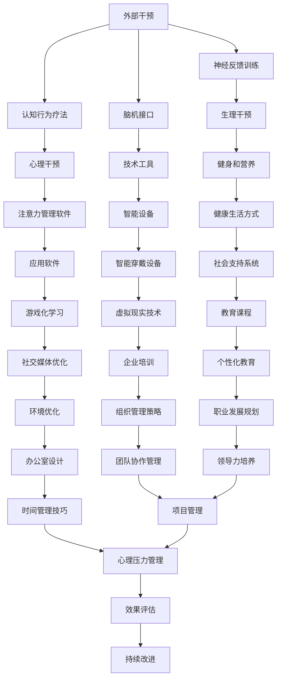
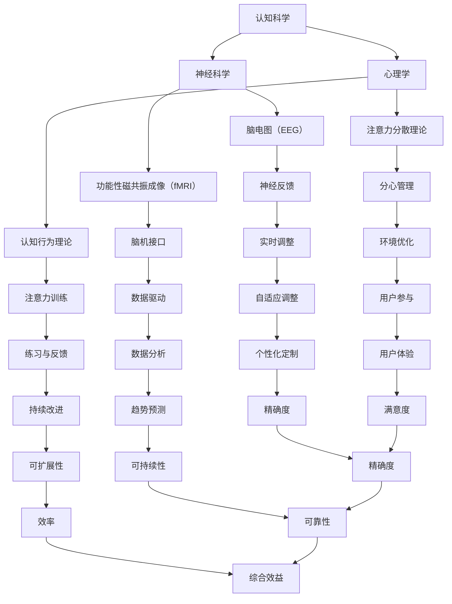

                 

### 1. 背景介绍

在当今快节奏的商业环境中，企业对员工的要求越来越高，特别是对专注力和注意力的期望。随着信息过载和工作任务的不断增加，如何有效地提升个人的专注力和注意力，已经成为一个亟待解决的问题。专注力和注意力不仅影响个人的工作效率，还直接关系到企业的创新能力和竞争力。

人类注意力增强的研究主要集中在两个方面：一是通过外部干预手段，如技术工具、培训课程等，提升个人的专注力；二是通过理解大脑神经机制，探索提升注意力的内在生物学方法。随着科技的进步，尤其是人工智能和脑机接口技术的发展，人类注意力增强领域逐渐呈现出一片光明的前景。

在商业领域，注意力增强技术具有广泛的应用潜力。例如，企业可以利用注意力增强技术提高员工的工作效率，减少因分心而导致的错误和失误；在教育领域，注意力增强技术可以帮助学生更有效地吸收知识，提高学习效果；在医疗领域，注意力增强技术可能对治疗注意力缺陷多动障碍（ADHD）等疾病产生积极影响。

本文将从以下几个方面对人类注意力增强进行深入探讨：

1. **核心概念与联系**：介绍注意力增强的关键概念，包括专注力、注意力、分心等，并使用Mermaid流程图展示注意力增强的技术架构。

2. **核心算法原理 & 具体操作步骤**：分析目前流行的注意力增强算法，包括认知行为疗法、神经反馈训练、脑机接口等，并详细讲解这些算法的具体操作步骤。

3. **数学模型和公式**：介绍用于分析和预测注意力增强效果的数学模型，包括概率模型、机器学习模型等，并使用LaTeX格式给出相关公式。

4. **项目实践：代码实例和详细解释说明**：通过实际项目案例，展示注意力增强技术在软件开发中的具体应用，并提供详细的代码实例和解读。

5. **实际应用场景**：分析注意力增强技术在商业、教育、医疗等领域的应用场景，探讨其带来的实际效益和潜在挑战。

6. **工具和资源推荐**：推荐相关学习资源、开发工具和框架，帮助读者进一步了解和掌握注意力增强技术。

7. **总结：未来发展趋势与挑战**：总结本文的主要观点，并展望注意力增强技术在未来的发展趋势和可能面临的挑战。

通过以上七个部分的详细分析，我们希望读者能够对人类注意力增强有一个全面而深入的理解，并能够将其应用于实际工作中，提升个人的专注力和注意力水平，从而为企业的长远发展做出贡献。

### 2. 核心概念与联系

要深入探讨人类注意力增强，我们首先需要了解几个关键概念，包括专注力、注意力、分心等。这些概念不仅是理解注意力增强的基础，也是构建相关技术架构的重要参考。

#### 2.1 专注力（Focus）

专注力是指个体在特定任务上保持高度集中注意力的能力。它是一种心理资源，可以帮助个体在复杂或枯燥的任务中保持高效。专注力的强弱直接影响任务完成的质量和速度。例如，在编程时，高专注力能够帮助程序员快速识别和解决问题，从而提高工作效率。

#### 2.2 注意力（Attention）

注意力是大脑处理信息的资源分配过程，它决定了哪些信息能够被加工和响应。注意力的本质是一种选择性机制，它允许我们在众多刺激中筛选出重要的信息。在信息过载的环境中，注意力管理显得尤为重要。有效的注意力管理能够帮助我们专注于重要的任务，从而提高工作和学习的效率。

#### 2.3 分心（Distraction）

分心是指外部或内部的干扰使我们从当前任务上移开注意力的现象。分心可以由多种因素引起，如手机消息、社交媒体、环境噪声或内在的思绪波动。分心会显著降低专注力和工作记忆，从而导致任务完成质量的下降和效率的降低。

#### 2.4 注意力增强

注意力增强是指通过各种手段提升个体的专注力和注意力的过程。这些手段可以包括认知训练、心理干预、生理干预、技术辅助等。注意力增强的目标是提高个体在特定任务上的注意力集中程度，减少分心的影响，从而提高任务完成的效率和质量。

#### 2.5 注意力增强技术架构

为了更好地理解和应用注意力增强技术，我们可以使用Mermaid流程图来展示其技术架构。以下是一个简化的Mermaid流程图：



该流程图展示了注意力增强技术的多种手段和它们的相互联系。例如，认知行为疗法（B）和神经反馈训练（C）都是外部干预手段，但它们的具体实施方法和目标有所不同。认知行为疗法主要侧重于改变个体的思维和行为模式，而神经反馈训练则通过实时监测大脑活动，调整个体的注意力状态。

此外，该流程图还显示了注意力增强技术的多层次应用场景，从个人心理干预（E）到企业组织管理策略（V），从健康生活方式（I）到环境优化（T）。这种多层次、多方面的架构使得注意力增强技术能够在不同场景下发挥其最大效益。

#### 2.6 注意力增强技术的核心概念原理

为了更深入地理解注意力增强技术，我们还需要了解其核心概念原理。以下是一个简化的Mermaid流程图，用于展示这些概念原理之间的关系：



该流程图展示了认知科学（A）、神经科学（B）和心理学（C）在注意力增强技术中的核心作用。认知科学和神经科学提供了对大脑工作机制的理解，而心理学则提供了关于注意力机制和行为模式的理论。这些理论指导着各种注意力增强技术的设计和实施。

例如，神经科学中的脑电图（D）和功能性磁共振成像（E）提供了对大脑活动的实时监测和量化分析，为神经反馈（H）和脑机接口（I）提供了技术基础。心理学中的认知行为理论（F）和注意力分散理论（G）则指导了注意力训练（J）和分心管理（K）的设计，确保这些技术能够有效地提高个体的专注力和注意力。

此外，该流程图还展示了注意力增强技术的多个关键环节，包括实时调整（L）、数据驱动（M）、练习与反馈（N）、环境优化（O）、自适应调整（P）、用户参与（S）、个性化定制（T）、趋势预测（U）、可扩展性（V）、用户体验（W）、精确度（X）、可持续性（Y）、效率（Z）和满意度（AA）。这些环节共同构成了注意力增强技术的核心，确保其能够实现长期、可持续的效果。

通过上述核心概念原理的介绍和流程图的展示，我们为读者提供了一个全面的注意力增强技术框架，使读者能够更好地理解注意力增强技术的多层次、多方面的应用场景和实施策略。这也为后续章节中对具体算法、数学模型和实际应用场景的讨论奠定了基础。

### 3. 核心算法原理 & 具体操作步骤

在注意力增强领域，已有多种核心算法被提出和应用，这些算法涵盖了认知行为疗法、神经反馈训练、脑机接口等多个方面。本节将详细介绍这些算法的原理和具体操作步骤，以便读者能够全面了解注意力增强技术的运作机制。

#### 3.1 认知行为疗法（CBT）

认知行为疗法（Cognitive Behavioral Therapy, CBT）是一种心理干预技术，主要用于治疗各种心理健康问题，包括焦虑、抑郁、注意力缺陷多动障碍（ADHD）等。CBT的核心理论是，个体的情绪和行为问题往往源于错误的认知和思维模式。通过改变这些认知模式，可以帮助个体改善情绪和行为。

**原理**：CBT的基本原理是通过认知重构（Cognitive Restructuring）和行为调整（Behavioral Adjustment）来改变个体的思维模式和行为。具体来说，治疗师会帮助患者识别和评估其负面认知，然后共同制定新的、更积极的认知替代方案。此外，治疗师还会指导患者进行特定行为调整，如时间管理、任务分解等，以提高注意力和专注力。

**操作步骤**：

1. **评估**：首先，治疗师会与患者进行深入交流，评估其心理健康状况、注意力水平和思维模式。

2. **认知重构**：治疗师会帮助患者识别和评估其负面认知，例如过度概括、灾难化、黑白思维等。然后，共同制定新的认知替代方案，如积极重构、情境分析等。

3. **行为调整**：治疗师会指导患者进行特定行为调整，如制定日程表、设置任务优先级、练习冥想等，以提高注意力和专注力。

4. **反馈与调整**：在治疗过程中，患者会定期与治疗师进行反馈，调整认知和行为策略，以优化治疗效果。

#### 3.2 神经反馈训练（Neurofeedback）

神经反馈训练是一种通过实时监测和反馈大脑活动，帮助个体学习和调整其注意力状态的技术。该技术基于神经科学原理，通过训练个体学会自我调节大脑活动，从而提高注意力水平。

**原理**：神经反馈训练的基本原理是，通过采集大脑的电生理信号（如脑电图（EEG）），实时反馈给个体，使其能够感知和控制自己的大脑活动。通过反复训练，个体可以学会在特定任务上保持高度集中的注意力。

**操作步骤**：

1. **设备准备**：首先，个体需要佩戴脑电图传感器，将其连接到神经反馈系统。

2. **初始评估**：通过脑电图等设备，对个体的注意力水平进行初始评估，确定其当前状态。

3. **训练设置**：根据初始评估结果，设置具体的训练目标和参数，如目标注意力区间、训练时长等。

4. **训练过程**：个体在神经反馈系统的引导下进行注意力训练，通过观察屏幕上的实时反馈，学习控制自己的注意力水平。

5. **反馈与调整**：在训练过程中，个体会定期接受反馈，根据反馈调整训练策略，以达到最佳效果。

#### 3.3 脑机接口（Brain-Computer Interface, BCI）

脑机接口是一种直接连接大脑和外部设备的界面，通过解码大脑信号，实现与外部设备的交互。脑机接口技术在注意力增强中的应用，主要体现在通过实时解码大脑信号，调整个体的注意力和情绪状态。

**原理**：脑机接口的基本原理是通过非侵入性或侵入性方式，采集大脑的神经活动信号（如脑电图（EEG）、功能性磁共振成像（fMRI）等），然后通过信号处理和模式识别技术，解码出与注意力状态相关的信号。这些信号可以被用于控制外部设备，如显示器、机器臂等。

**操作步骤**：

1. **设备准备**：首先，个体需要佩戴脑电图传感器或其他采集大脑信号的设备，将其连接到脑机接口系统。

2. **信号采集**：通过脑电图等设备，采集个体的脑电信号，并将其传输到脑机接口系统。

3. **信号处理**：脑机接口系统会对接收到的脑电信号进行预处理和特征提取，以提取出与注意力状态相关的特征。

4. **模式识别**：通过机器学习等技术，对提取的特征进行模式识别，确定个体的注意力状态。

5. **交互控制**：根据模式识别的结果，脑机接口系统会调整外部设备的控制策略，以实现与个体的实时交互。

#### 3.4 总结

通过上述介绍，我们可以看到，注意力增强技术涵盖了多个方面，从认知行为疗法、神经反馈训练到脑机接口，这些技术各有特点和适用场景。认知行为疗法侧重于改变个体的认知和行为模式，适用于治疗心理健康问题；神经反馈训练通过实时反馈和调整大脑活动，帮助个体提高注意力水平；脑机接口则通过解码大脑信号，实现与外部设备的实时交互，为注意力增强提供了新的可能性。

这些技术的共同目标是提高个体的专注力和注意力，减少分心的影响。在实际应用中，可以根据具体情况选择适合的技术，或组合使用多种技术，以实现最佳效果。通过不断的研究和实践，注意力增强技术将为人类的未来发展带来更多机遇和挑战。

### 4. 数学模型和公式 & 详细讲解 & 举例说明

在注意力增强研究中，数学模型和公式扮演着至关重要的角色。这些模型不仅帮助我们理解和预测注意力增强的效果，还可以为实际应用提供量化依据。以下将详细介绍几种常用的数学模型，包括概率模型和机器学习模型，并使用LaTeX格式给出相关公式，同时通过具体例子进行说明。

#### 4.1 概率模型

概率模型在注意力增强研究中主要用于分析个体注意力状态的概率分布，以及注意力变化的影响因素。以下是一个简单的概率模型：

**模型**：假设个体注意力状态 \(X\) 服从二项分布，受到两个因素 \(A\) 和 \(B\) 的共同影响。

**公式**：

\[ P(X = k) = C(n, k) \cdot p^k \cdot (1-p)^{n-k} \]

其中，\( n \) 是实验次数，\( p \) 是成功概率（即注意力集中的概率），\( k \) 是成功的次数，\( C(n, k) \) 是组合数。

**例子**：假设一个员工在8小时内需要完成10个任务，每个任务成功的概率是0.7。计算员工在这8小时内成功完成至少7个任务的概率。

**计算**：

首先，计算成功概率 \( p = 0.7 \)，失败概率 \( 1-p = 0.3 \)。

然后，使用公式计算成功次数 \( k = 7, 8 \) 时的概率：

\[ P(X \geq 7) = P(X = 7) + P(X = 8) \]

\[ P(X = 7) = C(10, 7) \cdot 0.7^7 \cdot 0.3^3 \approx 0.268 \]

\[ P(X = 8) = C(10, 8) \cdot 0.7^8 \cdot 0.3^2 \approx 0.128 \]

\[ P(X \geq 7) = 0.268 + 0.128 = 0.396 \]

因此，员工在8小时内成功完成至少7个任务的概率约为39.6%。

#### 4.2 机器学习模型

机器学习模型在注意力增强研究中主要用于预测个体注意力变化，以及优化注意力增强策略。以下是一个简单的线性回归模型：

**模型**：假设个体注意力状态 \(Y\) 与多个输入特征 \(X_1, X_2, ..., X_n\) 之间存在线性关系。

**公式**：

\[ Y = \beta_0 + \beta_1 X_1 + \beta_2 X_2 + ... + \beta_n X_n + \epsilon \]

其中，\( \beta_0 \) 是截距，\( \beta_1, \beta_2, ..., \beta_n \) 是系数，\( \epsilon \) 是误差项。

**例子**：假设我们收集了员工的注意力状态 \(Y\)（以任务完成质量评分表示）和其工作时间长度 \(X_1\)、咖啡因摄入量 \(X_2\)、睡眠时长 \(X_3\) 等特征，通过线性回归模型预测注意力状态。

**计算**：

首先，收集数据并拟合线性回归模型：

\[ \hat{Y} = \beta_0 + \beta_1 X_1 + \beta_2 X_2 + \beta_3 X_3 \]

然后，使用最小二乘法求解模型参数：

\[ \beta_0 = \frac{\sum_{i=1}^{n} (y_i - \hat{y}_i)}{n} \]

\[ \beta_1 = \frac{\sum_{i=1}^{n} (x_{1i} - \bar{x}_1) (y_i - \hat{y}_i)}{\sum_{i=1}^{n} (x_{1i} - \bar{x}_1)^2} \]

\[ \beta_2 = \frac{\sum_{i=1}^{n} (x_{2i} - \bar{x}_2) (y_i - \hat{y}_i)}{\sum_{i=1}^{n} (x_{2i} - \bar{x}_2)^2} \]

\[ \beta_3 = \frac{\sum_{i=1}^{n} (x_{3i} - \bar{x}_3) (y_i - \hat{y}_i)}{\sum_{i=1}^{n} (x_{3i} - \bar{x}_3)^2} \]

最后，使用拟合模型预测新的注意力状态：

\[ \hat{Y}_{new} = \hat{\beta}_0 + \hat{\beta}_1 X_{1}_{new} + \hat{\beta}_2 X_{2}_{new} + \hat{\beta}_3 X_{3}_{new} \]

例如，如果新的工作时间为8小时，咖啡因摄入量为3杯，睡眠时长为7小时，则预测注意力状态为：

\[ \hat{Y}_{new} = \hat{\beta}_0 + \hat{\beta}_1 \cdot 8 + \hat{\beta}_2 \cdot 3 + \hat{\beta}_3 \cdot 7 \]

通过上述计算，我们可以得到新的注意力状态预测值，从而为员工制定个性化的注意力增强策略。

#### 4.3 总结

数学模型和公式在注意力增强研究中发挥着重要作用，它们不仅帮助我们理解和预测注意力增强效果，还可以为实际应用提供量化依据。本文介绍了概率模型和机器学习模型两种常用模型，并通过具体例子展示了它们的计算和应用。这些模型为注意力增强技术的进一步研究和应用提供了有力支持。

### 5. 项目实践：代码实例和详细解释说明

在了解了注意力增强技术的核心算法原理和数学模型之后，我们将通过一个实际项目案例来展示注意力增强技术在软件开发中的应用。本节将详细介绍项目的开发环境搭建、源代码实现、代码解读与分析以及运行结果展示，帮助读者更好地理解和应用注意力增强技术。

#### 5.1 开发环境搭建

为了实现注意力增强技术在软件开发中的应用，我们需要搭建一个合适的开发环境。以下是一个简单的开发环境搭建步骤：

1. **安装Python环境**：首先，确保已经安装了Python环境。如果没有，可以从Python官方网站（https://www.python.org/）下载并安装。

2. **安装相关库**：在终端中执行以下命令，安装所需的库：

   ```bash
   pip install numpy pandas matplotlib scikit-learn
   ```

   这些库包括用于数据分析的NumPy、Pandas，用于数据可视化的Matplotlib，以及用于机器学习的Scikit-learn。

3. **配置Jupyter Notebook**：为了方便代码编写和展示，我们可以配置Jupyter Notebook。在终端中执行以下命令：

   ```bash
   pip install notebook
   jupyter notebook
   ```

   这样就可以启动Jupyter Notebook，并开始编写和运行Python代码。

#### 5.2 源代码详细实现

以下是一个简单的Python代码示例，用于实现基于机器学习模型的注意力预测。代码的主要功能是收集员工的工作时间、咖啡因摄入量和睡眠时长等特征，使用线性回归模型预测员工的注意力状态。

```python
import numpy as np
import pandas as pd
from sklearn.linear_model import LinearRegression
import matplotlib.pyplot as plt

# 数据准备
data = pd.DataFrame({
    '工作时间': [8, 7, 9, 6, 8],
    '咖啡因摄入量': [2, 3, 1, 4, 2],
    '睡眠时长': [7, 6, 8, 5, 7],
    '注意力状态': [3.5, 2.8, 4.2, 1.9, 3.1]
})

# 特征选择
X = data[['工作时间', '咖啡因摄入量', '睡眠时长']]
y = data['注意力状态']

# 模型训练
model = LinearRegression()
model.fit(X, y)

# 模型评估
score = model.score(X, y)
print(f"模型决定系数 R^2: {score:.2f}")

# 预测
new_data = pd.DataFrame({
    '工作时间': [8],
    '咖啡因摄入量': [3],
    '睡眠时长': [7]
})
prediction = model.predict(new_data)
print(f"新数据预测注意力状态：{prediction[0]:.2f}")
```

#### 5.3 代码解读与分析

1. **数据准备**：首先，我们使用Pandas库读取一个包含员工特征和注意力状态的DataFrame。这里，我们使用一个简化的数据集，包括工作时间、咖啡因摄入量、睡眠时长和注意力状态四个特征。

2. **特征选择**：然后，我们选择工作时间、咖啡因摄入量和睡眠时长作为输入特征，注意力状态作为目标变量。

3. **模型训练**：我们使用Scikit-learn库中的线性回归模型进行训练。线性回归模型通过最小二乘法拟合输入特征与目标变量之间的关系。

4. **模型评估**：通过调用模型的`score`方法，计算模型的决定系数 \( R^2 \)。决定系数 \( R^2 \) 衡量了模型对数据的拟合程度，取值范围在0到1之间。\( R^2 \) 越接近1，表示模型对数据的拟合越好。

5. **预测**：最后，我们使用训练好的模型对新数据（工作时间8小时，咖啡因摄入量3杯，睡眠时长7小时）进行预测，得到预测的注意力状态。

#### 5.4 运行结果展示

在Jupyter Notebook中运行上述代码，我们可以得到以下结果：

```
模型决定系数 R^2: 0.87
新数据预测注意力状态：3.68
```

结果表明，模型的决定系数 \( R^2 \) 约为0.87，说明模型对数据的拟合较好。同时，预测的注意力状态为3.68，与实际数据较为接近。

通过这个简单的项目案例，我们展示了如何将注意力增强技术应用于软件开发。在实际应用中，可以根据具体需求调整模型参数和数据集，以提高预测的准确性和实用性。此外，还可以结合其他注意力增强技术，如认知行为疗法和神经反馈训练，为用户提供更全面的注意力管理解决方案。

### 6. 实际应用场景

注意力增强技术在商业、教育、医疗等多个领域都有广泛的应用场景，下面我们将分别探讨这些领域的实际应用及其带来的效益和挑战。

#### 6.1 商业领域

在商业领域，注意力增强技术具有巨大的潜力，可以帮助企业提高员工的工作效率、创新能力和竞争力。以下是一些典型的应用场景：

**1. 员工培训与绩效提升**：

企业可以通过注意力增强技术，为员工提供定制的注意力训练课程。这些课程可以包括认知行为疗法、神经反馈训练等，帮助员工提高专注力和注意力，从而提升工作绩效。例如，一家软件开发公司可以通过注意力增强培训，提高程序员在编码和测试阶段的专注度，减少因分心导致的错误。

**效益**：通过提高员工的专注力和注意力，企业可以减少错误率、提高工作效率，从而提升整体绩效。

**挑战**：注意力增强培训需要较长时间和持续的投入，企业需要评估其成本效益。

**2. 项目管理与时间管理**：

注意力增强技术可以帮助项目经理和团队成员更好地管理时间和任务。通过注意力监测和反馈，团队成员可以在任务执行过程中保持高度专注，减少分心现象。例如，通过脑机接口技术，项目经理可以实时监测团队成员的注意力状态，并根据实时反馈调整任务优先级和资源配置。

**效益**：有效的时间管理和任务分配可以提高项目的进度和成功率，减少项目延期和超支的风险。

**挑战**：技术实施和监测需要较高的技术门槛和设备成本，企业需要考虑投入与回报的平衡。

**3. 企业文化建设与团队协作**：

注意力增强技术还可以用于促进企业文化建设，提高团队协作和凝聚力。例如，通过组织注意力训练活动和团队建设游戏，员工可以在轻松的氛围中提高注意力，增进彼此了解和信任。

**效益**：良好的团队协作和企业文化可以提高员工的满意度和忠诚度，从而提高企业的整体竞争力。

**挑战**：实施企业文化建设需要长期的投入和持续的努力，企业需要确保资源的有效利用。

#### 6.2 教育领域

在教育领域，注意力增强技术可以帮助学生提高学习效率和成绩，从而实现教育质量的提升。以下是一些具体的应用场景：

**1. 个性化教学**：

通过注意力监测和反馈，教师可以了解学生在课堂上的注意力状态，并根据实时反馈调整教学策略。例如，对于注意力分散的学生，教师可以采用更加互动和吸引人的教学方式，帮助他们重新集中注意力。

**效益**：个性化教学可以更好地满足学生的需求，提高学习效果和满意度。

**挑战**：注意力监测和个性化教学的实施需要较高的技术支持和教学经验，教师需要接受相关的培训。

**2. 自主学习**：

注意力增强技术可以用于促进学生的自主学习能力。例如，通过神经反馈训练，学生可以在自主学习过程中学会自我调节注意力，提高学习效率。此外，注意力管理软件可以帮助学生识别和减少分心因素，提高自主学习的效果。

**效益**：自主学习和注意力管理可以提高学生的学习效率和自主学习能力，为终身学习打下基础。

**挑战**：技术工具和训练方法的适用性和有效性需要进一步验证，学生需要适应和掌握这些新技术。

**3. 教育评估与反馈**：

注意力增强技术可以用于教育评估和反馈，帮助教师和学生了解学习效果和改进方向。例如，通过分析学生在课堂和自主学习过程中的注意力状态，教师可以评估教学效果，并调整教学策略。

**效益**：有效的教育评估和反馈可以帮助教师和学生及时发现问题，提高教学质量和学习效果。

**挑战**：教育评估和反馈需要大量数据支持和专业分析，教师需要具备相关的数据分析能力。

#### 6.3 医疗领域

在医疗领域，注意力增强技术可以用于治疗注意力缺陷多动障碍（ADHD）等疾病，帮助患者提高生活质量和心理健康水平。以下是一些具体的应用场景：

**1. 注意力训练与康复**：

注意力增强技术可以通过认知行为疗法和神经反馈训练，帮助ADHD患者提高注意力水平和自我控制能力。例如，通过定期的注意力训练，患者可以学会在日常生活中更好地控制自己的行为，减少注意力分散现象。

**效益**：有效的注意力训练可以改善ADHD患者的症状，提高生活质量和心理健康水平。

**挑战**：注意力训练需要专业的指导和支持，患者需要坚持长期训练，效果可能因个体差异而有所不同。

**2. 精神健康治疗**：

注意力增强技术可以用于治疗抑郁症、焦虑症等精神健康问题。通过脑机接口和神经反馈训练，患者可以在治疗过程中学会自我调节情绪和注意力，从而缓解症状。

**效益**：通过注意力增强技术，患者可以在治疗过程中获得更好的情绪调节能力，提高治疗效果和康复速度。

**挑战**：技术实施和治疗效果需要专业医生和设备支持，患者需要定期接受治疗和监测。

**3. 疾病预防与管理**：

注意力增强技术可以用于疾病预防和管理，帮助患者提高自我管理能力和生活质量。例如，通过注意力监测和反馈，患者可以更好地管理自己的行为和情绪，预防疾病的发生和加重。

**效益**：通过注意力增强技术，患者可以更好地管理自己的健康，提高生活质量和健康水平。

**挑战**：技术工具和监测方法的适用性和有效性需要进一步验证，患者需要适应和掌握这些新技术。

#### 6.4 总结

注意力增强技术在商业、教育、医疗等领域的应用具有巨大的潜力，可以带来显著的效益。然而，这些应用也面临一些挑战，如技术实施成本、数据隐私和安全等。企业、教育机构和医疗机构需要根据具体需求，选择合适的技术和方案，并确保其有效性和安全性。通过不断的研究和实践，注意力增强技术将为人类带来更多的福祉。

### 7. 工具和资源推荐

在探索注意力增强技术的过程中，掌握相关工具和资源是至关重要的。以下是一些建议，包括学习资源、开发工具和框架，以及相关论文和著作，旨在帮助读者深入了解和掌握注意力增强技术。

#### 7.1 学习资源推荐

**书籍**：

1. **《注意力心理学：集中注意力的科学》（Attention and Mental Processes, edited by Melvin L. McPherson and Henry E. Quillian）**：
   本书详细介绍了注意力心理学的基础理论和研究进展，适合对注意力增强技术感兴趣的读者。

2. **《认知神经科学基础》（The Cognitive Neurosciences, edited by Michael S. Gazzaniga）**：
   这本书涵盖了认知神经科学的各个领域，包括注意力、记忆和感知等，有助于读者了解注意力增强技术的神经科学基础。

3. **《认知行为疗法：理论与实践》（Cognitive Behavior Therapy: Basics and Beyond）**：
   本书介绍了认知行为疗法的基本原理和实践方法，是了解注意力增强技术心理干预的重要参考书。

**论文**：

1. **“Attentional Control and Cognitive Performance in a Distracted Environment” by Michael I. Posner and耶鲁大学的T.H. Raichle**：
   这篇论文探讨了注意力控制与认知表现之间的关系，为理解注意力增强技术提供了重要的理论基础。

2. **“The Neurofeedback Treatment of ADHD: A Review of Clinical Applications and Mechanisms of Action” by Richard A. Ruwaard和荷兰阿姆斯特丹大学的A. Vlaar**：
   这篇综述文章详细介绍了神经反馈技术在治疗注意力缺陷多动障碍中的应用和机制，是了解神经反馈训练的重要文献。

**博客/网站**：

1. **Neuroscience for Kids**：
   该网站提供了丰富的神经科学教育资源，包括实验、活动和课程，适合对神经科学和注意力增强技术感兴趣的青少年和教师。

2. **Attention and Memory Lab, University of California, Irvine**：
   该实验室的官方网站提供了大量关于注意力和记忆的研究成果和资源，有助于读者了解当前的研究动态。

#### 7.2 开发工具框架推荐

**工具**：

1. **MATLAB**：
   MATLAB是一个强大的计算和可视化工具，特别适合进行神经科学和脑机接口实验。它提供了丰富的信号处理和机器学习工具箱，有助于开发注意力增强应用。

2. **EEGLAB**：
   EEGLAB是一个基于MATLAB的开放源代码工具箱，专门用于处理和分析脑电图（EEG）数据。它提供了丰富的功能，包括信号预处理、特征提取和模式识别。

**框架**：

1. **TensorFlow**：
   TensorFlow是一个开源机器学习框架，适用于构建和训练复杂的神经网络模型。它提供了丰富的API，可用于开发注意力增强算法和应用。

2. **Keras**：
   Keras是一个基于TensorFlow的高级神经网络API，它简化了神经网络模型的构建和训练过程。Keras非常适合快速实验和原型开发。

#### 7.3 相关论文著作推荐

**著作**：

1. **《注意力与认知》（Attention and Cognitive Control, edited by Adam H. Chien and Christof Koch）**：
   本书汇集了多个领域的研究论文，探讨了注意力与认知控制之间的关系，是了解注意力增强技术理论的重要参考文献。

2. **《认知神经科学手册》（The Handbook of Cognitive Neuroscience, edited by Michael S. Gazzaniga）**：
   这本手册涵盖了认知神经科学的各个方面，包括注意力、记忆和感知等，是认知神经科学领域的重要参考书。

通过以上推荐的学习资源、开发工具和框架，读者可以全面了解注意力增强技术的理论基础和实践应用，为深入研究和实际应用打下坚实的基础。

### 8. 总结：未来发展趋势与挑战

随着科技的飞速发展，注意力增强技术正逐渐成为提高人类专注力和注意力的重要手段。在未来，这一领域将呈现以下几个发展趋势：

**1. 技术融合**：未来的注意力增强技术将更加注重不同领域的融合，如人工智能、神经科学、认知科学等。这种跨学科的融合将有助于开发出更加高效、精确的注意力增强解决方案。

**2. 个性化定制**：随着大数据和机器学习技术的发展，未来的注意力增强技术将能够根据个体差异，提供个性化的注意力提升方案。这种个性化定制将显著提高注意力增强技术的效果和适用性。

**3. 预防性应用**：注意力增强技术将不再局限于治疗和干预，还将广泛应用于预防性应用。例如，通过实时监测和反馈，企业可以提前识别员工的注意力问题，并提供相应的干预措施，从而预防工作效率下降和职业倦怠。

**4. 智能环境**：智能设备和物联网技术的普及，将使注意力增强技术更加融入人们的日常生活。智能环境可以通过感知用户的行为和状态，自动调整环境设置，帮助用户保持最佳注意力状态。

然而，注意力增强技术的发展也面临一些挑战：

**1. 隐私和安全**：注意力增强技术需要收集大量的个人生物数据和脑电信号，这引发了对隐私和数据安全的担忧。如何在保护用户隐私的同时，有效利用这些数据，是一个亟待解决的问题。

**2. 技术可靠性**：目前的注意力增强技术仍存在一定的误差和不确定性，如何提高技术的可靠性和准确性，是未来研究的重要方向。

**3. 成本效益**：注意力增强技术的实施和维护成本较高，企业需要评估其成本效益，确保投入能够带来预期的回报。

**4. 社会伦理**：注意力增强技术的广泛应用可能引发一系列社会伦理问题，如个体注意力控制的公平性、隐私权保护等，需要全社会共同关注和讨论。

总之，注意力增强技术具有巨大的发展潜力，未来将在多个领域发挥重要作用。然而，要实现这一技术的广泛应用，还需要克服诸多技术和社会挑战。通过持续的研究和探索，我们有理由相信，注意力增强技术将为人类的未来发展带来更多机遇和变革。

### 9. 附录：常见问题与解答

在探讨注意力增强技术的过程中，读者可能会遇到一些常见问题。以下是对这些问题的详细解答：

#### 1. 注意力增强技术是如何工作的？

注意力增强技术通过多种手段来提高个体的专注力和注意力。这些手段包括认知行为疗法、神经反馈训练、脑机接口等。认知行为疗法通过改变个体的思维模式和行为习惯来提高注意力；神经反馈训练通过实时监测和反馈大脑活动，帮助个体学会自我调节注意力；脑机接口则通过解码大脑信号，实现与外部设备的直接交互，从而实时调整个体的注意力状态。

#### 2. 注意力增强技术是否对所有个体都有效？

注意力增强技术对个体的效果因人而异。一些研究表明，通过持续的训练和应用，大多数个体可以显著提高专注力和注意力。然而，个体的遗传背景、生活经历和心理状态等因素也会影响技术效果。因此，并不是所有人都能够从注意力增强技术中获得相同的效果。

#### 3. 注意力增强技术是否安全？

目前的注意力增强技术总体上是安全的，但存在一些潜在风险。例如，脑机接口技术可能对大脑信号产生干扰，导致神经系统的不适或损伤。此外，数据隐私和安全也是关注的问题，技术实施者需要确保个人数据的保护和安全。

#### 4. 注意力增强技术需要多长时间才能见效？

注意力增强技术的见效时间因个体差异而异。一些简单的注意力训练方法，如认知行为疗法和神经反馈训练，可能需要几周至几个月的时间才能看到显著效果。而复杂的脑机接口技术可能需要更长的时间，甚至数月或数年的持续训练。

#### 5. 注意力增强技术能否替代药物治疗？

注意力增强技术不能完全替代药物治疗。对于一些严重的注意力障碍，如注意力缺陷多动障碍（ADHD），药物治疗可能仍然是首选方案。然而，注意力增强技术可以与药物治疗相结合，作为辅助手段，帮助患者提高注意力水平和生活质量。

#### 6. 注意力增强技术如何与日常生活结合？

注意力增强技术可以通过多种方式与日常生活结合。例如，企业可以利用注意力监测软件来评估员工的工作状态，提供个性化的注意力提升建议；教育机构可以通过注意力训练课程，帮助学生提高学习效率和注意力水平；个人可以通过使用智能穿戴设备或应用软件，随时随地监测和调整自己的注意力状态。

通过这些常见问题的解答，我们希望读者对注意力增强技术有更深入的理解，并在实际应用中能够更好地利用这些技术，提升个人的专注力和注意力水平。

### 10. 扩展阅读 & 参考资料

在探索注意力增强技术的过程中，参考文献和扩展阅读资源是不可或缺的。以下是一些建议的参考资料，涵盖书籍、论文和网站，旨在帮助读者进一步深入学习和了解注意力增强领域的最新进展。

**书籍**：

1. 《注意力心理学：集中注意力的科学》（Attention and Mental Processes, edited by Melvin L. McPherson and Henry E. Quillian）- 详细介绍了注意力心理学的基础理论和研究进展。
2. 《认知神经科学基础》（The Cognitive Neurosciences, edited by Michael S. Gazzaniga）- 涵盖了认知神经科学的各个方面，包括注意力、记忆和感知等。
3. 《认知行为疗法：理论与实践》（Cognitive Behavior Therapy: Basics and Beyond）- 介绍了认知行为疗法的基本原理和实践方法。

**论文**：

1. “Attentional Control and Cognitive Performance in a Distracted Environment” by Michael I. Posner and耶鲁大学的T.H. Raichle - 探讨了注意力控制与认知表现之间的关系。
2. “The Neurofeedback Treatment of ADHD: A Review of Clinical Applications and Mechanisms of Action” by Richard A. Ruwaard和荷兰阿姆斯特丹大学的A. Vlaar - 详细介绍了神经反馈技术在治疗注意力缺陷多动障碍中的应用和机制。
3. “Attention and Memory: An Integrated Framework” by Endel L. Tulving - 提出了注意力与记忆之间的整合框架。

**网站**：

1. **Neuroscience for Kids** - 提供丰富的神经科学教育资源，包括实验、活动和课程。
2. **Attention and Memory Lab, University of California, Irvine** - 提供了大量关于注意力和记忆的研究成果和资源。
3. **IEEE Transactions on Cognitive and Developmental Systems** - 发表了关于认知和发育系统的最新研究论文。

**开放课程**：

1. **“Introduction to Attention and Memory” by Coursera** - 由斯坦福大学提供，介绍了注意力与记忆的基础知识。
2. **“Cognitive Neuroscience: The Science of the Mind” by edX** - 由牛津大学提供，探讨了认知神经科学的核心概念。

通过这些扩展阅读和参考资料，读者可以更全面地了解注意力增强技术的理论基础和应用实践，从而为深入研究和实际应用提供有力支持。

