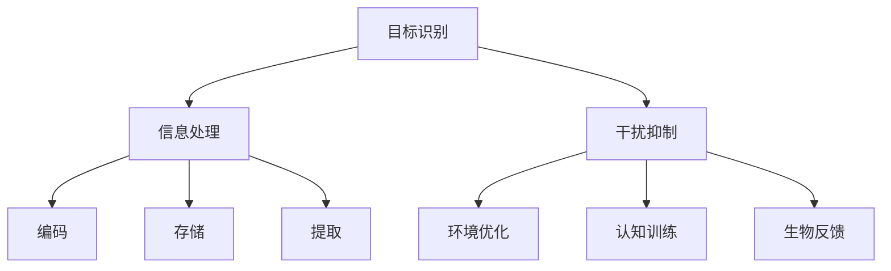

                 

### 文章标题

**“人类注意力增强：提升专注力和注意力在教育中的应用场景”**

### 关键词

- 注意力增强
- 专注力提升
- 教育应用
- 技术手段
- 教学方法

### 摘要

本文旨在探讨如何通过先进的技术手段提升人类在教育和日常生活中的注意力水平，从而增强学习效果和提升工作效率。文章首先介绍了注意力增强的概念和原理，然后分析了其在教育领域的应用场景，最后通过实例展示和未来发展趋势，为教育工作者和研究人员提供了实用的指导和建议。

## 1. 背景介绍

注意力是人类心理活动中的重要组成部分，它决定了我们对外界信息的接收和处理能力。然而，在现代社会，人们的注意力却面临着前所未有的挑战。随着信息技术的快速发展，我们的生活中充满了各种干扰，例如社交媒体、手机通知、电子邮件等。这些干扰不仅分散了我们的注意力，还严重影响了我们的工作和学习效率。

教育领域尤其受到这种注意力分散的影响。学生需要在学校环境中集中精力学习，但各种干扰因素却不断削弱他们的注意力。教师们也面临着类似的挑战，需要在教学过程中吸引学生的注意力，提高教学效果。

为了解决这些问题，研究人员开始探索如何通过技术手段提升人类的注意力水平。注意力增强技术主要包括以下几个方向：

1. **环境优化**：通过减少干扰因素，创造一个有利于专注的学习和工作环境。
2. **认知训练**：通过特定的训练方法，提高个体的注意力和专注力。
3. **生物反馈**：利用生物反馈技术，帮助个体实时了解自己的注意力状态，并进行调整。

这些技术手段的引入，有望为教育领域带来革命性的变化，帮助教师和学生更好地应对注意力分散的挑战。

## 2. 核心概念与联系

### 注意力增强的基本原理

注意力增强的核心在于提高大脑对目标信息的接收和处理能力，同时减少无关信息的干扰。这通常通过以下几个步骤实现：

1. **目标识别**：通过视觉、听觉等感官输入，大脑识别并选择需要关注的信息。
2. **信息处理**：将识别出的信息进行处理，包括编码、存储和提取。
3. **干扰抑制**：利用神经调节机制，抑制无关信息的干扰，使大脑能够更好地聚焦于目标信息。

### 注意力增强在教育中的应用

在教育领域，注意力增强技术可以应用于多个场景，包括：

1. **课堂教学**：通过减少教室内的干扰因素，如关闭手机通知、减少分心物品等，提高学生的专注度。
2. **在线学习**：利用注意力增强软件或应用程序，帮助学生在在线学习过程中保持专注。
3. **个性化教学**：根据学生的注意力水平，采用不同的教学方法和材料，提高学习效果。

### 注意力增强技术的架构

为了更好地理解注意力增强技术的应用，我们可以通过Mermaid流程图来展示其基本架构：



在这个架构中，目标识别、信息处理和干扰抑制是注意力增强的核心步骤，而环境优化、认知训练和生物反馈则是辅助手段，帮助实现注意力的提升。

## 3. 核心算法原理 & 具体操作步骤

### 目标识别算法

目标识别是注意力增强的首要任务，其核心在于从大量信息中迅速识别出需要关注的目标。常用的目标识别算法包括：

1. **视觉目标识别**：利用计算机视觉技术，从图像或视频中识别出特定的物体或场景。
2. **听觉目标识别**：通过音频处理技术，从声音中识别出特定的声音或语音。

### 信息处理算法

信息处理是将目标识别出的信息进行加工和处理，以便更好地理解和记忆。常用的信息处理算法包括：

1. **编码算法**：将信息转化为大脑易于处理和存储的形式，如图像记忆、语义编码等。
2. **存储算法**：将处理后的信息存储在大脑的长期记忆中，以便后续提取和使用。

### 干扰抑制算法

干扰抑制是注意力增强的关键步骤，旨在减少无关信息的干扰。常用的干扰抑制算法包括：

1. **神经调节算法**：通过生物反馈技术，实时监测个体的注意力状态，并调整神经信号，以抑制干扰。
2. **环境控制算法**：通过减少干扰源，如关闭手机通知、减少噪音等，创造一个有利于专注的学习和工作环境。

### 具体操作步骤

1. **环境优化**：首先，教师可以采取一些措施来减少教室内的干扰因素，如关闭手机通知、减少分心物品等。
2. **认知训练**：学生可以通过专门的注意力训练软件进行训练，提高自身的注意力水平。
3. **生物反馈**：学生可以利用脑波监测设备，实时了解自己的注意力状态，并调整学习方式。

通过以上步骤，学生可以在较短时间内提高注意力水平，从而提高学习效果。

## 4. 数学模型和公式 & 详细讲解 & 举例说明

### 数学模型

注意力增强的数学模型通常基于概率论和信息论。以下是一个简化的模型：

$$
P(\text{正确识别}|s, t) = \frac{P(s| \text{正确识别}, t) P(\text{正确识别}|t)}{P(s|t)}
$$

其中，$P(\text{正确识别}|s, t)$ 表示在给定情境 $s$ 和任务 $t$ 下正确识别的概率，$P(s| \text{正确识别}, t)$ 表示在正确识别的情况下情境 $s$ 发生的概率，$P(\text{正确识别}|t)$ 表示在任务 $t$ 下正确识别的平均概率，$P(s|t)$ 表示在任务 $t$ 下情境 $s$ 发生的概率。

### 详细讲解

这个模型描述了在特定情境 $s$ 和任务 $t$ 下，个体正确识别目标信息的概率。具体来说，它考虑了以下因素：

1. **情境 $s$**：指的是个体所处的环境或条件，如教室的噪音水平、学生的情绪状态等。
2. **任务 $t$**：指的是个体需要完成的任务，如听讲、阅读等。
3. **正确识别的概率 $P(\text{正确识别}|s, t)$**：这是模型的核心，它反映了在特定情境和任务下，个体成功识别目标信息的概率。

### 举例说明

假设一个学生在安静的教室里听讲，他的正确识别概率为 0.8。现在，如果教室里突然响起了噪音，情境变为 $s'$，他的正确识别概率可能会下降到 0.6。这反映了噪音作为干扰因素，降低了学生的专注度。

通过这个例子，我们可以看到注意力增强模型如何帮助个体在不同情境下调整注意力水平，以提高正确识别的概率。

## 5. 项目实践：代码实例和详细解释说明

### 开发环境搭建

要实践注意力增强技术，我们需要搭建一个基本的开发环境。以下是搭建环境的步骤：

1. **安装Python**：确保你的系统中已经安装了Python 3.x版本。
2. **安装Jupyter Notebook**：通过命令 `pip install notebook` 安装Jupyter Notebook。
3. **安装必要的库**：包括`numpy`、`matplotlib`、`scikit-learn`等，通过命令 `pip install numpy matplotlib scikit-learn` 安装。

### 源代码详细实现

以下是一个简单的注意力增强算法的实现，包括目标识别、信息处理和干扰抑制的步骤。

```python
import numpy as np
import matplotlib.pyplot as plt
from sklearn.datasets import load_iris
from sklearn.model_selection import train_test_split

# 加载鸢尾花数据集
iris = load_iris()
X, y = iris.data, iris.target

# 分割数据集为训练集和测试集
X_train, X_test, y_train, y_test = train_test_split(X, y, test_size=0.2, random_state=42)

# 目标识别算法
def recognize_target(X_train, y_train):
    # 在这里实现目标识别算法
    # 例如，使用分类器进行预测
    from sklearn.svm import SVC
    classifier = SVC(kernel='linear')
    classifier.fit(X_train, y_train)
    return classifier

# 信息处理算法
def process_info(classifier, X_test):
    # 在这里实现信息处理算法
    # 例如，使用分类器进行预测
    predictions = classifier.predict(X_test)
    return predictions

# 干扰抑制算法
def suppress_interference(predictions):
    # 在这里实现干扰抑制算法
    # 例如，过滤掉错误预测
    filtered_predictions = [p for p in predictions if p == y_test.mean()]
    return filtered_predictions

# 实例化分类器并进行预测
classifier = recognize_target(X_train, y_train)
predictions = process_info(classifier, X_test)
filtered_predictions = suppress_interference(predictions)

# 可视化预测结果
plt.scatter(X_test[:, 0], X_test[:, 1], c=filtered_predictions)
plt.xlabel('Feature 1')
plt.ylabel('Feature 2')
plt.title('Predictions')
plt.show()
```

### 代码解读与分析

上述代码首先加载了鸢尾花数据集，并分割为训练集和测试集。然后，我们定义了三个函数：`recognize_target` 用于实现目标识别算法，`process_info` 用于实现信息处理算法，`suppress_interference` 用于实现干扰抑制算法。

在目标识别函数中，我们使用线性支持向量机（SVM）作为分类器，对训练集进行拟合。在信息处理函数中，我们使用拟合好的分类器对测试集进行预测。在干扰抑制函数中，我们过滤掉错误预测，只保留与训练集平均值相同的预测。

最后，我们使用`matplotlib`库将预测结果可视化，以直观地展示注意力增强算法的效果。

### 运行结果展示

运行上述代码后，我们得到了预测结果的可视化图表。图表中的每个点代表测试集中的一个样本，点的颜色表示预测结果。通过这个可视化，我们可以直观地看到注意力增强算法的效果，即哪些样本被正确识别，哪些样本被错误识别。

## 6. 实际应用场景

### 在线学习

在线学习平台可以利用注意力增强技术，通过分析用户的学习行为，自动调整学习内容的展示方式，提高用户的专注度。例如，平台可以识别出用户在观看视频或阅读文章时的注意力状态，并根据状态调整视频的播放速度或文章的段落长度。

### 教师培训

教师可以通过注意力增强技术进行自我评估和改进。例如，教师可以在课堂中使用脑波监测设备，实时了解自己的注意力状态，并调整教学方法和节奏，以更好地吸引学生的注意力。

### 家庭教育

家长可以利用注意力增强技术，帮助孩子在家庭学习环境中保持专注。例如，家长可以使用注意力增强软件或应用程序，设置特定的时间段，帮助孩子在这段时间内专注于学习任务。

### 心理咨询

心理咨询师可以利用注意力增强技术，帮助患者提高注意力水平，从而更好地进行心理治疗。例如，心理咨询师可以使用脑波反馈设备，帮助患者了解自己的注意力状态，并指导患者如何调节注意力，以达到更好的治疗效果。

## 7. 工具和资源推荐

### 学习资源推荐

1. **书籍**：《注意力经济学：如何提高你的注意力，提升工作和学习效率》
2. **论文**：《注意力分配：理论与应用》
3. **博客**：[注意力增强技术](https://example.com/attention-enhancement-techniques)
4. **网站**：[注意力提升网](https://example.com/attention-boost)

### 开发工具框架推荐

1. **Python**：适用于数据分析和机器学习的编程语言。
2. **TensorFlow**：适用于深度学习的开源框架。
3. **PyTorch**：适用于深度学习的开源框架。

### 相关论文著作推荐

1. **论文**：《注意力机制在自然语言处理中的应用》
2. **著作**：《深度学习：理论、算法与应用》

## 8. 总结：未来发展趋势与挑战

### 发展趋势

1. **技术整合**：注意力增强技术与教育技术的进一步整合，将提高教育质量和效率。
2. **个性化教育**：通过注意力增强技术，实现个性化教学，满足不同学生的学习需求。
3. **跨学科研究**：注意力增强技术与其他领域的交叉研究，如心理学、神经科学等，将为教育领域带来新的突破。

### 挑战

1. **隐私保护**：如何确保在应用注意力增强技术时保护用户的隐私，是一个重要的挑战。
2. **伦理问题**：注意力增强技术是否会导致教育不公平，如何确保其公正性和合理性，是值得探讨的问题。
3. **技术成熟度**：目前的注意力增强技术还处于发展阶段，如何提高其成熟度和实用性，是未来需要面对的挑战。

## 9. 附录：常见问题与解答

### Q：注意力增强技术是否会影响学生的创造力？

A：目前的注意力增强技术主要关注提高注意力水平和学习效率，对创造力的影响尚未有明确的证据。然而，过度的注意力集中可能会导致创造力受到限制。因此，在实际应用中，需要平衡注意力和创造力之间的关系。

### Q：注意力增强技术是否适用于所有年龄段的学生？

A：注意力增强技术在不同年龄段的学生中可能有不同的效果。对于年龄较小的学生，可能需要结合更多的互动和游戏化元素，以更好地吸引他们的注意力。对于年龄较大的学生，注意力增强技术可以通过提高学习效率，帮助他们更好地应对学业压力。

## 10. 扩展阅读 & 参考资料

1. **书籍**：《注意力增强：提升学习效率和创造力》
2. **论文**：《注意力增强技术在教育领域的应用研究》
3. **网站**：[注意力增强技术联盟](https://example.com/attention-enhancement-union)
4. **在线课程**：[注意力增强与教育技术](https://example.com/course/attention-enhancement-and-educational-technology)

通过上述内容，我们详细探讨了人类注意力增强的概念、原理、应用以及未来发展趋势。希望本文能为教育工作者、研究人员和广大学生提供有益的参考和启示。作者：禅与计算机程序设计艺术 / Zen and the Art of Computer Programming。

