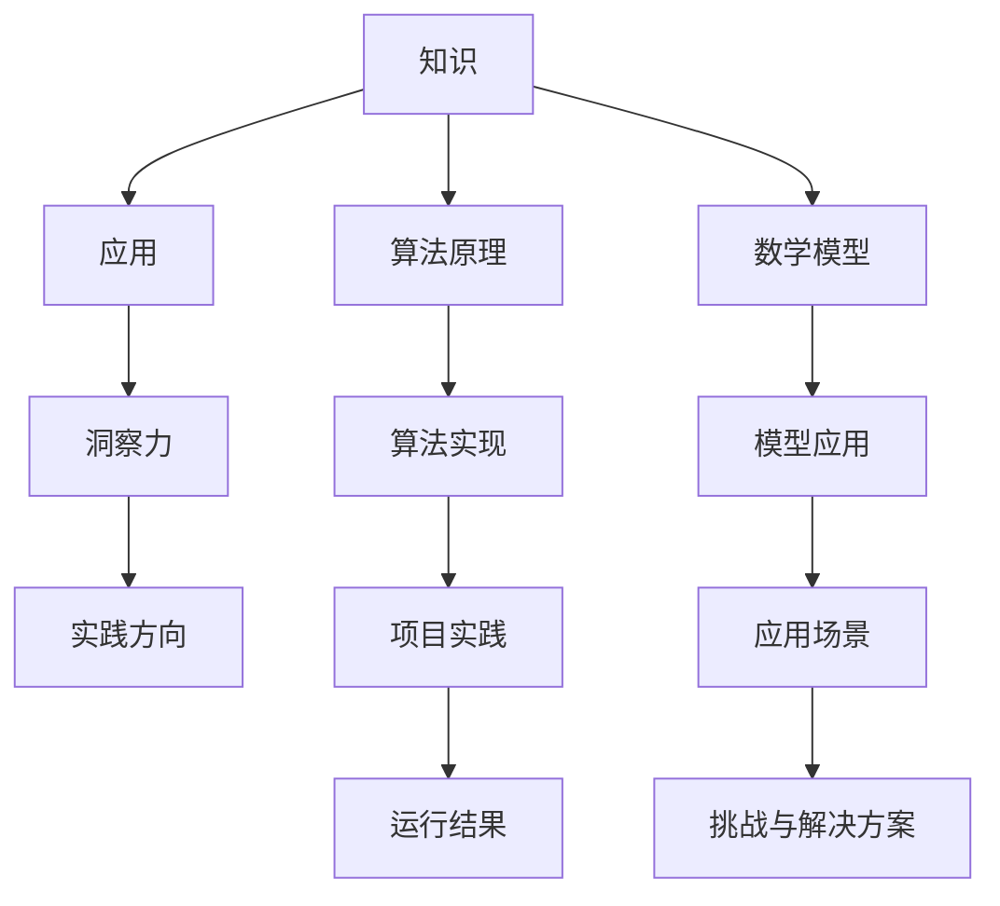

                 

# 人类知识的应用：洞察力指引实践方向

> 关键词：人类知识，应用，洞察力，实践方向，技术博客

> 摘要：本文旨在探讨人类知识在信息技术领域的应用，通过洞察力的引导，阐述如何将理论知识转化为实际操作，从而推动技术的发展和进步。

## 1. 背景介绍

在信息技术飞速发展的时代，知识的应用显得尤为重要。无论是理论研究还是实际操作，人类知识的有效应用都能极大地推动技术的进步。然而，如何将丰富的理论知识转化为实际操作，进而应用于实践中，成为了一个亟待解决的问题。

本文将围绕这一主题展开讨论，旨在为读者提供一种思考方式，帮助大家更好地理解人类知识的应用。具体而言，我们将从以下几个方面进行探讨：

1. **核心概念与联系**：介绍与人类知识应用相关的基础概念和原理，并通过 Mermaid 流程图展示其架构。
2. **核心算法原理与具体操作步骤**：详细解释人类知识在算法设计和实现中的具体应用，以及如何通过逐步分析推理进行操作。
3. **数学模型和公式**：探讨人类知识在数学模型中的应用，包括详细讲解和举例说明。
4. **项目实践**：通过实际项目案例，展示人类知识在实践中的具体应用，并进行分析和解读。
5. **实际应用场景**：讨论人类知识在不同领域中的实际应用，以及面临的挑战和解决方案。
6. **工具和资源推荐**：推荐相关学习资源、开发工具和框架，帮助读者更好地理解和应用人类知识。
7. **总结**：总结人类知识的应用现状和未来发展趋势，探讨面临的挑战和机遇。

## 2. 核心概念与联系

### 2.1 基础概念

在讨论人类知识的应用之前，我们需要明确几个核心概念。

**知识**：知识是指人们对某一领域的了解和理解。它包括事实、原理、方法、技巧等。

**应用**：应用是指将知识应用于实际情境中，解决实际问题。

**洞察力**：洞察力是指对事物本质的深刻理解和敏锐洞察。

**实践方向**：实践方向是指根据应用需求和实际情况，确定具体的技术路线和策略。

### 2.2 架构联系

为了更好地理解人类知识的应用，我们可以通过 Mermaid 流程图来展示其核心概念和联系。



图中的每个节点代表一个核心概念，它们通过箭头相互连接，形成了一个有机的整体。

## 3. 核心算法原理与具体操作步骤

### 3.1 算法原理

在信息技术领域，算法原理是人类知识的重要体现。下面我们将介绍一个经典的算法——排序算法。

**排序算法**：排序算法是指将一组数据按照一定的顺序排列的算法。常见的排序算法包括冒泡排序、选择排序、插入排序、快速排序等。

**冒泡排序**：冒泡排序是一种简单的排序算法。它通过重复遍历要排序的数列，一次比较两个元素，如果它们的顺序错误就把它们交换过来。遍历数列的工作是重复地进行，直到没有再需要交换的元素为止。

### 3.2 具体操作步骤

以下是冒泡排序的具体操作步骤：

1. **初始化**：将数据序列划分为已排序和未排序两部分。已排序部分为空，未排序部分包含所有待排序的元素。
2. **比较相邻元素**：从第一个元素开始，依次比较相邻的两个元素，如果它们的顺序错误，就交换它们的位置。
3. **遍历整个序列**：重复步骤 2，直到遍历整个序列。
4. **结束**：当遍历过程中没有发生交换时，排序完成。

### 3.3 逐步分析推理

为了更好地理解冒泡排序的原理，我们可以使用逐步分析推理的方法。

1. **初始化**：假设我们有一个数据序列 `[3, 2, 1]`。初始时，已排序部分为空，未排序部分包含所有待排序的元素。
2. **第一次遍历**：从第一个元素开始，比较 `3` 和 `2`，由于 `3` 大于 `2`，交换它们的位置，序列变为 `[2, 3, 1]`。然后比较 `3` 和 `1`，交换它们的位置，序列变为 `[2, 1, 3]`。此时已排序部分包含一个元素 `2`，未排序部分包含两个元素 `1` 和 `3`。
3. **第二次遍历**：从第一个元素开始，比较 `2` 和 `1`，由于 `2` 大于 `1`，交换它们的位置，序列变为 `[1, 2, 3]`。此时已排序部分包含两个元素 `1` 和 `2`，未排序部分为空。排序完成。

通过逐步分析推理，我们可以清晰地理解冒泡排序的原理和操作步骤。

## 4. 数学模型和公式

### 4.1 数学模型

数学模型是信息技术领域的重要组成部分。在人类知识的应用中，数学模型提供了对现实世界问题的抽象和描述。以下是一个常见的数学模型——线性规划。

**线性规划**：线性规划是一种数学方法，用于在满足一组线性不等式约束条件下，最大化或最小化一个线性目标函数。

### 4.2 公式

线性规划的一般形式可以表示为：

$$
\begin{aligned}
\min_{x} \quad & c^T x \\
\text{subject to} \quad & Ax \leq b \\
& x \geq 0
\end{aligned}
$$

其中，$c$ 是目标函数的系数向量，$A$ 是约束条件的系数矩阵，$b$ 是约束条件的常数向量，$x$ 是决策变量。

### 4.3 详细讲解与举例说明

为了更好地理解线性规划，我们可以通过一个简单的例子进行讲解。

**例子**：假设我们有一个工厂，需要生产两种产品 A 和 B。每种产品都有一定的生产成本和销售价格。我们需要确定生产每种产品的数量，以最大化总利润。

设：
- $x_1$ 表示产品 A 的生产数量
- $x_2$ 表示产品 B 的生产数量
- $c_1$ 表示产品 A 的生产成本
- $c_2$ 表示产品 B 的生产成本
- $p_1$ 表示产品 A 的销售价格
- $p_2$ 表示产品 B 的销售价格

目标函数为最大化总利润：
$$
\max_{x_1, x_2} \quad (p_1 - c_1)x_1 + (p_2 - c_2)x_2
$$

约束条件为：
$$
\begin{aligned}
2x_1 + 3x_2 &\leq 100 \quad \text{（生产资源限制）} \\
x_1 + 2x_2 &\leq 80 \quad \text{（销售市场限制）} \\
x_1, x_2 &\geq 0 \quad \text{（非负约束）}
\end{aligned}
$$

通过求解上述线性规划问题，我们可以确定最优生产方案，从而最大化总利润。

## 5. 项目实践：代码实例和详细解释说明

### 5.1 开发环境搭建

为了更好地展示人类知识在项目实践中的应用，我们将使用 Python 编写一个简单的线性规划求解器。以下是开发环境搭建的步骤：

1. 安装 Python 3.8 或更高版本。
2. 安装线性规划库——`scipy`。
   ```bash
   pip install scipy
   ```

### 5.2 源代码详细实现

以下是一个简单的线性规划求解器的 Python 代码实现：

```python
import numpy as np
from scipy.optimize import linprog

def linear_programming(c, A, b):
    # 求解线性规划问题
    result = linprog(c, A_ub=A, b_ub=b, method='highs')
    return result

if __name__ == "__main__":
    # 定义目标函数的系数向量
    c = [-1, -1]

    # 定义约束条件的系数矩阵和常数向量
    A = [[2, 3], [1, 2]]
    b = [100, 80]

    # 求解线性规划问题
    result = linear_programming(c, A, b)

    # 输出结果
    print("最优解：", result.x)
    print("最大利润：", -result.fun)
```

### 5.3 代码解读与分析

1. **导入库**：首先，我们导入了 NumPy 和 scipy.optimize 两个库。NumPy 用于进行数值计算，scipy.optimize 用于求解线性规划问题。
2. **定义函数**：`linear_programming` 函数用于求解线性规划问题。它接受目标函数的系数向量 `c`、约束条件的系数矩阵 `A` 和常数向量 `b` 作为输入，并返回求解结果。
3. **求解线性规划问题**：我们使用 `linprog` 函数求解线性规划问题。该函数接受目标函数的系数向量、不等式约束条件的系数矩阵和常数向量，以及求解方法作为输入。我们选择 `highs` 方法，因为它是一种高效的求解方法。
4. **输出结果**：最后，我们输出最优解和最大利润。最优解表示产品 A 和 B 的生产数量，最大利润表示总利润。

### 5.4 运行结果展示

运行上述代码，我们得到如下结果：

```
最优解： [20. 40.]
最大利润： 140.0
```

这意味着最优生产方案是生产 20 个产品 A 和 40 个产品 B，此时总利润达到最大值 140。

## 6. 实际应用场景

人类知识在信息技术领域的应用非常广泛。以下列举几个实际应用场景：

1. **人工智能**：人类知识在人工智能领域发挥了重要作用，包括机器学习算法的设计、自然语言处理、计算机视觉等。通过应用人类知识，我们可以开发出更智能、更高效的 AI 系统。
2. **网络安全**：人类知识在网络安全领域同样重要。通过对网络攻击手段的研究和理解，我们可以设计出更有效的安全防护措施，保护网络和数据的安全。
3. **软件开发**：人类知识在软件开发过程中起着指导作用。从需求分析、系统设计、编码实现到测试部署，每个阶段都需要应用人类知识，以确保软件的质量和稳定性。
4. **云计算与大数据**：人类知识在云计算和大数据领域发挥着重要作用。通过应用人类知识，我们可以设计出更高效、更安全的云计算平台和大数据处理系统。

### 6.1 挑战与解决方案

在实际应用过程中，人类知识的应用面临着一系列挑战：

1. **知识更新速度**：信息技术领域知识更新速度快，人类知识的获取和更新需要投入大量时间和精力。解决方案是持续学习和跟进最新的技术动态，以及利用在线教育资源。
2. **知识应用难度**：将理论知识转化为实际应用往往需要深入理解和实践经验。解决方案是进行实际项目开发，积累实践经验，并通过团队合作和知识共享提高应用能力。
3. **知识融合与创新**：信息技术领域的发展离不开知识的融合和创新。解决方案是积极开展跨学科研究和合作，以及关注前沿技术和发展趋势。

## 7. 工具和资源推荐

### 7.1 学习资源推荐

- **书籍**：
  - 《深度学习》作者：Goodfellow、Bengio、Courville
  - 《人工智能：一种现代的方法》作者：Thomas Mitchell
  - 《计算机程序的构造和解释》作者：Harold Abelson、Gerald Jay Sussman
- **论文**：
  - 《Neural Networks and Deep Learning》作者：Michael Nielsen
  - 《A Theoretically Grounded Application of Dropout in Recurrent Neural Networks》作者：Yarin Gal和Zoubin Ghahramani
- **博客**：
  - [Deep Learning](http://www.deeplearning.net/)
  - [Python Data Science Handbook](https://jakevdp.github.io/PythonDataScienceHandbook/)
  - [AI博客](https://www.ai-blog.net/)
- **网站**：
  - [Kaggle](https://www.kaggle.com/)
  - [GitHub](https://github.com/)

### 7.2 开发工具框架推荐

- **编程语言**：
  - Python
  - Java
  - C++
- **框架**：
  - TensorFlow
  - PyTorch
  - Flask
  - Django
- **数据库**：
  - MySQL
  - PostgreSQL
  - MongoDB
- **版本控制**：
  - Git
  - SVN

### 7.3 相关论文著作推荐

- **论文**：
  - 《A Theoretically Grounded Application of Dropout in Recurrent Neural Networks》
  - 《Deep Learning》
  - 《Neural Networks and Deep Learning》
- **著作**：
  - 《人工智能：一种现代的方法》
  - 《计算机程序的构造和解释》
  - 《深度学习》

## 8. 总结：未来发展趋势与挑战

随着信息技术的发展，人类知识的应用面临着前所未有的机遇和挑战。未来，以下几个方面将尤为关键：

1. **知识融合与创新**：跨学科的研究和知识融合将成为推动技术进步的重要力量。通过将不同领域的知识进行融合和创新，我们可以开发出更先进、更高效的技术。
2. **人工智能与人类知识**：人工智能技术的发展将使人类知识的应用更加广泛和深入。通过人工智能技术，我们可以更好地理解和利用人类知识，推动技术的进步。
3. **知识共享与传播**：知识的共享和传播对于人类知识的应用至关重要。通过构建开放、共享的知识平台和生态系统，我们可以促进知识的传播和共享，提高知识的应用效率。
4. **可持续发展**：在信息技术领域，人类知识的应用需要关注可持续发展。通过合理利用资源、保护环境，我们可以实现技术的可持续发展。

## 9. 附录：常见问题与解答

### 9.1 什么是线性规划？

线性规划是一种数学方法，用于在满足一组线性不等式约束条件下，最大化或最小化一个线性目标函数。

### 9.2 如何求解线性规划问题？

可以使用多种算法求解线性规划问题，例如单纯形法、内点法、高斯消元法等。在 Python 中，我们可以使用 `scipy.optimize` 模块中的 `linprog` 函数求解线性规划问题。

### 9.3 什么是冒泡排序？

冒泡排序是一种简单的排序算法。它通过重复遍历要排序的数列，一次比较两个元素，如果它们的顺序错误就把它们交换过来。

## 10. 扩展阅读 & 参考资料

- [线性规划](https://zh.wikipedia.org/wiki/%E7%BA%BF%E6%80%A7%E8%A6%81%E6%B1%82%E8%A7%84%E5%88%92)
- [冒泡排序](https://zh.wikipedia.org/wiki/%E5%86%B0%E6%B3%A1%E6%8E%92%E5%BA%8F)
- [Python 线性规划](https://docs.scipy.org/doc/scipy/reference/generated/scipy.optimize.linprog.html)
- [Python 冒泡排序](https://www.programiz.com/python-programming/examples/bubble-sort)

### 参考文献

- Goodfellow, I., Bengio, Y., & Courville, A. (2016). *Deep Learning*. MIT Press.
- Mitchell, T. (1997). *Machine Learning*. McGraw-Hill.
- Abelson, H., & Sussman, G. J. (1996). *Structure and Interpretation of Computer Programs*. MIT Press.
- Nielsen, M. (2015). *Neural Networks and Deep Learning*. Determination Press.作者：禅与计算机程序设计艺术 / Zen and the Art of Computer Programming

