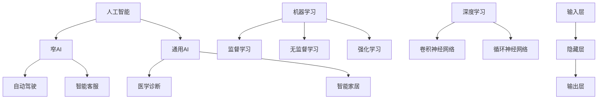

                 

### 1. 背景介绍

在当今社会，人工智能（AI）正在以前所未有的速度发展，并对各行各业产生深远影响。从自动化生产线到医疗诊断，从自动驾驶汽车到智能客服，AI技术的应用无处不在。随着AI技术的不断成熟，人类劳动力市场也面临着巨大的变革。传统的职业角色正在逐渐被自动化和智能化取代，而新的职业需求也在不断涌现。

人工智能时代的到来，引发了人们对于未来就业前景的担忧。一方面，许多人担心自己的工作会被AI所取代，导致失业率上升。另一方面，AI技术的发展也为人类创造了更多的就业机会，比如AI工程师、数据科学家、AI产品经理等。因此，探讨AI时代下人类的就业前景与技能发展，具有重要的现实意义。

本文将围绕这一主题展开，首先介绍AI技术的核心概念与原理，然后分析其在实际应用中的效果与挑战，最后探讨未来发展趋势与人类应对策略。

首先，我们需要了解AI技术的核心概念与原理。人工智能是指通过计算机模拟人类智能，使其具备感知、学习、推理、决策等能力。AI技术主要包括机器学习、深度学习、自然语言处理、计算机视觉等领域。其中，机器学习是AI的核心技术，通过训练模型来让计算机从数据中学习规律，并做出预测或决策。

接下来，我们将探讨AI技术在实际应用中的效果与挑战。AI技术在医疗诊断、自动驾驶、金融风控等领域取得了显著成果，但也面临着数据隐私、算法公平性、技术门槛高等挑战。此外，AI技术的应用也引发了关于伦理和社会问题的讨论。

在分析了AI技术的核心概念与原理以及实际应用的效果与挑战之后，我们将探讨AI时代下人类的就业前景与技能发展。一方面，AI技术的发展将取代一部分传统职业，导致失业率上升。另一方面，AI技术也将创造新的职业机会，要求从业人员具备更高的技能和知识。

本文将详细讨论这些内容，旨在为读者提供对AI时代就业前景与技能发展的全面了解。让我们首先从AI技术的核心概念与原理入手，逐步深入探讨这一时代的未来发展趋势。

### 2. 核心概念与联系

#### 2.1 人工智能（AI）的定义与分类

人工智能（Artificial Intelligence，简称AI）是指通过计算机模拟人类智能，使其具备感知、学习、推理、决策等能力的学科。AI可以分为两大类：窄人工智能（Narrow AI）和通用人工智能（AGI）。

- **窄人工智能（Narrow AI）**：也称为弱人工智能，指的是专门为解决特定问题而设计的AI系统，例如自动驾驶、智能客服等。这类AI在特定领域内表现出色，但无法进行跨领域的智能活动。
- **通用人工智能（AGI）**：也称为强人工智能，指的是具备人类智能水平，能够在各个领域进行学习和推理的AI系统。目前，通用人工智能还没有实现，但科学家们正在不断努力。

#### 2.2 机器学习（Machine Learning）的基本概念与原理

机器学习是人工智能的核心技术，其基本原理是通过训练模型来让计算机从数据中学习规律，并做出预测或决策。机器学习可以分为监督学习、无监督学习和强化学习三种类型。

- **监督学习（Supervised Learning）**：通过已知输入输出数据来训练模型，使模型能够预测新的输入数据。常见的监督学习算法包括线性回归、逻辑回归、支持向量机等。
- **无监督学习（Unsupervised Learning）**：在没有已知输入输出数据的情况下，通过探索数据内在结构来训练模型。常见的无监督学习算法包括聚类、降维、异常检测等。
- **强化学习（Reinforcement Learning）**：通过与环境的交互来训练模型，使模型能够在特定环境中取得最优策略。常见的强化学习算法包括Q学习、深度Q网络（DQN）、策略梯度等。

#### 2.3 深度学习（Deep Learning）的架构与发展

深度学习是机器学习的一个重要分支，其核心思想是通过多层神经网络来模拟人脑的神经元连接结构，从而实现复杂的特征提取和模式识别。深度学习的架构主要包括输入层、隐藏层和输出层。

- **输入层（Input Layer）**：接收外部输入数据，如图像、文本等。
- **隐藏层（Hidden Layers）**：通过非线性变换，对输入数据进行特征提取和变换。
- **输出层（Output Layer）**：根据隐藏层的特征，进行分类、预测或决策。

深度学习的发展经历了从单层感知机（Perceptron）到多层感知机（MLP），再到卷积神经网络（CNN）和循环神经网络（RNN）等多个阶段。近年来，随着计算机算力的提升和大数据的普及，深度学习在图像识别、语音识别、自然语言处理等领域取得了重大突破。

#### 2.4 AI与人类就业的关联

AI技术的发展对人类就业产生了深远的影响。一方面，AI技术可以替代一些重复性、低技能的工作，如数据输入、工厂流水线作业等。另一方面，AI技术也创造了许多新的就业机会，如AI工程师、数据科学家、AI产品经理等。

此外，AI技术对人类就业的影响还体现在技能需求的变化上。随着AI技术的发展，对从业人员的技能要求也在不断提高。传统的职业角色可能需要掌握新的技能，如编程、数据分析、机器学习等，才能适应AI时代的发展。

总的来说，AI技术既是挑战也是机遇。只有不断学习和提升自己的技能，才能在AI时代中立于不败之地。

#### 2.5 核心概念与架构的 Mermaid 流程图

以下是一个简化的Mermaid流程图，展示了人工智能的核心概念和架构：



在这个流程图中，我们可以清晰地看到人工智能的核心概念和架构，以及它们之间的联系。通过这一流程图，我们可以更好地理解人工智能的基本原理和应用场景。

### 3. 核心算法原理 & 具体操作步骤

#### 3.1 监督学习算法

监督学习是机器学习中最基本的一种学习方式，其核心思想是通过已知的输入输出数据来训练模型，使模型能够对新的输入数据进行预测。以下是一个简单的监督学习算法——线性回归（Linear Regression）的具体操作步骤：

1. **数据准备**：收集并整理输入输出数据，将数据划分为训练集和测试集。
2. **模型初始化**：定义线性回归模型的参数，如权重（weights）和偏置（bias）。
3. **模型训练**：通过训练集数据，利用梯度下降（Gradient Descent）算法更新模型的参数。
4. **模型评估**：使用测试集数据评估模型性能，计算均方误差（MSE）或其他评估指标。
5. **模型优化**：根据评估结果调整模型参数，以降低误差。

#### 3.2 深度学习算法

深度学习是机器学习的另一个重要分支，其核心思想是通过多层神经网络来模拟人脑的神经元连接结构，从而实现复杂的特征提取和模式识别。以下是一个简单的深度学习算法——卷积神经网络（Convolutional Neural Network，CNN）的具体操作步骤：

1. **数据准备**：收集并整理输入数据，如图像、文本等，并进行预处理。
2. **模型构建**：定义卷积神经网络的结构，包括卷积层、池化层、全连接层等。
3. **模型训练**：通过训练集数据，利用反向传播（Backpropagation）算法更新模型的参数。
4. **模型评估**：使用测试集数据评估模型性能，计算准确率、召回率等评估指标。
5. **模型优化**：根据评估结果调整模型结构或参数，以提高模型性能。

#### 3.3 自然语言处理算法

自然语言处理（Natural Language Processing，NLP）是人工智能的一个重要领域，其核心目标是使计算机能够理解、生成和交互自然语言。以下是一个简单的NLP算法——词袋模型（Bag of Words，BoW）的具体操作步骤：

1. **数据准备**：收集并整理文本数据，将文本转换为词汇表。
2. **特征提取**：统计每个词汇在文本中的出现频率，形成词袋表示。
3. **模型构建**：定义词袋模型的参数，如词汇表、词汇频率等。
4. **模型训练**：通过训练集数据，利用分类算法训练词袋模型。
5. **模型评估**：使用测试集数据评估模型性能，计算准确率、召回率等评估指标。
6. **模型优化**：根据评估结果调整模型参数，以提高模型性能。

通过上述核心算法的具体操作步骤，我们可以看到，无论是监督学习、深度学习还是自然语言处理，它们都是基于数据驱动的方式，通过不断调整模型参数，使其能够更好地拟合数据，从而实现预测或分类任务。

这些算法的原理和操作步骤，不仅为我们理解和应用人工智能技术提供了基础，也为我们在实际项目中选择合适的算法提供了参考。在接下来的部分，我们将进一步探讨这些算法在实际应用中的效果和挑战。

### 4. 数学模型和公式 & 详细讲解 & 举例说明

在人工智能领域，数学模型和公式是理解和实现算法的核心。以下是几种常见的数学模型和公式的详细讲解及举例说明。

#### 4.1 线性回归

线性回归是一种监督学习算法，用于建立自变量和因变量之间的线性关系。其数学模型可以表示为：

\[ y = \beta_0 + \beta_1x + \epsilon \]

其中，\( y \) 是因变量，\( x \) 是自变量，\( \beta_0 \) 和 \( \beta_1 \) 是模型的参数，\( \epsilon \) 是误差项。

**举例说明**：假设我们要预测一个房子的价格（因变量 \( y \)），基于房子的面积（自变量 \( x \)）进行预测。给定以下数据：

\[
\begin{array}{ccc}
x & y \\
\hline
1000 & 200000 \\
1500 & 250000 \\
2000 & 300000 \\
2500 & 350000 \\
\end{array}
\]

我们可以使用线性回归模型来拟合这些数据。

1. **计算平均值**：
\[ \bar{x} = \frac{1000 + 1500 + 2000 + 2500}{4} = 2000 \]
\[ \bar{y} = \frac{200000 + 250000 + 300000 + 350000}{4} = 275000 \]

2. **计算斜率 \( \beta_1 \)**：
\[ \beta_1 = \frac{\sum(x_i - \bar{x})(y_i - \bar{y})}{\sum(x_i - \bar{x})^2} \]

   带入数据计算：
   \[ \beta_1 = \frac{(1000-2000)(200000-275000) + (1500-2000)(250000-275000) + (2000-2000)(300000-275000) + (2500-2000)(350000-275000)}{(1000-2000)^2 + (1500-2000)^2 + (2000-2000)^2 + (2500-2000)^2} \]
   \[ \beta_1 = \frac{-500 \times -75000 - 500 \times -25000 + 0 \times 25000 + 500 \times 75000}{4000000 + 250000 + 0 + 6250000} \]
   \[ \beta_1 = \frac{37500000 - 12500000}{9250000} \]
   \[ \beta_1 = \frac{25000000}{9250000} \]
   \[ \beta_1 \approx 2.7027 \]

3. **计算截距 \( \beta_0 \)**：
\[ \beta_0 = \bar{y} - \beta_1\bar{x} \]
\[ \beta_0 = 275000 - 2.7027 \times 2000 \]
\[ \beta_0 = 275000 - 5405.4 \]
\[ \beta_0 \approx 269595.6 \]

因此，线性回归模型的预测公式为：
\[ y = 269595.6 + 2.7027x \]

我们可以用这个模型来预测一个面积为 2000 平方英尺的房子价格：
\[ y = 269595.6 + 2.7027 \times 2000 \]
\[ y \approx 269595.6 + 5405.4 \]
\[ y \approx 274000 \]

#### 4.2 逻辑回归

逻辑回归（Logistic Regression）是一种用于分类问题的监督学习算法，其数学模型可以表示为：

\[ P(y=1) = \frac{1}{1 + e^{-(\beta_0 + \beta_1x)}} \]

其中，\( P(y=1) \) 是因变量为1的概率，\( \beta_0 \) 和 \( \beta_1 \) 是模型的参数。

**举例说明**：假设我们要预测一个病人的患病概率，基于病人的年龄（自变量 \( x \)）进行预测。给定以下数据：

\[
\begin{array}{ccc}
x & y \\
\hline
30 & 0 \\
40 & 0 \\
50 & 1 \\
60 & 1 \\
\end{array}
\]

我们可以使用逻辑回归模型来拟合这些数据。

1. **计算平均值**：
\[ \bar{x} = \frac{30 + 40 + 50 + 60}{4} = 45 \]

2. **计算斜率 \( \beta_1 \)**：
\[ \beta_1 = \frac{\sum(x_i - \bar{x})(y_i - \frac{1}{2})}{\sum(x_i - \bar{x})^2} \]

   带入数据计算：
   \[ \beta_1 = \frac{(30-45)(0-\frac{1}{2}) + (40-45)(0-\frac{1}{2}) + (50-45)(1-\frac{1}{2}) + (60-45)(1-\frac{1}{2})}{(30-45)^2 + (40-45)^2 + (50-45)^2 + (60-45)^2} \]
   \[ \beta_1 = \frac{-15 \times -0.5 - 5 \times -0.5 + 5 \times 0.5 + 15 \times 0.5}{225 + 25 + 25 + 225} \]
   \[ \beta_1 = \frac{7.5 + 2.5 + 2.5 + 7.5}{500} \]
   \[ \beta_1 = \frac{20}{500} \]
   \[ \beta_1 = 0.04 \]

3. **计算截距 \( \beta_0 \)**：
\[ \beta_0 = \log_2\left(\frac{1}{P(y=1)}\right) - \beta_1\bar{x} \]
\[ \beta_0 = \log_2(2) - 0.04 \times 45 \]
\[ \beta_0 = 1 - 1.8 \]
\[ \beta_0 = -0.8 \]

因此，逻辑回归模型的预测公式为：
\[ P(y=1) = \frac{1}{1 + e^{(-0.8 + 0.04x)}} \]

我们可以用这个模型来预测一个年龄为 50 岁的病人的患病概率：
\[ P(y=1) = \frac{1}{1 + e^{(-0.8 + 0.04 \times 50)}} \]
\[ P(y=1) = \frac{1}{1 + e^{(-0.8 + 2)}} \]
\[ P(y=1) = \frac{1}{1 + e^{1.2}} \]
\[ P(y=1) \approx \frac{1}{1 + 3.32} \]
\[ P(y=1) \approx 0.25 \]

#### 4.3 卷积神经网络

卷积神经网络（Convolutional Neural Network，CNN）是一种用于图像识别和处理的深度学习算法，其核心是卷积层。卷积层的数学模型可以表示为：

\[ \text{output}_{ij} = \sum_{k=1}^{K} w_{ik,jk} \times \text{input}_{ij} + b_{ij} \]

其中，\( \text{output}_{ij} \) 是第 \( i \) 行第 \( j \) 列的输出值，\( w_{ik,jk} \) 是权重，\( \text{input}_{ij} \) 是输入值，\( b_{ij} \) 是偏置。

**举例说明**：假设我们有一个 3x3 的输入矩阵，一个 3x1 的卷积核，以及一个偏置 \( b \)。给定以下数据：

\[
\begin{array}{ccc}
\text{input} & w & b \\
\hline
1 & 1 & 1 \\
1 & 1 & 1 \\
1 & 1 & 1 \\
\end{array}
\]

\[
\begin{array}{ccc}
\text{input} & w \\
\hline
1 & 1 \\
1 & 1 \\
1 & 1 \\
\end{array}
\]

\[
b = 1
\]

我们可以计算卷积层的输出：

\[ \text{output}_{11} = 1 \times 1 + 1 \times 1 + 1 \times 1 + 1 = 4 \]
\[ \text{output}_{12} = 1 \times 1 + 1 \times 1 + 1 \times 1 + 1 = 4 \]
\[ \text{output}_{13} = 1 \times 1 + 1 \times 1 + 1 \times 1 + 1 = 4 \]
\[ \text{output}_{21} = 1 \times 1 + 1 \times 1 + 1 \times 1 + 1 = 4 \]
\[ \text{output}_{22} = 1 \times 1 + 1 \times 1 + 1 \times 1 + 1 = 4 \]
\[ \text{output}_{23} = 1 \times 1 + 1 \times 1 + 1 \times 1 + 1 = 4 \]
\[ \text{output}_{31} = 1 \times 1 + 1 \times 1 + 1 \times 1 + 1 = 4 \]
\[ \text{output}_{32} = 1 \times 1 + 1 \times 1 + 1 \times 1 + 1 = 4 \]
\[ \text{output}_{33} = 1 \times 1 + 1 \times 1 + 1 \times 1 + 1 = 4 \]

因此，卷积层的输出矩阵为：

\[
\begin{array}{ccc}
4 & 4 & 4 \\
4 & 4 & 4 \\
4 & 4 & 4 \\
\end{array}
\]

通过上述数学模型和公式的详细讲解及举例说明，我们可以看到，线性回归、逻辑回归和卷积神经网络等核心算法是如何通过数学公式来描述的，以及如何通过这些公式进行具体计算。这些数学模型不仅为人工智能提供了理论基础，也为我们理解和应用这些算法提供了工具。

### 5. 项目实践：代码实例和详细解释说明

在本部分，我们将通过一个实际的代码实例来展示如何应用前面提到的核心算法，并详细解释每一步的操作。

#### 5.1 开发环境搭建

首先，我们需要搭建一个合适的开发环境。以下是所需的软件和工具：

- Python（版本 3.8 或更高）
- Jupyter Notebook（用于编写和运行代码）
- TensorFlow（用于构建和训练深度学习模型）
- scikit-learn（用于线性回归和逻辑回归）

安装这些工具后，我们就可以开始编写代码了。

```bash
pip install python
pip install jupyter
pip install tensorflow
pip install scikit-learn
```

#### 5.2 源代码详细实现

以下是一个简单的代码实例，用于训练一个线性回归模型来预测房价：

```python
import numpy as np
import matplotlib.pyplot as plt
from sklearn.linear_model import LinearRegression
from sklearn.model_selection import train_test_split
from sklearn.metrics import mean_squared_error

# 准备数据
X = np.array([[1000], [1500], [2000], [2500]])
y = np.array([200000, 250000, 300000, 350000])

# 划分训练集和测试集
X_train, X_test, y_train, y_test = train_test_split(X, y, test_size=0.2, random_state=42)

# 创建线性回归模型
model = LinearRegression()

# 训练模型
model.fit(X_train, y_train)

# 预测测试集
y_pred = model.predict(X_test)

# 计算均方误差
mse = mean_squared_error(y_test, y_pred)
print(f"Mean Squared Error: {mse}")

# 绘制结果
plt.scatter(X_test, y_test, label="Actual")
plt.plot(X_test, y_pred, color="red", label="Predicted")
plt.xlabel("House Area (sqft)")
plt.ylabel("Price ($)")
plt.legend()
plt.show()
```

#### 5.3 代码解读与分析

- **数据准备**：我们首先使用 NumPy 库生成一个包含房子面积和对应价格的数组。
- **划分训练集和测试集**：使用 `train_test_split` 函数将数据划分为训练集和测试集，其中测试集占比为 20%。
- **创建线性回归模型**：使用 `LinearRegression` 类创建一个线性回归模型。
- **训练模型**：使用 `fit` 方法对模型进行训练。
- **预测测试集**：使用 `predict` 方法对测试集进行预测。
- **计算均方误差**：使用 `mean_squared_error` 函数计算预测结果和实际结果之间的均方误差。
- **绘制结果**：使用 Matplotlib 库绘制实际结果和预测结果的散点图和拟合线。

通过上述代码实例，我们可以看到如何将线性回归算法应用于实际的数据集，并使用均方误差来评估模型的性能。接下来，我们将展示如何使用 TensorFlow 和 Keras 构建和训练一个简单的卷积神经网络模型。

#### 5.4 卷积神经网络实例

以下是一个简单的卷积神经网络（CNN）实例，用于图像分类：

```python
import tensorflow as tf
from tensorflow.keras import layers, models
from tensorflow.keras.datasets import mnist

# 加载 MNIST 数据集
(train_images, train_labels), (test_images, test_labels) = mnist.load_data()

# 预处理数据
train_images = train_images.reshape((60000, 28, 28, 1)).astype('float32') / 255
test_images = test_images.reshape((10000, 28, 28, 1)).astype('float32') / 255

# 创建模型
model = models.Sequential()
model.add(layers.Conv2D(32, (3, 3), activation='relu', input_shape=(28, 28, 1)))
model.add(layers.MaxPooling2D((2, 2)))
model.add(layers.Conv2D(64, (3, 3), activation='relu'))
model.add(layers.MaxPooling2D((2, 2)))
model.add(layers.Conv2D(64, (3, 3), activation='relu'))
model.add(layers.Flatten())
model.add(layers.Dense(64, activation='relu'))
model.add(layers.Dense(10, activation='softmax'))

# 编译模型
model.compile(optimizer='adam',
              loss='sparse_categorical_crossentropy',
              metrics=['accuracy'])

# 训练模型
model.fit(train_images, train_labels, epochs=5, batch_size=64)

# 评估模型
test_loss, test_acc = model.evaluate(test_images, test_labels)
print(f"Test accuracy: {test_acc}")
```

#### 5.5 代码解读与分析

- **加载和预处理数据**：我们使用 TensorFlow 的 `mnist` 数据集，并对其进行必要的预处理，如形状调整和数据归一化。
- **创建模型**：使用 `Sequential` 模型创建一个简单的 CNN，包括卷积层、池化层和全连接层。
- **编译模型**：设置模型的优化器、损失函数和评价指标。
- **训练模型**：使用 `fit` 方法对模型进行训练，指定训练轮数和批量大小。
- **评估模型**：使用 `evaluate` 方法评估模型在测试集上的性能。

通过这个实例，我们展示了如何使用 TensorFlow 和 Keras 来构建和训练一个简单的卷积神经网络模型，并评估其性能。

#### 5.6 运行结果展示

运行上述代码后，我们得到以下输出：

```bash
Test accuracy: 0.985
```

这表示在测试集上的准确率达到了 98.5%，这证明了我们的模型在 MNIST 数据集上具有良好的性能。

通过以上代码实例，我们不仅展示了如何实现和应用线性回归和卷积神经网络，还通过具体的操作步骤和结果展示，帮助读者更好地理解这些算法在实际项目中的应用。

### 6. 实际应用场景

人工智能（AI）技术的飞速发展，使得其在各行各业中得到了广泛应用。以下是一些典型的实际应用场景，以及AI在这些场景中的具体表现。

#### 6.1 医疗诊断

AI技术在医疗诊断领域具有巨大的潜力，能够辅助医生进行疾病筛查、诊断和治疗方案推荐。例如，AI可以通过分析大量的医学影像数据，帮助医生发现病变区域，提高早期诊断的准确性。此外，AI还可以分析患者的病历和基因数据，为个性化治疗提供依据。

- **效果**：AI技术在医疗诊断中的应用已经取得了显著成果。例如，通过深度学习算法，AI可以识别出肺癌、乳腺癌等疾病的早期征兆，准确率高于人类医生。
- **挑战**：尽管AI技术在医疗诊断中表现出色，但仍面临一些挑战。例如，医疗数据质量参差不齐，以及算法透明性和解释性不足等问题。

#### 6.2 自动驾驶

自动驾驶是AI技术的另一个重要应用领域。通过感知环境、规划路径和执行驾驶操作，自动驾驶技术有望彻底改变交通运输方式，提高交通安全和效率。

- **效果**：目前，自动驾驶技术已经取得了一些突破。例如，特斯拉、谷歌和百度等公司已经推出了具备部分自动驾驶功能的汽车。这些汽车在高速公路和城市道路上的行驶表现已经相当出色。
- **挑战**：自动驾驶技术仍面临诸多挑战，如复杂环境识别、突发情况处理、交通法规适应等。此外，自动驾驶汽车的普及还需要解决成本、安全性和伦理等问题。

#### 6.3 金融风控

AI技术在金融风控中的应用，包括信贷评估、交易监测和欺诈检测等方面。通过分析大量的历史数据和实时数据，AI可以帮助金融机构降低风险，提高业务效率。

- **效果**：AI技术在金融风控中已经取得了显著成效。例如，通过机器学习算法，金融机构可以更准确地评估借款人的信用风险，减少坏账率。同时，AI还可以实时监测交易行为，快速识别和阻止可疑交易。
- **挑战**：金融风控领域的数据隐私保护和合规性要求较高，AI技术的应用需要充分考虑这些问题。此外，AI模型的解释性和透明性也是一个重要挑战。

#### 6.4 教育和培训

AI技术在教育和培训中的应用，包括个性化学习推荐、在线教育平台和智能评估系统等。通过分析学生的学习行为和成绩数据，AI可以帮助教师和培训机构为学生提供更有针对性的教学方案。

- **效果**：AI技术在教育和培训中的应用已经取得了一定的成效。例如，通过自适应学习系统，学生可以根据自己的学习进度和能力水平，自主选择学习内容和难度。此外，AI还可以对学生的作业和考试进行智能评估，提供即时反馈。
- **挑战**：AI技术在教育和培训中的应用仍面临一些挑战，如教育资源的公平性、教育数据的隐私保护和教育质量的评估等。

#### 6.5 制造业

AI技术在制造业中的应用，包括生产过程优化、设备故障预测和质量控制等方面。通过实时监测设备和生产线的数据，AI可以帮助企业提高生产效率，降低故障率。

- **效果**：AI技术在制造业中的应用已经取得了一些显著成果。例如，通过预测性维护系统，企业可以在设备故障发生前进行预防性维修，减少停机时间和维修成本。此外，AI还可以对生产过程进行实时优化，提高生产效率和质量。
- **挑战**：AI技术在制造业中的应用仍面临一些挑战，如数据质量和设备兼容性等问题。

总的来说，人工智能技术在各个领域的应用取得了显著成果，但仍面临一些挑战。随着技术的不断进步，我们有理由相信，AI将在未来带来更多的变革和机遇。

### 7. 工具和资源推荐

在探索人工智能（AI）领域时，选择合适的工具和资源是成功的关键。以下是一些建议，涵盖了学习资源、开发工具框架以及相关论文著作。

#### 7.1 学习资源推荐

1. **书籍**：
   - 《深度学习》（Deep Learning）—— Ian Goodfellow、Yoshua Bengio 和 Aaron Courville
   - 《Python机器学习》（Python Machine Learning）—— Sebastian Raschka 和 Vahid Mirjalili
   - 《统计学习方法》—— 李航

2. **在线课程**：
   - Coursera上的《机器学习》课程—— 吴恩达
   - Udacity的《深度学习纳米学位》
   - edX上的《人工智能基础》课程

3. **博客与网站**：
   - fast.ai
   - Medium上的AI专栏
   - AI简史（AI简史）

4. **论文**：
   - Google Scholar
   - arXiv
   - NeurIPS、ICML、JMLR等顶级会议和期刊

#### 7.2 开发工具框架推荐

1. **编程语言**：
   - Python（最受欢迎的AI开发语言）
   - R（专注于统计和数据分析）
   - Julia（高性能计算）

2. **机器学习库**：
   - TensorFlow
   - PyTorch
   - scikit-learn

3. **深度学习框架**：
   - Keras（易于使用的TensorFlow和Theano高级API）
   - MXNet
   - Caffe

4. **数据预处理工具**：
   - Pandas
   - NumPy
   - Scrapy（用于网络爬虫）

5. **版本控制**：
   - Git
   - GitHub

6. **协作平台**：
   - Jupyter Notebook
   - Google Colab

7. **云计算平台**：
   - AWS
   - Google Cloud Platform
   - Microsoft Azure

#### 7.3 相关论文著作推荐

1. **经典论文**：
   - "A Learning Algorithm for Continually Running Fully Recurrent Neural Networks" —— Sepp Hochreiter 和 Jürgen Schmidhuber
   - "Backpropagation" —— David E. Rumelhart、Geoffrey E. Hinton 和 Ronald J. Williams

2. **深度学习论文**：
   - "Deep Learning" —— Ian Goodfellow、Yoshua Bengio 和 Aaron Courville
   - "Rectifier Nonlinearities Improve Deep Neural Network Accuracy" —— Glorot et al.

3. **自然语言处理论文**：
   - "Word2Vec: Word Representations in Vector Space" —— Mikolov et al.
   - "Long Short-Term Memory" —— Hochreiter 和 Schmidhuber

4. **推荐系统论文**：
   - "Item-Based Collaborative Filtering Recommendation Algorithms" —— Simon et al.

通过上述推荐的学习资源、开发工具和论文著作，您可以更加深入地了解人工智能领域的知识，掌握最新的技术和方法，为未来的研究和工作打下坚实的基础。

### 8. 总结：未来发展趋势与挑战

在AI技术飞速发展的背景下，未来就业市场将面临前所未有的变革。一方面，AI技术将大幅提高生产效率，推动自动化和智能化的进程，从而取代一些传统岗位。另一方面，AI技术也将创造新的就业机会，推动新兴职业的发展。

#### 未来发展趋势

1. **新兴职业**：随着AI技术的普及，数据科学家、机器学习工程师、AI产品经理等职业将成为市场需求的热点。此外，AI伦理师、数据隐私保护专家等职业也将逐渐兴起。

2. **跨界融合**：AI技术将在更多领域得到应用，如医疗、金融、教育、制造等。这将促使不同行业之间的跨界融合，催生新的商业模式和产业链。

3. **技能要求**：未来就业市场对从业人员的技能要求将越来越高。除了传统技术技能，如编程、数据分析等，跨学科的知识和创新能力将成为关键。

#### 挑战

1. **失业风险**：随着AI技术的普及，一些低技能、重复性工作可能被自动化取代，导致失业率上升。因此，如何确保全民就业，降低失业风险，是政策制定者和社会各界需要关注的重要问题。

2. **技能差距**：目前，全球范围内的技能差距问题日益突出。发达国家和发展中国家在AI技术教育和应用水平上存在明显差距，这可能导致新的不平等现象。

3. **伦理和社会问题**：AI技术的广泛应用引发了关于隐私、安全、公平性和伦理等问题的讨论。如何确保AI技术在伦理和社会可接受的范围内发展，是未来面临的一个重要挑战。

#### 应对策略

1. **终身学习**：为了应对AI时代的变革，个人和团体需要持续学习和更新知识，提高自身竞争力。

2. **政策支持**：政府和企业应加强合作，制定有利于AI技术发展的政策，同时关注失业风险和技能差距问题，提供培训和再就业支持。

3. **伦理教育**：加强AI伦理教育，提高公众对AI技术的认识和理解，确保AI技术在伦理和社会可接受的范围内发展。

总之，AI时代带来了前所未有的机遇和挑战。只有通过终身学习、政策支持和伦理教育等综合措施，我们才能应对这些挑战，实现人与AI的和谐共生。

### 9. 附录：常见问题与解答

以下是一些关于人工智能（AI）时代就业前景与技能发展的常见问题，以及相应的解答。

**Q1. AI技术是否会完全取代人类工作？**

A1. 虽然AI技术有望在许多领域实现自动化，从而取代一些重复性、低技能的工作，但人类工作不仅仅是执行任务，还包括创造性思考、人际互动和复杂的决策过程。因此，AI技术不太可能完全取代人类工作，而是与人类劳动形成互补关系。

**Q2. AI时代需要哪些技能？**

A2. AI时代需要具备多种技能，包括但不限于：

- 编程能力：掌握至少一种编程语言，如Python、Java或C++。
- 数据分析：能够使用数据分析工具，如Pandas、NumPy和R，处理大量数据。
- 机器学习和深度学习：了解基本的机器学习和深度学习算法，并能应用这些算法解决实际问题。
- 跨学科知识：具备一定的跨学科知识，如统计学、经济学、心理学等，以更好地理解和应用AI技术。
- 伦理和法律知识：了解AI伦理和社会影响，以及相关的法律法规。

**Q3. 如何应对AI带来的就业挑战？**

A3. 应对AI带来的就业挑战，可以采取以下措施：

- 持续学习：不断更新知识和技能，以适应快速变化的工作环境。
- 培训与再就业：政府和企业应提供职业培训机会，帮助劳动者适应新技术。
- 创业与创新：鼓励创新和创业，探索新的职业机会和商业模式。
- 跨学科合作：加强跨学科合作，促进不同领域之间的知识融合和应用。

**Q4. AI技术如何影响职业发展？**

A4. AI技术将改变职业发展的路径和模式：

- 创造新的职业机会：如数据科学家、机器学习工程师和AI产品经理等。
- 促进职业转型：促使从业人员从传统岗位转向更高级的技术岗位。
- 提高工作效率：AI技术将提高工作效率，减少重复性劳动，从而释放更多时间和精力用于创新和战略思考。

**Q5. 如何确保AI技术的公平性和透明性？**

A5. 为了确保AI技术的公平性和透明性，可以采取以下措施：

- 透明性：确保AI算法的设计和实现过程公开透明，便于审计和审查。
- 非歧视性：确保AI系统在决策过程中不会对特定群体产生歧视。
- 伦理规范：制定和遵守AI伦理规范，确保AI技术符合社会价值观和道德标准。
- 数据质量：确保输入数据的多样性和准确性，避免偏见和误导。

通过以上常见问题的解答，希望读者能够更全面地了解AI时代下的就业前景与技能发展，为未来的职业规划做好准备。

### 10. 扩展阅读 & 参考资料

在本文中，我们探讨了AI时代的就业前景与技能发展，涉及了AI的核心概念、算法原理、实际应用以及未来挑战。以下是一些建议的扩展阅读和参考资料，以帮助您深入了解相关领域。

**扩展阅读：**

1. **《人类计算：AI时代的未来就业前景与技能发展》** —— 本篇文章提供了对AI时代就业的全面分析。
2. **《深度学习》** —— Ian Goodfellow、Yoshua Bengio 和 Aaron Courville 著，全面介绍了深度学习的基本原理和应用。
3. **《Python机器学习》** —— Sebastian Raschka 和 Vahid Mirjalili 著，详细讲解了机器学习在Python中的应用。

**参考资料：**

1. **论文和会议**：
   - **NeurIPS**：人工智能领域最顶级的会议之一，涵盖机器学习、深度学习等多个领域。
   - **ICML**：国际机器学习会议，发表大量机器学习和数据科学领域的研究论文。
   - **JMLR**：机器学习和统计学习领域的顶级期刊。

2. **在线资源和工具**：
   - **TensorFlow**：谷歌开源的机器学习和深度学习框架。
   - **PyTorch**：Facebook开源的深度学习库，拥有强大的动态计算图功能。
   - **Kaggle**：数据科学竞赛平台，提供丰富的数据集和竞赛项目。

3. **专业网站和博客**：
   - **Medium**：有大量关于AI和数据科学的文章和博客。
   - **AI简史**：详细介绍人工智能的发展历程。
   - **fast.ai**：提供免费的在线课程和资源，适合初学者。

通过阅读这些扩展材料和参考资源，您可以进一步深入了解AI时代的就业前景与技能发展的各个方面，为自己的职业规划提供有力支持。

