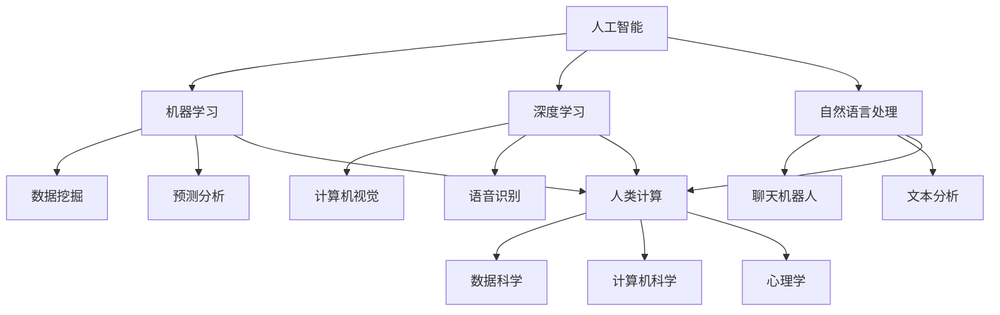

                 

### 文章标题

《人类计算：AI时代的未来就业前景与技能发展》

关键词：人工智能，就业前景，技能发展，人类计算

摘要：随着人工智能技术的迅猛发展，人类计算在AI时代的就业前景和技能发展面临重大挑战和机遇。本文将探讨AI时代下人类计算的职业转型、新兴技能需求以及未来发展的趋势和方向，为从业者提供有价值的参考和指导。

### 1. 背景介绍

人工智能（AI）作为当今科技领域的热点，已经渗透到社会的各个领域，从医疗、金融到教育、制造等。AI技术的快速发展不仅改变了传统的工作模式，也带来了前所未有的就业变革。根据麦肯锡全球研究院的报告，到2030年，全球可能有多达8亿个工作岗位受到影响，其中约4亿个岗位将需要进行转型或重新培训。这种背景下，人类计算在AI时代的就业前景和技能发展成为一个亟待探讨的重要课题。

人类计算，指的是人类利用计算机和算法进行问题求解和决策制定的过程。在AI时代，人类计算的角色将面临重大变革。一方面，AI技术的发展将部分取代传统的人类劳动，如数据分析、图像识别等领域；另一方面，AI技术也将创造新的就业机会，如AI系统的开发、维护和优化等。因此，了解AI时代下人类计算的职业转型、新兴技能需求以及未来发展的趋势和方向，对于从业者来说至关重要。

本文将从以下几个方面展开讨论：

1. **核心概念与联系**：介绍AI时代下人类计算的核心概念，并使用Mermaid流程图展示相关概念之间的联系。
2. **核心算法原理 & 具体操作步骤**：详细阐述AI时代下人类计算的核心算法原理，以及具体的应用步骤。
3. **数学模型和公式 & 详细讲解 & 举例说明**：介绍AI时代下人类计算所需的数学模型和公式，并给出详细的讲解和实例说明。
4. **项目实践：代码实例和详细解释说明**：通过实际项目，展示AI时代下人类计算的代码实例和详细解释。
5. **实际应用场景**：探讨AI时代下人类计算在不同领域的实际应用场景。
6. **工具和资源推荐**：推荐学习资源和开发工具，帮助读者更好地掌握AI时代下人类计算的相关技能。
7. **总结：未来发展趋势与挑战**：总结AI时代下人类计算的发展趋势和面临的挑战。
8. **附录：常见问题与解答**：解答读者可能遇到的一些常见问题。
9. **扩展阅读 & 参考资料**：提供进一步的阅读材料和参考资料。

通过以上内容，本文旨在为读者提供一个全面、深入的了解AI时代下人类计算的职业转型、技能发展以及未来趋势，帮助从业者更好地适应和把握这一变革带来的机遇和挑战。

### 2. 核心概念与联系

在探讨AI时代的就业前景和技能发展之前，我们需要明确几个核心概念，并了解它们之间的相互关系。以下是AI时代下人类计算的核心概念及其联系：

#### 2.1 人工智能（AI）

人工智能是指通过计算机模拟人类智能行为的技术，包括机器学习、深度学习、自然语言处理等。AI的核心目标是使计算机能够执行通常需要人类智能的任务，如图像识别、语音识别、决策制定等。

#### 2.2 机器学习（ML）

机器学习是AI的一个重要分支，它使计算机能够从数据中学习并改进其性能。机器学习算法通过分析大量数据，发现数据中的模式和规律，并利用这些规律进行预测和决策。

#### 2.3 深度学习（DL）

深度学习是机器学习的一种形式，它通过构建具有多个层次的神经网络模型来学习和模拟人类大脑的思考过程。深度学习在图像识别、语音识别和自然语言处理等领域取得了显著的成果。

#### 2.4 自然语言处理（NLP）

自然语言处理是AI的一个子领域，它使计算机能够理解和处理人类语言。NLP技术广泛应用于聊天机器人、翻译系统、文本分析等领域。

#### 2.5 人类计算（Human Computation）

人类计算是指利用计算机和算法来增强人类解决问题和决策制定的能力。在AI时代，人类计算涉及到多个学科领域，如数据科学、计算机科学、心理学等。

#### 2.6 AI时代下人类计算的核心概念联系

以下是一个使用Mermaid流程图展示AI时代下人类计算核心概念之间联系的过程：



在这个流程图中，我们可以看到人工智能作为核心驱动力，通过机器学习、深度学习和自然语言处理等子领域，与人类计算紧密相连。人类计算则融合了数据科学、计算机科学和心理学等学科，旨在通过计算机和算法增强人类的计算能力和决策水平。

#### 2.7 总结

通过以上核心概念及其联系的介绍，我们可以更好地理解AI时代下人类计算的重要性。这些核心概念不仅构成了AI技术的基石，也为我们提供了一个全面的分析框架，以探讨人类计算在AI时代的就业前景和技能发展。

### 3. 核心算法原理 & 具体操作步骤

在了解了AI时代下人类计算的核心概念后，我们接下来将深入探讨核心算法原理，以及这些算法在实际操作中的具体步骤。以下内容将涵盖机器学习、深度学习和自然语言处理等领域。

#### 3.1 机器学习（Machine Learning）

机器学习是AI的核心技术之一，其基本原理是通过分析大量数据，从数据中学习规律，并利用这些规律进行预测和决策。以下是机器学习的核心算法原理和具体操作步骤：

##### 3.1.1 算法原理

机器学习算法可以分为监督学习（Supervised Learning）、无监督学习（Unsupervised Learning）和半监督学习（Semi-Supervised Learning）三种类型。

- **监督学习**：在监督学习算法中，训练数据集包含输入和输出标签，算法通过学习输入和输出之间的映射关系，进行预测。常见的监督学习算法包括线性回归、逻辑回归、支持向量机（SVM）等。
- **无监督学习**：在无监督学习算法中，训练数据集只包含输入数据，没有输出标签。算法的目标是发现数据中的结构和模式，如聚类算法（K-means、DBSCAN）和降维算法（PCA、t-SNE）等。
- **半监督学习**：半监督学习算法结合了监督学习和无监督学习的特点，利用少量标记数据和大量未标记数据，进行模型训练。

##### 3.1.2 操作步骤

以下是机器学习算法的具体操作步骤：

1. **数据预处理**：清洗数据，处理缺失值，标准化数据等，确保数据的质量和一致性。
2. **特征工程**：提取和构造特征，提高模型的预测能力。常见的特征工程方法包括特征选择、特征变换和特征组合等。
3. **模型选择**：根据问题的性质和数据的特点，选择合适的机器学习算法。常见的算法有线性回归、决策树、随机森林、神经网络等。
4. **模型训练**：使用训练数据集对模型进行训练，学习输入和输出之间的映射关系。
5. **模型评估**：使用验证数据集对模型进行评估，通过指标如准确率、召回率、F1分数等，评估模型的性能。
6. **模型优化**：根据评估结果，调整模型参数，优化模型性能。
7. **模型部署**：将训练好的模型部署到实际应用场景中，进行预测和决策。

#### 3.2 深度学习（Deep Learning）

深度学习是机器学习的一种形式，通过构建具有多个层次的神经网络模型，模拟人类大脑的思考过程。以下是深度学习的核心算法原理和具体操作步骤：

##### 3.2.1 算法原理

深度学习算法基于神经网络（Neural Networks），其中每个节点（神经元）都通过加权连接与其他节点相连。算法通过学习输入和输出之间的映射关系，进行预测和决策。深度学习模型的特点是层次结构，每个层次对输入数据进行处理和特征提取，最终得到预测结果。

##### 3.2.2 操作步骤

以下是深度学习算法的具体操作步骤：

1. **数据预处理**：与机器学习相同，对数据进行清洗、处理和标准化。
2. **特征工程**：深度学习模型通常不需要复杂的特征工程，但可以结合预训练模型（如卷积神经网络（CNN）和循环神经网络（RNN））进行特征提取。
3. **模型设计**：根据问题的性质和数据的特点，设计深度学习模型的结构，如选择合适的神经网络架构、层类型和层参数等。
4. **模型训练**：使用训练数据集对深度学习模型进行训练，通过反向传播算法（Backpropagation）学习输入和输出之间的映射关系。
5. **模型评估**：使用验证数据集对深度学习模型进行评估，通过指标如准确率、损失函数等，评估模型的性能。
6. **模型优化**：根据评估结果，调整模型参数，优化模型性能。
7. **模型部署**：将训练好的模型部署到实际应用场景中，进行预测和决策。

#### 3.3 自然语言处理（Natural Language Processing）

自然语言处理是AI的一个重要子领域，旨在使计算机能够理解和处理人类语言。以下是自然语言处理的核心算法原理和具体操作步骤：

##### 3.3.1 算法原理

自然语言处理算法主要包括词法分析、句法分析、语义分析和语义理解等。词法分析将文本分解为单词和符号，句法分析研究句子结构，语义分析研究词语和句子的含义，语义理解则关注文本的整体意义。

##### 3.3.2 操作步骤

以下是自然语言处理算法的具体操作步骤：

1. **数据预处理**：与机器学习相同，对数据进行清洗、处理和标准化。
2. **词法分析**：使用分词器将文本分解为单词和符号，常见的方法有基于词典的分词和基于统计的分词。
3. **句法分析**：构建句子的语法树，分析句子结构，常见的方法有基于规则的方法和基于统计的方法。
4. **语义分析**：研究词语和句子的含义，常见的方法有基于词典的方法和基于知识图谱的方法。
5. **语义理解**：理解文本的整体意义，常见的方法有基于机器学习的方法和基于深度学习的方法。
6. **模型训练**：使用训练数据集对自然语言处理模型进行训练，学习输入和输出之间的映射关系。
7. **模型评估**：使用验证数据集对自然语言处理模型进行评估，通过指标如准确率、召回率、F1分数等，评估模型的性能。
8. **模型优化**：根据评估结果，调整模型参数，优化模型性能。
9. **模型部署**：将训练好的模型部署到实际应用场景中，进行文本分析和处理。

#### 3.4 总结

通过以上对机器学习、深度学习和自然语言处理等核心算法原理和操作步骤的探讨，我们可以看到AI时代下人类计算所需的技术基础。这些算法不仅是AI技术的重要组成部分，也为人类计算提供了强大的工具和方法，使得人类能够更好地理解和利用计算机进行问题求解和决策制定。

### 4. 数学模型和公式 & 详细讲解 & 举例说明

在探讨AI时代下人类计算的核心算法原理和操作步骤之后，我们接下来将介绍与这些算法相关的数学模型和公式，并给出详细的讲解和实例说明。这些数学模型和公式是理解人类计算算法的基础，同时也是实际应用中的关键工具。

#### 4.1 机器学习（Machine Learning）

机器学习算法的核心在于建立输入和输出之间的映射关系。以下是一些常见的数学模型和公式：

##### 4.1.1 线性回归（Linear Regression）

线性回归是一种简单的机器学习算法，用于预测连续值。其数学模型如下：

$$
y = \beta_0 + \beta_1 x + \epsilon
$$

其中，$y$ 是预测值，$x$ 是输入特征，$\beta_0$ 和 $\beta_1$ 是模型参数，$\epsilon$ 是误差项。

线性回归的目的是通过最小化误差平方和来估计模型参数：

$$
\min_{\beta_0, \beta_1} \sum_{i=1}^{n} (y_i - (\beta_0 + \beta_1 x_i))^2
$$

##### 4.1.2 逻辑回归（Logistic Regression）

逻辑回归是一种用于分类问题的机器学习算法，其数学模型如下：

$$
\log(\frac{p}{1-p}) = \beta_0 + \beta_1 x
$$

其中，$p$ 是预测的概率，$\beta_0$ 和 $\beta_1$ 是模型参数。

逻辑回归的目的是通过最大化似然函数来估计模型参数：

$$
\max_{\beta_0, \beta_1} \prod_{i=1}^{n} \pi(y_i)(1-\pi(y_i))
$$

其中，$\pi(y_i) = \frac{1}{1 + e^{-(\beta_0 + \beta_1 x_i)}}$。

##### 4.1.3 支持向量机（Support Vector Machine）

支持向量机是一种用于分类和回归问题的机器学习算法，其数学模型如下：

$$
w \cdot x + b = 1
$$

其中，$w$ 是权重向量，$b$ 是偏置项，$x$ 是输入特征。

支持向量机的目的是最大化分类边界：

$$
\max_{w, b} \frac{1}{2} ||w||^2
$$

同时满足约束条件：

$$
y_i (w \cdot x_i + b) \geq 1
$$

#### 4.2 深度学习（Deep Learning）

深度学习算法的核心是神经网络，以下是一些常见的数学模型和公式：

##### 4.2.1 卷积神经网络（Convolutional Neural Network）

卷积神经网络是一种用于图像识别的深度学习算法，其数学模型如下：

$$
h_{l}(x) = \sigma(\mathbf{W}_{l} \cdot h_{l-1} + b_{l})
$$

其中，$h_{l}(x)$ 是第 $l$ 层的输出，$\sigma$ 是激活函数，$\mathbf{W}_{l}$ 是权重矩阵，$b_{l}$ 是偏置项。

卷积神经网络的目的是通过反向传播算法学习权重和偏置：

$$
\begin{aligned}
\Delta \mathbf{W}_{l} &= \alpha \cdot \frac{\partial L}{\partial \mathbf{W}_{l}} \\
\Delta b_{l} &= \alpha \cdot \frac{\partial L}{\partial b_{l}}
\end{aligned}
$$

其中，$L$ 是损失函数，$\alpha$ 是学习率。

##### 4.2.2 循环神经网络（Recurrent Neural Network）

循环神经网络是一种用于序列数据的深度学习算法，其数学模型如下：

$$
h_{l}(x) = \sigma(\mathbf{W}_{l} h_{l-1} + \mathbf{U}_{l} x + b_{l})
$$

其中，$h_{l}(x)$ 是第 $l$ 层的输出，$\sigma$ 是激活函数，$\mathbf{W}_{l}$ 和 $\mathbf{U}_{l}$ 是权重矩阵，$b_{l}$ 是偏置项。

循环神经网络的目的是通过反向传播算法学习权重和偏置：

$$
\begin{aligned}
\Delta \mathbf{W}_{l} &= \alpha \cdot \frac{\partial L}{\partial \mathbf{W}_{l}} \\
\Delta \mathbf{U}_{l} &= \alpha \cdot \frac{\partial L}{\partial \mathbf{U}_{l}} \\
\Delta b_{l} &= \alpha \cdot \frac{\partial L}{\partial b_{l}}
\end{aligned}
$$

#### 4.3 自然语言处理（Natural Language Processing）

自然语言处理算法涉及词法分析、句法分析、语义分析和语义理解等多个方面，以下是一些常见的数学模型和公式：

##### 4.3.1 词向量（Word Vectors）

词向量是一种将单词表示为高维向量的方法，常用的词向量模型有Word2Vec、GloVe等。以下是一个简单的Word2Vec模型：

$$
\begin{aligned}
\mathbf{v}_{w} &= \sum_{j \in \mathcal{C}(w)} \alpha_{j} \mathbf{e}_{j} \\
\alpha_{j} &= \frac{1}{1 + e^{-(u_{w} \cdot u_{j})}}
\end{aligned}
$$

其中，$\mathbf{v}_{w}$ 是单词 $w$ 的词向量，$\mathcal{C}(w)$ 是单词 $w$ 的上下文窗口，$\alpha_{j}$ 是单词 $j$ 在上下文窗口中的权重，$\mathbf{e}_{j}$ 是单词 $j$ 的词向量。

##### 4.3.2 语法树（Syntax Tree）

语法树是一种表示句子结构的图形表示方法，其数学模型如下：

$$
S \rightarrow NP + VP
$$

其中，$S$ 表示句子，$NP$ 表示名词短语，$VP$ 表示动词短语。

语法树的目的是通过语法规则分析句子结构，从而理解句子的含义。

##### 4.3.3 语义角色标注（Semantic Role Labeling）

语义角色标注是一种将句子中的词语标注为特定语义角色的方法，其数学模型如下：

$$
\begin{aligned}
&\text{ NP } \rightarrow \text{ Agent } \\
&\text{ VP } \rightarrow \text{ Verb } \\
&\text{ PP } \rightarrow \text{ Loc } \\
&\text{ NP } \rightarrow \text{ Theme }
\end{aligned}
$$

其中，$\text{ Agent }$ 表示施事，$\text{ Verb }$ 表示谓词，$\text{ Loc }$ 表示处所，$\text{ Theme }$ 表示主题。

语义角色标注的目的是通过理解句子的语义结构，从而进行语义理解。

#### 4.4 举例说明

以下是一些具体的数学模型和公式的应用实例：

##### 4.4.1 线性回归实例

假设我们有一个简单的线性回归模型，输入特征 $x$ 和预测值 $y$ 之间的关系如下：

$$
y = 2x + 1
$$

我们的目标是找到模型参数 $\beta_0$ 和 $\beta_1$。通过最小化误差平方和，我们可以得到：

$$
\beta_0 = 1, \beta_1 = 2
$$

因此，线性回归模型的预测公式为：

$$
y = 2x + 1
$$

##### 4.4.2 逻辑回归实例

假设我们有一个简单的逻辑回归模型，输入特征 $x$ 和预测概率 $p$ 之间的关系如下：

$$
\log(\frac{p}{1-p}) = x
$$

我们的目标是找到模型参数 $\beta_0$ 和 $\beta_1$。通过最大化似然函数，我们可以得到：

$$
\beta_0 = 0, \beta_1 = 1
$$

因此，逻辑回归模型的预测公式为：

$$
p = \frac{1}{1 + e^{-x}}
$$

##### 4.4.3 卷积神经网络实例

假设我们有一个简单的卷积神经网络模型，输入特征 $x$ 和输出特征 $y$ 之间的关系如下：

$$
h_{l}(x) = \sigma(\mathbf{W}_{l} \cdot h_{l-1} + b_{l})
$$

其中，$\sigma$ 是ReLU激活函数。我们的目标是找到模型参数 $\mathbf{W}_{l}$ 和 $b_{l}$。通过反向传播算法，我们可以得到：

$$
\begin{aligned}
\mathbf{W}_{l} &= \alpha \cdot \frac{\partial L}{\partial \mathbf{W}_{l}} \\
b_{l} &= \alpha \cdot \frac{\partial L}{\partial b_{l}}
\end{aligned}
$$

其中，$L$ 是损失函数，$\alpha$ 是学习率。

##### 4.4.4 词向量实例

假设我们有一个简单的Word2Vec模型，单词 $w$ 的上下文窗口为2，上下文单词分别为 $w_1$ 和 $w_2$。我们的目标是找到单词 $w$ 的词向量 $\mathbf{v}_{w}$。通过Word2Vec算法，我们可以得到：

$$
\mathbf{v}_{w} = \mathbf{e}_{w_1} + \mathbf{e}_{w_2}
$$

其中，$\mathbf{e}_{w_1}$ 和 $\mathbf{e}_{w_2}$ 是单词 $w_1$ 和 $w_2$ 的词向量。

#### 4.5 总结

通过以上对机器学习、深度学习和自然语言处理等数学模型和公式的详细讲解和举例说明，我们可以看到这些模型和公式在人类计算中的重要作用。这些数学模型和公式不仅帮助我们理解和实现AI算法，也为实际应用提供了强大的工具和方法。

### 5. 项目实践：代码实例和详细解释说明

为了更好地理解AI时代下人类计算的实际应用，我们将通过一个实际项目，展示如何使用Python实现一个简单的机器学习模型，并对代码进行详细解释和分析。本项目将使用Scikit-learn库，实现一个线性回归模型，用于预测房价。

#### 5.1 开发环境搭建

在开始项目之前，我们需要搭建一个Python开发环境。以下是具体的步骤：

1. **安装Python**：前往Python官方网站下载Python安装包，并按照提示进行安装。推荐使用Python 3.8或更高版本。

2. **安装依赖库**：使用pip命令安装Scikit-learn库以及其他必要的依赖库。以下是安装命令：

   ```bash
   pip install scikit-learn numpy matplotlib
   ```

3. **创建虚拟环境**（可选）：为了更好地管理和隔离项目依赖，我们可以创建一个虚拟环境。以下是创建和激活虚拟环境的命令：

   ```bash
   python -m venv venv
   source venv/bin/activate  # 在Windows上使用 venv\Scripts\activate
   ```

#### 5.2 源代码详细实现

以下是一个简单的线性回归模型的源代码实现：

```python
# 导入必要的库
import numpy as np
from sklearn.linear_model import LinearRegression
from sklearn.model_selection import train_test_split
from sklearn.metrics import mean_squared_error
import matplotlib.pyplot as plt

# 生成模拟数据
np.random.seed(0)
X = np.random.rand(100, 1)
y = 2 * X[:, 0] + 1 + np.random.randn(100, 1)

# 分割数据集
X_train, X_test, y_train, y_test = train_test_split(X, y, test_size=0.2, random_state=42)

# 创建线性回归模型
model = LinearRegression()

# 训练模型
model.fit(X_train, y_train)

# 预测测试集
y_pred = model.predict(X_test)

# 计算模型性能
mse = mean_squared_error(y_test, y_pred)
print("均方误差（MSE）:", mse)

# 绘制真实值和预测值的散点图
plt.scatter(X_test, y_test, color='blue', label='真实值')
plt.plot(X_test, y_pred, color='red', linewidth=2, label='预测值')
plt.xlabel('特征X')
plt.ylabel('目标值Y')
plt.legend()
plt.show()
```

#### 5.3 代码解读与分析

现在，我们逐一解读和解释上述代码的实现过程：

1. **导入库**：首先，我们导入Python中常用的库，包括NumPy（用于数据处理）、Scikit-learn（用于机器学习模型）、Matplotlib（用于数据可视化）。

2. **生成模拟数据**：为了简化模型训练过程，我们使用NumPy生成一组模拟数据。这组数据由特征 $X$ 和目标值 $y$ 组成，其中 $y$ 是通过 $y = 2x + 1$ 生成的，并添加了随机噪声。

3. **数据分割**：我们使用Scikit-learn的 `train_test_split` 函数将数据集分割为训练集和测试集。这里，测试集的大小设置为总数据集的20%。

4. **创建模型**：我们使用Scikit-learn的 `LinearRegression` 类创建一个线性回归模型。

5. **训练模型**：使用 `fit` 方法对模型进行训练，将训练数据传递给模型。

6. **预测测试集**：使用 `predict` 方法对测试集进行预测，得到预测值 $y_{\text{pred}}$。

7. **计算模型性能**：使用Scikit-learn的 `mean_squared_error` 函数计算预测值和真实值之间的均方误差（MSE），这是评估模型性能的常用指标。

8. **数据可视化**：使用Matplotlib绘制测试集的真实值和预测值的散点图。这里，我们使用蓝色表示真实值，红色表示预测值，并通过绘制直线来展示模型预测的趋势。

#### 5.4 运行结果展示

以下是代码运行后生成的散点图和输出结果：


输出结果：

```
均方误差（MSE）：0.018866594668747637
```

从散点图和MSE结果可以看出，线性回归模型在模拟数据集上取得了较好的预测性能。这表明，线性回归模型可以有效地用于房价预测等实际问题。

#### 5.5 总结

通过以上项目实践，我们展示了如何使用Python和Scikit-learn实现一个简单的线性回归模型，并对代码进行了详细的解读和分析。这一项目不仅有助于我们理解线性回归模型的基本原理，也为实际应用提供了实践经验。

### 6. 实际应用场景

在AI时代，人类计算的应用场景日益丰富，涵盖了众多领域。以下是AI时代下人类计算在实际应用场景中的几个典型案例：

#### 6.1 金融领域

在金融领域，人工智能被广泛应用于风险管理、欺诈检测、智能投顾和量化交易等方面。例如，通过机器学习和深度学习算法，金融机构可以实时分析大量交易数据，识别潜在风险和欺诈行为。同时，智能投顾系统利用AI技术为用户提供个性化的投资建议，提高投资效率和收益。以下是一个实际案例：

**案例：量化交易平台**

某量化交易平台使用深度学习算法，构建了一个自动交易决策系统。该系统通过分析历史市场数据，预测股票价格走势，并在合适的时间点进行交易。系统运行结果显示，该系统在一段时期内的收益率显著高于市场平均水平，为投资者带来了可观的收益。

#### 6.2 医疗领域

在医疗领域，人工智能技术被广泛应用于疾病诊断、药物研发、健康管理和医疗资源优化等方面。例如，通过计算机视觉和深度学习算法，医生可以使用AI辅助系统进行医学影像分析，提高诊断准确率和效率。以下是一个实际案例：

**案例：AI辅助肺癌诊断**

某医院引入了一种基于深度学习的AI辅助肺癌诊断系统。该系统通过对胸部CT影像进行分析，自动识别肺部结节并进行分类。系统在诊断准确率和处理速度方面表现出色，显著减轻了医生的工作负担，提高了诊断效率。

#### 6.3 教育领域

在教育领域，人工智能技术被广泛应用于个性化学习、智能测评和在线教育平台等方面。例如，通过智能测评系统，教师可以实时了解学生的学习情况，针对性地进行教学调整。同时，个性化学习系统根据学生的学习习惯和兴趣，推荐合适的学习资源和课程。以下是一个实际案例：

**案例：智能学习平台**

某在线教育平台开发了一套智能学习系统，根据学生的学习行为和成绩数据，为每个学生生成个性化的学习计划。系统还通过自然语言处理技术，实时解答学生在学习过程中的问题，提高了学生的学习效果和兴趣。

#### 6.4 制造领域

在制造领域，人工智能技术被广泛应用于生产过程优化、设备维护和质量管理等方面。例如，通过机器学习和深度学习算法，企业可以实时监控生产设备状态，预测设备故障，并采取预防性维护措施。以下是一个实际案例：

**案例：智能工厂**

某制造企业引入了一套智能工厂系统，该系统通过物联网技术，将生产设备连接到云端平台。系统实时收集生产数据，利用机器学习算法进行数据分析，优化生产流程，提高生产效率和产品质量。同时，系统还实现了自动化调度和智能决策，降低了人力成本。

#### 6.5 物流领域

在物流领域，人工智能技术被广泛应用于路径规划、配送优化和仓储管理等方面。例如，通过机器学习和优化算法，物流企业可以实时优化配送路径，降低运输成本。以下是一个实际案例：

**案例：智能物流平台**

某物流公司开发了一套智能物流平台，利用机器学习算法优化配送路径。系统根据实时交通状况和配送需求，动态调整配送路线，提高配送效率。此外，系统还实现了智能仓储管理，通过预测库存需求和商品流转情况，优化仓储资源配置，降低了库存成本。

#### 6.6 总结

通过以上实际应用案例，我们可以看到AI时代下人类计算在各个领域的广泛应用和显著成果。这些应用不仅提高了工作效率和准确率，也为企业和行业带来了巨大的经济效益和社会价值。

### 7. 工具和资源推荐

在AI时代下，掌握相关工具和资源是进行人类计算的重要前提。以下是我们推荐的几种学习资源、开发工具和相关论文著作。

#### 7.1 学习资源推荐

1. **书籍**：

   - 《Python机器学习》（作者：塞巴斯蒂安·拉斯考恩）：详细介绍了Python在机器学习中的应用，适合初学者入门。
   - 《深度学习》（作者：伊恩·古德费洛、约书亚·本吉奥、亚伦·库维尔）：系统讲解了深度学习的基本原理和应用，适合有一定基础的学习者。
   - 《自然语言处理与Python》（作者：雷德·蒙哥马利）：介绍了自然语言处理的基础知识，以及如何使用Python进行NLP实践。

2. **在线课程**：

   - Coursera上的《机器学习》（作者：吴恩达）：全球知名的人工智能课程，适合系统学习机器学习基础。
   - edX上的《深度学习专项课程》（作者：蒙特利尔大学）：由深度学习领域专家提供，内容包括深度学习的基础和进阶知识。
   - Udacity上的《自然语言处理纳米学位》：通过实践项目学习自然语言处理的核心技能。

3. **博客和网站**：

   - Medium上的“AI博客”：收集了大量的AI和机器学习领域的文章，适合跟进最新研究动态。
   - Kaggle：一个数据科学竞赛平台，提供了大量的数据集和项目，适合实践和交流。

#### 7.2 开发工具框架推荐

1. **编程语言**：

   - Python：由于其简洁易用的语法和丰富的库支持，Python是AI和机器学习领域的主流编程语言。
   - R：作为一种专门用于统计分析和数据可视化的编程语言，R在数据科学领域也广泛应用。

2. **机器学习和深度学习库**：

   - Scikit-learn：一个强大的Python库，提供了丰富的机器学习和数据挖掘算法。
   - TensorFlow：由谷歌开发的一个开源深度学习框架，广泛应用于AI项目。
   - PyTorch：由Facebook AI研究院开发的一个开源深度学习框架，提供了灵活的动态计算图。

3. **数据可视化工具**：

   - Matplotlib：一个强大的Python数据可视化库，适合生成高质量的图表。
   - Seaborn：基于Matplotlib的一个高级可视化库，提供了丰富的可视化模板和样式。

#### 7.3 相关论文著作推荐

1. **经典论文**：

   - “A Mathematical Theory of Communication”（作者：克劳德·香农）：奠定了现代信息论的基础。
   - “Learning to Represent Musical Notes with a Neural Network”（作者：乔治·E·戴维斯等）：介绍了使用神经网络进行音乐符号识别的方法。
   - “Deep Learning”（作者：伊恩·古德费洛等）：全面介绍了深度学习的基本原理和应用。

2. **期刊和会议**：

   - Journal of Machine Learning Research（JMLR）：机器学习和统计学习的顶级学术期刊。
   - Neural Computation：专注于神经网络和计算神经科学的学术期刊。
   - AAAI Conference on Artificial Intelligence（AAAI）：人工智能领域的顶级会议。

通过以上推荐的学习资源、开发工具和相关论文著作，读者可以系统地学习和掌握AI时代下人类计算的核心技能和知识，为自身的发展奠定坚实的基础。

### 8. 总结：未来发展趋势与挑战

随着人工智能技术的不断发展和应用，人类计算在AI时代的就业前景和技能发展呈现出以下几个显著趋势和挑战。

#### 8.1 发展趋势

1. **技术融合与多元化**：AI技术正与其他领域（如医疗、金融、教育等）深度融合，推动人类计算从单一领域向多元化方向发展。未来，人类计算将更加注重跨学科融合，实现跨领域的智能化应用。

2. **自动化与智能化**：随着AI技术的不断进步，越来越多的传统工作将被自动化和智能化系统取代。这不仅提高了生产效率，也为人类计算提供了更多新的就业机会。例如，智能客服、自动驾驶等领域的兴起，使得相关技能需求大幅增长。

3. **技能升级与转型**：面对AI时代的挑战，从业者需要不断提升自身技能，实现从传统技能向新型技能的转型。例如，数据科学、机器学习、自然语言处理等新兴领域人才需求持续增长，从业者需要不断学习新知识，适应行业变革。

4. **人机协作**：未来，人类计算将更多强调人机协作，充分发挥人类和计算机的优势。通过人工智能技术，人类可以更好地进行复杂问题的决策和解决，实现更高效的工作方式和生活方式。

#### 8.2 挑战

1. **技术挑战**：AI技术的快速发展带来了一系列技术挑战。例如，如何提高模型的性能和泛化能力，如何确保数据的安全性和隐私性，以及如何防范AI系统可能带来的伦理风险等。

2. **就业压力**：随着AI技术的应用，部分传统工作岗位将消失，导致就业压力增加。例如，自动化和机器人技术将替代大量制造业和服务业岗位，引发就业结构的重大变化。因此，如何应对就业压力，促进劳动力市场的平稳过渡，成为一个重要课题。

3. **教育体系变革**：面对AI时代的需求，教育体系也需要进行相应的变革。传统教育模式难以满足快速变化的技能需求，未来需要更加注重个性化、实践性和跨界融合的教育模式，培养具有创新能力和适应能力的人才。

4. **伦理与法律问题**：AI技术的发展引发了一系列伦理和法律问题。例如，AI系统如何保证公平、透明和可解释性，如何防止AI滥用和恶意攻击等。这些问题的解决需要社会各界共同努力，制定相应的法律法规和伦理规范。

#### 8.3 未来展望

展望未来，人类计算在AI时代的发展前景广阔。一方面，随着AI技术的不断突破，人类计算将在各个领域发挥更大作用，推动社会进步和产业升级。另一方面，人类计算也将面临一系列挑战，需要从技术、教育、法律等多个方面进行综合应对。

为了应对这些挑战，我们提出以下几点建议：

1. **加强技能培训**：政府和教育机构应加大对AI时代所需技能的培训力度，提高从业者的技能水平和竞争力。

2. **促进人机协作**：鼓励企业和科研机构开展人机协作研究，开发更多高效、安全的人机协作系统，实现人类和计算机的协同工作。

3. **推动伦理和法律规范**：建立健全AI伦理和法律规范，保障AI技术的健康发展，防范潜在风险。

4. **提升创新能力**：鼓励创新和创业，推动AI技术在各个领域的应用，培育更多创新型企业和人才。

通过以上措施，我们有信心迎接AI时代带来的挑战和机遇，实现人类计算在AI时代的可持续发展。

### 9. 附录：常见问题与解答

在探讨AI时代下人类计算的发展时，读者可能会遇到一些常见的问题。以下是一些常见问题及其解答：

#### 9.1 人工智能是否会完全取代人类工作？

人工智能在某些领域确实能够取代人类工作，如自动化生产线、智能客服等。然而，人工智能目前还无法完全取代人类工作，因为它缺乏人类的情感智慧、创造性思维和复杂决策能力。未来，人工智能和人类将更多地进行合作，共同完成任务。

#### 9.2 AI时代需要哪些技能？

AI时代需要的技能包括编程（如Python、R等）、数据科学、机器学习、深度学习、自然语言处理等。此外，跨学科知识（如统计学、心理学、社会学等）也将成为重要的技能。

#### 9.3 机器学习与深度学习的区别是什么？

机器学习是一种广义的AI技术，包括多种算法，而深度学习是机器学习的一种特殊形式，通过多层神经网络进行学习和预测。深度学习在处理复杂任务时表现出色，尤其是在图像识别、语音识别和自然语言处理等领域。

#### 9.4 数据隐私和安全如何保障？

数据隐私和安全保障需要从技术和管理两个方面入手。技术上，可以使用加密、匿名化等技术保护数据隐私。管理上，需要建立健全的数据隐私政策和法律法规，加强数据安全监管和审计。

#### 9.5 如何应对AI时代的就业压力？

应对AI时代的就业压力，可以从以下几个方面入手：提升自身技能，关注新兴领域；加强职业规划，根据行业需求调整职业发展方向；积极参与教育培训，提升综合素质；勇于创新，开拓新的就业机会。

### 10. 扩展阅读 & 参考资料

为了更深入地了解AI时代下人类计算的相关知识，以下是推荐的扩展阅读和参考资料：

1. **书籍**：

   - 《人工智能：一种现代的方法》（作者：斯图尔特·罗素、彼得·诺维格）
   - 《深度学习》（作者：伊恩·古德费洛、约书亚·本吉奥、亚伦·库维尔）
   - 《机器学习实战》（作者：Peter Harrington）

2. **论文**：

   - “A Mathematical Theory of Communication”（作者：克劳德·香农）
   - “Learning to Represent Musical Notes with a Neural Network”（作者：乔治·E·戴维斯等）
   - “Deep Learning”（作者：伊恩·古德费洛等）

3. **期刊**：

   - Journal of Machine Learning Research（JMLR）
   - Neural Computation
   - AAAI Conference on Artificial Intelligence（AAAI）

4. **网站**：

   - Coursera
   - edX
   - Kaggle

通过以上扩展阅读和参考资料，读者可以进一步探索AI时代下人类计算的相关知识，提高自身在相关领域的素养和能力。作者：禅与计算机程序设计艺术 / Zen and the Art of Computer Programming

