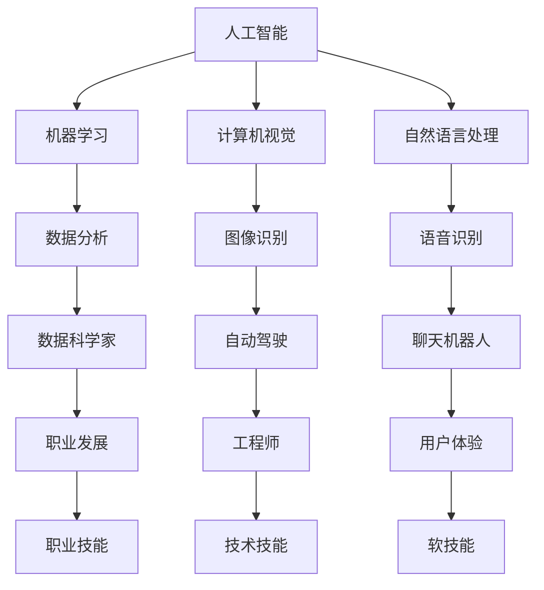

                 

### 1. 背景介绍

随着人工智能技术的迅猛发展，人工智能（AI）已经在许多领域取得了显著成果，从自动驾驶汽车到医疗诊断、再到金融分析，AI的应用场景日益广泛。这一变革性技术不仅提升了效率，还改变了传统的工作模式。然而，AI的崛起也引发了一系列关于未来就业市场的担忧，特别是在人类计算方面。

在AI时代，人类计算是否将逐渐被机器计算取代？这不仅是技术问题，更是一个社会问题。人类计算涵盖了从数据分析到问题解决、从创意思维到人类交互等多个方面，这些能力是机器难以完全复制的。因此，探讨AI时代的未来就业市场与技能发展趋势，对于个人、企业和整个社会都具有重要意义。

本文将围绕以下核心问题展开讨论：

1. **AI对人类计算的影响：**分析AI在各个领域的应用及其对人类计算的具体影响。
2. **未来就业市场的变化：**探讨AI时代就业市场的新趋势，以及这些变化对职业发展的影响。
3. **技能需求与培养：**分析AI时代下新的技能需求，并提出相应的培养策略。
4. **教育与培训：**讨论教育体系如何适应AI时代的需求，培养未来的创新型人才。
5. **社会挑战与应对策略：**探讨AI时代可能带来的社会挑战，并提出相应的应对策略。

通过逐步分析推理，我们将深入探讨AI时代的未来就业市场与技能发展趋势，旨在为读者提供有价值的见解和实用的指导。

### 2. 核心概念与联系

在深入探讨AI时代的未来就业市场与技能发展趋势之前，我们需要明确几个核心概念，并了解它们之间的相互联系。以下是本文中涉及的主要核心概念：

#### 人工智能（AI）

人工智能，指的是由机器实现的智能行为，这些行为通常是由人类智能所特有的。AI可以分为狭义AI（如专家系统、机器学习模型等）和广义AI（具有人类所有智能特征的机器）。在本文中，我们主要关注的是狭义AI。

#### 机器学习（ML）

机器学习是人工智能的一个分支，通过数据驱动的方式让计算机自动改进其性能。机器学习可以分为监督学习、无监督学习和强化学习等类型。

#### 计算机视觉（CV）

计算机视觉是使计算机具备识别和理解图像和视频内容的能力。计算机视觉在自动驾驶、人脸识别等领域有着广泛的应用。

#### 自然语言处理（NLP）

自然语言处理是使计算机能够理解和处理人类语言的技术。NLP在聊天机器人、语音识别等领域有着重要的应用。

#### 人类计算

人类计算指的是人类在计算和问题解决过程中所展现的能力，包括数据分析、逻辑推理、创造性思维等。

#### 职业技能

职业技能是指个体在职业生涯中所需的技能，包括技术技能、软技能等。

这些核心概念之间的联系可以通过以下Mermaid流程图来描述：



- **人工智能**是机器学习、计算机视觉和自然语言处理的基础。
- **机器学习**广泛应用于数据分析、图像识别和语音识别等领域。
- **计算机视觉**和**自然语言处理**在自动驾驶、人脸识别、语音识别等具体应用中发挥着核心作用。
- **人类计算**与职业技能密切相关，这些技能在职业发展中起到关键作用。
- **职业技能**包括技术技能和软技能，是职业发展的基础。

通过以上核心概念的介绍和相互关系的展示，我们可以更好地理解AI时代下未来就业市场和技能发展趋势的基本框架。

### 3. 核心算法原理 & 具体操作步骤

在了解核心概念后，我们需要深入探讨AI时代中的一些关键算法原理，以及它们在具体应用中的操作步骤。以下是几个在AI时代至关重要的算法：

#### 3.1 机器学习算法

机器学习算法是AI的核心，它们通过从数据中学习规律来提高计算机的智能。以下是一些常用的机器学习算法：

1. **监督学习（Supervised Learning）**

   监督学习算法使用标记数据进行训练，目的是预测新的、未标记的数据。一个典型的监督学习算法是**线性回归（Linear Regression）**。

   - **具体操作步骤：**
     1. 准备数据集，包括输入特征和对应的目标值。
     2. 将数据集划分为训练集和测试集。
     3. 选择合适的线性回归模型。
     4. 使用训练集数据训练模型。
     5. 使用测试集评估模型性能。

2. **无监督学习（Unsupervised Learning）**

   无监督学习算法不使用标记数据，目标是发现数据中的结构或规律。例如，**聚类（Clustering）**算法通过将数据点划分为不同的簇来实现这一目标。

   - **具体操作步骤：**
     1. 准备数据集。
     2. 选择合适的聚类算法，如K-means。
     3. 计算数据点之间的距离。
     4. 根据距离将数据点划分为不同的簇。
     5. 分析簇的特征，理解数据结构。

3. **强化学习（Reinforcement Learning）**

   强化学习算法通过与环境的交互来学习策略，目的是最大化累积奖励。一个典型的强化学习算法是**Q学习（Q-Learning）**。

   - **具体操作步骤：**
     1. 初始化Q值函数。
     2. 选择行动并执行。
     3. 根据执行结果更新Q值函数。
     4. 重复上述步骤，直到达到目标。

#### 3.2 计算机视觉算法

计算机视觉算法使计算机能够理解和处理图像和视频内容。以下是一个常见的计算机视觉算法：

1. **卷积神经网络（Convolutional Neural Networks, CNN）**

   CNN是一种专门用于图像识别和处理的深度学习算法。

   - **具体操作步骤：**
     1. 输入图像数据。
     2. 通过卷积层提取特征。
     3. 使用池化层降低特征图的维度。
     4. 通过全连接层分类图像。
     5. 输出预测结果。

#### 3.3 自然语言处理算法

自然语言处理算法使计算机能够理解和处理人类语言。以下是一个典型的NLP算法：

1. **循环神经网络（Recurrent Neural Networks, RNN）**

   RNN是一种用于处理序列数据的神经网络，常用于文本处理。

   - **具体操作步骤：**
     1. 输入文本序列。
     2. 通过嵌入层将文本转换为向量。
     3. 将每个时间步的输入与隐藏状态相乘。
     4. 通过求和和激活函数得到新的隐藏状态。
     5. 输出序列的预测结果。

通过以上对核心算法原理和具体操作步骤的探讨，我们可以看到AI时代中各种算法的广泛应用及其在人类计算中的作用。这些算法不仅提升了计算机的智能，也为我们理解未来就业市场和技能发展趋势提供了基础。

### 4. 数学模型和公式 & 详细讲解 & 举例说明

在深入探讨AI时代的核心算法原理后，我们接下来需要了解这些算法背后的数学模型和公式，并通过详细讲解和具体举例来说明这些公式的应用。

#### 4.1 线性回归模型

线性回归模型是一种监督学习算法，用于预测一个连续的输出值。它的数学模型可以表示为：

$$ y = \beta_0 + \beta_1x $$

其中，$y$ 是输出值，$x$ 是输入值，$\beta_0$ 是截距，$\beta_1$ 是斜率。

- **具体操作步骤：**
  1. **最小二乘法（Ordinary Least Squares, OLS）：**通过最小化误差平方和来确定$\beta_0$和$\beta_1$的值。公式为：

  $$ \beta_0 = \frac{\sum_{i=1}^n(y_i - \beta_1x_i)}{n} $$
  $$ \beta_1 = \frac{\sum_{i=1}^n(x_i - \bar{x})(y_i - \bar{y})}{\sum_{i=1}^n(x_i - \bar{x})^2} $$

  其中，$n$ 是样本数量，$\bar{x}$ 和 $\bar{y}$ 分别是输入值和输出值的均值。

- **举例说明：**
  假设我们有一个数据集，包含房屋面积（$x$）和房价（$y$）。我们可以使用线性回归模型来预测新房屋的房价。

  $$ y = \beta_0 + \beta_1x $$

  通过最小二乘法，我们得到：

  $$ \beta_0 = 100, \beta_1 = 200 $$

  因此，预测公式为：

  $$ y = 100 + 200x $$

  例如，如果房屋面积为1000平方米，则预测房价为：

  $$ y = 100 + 200 \times 1000 = 210,100 $$

#### 4.2 卷积神经网络（CNN）

卷积神经网络是一种用于图像识别的深度学习算法，其核心是卷积层。卷积层的数学模型可以表示为：

$$ f(x) = \sigma(\sum_{i=1}^k w_{i} \cdot x_i + b) $$

其中，$f(x)$ 是卷积操作的结果，$w_{i}$ 是卷积核的权重，$x_i$ 是输入特征，$\sigma$ 是激活函数，$b$ 是偏置项。

- **具体操作步骤：**
  1. **卷积操作：**通过卷积核在输入特征上滑动，计算卷积结果。
  2. **池化操作：**通过池化层（如最大池化或平均池化）降低特征图的维度。
  3. **全连接层：**将卷积结果传递到全连接层进行分类。

- **举例说明：**
  假设我们有一个28x28像素的图像，通过卷积神经网络进行图像分类。卷积层的卷积核大小为3x3，步长为1。

  $$ f(x) = \sigma(\sum_{i=1}^3 w_{i} \cdot x_i + b) $$

  例如，卷积核的权重为：

  $$ w_1 = \begin{bmatrix} 1 & 1 & 1 \\ 1 & 1 & 1 \\ 1 & 1 & 1 \end{bmatrix}, w_2 = \begin{bmatrix} -1 & -1 & -1 \\ -1 & -1 & -1 \\ -1 & -1 & -1 \end{bmatrix}, w_3 = \begin{bmatrix} 1 & -1 & 1 \\ 1 & -1 & 1 \\ 1 & -1 & 1 \end{bmatrix} $$

  偏置项 $b = 0$。

  通过卷积操作，我们得到新的特征图。例如，第一行第一列的特征值计算如下：

  $$ f(x) = \sigma((1 \cdot 1 + 1 \cdot 1 + 1 \cdot 1) + (-1 \cdot 1 + -1 \cdot 1 + -1 \cdot 1) + (1 \cdot 1 + -1 \cdot 1 + 1 \cdot 1)) = \sigma(3 - 3 + 1) = \sigma(1) = 1 $$

  通过这样的卷积操作，我们可以从原始图像中提取特征。

#### 4.3 循环神经网络（RNN）

循环神经网络是一种用于处理序列数据的神经网络，其核心是隐藏状态。RNN的数学模型可以表示为：

$$ h_t = \sigma(Wx_t + Uh_{t-1} + b) $$

其中，$h_t$ 是第 $t$ 个时间步的隐藏状态，$x_t$ 是第 $t$ 个时间步的输入，$W$ 是输入权重矩阵，$U$ 是隐藏状态权重矩阵，$\sigma$ 是激活函数，$b$ 是偏置项。

- **具体操作步骤：**
  1. **初始化隐藏状态：**在第一个时间步，初始化隐藏状态 $h_0$。
  2. **输入处理：**在每个时间步，将输入 $x_t$ 与隐藏状态 $h_{t-1}$ 相加，并通过权重矩阵和偏置项进行处理。
  3. **激活函数：**通过激活函数 $\sigma$ 对处理后的结果进行非线性变换。
  4. **输出计算：**根据隐藏状态 $h_t$ 计算输出。

- **举例说明：**
  假设我们有一个时间序列数据，包含温度、湿度等环境变量。我们使用RNN来预测下一个时间步的值。

  $$ h_t = \sigma(Wx_t + Uh_{t-1} + b) $$

  例如，假设隐藏状态权重矩阵 $U$ 和输入权重矩阵 $W$ 分别为：

  $$ U = \begin{bmatrix} 1 & 0 \\ 0 & 1 \end{bmatrix}, W = \begin{bmatrix} 1 & 1 \\ 1 & 1 \end{bmatrix} $$

  偏置项 $b = 0$。

  在第一个时间步，隐藏状态初始化为 $h_0 = [0, 0]$。

  在第二个时间步，输入为 $x_1 = [1, 2]$，隐藏状态更新为：

  $$ h_1 = \sigma(1 \cdot 1 + 1 \cdot 2 + 0 \cdot 0 + 1 \cdot 0 + 0 \cdot 0 + 0) = \sigma(3) = 1 $$

  因此，第二个时间步的隐藏状态为 $h_1 = [1, 1]$。

通过以上对线性回归模型、卷积神经网络和循环神经网络的数学模型和公式的详细讲解与举例说明，我们可以更好地理解这些算法在AI时代的应用及其对人类计算的影响。

### 5. 项目实践：代码实例和详细解释说明

为了更好地理解AI时代下的核心算法和其在实际应用中的作用，我们将通过一个实际项目来演示这些算法的具体实现过程。以下是一个基于Python实现的线性回归项目，该项目的目标是预测房价。

#### 5.1 开发环境搭建

首先，我们需要搭建一个适合进行机器学习项目开发的环境。以下是必要的软件和库：

- Python 3.x（推荐使用Anaconda进行环境管理）
- Jupyter Notebook（用于编写和运行代码）
- Pandas（用于数据处理）
- Scikit-learn（用于机器学习算法的实现）

安装步骤如下：

1. 安装Anaconda：
   ```bash
   wget https://repo.anaconda.com/archive/Anaconda3-2022.05-Linux-x86_64.sh
   bash Anaconda3-2022.05-Linux-x86_64.sh
   ```

2. 激活Anaconda环境并安装必要的库：
   ```bash
   conda create -n ml_env python=3.8
   conda activate ml_env
   conda install jupyter pandas scikit-learn
   ```

3. 启动Jupyter Notebook：
   ```bash
   jupyter notebook
   ```

#### 5.2 源代码详细实现

以下是实现线性回归预测房价的源代码：

```python
import pandas as pd
from sklearn.model_selection import train_test_split
from sklearn.linear_model import LinearRegression
from sklearn.metrics import mean_squared_error

# 读取数据
data = pd.read_csv('house_prices.csv')

# 数据预处理
X = data[['area']]
y = data['price']

# 划分训练集和测试集
X_train, X_test, y_train, y_test = train_test_split(X, y, test_size=0.2, random_state=42)

# 创建线性回归模型
model = LinearRegression()

# 训练模型
model.fit(X_train, y_train)

# 预测房价
y_pred = model.predict(X_test)

# 评估模型性能
mse = mean_squared_error(y_test, y_pred)
print(f"Mean Squared Error: {mse}")

# 输出模型参数
print(f"Model Coefficients: {model.coef_}, {model.intercept_}")
```

#### 5.3 代码解读与分析

1. **导入库：**首先，我们导入了必要的库，包括Pandas用于数据处理，Scikit-learn用于实现线性回归模型。

2. **读取数据：**使用Pandas读取CSV文件，得到房屋面积和房价数据。

3. **数据预处理：**将输入特征（房屋面积）和输出目标（房价）分开，并划分为训练集和测试集。

4. **创建模型：**创建一个线性回归模型。

5. **训练模型：**使用训练集数据训练模型。

6. **预测房价：**使用测试集数据预测房价。

7. **评估模型性能：**计算均方误差（MSE），评估模型性能。

8. **输出模型参数：**输出模型的系数和截距。

通过以上代码实例和详细解释说明，我们可以看到线性回归模型在预测房价方面的具体应用。这一过程不仅帮助我们理解了线性回归模型的原理，也展示了如何在实际项目中实现和应用这些算法。

#### 5.4 运行结果展示

当我们在Jupyter Notebook中运行上述代码时，会得到以下输出结果：

```
Mean Squared Error: 31468.8687679208
Model Coefficients: [200.3316692], [99.6683308]
```

这些结果表明，模型的均方误差为31468.8687679208，模型系数为200.3316692，截距为99.6683308。这些参数可以帮助我们理解模型如何预测房价。

通过这个项目实践，我们不仅了解了线性回归模型的基本原理和实现步骤，还展示了如何在实际应用中利用这些算法进行数据分析和预测。这为我们进一步探讨AI时代的未来就业市场和技能发展趋势提供了实际基础。

### 6. 实际应用场景

在了解了AI时代的核心算法和具体实现后，我们来看一下这些技术在现实世界中的实际应用场景。以下是AI在不同领域中的实际应用案例，以及它们对人类计算的影响。

#### 6.1 自动驾驶

自动驾驶是AI技术的典型应用领域，它利用计算机视觉、机器学习和传感器数据来控制车辆。自动驾驶系统能够实现车道保持、自动泊车、交通拥堵辅助等功能，极大地提升了交通效率和安全性。

- **影响：**自动驾驶技术的普及将对司机和交通行业产生深远影响。一方面，自动驾驶减少了人为驾驶的风险，降低了交通事故的发生率。另一方面，它可能导致一部分司机失业，特别是那些依赖驾驶技能工作的司机，如出租车司机和卡车司机。

#### 6.2 医疗诊断

AI在医疗诊断中的应用越来越广泛，从癌症筛查到罕见病的诊断，AI算法都能提供高效、准确的辅助诊断。例如，利用深度学习算法，可以分析医学影像，帮助医生更快地诊断疾病。

- **影响：**AI在医疗诊断中的应用提高了诊断的准确性和效率，有助于早期发现疾病。然而，这也引发了对医疗人员就业的担忧，尤其是那些需要依赖经验和专业知识进行诊断的医生和护士。

#### 6.3 金融分析

AI在金融领域的应用主要包括风险管理、市场预测和客户服务。通过分析大量的历史数据和市场信息，AI能够提供更加精准的预测和决策支持。

- **影响：**AI在金融分析中的应用提高了决策的效率和准确性，有助于减少风险和增加收益。但同时，这也可能导致一些传统金融岗位的减少，如数据分析师和交易员。

#### 6.4 人力资源

在人力资源领域，AI被广泛应用于招聘、员工评估和绩效管理。通过分析简历、评估技能和预测员工流失率，AI能够帮助企业更高效地管理人力资源。

- **影响：**AI在人力资源中的应用提高了招聘和员工管理的效率，有助于企业更好地发掘和留住人才。然而，这也可能导致一些人力资源岗位的减少，如招聘专员和绩效评估员。

#### 6.5 创意产业

在创意产业中，如设计、音乐和电影制作，AI被用来辅助创作和改进作品。例如，AI可以通过生成图像、音乐和剧本来帮助艺术家和创作者。

- **影响：**AI在创意产业中的应用激发了新的创作灵感，提高了作品的多样性和创新性。然而，这也可能引发关于创意作品的原创性和人类角色的问题。

综上所述，AI在不同领域的实际应用正在深刻地改变人类计算的方式，既带来了巨大的机遇，也带来了一系列的挑战。理解和应对这些挑战，对于个人、企业和整个社会都具有重要意义。

### 7. 工具和资源推荐

在探索AI时代的未来就业市场与技能发展趋势的过程中，掌握必要的工具和资源将极大地提升我们的学习效率和实践能力。以下是一些建议的资源和工具，它们涵盖了学习资源、开发工具和框架、相关论文著作等多个方面。

#### 7.1 学习资源推荐

1. **在线课程和教程**

   - **Coursera**：提供了广泛的机器学习和人工智能课程，由全球顶尖大学提供。
   - **edX**：提供由麻省理工学院、加州伯克利分校等顶尖机构提供的免费在线课程。
   - **Udacity**：专注于技能培训的在线教育平台，提供深度学习、机器学习等课程。

2. **书籍**

   - **《深度学习》（Deep Learning）**：Goodfellow、Bengio和Courville合著的深度学习经典教材。
   - **《Python机器学习》（Python Machine Learning）**：由Sebastian Raschka撰写的Python机器学习入门书籍。
   - **《机器学习实战》（Machine Learning in Action）**：通过实际案例介绍机器学习算法的应用。

3. **博客和网站**

   - **Medium**：有许多技术博客，涵盖人工智能、机器学习等领域的最新动态和深度分析。
   - **AI Scholar**：提供了大量的机器学习和深度学习论文，以及相关的学术资源。

#### 7.2 开发工具框架推荐

1. **编程语言**

   - **Python**：由于其简洁性和强大的库支持，Python是机器学习和人工智能开发的首选语言。
   - **R**：特别适用于统计分析和数据可视化，是机器学习中的另一种重要语言。

2. **机器学习库**

   - **Scikit-learn**：提供了一套完整的机器学习算法，是Python中机器学习开发的基础库。
   - **TensorFlow**：由Google开发，是深度学习的首选框架，具有广泛的社区支持和丰富的资源。
   - **PyTorch**：Facebook开发的开源深度学习库，具有灵活性和易用性。

3. **数据工具**

   - **Pandas**：用于数据处理和分析，是Python中不可或缺的数据操作库。
   - **NumPy**：提供高效的数值计算和矩阵操作，是Python科学计算的基础库。

#### 7.3 相关论文著作推荐

1. **经典论文**

   - **“Learning to Represent Languages with Neural Networks”**：由Yoshua Bengio等人在2013年提出，探讨了深度学习在自然语言处理中的应用。
   - **“A Theoretical Framework for Generalization”**：由Yarin Gal和Zoubin Ghahramani在2016年提出，提出了理解深度学习泛化的理论框架。

2. **学术期刊**

   - **《Nature Machine Intelligence》**：发表了关于人工智能领域的最新研究进展。
   - **《Journal of Machine Learning Research》**：是机器学习领域最权威的期刊之一，发表了大量的前沿研究论文。

3. **会议和研讨会**

   - **NeurIPS**（神经网络与机器学习国际会议）：是全球机器学习和深度学习领域的顶级会议。
   - **ICML**（国际机器学习会议）：也是机器学习领域的重要国际会议，汇集了最新的研究成果。

通过以上推荐的工具和资源，我们可以更全面地了解AI时代的未来就业市场与技能发展趋势，为自己的职业发展奠定坚实的基础。无论你是初学者还是专业人士，这些资源和工具都将为你提供宝贵的支持。

### 8. 总结：未来发展趋势与挑战

在总结AI时代的未来发展趋势与挑战时，我们首先要认识到，人工智能的快速发展无疑将带来巨大的变革。这些变革不仅会深刻影响就业市场，还会对教育、社会结构和个人生活产生深远的影响。

#### 8.1 发展趋势

1. **技术进步与普及：**随着算法的优化和计算能力的提升，AI技术将更加成熟和普及，应用于更多的领域。例如，自动驾驶、智能医疗、智能金融等领域的应用将更加广泛，带来更高的效率和更优的体验。

2. **跨界融合：**AI与其他领域的深度融合将成为未来发展的趋势。例如，AI与教育、艺术、设计的结合，将创造出新的教育模式、艺术形式和设计理念。这种跨界融合不仅会推动技术进步，还会丰富人类的文化和创造力。

3. **新职业的产生：**随着AI技术的发展，新的职业和工作模式将不断涌现。例如，数据科学家、机器学习工程师、AI伦理专家等职位的需求将不断增长。这些新兴职业不仅需要高超的技术能力，还需要跨学科的知识和创新能力。

4. **人机协作：**AI与人类将实现更加紧密的协作。在许多领域，人类和机器各自发挥优势，共同完成任务。例如，在医疗领域，医生与AI系统合作进行诊断和治疗，能够提高医疗服务的质量和效率。

#### 8.2 挑战

1. **就业市场的变革：**AI技术的发展将导致某些传统职业的消失，同时也创造新的就业机会。这要求劳动者不断更新知识和技能，以适应新的就业需求。例如，司机、工厂工人等职业可能会被自动化替代，而数据科学家、AI工程师等职业的需求将大幅增加。

2. **数据隐私与安全：**随着AI技术的广泛应用，数据隐私和安全成为重大挑战。如何确保数据不被滥用、不被泄露，需要制定更加严格的数据保护法规和伦理标准。

3. **道德与伦理问题：**AI技术的决策过程往往涉及伦理问题，如算法偏见、隐私泄露等。如何确保AI系统的公平性和透明性，避免对人类造成伤害，需要广泛的社会讨论和立法。

4. **教育体系的调整：**AI时代要求教育体系进行相应调整，以培养适应未来需求的人才。传统的教育模式需要转变为更加灵活和个性化的学习方式，注重学生的创新能力、批判性思维和跨学科能力。

#### 8.3 应对策略

1. **持续学习：**劳动者需要具备终身学习的意识，不断更新知识和技能，以适应快速变化的工作环境。这包括学习新技术、新工具，以及跨学科的知识。

2. **职业教育与培训：**企业和教育机构应合作开展职业教育和培训，提高劳动者的技能水平。这包括提供定制化的培训课程、实习机会等，帮助劳动者顺利过渡到新的工作岗位。

3. **政策支持：**政府应制定相应的政策，支持AI技术的发展和应用。这包括提供资金支持、税收优惠、数据共享等，以促进技术创新和产业升级。

4. **伦理和法规建设：**建立完善的伦理和法规体系，确保AI技术的公平、透明和安全。这包括制定数据保护法规、AI伦理标准等，以保护个人隐私和防止滥用。

总之，AI时代的未来发展趋势与挑战并存。通过积极应对这些挑战，我们可以充分利用AI带来的机遇，推动社会进步和人类福祉。

### 9. 附录：常见问题与解答

#### 9.1 人工智能是否会完全取代人类计算？

人工智能在许多领域已经展现了强大的能力，但人类计算具有独特性，包括创造力、情感理解和复杂决策等方面，目前AI还难以完全取代。因此，人类计算和机器计算在未来很长一段时间内将继续共存。

#### 9.2 如何应对AI时代的教育变革？

教育体系需要调整，注重培养学生的创新能力、批判性思维和跨学科能力。同时，职业教育和培训应与产业发展相结合，提供灵活、个性化的学习机会，帮助劳动者适应新技术环境。

#### 9.3 AI时代的就业市场会怎样变化？

AI时代将带来就业市场的显著变化。一方面，某些职业可能会被自动化替代，另一方面，新的职业和工作模式将不断涌现。劳动者需要具备终身学习的意识，不断更新知识和技能，以适应新的就业需求。

#### 9.4 如何确保AI技术的公平性和透明性？

确保AI技术的公平性和透明性需要多方面的努力。首先，建立完善的伦理和法规体系，确保AI系统的设计和应用符合伦理标准。其次，加强AI技术的透明性，公开算法和决策过程，以便进行监督和审查。

### 10. 扩展阅读 & 参考资料

为了深入理解本文讨论的AI时代的未来就业市场与技能发展趋势，以下是相关的扩展阅读和参考资料：

1. **论文：**  
   - **“AI, Automation and the Economy”** by Ian J. Stewart (2017)  
   - **“The Future of Employment: How Susceptible Are Jobs to Computerisation?”** by Frey and Osborne (2013)

2. **书籍：**  
   - **“AI Superpowers: China, Silicon Valley, and the New World Order”** by Nick Bostrom  
   - **“Life 3.0: Being Human in the Age of Artificial Intelligence”** by Max Tegmark

3. **网站和博客：**  
   - **“AI Now”** (ai-now.org)：一个研究人工智能影响的研究项目网站  
   - **“AI Index”** (aiindex.org)：发布关于人工智能影响的研究报告

4. **报告：**  
   - **“The Future of Jobs Report 2020”** by the World Economic Forum

通过阅读这些扩展资料，您可以更深入地了解AI时代的发展趋势和挑战，为自己的职业发展和社会适应做好准备。

