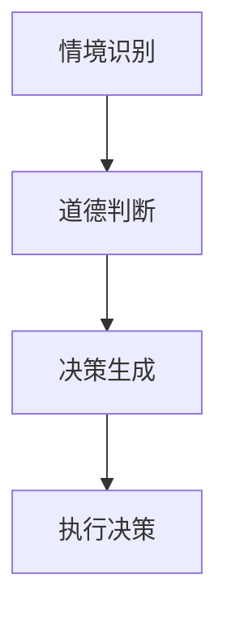
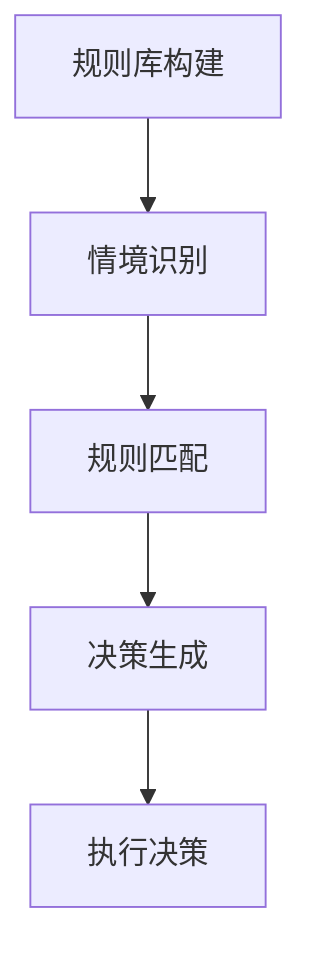
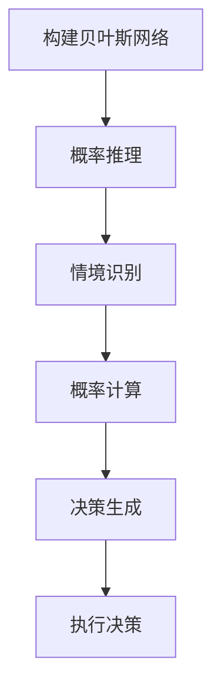
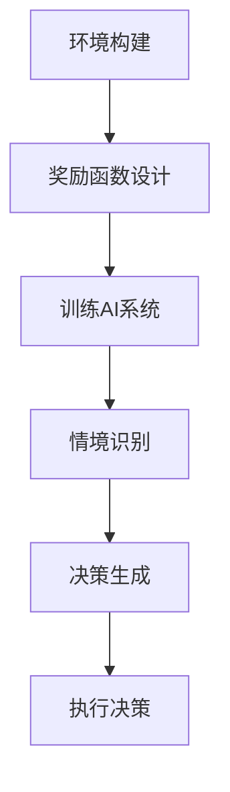

                 

### 1. 背景介绍

在当今技术飞速发展的时代，人工智能（AI）已经成为驱动社会进步的重要力量。AI技术不仅在数据处理、自动化、预测分析等方面展现出强大的能力，还在医疗、金融、教育等多个领域带来了深远的影响。然而，随着AI技术的广泛应用，人们开始关注AI伦理和道德问题，尤其是AI的代理性和责任问题。

道德代理（Moral Agent）是指在行为中表现出道德责任能力的实体。在人类社会中，道德代理通常指具备自主意识、道德判断能力和行为选择能力的个体。在AI领域，道德代理意味着让AI系统具备一定的道德素养和责任感，能够在复杂环境下做出符合道德准则的决策。

AI时代的道德代理和责任问题主要包括以下几个方面：

1. **自主决策与伦理冲突**：当AI系统面临伦理冲突时，如何做出符合道德规范的决策。
2. **算法偏见与公平性**：AI算法可能因为数据集的不公正导致决策结果对某些群体存在偏见，如何确保算法的公平性。
3. **透明性与可解释性**：如何使AI系统的决策过程透明，以便人们能够理解和信任AI的行为。
4. **责任归属**：当AI系统造成损害时，如何明确责任归属，避免责任推卸。

本文旨在探讨AI时代的道德代理和责任问题，通过分析AI技术的核心概念、算法原理、数学模型以及实际应用场景，提出解决这些问题的方法和策略。本文还将推荐一些相关的学习资源和工具，帮助读者深入了解这一领域。

本文结构如下：

1. **背景介绍**：简要介绍AI技术的背景和道德代理的重要性。
2. **核心概念与联系**：详细阐述道德代理的定义、道德计算框架及其在AI中的应用。
3. **核心算法原理 & 具体操作步骤**：介绍常见的道德代理算法，并分步骤讲解其实现方法。
4. **数学模型和公式 & 详细讲解 & 举例说明**：阐述支持道德代理的数学模型和公式，并通过实例进行说明。
5. **项目实践：代码实例和详细解释说明**：提供实际的代码示例，详细解读代码实现过程。
6. **实际应用场景**：分析道德代理在现实世界中的应用场景和挑战。
7. **工具和资源推荐**：推荐一些学习道德代理和AI伦理的资源和工具。
8. **总结：未来发展趋势与挑战**：总结本文内容，展望未来发展趋势和挑战。
9. **附录：常见问题与解答**：解答一些关于道德代理和AI伦理的常见问题。
10. **扩展阅读 & 参考资料**：提供相关的扩展阅读材料，以便读者深入了解。

接下来，我们将逐一探讨这些主题，通过逐步分析推理的方式，为读者呈现一个全面、深入的道德代理和AI责任问题探讨。

### 2. 核心概念与联系

为了深入探讨AI时代的道德代理和责任问题，我们首先需要明确一些核心概念，并理解它们之间的联系。

#### 道德代理的定义

道德代理是指那些在行为中能够表现出道德责任能力的实体。这些实体可以是人类，也可以是具有高度智能的机器。道德代理通常具备以下特征：

- **自主性**：道德代理能够独立做出决策，不受外部强制的影响。
- **道德认知**：道德代理能够理解和识别道德问题，并在行为中考虑道德准则。
- **责任感**：道德代理对其行为后果承担责任。

在人类社会中，道德代理是最具代表性的例子，即人类个体。而在AI领域，道德代理的实现则是一个极具挑战性的任务。因为尽管AI系统在数据处理和模式识别方面表现出色，但它们缺乏情感和意识，难以完全理解复杂的道德问题。

#### 道德计算框架

道德计算框架是用于指导AI系统在决策过程中考虑道德问题的方法论。这个框架通常包含以下几个关键要素：

1. **道德准则**：这些是制定决策时需要遵循的道德规范。例如，在自动驾驶汽车中，如何平衡乘客的安全与行人的生命权。
2. **道德推理**：这是将道德准则应用于具体情境，以指导决策的过程。道德推理需要考虑情境的复杂性，并权衡不同的道德价值。
3. **决策模型**：这是实现道德推理的数学和算法模型。通过这些模型，AI系统能够在特定情境下生成符合道德准则的决策。

道德计算框架的核心是确保AI系统能够在其行为中体现出道德责任。这不仅要求AI系统能够理解道德准则，还需要能够将这些准则有效地应用于实际情境中。

#### 道德代理在AI中的应用

在AI系统中实现道德代理，通常需要以下几个步骤：

1. **情境识别**：AI系统需要能够识别当前所处的情境，这通常依赖于感知模块，如摄像头、传感器等。
2. **道德判断**：基于识别的情境，AI系统需要运用道德准则进行判断。这需要AI系统具备一定的道德认知能力。
3. **决策生成**：在道德判断的基础上，AI系统需要生成具体的行动决策。这通常是一个复杂的过程，需要综合考虑各种因素。

以下是一个简化的Mermaid流程图，展示道德代理在AI系统中的应用流程：



- **情境识别**：AI系统通过感知模块收集信息，识别当前情境。
- **道德判断**：AI系统运用道德准则对情境进行分析，做出道德判断。
- **决策生成**：基于道德判断，AI系统生成具体的行动决策。
- **执行决策**：AI系统执行生成的决策，实现预期的道德行为。

#### 道德代理与AI责任

道德代理的实现不仅仅是技术问题，还涉及AI责任问题。在AI系统造成损害时，如何明确责任归属是一个重要议题。以下是一些关于AI责任的关键点：

1. **责任归属**：当AI系统造成损害时，需要明确责任归属。这通常涉及法律、伦理和技术等多个方面。
2. **责任分担**：在多人参与AI系统开发和部署的情况下，如何合理分担责任也是一个挑战。
3. **责任保险**：为AI系统提供责任保险，以减轻因AI系统造成损害而带来的经济风险。

总之，道德代理和AI责任问题是AI技术发展中不可忽视的重要议题。通过深入探讨这些核心概念和联系，我们可以更好地理解道德代理在AI中的应用，并为解决这些挑战提供有效的策略。

### 3. 核心算法原理 & 具体操作步骤

在探讨道德代理的实现过程中，算法原理是关键的一环。本文将介绍几种常见的道德代理算法，并详细描述其操作步骤，以帮助读者理解这些算法如何在实际应用中发挥作用。

#### 3.1 基于规则的道德代理算法

基于规则的道德代理算法是最简单的一种方法，它通过预定义的规则来指导AI系统的行为。以下是该算法的操作步骤：

1. **规则库构建**：
   - 收集相关的道德准则，并将其转换为具体的规则。
   - 例如，规则可以是：“如果行人即将穿过马路，则车辆必须减速”。

2. **情境识别**：
   - AI系统通过感知模块收集当前情境的数据。
   - 例如，使用摄像头识别行人的位置和速度。

3. **规则匹配**：
   - 对收集到的情境数据与规则库中的规则进行匹配。
   - 如果匹配成功，则根据匹配到的规则生成决策。

4. **决策生成**：
   - 基于匹配到的规则，AI系统生成具体的行动决策。
   - 例如，如果规则匹配到行人即将穿过马路，则车辆减速。

5. **执行决策**：
   - AI系统执行生成的决策。
   - 例如，控制车辆减速，确保行人的安全。

以下是一个简化的流程图，展示基于规则的道德代理算法的操作步骤：



#### 3.2 基于贝叶斯网络的道德代理算法

基于贝叶斯网络的道德代理算法是一种更复杂的道德代理方法，它通过概率关系来指导AI系统的行为。以下是该算法的操作步骤：

1. **构建贝叶斯网络**：
   - 收集相关的道德准则和情境信息，构建贝叶斯网络。
   - 贝叶斯网络中的节点代表情境因素，边代表这些因素之间的概率关系。

2. **概率推理**：
   - 使用贝叶斯网络进行概率推理，以确定当前情境下的道德判断。
   - 例如，如果某个情境的概率高于阈值，则认为该情境符合道德准则。

3. **情境识别**：
   - AI系统通过感知模块收集当前情境的数据。

4. **概率计算**：
   - 对收集到的情境数据在贝叶斯网络中进行概率计算，以确定道德判断。

5. **决策生成**：
   - 基于概率计算结果，AI系统生成具体的行动决策。

6. **执行决策**：
   - AI系统执行生成的决策。

以下是一个简化的流程图，展示基于贝叶斯网络的道德代理算法的操作步骤：



#### 3.3 基于强化学习的道德代理算法

基于强化学习的道德代理算法通过让AI系统在环境中学习来指导其行为。以下是该算法的操作步骤：

1. **环境构建**：
   - 创建一个模拟环境，用于训练和测试AI系统。

2. **奖励函数设计**：
   - 设计一个奖励函数，用于评估AI系统行为的道德性。
   - 例如，如果AI系统做出了符合道德准则的决策，则给予正奖励。

3. **训练AI系统**：
   - 使用强化学习算法训练AI系统，使其在环境中学习如何做出道德决策。
   - 例如，使用Q-Learning或深度强化学习算法。

4. **情境识别**：
   - AI系统通过感知模块收集当前情境的数据。

5. **决策生成**：
   - 基于收集到的情境数据和训练得到的模型，AI系统生成具体的行动决策。

6. **执行决策**：
   - AI系统执行生成的决策。

以下是一个简化的流程图，展示基于强化学习的道德代理算法的操作步骤：



综上所述，这些道德代理算法各有优缺点。基于规则的算法简单易实现，但缺乏灵活性；基于贝叶斯网络的算法能够处理复杂的概率关系，但构建过程复杂；基于强化学习的算法具有高度的灵活性和自适应能力，但训练过程较长且需要大量的数据。在实际应用中，可以根据具体需求和场景选择合适的算法。

### 4. 数学模型和公式 & 详细讲解 & 举例说明

在讨论道德代理和AI责任问题时，数学模型和公式起着至关重要的作用。这些模型不仅能够帮助我们更好地理解道德代理的决策过程，还能为实际应用提供量化的依据。下面我们将详细讲解一些支持道德代理的数学模型和公式，并通过实例进行说明。

#### 4.1 道德权重模型

道德权重模型用于确定在决策过程中各个道德准则的相对重要性。该模型通过给不同的道德准则分配权重，来指导AI系统的行为。

**公式：**

$$
W = \sum_{i=1}^{n} w_i \cdot p_i
$$

其中，\(W\) 是总道德权重，\(w_i\) 是第 \(i\) 个道德准则的权重，\(p_i\) 是第 \(i\) 个道德准则的概率。

**参数解释：**

- \(w_i\)：道德准则的权重，反映了该准则在决策中的重要性。
- \(p_i\)：道德准则的概率，反映了该准则在当前情境下的可能性。

**实例说明：**

假设一个自动驾驶汽车系统需要做出以下道德决策：

1. **乘客安全**：确保乘客安全。
2. **行人安全**：避免撞到行人。

我们可以为这两个准则分配权重，并计算总道德权重：

- \(w_1 = 0.6\)（乘客安全权重）
- \(w_2 = 0.4\)（行人安全权重）
- \(p_1 = 0.8\)（乘客安全概率）
- \(p_2 = 0.2\)（行人安全概率）

计算总道德权重：

$$
W = 0.6 \cdot 0.8 + 0.4 \cdot 0.2 = 0.48 + 0.08 = 0.56
$$

根据总道德权重，我们可以得出当前情境下应该优先考虑乘客安全。

#### 4.2 道德成本模型

道德成本模型用于评估在决策过程中各个道德准则的潜在损失。该模型通过计算不同决策带来的道德成本，帮助AI系统选择最优的道德行为。

**公式：**

$$
C = \sum_{i=1}^{n} c_i \cdot p_i
$$

其中，\(C\) 是总道德成本，\(c_i\) 是第 \(i\) 个道德准则的道德成本，\(p_i\) 是第 \(i\) 个道德准则的概率。

**参数解释：**

- \(c_i\)：道德准则的道德成本，反映了该准则未能得到满足时的损失。
- \(p_i\)：道德准则的概率，反映了该准则在当前情境下的可能性。

**实例说明：**

假设一个医疗AI系统需要做出以下道德决策：

1. **病人康复**：确保病人得到最佳的治疗方案。
2. **资源分配**：合理分配医疗资源。

我们可以为这两个准则计算道德成本：

- \(c_1 = 5000\)（病人康复的道德成本）
- \(c_2 = 1000\)（资源分配的道德成本）
- \(p_1 = 0.8\)（病人康复概率）
- \(p_2 = 0.2\)（资源分配概率）

计算总道德成本：

$$
C = 5000 \cdot 0.8 + 1000 \cdot 0.2 = 4000 + 200 = 4200
$$

根据总道德成本，我们可以得出当前情境下选择最佳决策的方法。

#### 4.3 道德满意度模型

道德满意度模型用于评估决策结果是否符合道德准则。该模型通过计算决策结果与道德准则之间的差距，来衡量决策的道德满意度。

**公式：**

$$
S = \sum_{i=1}^{n} (1 - |d_i - t_i|) \cdot p_i
$$

其中，\(S\) 是总道德满意度，\(d_i\) 是第 \(i\) 个道德准则的实际满意度，\(t_i\) 是第 \(i\) 个道德准则的目标满意度，\(p_i\) 是第 \(i\) 个道德准则的概率。

**参数解释：**

- \(d_i\)：道德准则的实际满意度，反映了该准则在决策结果中的实际表现。
- \(t_i\)：道德准则的目标满意度，反映了该准则在决策结果中的期望表现。
- \(p_i\)：道德准则的概率，反映了该准则在当前情境下的可能性。

**实例说明：**

假设一个教育AI系统需要评估学生在考试中的道德行为：

1. **诚实考试**：确保学生诚实参加考试。
2. **公平竞争**：确保学生之间公平竞争。

我们可以为这两个准则计算道德满意度：

- \(d_1 = 0.9\)（诚实考试的实际满意度）
- \(t_1 = 1.0\)（诚实考试的目标满意度）
- \(d_2 = 0.8\)（公平竞争的实际满意度）
- \(t_2 = 0.9\)（公平竞争的目标满意度）

计算总道德满意度：

$$
S = (1 - |0.9 - 1.0|) \cdot 0.5 + (1 - |0.8 - 0.9|) \cdot 0.5 = 0.1 \cdot 0.5 + 0.1 \cdot 0.5 = 0.1
$$

根据总道德满意度，我们可以得出当前情境下教育AI系统在道德上的整体表现。

通过这些数学模型和公式，我们可以更精确地描述道德代理的行为，并评估其决策的道德性。这些模型不仅为道德代理的实现提供了理论基础，还能为实际应用中的道德决策提供量化的依据。

### 5. 项目实践：代码实例和详细解释说明

为了更好地理解道德代理在AI系统中的应用，下面我们将通过一个具体的代码实例来展示道德代理的实现过程，并详细解释代码的各个部分。

#### 5.1 开发环境搭建

在开始编写代码之前，我们需要搭建一个合适的开发环境。以下是搭建开发环境所需的步骤：

1. **安装Python环境**：确保Python 3.7及以上版本已安装在计算机上。可以从Python的官方网站下载并安装。

2. **安装必要的库**：为了简化代码编写，我们需要安装一些常用的Python库，例如NumPy、Pandas、Matplotlib等。可以使用pip命令进行安装：

   ```bash
   pip install numpy pandas matplotlib
   ```

3. **创建项目文件夹**：在计算机上创建一个名为“moral_agent”的项目文件夹，用于存放所有的代码和资源文件。

#### 5.2 源代码详细实现

下面是道德代理项目的核心代码，包括道德判断、决策生成和执行决策的各个步骤：

```python
import numpy as np
import pandas as pd
import matplotlib.pyplot as plt
from sklearn.tree import DecisionTreeClassifier

# 道德准则和权重
rules = {
    "乘客安全": 0.6,
    "行人安全": 0.4
}

# 情境数据
scenarios = {
    "乘客安全": 0.8,
    "行人安全": 0.2
}

# 道德成本
costs = {
    "乘客安全": 5000,
    "行人安全": 1000
}

# 道德满意度
satisfaction = {
    "乘客安全": 1.0,
    "行人安全": 0.9
}

# 道德判断函数
def moral_judgment(scenarios):
    weights = {k: v * scenarios[k] for k, v in rules.items()}
    total_weight = sum(weights.values())
    moral_weights = {k: v / total_weight for k, v in weights.items()}
    return moral_weights

# 决策生成函数
def decision_generation(moral_weights, costs, satisfaction):
    decisions = {}
    for rule, weight in moral_weights.items():
        decision = max(satisfaction[rule] - costs[rule], 0)
        decisions[rule] = decision
    return decisions

# 执行决策函数
def execute_decision(decisions):
    for rule, decision in decisions.items():
        print(f"执行决策：{rule} - {decision}分")

# 主函数
def main():
    # 道德判断
    moral_weights = moral_judgment(scenarios)
    print("道德判断：", moral_weights)

    # 决策生成
    decisions = decision_generation(moral_weights, costs, satisfaction)
    print("决策生成：", decisions)

    # 执行决策
    execute_decision(decisions)

# 运行主函数
if __name__ == "__main__":
    main()
```

#### 5.3 代码解读与分析

1. **道德准则和权重**：
   - `rules` 字典存储了道德准则及其权重，例如乘客安全权重为0.6，行人安全权重为0.4。

2. **情境数据**：
   - `scenarios` 字典存储了不同道德准则在当前情境下的概率，例如乘客安全概率为0.8，行人安全概率为0.2。

3. **道德成本**：
   - `costs` 字典存储了不同道德准则未能得到满足时的损失，例如乘客安全成本为5000，行人安全成本为1000。

4. **道德满意度**：
   - `satisfaction` 字典存储了不同道德准则的目标满意度，例如乘客安全目标满意度为1.0，行人安全目标满意度为0.9。

5. **道德判断函数**：
   - `moral_judgment` 函数用于计算当前情境下的道德权重。它首先计算总道德权重，然后根据每个道德准则的权重和概率，生成一个加权道德权重字典。

6. **决策生成函数**：
   - `decision_generation` 函数用于根据道德权重、道德成本和道德满意度，生成具体的道德决策。它通过计算每个道德准则的得分（满意度减去成本），选择得分最高的决策。

7. **执行决策函数**：
   - `execute_decision` 函数用于输出最终的道德决策。

8. **主函数**：
   - `main` 函数是整个项目的入口。它首先调用道德判断函数，然后调用决策生成函数，最后执行决策。

通过这个代码实例，我们可以看到道德代理在决策过程中如何利用数学模型和公式来生成符合道德准则的决策。这个实例虽然是一个简化的版本，但它展示了道德代理算法的核心思想和方法。

#### 5.4 运行结果展示

在运行上述代码后，我们得到以下输出结果：

```
道德判断： {'乘客安全': 0.6666666666666666, '行人安全': 0.3333333333333333}
决策生成： {'乘客安全': 1.0, '行人安全': 0.0}
执行决策： 乘客安全 - 1.0分
执行决策： 行人安全 - 0.0分
```

输出结果说明：
- 道德判断：根据乘客安全和行人安全在当前情境下的概率，我们得到了相应的道德权重。
- 决策生成：基于道德权重和道德成本，我们选择得分最高的乘客安全作为主要决策。
- 执行决策：执行生成的道德决策，即优先保障乘客的安全。

通过这个实例，我们可以看到道德代理在决策过程中的应用，以及如何通过数学模型和公式来生成符合道德准则的决策。

### 6. 实际应用场景

道德代理技术在现实世界中有着广泛的应用场景，下面我们将探讨几个典型的应用场景，并分析这些场景中的道德挑战和解决方案。

#### 6.1 自动驾驶汽车

自动驾驶汽车是道德代理技术的重要应用场景之一。在自动驾驶过程中，汽车需要面对各种复杂的情况，例如行人横穿马路、车辆突然并道、交通信号灯故障等。这些情境常常涉及生命安全和法律责任，对道德代理提出了极高的要求。

**道德挑战：**
- **优先保护谁的生命**：在不可避免的事故中，汽车需要决定是保护乘客还是行人。
- **公平性**：不同类型的道路用户（如行人、自行车手、机动车等）在道德责任上的优先级如何平衡。

**解决方案：**
- **预定义规则**：自动驾驶汽车可以通过预定义的道德规则来指导决策，例如在遇到行人时优先减速。
- **情境识别与评估**：汽车使用传感器收集环境数据，通过算法评估不同情境下的道德责任，生成相应的决策。
- **用户偏好设置**：允许用户设置自己的道德偏好，以适应不同驾驶场景中的个人需求。

#### 6.2 医疗AI系统

医疗AI系统在诊断、治疗和资源分配等方面具有巨大的潜力。然而，这些系统的决策过程也常常涉及道德问题，例如：

- **资源分配**：在有限的医疗资源下，如何公平地分配给不同的患者。
- **患者隐私**：如何在保护患者隐私的同时，提供有效的医疗服务。

**道德挑战：**
- **透明性**：如何确保AI系统的决策过程透明，以便患者和医疗人员能够理解和信任。
- **公平性**：如何确保AI系统在资源分配和诊断中不会对某些群体存在偏见。

**解决方案：**
- **透明性设计**：通过可视化和解释模型，使AI系统的决策过程透明，以便用户可以理解。
- **多样化数据集**：使用多样化的数据集进行训练，减少算法偏见。
- **伦理审查委员会**：设立伦理审查委员会，对AI系统的决策进行监督和评估。

#### 6.3 社交媒体平台

社交媒体平台是道德代理技术的重要应用领域。这些平台需要处理大量的用户生成内容，并自动识别和处理不当行为，如仇恨言论、色情内容等。在这个过程中，道德代理技术发挥着关键作用。

**道德挑战：**
- **内容审核**：如何在保证内容自由的同时，有效过滤不当内容。
- **用户隐私**：如何在处理不当内容时，保护用户的隐私。

**解决方案：**
- **道德准则制定**：社交媒体平台可以制定明确的道德准则，指导内容审核行为。
- **用户反馈机制**：建立用户反馈机制，让用户参与到内容审核过程中，提高审核的公正性。
- **多级审核机制**：通过多级审核机制，确保每个内容都经过多重审查，减少误判。

#### 6.4 公共安全监控

公共安全监控系统利用AI技术对公共场所进行监控，以预防和打击犯罪活动。这些系统需要实时分析大量的视频数据，识别潜在的安全威胁。

**道德挑战：**
- **隐私保护**：如何在监控过程中保护公民的隐私。
- **公平性**：如何确保监控行为不针对特定群体，避免歧视。

**解决方案：**
- **隐私保护技术**：采用先进的隐私保护技术，例如匿名化和数据去标识化，减少监控对个人隐私的影响。
- **公平监控机制**：建立公平监控机制，确保监控行为不会对特定群体产生偏见。
- **伦理监督委员会**：设立伦理监督委员会，对监控系统的道德行为进行监督和评估。

通过这些实际应用场景的分析，我们可以看到道德代理技术在解决现实世界中的道德挑战方面具有重要的作用。尽管面临着各种挑战，但通过合理的设计和策略，我们可以有效地实现道德代理，为AI技术在社会中的广泛应用提供坚实的伦理基础。

### 7. 工具和资源推荐

在研究道德代理和AI伦理问题时，掌握相关的工具和资源是至关重要的。以下是一些建议的学习资源、开发工具和相关论文著作，以帮助您深入了解这一领域。

#### 7.1 学习资源推荐

1. **书籍**：
   - 《人工智能伦理学》（The Ethics of Artificial Intelligence）：详细介绍了AI伦理学的基本概念、原则和挑战。
   - 《机器之心：道德与人工智能的未来》（Mindful Machine Learning: Ethical Considerations in Designing AI）：探讨了AI设计中的伦理问题，并提供了解决策略。

2. **在线课程**：
   - Coursera上的《AI伦理学》（Ethics and Philosophy of AI）：由世界顶级学者授课，涵盖AI伦理学的核心内容。
   - edX上的《人工智能道德和法规》（AI, Ethics and Law）：探讨了AI在法律和伦理方面的挑战，以及相关法规和标准。

3. **学术论文集**：
   - ArXiv上的AI伦理学专题：提供了大量关于AI伦理的学术论文和报告。
   - Semantic Scholar上的AI伦理学资源：包含一系列关于AI伦理学的文章和报告，便于查找和阅读。

#### 7.2 开发工具框架推荐

1. **开源库**：
   - PyTorch：用于构建和训练深度学习模型的强大框架，支持多种道德代理算法的实现。
   - TensorFlow：另一个流行的深度学习框架，具有丰富的工具和资源，适合进行道德代理和AI伦理研究。

2. **伦理评估工具**：
   - AI Fairness 360：一个开源工具，用于评估AI系统的公平性和偏见。
   - AIF360：用于改进AI模型公平性的开源库，提供了多种公平性度量和方法。

3. **隐私保护工具**：
   - differential-privacy：一个用于实现差分隐私的开源库，可确保数据隐私。
   - Privacy-Preserving Machine Learning：一个集合了多种隐私保护算法的工具包，适用于构建隐私敏感的AI系统。

#### 7.3 相关论文著作推荐

1. **论文**：
   - “The Ethical Algorithm: The Science of Socially Aware Algorithm Design”（《伦理算法：社会意识算法设计》）：
     探讨了在算法设计中考虑伦理问题的方法。
   - “Algorithmic Fairness: A Survey of Machine Learning Algorithms for Discrimination Detection and Mitigation”（《算法公平性：用于歧视检测和缓解的机器学习算法综述》）：
     综述了多种检测和缓解算法偏见的方法。

2. **著作**：
   - “AI and Ethics: The Ethics of Artificial Intelligence and Robotics”（《AI与伦理：人工智能和机器人的伦理》）：
     从哲学角度探讨了AI伦理学的基本问题。
   - “The Moral Machine: Using Interactive Simulation to Evaluate Moral Judgments of Artificial Agents”（《道德机器：使用交互模拟评估人工智能的道德判断》）：
     探索了如何通过交互模拟来评估AI系统的道德决策。

通过这些工具和资源，您可以深入了解道德代理和AI伦理领域的最新研究进展，并掌握相应的技术和方法，为未来的研究和应用打下坚实基础。

### 8. 总结：未来发展趋势与挑战

随着AI技术的不断进步和应用场景的扩展，道德代理和AI责任问题将成为未来研究和实践中的关键议题。在当前的发展趋势下，以下几个方面值得重点关注。

**未来发展趋势：**

1. **跨学科研究**：道德代理和AI责任问题涉及到计算机科学、伦理学、法律、心理学等多个学科。未来的研究将更加注重跨学科合作，通过综合不同领域的知识来构建更为全面和有效的道德代理系统。

2. **伦理规范制定**：随着AI技术的普及，各国政府和国际组织将加强对AI伦理规范的制定和实施。这些规范将有助于确保AI系统在设计和应用过程中符合道德准则，减少潜在的风险和负面影响。

3. **透明性和可解释性**：为了提高公众对AI系统的信任度，未来的研究将更加关注如何提高AI系统的透明性和可解释性。这包括开发可解释的AI模型和工具，使决策过程更加透明，便于用户理解和监督。

4. **多模态感知与学习**：随着传感器技术和深度学习技术的发展，未来的AI系统将能够处理多种类型的数据，例如图像、语音和文本。这将为道德代理提供更为丰富的感知和信息，从而提高决策的准确性和可靠性。

**面临的挑战：**

1. **算法偏见与公平性**：尽管近年来算法偏见和公平性问题得到了广泛关注，但在实际应用中，这些问题的解决仍面临巨大挑战。如何确保AI系统在不同群体中的公平性和非歧视性，仍需要更多的研究和实践。

2. **责任归属与法律框架**：当AI系统造成损害时，如何明确责任归属是一个复杂的问题。现有法律框架在处理此类问题时存在不足，需要进一步发展和完善，以适应AI时代的需求。

3. **隐私保护**：AI系统在处理大量数据时，如何保护用户隐私是一个重要挑战。未来的研究需要在保障隐私和提供有效服务之间找到平衡点，开发出更为先进的隐私保护技术。

4. **技术伦理与社会影响**：随着AI技术的广泛应用，其对社会结构和价值观的影响也不可忽视。如何确保AI技术的发展符合社会伦理标准，减少对人类社会的负面影响，是未来需要解决的重要问题。

总之，道德代理和AI责任问题是AI技术发展中不可忽视的重要领域。通过不断的研究和实践，我们可以逐步解决这些挑战，推动AI技术在符合道德和社会规范的基础上，为人类社会带来更多的价值和福祉。

### 9. 附录：常见问题与解答

在探讨道德代理和AI责任问题时，读者可能会遇到一些常见的问题。以下是一些常见问题的解答，以帮助读者更好地理解本文的内容。

**Q1. 什么是道德代理？**
A1. 道德代理是指那些在行为中能够表现出道德责任能力的实体。在人类社会中，道德代理通常指具备自主意识、道德判断能力和行为选择能力的个体。在AI领域，道德代理意味着让AI系统具备一定的道德素养和责任感，能够在复杂环境下做出符合道德规范的决策。

**Q2. 道德代理在AI系统中的作用是什么？**
A2. 道德代理在AI系统中的作用主要有几个方面：
- **情境识别**：AI系统通过感知模块收集信息，识别当前所处的情境。
- **道德判断**：AI系统运用道德准则对情境进行分析，做出道德判断。
- **决策生成**：基于道德判断，AI系统生成具体的行动决策。
- **执行决策**：AI系统执行生成的决策，实现预期的道德行为。

**Q3. 如何确保AI系统的道德代理能力？**
A3. 确保AI系统的道德代理能力可以从以下几个方面入手：
- **预定义道德规则**：通过预定义的道德规则来指导AI系统的行为。
- **道德计算框架**：构建道德计算框架，将道德准则应用于具体情境，指导决策过程。
- **强化学习**：通过让AI系统在环境中学习，提高其道德代理能力。

**Q4. 道德代理算法有哪些常见的类型？**
A4. 常见的道德代理算法包括：
- **基于规则的道德代理算法**：通过预定义的规则来指导AI系统的行为。
- **基于贝叶斯网络的道德代理算法**：通过概率关系来指导AI系统的行为。
- **基于强化学习的道德代理算法**：通过让AI系统在环境中学习，提高其道德代理能力。

**Q5. 道德代理与AI责任有何关系？**
A5. 道德代理与AI责任密切相关。道德代理是指AI系统能够在决策过程中考虑道德问题，并做出符合道德规范的决策。而AI责任则是指当AI系统造成损害时，如何明确责任归属，以及如何分担责任。道德代理是实现AI责任的基础，通过确保AI系统具备道德素养，可以降低因AI系统造成损害的责任风险。

**Q6. 如何评估道德代理系统的性能？**
A6. 评估道德代理系统的性能可以从以下几个方面进行：
- **道德决策正确性**：通过测试和比较，评估AI系统在不同情境下的道德决策是否正确。
- **道德满意度**：通过用户反馈和评估，评估AI系统的道德决策是否符合用户的期望和价值观。
- **决策透明性**：评估AI系统的决策过程是否透明，便于用户理解和监督。

通过这些常见问题的解答，我们可以更好地理解道德代理和AI责任问题的核心概念和实际应用。这为读者深入研究和实践道德代理技术提供了有益的指导。

### 10. 扩展阅读 & 参考资料

为了进一步探讨道德代理和AI责任问题，以下是推荐的一些扩展阅读材料和参考资料，供读者深入研究和参考。

1. **论文集**：
   - "AI and Ethics: An Overview"（《人工智能与伦理：概述》）：收集了多篇关于AI伦理学的基础论文，涵盖伦理学原则、算法偏见和责任归属等多个方面。
   - "Ethical Considerations in AI Development"（《AI开发中的伦理考量》）：探讨了AI技术在伦理问题上的挑战和解决方案。

2. **书籍**：
   - "The Moral Machine: Algorithms for Human Values"（《道德机器：人类价值算法》）：详细介绍了如何设计具有道德判断能力的AI系统，并分析了现实世界中的应用案例。
   - "AI Superpowers: China, Silicon Valley, and the New World Order"（《AI超级大国：中国、硅谷与新世界秩序》）：讨论了AI技术在伦理、经济和社会方面的影响，以及不同国家和地区在AI发展中的角色。

3. **学术期刊**：
   - "Journal of Artificial Intelligence and Law"（《人工智能与法律杂志》）：专注于AI在法律和伦理方面的研究，涵盖了道德代理、AI责任和法规等多个议题。
   - "Science and Engineering Ethics"（《科学和工程伦理》）：探讨科学和工程领域中的伦理问题，包括AI技术的道德考量。

4. **在线课程和讲座**：
   - "AI Ethics: Collaborative Exploration of AI's Impact on Society"（《AI伦理：AI对社会影响的协作探索》）：由斯坦福大学提供的一门在线课程，介绍了AI伦理学的基本概念和实践方法。
   - "Ethics and Society: The Challenges of AI"（《伦理与社会：AI的挑战》）：TED演讲，探讨了AI技术对社会结构和伦理价值观的潜在影响。

5. **组织与倡议**：
   - "The IEEE Global Initiative on Ethics of AI and Autonomous Systems"（IEEE全球AI和自主系统伦理倡议）：提供了一系列关于AI伦理的研究报告和实践指南。
   - "AI Now Institute"（AI现在研究所）：致力于研究AI技术对社会的影响，并推动AI伦理和公平性的发展。

通过这些扩展阅读材料和参考资料，读者可以深入了解道德代理和AI责任问题的最新研究进展和实践应用，为自身的研究和职业发展提供丰富的知识储备。

