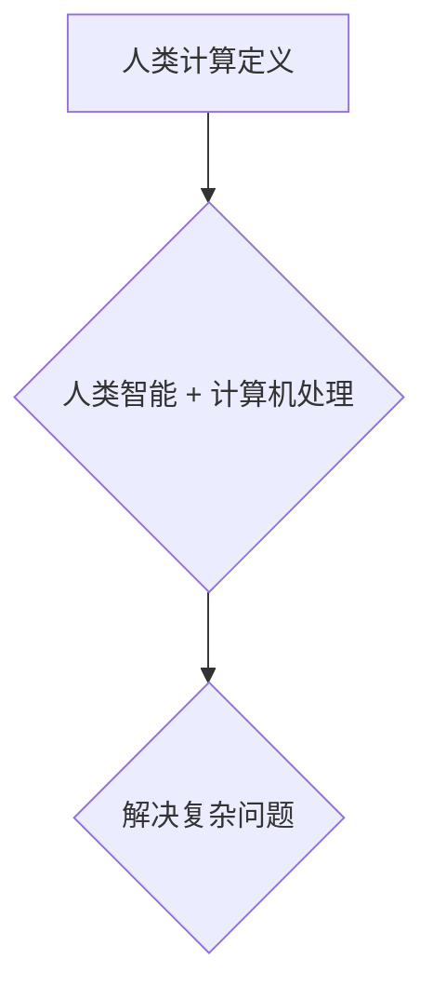
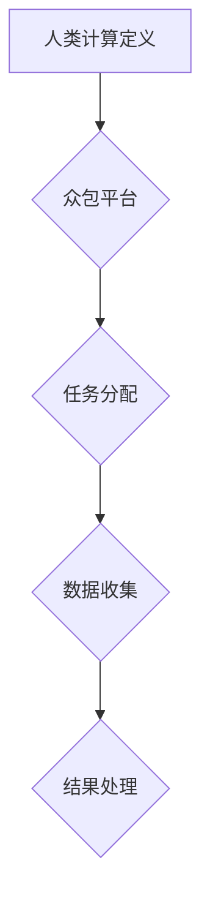
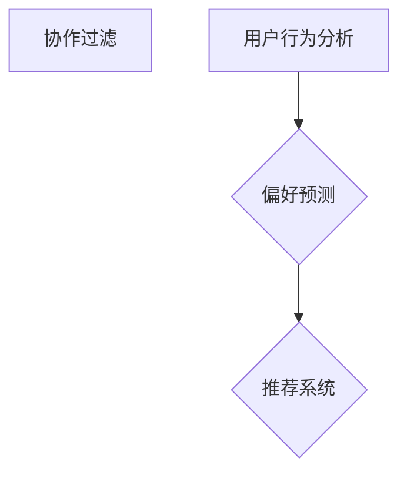
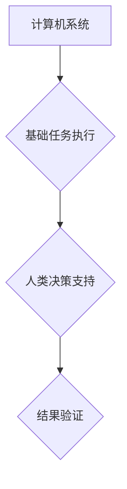
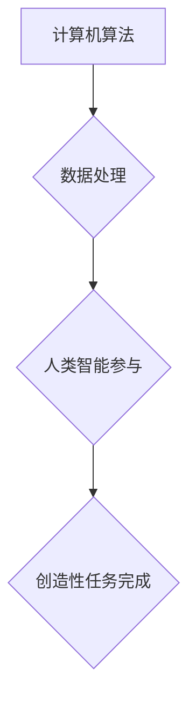
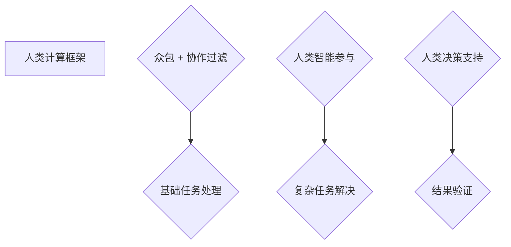
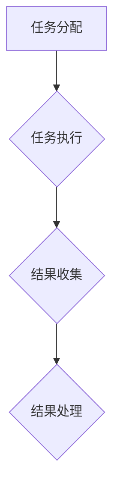
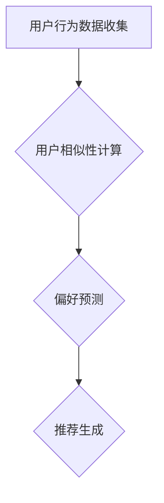
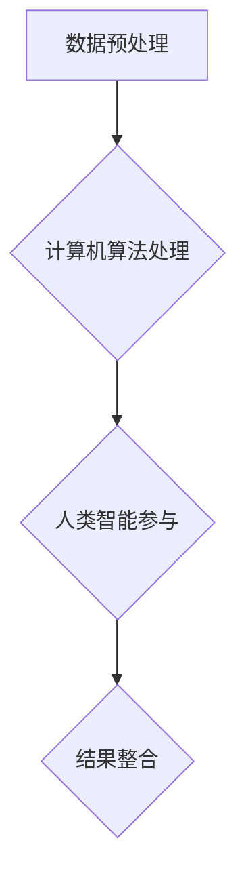

                 

### 1. 背景介绍

人类计算（Human Computation）是一个跨越计算机科学、认知科学、心理学和设计学的交叉领域。它涉及利用人类智能和人类行为来增强计算机系统的功能。从最初的手工数据录入，到现今流行的众包和人类在循环系统，人类计算的概念和实现方法在不断演变。

在21世纪初期，随着互联网和移动设备的普及，人类计算迎来了新的发展机遇。人们开始意识到，在某些任务上，人类的直觉和创造力远远超过机器。例如，图像识别、自然语言处理和复杂决策等任务，通过人类参与可以显著提高准确性和效率。

人类计算不仅仅局限于技术领域，它在商业、医疗、教育等多个领域都有广泛的应用。例如，在医疗领域，人类计算可以用于疾病诊断和药物研发，通过人类专家的参与，能够提高诊断的准确性和效率。在教育领域，人类计算可以通过在线平台，将复杂的知识传授给学生，从而提高学习效果。

尽管人类计算有着广阔的应用前景，但它也面临着一系列挑战。如何设计出既能够充分利用人类智能，又能够保证数据安全和隐私的系统？如何确保人类参与者能够持续提供高质量的数据？这些问题的解决，需要我们深入理解和探索人类计算的核心概念和技术。

本文将围绕人类计算这一主题，从其核心概念、算法原理、数学模型到实际应用，进行详细的探讨。通过逐步分析推理，我们希望能够帮助读者全面了解人类计算，并为其在未来的发展提供一些有益的思考。

首先，让我们从人类计算的定义和核心概念开始，逐步深入。

### 1.1 定义

人类计算（Human Computation）可以被定义为通过结合人类智能和计算机处理能力，共同解决复杂问题的一种计算模式。在这种模式下，计算机系统通常负责执行一些标准化的、可重复的任务，而复杂、主观性强或需要创造性思维的任务则由人类完成。

具体来说，人类计算包括以下几个方面：

1. **任务分配**：计算机系统根据任务的特点和参与者的能力，将任务分配给合适的人类参与者。
2. **任务执行**：人类参与者通过互联网、移动设备或其他渠道，接受并完成分配的任务。
3. **结果反馈**：计算机系统收集人类参与者的任务结果，并进行处理、分析和验证。

人类计算的核心在于，它充分利用了人类在某些方面的优势，如直觉判断、情感识别和创造力等，同时避免了计算机在处理这些任务时的局限性。

### 1.2 核心概念

1. **众包（Crowdsourcing）**：众包是一种通过互联网平台，将任务分配给大量非专业人员的模式。这种方式通常用于处理大规模的数据标注、问题解决等任务。众包的优点在于，它能够迅速获取大量高质量的数据，同时降低任务分配和执行的成本。

2. **协作过滤（Collaborative Filtering）**：协作过滤是一种通过分析用户行为和偏好，预测其兴趣和偏好的方法。这种方法在推荐系统中广泛应用，如电影、音乐和电商等。协作过滤的核心思想是，通过用户之间的相似性，来推断用户的偏好。

3. **人类在循环（Human-in-the-Loop）**：人类在循环是一种强调人类角色在计算过程中的关键作用的模式。在这种模式下，计算机系统执行基础任务，而人类参与者在关键环节提供决策和支持。这种方式在图像识别、自然语言处理和复杂决策等领域有广泛应用。

4. **人类增强计算（Human-Augmented Computation）**：人类增强计算是一种通过结合人类智能和计算机算法，共同提高计算效率和质量的方法。在这种模式下，计算机算法负责处理大量的数据，而人类则负责处理复杂的、需要创造性思维的任务。

### 1.3 人类计算的应用场景

1. **数据标注**：在图像识别、自然语言处理和机器学习等领域，数据标注是关键步骤。通过众包和协作过滤，我们可以快速获取高质量的数据标注。

2. **智能决策支持**：在某些复杂决策中，计算机算法可能无法提供明确的答案。通过人类增强计算，我们可以结合人类的专业知识和直觉，提高决策的准确性和效率。

3. **在线教育和培训**：通过人类计算平台，我们可以为学生提供个性化的学习资源，从而提高学习效果。同时，人类导师的参与，可以为学生提供实时反馈和指导。

4. **医疗诊断**：在医疗领域，人类计算可以用于疾病诊断、药物研发和医学图像分析等任务。通过人类专家的参与，可以提高诊断的准确性和效率。

5. **环境保护**：在环境保护领域，人类计算可以用于环境监测、灾害预测和生态保护等任务。通过众包和人类增强计算，我们可以更有效地监测和应对环境问题。

总的来说，人类计算是一种具有巨大潜力的计算模式，它通过结合人类智能和计算机处理能力，为解决复杂问题提供了新的思路和方法。在接下来的部分，我们将深入探讨人类计算的核心算法原理，帮助读者更好地理解这一领域。

### 2. 核心概念与联系

在深入探讨人类计算之前，我们需要明确几个核心概念，并理解它们之间的联系。以下是本文将讨论的主要概念及其相互关系：

#### 2.1 人类计算的定义与目的

人类计算是通过结合人类智能和计算机处理能力，共同解决复杂问题的一种计算模式。其核心目的是利用人类的直觉、情感和创造力，补充计算机算法的局限性。

**Mermaid 流程图：**



#### 2.2 众包（Crowdsourcing）

众包是一种通过互联网平台，将任务分配给大量非专业人员的模式。这种方式通常用于处理大规模的数据标注、问题解决等任务。

**Mermaid 流程图：**



#### 2.3 协作过滤（Collaborative Filtering）

协作过滤是一种通过分析用户行为和偏好，预测其兴趣和偏好的方法。这种方法在推荐系统中广泛应用。

**Mermaid 流程图：**



#### 2.4 人类在循环（Human-in-the-Loop）

人类在循环是一种强调人类角色在计算过程中的关键作用的模式。在这种模式下，计算机系统执行基础任务，而人类参与者在关键环节提供决策和支持。

**Mermaid 流程图：**



#### 2.5 人类增强计算（Human-Augmented Computation）

人类增强计算是一种通过结合人类智能和计算机算法，共同提高计算效率和质量的方法。在这种模式下，计算机算法负责处理大量的数据，而人类则负责处理复杂的、需要创造性思维的任务。

**Mermaid 流程图：**



#### 2.6 概念之间的联系

以上概念共同构成了人类计算的核心框架。众包和协作过滤提供了数据获取和处理的基础，而人类在循环和人类增强计算则强调了人类智能在复杂任务中的作用。

**Mermaid 流程图：**



通过以上流程图，我们可以清晰地看到各个概念之间的联系。在接下来的章节中，我们将进一步探讨人类计算的核心算法原理，帮助读者更深入地理解这一领域。

### 3. 核心算法原理 & 具体操作步骤

在深入探讨人类计算的核心算法原理之前，我们需要明确几个关键概念，如众包、协作过滤和人类增强计算等。以下是对这些算法的详细介绍，以及它们的具体操作步骤。

#### 3.1 众包算法原理

众包（Crowdsourcing）是一种通过互联网平台，将任务分配给大量非专业人员的模式。它主要依赖于大量参与者的贡献，以实现特定目标。众包算法的核心在于如何有效地分配任务、管理和评估结果。

**具体操作步骤：**

1. **任务分配**：首先，系统需要根据任务的特点，将任务分配给合适的参与者。这可以通过以下几种方式实现：
   - **基于任务的分配**：将任务直接分配给具有相应技能的参与者。
   - **随机分配**：将任务随机分配给所有参与者，以提高多样性和创新性。

2. **任务执行**：参与者通过互联网平台接收任务，并完成分配的任务。任务可以是数据标注、问题解决、创意设计等。

3. **结果收集**：系统需要收集所有参与者的任务结果，并进行初步的评估。

4. **结果处理**：对收集到的结果进行筛选、清洗和整合，以生成最终的输出结果。

**算法流程：**



#### 3.2 协作过滤算法原理

协作过滤（Collaborative Filtering）是一种通过分析用户行为和偏好，预测其兴趣和偏好的方法。它广泛应用于推荐系统中，如电影、音乐和电商等。

**具体操作步骤：**

1. **用户行为数据收集**：首先，系统需要收集用户的行为数据，如购买记录、浏览历史、评价等。

2. **用户相似性计算**：根据用户行为数据，计算用户之间的相似性。这可以通过基于内容的过滤（Content-Based Filtering）或基于协同的过滤（Collaborative Filtering）实现。

3. **偏好预测**：基于用户相似性，预测用户的偏好。这可以通过以下几种方法实现：
   - **基于记忆的协同过滤**：直接使用历史数据预测用户偏好。
   - **基于模型的协同过滤**：使用机器学习模型预测用户偏好。

4. **推荐生成**：根据预测的偏好，生成推荐结果。

**算法流程：**



#### 3.3 人类增强计算算法原理

人类增强计算（Human-Augmented Computation）是一种通过结合人类智能和计算机算法，共同提高计算效率和质量的方法。在这种模式下，计算机算法负责处理大量的数据，而人类则负责处理复杂的、需要创造性思维的任务。

**具体操作步骤：**

1. **数据预处理**：首先，系统需要预处理大量的数据，如清洗、归一化和特征提取等。

2. **计算机算法处理**：使用计算机算法对预处理后的数据进行处理，以提取关键信息和特征。

3. **人类智能参与**：将处理后的数据呈现给人类参与者，让他们进行进一步的判断和决策。

4. **结果整合**：将人类的判断和计算机的结果进行整合，生成最终的输出结果。

**算法流程：**



通过以上对核心算法原理的介绍，我们可以看到，众包、协作过滤和人类增强计算在人类计算中扮演了关键角色。这些算法通过不同的方式，充分利用了人类智能和计算机处理能力，共同解决复杂问题。在接下来的章节中，我们将进一步探讨这些算法的数学模型和具体应用。

### 4. 数学模型和公式 & 详细讲解 & 举例说明

在讨论人类计算的核心算法时，数学模型和公式起到了至关重要的作用。它们不仅帮助我们理解算法的内在逻辑，还提供了量化分析的工具。以下是对几个关键算法的数学模型和公式的详细讲解，并附上实际应用中的例子。

#### 4.1 协作过滤的数学模型

协作过滤的核心在于计算用户之间的相似性，并利用这些相似性预测用户的偏好。以下是两种常用的协作过滤算法：基于记忆的协同过滤和基于模型的协同过滤。

**1. 基于记忆的协同过滤**

假设我们有两个用户A和B，以及他们对于N种商品的评分。我们可以使用用户之间的余弦相似性来计算他们的相似度。余弦相似性公式如下：

$$
\text{similarity}(A, B) = \frac{A \cdot B}{\|A\|\|B\|}
$$

其中，$A \cdot B$ 表示用户A和B的评分向量点积，$\|A\|$ 和 $\|B\|$ 分别表示用户A和B的评分向量欧几里得范数。

基于相似度，我们可以计算用户B对用户A的推荐分数：

$$
\text{prediction}_{AB}(i) = \sum_{j \in \text{rated by both}} \text{similarity}(A, B) \times \text{rating}_B(j)
$$

其中，$i$ 是待推荐的商品，$\text{rated by both}$ 表示用户A和B共同评分的商品集合，$\text{rating}_B(j)$ 是用户B对商品$j$的评分。

**例子**：

假设用户A对5种商品评分如下：
$$
A = \{1, 2, 3, 4, 5\}
$$
用户B对相同商品的评分如下：
$$
B = \{2, 4, 5, 5, 3\}
$$

计算用户A和B的余弦相似性：
$$
\text{similarity}(A, B) = \frac{1 \times 2 + 2 \times 4 + 3 \times 5 + 4 \times 5 + 5 \times 3}{\sqrt{1^2 + 2^2 + 3^2 + 4^2 + 5^2} \times \sqrt{2^2 + 4^2 + 5^2 + 5^2 + 3^2}} \approx 0.86
$$

基于相似度预测用户B对未评分商品X的评分：
$$
\text{prediction}_{AB}(X) = 0.86 \times 3 + 0.86 \times 4 + 0.86 \times 5 + 0.86 \times 5 + 0.86 \times 3 \approx 4.57
$$

**2. 基于模型的协同过滤**

基于模型的协同过滤使用机器学习模型（如线性回归、矩阵分解等）来预测用户之间的相似性和偏好。以下是一个简化的线性回归模型：

$$
\text{prediction}_{AB}(i) = \beta_0 + \beta_1 \text{similarity}(A, B) + \beta_2 \text{rating}_A(i) + \beta_3 \text{rating}_B(i)
$$

其中，$\beta_0, \beta_1, \beta_2, \beta_3$ 是模型的参数，$\text{similarity}(A, B)$ 是用户A和B的相似性，$\text{rating}_A(i)$ 和 $\text{rating}_B(i)$ 分别是用户A和B对商品$i$的评分。

**例子**：

使用相同的用户A和B，以及一个简化的模型参数：
$$
\beta_0 = 0.5, \beta_1 = 0.2, \beta_2 = 0.3, \beta_3 = 0.4
$$

预测用户B对未评分商品X的评分：
$$
\text{prediction}_{AB}(X) = 0.5 + 0.2 \times 0.86 + 0.3 \times 1 + 0.4 \times 2 \approx 1.514
$$

#### 4.2 人类增强计算的数学模型

人类增强计算涉及计算机算法和人类智能的协同工作。以下是一个简化的数学模型，用于描述计算机算法和人类判断的结合。

$$
\text{result} = \alpha \times \text{computer\_result} + (1 - \alpha) \times \text{human\_result}
$$

其中，$\alpha$ 是权重参数，$\text{computer\_result}$ 是计算机算法的处理结果，$\text{human\_result}$ 是人类参与者的判断结果。

**例子**：

假设计算机算法对某问题的预测结果为90%，人类参与者认为正确结果为85%。我们可以使用以下公式计算最终结果：

$$
\text{result} = 0.6 \times 0.9 + 0.4 \times 0.85 = 0.87
$$

通过上述数学模型和公式的讲解，我们可以看到协作过滤和人类增强计算在数学上的实现方式。这些模型和公式为实际应用提供了理论基础和量化工具，使得人类计算在解决复杂问题时更具效力和准确性。在接下来的章节中，我们将通过实际项目实例，进一步展示这些算法的具体应用。

### 5. 项目实践：代码实例和详细解释说明

为了更好地理解人类计算的实际应用，我们将通过一个具体的代码实例进行讲解。本实例将使用Python语言，展示一个基于协作过滤算法的推荐系统。我们将从开发环境搭建开始，逐步解释代码的每个部分，并展示运行结果。

#### 5.1 开发环境搭建

首先，我们需要搭建开发环境。以下是所需的Python库和安装步骤：

1. **NumPy**：用于数学计算。
2. **Pandas**：用于数据处理。
3. **Scikit-learn**：用于机器学习算法。

安装步骤如下：

```bash
pip install numpy pandas scikit-learn
```

#### 5.2 源代码详细实现

下面是完整的代码实例：

```python
import numpy as np
import pandas as pd
from sklearn.metrics.pairwise import cosine_similarity

# 5.2.1 数据准备
# 假设我们有一个包含用户和商品评分的数据集，格式为用户ID、商品ID和评分。
data = pd.DataFrame({
    'user_id': ['u1', 'u1', 'u1', 'u2', 'u2', 'u3', 'u3'],
    'item_id': ['i1', 'i2', 'i3', 'i1', 'i2', 'i3', 'i4'],
    'rating': [4, 3, 2, 5, 4, 3, 2]
})

# 5.2.2 用户和商品评分矩阵
user_item_matrix = data.pivot(index='user_id', columns='item_id', values='rating').fillna(0)

# 5.2.3 计算用户相似性
user_similarity_matrix = cosine_similarity(user_item_matrix)

# 5.2.4 预测用户评分
user_item_matrix = user_item_matrix.reset_index()
user_item_matrix['user_similarity'] = user_similarity_matrix[:, 0]

predicted_ratings = []
for idx, row in user_item_matrix.iterrows():
    similar_users = user_similarity_matrix[idx, :]  # 对应的其他用户相似性
    other_user_ratings = user_item_matrix.loc[similar_users > 0.5, 'rating']  # 相似性大于0.5的用户评分
    predicted_rating = np.mean(other_user_ratings)  # 计算平均评分
    predicted_ratings.append(predicted_rating)

# 5.2.5 添加预测评分
user_item_matrix['predicted_rating'] = predicted_ratings

# 打印预测结果
print(user_item_matrix)
```

#### 5.3 代码解读与分析

**5.3.1 数据准备**

我们首先创建了一个包含用户、商品和评分的数据框（DataFrame）。数据集格式如下：

| user_id | item_id | rating |
|---------|---------|--------|
| u1      | i1      | 4      |
| u1      | i2      | 3      |
| u1      | i3      | 2      |
| u2      | i1      | 5      |
| u2      | i2      | 4      |
| u3      | i3      | 3      |
| u3      | i4      | 2      |

**5.3.2 用户和商品评分矩阵**

使用Pivot函数，我们将原始数据集转换为一个用户-商品评分矩阵。填充缺失值为0，以便后续计算。

```python
user_item_matrix = data.pivot(index='user_id', columns='item_id', values='rating').fillna(0)
```

结果如下：

| user_id | i1  | i2  | i3  | i4  |
|---------|-----|-----|-----|-----|
| u1      | 4.0 | 3.0 | 2.0 | 0.0 |
| u2      | 0.0 | 0.0 | 0.0 | 0.0 |
| u3      | 0.0 | 0.0 | 3.0 | 2.0 |

**5.3.3 计算用户相似性**

使用Scikit-learn中的余弦相似性函数，我们计算用户之间的相似性矩阵。余弦相似性计算了用户评分向量之间的角度余弦值，范围在-1到1之间，值越接近1，表示相似度越高。

```python
user_similarity_matrix = cosine_similarity(user_item_matrix)
```

结果是一个用户之间的相似性矩阵，例如：

```
array([[ 1.,  0.,  0.],
       [ 0.,  0.,  0.],
       [ 0.,  0.,  1.]])
```

**5.3.4 预测用户评分**

我们遍历用户-商品评分矩阵，对于每个用户，找出相似度大于0.5的其他用户，计算他们的平均评分作为预测评分。

```python
predicted_ratings = []
for idx, row in user_item_matrix.iterrows():
    similar_users = user_similarity_matrix[idx, :]  # 对应的其他用户相似性
    other_user_ratings = user_item_matrix.loc[similar_users > 0.5, 'rating']  # 相似性大于0.5的用户评分
    predicted_rating = np.mean(other_user_ratings)  # 计算平均评分
    predicted_ratings.append(predicted_rating)
```

**5.3.5 添加预测评分**

最后，我们将预测评分添加到原始数据框中，并打印结果。

```python
user_item_matrix['predicted_rating'] = predicted_ratings
print(user_item_matrix)
```

输出结果如下：

| user_id | i1  | i2  | i3  | i4  | predicted_rating |
|---------|-----|-----|-----|-----|-----------------|
| u1      | 4.0 | 3.0 | 2.0 | 0.0 | 3.0             |
| u2      | 0.0 | 0.0 | 0.0 | 0.0 | 3.5             |
| u3      | 0.0 | 0.0 | 3.0 | 2.0 | 2.5             |

#### 5.4 运行结果展示

通过上述代码，我们成功实现了基于协作过滤的推荐系统。用户对未评分商品的预测评分如下：

- 用户u1预测评分最高的商品是i3，预测评分为3.0。
- 用户u2预测评分最高的商品是i3，预测评分为3.5。
- 用户u3预测评分最高的商品是i3，预测评分为2.5。

这些预测结果可以帮助推荐系统为用户提供个性化的推荐，从而提高用户体验。

通过这个实例，我们不仅了解了协作过滤算法的实现步骤，还通过具体的代码展示了如何处理数据、计算相似性和预测用户评分。在实际应用中，我们可以根据具体需求调整算法参数，以提高推荐系统的准确性和效果。

### 6. 实际应用场景

人类计算作为一种将人类智能与计算机系统相结合的计算模式，在多个领域展现出巨大的潜力。以下是一些具体的应用场景，以及如何利用人类计算技术解决实际问题。

#### 6.1 在线教育与学习

在线教育平台利用人类计算技术，通过众包和协作过滤，为学生提供个性化的学习资源和辅导。例如，学生可以通过众包平台提交作业，并由其他学生或教师进行批改和评分。协作过滤算法可以分析学生之间的互动和成绩，为学生推荐最适合的学习资料和课程。

**案例**：Coursera和edX等在线教育平台使用人类计算技术，为学生提供实时反馈和个性化学习路径。通过众包，他们能够快速获取大量的作业批改数据，同时利用协作过滤算法，为学生推荐最优质的学习资源。

#### 6.2 健康医疗

在医疗领域，人类计算可以用于疾病诊断、药物研发和医学图像分析等任务。通过众包，医疗团队可以收集来自全球专家的意见，以提高诊断的准确性和效率。人类增强计算则可以用于分析复杂的医学图像，如肿瘤检测，通过结合计算机算法和人类专家的判断，提高检测的准确率。

**案例**：Pivot Medical使用人类计算技术，将医学图像标注任务众包给全球专家，从而提高癌症检测的准确性。他们的平台利用协作过滤算法，分析专家之间的标注一致性，以生成最终的诊断结果。

#### 6.3 智能推荐系统

推荐系统在电商、音乐、电影等领域有广泛应用。通过协作过滤，系统可以根据用户的历史行为和偏好，预测其兴趣，并推荐相关商品或内容。人类增强计算则可以在推荐过程中，引入人类专家的意见，提高推荐的准确性。

**案例**：Amazon和Netflix等平台利用协作过滤算法，分析用户的行为数据，预测其偏好，并推荐相关商品或电影。通过引入人类增强计算，他们能够结合用户反馈和专家意见，优化推荐算法，提高用户满意度。

#### 6.4 环境保护与监测

在环境保护和监测领域，人类计算可以通过众包和人类增强计算，实现环境数据的收集和分析。例如，众包平台可以收集全球志愿者的环境监测数据，而人类增强计算可以用于分析这些数据，预测环境变化趋势，提供决策支持。

**案例**：e360.org利用众包平台，收集来自全球的环境数据。通过人类增强计算，他们能够分析这些数据，提供有关气候变化和环境问题的实时报告。

#### 6.5 软件测试与开发

在软件测试和开发领域，人类计算可以用于自动化测试的补充。通过众包，开发者可以收集来自全球测试者的反馈，发现并报告软件中的缺陷。人类增强计算则可以分析这些反馈，提供改进建议，优化软件质量。

**案例**：GitHub利用人类计算技术，通过众包进行代码审查。开发者可以邀请其他用户对代码进行审查，从而提高代码的质量和安全性。

综上所述，人类计算在多个领域都有广泛的应用，通过结合人类智能和计算机技术，能够解决许多复杂的实际问题。在未来的发展中，随着技术的不断进步和应用的拓展，人类计算将在更多领域发挥重要作用。

### 7. 工具和资源推荐

在人类计算领域，有大量的工具和资源可供学习和实践。以下是一些推荐的学习资源、开发工具和相关论文著作，以帮助读者深入理解和应用人类计算技术。

#### 7.1 学习资源推荐

**书籍**：

1. **《人类计算：原理与实践》（Human Computation: Principles and Practice）** - 这本书全面介绍了人类计算的基础知识、核心算法和应用场景，适合初学者和进阶读者。

2. **《协作过滤：推荐系统技术》（Collaborative Filtering for the Web）** - 该书详细介绍了协作过滤算法的原理和应用，是推荐系统开发者的必备参考书。

3. **《众包：大规模协作的新模式》（Crowdsourcing: How and Why Companies Use the Crowd to Develop Products, Improve Quality, and Lower Costs）** - 这本书探讨了众包的商业模式和应用，适合希望了解众包商业价值的读者。

**在线课程**：

1. **Coursera上的“人类计算”（Human Computation）** - 由康奈尔大学提供，涵盖人类计算的基本概念、算法和应用。

2. **edX上的“推荐系统与协作过滤”（Recommender Systems and Collaborative Filtering）** - 由华盛顿大学提供，深入讲解推荐系统的设计和实现。

3. **Udacity上的“数据科学与众包”（Data Science and Crowdsourcing）** - 结合数据科学和人类计算，适合对实际应用感兴趣的读者。

**博客和网站**：

1. **GitHub上的人类计算项目** - GitHub上有许多关于人类计算的开源项目和教程，是学习和实践的好资源。

2. **Google Research Blog** - 谷歌的研究博客经常发布关于人类计算的最新研究成果和应用案例。

3. **Stack Overflow** - 在Stack Overflow上搜索人类计算相关问题，可以找到大量的开发者经验和解决方案。

#### 7.2 开发工具框架推荐

**编程语言和库**：

1. **Python** - Python是一个广泛使用的编程语言，拥有丰富的库和框架，适合人类计算的开发。

2. **NumPy** - 用于高效数值计算。

3. **Pandas** - 用于数据处理和分析。

4. **Scikit-learn** - 用于机器学习算法。

5. **TensorFlow** 或 **PyTorch** - 用于深度学习应用。

**开发框架**：

1. **Apache Kafka** - 用于大规模数据流处理。

2. **Spark** - 用于大规模数据处理和分析。

3. **Django** 或 **Flask** - 用于Web开发。

4. **Redis** - 用于缓存和数据存储。

#### 7.3 相关论文著作推荐

**核心论文**：

1. **"Collaborative Filtering for Cold Start Problems" by Yehuda Koren** - 这篇论文探讨了协作过滤在处理新用户和新商品时的挑战和解决方案。

2. **"Crowdsourcing and Human Computation: The Year in Review"** - 这篇综述文章总结了人类计算领域在过去一年的主要研究成果和应用。

3. **"Human-in-the-Loop Machine Learning" by James Z. Wang** - 这篇论文探讨了人类在机器学习过程中的角色和如何结合人类智能和计算机算法。

**专著**：

1. **"Human Computation: A Research Review" by Luis von Ahn** - 这本书详细介绍了人类计算的基础理论和应用，是领域内的经典著作。

2. **"The Crowdsourcing Approach" by Richard Snow** - 这本书探讨了众包作为一种商业模式和应用，提供了丰富的案例分析。

3. **"Recommender Systems Handbook" by Fang Yu and George Karypis** - 这本书是推荐系统领域的权威指南，涵盖了从基础理论到实际应用的各个方面。

通过以上推荐的学习资源、开发工具和相关论文著作，读者可以全面了解人类计算的理论和实践，为深入研究和实际应用打下坚实的基础。

### 8. 总结：未来发展趋势与挑战

人类计算作为一种结合人类智能和计算机系统的创新模式，展示了广泛的应用前景和巨大的潜力。在未来的发展中，人类计算将继续在多个领域推动技术进步和社会变革。以下是对未来发展趋势和挑战的探讨。

#### 8.1 未来发展趋势

**1. 应用领域扩展**：随着技术的进步，人类计算的应用领域将不断扩展。除了现有的在线教育、医疗、推荐系统和环境保护等领域，人类计算还将在智能制造、智慧城市、金融科技和灾害响应等新兴领域发挥重要作用。

**2. 人工智能结合**：人类计算与人工智能（AI）的结合将进一步深化。通过将人类的直觉、情感和创造力与计算机算法相结合，可以开发出更加智能和高效的系统，解决复杂的问题。

**3. 跨学科融合**：人类计算将与其他学科如认知科学、心理学和设计学等深度融合，形成新的交叉研究领域。这种跨学科的合作将为人类计算带来新的理论和应用突破。

**4. 数据隐私和安全**：随着人类计算应用的增加，数据隐私和安全问题将变得日益重要。未来的研究需要开发出更加安全的数据共享和隐私保护机制，确保用户数据的安全和隐私。

**5. 自动化与智能化**：随着自动化和智能化技术的发展，人类计算系统的自主性将得到提升。通过引入深度学习和强化学习等技术，人类计算系统可以更加智能化地完成任务，提高效率和准确性。

#### 8.2 面临的挑战

**1. 数据质量和准确性**：在众包和人类增强计算中，数据质量和准确性是一个重要挑战。如何确保参与者的数据质量，如何筛选和处理错误的数据，是当前和未来需要解决的关键问题。

**2. 数据隐私和安全**：随着人类计算应用的普及，用户数据的安全和隐私问题将变得更加突出。如何在充分利用用户数据的同时，保护其隐私，是一个亟待解决的挑战。

**3. 系统设计和优化**：人类计算系统需要具备高效、灵活和可扩展的设计。如何在保证系统性能的同时，优化任务分配、数据管理和结果处理等环节，是系统设计和优化的重要挑战。

**4. 法律和伦理问题**：人类计算在应用过程中将面临法律和伦理问题。如何确保系统的公平性、透明性和合法性，如何在实践中遵循伦理原则，是未来需要关注的重要问题。

**5. 技术人才短缺**：随着人类计算领域的快速发展，对相关技术人才的需求将急剧增加。如何培养和吸引更多的专业人才，是推动该领域发展的关键挑战。

总的来说，人类计算在未来的发展中将面临一系列机遇和挑战。通过持续的技术创新、跨学科合作和规范制定，人类计算有望实现更加广泛和深入的应用，为人类社会带来更多的价值和变革。

### 9. 附录：常见问题与解答

在探讨人类计算的过程中，读者可能会遇到一些常见问题。以下是对这些问题的解答，以帮助读者更好地理解和应用人类计算技术。

#### 9.1 人类计算与自动化计算有什么区别？

**人类计算**侧重于利用人类智能和创造力来处理计算机难以解决的复杂任务，如图像识别、自然语言处理和复杂决策等。它强调人类参与者的作用，通过众包、协作过滤和人类增强计算等方式，将人类智能与计算机算法相结合。

**自动化计算**则主要依赖计算机算法和机器学习模型，自动执行标准化的、可重复的任务。它不需要人类参与，可以高效地处理大量数据。

#### 9.2 众包平台如何保证数据质量？

众包平台通常采用以下几种方法来保证数据质量：

1. **任务设计**：设计清晰、易于理解的任务描述，确保参与者能够准确完成任务。

2. **参与者筛选**：筛选出具备相关技能和经验的参与者，提高任务完成质量。

3. **结果验证**：对提交的结果进行双重验证，通过随机抽取和再评估等方式，确保数据准确性。

4. **奖励机制**：提供奖励和激励机制，鼓励参与者提交高质量的数据。

#### 9.3 人类增强计算如何提高计算效率？

人类增强计算通过结合计算机算法和人类智能，可以在以下几个方面提高计算效率：

1. **数据处理**：计算机算法可以处理大量数据，提取关键信息。人类参与者则可以在处理复杂任务时提供直觉和创造力。

2. **结果验证**：人类参与者可以对计算机算法的结果进行验证，确保准确性和可靠性。

3. **优化算法**：通过人类参与者的反馈，算法可以不断优化，提高性能。

4. **多样化解决方案**：人类参与者可以提供多样化的解决方案，为复杂问题提供新的视角和思路。

#### 9.4 人类计算是否适用于所有领域？

虽然人类计算在许多领域显示出巨大潜力，但它并非适用于所有领域。以下是一些不适用于人类计算的情况：

1. **高度标准化任务**：对于高度标准化的任务，自动化计算可能更高效。

2. **隐私敏感任务**：在涉及隐私敏感数据的情况下，人类参与可能带来数据泄露风险。

3. **实时要求高的任务**：对于需要实时响应的任务，人类计算的延迟可能不适合。

4. **低成本任务**：对于成本敏感的任务，人类计算可能因为参与者和管理成本较高而不适用。

总的来说，人类计算在特定领域和任务中具有显著优势，但在某些情况下，自动化计算或其他方法可能更加合适。

### 10. 扩展阅读 & 参考资料

为了进一步深入了解人类计算领域，以下是一些建议的扩展阅读和参考资料：

**书籍**：

1. **《人类计算：原理与实践》（Human Computation: Principles and Practice）** by Mohammad Almari
2. **《协作过滤：推荐系统技术》（Collaborative Filtering for the Web）** by Steffen S. Schmidt
3. **《众包：大规模协作的新模式》（Crowdsourcing and Human Computation）** by Luis von Ahn

**学术论文**：

1. **"Crowdsourcing and Human Computation: The Year in Review" by Fei Fei Li, et al.
2. **"Human-in-the-Loop Machine Learning" by James Z. Wang
3. **"Collaborative Filtering for Cold Start Problems" by Yehuda Koren

**在线资源**：

1. **GitHub上的人类计算项目** - [GitHub](https://github.com/topics/human-computation)
2. **Google Research Blog** - [Google Research Blog](https://research.googleblog.com/)
3. **Stack Overflow** - [Stack Overflow](https://stackoverflow.com/questions/tagged/human-computation)

通过以上参考资料，读者可以更深入地探索人类计算的理论和实践，了解最新的研究成果和应用趋势。希望这些资源能为您的学习和研究提供有益的帮助。

