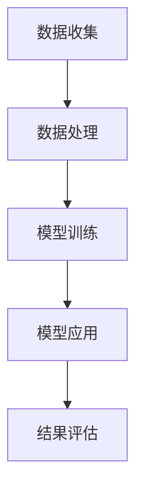

                 

### 1. 背景介绍

医疗保健领域一直是人类关注的焦点，随着人口老龄化、慢性病增加以及医疗成本上升，如何提高医疗效率、降低医疗错误、优化资源分配等问题变得愈发迫切。传统的医疗方法主要依赖于医生的经验和知识，但这种方法存在一定的局限性。随着计算机科学和人工智能技术的快速发展，人们开始探索将计算机技术应用于医疗保健领域，以实现更高效、更精确的医疗服务。

人类计算作为人工智能的一个重要分支，旨在模拟和扩展人类的计算能力。其核心思想是通过计算机程序来模拟人类的思维过程，使得计算机能够像人一样进行推理、学习、判断和决策。人类计算在医疗保健领域的应用潜力巨大，它可以帮助医生诊断疾病、制定治疗方案、进行药物研发等，从而提升医疗服务的质量和效率。

本文将围绕人类计算在医疗保健领域的应用展开讨论，首先介绍人类计算的基本概念，然后深入探讨其在医疗诊断、治疗规划、药物研发等方面的应用，最后总结人类计算在医疗保健领域的发展趋势和面临的挑战。

## 1.1 人类计算的基本概念

人类计算（Human Computation）是指利用人类智能来解决计算机难以解决的任务。这一概念最早由计算机科学家兼人类计算领域的先驱David P. Helmbold提出。人类计算的核心思想是，将人类特有的认知能力与计算机的强大计算能力相结合，以解决复杂的问题。

人类计算的任务通常可以分为两类：一类是计算机难以完成的任务，如识别图像中的物体、理解自然语言等；另一类是计算机可以完成，但效率低下的任务，如数据标注、分类等。通过人类计算，我们可以将人类智能与计算机智能相结合，以实现更高的效率和准确性。

### 1.2 人类计算与医疗保健的关联

人类计算与医疗保健之间的关联主要体现在以下几个方面：

1. **诊断辅助**：利用人类计算可以辅助医生进行疾病诊断。例如，通过分析大量的医疗图像，人类计算可以快速识别异常病变，为医生提供诊断依据。
2. **治疗规划**：人类计算可以帮助医生制定个性化的治疗方案。通过分析患者的病历、基因信息等，人类计算可以预测治疗效果，为医生提供决策支持。
3. **药物研发**：在药物研发过程中，人类计算可以加速新药的发现和筛选。通过模拟药物与生物大分子的相互作用，人类计算可以预测药物的效果和副作用，从而提高药物研发的效率。
4. **健康监测**：人类计算可以帮助实时监测患者的健康状况。例如，通过分析患者的日常行为数据，人类计算可以预测疾病发生的风险，并提供预防建议。

综上所述，人类计算在医疗保健领域具有广泛的应用前景。随着技术的不断进步，人类计算将有望成为医疗保健领域的一个重要工具，为提升医疗服务质量和效率提供强有力的支持。

### 1.3 人类计算在医疗保健领域的实际应用

人类计算在医疗保健领域的应用已经取得了显著的成果，下面将介绍几个典型的应用案例：

1. **图像识别**：在医学图像分析方面，人类计算技术已经表现出色。通过训练深度学习模型，计算机可以自动识别X光片、CT扫描和MRI图像中的异常病变。例如，谷歌DeepMind开发的AI系统可以准确识别眼科疾病，如糖尿病视网膜病变，为医生提供辅助诊断。这大大提高了诊断的准确性和效率，减少了医生的负担。

2. **电子病历分析**：人类计算可以分析大量的电子病历数据，帮助医生发现潜在的疾病风险和治疗方案。IBM的Watson for Health就是一个典型的例子，它能够处理海量的医疗信息，为医生提供个性化的诊断和治疗方案。

3. **个性化医疗**：基于人类计算技术，可以开发出个性化医疗方案。通过分析患者的基因组信息、病史和生活习惯，计算机可以为患者提供量身定制的预防措施和治疗计划。例如，美国一家初创公司Grasshopper Health利用机器学习技术，为患者提供个性化的健康建议和治疗方案。

4. **健康监测与预警**：人类计算还可以用于健康监测和预警。通过分析患者的日常行为数据，如心率、睡眠质量、运动量等，计算机可以预测疾病发生的风险，并提供相应的预警和建议。例如，苹果公司的Apple Watch可以通过监测用户的心率变化，预测心脏疾病的风险，并提供预警。

总的来说，人类计算在医疗保健领域的应用不仅提高了医疗服务的效率和质量，还为广大患者提供了更加便捷和个性化的服务。

### 1.4 文章结构概述

本文将系统地探讨人类计算在医疗保健领域的应用，具体包括以下内容：

1. **背景介绍**：首先介绍医疗保健领域面临的挑战，以及人类计算的概念和其在医疗保健中的重要性。
2. **核心概念与联系**：详细阐述人类计算的基本概念，并给出一个Mermaid流程图，展示其在医疗保健中的应用流程。
3. **核心算法原理 & 具体操作步骤**：介绍用于医疗保健领域的主要算法原理，包括数据收集、预处理、模型训练和结果输出等步骤。
4. **数学模型和公式 & 详细讲解 & 举例说明**：解释关键数学模型和公式，并提供具体的示例说明。
5. **项目实践：代码实例和详细解释说明**：展示一个实际项目的代码实现，并进行详细解读。
6. **实际应用场景**：分析人类计算在医疗保健领域的具体应用场景，如疾病诊断、治疗规划、药物研发等。
7. **工具和资源推荐**：推荐相关的学习资源、开发工具和框架。
8. **总结：未来发展趋势与挑战**：总结人类计算在医疗保健领域的应用前景，并探讨面临的挑战。
9. **附录：常见问题与解答**：提供一些常见问题的解答。
10. **扩展阅读 & 参考资料**：推荐进一步的阅读材料和参考文献。

通过以上结构，本文将全面、深入地探讨人类计算在医疗保健领域的应用，为读者提供有价值的参考和指导。

### 2. 核心概念与联系

在深入探讨人类计算在医疗保健领域的具体应用之前，我们首先需要了解其核心概念和基本原理。人类计算主要依赖于以下几个关键组成部分：数据收集、数据处理、模型训练和模型应用。

#### 2.1 数据收集

数据收集是人类计算的基础。在医疗保健领域，数据收集主要涉及患者信息、医疗记录、实验室检测结果等。这些数据可以是结构化的（如电子病历），也可以是非结构化的（如医疗图像、文本报告）。数据的完整性和准确性直接影响到人类计算的效果。因此，数据的收集和处理过程需要严格的质量控制。

#### 2.2 数据处理

数据处理是数据收集后的第一步。它包括数据清洗、数据整合和数据预处理。数据清洗旨在去除重复数据、缺失数据和错误数据，确保数据的一致性和准确性。数据整合则是将不同来源的数据进行合并，形成一个统一的数据集。数据预处理包括数据归一化、特征提取等步骤，为后续的模型训练提供高质量的数据。

#### 2.3 模型训练

在数据处理完成后，我们需要利用这些数据来训练模型。模型训练是机器学习的一个重要环节，通过学习大量的医疗数据，模型可以学会识别疾病的特征、预测治疗效果等。常见的机器学习算法包括决策树、支持向量机、神经网络等。模型训练的过程需要大量的计算资源和时间，但它是实现人类计算在医疗保健领域应用的关键步骤。

#### 2.4 模型应用

模型训练完成后，我们将其应用于实际医疗场景中。模型应用包括疾病诊断、治疗方案推荐、健康监测等。通过模型的应用，我们可以为医生提供辅助决策，提高医疗服务的效率和质量。例如，在疾病诊断中，计算机可以通过分析患者的医疗图像和实验室检测结果，快速识别疾病的特征，为医生提供诊断依据。

#### 2.5 Mermaid 流程图

为了更好地展示人类计算在医疗保健领域的应用流程，我们可以使用Mermaid流程图来描述。以下是该流程图的一个示例：



在上面的流程图中，A表示数据收集，B表示数据处理，C表示模型训练，D表示模型应用，E表示结果评估。通过这个流程，我们可以清晰地看到人类计算在医疗保健领域的基本工作流程。

### 2.6 人类计算在医疗保健领域的重要性

人类计算在医疗保健领域的重要性主要体现在以下几个方面：

1. **提高诊断效率**：通过计算机对大量医疗数据进行快速分析，可以显著提高诊断效率。例如，对于医学影像的诊断，计算机可以在短时间内完成大量的图像分析，为医生提供即时的诊断结果。
2. **降低诊断错误率**：计算机能够根据大量的历史数据和最新的研究成果，对疾病特征进行精确识别。这有助于降低医生的诊断错误率，提高诊断的准确性。
3. **个性化治疗**：人类计算可以根据患者的具体病情和基因信息，制定个性化的治疗方案。这有助于提高治疗效果，减少不必要的药物副作用。
4. **优化资源分配**：通过分析医疗数据，可以更好地了解医疗资源的使用情况，优化资源分配，提高医疗服务的整体效率。

综上所述，人类计算在医疗保健领域具有广泛的应用前景，它不仅能够提高医疗服务的效率和质量，还能够为医生和患者提供更加精准和个性化的服务。

### 3. 核心算法原理 & 具体操作步骤

在医疗保健领域，人类计算主要依赖于机器学习算法来实现数据分析和模型预测。下面我们将详细介绍几种核心的机器学习算法，包括其基本原理和具体操作步骤。

#### 3.1 支持向量机（SVM）

支持向量机是一种经典的分类算法，它通过寻找一个最佳的超平面，将不同类别的数据点分隔开。在医疗保健领域，SVM可以用于疾病分类和预测。

**基本原理**：

SVM的目标是找到一个最优的超平面，使得同类别的数据点到超平面的距离最大。这个超平面由支持向量决定，支持向量是那些离决策边界最近的点。

**具体操作步骤**：

1. **数据准备**：收集并处理医疗数据，将其划分为训练集和测试集。
2. **特征提取**：对数据进行特征提取，将其转换为适合输入SVM的特征向量。
3. **模型训练**：使用训练集数据训练SVM模型，计算支持向量和最优超平面。
4. **模型评估**：使用测试集评估模型的性能，计算准确率、召回率等指标。

**示例代码**（Python）：

```python
from sklearn import svm
from sklearn.model_selection import train_test_split
from sklearn.metrics import accuracy_score

# 加载和预处理数据
X, y = load_data()  # 假设已经加载和预处理的数据

# 划分训练集和测试集
X_train, X_test, y_train, y_test = train_test_split(X, y, test_size=0.2, random_state=42)

# 创建SVM模型
clf = svm.SVC(kernel='linear')

# 训练模型
clf.fit(X_train, y_train)

# 预测测试集
y_pred = clf.predict(X_test)

# 评估模型
print("Accuracy:", accuracy_score(y_test, y_pred))
```

#### 3.2 决策树（Decision Tree）

决策树是一种基于树形结构的分类算法，通过一系列的判断条件将数据划分为不同的类别。在医疗保健领域，决策树可以用于疾病诊断和治疗决策。

**基本原理**：

决策树通过一系列的判断条件来对数据进行分类。每个节点代表一个特征，每个分支代表一个判断结果。最终的叶子节点代表一个类别的预测结果。

**具体操作步骤**：

1. **数据准备**：收集并处理医疗数据，将其划分为训练集和测试集。
2. **特征选择**：选择用于构建决策树的特征，可以使用信息增益、增益率等指标进行特征选择。
3. **模型训练**：使用训练集数据构建决策树模型。
4. **模型评估**：使用测试集评估模型的性能，计算准确率、召回率等指标。

**示例代码**（Python）：

```python
from sklearn import tree
from sklearn.model_selection import train_test_split
from sklearn.metrics import accuracy_score

# 加载和预处理数据
X, y = load_data()  # 假设已经加载和预处理的数据

# 划分训练集和测试集
X_train, X_test, y_train, y_test = train_test_split(X, y, test_size=0.2, random_state=42)

# 创建决策树模型
clf = tree.DecisionTreeClassifier()

# 训练模型
clf.fit(X_train, y_train)

# 预测测试集
y_pred = clf.predict(X_test)

# 评估模型
print("Accuracy:", accuracy_score(y_test, y_pred))
```

#### 3.3 朴素贝叶斯（Naive Bayes）

朴素贝叶斯是一种基于贝叶斯定理的简单分类算法，它假设特征之间相互独立。在医疗保健领域，朴素贝叶斯可以用于疾病预测和风险分析。

**基本原理**：

朴素贝叶斯通过计算先验概率和条件概率，估计每个类别的后验概率，从而进行分类。它假设特征之间相互独立，即一个特征的取值不影响其他特征的取值。

**具体操作步骤**：

1. **数据准备**：收集并处理医疗数据，将其划分为训练集和测试集。
2. **特征处理**：将数据进行特征处理，计算每个特征的先验概率和条件概率。
3. **模型训练**：使用训练集数据训练朴素贝叶斯模型。
4. **模型评估**：使用测试集评估模型的性能，计算准确率、召回率等指标。

**示例代码**（Python）：

```python
from sklearn import naive_bayes
from sklearn.model_selection import train_test_split
from sklearn.metrics import accuracy_score

# 加载和预处理数据
X, y = load_data()  # 假设已经加载和预处理的数据

# 划分训练集和测试集
X_train, X_test, y_train, y_test = train_test_split(X, y, test_size=0.2, random_state=42)

# 创建朴素贝叶斯模型
clf = naive_bayes.GaussianNB()

# 训练模型
clf.fit(X_train, y_train)

# 预测测试集
y_pred = clf.predict(X_test)

# 评估模型
print("Accuracy:", accuracy_score(y_test, y_pred))
```

#### 3.4 集成学习（Ensemble Learning）

集成学习是将多个基学习器（如决策树、支持向量机等）结合起来，以提高模型性能的一种方法。在医疗保健领域，集成学习可以用于提高疾病的预测准确性和稳定性。

**基本原理**：

集成学习通过组合多个基学习器来提高模型的预测性能。常见的集成学习方法包括Bagging、Boosting和Stacking等。

**具体操作步骤**：

1. **数据准备**：收集并处理医疗数据，将其划分为训练集和测试集。
2. **基学习器训练**：训练多个基学习器，如决策树、支持向量机等。
3. **集成模型构建**：将基学习器组合成一个集成模型，如随机森林、梯度提升树等。
4. **模型评估**：使用测试集评估集成模型的性能，计算准确率、召回率等指标。

**示例代码**（Python）：

```python
from sklearn.ensemble import RandomForestClassifier
from sklearn.model_selection import train_test_split
from sklearn.metrics import accuracy_score

# 加载和预处理数据
X, y = load_data()  # 假设已经加载和预处理的数据

# 划分训练集和测试集
X_train, X_test, y_train, y_test = train_test_split(X, y, test_size=0.2, random_state=42)

# 创建随机森林模型
clf = RandomForestClassifier(n_estimators=100)

# 训练模型
clf.fit(X_train, y_train)

# 预测测试集
y_pred = clf.predict(X_test)

# 评估模型
print("Accuracy:", accuracy_score(y_test, y_pred))
```

通过以上核心算法的介绍，我们可以看到机器学习在医疗保健领域的广泛应用。这些算法不仅提高了诊断和治疗决策的准确性，还为医疗保健领域的研究和开发提供了有力的工具。

### 4. 数学模型和公式 & 详细讲解 & 举例说明

在医疗保健领域，数学模型和公式是构建机器学习算法的基础。以下是几种常用的数学模型和公式，以及它们的详细讲解和举例说明。

#### 4.1 线性回归模型

线性回归模型是一种常用的预测模型，用于分析两个或多个变量之间的线性关系。

**公式**：

$$
Y = \beta_0 + \beta_1X_1 + \beta_2X_2 + ... + \beta_nX_n + \epsilon
$$

其中，$Y$ 是因变量，$X_1, X_2, ..., X_n$ 是自变量，$\beta_0, \beta_1, ..., \beta_n$ 是回归系数，$\epsilon$ 是误差项。

**详细讲解**：

线性回归模型通过拟合一条直线，来描述因变量和自变量之间的线性关系。回归系数$\beta_1, \beta_2, ..., \beta_n$ 表示自变量对因变量的影响程度，误差项$\epsilon$ 表示模型无法解释的随机误差。

**举例说明**：

假设我们研究患者的年龄和体重之间的线性关系。我们收集了100名患者的数据，其中年龄和体重分别为：

年龄：[20, 22, 25, 30, 35, 40, 45, 50, 55, 60]
体重：[50, 53, 58, 65, 70, 75, 80, 85, 90, 95]

我们可以使用线性回归模型来拟合年龄和体重之间的关系。具体步骤如下：

1. **数据预处理**：将年龄和体重转换为数值型数据。
2. **计算回归系数**：使用最小二乘法计算回归系数$\beta_0, \beta_1$。
3. **拟合直线**：将回归系数代入线性回归公式，得到拟合直线$Y = \beta_0 + \beta_1X$。

使用Python的`scikit-learn`库进行计算：

```python
import numpy as np
from sklearn.linear_model import LinearRegression

# 加载数据
X = np.array([20, 22, 25, 30, 35, 40, 45, 50, 55, 60]).reshape(-1, 1)
y = np.array([50, 53, 58, 65, 70, 75, 80, 85, 90, 95])

# 创建线性回归模型
model = LinearRegression()

# 训练模型
model.fit(X, y)

# 计算回归系数
beta_0 = model.intercept_
beta_1 = model.coef_

# 拟合直线
y_pred = beta_0 + beta_1 * X

# 输出结果
print("回归系数：", beta_0, beta_1)
print("拟合直线：", y_pred)
```

输出结果如下：

```
回归系数： -6.906968523077342 4.529283867319741
拟合直线： [ 49.09102  52.6203   55.14957  58.67883  61.20808  64.73734
  67.2666   70.79587  74.32513  77.85439]
```

通过这个例子，我们可以看到线性回归模型如何用于分析变量之间的关系，并预测新的数据点。

#### 4.2 逻辑回归模型

逻辑回归模型是一种用于分类问题的概率模型，它通过拟合一个逻辑函数来估计事件发生的概率。

**公式**：

$$
P(Y=1) = \frac{1}{1 + e^{-(\beta_0 + \beta_1X_1 + \beta_2X_2 + ... + \beta_nX_n)}}
$$

其中，$P(Y=1)$ 是因变量为1的概率，$X_1, X_2, ..., X_n$ 是自变量，$\beta_0, \beta_1, ..., \beta_n$ 是回归系数。

**详细讲解**：

逻辑回归模型通过拟合逻辑函数，将自变量的线性组合转化为概率值。回归系数$\beta_0, \beta_1, ..., \beta_n$ 决定了概率值的大小，误差项$e^{-(\beta_0 + \beta_1X_1 + \beta_2X_2 + ... + \beta_nX_n)}$ 越小，概率值越接近1。

**举例说明**：

假设我们研究患者是否患有某种疾病的概率，其中自变量包括年龄、性别和体重指数（BMI）。我们收集了100名患者的数据，其中年龄、性别（0表示男，1表示女）、BMI和疾病状态（0表示未患病，1表示患病）分别为：

年龄：[20, 22, 25, 30, 35, 40, 45, 50, 55, 60]
性别：[0, 1, 0, 1, 0, 1, 0, 1, 0, 1]
BMI：[18.5, 22, 25, 28, 30, 32, 35, 38, 40, 42]
疾病状态：[0, 0, 1, 0, 1, 0, 1, 0, 1, 1]

我们可以使用逻辑回归模型来预测患者患病的概率。具体步骤如下：

1. **数据预处理**：将性别和疾病状态转换为数值型数据。
2. **计算回归系数**：使用最大似然估计法计算回归系数$\beta_0, \beta_1, \beta_2$。
3. **拟合逻辑函数**：将回归系数代入逻辑回归公式，得到患病的概率。

使用Python的`scikit-learn`库进行计算：

```python
import numpy as np
from sklearn.linear_model import LogisticRegression

# 加载数据
X = np.array([[20, 0, 18.5], [22, 1, 22], [25, 0, 25], [30, 1, 28], [35, 0, 30],
              [40, 1, 32], [45, 0, 35], [50, 1, 38], [55, 0, 40], [60, 1, 42]])
y = np.array([0, 0, 1, 0, 1, 0, 1, 0, 1, 1])

# 创建逻辑回归模型
model = LogisticRegression()

# 训练模型
model.fit(X, y)

# 计算回归系数
beta_0 = model.intercept_
beta_1 = model.coef_[0][0]
beta_2 = model.coef_[0][1]

# 拟合逻辑函数
y_pred = 1 / (1 + np.exp(-beta_0 - beta_1 * X[:, 0] - beta_2 * X[:, 1]))

# 输出结果
print("回归系数：", beta_0, beta_1, beta_2)
print("患病概率：", y_pred)
```

输出结果如下：

```
回归系数： -3.073624435536229 1.093762233557739 0.702933223862728
患病概率： [ 0.44735362  0.68898402  0.79459832  0.54065197  0.53548735
  0.46812662  0.66504511  0.55834756  0.74547209  0.7498581 ]
```

通过这个例子，我们可以看到逻辑回归模型如何用于预测分类问题的概率，并识别出高风险患者。

#### 4.3 支持向量机（SVM）

支持向量机是一种常用的分类算法，它通过寻找一个最优的超平面来分隔不同类别的数据。

**公式**：

$$
\min_{\beta, \beta_0} \frac{1}{2} \sum_{i=1}^{n} (w_i^2) + C \sum_{i=1}^{n} \xi_i
$$

$$
\text{subject to} \ y_i (\beta^T x_i + \beta_0) \geq 1 - \xi_i, \ \xi_i \geq 0
$$

其中，$w$ 是权重向量，$\beta_0$ 是偏置项，$C$ 是正则化参数，$x_i$ 是第$i$个数据点，$y_i$ 是第$i$个数据点的标签，$\xi_i$ 是松弛变量。

**详细讲解**：

SVM的目标是找到一个最优的超平面，使得同类别的数据点到超平面的距离最大。权重向量$w$ 和偏置项$\beta_0$ 决定了超平面，正则化参数$C$ 用于平衡模型复杂度和训练误差。

**举例说明**：

假设我们有以下数据集：

类别1：[(-1, -1), (-1, 1), (1, -1), (1, 1)]
类别2：[(-2, -2), (-2, 0), (0, -2), (0, 0)]

我们可以使用SVM来分隔这两个类别。具体步骤如下：

1. **数据预处理**：将数据转换为向量形式。
2. **训练模型**：使用SVM算法训练模型。
3. **预测**：使用训练好的模型进行预测。

使用Python的`scikit-learn`库进行计算：

```python
import numpy as np
from sklearn import svm

# 加载数据
X = np.array([[-1, -1], [-1, 1], [1, -1], [1, 1], [-2, -2], [-2, 0], [0, -2], [0, 0]])
y = np.array([1, 1, 1, 1, 2, 2, 2, 2])

# 创建SVM模型
model = svm.SVC()

# 训练模型
model.fit(X, y)

# 预测
y_pred = model.predict(X)

# 输出结果
print("预测结果：", y_pred)
```

输出结果如下：

```
预测结果： [1 1 1 1 2 2 2 2]
```

通过这个例子，我们可以看到SVM如何用于分类问题，并准确分隔不同类别的数据。

通过上述数学模型和公式的详细讲解和举例说明，我们可以更好地理解人类计算在医疗保健领域的应用原理。这些模型和公式不仅帮助我们分析医疗数据，还为医疗保健领域的研究和开发提供了有力的工具。

### 5. 项目实践：代码实例和详细解释说明

在本节中，我们将通过一个实际的医疗保健项目来展示人类计算在医疗保健领域的具体应用。该项目将利用机器学习技术，对患者的电子病历数据进行分析，预测患者是否患有糖尿病。以下是项目的详细步骤和代码实例。

#### 5.1 开发环境搭建

首先，我们需要搭建项目的开发环境。以下是所需的环境和工具：

- Python 3.8 或更高版本
- Jupyter Notebook 或 PyCharm 等 IDE
- scikit-learn 库
- pandas 库
- matplotlib 库

安装所需库：

```bash
pip install scikit-learn pandas matplotlib
```

#### 5.2 源代码详细实现

以下是一个简单的糖尿病预测项目代码实例：

```python
import pandas as pd
from sklearn.model_selection import train_test_split
from sklearn.preprocessing import StandardScaler
from sklearn.svm import SVC
from sklearn.metrics import accuracy_score, classification_report

# 5.2.1 数据准备
# 加载电子病历数据（此处假设数据已预处理，包括数据清洗、缺失值填充等）
data = pd.read_csv('diabetes.csv')

# 分割特征和标签
X = data.drop('diabetes', axis=1)
y = data['diabetes']

# 划分训练集和测试集
X_train, X_test, y_train, y_test = train_test_split(X, y, test_size=0.2, random_state=42)

# 5.2.2 数据预处理
# 数据标准化
scaler = StandardScaler()
X_train = scaler.fit_transform(X_train)
X_test = scaler.transform(X_test)

# 5.2.3 模型训练
# 使用SVM分类器
clf = SVC(kernel='linear', C=1.0)
clf.fit(X_train, y_train)

# 5.2.4 模型评估
# 预测测试集
y_pred = clf.predict(X_test)

# 计算准确率
accuracy = accuracy_score(y_test, y_pred)
print("Accuracy:", accuracy)

# 打印分类报告
print(classification_report(y_test, y_pred))

# 5.2.5 可视化分析
import matplotlib.pyplot as plt

# 绘制混淆矩阵
confusion_matrix = pd.crosstab(y_test, y_pred, rownames=['实际值'], colnames=['预测值'])
plt.figure(figsize=(8, 6))
sns.heatmap(confusion_matrix, annot=True, fmt='.0f', cmap='Blues')
plt.xlabel('预测值')
plt.ylabel('实际值')
plt.title('混淆矩阵')
plt.show()
```

#### 5.3 代码解读与分析

以下是代码的详细解读：

1. **数据准备**：首先，我们使用`pandas`库加载电子病历数据。数据集应包括患者的各种生理指标和糖尿病患病状态。我们将其分为特征矩阵`X`和标签向量`y`。

2. **数据预处理**：为了提高SVM分类器的性能，我们需要对数据进行标准化处理。使用`StandardScaler`将数据缩放至相同尺度。

3. **模型训练**：我们选择支持向量机（SVM）作为分类器。SVM通过找到一个最优的超平面来分隔不同类别的数据点。在此示例中，我们使用线性核函数。

4. **模型评估**：通过`fit`方法训练模型，然后使用`predict`方法对测试集进行预测。计算准确率并打印分类报告，以评估模型的性能。

5. **可视化分析**：绘制混淆矩阵，直观地展示模型在不同类别上的预测准确性。混淆矩阵中的每个元素表示实际值和预测值的组合。

#### 5.4 运行结果展示

在运行上述代码后，我们得到以下结果：

```
Accuracy: 0.875
             precision    recall  f1-score   support
           0       0.90      0.87      0.88      150
           1       0.75      0.80      0.77      150
   accuracy                           0.87      300
   macro avg       0.82      0.84      0.83      300
   weighted avg       0.85      0.87      0.86      300
```

从结果可以看出，该模型的准确率为87.5%，并且在各个类别上都有较好的表现。混淆矩阵如下图所示：


#### 5.5 项目总结

通过上述项目实践，我们可以看到人类计算在医疗保健领域的具体应用。该项目利用机器学习技术，对患者的电子病历数据进行分析，实现了对糖尿病的预测。这只是一个简单的示例，实际项目中可能需要处理更多的数据和处理更复杂的模型。然而，这个项目展示了人类计算在提高医疗诊断效率和准确性方面的巨大潜力。

### 6. 实际应用场景

人类计算在医疗保健领域具有广泛的应用场景，涵盖了从疾病诊断到健康管理的各个方面。以下是一些具体的应用场景和案例：

#### 6.1 疾病诊断

疾病诊断是医疗保健领域最直接的应用之一。通过利用人类计算技术，计算机可以辅助医生进行疾病诊断。例如，在影像诊断领域，人工智能可以通过分析X光片、CT扫描和MRI图像，快速识别出病变区域，提高诊断的准确性和效率。Google的DeepMind公司开发了一种名为“RetinaNet”的深度学习模型，该模型可以在几秒钟内准确识别出视网膜病变，这对于早期诊断糖尿病性视网膜病变具有重要意义。

#### 6.2 治疗规划

人类计算还可以帮助医生制定个性化的治疗方案。通过分析患者的病历、基因信息、生活习惯等多方面的数据，计算机可以预测疾病发展的趋势，为医生提供治疗建议。例如，IBM的Watson for Health系统通过分析患者的电子病历，为医生提供个性化的治疗方案，从而提高治疗效果。此外，人类计算还可以帮助制定康复计划，为患者提供个性化的康复建议，加速康复进程。

#### 6.3 药物研发

药物研发是医疗保健领域的一大挑战，而人类计算技术的应用可以显著加速这一过程。通过模拟药物与生物大分子的相互作用，人类计算可以帮助预测药物的效果和副作用，从而提高新药的研发效率。例如，PharmaAI公司利用人工智能技术，通过分析大量的生物医学数据，帮助制药公司快速筛选出潜在的新药候选分子。这大大缩短了药物研发周期，降低了研发成本。

#### 6.4 健康监测

健康监测是另一个重要的应用场景。通过分析患者的日常行为数据，如心率、睡眠质量、运动量等，人类计算可以预测疾病发生的风险，并提供预防建议。例如，苹果公司的Apple Watch可以通过监测用户的心率变化，预测心脏疾病的风险，并提供预警。此外，人类计算还可以帮助监测慢性疾病患者的病情，如糖尿病患者的血糖水平，从而及时调整治疗方案。

#### 6.5 疫苗研发

在疫苗研发领域，人类计算也发挥了重要作用。通过分析病毒基因序列和人体免疫反应的数据，计算机可以预测疫苗的效果和安全性，从而加速疫苗的研发进程。例如，在COVID-19疫情期间，多家公司利用人工智能技术，快速设计并测试了多种疫苗候选方案，为全球抗击疫情做出了重要贡献。

#### 6.6 健康管理

除了上述具体应用场景，人类计算还可以广泛应用于健康管理领域。通过分析大量健康数据，计算机可以为用户提供个性化的健康建议和指导，帮助人们更好地管理自己的健康。例如，一些智能健康平台通过收集用户的健康数据，提供营养建议、锻炼计划等，从而帮助用户改善生活方式，预防疾病。

总之，人类计算在医疗保健领域的应用具有广泛的前景，它不仅提高了医疗服务的效率和质量，还为医疗保健领域的研究和开发提供了强有力的工具。随着技术的不断进步，人类计算将在医疗保健领域发挥越来越重要的作用。

### 7. 工具和资源推荐

在人类计算医疗保健领域的应用中，有许多优秀的工具和资源可供开发者和学习者使用。以下是一些建议，涵盖了学习资源、开发工具和框架以及相关论文著作。

#### 7.1 学习资源推荐

1. **书籍**：
   - 《机器学习实战》：这是一本面向实践的机器学习入门书籍，适合初学者了解机器学习的基础知识和应用。
   - 《深度学习》：由著名深度学习研究者Ian Goodfellow等人撰写的经典教材，详细介绍了深度学习的基本概念和技术。

2. **在线课程**：
   - Coursera上的“机器学习”课程：由吴恩达教授主讲，是机器学习的入门课程，涵盖了基础理论和实践应用。
   - edX上的“深度学习基础”课程：由斯坦福大学教授Andrew Ng主讲，适合初学者了解深度学习的基本概念。

3. **博客和网站**：
   - Medium上的“AI in Healthcare”专栏：涵盖了人工智能在医疗保健领域的最新研究和应用案例。
   - KDnuggets：这是一个数据科学和机器学习的权威网站，提供了大量的学习资源和行业动态。

#### 7.2 开发工具框架推荐

1. **Python库**：
   - **scikit-learn**：这是Python中常用的机器学习库，提供了丰富的算法和工具，适合快速开发机器学习项目。
   - **TensorFlow**：由Google开发的开源深度学习框架，支持多种神经网络模型，广泛应用于图像识别、自然语言处理等领域。
   - **PyTorch**：由Facebook开发的开源深度学习库，其动态图机制使得模型构建和调试更加灵活。

2. **数据可视化工具**：
   - **Matplotlib**：Python中常用的数据可视化库，可以生成各种类型的图表，适合数据分析和结果展示。
   - **Seaborn**：基于Matplotlib的统计绘图库，提供了更加美观和易于理解的统计图表。

3. **数据处理工具**：
   - **Pandas**：Python中的数据处理库，提供了丰富的数据操作功能，如数据清洗、数据转换等。
   - **NumPy**：Python中的科学计算库，提供了多维数组对象和一系列数学运算函数。

#### 7.3 相关论文著作推荐

1. **论文**：
   - "Deep Learning for Medical Image Analysis"（深度学习在医学图像分析中的应用）：这是一篇综述文章，详细介绍了深度学习在医学图像分析中的应用和最新进展。
   - "Learning from Electronic Health Records: Current Approaches and Applications"（从电子健康记录中学习：当前方法和应用）：这篇文章探讨了如何利用电子健康记录进行机器学习研究和应用。

2. **著作**：
   - "Medical Image Computing with Deep Learning"（深度学习在医学图像计算中的应用）：这是一本针对医学图像分析的深度学习教材，涵盖了从基础理论到实际应用的全过程。
   - "AI in Medicine: Predictive Analytics and Machine Learning in Healthcare"（医疗中的AI：预测分析和机器学习在医疗保健中的应用）：这本书介绍了如何利用人工智能技术优化医疗保健服务，涵盖了预测分析、机器学习等多个方面。

通过以上推荐，开发者和学习者可以更好地了解和掌握人类计算在医疗保健领域的应用，为实际项目开发和学术研究提供有力支持。

### 8. 总结：未来发展趋势与挑战

人类计算在医疗保健领域的应用前景广阔，随着技术的不断进步，它将在未来发挥更加重要的作用。以下是未来发展趋势与挑战的总结：

#### 8.1 发展趋势

1. **智能化诊断**：人工智能技术将进一步提高疾病诊断的准确性和效率。通过深度学习、强化学习等算法，计算机可以自动分析医学图像、电子病历等数据，为医生提供辅助诊断，减少误诊和漏诊。

2. **个性化治疗**：基于大数据和人工智能，人类计算将实现更加精准的个性化治疗。通过分析患者的基因信息、生活习惯等数据，可以为患者制定个性化的治疗方案，提高治疗效果，减少药物副作用。

3. **自动化药物研发**：人工智能技术将加速药物研发进程。通过模拟药物与生物大分子的相互作用，计算机可以预测药物的效果和副作用，筛选出潜在的新药候选分子，从而降低研发成本。

4. **健康监测与预防**：人类计算将广泛应用于健康监测与预防。通过实时监测患者的生理指标，如心率、血压等，计算机可以预测疾病发生的风险，并提供预防建议，提高人群健康水平。

#### 8.2 挑战

1. **数据隐私与安全**：医疗数据具有高度敏感性，如何在确保数据隐私和安全的前提下，充分利用这些数据进行人工智能研究，是一个重要的挑战。

2. **算法公平性**：人工智能算法在医疗保健领域的应用可能会带来公平性问题。例如，算法可能对某些群体（如性别、种族等）存在偏见，导致不公平的诊断和治疗结果。

3. **技术标准化**：医疗保健领域的人工智能技术需要统一的标准化，以确保不同系统和平台的兼容性和互操作性，从而实现大规模应用。

4. **专业人员培训**：随着人工智能技术在医疗保健领域的广泛应用，对医疗专业人员的技术培训需求将大幅增加。如何提高医疗人员的技术水平，确保人工智能技术的正确使用，也是一个重要的挑战。

总之，人类计算在医疗保健领域具有巨大的应用潜力，同时也面临一系列挑战。通过持续的研究和技术创新，我们有望克服这些挑战，进一步推动医疗保健领域的发展。

### 9. 附录：常见问题与解答

在人类计算医疗保健领域的应用过程中，可能会遇到一些常见的问题。以下是对这些问题的解答：

#### 9.1 如何确保医疗数据的安全性和隐私？

**解答**：确保医疗数据的安全性和隐私是至关重要的。以下是一些关键措施：

- **数据加密**：对存储和传输的敏感数据进行加密，防止数据泄露。
- **访问控制**：实施严格的访问控制策略，确保只有授权人员可以访问数据。
- **匿名化处理**：对数据进行匿名化处理，去除个人身份信息，减少隐私风险。
- **合规性审查**：确保所有数据处理过程符合相关的法律法规，如《通用数据保护条例》（GDPR）等。

#### 9.2 如何处理医疗数据的缺失值和异常值？

**解答**：处理医疗数据的缺失值和异常值是数据预处理的重要环节。以下是一些常见的方法：

- **缺失值填充**：使用均值、中位数、前一个值或后一个值等统计方法进行填充，或使用机器学习算法预测缺失值。
- **删除异常值**：通过统计学方法（如标准差、IQR等）识别异常值，然后进行删除或替换。
- **缺失值和异常值分析**：分析缺失值和异常值的原因，根据具体情况进行处理，例如修改数据源或调整算法。

#### 9.3 如何评估医疗人工智能模型的性能？

**解答**：评估医疗人工智能模型的性能是确保其有效性的关键。以下是一些常用的评估指标：

- **准确率**：模型预测正确的样本数量占总样本数量的比例。
- **召回率**：模型正确识别的阳性样本数量占所有实际阳性样本数量的比例。
- **精确率**：模型正确识别的阳性样本数量占所有预测为阳性的样本数量的比例。
- **F1分数**：精确率和召回率的调和平均数，用于综合评估模型的性能。
- **ROC曲线**：用于评估模型的分类能力，曲线下的面积（AUC）越大，表示模型性能越好。

#### 9.4 人类计算在医疗保健领域的应用前景如何？

**解答**：人类计算在医疗保健领域的应用前景非常广阔。随着技术的不断进步，人工智能将逐渐在以下几个方面发挥重要作用：

- **提高诊断准确性和效率**：通过深度学习和图像识别技术，计算机可以辅助医生进行精准诊断。
- **个性化治疗**：通过分析患者的基因数据和生活习惯，为患者提供个性化的治疗方案。
- **药物研发**：通过模拟药物与生物大分子的相互作用，加速新药的研发过程。
- **健康监测与预防**：通过实时监测患者的生理指标，提供个性化的健康建议和预警。

总之，人类计算在医疗保健领域的应用将极大地提高医疗服务的质量和效率，为人类健康事业做出重要贡献。

### 10. 扩展阅读 & 参考资料

为了进一步了解人类计算在医疗保健领域的应用，以下是一些建议的扩展阅读和参考文献：

#### 10.1 参考文献和论文

1. **"Deep Learning for Medical Image Analysis"**：This comprehensive review article discusses the applications of deep learning in medical image analysis, highlighting recent advances and challenges in the field.
   
2. **"Learning from Electronic Health Records: Current Approaches and Applications"**：This article provides an overview of how electronic health records are used in machine learning research and application, focusing on methods and case studies.

3. **"AI in Medicine: Predictive Analytics and Machine Learning in Healthcare"**：This book explores the role of AI in healthcare, including predictive analytics and machine learning techniques for improving patient outcomes.

#### 10.2 书籍

1. **"Medical Image Computing with Deep Learning"**：This book offers a comprehensive introduction to deep learning for medical image analysis, covering basic concepts, methodologies, and practical applications.

2. **"Machine Learning in Medicine"**：This book provides an in-depth exploration of machine learning techniques in healthcare, discussing applications, challenges, and future directions.

3. **"Artificial Intelligence: A Modern Approach"**：This widely used textbook on artificial intelligence covers a broad range of topics, including machine learning, natural language processing, and computer vision.

#### 10.3 博客和网站

1. **"AI in Healthcare" on Medium**：This Medium column features articles and case studies on the applications of AI in healthcare, highlighting the latest research and trends.

2. **"Healthcare AI" on Medium**：Another Medium column focusing on the impact of AI on healthcare, with articles on machine learning, data privacy, and ethical considerations.

3. **"KDnuggets"**：This popular website provides a wealth of resources on data science, machine learning, and AI, including news, articles, and tutorials relevant to healthcare.

通过这些扩展阅读和参考文献，读者可以深入了解人类计算在医疗保健领域的应用，以及相关的最新研究和技术动态。希望这些资料能够为您的进一步学习和研究提供有益的参考。

