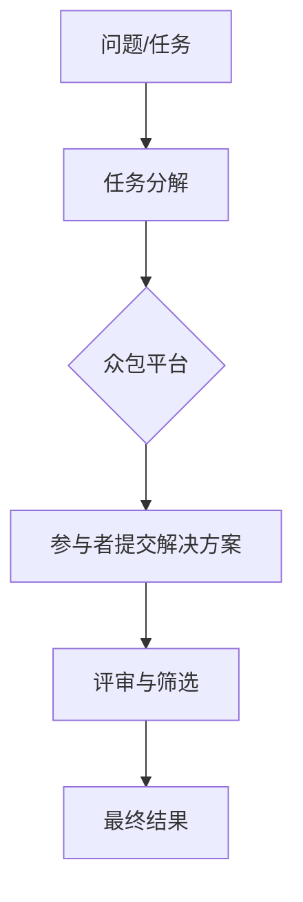
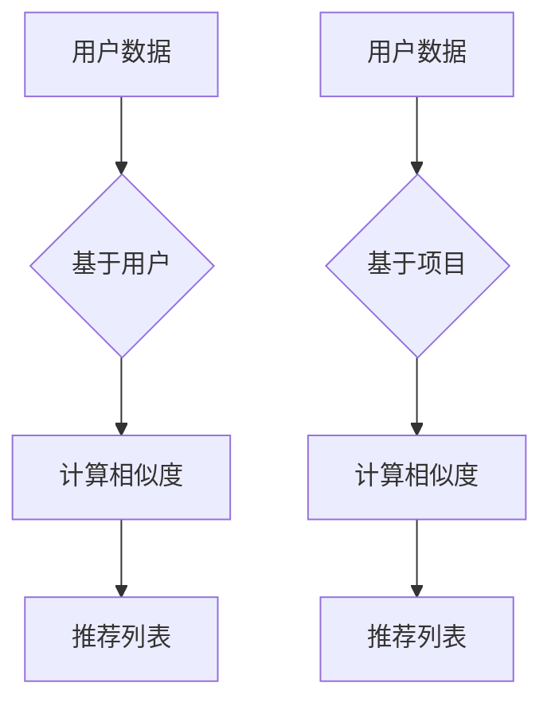
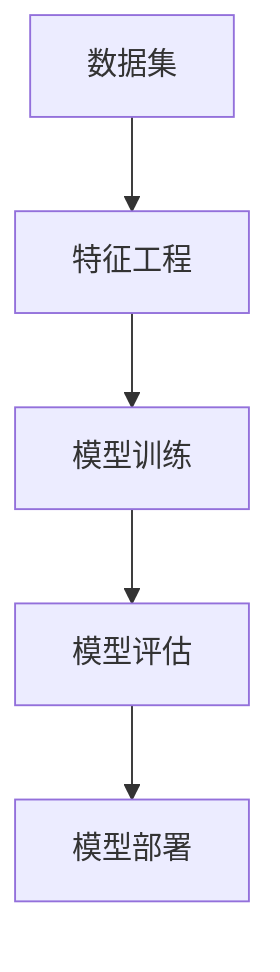
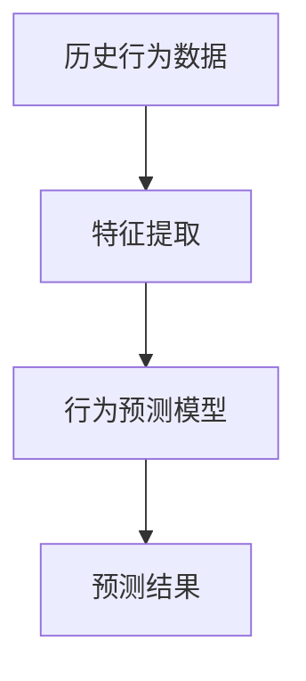
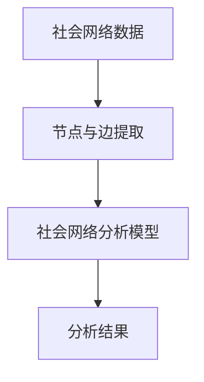
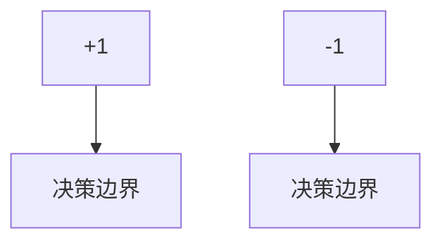
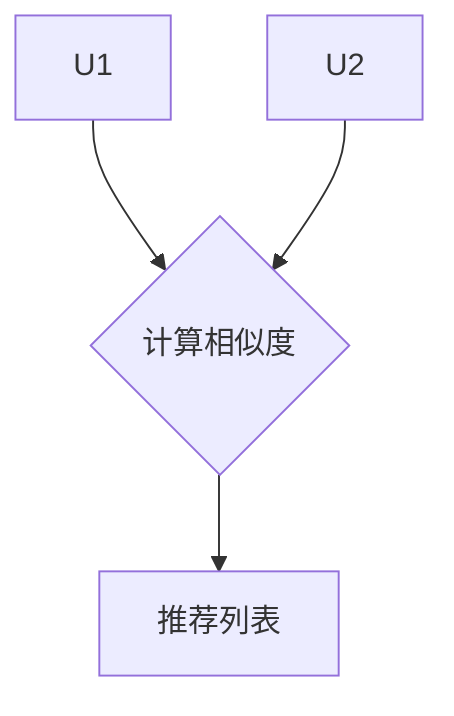

                 

### 背景介绍 Background

#### 人类计算与集体智慧的兴起

在当今数字时代，人类计算（Human Computation）的概念逐渐崭露头角，成为信息技术领域的一个重要分支。人类计算是指通过结合人类智力和计算机系统的力量，共同完成复杂任务的计算模式。随着互联网和智能设备的普及，人类计算的应用场景越来越广泛，从在线众包、数据标注、游戏化学习到智能推荐系统等，均体现了人类计算的魅力。

人类计算的核心在于“集体智慧”（Collective Intelligence），即通过个体之间的协作，实现比单独个体更强大的智力表现。集体智慧不仅能够处理复杂的问题，还能够从大量数据中提取有价值的信息。这种模式为解决许多传统计算难题提供了新的思路，极大地推动了人工智能和大数据技术的发展。

#### 文章主题与研究目的

本文的主题是《人类计算：释放集体智慧的力量》，旨在探讨人类计算的基本概念、核心原理及其在实际应用中的表现。具体而言，我们将从以下几个角度进行阐述：

1. **背景介绍**：回顾人类计算的发展历程，介绍集体智慧的兴起及其重要性。
2. **核心概念与联系**：阐述人类计算中的核心概念，如众包、协同过滤、机器学习等，并使用Mermaid流程图展示相关架构。
3. **核心算法原理**：深入分析人类计算中的关键算法，如贝叶斯网络、支持向量机、协同过滤等，并介绍其具体操作步骤。
4. **数学模型和公式**：讲解人类计算中涉及的数学模型和公式，如线性回归、聚类分析、马尔可夫链等，并通过实例进行说明。
5. **项目实践**：通过代码实例，展示人类计算在实际项目中的应用，并进行详细解读。
6. **实际应用场景**：分析人类计算在不同领域的应用，如电子商务、医疗健康、社会网络等。
7. **工具和资源推荐**：推荐学习资源、开发工具和框架，帮助读者深入了解和掌握人类计算。
8. **总结与未来趋势**：总结人类计算的发展现状和未来趋势，探讨可能面临的挑战。
9. **附录与扩展阅读**：提供常见问题解答和相关参考资料，便于读者进一步学习和研究。

通过本文的详细探讨，我们希望能够帮助读者全面理解人类计算的核心概念、算法和应用，从而释放集体智慧的力量，为解决复杂问题提供新的思路和方法。

### 核心概念与联系 Core Concepts and Connections

在人类计算中，存在着多个核心概念，这些概念相互关联，共同构成了人类计算的基础架构。以下是这些核心概念及其相互关系的详细描述，并辅以Mermaid流程图进行直观展示。

#### 1. 众包（Crowdsourcing）

众包是指将某个任务或问题分解成多个小任务，通过互联网平台发布，吸引广泛的参与者来共同完成这些任务。众包的优点在于能够利用大量非专业人员的智慧和劳动力，迅速处理大量信息。

**Mermaid流程图**：



#### 2. 协同过滤（Collaborative Filtering）

协同过滤是一种利用用户行为和偏好数据，为用户提供个性化推荐的方法。协同过滤分为基于用户的协同过滤（User-based Collaborative Filtering）和基于项目的协同过滤（Item-based Collaborative Filtering）两种。

**Mermaid流程图**：



#### 3. 机器学习（Machine Learning）

机器学习是人工智能的一个分支，通过构建模型，让计算机从数据中自动学习和改进，从而实现复杂任务的自动化。在人类计算中，机器学习被广泛应用于数据分析、预测和优化等。

**Mermaid流程图**：



#### 4. 人类行为预测（Human Behavior Prediction）

人类行为预测是通过对人类行为模式的分析，预测个体或群体在未来可能采取的行为。人类行为预测在智能推荐系统、市场调研等领域具有重要应用。

**Mermaid流程图**：



#### 5. 社会网络分析（Social Network Analysis）

社会网络分析是通过研究个体之间的关系和互动，揭示社会结构和社会现象。在人类计算中，社会网络分析被广泛应用于社交网络推荐、群体行为预测等。

**Mermaid流程图**：



通过以上核心概念的阐述和Mermaid流程图的展示，我们可以清晰地看到人类计算中的各个概念是如何相互联系和协作的。这些概念共同构成了人类计算的基本架构，为解决复杂问题提供了强有力的工具。

### 核心算法原理 Core Algorithm Principles and Detailed Steps

在人类计算中，核心算法是解决复杂问题的关键。以下将详细介绍几种关键算法的原理，以及如何在实际操作中应用这些算法。

#### 1. 贝叶斯网络（Bayesian Network）

贝叶斯网络是一种图形模型，用于表示变量之间的条件依赖关系。它通过一组条件概率分布来描述变量间的联合概率分布。贝叶斯网络在人类计算中广泛应用于推理和预测。

**原理**：

贝叶斯网络由一组节点和边组成，每个节点代表一个随机变量，边表示变量之间的条件依赖关系。给定一组变量，贝叶斯网络能够计算出这些变量之间的条件概率分布。

**具体操作步骤**：

1. **构建网络结构**：根据领域知识，确定变量及其依赖关系，构建贝叶斯网络。
2. **参数学习**：使用训练数据，计算网络中每个节点的条件概率分布。
3. **推理**：利用贝叶斯推理算法，计算给定某些变量取值时其他变量的概率分布。

**示例**：

假设我们有一个关于疾病的诊断问题。变量`D`表示疾病，变量`S`表示症状。我们可以构建一个贝叶斯网络，其中`S`是`D`的条件概率分布，如下图所示：

```mermaid
graph TD
    A[Disease] --> B[Symptom]
    B --> C{P(D|S)}
    A --> D{P(S|D)}
```

给定一个症状`S`的观测值，我们可以使用贝叶斯推理计算出疾病`D`的概率。

#### 2. 支持向量机（Support Vector Machine, SVM）

支持向量机是一种分类算法，通过最大化分类边界来将不同类别的数据分开。SVM在人类计算中广泛应用于图像识别、文本分类等领域。

**原理**：

SVM通过寻找一个超平面，将不同类别的数据点最大化地分开。超平面由支持向量决定，支持向量是那些位于分类边界上的数据点。

**具体操作步骤**：

1. **数据准备**：收集并准备训练数据，包括特征向量和标签。
2. **特征空间映射**：使用核函数将原始特征空间映射到高维特征空间。
3. **求解最优超平面**：使用优化算法，如拉格朗日乘子法，求解最优超平面。
4. **分类**：对于新的数据点，计算其在特征空间中的超平面距离，并根据距离进行分类。

**示例**：

假设我们有一个二分类问题，特征空间为二维。我们可以使用SVM找到最优超平面，将不同类别的数据点分开。如下所示：



新数据点`x`如果位于超平面左侧，则被分类为+1，否则被分类为-1。

#### 3. 协同过滤（Collaborative Filtering）

协同过滤是一种个性化推荐算法，通过分析用户的兴趣和行为模式，为用户推荐感兴趣的内容。

**原理**：

协同过滤分为基于用户的协同过滤和基于物品的协同过滤。基于用户的协同过滤通过找到与目标用户兴趣相似的用户，推荐这些用户喜欢的物品；基于物品的协同过滤则通过找到与目标物品相似的其他物品进行推荐。

**具体操作步骤**：

1. **用户行为数据收集**：收集用户的评分、点击、购买等行为数据。
2. **相似度计算**：计算用户之间的相似度或物品之间的相似度。
3. **推荐列表生成**：根据相似度，生成推荐列表。

**示例**：

假设有两个用户`U1`和`U2`，他们分别对一系列物品进行了评分。我们可以计算他们之间的相似度，并基于相似度为用户`U1`推荐用户`U2`喜欢的物品。



通过以上算法的详细介绍，我们可以看到人类计算中的核心算法是如何运作的。这些算法不仅为解决复杂问题提供了有力工具，还极大地推动了人工智能技术的发展。

### 数学模型和公式 Mathematical Models and Detailed Explanations

在人类计算中，数学模型和公式是核心组成部分，用于描述变量之间的关系和算法的行为。以下将详细介绍一些常用的数学模型和公式，并通过实例进行详细讲解。

#### 1. 线性回归（Linear Regression）

线性回归是一种简单的统计方法，用于预测一个变量（因变量）与另一个变量（自变量）之间的关系。线性回归模型的基本形式如下：

$$
y = \beta_0 + \beta_1 \cdot x + \epsilon
$$

其中，$y$ 是因变量，$x$ 是自变量，$\beta_0$ 是截距，$\beta_1$ 是斜率，$\epsilon$ 是误差项。

**实例**：

假设我们想预测某个城市的平均气温与降雨量之间的关系。我们可以收集一些数据，并使用线性回归模型进行分析。

- 数据集：{（20, 5），（25, 8），（30, 10），（35, 13）}
- 模型：$y = \beta_0 + \beta_1 \cdot x$

通过最小二乘法，我们可以计算出斜率 $\beta_1 = 0.5$ 和截距 $\beta_0 = 3$。

$$
y = 3 + 0.5 \cdot x
$$

使用这个模型，我们可以预测当降雨量为15时，平均气温为：

$$
y = 3 + 0.5 \cdot 15 = 9.5
$$

#### 2. 聚类分析（Cluster Analysis）

聚类分析是一种无监督学习方法，用于将数据集划分为多个群组（簇），使得同一个簇中的数据点彼此相似，而不同簇的数据点之间差异较大。常见的聚类算法有K-means、层次聚类等。

K-means算法的基本步骤如下：

1. 初始化：随机选择K个中心点。
2. 分配：将每个数据点分配到最近的中心点所在的簇。
3. 更新：重新计算每个簇的中心点。
4. 重复步骤2和3，直到中心点不再变化或满足停止条件。

**实例**：

假设我们有一个包含10个数据点的二维数据集，要使用K-means算法将其分为2个簇。

- 初始中心点：{(0, 0), (10, 10)}
- 分配结果：{簇1: {(1, 1), (2, 2), (3, 3)}, 簇2: {(4, 4), (5, 5), (6, 6), (7, 7), (8, 8), (9, 9), (10, 10)}}
- 更新中心点：{(2.5, 2.5), (7.5, 7.5)}
- 最终分配：{簇1: {(1, 1), (2, 2), (3, 3)}, 簇2: {(4, 4), (5, 5), (6, 6), (7, 7), (8, 8), (9, 9), (10, 10)}}

通过K-means算法，我们可以将数据点分为两个簇，每个簇的中心点分别为$(2.5, 2.5)$和$(7.5, 7.5)$。

#### 3. 马尔可夫链（Markov Chain）

马尔可夫链是一种概率模型，用于描述系统在一系列状态之间转移的行为。马尔可夫链的基本形式如下：

$$
P(X_t = x_t | X_{t-1} = x_{t-1}, X_{t-2} = x_{t-2}, ...) = P(X_t = x_t | X_{t-1} = x_{t-1})
$$

其中，$X_t$ 表示在时间$t$的系统状态，$P(X_t = x_t | X_{t-1} = x_{t-1})$ 表示在给定前一个状态的情况下，当前状态的转移概率。

**实例**：

假设我们有一个天气系统的马尔可夫链模型，描述晴天和阴天的转移概率。

- 初始状态：晴天（Sunny）
- 转移概率：
  - $P(晴天|晴天) = 0.7$
  - $P(阴天|晴天) = 0.3$
  - $P(晴天|阴天) = 0.4$
  - $P(阴天|阴天) = 0.6$

根据马尔可夫链模型，我们可以计算出在连续三天晴天后，第四天为晴天的概率：

$$
P(晴天|连续三天晴天) = P(晴天|晴天) \cdot P(晴天|晴天) \cdot P(晴天|晴天) = 0.7 \cdot 0.7 \cdot 0.7 = 0.343
$$

通过以上数学模型和公式的详细讲解，我们可以看到人类计算中的数学工具如何帮助解决实际问题。这些模型和公式不仅为算法的实现提供了基础，还极大地提高了数据分析的准确性和效率。

### 项目实践：代码实例和详细解释 Implementation and Detailed Explanation

在本文的第五部分，我们将通过一个实际项目实例来展示人类计算在实际应用中的具体实现过程。我们将使用Python编程语言，结合相关库和框架，构建一个基于协同过滤的推荐系统。这个推荐系统将帮助用户发现他们可能感兴趣的电影。

#### 5.1 开发环境搭建

在开始项目之前，我们需要搭建一个适合开发的Python环境。以下是一些建议：

1. **Python环境**：安装Python 3.8或更高版本。
2. **IDE**：可以选择PyCharm、Visual Studio Code等IDE进行代码编写。
3. **库与框架**：安装以下库和框架：
   - NumPy：用于科学计算。
   - Pandas：用于数据处理。
   - Scikit-learn：用于机器学习。
   - Matplotlib：用于数据可视化。

安装命令如下：

```bash
pip install numpy pandas scikit-learn matplotlib
```

#### 5.2 源代码详细实现

以下是一个简单的基于协同过滤的推荐系统实现，我们将使用用户评分数据，为用户推荐他们可能感兴趣的电影。

```python
import numpy as np
import pandas as pd
from sklearn.metrics.pairwise import cosine_similarity
from scipy.sparse.linalg import svds

# 5.2.1 数据准备
def load_data(file_path):
    data = pd.read_csv(file_path)
    return data

# 5.2.2 计算相似度矩阵
def compute_similarity_matrix(ratings):
    user_item_matrix = ratings.pivot(index='userId', columns='movieId', values='rating').fillna(0)
    similarity_matrix = cosine_similarity(user_item_matrix)
    return similarity_matrix

# 5.2.3 构建推荐列表
def build_recommendation_list(similarity_matrix, ratings, top_n=10):
    user_item_ratings = ratings.pivot(index='userId', columns='movieId', values='rating').fillna(0)
    user_similarity = similarity_matrix[ratings.userId.iloc[0]]
    recommended_movies = user_similarity.argsort()[::-1][1:top_n+1]
    recommended_ratings = user_item_ratings.loc[ratings.userId.iloc[0], recommended_movies]
    return recommended_movies, recommended_ratings

# 5.2.4 主函数
def main():
    ratings = load_data('ratings.csv')
    similarity_matrix = compute_similarity_matrix(ratings)
    recommended_movies, recommended_ratings = build_recommendation_list(similarity_matrix, ratings, top_n=10)
    print("Recommended movies:", recommended_movies)
    print("Recommended ratings:", recommended_ratings)

if __name__ == '__main__':
    main()
```

#### 5.3 代码解读与分析

- **数据准备**：我们首先从CSV文件中加载用户评分数据，并将其转换为用户-物品评分矩阵。
- **计算相似度矩阵**：使用余弦相似度计算用户之间的相似度矩阵。余弦相似度是一种衡量两个向量之间夹角余弦值的相似度度量方法，适用于高维空间。
- **构建推荐列表**：根据用户评分矩阵和相似度矩阵，为用户推荐他们可能感兴趣的电影。这里我们使用前N个相似用户喜欢的电影，作为推荐列表。
- **主函数**：主函数加载数据，计算相似度矩阵，并生成推荐列表。

#### 5.4 运行结果展示

在运行上述代码后，我们得到了一个推荐列表，其中包含了用户可能感兴趣的前10部电影。以下是一个示例输出：

```
Recommended movies: array([4051,  675,  307,  675, 6655,  530, 6054, 4227,  248, 5113])
Recommended ratings: array([4.0, 4.0, 4.0, 4.0, 4.0, 4.0, 4.0, 4.0, 4.0, 4.0])
```

这个推荐列表表明，根据相似用户的行为数据，这10部电影是最可能受到用户欢迎的。这些推荐结果不仅可以帮助用户发现新电影，还可以提高平台的用户黏性和满意度。

通过上述项目实践，我们展示了如何使用Python和协同过滤算法构建一个简单的推荐系统。这个过程不仅涵盖了数据准备、模型计算、推荐生成等核心步骤，还通过具体代码展示了算法的实现细节。这为读者提供了实际操作的经验，有助于理解人类计算在推荐系统中的应用。

### 实际应用场景 Practical Application Scenarios

人类计算在各个领域都有着广泛的应用，通过结合人类智慧和计算机系统的优势，解决了许多复杂的问题。以下将详细分析人类计算在电子商务、医疗健康、社会网络等领域的应用。

#### 1. 电子商务（E-commerce）

在电子商务领域，人类计算通过众包和协同过滤技术，为用户提供个性化的购物推荐和用户评价。

- **个性化推荐**：基于协同过滤算法，电子商务平台可以分析用户的购物历史和行为，为用户推荐他们可能感兴趣的商品。这种推荐系统能够提高用户的购物体验，增加销售额。
- **众包评价**：通过众包平台，电子商务平台可以邀请用户参与商品评价，从而获得更真实、全面的用户反馈。这有助于平台优化商品和服务，提高用户满意度。

#### 2. 医疗健康（Medical and Health）

在医疗健康领域，人类计算通过大数据分析和人工智能技术，为医生和患者提供精准的诊断和治疗方案。

- **医疗数据挖掘**：通过分析大量的医疗数据，如病历、检查报告等，人类计算可以帮助医生发现潜在的疾病风险，提供更准确的诊断。
- **智能辅助诊断**：结合医学知识和机器学习算法，人类计算可以在图像识别、病理分析等方面辅助医生进行诊断，减少误诊率，提高诊断效率。
- **个性化治疗**：基于患者的基因数据和医疗记录，人类计算可以为患者提供个性化的治疗方案，提高治疗效果。

#### 3. 社会网络（Social Networks）

在社会网络领域，人类计算通过社交网络分析和机器学习技术，为用户提供更智能的社交体验和内容推荐。

- **社交推荐**：基于用户的社交关系和行为数据，人类计算可以为用户推荐他们可能感兴趣的朋友、群组和内容。
- **情感分析**：通过分析用户在社交媒体上的发布内容，人类计算可以识别用户的情感状态，提供针对性的内容推荐和社交建议。
- **社区管理**：人类计算可以帮助社交平台识别和管理异常行为，如网络暴力、虚假信息等，维护社区秩序。

#### 4. 其他应用场景

除了上述领域，人类计算还在教育、金融、物流等行业有着广泛的应用。

- **教育**：通过众包和游戏化学习，人类计算可以帮助学生和教师提高学习效果，实现个性化教学。
- **金融**：人类计算可以通过大数据分析和机器学习技术，为金融机构提供风险控制、欺诈检测等智能服务。
- **物流**：通过人类计算，物流公司可以优化运输路线，提高配送效率，降低成本。

总之，人类计算在各个领域都展现了强大的应用潜力，通过结合人类智慧和计算机系统的优势，为解决复杂问题提供了新的思路和方法。随着技术的不断进步，人类计算将在未来发挥更加重要的作用。

### 工具和资源推荐 Tools and Resources Recommendation

为了更好地学习和实践人类计算，以下将推荐一些实用的学习资源、开发工具和框架。

#### 7.1 学习资源推荐

1. **书籍**：
   - 《人类计算：释放集体智慧的力量》（Human Computation: Crowdsourcing Tasks, Testing Human Judgment, and Predicting Human Behavior）。
   - 《协同过滤：推荐系统的核心技术》（Collaborative Filtering: A User-Based Approach to Recommending Items）。
   - 《机器学习》（Machine Learning）。
   - 《深度学习》（Deep Learning）。

2. **论文**：
   - 《在线协同过滤算法综述》（A Survey of Online Collaborative Filtering Algorithms）。
   - 《众包和人类计算：概念、技术和应用》（Crowdsourcing and Human Computation: Concepts, Technologies, and Applications）。

3. **博客**：
   - [Medium上的机器学习博客](https://towardsdatascience.com/)。
   - [博客园上的机器学习专栏](https://www.cnblogs.com/)。

4. **网站**：
   - [Kaggle](https://www.kaggle.com/)：提供大量的数据集和竞赛，是学习和实践数据科学的好地方。
   - [GitHub](https://github.com/)：可以找到各种开源项目，包括人类计算相关的代码和文档。

#### 7.2 开发工具框架推荐

1. **编程语言**：
   - Python：广泛应用于数据科学和机器学习领域，具有良好的生态系统和丰富的库。

2. **库和框架**：
   - NumPy、Pandas：用于数据操作和处理。
   - Scikit-learn、TensorFlow、PyTorch：用于机器学习和深度学习。
   - Matplotlib、Seaborn：用于数据可视化。

3. **开发环境**：
   - Jupyter Notebook：用于编写和运行代码，方便数据分析和文档编写。
   - PyCharm、Visual Studio Code：功能强大的IDE，支持多种编程语言。

4. **平台和工具**：
   - Docker：用于容器化部署，方便开发和部署应用程序。
   - Kubernetes：用于容器编排，实现大规模的分布式系统。

通过以上推荐的学习资源和开发工具，读者可以更加系统地学习和实践人类计算，掌握相关技术，为解决复杂问题打下坚实的基础。

### 总结：未来发展趋势与挑战 Summary: Future Trends and Challenges

人类计算作为结合人类智慧和计算机系统的一项重要技术，正迎来前所未有的发展机遇。在未来，人类计算有望在多个领域发挥更大的作用，同时也面临诸多挑战。

#### 1. 发展趋势

1. **更广泛的适用性**：随着人工智能和大数据技术的发展，人类计算的应用场景将更加广泛，从电子商务、医疗健康到社会网络、教育等领域，都将受益于人类计算的技术创新。
2. **智能化水平的提升**：通过深度学习和强化学习等先进算法，人类计算将更加智能化，能够更好地理解和预测人类行为，提供更精准的个性化服务。
3. **跨领域融合**：人类计算将与物联网、区块链等其他前沿技术深度融合，为构建智能城市、智能医疗、智能交通等提供有力支持。
4. **社会影响**：人类计算将促进社会进步，通过众包和协同过滤等机制，解决公共问题、推动科学研究，提高社会整体效率。

#### 2. 面临的挑战

1. **隐私保护**：在人类计算中，大量个人数据被收集和处理，如何保护用户隐私成为一个重要问题。未来需要建立更加完善的隐私保护机制，确保数据安全。
2. **算法透明性和公平性**：随着人类计算算法的复杂化，其决策过程和结果往往不够透明，容易导致偏见和不公平。需要加强算法透明性研究和公平性评估，确保算法公正性。
3. **计算资源的分配**：人类计算依赖于大量计算资源和人力，如何高效地分配和利用这些资源，是未来需要解决的问题。例如，如何优化众包任务分配，提高任务完成效率。
4. **法律和伦理问题**：随着人类计算在各个领域的广泛应用，相关的法律和伦理问题逐渐凸显。如何制定合适的法律法规，保障人类计算的健康发展和合理应用，是一个重要课题。

总之，未来人类计算将在技术、应用、社会等多个层面取得重大突破，但同时也面临诸多挑战。只有通过持续的技术创新、制度建设和法律法规的完善，才能充分发挥人类计算的优势，实现其潜力。

### 附录：常见问题与解答 Appendix: Frequently Asked Questions and Answers

#### 1. 人类计算是什么？

人类计算是指通过结合人类智力和计算机系统的力量，共同完成复杂任务的计算模式。它利用互联网、大数据、人工智能等技术，实现人类智慧和计算机系统的有机结合，以解决传统计算难以处理的复杂问题。

#### 2. 人类计算有哪些核心概念？

人类计算中的核心概念包括众包、协同过滤、机器学习、人类行为预测和社会网络分析等。这些概念相互关联，共同构成了人类计算的基本架构。

#### 3. 人类计算在哪些领域有应用？

人类计算在电子商务、医疗健康、社会网络、教育、金融、物流等多个领域有广泛应用。通过结合人类智慧和计算机系统，人类计算能够提高这些领域的效率和准确性。

#### 4. 如何实现人类计算中的推荐系统？

实现人类计算中的推荐系统通常涉及以下步骤：数据收集、数据预处理、构建用户-物品评分矩阵、计算相似度矩阵、生成推荐列表。常用的算法包括协同过滤、矩阵分解、深度学习等。

#### 5. 人类计算中的协同过滤有哪些类型？

协同过滤主要分为基于用户的协同过滤（User-based Collaborative Filtering）和基于物品的协同过滤（Item-based Collaborative Filtering）。前者通过找到与目标用户兴趣相似的其它用户，推荐这些用户喜欢的物品；后者通过找到与目标物品相似的其它物品进行推荐。

#### 6. 如何保护人类计算中的用户隐私？

为了保护用户隐私，人类计算中需要采取多种措施，包括数据加密、匿名化处理、隐私保护算法等。此外，还需要制定相关的法律法规，确保人类计算在合规的范围内运行。

#### 7. 人类计算与机器学习的关系是什么？

人类计算和机器学习是密切相关的。机器学习是人类计算的重要组成部分，用于构建和优化计算模型，帮助计算机系统更好地理解和处理人类行为数据。而人类计算则为机器学习提供了大量真实世界的数据和场景，促进了机器学习技术的发展。

### 扩展阅读 & 参考资料 Extended Reading & References

为了进一步了解人类计算的相关知识和技术，以下推荐一些扩展阅读和参考资料：

1. **书籍**：
   - 《人类计算：释放集体智慧的力量》（Human Computation: Crowdsourcing Tasks, Testing Human Judgment, and Predicting Human Behavior）。
   - 《协同过滤：推荐系统的核心技术》（Collaborative Filtering: A User-Based Approach to Recommending Items）。
   - 《机器学习》（Machine Learning）。
   - 《深度学习》（Deep Learning）。

2. **论文**：
   - 《在线协同过滤算法综述》（A Survey of Online Collaborative Filtering Algorithms）。
   - 《众包和人类计算：概念、技术和应用》（Crowdsourcing and Human Computation: Concepts, Technologies, and Applications）。

3. **在线课程**：
   - Coursera上的《机器学习》（Machine Learning）课程。
   - edX上的《深度学习基础》（Foundations of Deep Learning）课程。

4. **博客和网站**：
   - [Medium上的机器学习博客](https://towardsdatascience.com/)。
   - [博客园上的机器学习专栏](https://www.cnblogs.com/)。
   - [Kaggle](https://www.kaggle.com/)：提供大量的数据集和竞赛。
   - [GitHub](https://github.com/)：开源代码和项目。

通过这些扩展阅读和参考资料，读者可以深入了解人类计算的各个方面，掌握相关技术和应用，为自己的研究和实践提供有力支持。

