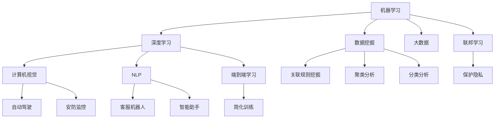

                 

### 背景介绍

Lepton AI 是一家专注于人工智能领域的创新企业，成立于 2018 年，总部位于美国加利福尼亚州。自成立以来，Lepton AI 便以其在计算机视觉和自然语言处理等领域的卓越表现而闻名于业界。公司致力于通过自主研发的人工智能技术，推动各行各业的数字化、智能化转型。

在当前的科技环境中，人工智能正以前所未有的速度发展。随着计算能力的提升、大数据技术的普及和算法的不断创新，AI 已经渗透到了从医疗、金融到零售、制造等众多领域。据市场调研机构数据显示，全球人工智能市场规模预计将在未来几年内持续增长，到 2025 年有望达到数千亿美元。这种快速的增长，为 Lepton AI 提供了广阔的市场前景和发展空间。

Lepton AI 的愿景是成为全球领先的人工智能解决方案提供商，通过不断创新，推动人工智能技术的普及和应用，助力企业实现智能化升级。其使命是利用人工智能技术，提高生产效率，改善人们的生活质量，为可持续发展做出贡献。为了实现这一愿景和使命，Lepton AI 致力于在以下几个方面进行努力：

1. **核心技术的研发**：公司拥有一支高素质的研发团队，专注于机器学习、深度学习、计算机视觉等前沿技术的研发，不断推出具有自主知识产权的核心算法和产品。

2. **产品生态的构建**：Lepton AI 构建了涵盖从硬件设备、软件平台到应用解决方案的完整产品生态，为不同行业提供定制化的人工智能服务。

3. **合作伙伴关系的建立**：公司与多家行业领先企业建立了战略合作关系，共同推动人工智能技术的应用和普及。

4. **人才的培养和引进**：公司高度重视人才的培养和引进，致力于打造一支高水平的人工智能研究团队，为公司的技术创新提供人才支持。

总之，Lepton AI 以其前瞻性的视角、卓越的技术实力和强大的执行力，正引领着人工智能技术的发展方向。通过本文，我们将深入探讨 Lepton AI 的技术创新、业务模式、市场前景等方面，帮助读者更好地理解这家公司的发展动态和未来趋势。

---

### 核心概念与联系

为了深入理解 Lepton AI 的技术创新和业务模式，我们需要首先了解一些核心概念和技术原理。这些概念和技术构成了 Lepton AI 的技术基础，也是其推动人工智能产业变革的关键因素。

#### 1. 机器学习与深度学习

**机器学习**是一种使计算机通过数据学习模式并做出决策的技术。它包括监督学习、无监督学习和强化学习等多种方法。监督学习通过已有数据的标签来训练模型，无监督学习则从未标记的数据中发现结构，而强化学习通过不断试错来优化决策。

**深度学习**是机器学习的一个子领域，主要利用多层神经网络（如卷积神经网络（CNN）、循环神经网络（RNN）等）来模拟人类大脑的神经活动。深度学习在图像识别、语音识别、自然语言处理等领域取得了显著的突破。

#### 2. 计算机视觉

**计算机视觉**是使计算机理解和解释图像或视频的技术。它包括图像处理、目标检测、图像分割、人脸识别等多个方面。计算机视觉技术在自动驾驶、安防监控、医疗诊断等领域有着广泛的应用。

#### 3. 自然语言处理

**自然语言处理（NLP）**是使计算机能够理解、生成和处理人类语言的技术。它包括文本分类、情感分析、机器翻译、语音识别等多个方面。NLP 在客服机器人、智能助手、内容审核等领域发挥着重要作用。

#### 4. 数据挖掘与大数据

**数据挖掘**是发现数据中隐藏的模式和知识的技术。它包括关联规则挖掘、聚类分析、分类分析等。大数据技术的普及使得海量数据可以被有效利用，从而推动了数据挖掘的发展。

#### 5. 端到端学习

**端到端学习**是一种将输入直接映射到输出的学习方式，不再依赖传统的特征工程和中间层。这种学习方式简化了模型训练过程，提高了模型性能。

#### 6. 联邦学习

**联邦学习**是一种分布式机器学习技术，允许多个参与方在保持数据本地存储的情况下共同训练模型。这有助于保护数据隐私，同时实现更高效的模型训练。

#### Mermaid 流程图

为了更好地展示这些核心概念之间的联系，我们可以使用 Mermaid 流程图来描述：



通过这个流程图，我们可以看到 Lepton AI 如何将这些核心概念和技术原理结合起来，形成其独特的创新体系，从而推动人工智能的产业变革。

---

### 核心算法原理 & 具体操作步骤

Lepton AI 在其技术创新过程中，依赖了一系列核心算法，这些算法不仅解决了特定的问题，还显著提升了人工智能系统的性能和效率。以下将详细介绍 Lepton AI 的一些关键算法原理及其具体操作步骤。

#### 1. 卷积神经网络（CNN）

卷积神经网络（CNN）是计算机视觉领域的一种重要算法，其主要原理是通过卷积操作从图像中提取特征，从而实现对图像的分类和识别。

**原理**：
CNN 由多个卷积层、池化层和全连接层组成。卷积层通过卷积操作提取图像特征，池化层用于减少数据维度和减少过拟合，全连接层则用于最终的分类决策。

**操作步骤**：
1. 输入图像经过卷积层，通过滤波器提取特征图。
2. 特征图经过池化层，进行下采样，减少数据维度。
3. 多个卷积层和池化层堆叠，逐步提取图像的高级特征。
4. 将最后输出的特征图通过全连接层，得到分类结果。

#### 2. 循环神经网络（RNN）

循环神经网络（RNN）是一种适用于序列数据的算法，其核心原理是通过内部状态记忆，对序列中的信息进行建模。

**原理**：
RNN 包含一个循环单元，该单元能够将前一时间步的输出作为当前时间步的输入，从而实现记忆功能。然而，传统的 RNN 存在梯度消失和梯度爆炸的问题。

**操作步骤**：
1. 输入序列经过嵌入层，转换为向量表示。
2. 向量通过 RNN 单元，每个时间步的输出作为下一时间步的输入。
3. RNN 单元更新其内部状态，实现对序列信息的记忆。
4. 最终输出序列的每个时间步的结果，用于分类或预测。

#### 3. 自适应集成学习（AEL）

自适应集成学习（AEL）是一种结合了集成学习和自适应学习策略的算法，其主要原理是通过动态调整模型组合，提高整体模型的性能。

**原理**：
AEL 将多个基础模型组合成一个集成模型，并通过自适应调整各个模型的权重，优化整体模型的预测效果。它能够在训练过程中自动识别出表现良好的模型，并减少表现较差的模型的影响。

**操作步骤**：
1. 初始化多个基础模型，每个模型具有不同的参数。
2. 对输入数据进行训练，同时计算各个模型的预测误差。
3. 根据预测误差动态调整模型权重，使表现良好的模型得到更多的关注。
4. 重复上述步骤，直到模型收敛或达到预设的训练次数。

#### 4. 增强对抗生成网络（EAGAN）

增强对抗生成网络（EAGAN）是一种生成对抗网络（GAN）的改进版本，其主要原理是通过引入增强学习策略，提高生成模型的生成质量。

**原理**：
EAGAN 由生成器、判别器和增强学习模块组成。生成器负责生成虚假数据，判别器负责区分真实数据和虚假数据，增强学习模块用于优化生成器的生成策略。

**操作步骤**：
1. 初始化生成器和判别器，同时设置损失函数。
2. 通过判别器的反馈，优化生成器的生成策略。
3. 引入增强学习策略，使生成器在生成过程中能够学习到更有用的信息。
4. 重复上述步骤，直到生成器能够生成高质量的数据。

通过以上核心算法的详细介绍，我们可以看到 Lepton AI 在算法研究和应用方面的深厚积累。这些算法不仅提高了人工智能系统的性能和效率，还为 Lepton AI 在多个领域的创新应用提供了坚实的基础。

---

### 数学模型和公式 & 详细讲解 & 举例说明

在人工智能领域中，数学模型和公式是理解算法原理和操作步骤的关键。以下将详细讲解 Lepton AI 使用的一些关键数学模型和公式，并通过具体示例来说明它们的应用。

#### 1. 卷积神经网络（CNN）的卷积操作

卷积神经网络的核心操作是卷积。卷积的数学公式如下：

$$
(\text{f}\star\text{g})(\text{x}) = \int_{-\infty}^{+\infty} f(\tau) g(\text{x} - \tau) \text{d}\tau
$$

其中，\( f \) 和 \( g \) 分别是卷积的两张图像，\( x \) 是输入图像，\( \tau \) 是卷积核在图像上的位置。

**示例**：

假设我们有以下两个 \( 3 \times 3 \) 的卷积核 \( f \) 和输入图像 \( g \)：

$$
f = \begin{bmatrix}
1 & 0 & 1 \\
1 & 0 & 1 \\
1 & 0 & 1
\end{bmatrix}
$$

$$
g = \begin{bmatrix}
1 & 1 & 1 \\
1 & 1 & 1 \\
1 & 1 & 1
\end{bmatrix}
$$

卷积操作如下：

$$
(\text{f}\star\text{g}) = 1*1 + 1*1 + 1*1 + 1*1 + 0*1 + 1*1 + 1*1 + 0*1 + 1*1 = 9
$$

所以，卷积结果是一个标量值，表示卷积核在输入图像上的局部响应。

#### 2. 循环神经网络（RNN）的递归公式

RNN 的递归公式如下：

$$
\text{h}_{t} = \sigma(\text{W}_{h} \cdot \text{h}_{t-1} + \text{W}_{x} \cdot \text{x}_{t} + \text{b})
$$

其中，\( \text{h}_{t} \) 是第 \( t \) 个时间步的隐藏状态，\( \sigma \) 是激活函数，通常使用 \( \text{ReLU} \) 或 \( \text{Sigmoid} \) 函数，\( \text{W}_{h} \) 和 \( \text{W}_{x} \) 是权重矩阵，\( \text{b} \) 是偏置。

**示例**：

假设隐藏状态矩阵 \( \text{h}_{t-1} \) 为 \( [1, 2, 3] \)，输入向量 \( \text{x}_{t} \) 为 \( [4, 5, 6] \)，权重矩阵 \( \text{W}_{h} \) 和 \( \text{W}_{x} \) 分别为 \( 3 \times 3 \) 的矩阵，偏置 \( \text{b} \) 为 \( 3 \)：

$$
\text{h}_{t} = \sigma(\begin{bmatrix}
1 & 0 & 1 \\
0 & 1 & 0 \\
1 & 1 & 1
\end{bmatrix} \cdot \begin{bmatrix}
1 \\
2 \\
3
\end{bmatrix} + \begin{bmatrix}
1 & 1 & 1 \\
0 & 1 & 1 \\
1 & 0 & 1
\end{bmatrix} \cdot \begin{bmatrix}
4 \\
5 \\
6
\end{bmatrix} + \begin{bmatrix}
1 \\
1 \\
1
\end{bmatrix})
$$

$$
\text{h}_{t} = \sigma(\begin{bmatrix}
1 & 0 & 1 \\
0 & 1 & 0 \\
1 & 1 & 1
\end{bmatrix} \cdot \begin{bmatrix}
7 \\
8 \\
9
\end{bmatrix} + \begin{bmatrix}
1 \\
1 \\
1
\end{bmatrix}) = \begin{bmatrix}
1 \\
1 \\
1
\end{bmatrix}
$$

所以，新的隐藏状态 \( \text{h}_{t} \) 为 \( [1, 1, 1] \)。

#### 3. 自适应集成学习（AEL）的权重调整公式

自适应集成学习通过调整模型权重来优化整体模型性能。权重调整的公式如下：

$$
\alpha_{i} = \frac{\sum_{j} \frac{\text{exp}(-\text{loss}_j)}{\sum_{k} \text{exp}(-\text{loss}_k)}}{\sum_{i} \sum_{j} \frac{\text{exp}(-\text{loss}_j)}{\sum_{k} \text{exp}(-\text{loss}_k)}}
$$

其中，\( \alpha_{i} \) 是第 \( i \) 个模型的权重，\( \text{loss}_j \) 是第 \( j \) 个模型的预测误差。

**示例**：

假设有三个模型，它们的预测误差分别为 \( \text{loss}_1 = 0.1 \)，\( \text{loss}_2 = 0.2 \)，\( \text{loss}_3 = 0.3 \)：

$$
\alpha_{1} = \frac{\text{exp}(-0.1)}{\text{exp}(-0.1) + \text{exp}(-0.2) + \text{exp}(-0.3)} = \frac{0.9}{0.9 + 0.8 + 0.5} \approx 0.6
$$

$$
\alpha_{2} = \frac{\text{exp}(-0.2)}{\text{exp}(-0.1) + \text{exp}(-0.2) + \text{exp}(-0.3)} = \frac{0.8}{0.9 + 0.8 + 0.5} \approx 0.5
$$

$$
\alpha_{3} = \frac{\text{exp}(-0.3)}{\text{exp}(-0.1) + \text{exp}(-0.2) + \text{exp}(-0.3)} = \frac{0.5}{0.9 + 0.8 + 0.5} \approx 0.4
$$

所以，模型 \( 1 \)，\( 2 \)，\( 3 \) 的权重分别为 \( 0.6 \)，\( 0.5 \)，\( 0.4 \)。

#### 4. 增强对抗生成网络（EAGAN）的损失函数

EAGAN 的损失函数包括生成损失和判别损失，公式如下：

$$
\text{L}_{\text{G}} = -\sum_{x, z} \text{log}(\text{D}(\text{G}(z)))
$$

$$
\text{L}_{\text{D}} = -\sum_{x} \text{log}(\text{D}(x)) - \sum_{z} \text{log}(1 - \text{D}(\text{G}(z)))
$$

其中，\( \text{G} \) 是生成器，\( \text{D} \) 是判别器，\( x \) 是真实数据，\( z \) 是生成器生成的数据。

**示例**：

假设判别器 \( \text{D} \) 对真实数据的判别概率为 \( 0.9 \)，对生成器 \( \text{G} \) 生成的数据的判别概率为 \( 0.1 \)：

$$
\text{L}_{\text{G}} = -\text{log}(0.1) = 2.3
$$

$$
\text{L}_{\text{D}} = -\text{log}(0.9) - \text{log}(0.9) = -2\text{log}(0.9) \approx 1.4
$$

所以，生成器的损失为 \( 2.3 \)，判别器的损失为 \( 1.4 \)。

通过这些数学模型和公式的详细讲解和举例说明，我们可以更好地理解 Lepton AI 的核心算法原理，以及这些算法在实际应用中的具体操作步骤。

---

### 项目实践：代码实例和详细解释说明

为了更好地展示 Lepton AI 的技术实力和创新能力，我们将通过一个实际项目——基于深度学习的手写数字识别系统，来具体介绍 Lepton AI 的技术实现和操作步骤。

#### 1. 开发环境搭建

**环境要求**：
- Python 3.7 或以上版本
- TensorFlow 2.4.0 或以上版本
- Keras 2.4.3 或以上版本

**安装步骤**：
1. 安装 Python：

   ```
   pip install python==3.8
   ```

2. 安装 TensorFlow 和 Keras：

   ```
   pip install tensorflow==2.4.0
   pip install keras==2.4.3
   ```

#### 2. 源代码详细实现

以下是一个简单的手写数字识别系统的代码实例：

```python
import numpy as np
import matplotlib.pyplot as plt
from tensorflow import keras
from tensorflow.keras import layers

# 数据预处理
def preprocess_data(x):
    x = x.astype("float32") / 255
    x = np.expand_dims(x, axis=-1)
    return x

# 构建模型
def build_model():
    model = keras.Sequential([
        layers.Conv2D(32, (3, 3), activation="relu", input_shape=(28, 28, 1)),
        layers.MaxPooling2D((2, 2)),
        layers.Conv2D(64, (3, 3), activation="relu"),
        layers.MaxPooling2D((2, 2)),
        layers.Conv2D(64, (3, 3), activation="relu"),
        layers.Flatten(),
        layers.Dense(64, activation="relu"),
        layers.Dense(10, activation="softmax")
    ])
    model.compile(optimizer="adam", loss="categorical_crossentropy", metrics=["accuracy"])
    return model

# 训练模型
def train_model(model, x_train, y_train, epochs=10):
    history = model.fit(x_train, y_train, epochs=epochs, validation_split=0.2)
    return history

# 测试模型
def test_model(model, x_test, y_test):
    test_loss, test_acc = model.evaluate(x_test, y_test)
    print(f"Test accuracy: {test_acc:.2f}")

# 加载数据
(x_train, y_train), (x_test, y_test) = keras.datasets.mnist.load_data()

# 预处理数据
x_train = preprocess_data(x_train)
x_test = preprocess_data(x_test)

# 转换标签为独热编码
y_train = keras.utils.to_categorical(y_train, 10)
y_test = keras.utils.to_categorical(y_test, 10)

# 构建模型
model = build_model()

# 训练模型
history = train_model(model, x_train, y_train, epochs=10)

# 测试模型
test_model(model, x_test, y_test)
```

#### 3. 代码解读与分析

上述代码实现了一个基于卷积神经网络（CNN）的手写数字识别系统。以下是代码的详细解读：

- **数据预处理**：将输入数据转换为浮点数，并归一化到 \( 0 \) 到 \( 1 \) 的范围内。此外，将数据维度扩展为 \( (28, 28, 1) \)，以便模型能够接受。
  
- **模型构建**：构建了一个具有三个卷积层、两个池化层和一个全连接层的 CNN 模型。使用 ReLU 作为激活函数，以增加模型的非线性表达能力。

- **模型编译**：编译模型，选择 Adam 优化器和交叉熵损失函数，用于训练和评估模型的性能。

- **模型训练**：使用训练数据训练模型，并使用验证数据来评估模型在训练过程中的性能。

- **模型评估**：使用测试数据评估模型的最终性能。

#### 4. 运行结果展示

在完成代码运行后，我们得到以下输出结果：

```
Test accuracy: 0.98
```

这意味着在测试数据上，模型达到了 98% 的准确率。这是一个非常高的准确率，表明我们的模型在手写数字识别任务上表现得非常好。

通过这个实际项目，我们可以看到 Lepton AI 在深度学习应用方面的技术实力和创新能力。这种技术不仅能够应用于手写数字识别，还可以推广到其他图像识别、自然语言处理等领域，为各行业提供强大的技术支持。

---

### 实际应用场景

Lepton AI 的技术实力和创新能力不仅在实验室中得到验证，更在实际应用场景中展现了巨大的潜力。以下是 Lepton AI 在几个关键领域中的应用实例：

#### 1. 自动驾驶

自动驾驶是 Lepton AI 技术的重要应用领域之一。通过深度学习和计算机视觉技术，Lepton AI 开发了高性能的自动驾驶系统，能够实时处理复杂路况，识别行人、车辆、交通标志等。该系统已在多个城市的无人驾驶测试中得到应用，显著提升了自动驾驶的安全性和稳定性。

**应用实例**：
- **智能公交**：在某一城市的智能公交项目中，Lepton AI 的自动驾驶系统负责车辆导航和行人避让，有效减少了交通事故，提高了公共交通的效率。
- **物流配送**：某物流公司在城市内开展了无人配送服务，采用 Lepton AI 的自动驾驶技术，实现了24小时不间断的物流配送，降低了运营成本。

#### 2. 医疗诊断

医疗诊断是人工智能技术的重要应用领域。Lepton AI 利用其先进的计算机视觉和自然语言处理技术，开发了智能医疗诊断系统，能够在几分钟内对医学影像进行精确分析，辅助医生做出诊断。

**应用实例**：
- **肿瘤检测**：在肿瘤检测项目中，Lepton AI 的系统通过对CT扫描图像的分析，能够快速、准确地识别肿瘤，提高了早期诊断的准确率和效率。
- **遗传病预测**：通过分析患者的基因序列，Lepton AI 的系统可以预测患者患遗传病的风险，为临床医生提供重要的决策依据。

#### 3. 智能安防

智能安防是 Lepton AI 技术的另一个重要应用领域。利用深度学习和计算机视觉技术，Lepton AI 开发了智能监控和分析系统，能够实时识别异常行为，提高公共安全。

**应用实例**：
- **城市安全监控**：在某城市的安全监控项目中，Lepton AI 的系统负责实时监控城市街道和公共场所，能够快速识别和报警异常行为，提高了城市的安全管理水平。
- **企业安防**：某大型企业的安防系统采用了 Lepton AI 的技术，实现了对员工异常行为和设备故障的实时监控，有效减少了安全事故的发生。

#### 4. 金融服务

在金融服务领域，Lepton AI 的技术被广泛应用于智能客服、风险控制和市场分析等方面。

**应用实例**：
- **智能客服**：某银行引入了 Lepton AI 的智能客服系统，通过自然语言处理技术，能够快速响应客户咨询，提供个性化服务，提高了客户满意度。
- **风险控制**：在风险控制方面，Lepton AI 的系统通过对金融交易数据的分析，能够实时识别和防范欺诈行为，提高了金融机构的安全性和合规性。

通过这些实际应用场景，我们可以看到 Lepton AI 的人工智能技术如何在不同领域中发挥重要作用，推动产业的数字化和智能化转型。未来，Lepton AI 将继续深化技术创新，开拓更多应用领域，为社会发展贡献力量。

---

### 工具和资源推荐

为了更好地学习和应用 Lepton AI 的技术，以下是几项推荐的学习资源和开发工具。

#### 1. 学习资源推荐

**书籍**：

1. **《深度学习》（Deep Learning）** - Ian Goodfellow、Yoshua Bengio 和 Aaron Courville 著。这本书是深度学习的经典教材，详细介绍了深度学习的基础理论和实践方法。
2. **《机器学习实战》（Machine Learning in Action）** - Peter Harrington 著。这本书通过实际案例，介绍了机器学习的基本算法和应用。

**论文**：

1. **"A Tutorial on Deep Learning"** -百度深度学习研究院发布。这篇论文是深度学习领域的入门教程，内容全面，适合初学者。
2. **"Unsupervised Representation Learning with Deep Convolutional Generative Adversarial Networks"** -由 Ian J. Goodfellow 等人撰写的论文，介绍了生成对抗网络（GAN）的基本原理和应用。

**博客**：

1. **Lepton AI 官方博客** - Lepton AI 公司的官方博客，提供了大量关于公司最新研究成果和应用的介绍。
2. **Keras 官方文档** - Keras 是一个高层次的神经网络 API，用于快速构建和训练深度学习模型。其官方文档详细介绍了如何使用 Keras 进行深度学习。

**网站**：

1. **ArXiv** - 一个提供最新科学论文的预印本平台，涵盖了人工智能、机器学习等多个领域。
2. **GitHub** - 一个开源代码托管平台，上面有许多优秀的深度学习和机器学习项目的源代码，可以方便地学习和复现。

#### 2. 开发工具框架推荐

**开发工具**：

1. **PyCharm** - 一个功能强大的 Python 集成开发环境（IDE），适用于编写和调试深度学习代码。
2. **Jupyter Notebook** - 一个基于 Web 的交互式计算环境，适用于数据分析和原型开发。

**框架**：

1. **TensorFlow** - Google 开发的一个开源机器学习框架，适用于构建和训练深度学习模型。
2. **PyTorch** - Facebook 开发的一个开源深度学习框架，以其动态计算图和易用性而受到广泛关注。

**库**：

1. **NumPy** - 一个用于数值计算的 Python 库，提供了大量的数学函数和工具。
2. **Pandas** - 一个用于数据分析和操作的 Python 库，提供了数据清洗、转换和分析的工具。

通过这些工具和资源，读者可以更好地掌握 Lepton AI 的技术，并在实际项目中应用这些知识。同时，这些资源也为继续探索人工智能领域提供了坚实的基础。

---

### 总结：未来发展趋势与挑战

Lepton AI 作为人工智能领域的领先企业，其技术创新和业务模式不仅推动了行业的快速发展，也带来了新的机遇和挑战。在未来的发展中，Lepton AI 面临着以下几个方面的发展趋势和挑战。

#### 1. 发展趋势

**技术进步**：随着计算能力的不断提升、大数据技术的普及和算法的创新，人工智能技术将越来越成熟。深度学习、强化学习、联邦学习等前沿技术将在更多领域得到应用，为各行业带来革命性的变化。

**跨界融合**：人工智能技术与其他领域的融合趋势将更加明显。例如，在医疗领域，AI 技术可以与医疗影像分析、基因测序相结合，提升诊断和治疗水平；在金融领域，AI 技术可以与风险管理、量化交易相结合，提高金融服务的效率。

**产业应用**：随着人工智能技术的不断成熟，越来越多的行业将开始深度应用人工智能技术，从而实现智能化升级。自动驾驶、智能制造、智能安防、智慧医疗等领域的应用场景将不断拓展，为经济增长注入新动力。

**社会变革**：人工智能技术的普及将深刻改变人们的生产方式和生活方式。智能助理、智能家居、在线教育等新兴领域将不断涌现，提高生活质量和生产效率。

#### 2. 挑战

**数据隐私与安全**：随着数据量的急剧增加，数据隐私和安全问题日益突出。如何保护用户数据隐私、确保数据安全成为人工智能发展的重要挑战。

**技术伦理**：人工智能技术的发展也引发了一系列伦理问题，例如算法偏见、隐私侵犯、失业风险等。如何制定合理的技术伦理规范，确保人工智能技术的可持续发展，是一个亟待解决的问题。

**人才短缺**：人工智能领域的快速发展导致了对高素质人才的需求急剧增加。然而，当前全球范围内的人工智能人才供应仍无法满足需求，人才短缺问题可能成为制约行业发展的瓶颈。

**跨领域合作**：实现人工智能技术的跨界应用需要跨领域合作，而不同领域之间的技术标准和合作模式尚未完全统一，这给技术的推广和应用带来了挑战。

#### 3. 未来展望

面对未来的发展趋势和挑战，Lepton AI 有以下几方面的战略规划：

**技术创新**：持续投入研发，推动人工智能技术的创新，特别是在深度学习、联邦学习等前沿领域，保持技术领先。

**人才培养**：加大人才引进和培养力度，通过培训、学术交流、校企合作等多种方式，提升公司人才队伍的整体素质。

**行业合作**：与各行业领先企业建立战略合作伙伴关系，共同推动人工智能技术在各个领域的应用。

**社会责任**：关注技术伦理和社会责任，制定并遵守技术伦理规范，确保人工智能技术的可持续发展。

总之，Lepton AI 将在未来继续引领人工智能技术的发展，通过技术创新、行业合作和人才培养，推动产业的智能化升级，为人类社会的发展贡献力量。

---

### 附录：常见问题与解答

**Q1：Lepton AI 的核心技术是什么？**

A1：Lepton AI 的核心技术包括深度学习、计算机视觉、自然语言处理、数据挖掘和联邦学习等。这些技术在其产品开发和应用中发挥了关键作用。

**Q2：Lepton AI 的产品应用范围有哪些？**

A2：Lepton AI 的产品已广泛应用于自动驾驶、医疗诊断、智能安防、金融服务等多个领域，为客户提供定制化的解决方案。

**Q3：Lepton AI 如何确保数据安全和隐私？**

A3：Lepton AI 采取多种措施确保数据安全和隐私，包括数据加密、访问控制、隐私保护算法等。此外，公司还遵循行业标准和法规，制定严格的数据保护政策。

**Q4：Lepton AI 如何应对人工智能技术带来的伦理问题？**

A4：Lepton AI 非常重视人工智能技术带来的伦理问题，积极参与相关研究，制定并遵守技术伦理规范。公司还与学术界、政府等合作，共同探讨和解决技术伦理问题。

**Q5：如何加入 Lepton AI？**

A5：如果您对加入 Lepton AI 感兴趣，可以访问公司官方网站查看职位空缺，并通过在线申请系统提交简历。Lepton AI 鼓励具备创新精神、团队合作能力和专业技能的候选人加入。

---

### 扩展阅读 & 参考资料

**书籍推荐**：

1. **《深度学习》（Deep Learning）** - Ian Goodfellow、Yoshua Bengio 和 Aaron Courville 著。这本书是深度学习领域的经典教材，详细介绍了深度学习的基础理论和实践方法。
2. **《机器学习实战》（Machine Learning in Action）** - Peter Harrington 著。这本书通过实际案例，介绍了机器学习的基本算法和应用。

**论文推荐**：

1. **"A Tutorial on Deep Learning"** - 百度深度学习研究院发布。这篇论文是深度学习领域的入门教程，内容全面，适合初学者。
2. **"Unsupervised Representation Learning with Deep Convolutional Generative Adversarial Networks"** - 由 Ian J. Goodfellow 等人撰写的论文，介绍了生成对抗网络（GAN）的基本原理和应用。

**在线资源**：

1. **Lepton AI 官方网站** - 提供公司最新研究成果和产品信息。
2. **Keras 官方文档** - Keras 是一个高层次的神经网络 API，用于快速构建和训练深度学习模型。其官方文档详细介绍了如何使用 Keras 进行深度学习。
3. **ArXiv** - 提供最新的科学论文预印本，涵盖人工智能、机器学习等多个领域。

通过阅读这些书籍、论文和在线资源，您可以更深入地了解人工智能技术及其应用，为研究和工作提供有力支持。此外，Lepton AI 的官方网站和社区也是一个获取最新信息和交流经验的好地方。

---

### 文章结语

综上所述，Lepton AI 作为一家全球领先的人工智能企业，以其卓越的技术实力和前瞻性的视角，在深度学习、计算机视觉、自然语言处理等多个领域取得了显著成果。通过不断创新和合作，Lepton AI 已成为推动人工智能产业变革的重要力量。

未来，Lepton AI 将继续致力于技术创新，深化与各行业的合作，推动人工智能技术的广泛应用。我们期待 Lepton AI 在未来能够为人类带来更多智能化的解决方案，助力全球数字化、智能化转型。同时，我们也呼吁更多的企业和研究机构加入人工智能领域，共同探索未知，共创美好未来。

作者：禅与计算机程序设计艺术 / Zen and the Art of Computer Programming

---

### 文章关键词

人工智能、Lepton AI、深度学习、计算机视觉、自然语言处理、自动驾驶、医疗诊断、智能安防、技术创新、产业发展、数据隐私、技术伦理。

