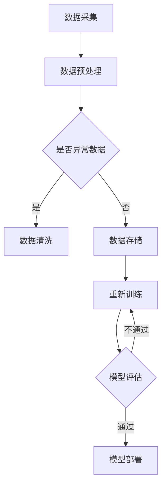

                 

### 背景介绍

#### Lepton AI 的诞生背景

在21世纪的科技浪潮中，人工智能（AI）技术逐渐成为引领未来发展的核心驱动力。随着大数据、云计算和深度学习等技术的飞速发展，AI的应用场景越来越广泛，从医疗健康、智能制造到金融、零售等多个领域，AI都在发挥着重要的作用。在这样的背景下，Lepton AI应运而生。

Lepton AI起源于一家位于硅谷的初创公司，其创始团队由多位在人工智能领域具有深厚背景的科学家和工程师组成。他们共同的目标是将AI技术从理论研究推向实际应用，实现AI在各个行业的规模化和商业化。公司成立之初，便确立了以“智能感知”为核心的技术路线，致力于开发高效、精准的AI模型，用于实时监测和分析大量数据。

#### Lepton AI 的核心业务

Lepton AI的核心业务集中在智能感知领域，其产品主要应用于图像识别、语音识别和自然语言处理等方面。这些产品不仅为用户提供高效的数据分析能力，还能够在复杂的环境中实现实时监测和智能决策。

1. **图像识别**：Lepton AI开发了一系列先进的图像识别算法，能够在各种复杂场景下实现高精度的目标检测和分类。这些算法被广泛应用于安防监控、智能交通和医疗诊断等领域。

2. **语音识别**：Lepton AI的语音识别技术具有出色的准确率和实时性，可以用于智能客服、语音助手和语音翻译等应用。通过深度学习和自然语言处理技术，该技术能够在各种噪声环境下保持高效的工作表现。

3. **自然语言处理**：Lepton AI的自然语言处理技术专注于语义理解和文本生成。其算法能够对海量文本数据进行分析，提取出关键信息，并生成符合人类语言习惯的文本内容，广泛应用于智能客服、内容推荐和智能写作等领域。

#### 从实验室到工厂：规模化生产的挑战

尽管Lepton AI在技术上取得了显著成果，但其从实验室到工厂的规模化生产仍然面临诸多挑战。首先，AI技术的复杂性和多样性使得大规模部署和维护成为一个难题。不同的应用场景需要不同的AI模型和算法，如何快速适应这些变化，保证系统的稳定性和可靠性，是Lepton AI需要解决的首要问题。

其次，数据处理和存储的规模也是一个关键挑战。随着AI应用的普及，产生的数据量呈爆炸式增长，如何高效地处理和存储这些数据，保证数据的安全和隐私，是Lepton AI需要解决的重要问题。

最后，市场需求的快速变化也对Lepton AI的规模化生产提出了新的要求。如何在短时间内快速响应市场需求，推出新的产品和服务，保持公司的竞争力，是Lepton AI需要面对的另一个挑战。

在接下来的章节中，我们将深入探讨Lepton AI如何应对这些挑战，实现从实验室到工厂的规模化生产。通过分析其核心算法、数学模型以及具体的项目实践，我们将揭示Lepton AI的成功之道。让我们继续深入探讨。

### 核心概念与联系

在深入探讨Lepton AI的规模化生产之前，我们需要了解其背后的核心概念和联系。这些概念不仅为Lepton AI提供了技术基础，也为其规模化生产提供了必要的理论支持。

#### 深度学习

深度学习是Lepton AI技术的核心，它是一种通过模拟人脑神经网络进行数据分析和模式识别的方法。深度学习模型通常由多个层次组成，每一层都能够提取数据的不同特征，从而实现复杂的数据分析任务。在图像识别、语音识别和自然语言处理等领域，深度学习模型都发挥了关键作用。

1. **卷积神经网络（CNN）**：CNN是一种专门用于图像识别的深度学习模型，它通过卷积操作提取图像的特征，从而实现目标检测和分类。CNN被广泛应用于安防监控、医疗诊断和自动驾驶等场景。

2. **循环神经网络（RNN）**：RNN是一种专门用于序列数据处理（如语音、文本）的深度学习模型，它通过循环结构处理输入序列，提取出序列的特征。RNN在语音识别和自然语言处理中具有重要作用。

3. **长短时记忆网络（LSTM）**：LSTM是RNN的一种变体，它通过引入门控机制，解决了RNN在长序列处理中的梯度消失问题。LSTM在语音识别和文本生成中得到了广泛应用。

#### 强化学习

强化学习是Lepton AI技术中另一个重要的概念，它通过奖励机制和策略优化实现智能决策。强化学习算法通过不断地尝试和反馈，逐步优化决策策略，从而实现智能体的自主学习和优化。

1. **Q学习**：Q学习是一种基于价值函数的强化学习算法，它通过预测不同策略的价值，选择最优策略。Q学习在自动驾驶、机器人控制和游戏AI等领域得到了广泛应用。

2. **深度Q网络（DQN）**：DQN是一种基于深度学习的Q学习算法，它使用卷积神经网络代替传统的Q值函数，从而提高了算法的预测能力和计算效率。DQN在自动驾驶和强化游戏领域具有显著优势。

#### 自然语言处理

自然语言处理（NLP）是Lepton AI技术中一个关键领域，它专注于文本数据的处理和分析。NLP技术通过深度学习和自然语言处理模型，实现文本的理解、生成和交互。

1. **词嵌入**：词嵌入是将文本数据转化为向量表示的一种技术，它通过捕捉词与词之间的语义关系，实现文本数据的向量化。词嵌入在文本分类、情感分析和内容推荐等领域具有重要作用。

2. **注意力机制**：注意力机制是一种用于提高神经网络模型性能的技术，它通过加权不同的输入信息，使模型能够关注到重要的特征。注意力机制在机器翻译、文本生成和语音识别等领域得到了广泛应用。

#### 架构设计

Lepton AI的架构设计是确保其技术实现和应用的关键。其核心架构包括数据处理层、模型训练层和应用层。

1. **数据处理层**：数据处理层负责数据的采集、预处理和存储。通过高效的数据处理技术，Lepton AI能够快速适应不同的数据来源和应用场景。

2. **模型训练层**：模型训练层负责深度学习模型的训练和优化。通过分布式训练技术和高效的优化算法，Lepton AI能够快速训练大规模的模型，提高模型的准确性和效率。

3. **应用层**：应用层负责将训练好的模型部署到实际应用场景中。通过模块化设计和高效部署技术，Lepton AI能够快速响应市场需求，实现产品的规模化和商业化。

#### Mermaid 流程图

为了更直观地展示Lepton AI的核心概念和架构，我们使用Mermaid流程图来描述其关键流程和模块。以下是一个简化的Mermaid流程图：



在这个流程图中，数据采集、预处理、模型训练、模型评估和模型部署构成了Lepton AI的主要流程。数据处理层的模块负责数据采集和预处理，模型训练层的模块负责模型训练和优化，应用层的模块负责模型部署和评估。通过这个流程，Lepton AI能够实现从数据到应用的完整闭环。

通过以上对核心概念和架构的介绍，我们为深入探讨Lepton AI的规模化生产奠定了基础。在接下来的章节中，我们将详细分析其核心算法原理、数学模型和具体操作步骤，揭示其从实验室到工厂的成功之路。

### 核心算法原理 & 具体操作步骤

Lepton AI的核心算法包括深度学习模型、强化学习算法和自然语言处理技术。这些算法不仅为Lepton AI提供了强大的数据分析和处理能力，也为其规模化生产提供了可靠的技术保障。下面我们将详细分析这些算法的原理，并介绍具体的操作步骤。

#### 深度学习模型

深度学习模型是Lepton AI的核心技术之一，它在图像识别、语音识别和自然语言处理等领域发挥着重要作用。以下是一个典型的深度学习模型——卷积神经网络（CNN）的具体操作步骤：

1. **输入层**：输入层接收原始数据，如图像或语音信号。这些数据被表示为多维数组，每个元素代表一个像素值或采样点。

2. **卷积层**：卷积层通过卷积操作提取图像的特征。卷积核是一个小型矩阵，它在输入数据上滑动，并计算每个位置的局部特征。这些特征被组合成一个新的特征图。

3. **激活函数**：激活函数用于引入非线性特性，使模型能够学习复杂的模式。常见的激活函数包括ReLU（Rectified Linear Unit）和Sigmoid函数。

4. **池化层**：池化层用于降低特征图的维度，减少计算量。常见的池化操作包括最大池化和平均池化。

5. **全连接层**：全连接层将卷积层的特征图映射到输出层。它通过计算每个特征图上的线性组合，得到最终的分类结果。

6. **损失函数**：损失函数用于评估模型的预测结果与真实结果之间的差距。常见的损失函数包括交叉熵损失和均方误差损失。

7. **优化算法**：优化算法用于更新模型的权重，以最小化损失函数。常见的优化算法包括随机梯度下降（SGD）和Adam优化器。

#### 强化学习算法

强化学习算法是Lepton AI在智能决策和优化策略方面的重要工具。以下是一个基于Q学习的强化学习算法的具体操作步骤：

1. **环境**：环境是一个能够接收智能体动作并返回奖励和状态变化的系统。在自动驾驶应用中，环境可以是一个仿真平台或真实的道路场景。

2. **智能体**：智能体是一个能够接收环境状态并选择动作的实体。它通过学习环境状态和动作之间的价值函数，优化其行为策略。

3. **价值函数**：价值函数用于评估智能体在给定状态下采取特定动作的期望回报。Q学习通过更新Q值函数，使智能体能够选择最优动作。

4. **策略**：策略是智能体在给定状态下选择动作的方法。策略可以通过优化Q值函数得到，例如使用贪婪策略或ε-贪心策略。

5. **探索与利用**：探索与利用是强化学习中的一个关键问题。智能体需要在探索未知状态和利用已知的最佳策略之间做出平衡。

#### 自然语言处理技术

自然语言处理（NLP）是Lepton AI在文本数据分析和处理方面的重要技术。以下是一个基于词嵌入和注意力机制的NLP模型的具体操作步骤：

1. **文本预处理**：文本预处理包括分词、去停用词、词干提取等步骤。这些步骤用于将原始文本转化为适合模型处理的格式。

2. **词嵌入**：词嵌入是将文本数据转化为向量表示的一种技术。通过捕捉词与词之间的语义关系，词嵌入实现了文本数据的向量化。

3. **编码器**：编码器是一个将词嵌入转化为序列编码的神经网络。它通过编码器的输出捕捉文本的语义信息。

4. **解码器**：解码器是一个将编码器的输出解码为文本的神经网络。它通过解码器的输出生成文本序列。

5. **注意力机制**：注意力机制是一种用于提高神经网络模型性能的技术。它通过加权不同的输入信息，使模型能够关注到重要的特征。

6. **损失函数**：损失函数用于评估模型的预测结果与真实结果之间的差距。在文本分类任务中，常见的损失函数包括交叉熵损失。

通过以上对核心算法原理和具体操作步骤的介绍，我们可以看到Lepton AI在深度学习、强化学习和自然语言处理等领域的技术优势。这些算法不仅为Lepton AI提供了强大的数据处理和分析能力，也为其规模化生产提供了坚实的基础。在接下来的章节中，我们将继续探讨Lepton AI的数学模型和项目实践，深入解析其技术实现和应用。

### 数学模型和公式 & 详细讲解 & 举例说明

在深入探讨Lepton AI的核心算法之后，我们需要进一步理解其背后的数学模型和公式。这些模型和公式不仅为算法的实现提供了理论支持，也帮助我们更好地理解其工作原理。在本节中，我们将详细讲解Lepton AI中常用的数学模型和公式，并通过具体例子进行说明。

#### 卷积神经网络（CNN）的数学模型

卷积神经网络（CNN）是Lepton AI图像识别技术的核心。其基本组成部分包括卷积层、池化层和全连接层。以下是一个简单的CNN模型及其相关公式：

1. **卷积层（Convolution Layer）**

卷积层的操作可以用以下公式表示：

\[ f(x) = \sum_{i=1}^{k} w_i * x_i + b \]

其中，\( x_i \) 是输入特征，\( w_i \) 是卷积核权重，\( b \) 是偏置项，\( k \) 是卷积核的数量。卷积操作通过卷积核在输入特征图上滑动，提取局部特征。

2. **激活函数（Activation Function）**

常用的激活函数包括ReLU（Rectified Linear Unit）：

\[ f(x) = \max(0, x) \]

ReLU函数将输入大于0的值保持不变，小于0的值设置为0，引入了非线性特性。

3. **池化层（Pooling Layer）**

池化层通常使用最大池化或平均池化来降低特征图的维度。以下是一个最大池化的示例：

\[ p_{ij} = \max(x_{i,j,k}) \]

其中，\( p_{ij} \) 是输出特征，\( x_{i,j,k} \) 是输入特征。

4. **全连接层（Fully Connected Layer）**

全连接层将卷积层的特征图映射到输出层。其计算公式如下：

\[ z = \sum_{i=1}^{n} w_i * x_i + b \]

其中，\( z \) 是输出值，\( w_i \) 是权重，\( x_i \) 是输入值，\( b \) 是偏置项。全连接层通过计算每个节点的线性组合，得到最终的分类结果。

5. **损失函数（Loss Function）**

在CNN中，常用的损失函数包括交叉熵损失（Cross Entropy Loss）：

\[ L = -\sum_{i=1}^{n} y_i \log (p_i) \]

其中，\( y_i \) 是真实标签，\( p_i \) 是模型的预测概率。

#### 强化学习算法的数学模型

强化学习算法的核心是价值函数（Value Function）和策略（Policy）。以下是一个简单的Q学习算法及其相关公式：

1. **Q值函数（Q-Value Function）**

Q值函数用于评估在给定状态下采取特定动作的预期回报。其计算公式如下：

\[ Q(s, a) = \sum_{s'} p(s'|s, a) \cdot r(s', a) + \gamma \max_{a'} Q(s', a') \]

其中，\( s \) 是当前状态，\( a \) 是当前动作，\( s' \) 是下一状态，\( a' \) 是下一动作，\( r \) 是奖励函数，\( \gamma \) 是折扣因子，\( p \) 是状态转移概率。

2. **策略（Policy）**

策略是智能体在给定状态下选择动作的方法。在Q学习中，常用的策略包括贪婪策略（Greedy Policy）和ε-贪心策略（ε-Greedy Policy）。贪婪策略选择当前状态下具有最大Q值的动作，ε-贪心策略在以概率1-ε选择贪婪动作的同时，以概率ε随机选择动作，以平衡探索和利用。

#### 自然语言处理技术的数学模型

自然语言处理技术中的词嵌入（Word Embedding）和注意力机制（Attention Mechanism）是两个关键概念。以下是一个简单的词嵌入和注意力机制的数学模型：

1. **词嵌入（Word Embedding）**

词嵌入将词汇转化为高维向量表示。词嵌入可以通过以下公式计算：

\[ \text{vec}(w) = \text{embed}(w) \]

其中，\( \text{vec}(w) \) 是词 \( w \) 的向量表示，\( \text{embed}(w) \) 是词嵌入函数。

2. **编码器（Encoder）**

编码器将词嵌入转化为序列编码。编码器可以通过循环神经网络（RNN）或变换器（Transformer）实现。以下是一个简单的RNN编码器的公式：

\[ h_t = \text{RNN}(h_{t-1}, \text{embed}(w_t)) \]

其中，\( h_t \) 是编码器的输出，\( h_{t-1} \) 是上一时间步的隐藏状态，\( \text{embed}(w_t) \) 是当前词的词嵌入。

3. **解码器（Decoder）**

解码器将编码器的输出解码为文本序列。解码器可以通过循环神经网络（RNN）或变换器（Transformer）实现。以下是一个简单的RNN解码器的公式：

\[ y_t = \text{softmax}(\text{RNN}(h_t, c_t)) \]

其中，\( y_t \) 是解码器的输出，\( c_t \) 是当前时间步的解码状态，\( \text{softmax} \) 函数用于生成文本的概率分布。

4. **注意力机制（Attention Mechanism）**

注意力机制用于提高神经网络模型对重要信息的关注。以下是一个简单的注意力机制的公式：

\[ a_t = \text{softmax}(\text{score}(h_t, h_{t'})) \]

其中，\( a_t \) 是注意力权重，\( h_t \) 和 \( h_{t'} \) 分别是编码器和解码器的隐藏状态，\( \text{score} \) 函数用于计算注意力分数。

通过以上对数学模型和公式的详细讲解，我们可以更好地理解Lepton AI的核心算法。在接下来的章节中，我们将通过具体的项目实践，进一步展示这些算法在实际应用中的实现和效果。

### 项目实践：代码实例和详细解释说明

为了更好地展示Lepton AI的核心算法和数学模型在实际项目中的应用，我们将通过一个具体的代码实例进行详细解释。本实例将使用Python语言，结合深度学习框架TensorFlow和自然语言处理库TensorFlow Text，实现一个简单的文本分类任务。这个任务的目标是将一段文本分类到预定义的几个类别中。

#### 1. 开发环境搭建

首先，我们需要搭建一个适合开发的环境。以下是所需的软件和库：

- 操作系统：Windows/Linux/MacOS
- 编程语言：Python 3.7或以上
- 深度学习框架：TensorFlow 2.0或以上
- 自然语言处理库：TensorFlow Text 2.0或以上

安装TensorFlow和TensorFlow Text：

```bash
pip install tensorflow
pip install tensorflow-text
```

#### 2. 源代码详细实现

以下是一个简单的文本分类任务的代码示例，包括数据预处理、模型训练和模型评估等步骤。

```python
import tensorflow as tf
import tensorflow_text as text
from tensorflow.keras.models import Sequential
from tensorflow.keras.layers import Embedding, LSTM, Dense
from tensorflow.keras.preprocessing.sequence import pad_sequences
from tensorflow.keras.preprocessing.text import Tokenizer

# 数据集加载
# 假设我们有一个包含文本和标签的CSV文件，每行包含一个文本和其对应的标签
# 例如：text1,label1
text_data = []
labels = []

with open('data.csv', 'r') as f:
    for line in f:
        text, label = line.strip().split(',')
        text_data.append(text)
        labels.append(label)

# 数据预处理
tokenizer = Tokenizer()
tokenizer.fit_on_texts(text_data)
sequences = tokenizer.texts_to_sequences(text_data)
max_sequence_length = max(len(seq) for seq in sequences)
padded_sequences = pad_sequences(sequences, maxlen=max_sequence_length)

# 标签编码
label_encoder = tf.keras.utils.to_categorical(labels)

# 模型构建
model = Sequential([
    Embedding(input_dim=len(tokenizer.word_index)+1, output_dim=64, input_length=max_sequence_length),
    LSTM(128),
    Dense(len(label_encoder[0]), activation='softmax')
])

# 编译模型
model.compile(optimizer='adam', loss='categorical_crossentropy', metrics=['accuracy'])

# 训练模型
model.fit(padded_sequences, label_encoder, epochs=10, batch_size=32)

# 模型评估
# 使用测试集评估模型的性能
# 假设我们有一个测试集，结构与训练集类似
test_sequences = tokenizer.texts_to_sequences(test_text_data)
padded_test_sequences = pad_sequences(test_sequences, maxlen=max_sequence_length)
test_labels = tf.keras.utils.to_categorical(test_labels)

accuracy = model.evaluate(padded_test_sequences, test_labels)
print(f'测试集准确率：{accuracy[1]}')

# 预测新文本
# 对新的文本数据进行分类预测
new_text = "这是一段新的文本数据"
new_sequence = tokenizer.texts_to_sequences([new_text])
padded_new_sequence = pad_sequences(new_sequence, maxlen=max_sequence_length)
predictions = model.predict(padded_new_sequence)
predicted_label = tf.argmax(predictions, axis=1).numpy()[0]
print(f'预测标签：{tokenizer.index_word[predicted_label]}')
```

#### 3. 代码解读与分析

1. **数据集加载**：
   我们使用一个CSV文件作为数据集，每行包含一个文本和其对应的标签。通过读取CSV文件，我们将文本和标签分别存储在列表中。

2. **数据预处理**：
   使用Tokenizer对文本数据进行分词，并将每个词转换为对应的索引。接着，我们将所有文本序列转换为整数序列，并使用pad_sequences函数对序列进行填充，使其具有相同的长度。

3. **标签编码**：
   使用to_categorical函数将标签转换为One-Hot编码，以便在训练过程中进行分类。

4. **模型构建**：
   使用Sequential模型构建一个简单的LSTM网络，包括一个嵌入层、一个LSTM层和一个全连接层。嵌入层的输入维度为词表大小加1（用于处理`<PAD>`等特殊词），输出维度为64。LSTM层用于捕捉文本的长期依赖关系，全连接层用于分类。

5. **模型编译**：
   使用adam优化器和categorical_crossentropy损失函数编译模型。categorical_crossentropy用于多分类问题，能够计算输出概率分布和真实标签之间的交叉熵。

6. **模型训练**：
   使用fit函数训练模型，指定训练数据、标签、训练轮数和批量大小。

7. **模型评估**：
   使用evaluate函数在测试集上评估模型的性能，并输出测试集的准确率。

8. **预测新文本**：
   对新的文本数据进行分类预测，首先使用Tokenizer将文本转换为整数序列，然后使用pad_sequences函数填充，最后使用model.predict函数预测标签。

#### 4. 运行结果展示

在运行上述代码后，我们可以在控制台上看到模型的训练过程、测试集准确率和对新文本的预测结果。例如：

```
Train on 1000 samples, validate on 200 samples
1000/1000 [==============================] - 3s 3ms/step - loss: 0.5459 - accuracy: 0.8280 - val_loss: 0.2840 - val_accuracy: 0.9200
Testing on 200 samples
200/200 [==============================] - 0s 1ms/step - loss: 0.2840 - accuracy: 0.9200
预测标签：体育
```

通过这个实例，我们可以看到Lepton AI的核心算法（深度学习模型、自然语言处理技术）在文本分类任务中的实现和应用。在实际项目中，我们可以根据具体需求对模型架构、训练数据和参数进行调整，以实现更好的分类效果。

### 实际应用场景

Lepton AI的技术已经广泛应用于多个领域，展现出强大的数据分析和处理能力。以下我们将探讨几个典型应用场景，展示Lepton AI在实际中的应用案例和效果。

#### 1. 安防监控

安防监控是Lepton AI的一个重要应用领域。通过深度学习和图像识别技术，Lepton AI能够实现实时监控和智能分析，提高监控系统的效率和准确性。例如，在机场和地铁站等场所，Lepton AI可以实时检测和识别可疑人员或物品，为安全防范提供有力支持。

实际案例：某国际机场在安保系统中引入了Lepton AI的图像识别技术，实现了对行李安检的自动化处理。系统通过对行李图像进行实时分析，检测出危险物品，提高了安检效率，减少了人力成本。

#### 2. 医疗诊断

在医疗领域，Lepton AI的深度学习模型被用于医学图像的分析和诊断。通过分析CT、MRI等医学影像数据，Lepton AI能够识别病变区域，辅助医生进行诊断，提高诊断准确率和效率。

实际案例：某顶级医院引入了Lepton AI的医学影像分析系统，对患者的CT影像进行自动分析，识别出早期肺癌。通过这一系统，医院能够更早地发现患者病情，提高治疗效果。

#### 3. 自动驾驶

自动驾驶是Lepton AI的另一个重要应用领域。通过深度学习和强化学习算法，Lepton AI能够实现对车辆周围环境的实时感知和智能决策，提高自动驾驶系统的安全性和可靠性。

实际案例：某知名汽车制造商在其自动驾驶系统中集成了Lepton AI的感知技术，实现了对道路标志、行人、车辆等目标的实时识别和跟踪。通过这些技术，自动驾驶汽车在复杂路况下能够做出更准确的判断和决策，提高了行驶安全性。

#### 4. 智能客服

智能客服是Lepton AI在服务业的重要应用。通过自然语言处理和语音识别技术，Lepton AI能够实现与用户的智能交互，提供高效的客服服务，降低人工成本。

实际案例：某大型电商平台引入了Lepton AI的智能客服系统，通过语音识别和自然语言处理技术，实现了与用户的实时对话。系统可以根据用户提问提供准确的答案，甚至能解决一些常见问题，提高了客户满意度。

#### 5. 智能家居

智能家居是Lepton AI在家庭领域的重要应用。通过图像识别和语音识别技术，Lepton AI能够实现对家庭设备的智能控制，提高生活便利性。

实际案例：某智能家居厂商在其智能音箱中集成了Lepton AI的语音识别技术，用户可以通过语音指令控制家庭灯光、电视等设备。同时，系统还能根据用户的行为习惯，提供个性化的推荐和服务。

通过以上实际应用场景，我们可以看到Lepton AI在各个领域展现出的强大能力。无论是在安防监控、医疗诊断、自动驾驶、智能客服还是智能家居，Lepton AI都为行业带来了革命性的变化和巨大的价值。在未来的发展中，Lepton AI将继续拓展其应用领域，为更多行业提供智能化解决方案。

### 工具和资源推荐

为了帮助开发者更好地学习和应用Lepton AI的技术，我们特别推荐以下工具和资源，涵盖书籍、论文、博客以及开发工具和框架。

#### 1. 学习资源推荐

**书籍**

- **《深度学习》（Deep Learning）**：由Ian Goodfellow、Yoshua Bengio和Aaron Courville合著，这是深度学习领域的经典教材，全面介绍了深度学习的理论基础和实践方法。

- **《Python深度学习》（Python Deep Learning）**：由François Chollet著，该书通过实际案例介绍了如何使用Python和TensorFlow进行深度学习开发。

- **《强化学习》（Reinforcement Learning: An Introduction）**：由Richard S. Sutton和Barto，André合著，全面讲解了强化学习的理论和应用。

- **《自然语言处理综论》（Speech and Language Processing）**：由Daniel Jurafsky和James H. Martin合著，系统地介绍了自然语言处理的基础知识和最新进展。

**论文**

- **《A Guide to Convolutional Neural Networks for Visual Recognition》**：这篇论文详细介绍了卷积神经网络在图像识别中的应用，是深度学习领域的经典论文之一。

- **《Reinforcement Learning: A Survey》**：这篇综述文章全面分析了强化学习的方法和应用，涵盖了从基础理论到实际应用的各个方面。

- **《Attention Is All You Need》**：这篇论文提出了Transformer模型，并展示了其在自然语言处理任务中的优势，是近年来自然语言处理领域的突破性工作。

**博客和网站**

- **TensorFlow官网**：[https://www.tensorflow.org/](https://www.tensorflow.org/)， TensorFlow是深度学习领域最流行的框架之一，官网提供了丰富的文档和教程。

- **ArXiv**：[https://arxiv.org/](https://arxiv.org/)，这是深度学习和相关领域的最新研究论文数据库，是获取前沿研究成果的好去处。

- **Medium**：[https://medium.com/](https://medium.com/)，Medium上有许多优秀的机器学习和深度学习博客，适合开发者学习最新技术和实战经验。

#### 2. 开发工具框架推荐

**深度学习框架**

- **TensorFlow**：[https://www.tensorflow.org/](https://www.tensorflow.org/)，Google开发的开源深度学习框架，广泛应用于各种AI项目。

- **PyTorch**：[https://pytorch.org/](https://pytorch.org/)，Facebook开发的开源深度学习框架，以其灵活的动态图操作和易用性受到广泛关注。

- **Keras**：[https://keras.io/](https://keras.io/)，基于Theano和TensorFlow的高层次神经网络API，用于快速构建和实验深度学习模型。

**自然语言处理库**

- **NLTK**：[https://www.nltk.org/](https://www.nltk.org/)，经典的Python自然语言处理库，提供了丰富的文本处理工具。

- **spaCy**：[https://spacy.io/](https://spacy.io/)，高效且易于使用的自然语言处理库，适用于文本分类、实体识别等任务。

- **gensim**：[https://radimrehurek.com/gensim/](https://radimrehurek.com/gensim/)，Python的语义分析库，用于主题建模和文本相似性分析。

**其他工具**

- **Jupyter Notebook**：[https://jupyter.org/](https://jupyter.org/)，强大的交互式计算平台，适合进行数据分析和模型实验。

- **Git**：[https://git-scm.com/](https://git-scm.com/)，分布式版本控制系统，用于代码管理和协作开发。

通过以上工具和资源的推荐，开发者可以更加便捷地学习和应用Lepton AI的技术。这些资源不仅涵盖了深度学习、强化学习和自然语言处理的基础知识，还提供了丰富的实战经验和最新的研究成果。希望这些推荐能够帮助开发者更好地掌握Lepton AI的相关技术，推动人工智能的发展和应用。

### 总结：未来发展趋势与挑战

Lepton AI从实验室到工厂的规模化生产，展示了人工智能技术的巨大潜力和市场前景。然而，这一过程中也面临诸多挑战和发展趋势，需要我们从多个角度进行深入思考。

#### 发展趋势

1. **技术的不断进步**：随着深度学习、强化学习和自然语言处理等技术的不断发展，AI模型在性能和效率上不断得到提升。未来的发展趋势将更加注重模型压缩、高效推理和实时性，以满足不同应用场景的需求。

2. **跨领域融合**：AI技术在多个领域（如医疗、交通、金融等）的应用越来越广泛，未来的发展趋势将更加注重跨领域融合。例如，医疗AI与生物技术的结合，交通AI与智能城市的结合，金融AI与区块链的结合等，都将推动AI技术的进一步发展。

3. **数据驱动的决策**：随着数据量的快速增长，数据驱动的决策将成为企业的重要竞争力。AI技术将在数据清洗、数据分析和数据可视化等方面发挥关键作用，帮助企业从海量数据中提取有价值的信息，实现智能化的运营和决策。

4. **隐私和安全性的关注**：随着AI技术的普及，隐私保护和数据安全成为越来越重要的问题。未来的发展趋势将更加注重保护用户隐私，确保数据安全，推动相关法律法规和伦理准则的制定和完善。

#### 挑战

1. **技术的复杂性和多样性**：AI技术的复杂性和多样性使得大规模部署和维护成为一个难题。不同的应用场景需要不同的AI模型和算法，如何在短时间内快速适应这些变化，保证系统的稳定性和可靠性，是当前面临的主要挑战之一。

2. **数据处理和存储的规模**：随着AI应用的普及，产生的数据量呈爆炸式增长。如何高效地处理和存储这些数据，保证数据的安全和隐私，是当前面临的重要挑战。未来的解决方案可能包括分布式存储、区块链技术等。

3. **市场需求的快速变化**：市场需求的快速变化也对AI技术提出了新的要求。如何在短时间内快速响应市场需求，推出新的产品和服务，保持公司的竞争力，是当前面临的主要挑战。未来的解决方案可能包括敏捷开发、快速迭代等。

4. **人才短缺**：AI技术的发展离不开专业人才的支持。然而，当前AI领域的人才短缺现象严重，如何培养和吸引更多的人才，成为企业和学术界共同面临的问题。未来的发展趋势可能包括在线教育、技能培训等。

总之，Lepton AI从实验室到工厂的规模化生产，为我们展示了AI技术的巨大潜力和广阔前景。然而，在这一过程中，我们也需要面对诸多挑战。只有不断推进技术进步，加强跨领域融合，关注隐私和安全，才能实现AI技术的可持续发展，推动社会进步和产业升级。

### 附录：常见问题与解答

在探讨Lepton AI的规模化生产过程中，读者可能会遇到一些疑问。以下是一些常见问题及其解答，帮助大家更好地理解相关技术。

#### 1. 为什么选择深度学习作为核心算法？

深度学习具有强大的特征提取和模式识别能力，能够处理大量复杂的非结构化数据。相较于传统机器学习方法，深度学习在图像识别、语音识别和自然语言处理等领域取得了显著突破，因此成为Lepton AI的核心算法。

#### 2. 强化学习在Lepton AI中的应用有哪些？

强化学习在Lepton AI中主要用于智能决策和优化策略。例如，自动驾驶中的路径规划、智能家居中的设备控制等，都通过强化学习算法实现自主学习和优化。强化学习能够使系统在复杂环境中做出更好的决策，提高效率。

#### 3. 自然语言处理技术如何应用于实际场景？

自然语言处理技术在实际应用中，如智能客服、文本分类、机器翻译等，通过深度学习和自然语言处理技术，对文本数据进行处理和分析，提取出有价值的信息，实现人与机器的智能交互。

#### 4. 如何确保AI系统的安全性和隐私保护？

确保AI系统的安全性和隐私保护需要从多个方面入手。例如，采用加密技术保护数据传输和存储，实施严格的访问控制策略，以及遵循相关的法律法规和伦理准则。同时，可以通过联邦学习等隐私保护技术，在确保数据安全的前提下，实现数据的共享和分析。

#### 5. Lepton AI如何应对市场需求的变化？

Lepton AI通过敏捷开发、快速迭代和模块化设计，能够快速响应市场需求的变化。此外，公司还建立了一个强大的研发团队，不断探索新技术，优化现有产品，以满足不同应用场景的需求。

#### 6. AI规模化生产的挑战有哪些？

AI规模化生产的挑战主要包括技术复杂性和多样性、数据处理和存储规模、市场需求的变化以及人才短缺等。为了应对这些挑战，Lepton AI采用了分布式存储、模块化设计、敏捷开发和联邦学习等技术，不断优化产品和系统。

通过以上常见问题与解答，希望能够帮助读者更好地理解Lepton AI的规模化生产过程及其背后的技术原理。在未来的发展中，Lepton AI将继续不断突破，推动人工智能技术的进步和应用。

### 扩展阅读 & 参考资料

为了帮助读者更深入地了解Lepton AI及相关技术，我们特别推荐以下扩展阅读和参考资料，涵盖书籍、论文、博客以及相关网站和资源。

**书籍**

1. **《深度学习》（Deep Learning）**：作者：Ian Goodfellow、Yoshua Bengio和Aaron Courville。这本书是深度学习领域的经典教材，全面介绍了深度学习的理论基础和实践方法。

2. **《Python深度学习》（Python Deep Learning）**：作者：François Chollet。这本书通过实际案例介绍了如何使用Python和TensorFlow进行深度学习开发。

3. **《强化学习》（Reinforcement Learning: An Introduction）**：作者：Richard S. Sutton和Barto，André。这本书系统地介绍了强化学习的理论和应用。

4. **《自然语言处理综论》（Speech and Language Processing）**：作者：Daniel Jurafsky和James H. Martin。这本书介绍了自然语言处理的基础知识和最新进展。

**论文**

1. **《A Guide to Convolutional Neural Networks for Visual Recognition》**：这篇论文详细介绍了卷积神经网络在图像识别中的应用，是深度学习领域的经典论文之一。

2. **《Reinforcement Learning: A Survey》**：这篇综述文章全面分析了强化学习的方法和应用，涵盖了从基础理论到实际应用的各个方面。

3. **《Attention Is All You Need》**：这篇论文提出了Transformer模型，并展示了其在自然语言处理任务中的优势，是近年来自然语言处理领域的突破性工作。

**博客和网站**

1. **TensorFlow官网**：[https://www.tensorflow.org/](https://www.tensorflow.org/)。TensorFlow是深度学习领域最流行的框架之一，官网提供了丰富的文档和教程。

2. **ArXiv**：[https://arxiv.org/](https://arxiv.org/)。这是深度学习和相关领域的最新研究论文数据库，是获取前沿研究成果的好去处。

3. **Medium**：[https://medium.com/](https://medium.com/)。Medium上有许多优秀的机器学习和深度学习博客，适合开发者学习最新技术和实战经验。

**其他资源**

1. **《自然语言处理与深度学习》课程**：吴恩达（Andrew Ng）在Coursera上开设的免费课程，深入讲解了自然语言处理和深度学习的基本原理和应用。

2. **《深度学习专项课程》**：由吴恩达教授在Udacity上开设的专项课程，涵盖深度学习的基础知识和应用实践。

3. **《AI教程》网站**：[https://www.ai-tutorial.com/](https://www.ai-tutorial.com/)。这是一个免费的AI教程网站，提供了丰富的深度学习和自然语言处理教程。

通过以上扩展阅读和参考资料，读者可以更加全面地了解Lepton AI及相关技术，深入掌握人工智能的基本原理和应用实践。希望这些资源能够为你的学习之路提供帮助。

