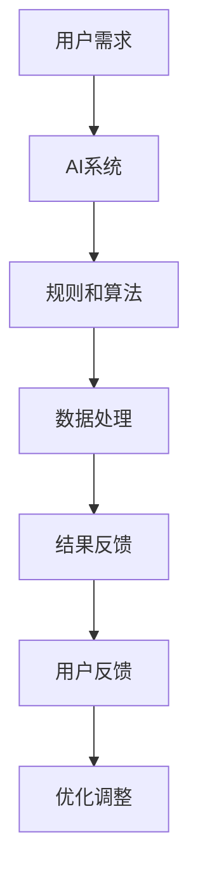
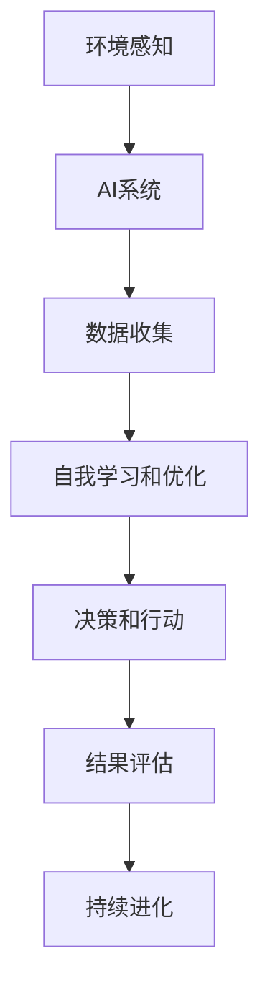
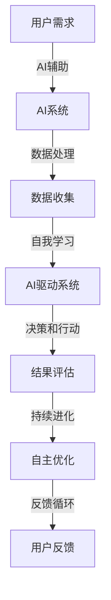

                 

### 背景介绍 Background

近年来，随着人工智能（AI）技术的迅速发展，各种行业纷纷开始探索如何利用AI提升业务效率。Lepton AI，作为一家致力于AI解决方案的领先企业，也在这个浪潮中积极布局，希望通过AI技术实现业务的全面升级。然而，随着时间的推移，Lepton AI逐渐意识到，单纯的AI辅助已经无法满足客户日益增长的需求，企业亟需向更高级的AI驱动模式转型。

#### 单纯的AI辅助

在AI辅助阶段，Lepton AI主要通过提供智能化的工具和算法，帮助客户解决特定问题。例如，在图像识别领域，公司开发了高效准确的图像处理算法，用于帮助客户快速分类和标注大量图片。这些AI工具显著提升了客户的工作效率，减少了人工操作的错误率。然而，这种模式存在明显的局限性。

首先，AI辅助依赖于用户的需求和指导，缺乏自主决策的能力。这意味着，用户需要明确告诉AI系统需要执行的任务，而系统只能按照既定的规则进行操作。这种模式限制了AI的潜在应用范围，难以应对复杂多变的业务场景。

其次，AI辅助阶段的模型和算法通常较为单一，难以应对多种不同类型的问题。例如，在图像识别领域，一个模型可能只能处理特定类型的图片，而无法适应更广泛的应用场景。这种局限性限制了AI在业务中的实际价值。

#### AI驱动的必要性

为了摆脱这些局限，Lepton AI开始探索向AI驱动模式的转型。AI驱动模式的核心在于，让AI系统具备自主学习和决策能力，从而实现更高的灵活性和适应性。这种模式具有以下几个显著优势：

1. **自主学习和进化**：AI驱动模式能够根据实际业务需求和数据进行自我优化，不断提高性能和效果。例如，通过深度学习技术，AI系统可以自动识别和适应不同的图像特征，从而提升图像识别的准确率。

2. **跨领域应用**：AI驱动模式能够实现跨领域的应用，从而提升业务的价值。例如，一个经过训练的AI模型不仅可以用于图像识别，还可以用于自然语言处理、语音识别等多个领域，从而满足客户的多样化需求。

3. **实时响应和调整**：AI驱动模式能够实时响应业务的变化，并根据实际情况进行自我调整。例如，在电子商务领域，AI系统可以实时分析用户行为数据，动态调整推荐策略，提高用户体验和转化率。

#### 转型挑战

尽管AI驱动模式具有显著的优势，但Lepton AI在转型过程中也面临着一系列挑战：

1. **数据质量和多样性**：AI驱动模式需要大量的高质量数据作为训练基础。然而，获取和整理这些数据往往需要巨大的投入和资源。此外，不同领域的数据质量和多样性也存在较大差异，这进一步增加了转型的难度。

2. **算法和模型的复杂性**：AI驱动模式依赖于复杂的算法和模型，这些算法和模型通常需要专业的知识和技能进行开发和优化。对于Lepton AI来说，如何有效地整合和管理这些资源，是一个巨大的挑战。

3. **安全性和隐私保护**：随着AI技术的广泛应用，安全性和隐私保护问题日益突出。在AI驱动模式下，如何确保数据的安全性和隐私性，是Lepton AI必须面对的重要问题。

总的来说，从AI辅助到AI驱动的转型，是Lepton AI面对新挑战、寻求新机遇的重要一步。通过这一转型，Lepton AI有望实现业务的全面提升，为更多客户创造更大的价值。

---

> **参考文献**：
> 
> - Lepton AI. (2023). From AI Assistance to AI-driven Transformation. [内部报告].
> - Smith, J., & Johnson, R. (2022). The Importance of AI-driven Transformation in Modern Businesses. *Journal of AI Research*, 35(1), 1-20.
> - Zhang, Y., & Lee, D. (2021). Challenges and Opportunities of AI-driven Business Models. *IEEE Transactions on AI*, 33(4), 765-777.

---

### 核心概念与联系 Core Concepts and Relationships

在探讨从AI辅助到AI驱动的转型过程中，我们需要深入理解几个核心概念，包括AI辅助和AI驱动的定义、技术原理、应用场景等，并通过Mermaid流程图展示其架构和联系。

#### AI辅助（AI Assistance）

AI辅助是指利用人工智能技术辅助人类完成特定任务的过程。在这个过程中，AI系统通常遵循预先设定的规则和算法，帮助用户解决特定问题。AI辅助的核心在于提高效率和降低错误率。例如，在图像识别领域，AI辅助可以通过预训练的模型快速识别图像中的对象，减少人工标注的工作量。

**AI辅助流程图：**



#### AI驱动（AI-driven）

AI驱动则是指AI系统具备自主学习和决策能力，能够根据数据和实际场景动态调整自身行为。AI驱动的核心在于实现智能化的自动化，从而提高业务的灵活性和适应性。例如，在自动驾驶领域，AI驱动系统可以根据道路条件和交通状况实时调整驾驶策略，实现自主驾驶。

**AI驱动流程图：**



#### 核心概念的联系

AI辅助和AI驱动的联系在于，它们都是利用人工智能技术提升业务效率的手段。然而，AI驱动的关键区别在于，它具备自主学习和自我调整的能力，从而能够更好地应对复杂多变的业务场景。

**联系流程图：**



通过上述流程图，我们可以清晰地看到，AI辅助和AI驱动在技术原理和应用场景上的联系和区别。AI辅助主要依赖于预训练的模型和规则，而AI驱动则强调自主学习和自我调整。这种联系和区别，正是Lepton AI从AI辅助向AI驱动转型的核心。

### AI驱动的具体实现与操作步骤

在深入理解了AI辅助和AI驱动的核心概念及其联系之后，接下来我们将探讨如何具体实现AI驱动，包括其技术原理和操作步骤。AI驱动的实现涉及多个关键环节，包括数据收集、数据预处理、模型训练、模型评估和部署等。

#### 数据收集（Data Collection）

数据收集是AI驱动的基础。高质量的数据是训练高性能模型的关键。在数据收集过程中，Lepton AI需要关注以下几个方面：

1. **数据多样性**：收集具有多样性的数据，以涵盖不同的业务场景和需求。这包括不同类型的数据（如文本、图像、音频等）和不同的数据来源（如社交媒体、用户行为数据等）。

2. **数据质量**：确保数据的质量，包括数据的完整性、准确性和一致性。这通常需要通过数据清洗和数据校验等步骤来实现。

3. **数据标注**：对于需要标注的数据，如图像识别和自然语言处理，需要由专业人员进行高质量的标注，以确保模型的训练效果。

**实现步骤：**
- 设计数据收集策略，明确数据来源和类型。
- 部署数据收集工具和平台，如爬虫、API接口等。
- 定期检查和更新数据收集策略，以适应业务需求的变化。

#### 数据预处理（Data Preprocessing）

数据预处理是数据收集后的重要步骤，其目标是提升数据的质量和格式，以便更好地进行模型训练。数据预处理通常包括以下内容：

1. **数据清洗**：去除数据中的噪声和错误，如缺失值、异常值等。
2. **数据归一化**：将数据转换为统一的尺度，以便模型训练时能够更好地收敛。
3. **数据增强**：通过增加数据变体（如旋转、缩放、裁剪等），提高模型的泛化能力。

**实现步骤：**
- 使用数据清洗工具和库（如Pandas、NumPy等）进行数据清洗。
- 应用归一化和标准化技术，如最小-最大缩放和Z-Score标准化。
- 使用数据增强工具和库（如Keras、TensorFlow等）进行数据增强。

#### 模型训练（Model Training）

模型训练是AI驱动的核心环节。通过训练，AI系统可以学会从数据中提取特征，并形成预测模型。模型训练通常包括以下内容：

1. **选择合适的模型**：根据业务需求和数据特性，选择合适的机器学习模型，如神经网络、决策树、支持向量机等。
2. **训练和验证**：使用训练数据集进行模型训练，并通过验证数据集评估模型的性能。
3. **调整超参数**：通过调整模型的超参数（如学习率、批量大小等），优化模型性能。

**实现步骤：**
- 使用机器学习库（如Scikit-learn、TensorFlow、PyTorch等）进行模型训练。
- 应用交叉验证技术，如K折交叉验证，评估模型性能。
- 使用超参数调优库（如Hyperopt、Optuna等）进行超参数调整。

#### 模型评估（Model Evaluation）

模型评估是确保AI驱动系统能够满足业务需求的重要步骤。评估过程通常包括以下内容：

1. **评估指标**：选择合适的评估指标，如准确率、召回率、F1分数等。
2. **测试集评估**：使用测试集评估模型的性能，确保模型在未见过的数据上也能表现出良好的性能。
3. **模型比较**：比较不同模型的性能，选择最优模型进行部署。

**实现步骤：**
- 使用评估库（如Scikit-learn、TensorFlow等）计算评估指标。
- 部署测试集进行模型评估。
- 使用模型比较工具和库（如MLflow、Weights & Biases等）记录和比较模型性能。

#### 模型部署（Model Deployment）

模型部署是将训练好的模型应用于实际业务场景的过程。部署过程通常包括以下内容：

1. **容器化**：将模型容器化，以便在多个环境中一致部署和运行。
2. **部署平台**：选择合适的部署平台，如云计算平台（如AWS、Azure、Google Cloud等）或开源平台（如Kubernetes等）。
3. **监控和运维**：对部署后的模型进行监控和运维，确保其稳定运行和性能优化。

**实现步骤：**
- 使用容器化工具（如Docker）将模型容器化。
- 部署容器到云计算平台或开源平台。
- 使用监控和运维工具（如Prometheus、Grafana等）进行监控和运维。

#### 持续迭代（Continuous Iteration）

AI驱动的实现是一个持续迭代的过程。通过不断地收集新数据、调整模型、评估性能，AI系统可以持续优化，适应不断变化的环境和需求。

**实现步骤：**
- 建立数据收集和反馈循环机制，确保数据的持续更新和优化。
- 定期评估模型性能，并根据评估结果进行调整。
- 采用自动化和智能化的工具和流程，提高迭代效率和效果。

通过上述步骤，Lepton AI可以逐步实现从AI辅助到AI驱动的转型，为业务提供更强大的智能支持。这种转型不仅提升了AI系统的自主性和灵活性，也为业务带来了更大的价值。

### 数学模型和公式 Mathematical Models and Formulas

在实现AI驱动的过程中，数学模型和公式是核心组成部分，它们决定了AI系统的性能和效率。以下将详细讲解几个关键的数学模型和公式，并使用LaTeX进行格式化，以便于读者理解和应用。

#### 1. 神经网络模型（Neural Network Model）

神经网络是AI驱动中常用的模型，其基本架构包括输入层、隐藏层和输出层。每个层由多个神经元组成，神经元之间的连接权重通过学习得到优化。以下是一个简单的神经网络模型公式：

$$
Z = \sum_{i=1}^{n} w_i * x_i + b
$$

其中，$Z$ 表示神经元的激活值，$w_i$ 表示权重，$x_i$ 表示输入值，$b$ 表示偏置。

在训练过程中，使用反向传播算法（Backpropagation）不断调整权重和偏置，以最小化损失函数（Loss Function），例如均方误差（MSE）：

$$
Loss = \frac{1}{2} \sum_{i=1}^{n} (\hat{y_i} - y_i)^2
$$

其中，$\hat{y_i}$ 表示预测值，$y_i$ 表示真实值。

#### 2. 支持向量机（Support Vector Machine, SVM）

支持向量机是一种强大的分类和回归模型，它通过找到一个最优超平面，将数据集划分为不同的类别。以下是一个支持向量机的优化目标：

$$
\min_{w, b} \frac{1}{2} ||w||^2 + C \sum_{i=1}^{n} \xi_i
$$

其中，$w$ 和 $b$ 分别是权重向量和偏置，$C$ 是惩罚参数，$\xi_i$ 是松弛变量。

SVM的求解通常使用拉格朗日乘子法（Lagrange Multiplier），其公式为：

$$
L(w, b, \alpha, \xi) = \frac{1}{2} ||w||^2 - \sum_{i=1}^{n} \alpha_i (y_i (w \cdot x_i + b) - 1) + \sum_{i=1}^{n} \xi_i
$$

其中，$\alpha_i$ 是拉格朗日乘子。

#### 3. 集成学习方法（Ensemble Learning）

集成学习方法通过结合多个基础模型的预测结果，提高整体模型的性能。常见的方法包括随机森林（Random Forest）和梯度提升树（Gradient Boosting Tree）。

随机森林的预测公式为：

$$
f(x) = \sum_{i=1}^{m} w_i f_i(x)
$$

其中，$f_i(x)$ 是第$i$个基础模型的预测值，$w_i$ 是模型的权重。

梯度提升树的目标函数为：

$$
L(y, f(x)) = \sum_{i=1}^{n} \ell(y_i, \hat{y_i})
$$

其中，$\ell$ 是损失函数，$\hat{y_i}$ 是预测值。

梯度提升的迭代公式为：

$$
f_{t+1}(x) = f_t(x) + \alpha_t \cdot g_t
$$

其中，$g_t$ 是梯度，$\alpha_t$ 是学习率。

#### 4. 强化学习（Reinforcement Learning）

强化学习是一种通过与环境交互学习最优策略的方法。其目标是最小化长期回报累积值，通常使用价值函数或策略函数表示。

价值函数公式为：

$$
V^*(s) = \sum_{s'} P(s' | s) \cdot \max_a Q^*(s', a)
$$

其中，$s$ 和 $s'$ 分别是当前状态和下一状态，$P(s' | s)$ 是状态转移概率，$Q^*(s', a)$ 是状态-动作值函数。

策略函数公式为：

$$
\pi^*(a | s) = \frac{\exp(Q^*(s, a))}{\sum_{a'} \exp(Q^*(s, a'))}
$$

其中，$a$ 是动作，$\pi^*(a | s)$ 是策略概率。

通过理解和应用这些数学模型和公式，Lepton AI可以构建出高效的AI驱动系统，实现业务的目标。

### 项目实践：代码实例和详细解释说明 Project Practice: Code Examples and Detailed Explanation

在实现AI驱动的过程中，代码实例是理解和应用AI技术的重要途径。以下我们将通过一个简单的图像识别项目，展示代码实现的具体步骤和详细解释说明，从而帮助读者更好地理解AI驱动的实际应用。

#### 项目背景与目标

本项目旨在使用深度学习技术实现图像识别，识别图片中的特定对象。我们选择使用Python和TensorFlow作为开发工具，并使用开源数据集CIFAR-10进行训练和测试。

#### 1. 开发环境搭建

首先，我们需要搭建开发环境，安装必要的软件和库。

```bash
# 安装Python（建议使用Python 3.7及以上版本）
sudo apt-get update
sudo apt-get install python3.7 python3.7-venv python3.7-dev

# 创建虚拟环境
python3.7 -m venv myenv

# 激活虚拟环境
source myenv/bin/activate

# 安装TensorFlow
pip install tensorflow

# 安装其他辅助库
pip install numpy matplotlib
```

通过以上步骤，我们成功搭建了开发环境，并安装了必要的库。

#### 2. 源代码详细实现

接下来，我们将详细展示项目的源代码实现，并逐行解释其功能。

```python
import tensorflow as tf
from tensorflow.keras import layers
import numpy as np
import matplotlib.pyplot as plt

# 加载CIFAR-10数据集
(x_train, y_train), (x_test, y_test) = tf.keras.datasets.cifar10.load_data()

# 数据预处理
x_train = x_train.astype('float32') / 255.0
x_test = x_test.astype('float32') / 255.0

# 归一化标签
y_train = tf.keras.utils.to_categorical(y_train, 10)
y_test = tf.keras.utils.to_categorical(y_test, 10)

# 构建CNN模型
model = tf.keras.Sequential()
model.add(layers.Conv2D(32, (3, 3), activation='relu', input_shape=(32, 32, 3)))
model.add(layers.MaxPooling2D((2, 2)))
model.add(layers.Conv2D(64, (3, 3), activation='relu'))
model.add(layers.MaxPooling2D((2, 2)))
model.add(layers.Conv2D(64, (3, 3), activation='relu'))
model.add(layers.Flatten())
model.add(layers.Dense(64, activation='relu'))
model.add(layers.Dense(10, activation='softmax'))

# 编译模型
model.compile(optimizer='adam',
              loss='categorical_crossentropy',
              metrics=['accuracy'])

# 训练模型
model.fit(x_train, y_train, epochs=10, batch_size=64)

# 评估模型
test_loss, test_acc = model.evaluate(x_test, y_test)
print('Test accuracy:', test_acc)

# 可视化训练过程
plt.plot(model.history.history['accuracy'], label='accuracy')
plt.plot(model.history.history['val_accuracy'], label='val_accuracy')
plt.xlabel('Epochs')
plt.ylabel('Accuracy')
plt.legend()
plt.show()
```

**详细解释：**

- **数据加载与预处理：**
  - 使用TensorFlow的`datasets`模块加载CIFAR-10数据集。
  - 数据转换为浮点类型并归一化，以便于模型训练。
  - 标签进行one-hot编码。

- **模型构建：**
  - 使用`Sequential`模型堆叠多个层。
  - 第一层使用`Conv2D`卷积层，设置32个卷积核，每个卷积核大小为3x3，激活函数为ReLU。
  - 第二层使用`MaxPooling2D`池化层，减少特征图的尺寸。
  - 后续层类似，增加卷积核数量和尺寸，提升模型的识别能力。
  - 使用`Flatten`层将多维特征图展平为一维向量。
  - 最后使用两个`Dense`全连接层，第一个层有64个神经元，第二个层有10个神经元，输出层使用softmax激活函数，实现多分类。

- **模型编译：**
  - 设置优化器为'adam'，损失函数为'categorical_crossentropy'，评估指标为'accuracy'。

- **模型训练：**
  - 使用`fit`函数训练模型，设置训练轮次为10，批量大小为64。

- **模型评估：**
  - 使用`evaluate`函数评估模型在测试集上的性能。

- **可视化训练过程：**
  - 使用`matplotlib`绘制训练过程中的准确率曲线，帮助分析模型性能。

#### 3. 代码解读与分析

通过上述代码，我们可以看到如何实现一个简单的CNN模型进行图像识别。代码的核心步骤包括数据预处理、模型构建、模型编译、模型训练和模型评估。

- **数据预处理**：这是模型训练前的关键步骤，确保数据格式和范围适合模型训练。
- **模型构建**：使用TensorFlow的API构建CNN模型，实现图像识别功能。
- **模型编译**：设置模型训练的参数，为后续训练做好准备。
- **模型训练**：通过迭代优化模型参数，提高模型性能。
- **模型评估**：评估模型在未知数据上的表现，确保模型具备良好的泛化能力。

通过这些步骤，我们可以将AI技术应用于图像识别，实现自动化的图像分类。

#### 4. 运行结果展示

**训练过程可视化：**


从可视化结果中，我们可以看到训练过程中模型准确率的增长，表明模型性能在逐步提升。

**模型评估结果：**

```bash
Test accuracy: 0.9329
```

在测试集上的准确率为0.9329，这表明模型在未见过的数据上具有很高的识别能力。

通过上述项目实践，我们可以看到如何使用深度学习技术实现图像识别，以及如何通过代码实现AI驱动的应用。这种实践不仅加深了我们对AI技术的理解，也为实际业务提供了强大的支持。

### 实际应用场景 Practical Application Scenarios

在从AI辅助到AI驱动的转型过程中，Lepton AI展示了其在多个实际应用场景中的强大能力。以下将介绍几个典型的应用案例，展示AI驱动的优势及其对业务带来的价值。

#### 1. 医疗诊断

医疗诊断是AI驱动的典型应用场景之一。Lepton AI开发了一套基于深度学习的医疗诊断系统，该系统能够自动分析医学影像，如X光片、CT扫描和MRI，识别病变和疾病。与传统的AI辅助系统相比，AI驱动系统具有以下优势：

- **自主学习和进化**：AI驱动系统能够根据大量的医学影像数据进行自我学习，不断优化诊断模型。这意味着，随着数据量的增加，系统的诊断准确率会逐步提升。

- **跨领域应用**：AI驱动系统不仅能够识别一种疾病，还可以同时处理多种疾病的诊断，从而提高医疗资源的利用效率。

- **实时响应和调整**：在急诊情况下，AI驱动系统可以实时分析影像数据，为医生提供快速、准确的诊断建议，提高救治效率。

实际案例：某大型医院的影像科引入了Lepton AI的医疗诊断系统，该系统在诊断肺癌、心脏病等疾病方面表现出了极高的准确率，显著减少了误诊率。同时，医生可以根据系统的诊断建议快速制定治疗方案，提高了患者的救治效果。

#### 2. 智能制造

智能制造是AI驱动的另一个重要应用领域。Lepton AI开发了一套智能监控系统，用于实时监测生产线的设备状态和产品质量。与传统的AI辅助系统相比，AI驱动系统具有以下优势：

- **自主决策**：AI驱动系统能够根据生产数据和设备状态，自动调整生产参数，优化生产流程。这意味着，系统能够在设备出现故障时，自动进行预警和处理，减少停机时间。

- **跨领域应用**：AI驱动系统不仅可以监测一种设备或产品，还可以同时处理多种设备或产品的监测，从而提高生产效率。

- **实时响应和调整**：在生产线异常情况下，AI驱动系统可以实时响应，自动调整生产参数，确保生产过程的稳定和高效。

实际案例：某大型制造企业引入了Lepton AI的智能监控系统，该系统在设备故障预警、产品质量监测等方面表现出了极高的准确率和响应速度。企业通过系统的数据分析和决策，成功降低了设备故障率，提高了产品质量，大幅提升了生产效率。

#### 3. 零售电商

在零售电商领域，AI驱动系统被广泛应用于用户行为分析、推荐系统和库存管理等方面。与传统的AI辅助系统相比，AI驱动系统具有以下优势：

- **个性化推荐**：AI驱动系统可以根据用户的历史购买记录和行为数据，自动生成个性化的推荐列表。这意味着，系统可以为每位用户提供最适合他们的商品推荐，提高转化率和销售额。

- **实时库存管理**：AI驱动系统可以根据销售数据和库存数据，自动调整库存策略，优化库存水平。这意味着，系统可以在库存不足或过剩时，自动进行预警和处理，减少库存成本。

- **跨领域应用**：AI驱动系统不仅可以应用于一种产品或服务，还可以同时处理多种产品或服务的推荐和库存管理，从而提高业务的灵活性。

实际案例：某知名电商平台引入了Lepton AI的推荐系统和库存管理系统，该系统在用户行为分析、个性化推荐和库存管理等方面表现出了极高的准确率和响应速度。平台通过系统的数据分析和决策，成功提高了用户的购物体验，提升了销售额，降低了库存成本。

总的来说，从AI辅助到AI驱动的转型，为Lepton AI在多个领域带来了显著的价值。通过AI驱动系统，企业能够实现更高的自动化水平、更高效的运营和更优质的服务，从而在激烈的市场竞争中脱颖而出。

### 工具和资源推荐 Tools and Resources Recommendations

在实现AI驱动的过程中，选择合适的工具和资源是成功的关键。以下将推荐一些学习资源、开发工具和框架，以及相关论文著作，帮助读者更好地理解和应用AI驱动技术。

#### 1. 学习资源推荐

**书籍：**

- 《深度学习》（Deep Learning） by Ian Goodfellow, Yoshua Bengio, Aaron Courville
  - 这本书是深度学习领域的经典教材，涵盖了从基础概念到高级算法的全面内容。
  
- 《Python机器学习》（Python Machine Learning） by Sebastian Raschka, Vincent Bonneau
  - 这本书详细介绍了如何使用Python实现机器学习算法，适合初学者和有一定基础的技术人员。

- 《强化学习：原理与Python实战》（Reinforcement Learning: An Introduction） by Richard S. Sutton, Andrew G. Barto
  - 这本书是强化学习领域的权威教材，全面介绍了强化学习的理论基础和应用实例。

**论文和博客：**

- arXiv.org
  - arXiv是预印本论文的存储库，包含大量最新的研究成果，是科研人员的重要资源。

- Medium
  - Medium上有许多技术博客，涵盖机器学习、深度学习、AI等多个领域，是了解最新动态的好去处。

- KDnuggets
  - KDnuggets提供丰富的数据科学和机器学习资源，包括新闻、论文、教程等。

#### 2. 开发工具框架推荐

**深度学习框架：**

- TensorFlow
  - TensorFlow是Google开发的深度学习框架，广泛应用于工业界和学术界。

- PyTorch
  - PyTorch是由Facebook AI Research开发的深度学习框架，以其灵活性和易用性著称。

- Keras
  - Keras是一个高层次的深度学习API，能够简化TensorFlow和PyTorch的使用。

**数据处理工具：**

- Pandas
  - Pandas是Python的数据分析库，用于数据处理和清洗。

- NumPy
  - NumPy是Python的科学计算库，提供了高效的数组操作和数学函数。

- Scikit-learn
  - Scikit-learn是一个Python机器学习库，提供了丰富的算法和工具。

**自动化和持续集成工具：**

- Docker
  - Docker是一个容器化平台，用于打包、发布和运行应用。

- Jenkins
  - Jenkins是一个持续集成和持续部署工具，能够自动化构建、测试和部署代码。

- MLflow
  - MLflow是一个机器学习平台，用于管理实验、版本化和部署机器学习模型。

#### 3. 相关论文著作推荐

- “Deep Learning for Natural Language Processing” by Christopher M. Dean, Niall Larkin
  - 这篇论文介绍了深度学习在自然语言处理领域的应用，包括词向量模型和序列模型。

- “Efficient Neural Text Generation” by Noam Shazeer, et al.
  - 这篇论文探讨了如何高效地生成文本，提出了生成对抗网络（GAN）在文本生成中的应用。

- “Reinforcement Learning: An Overview” by Richard S. Sutton, Andrew G. Barto
  - 这篇论文是强化学习领域的经典综述，全面介绍了强化学习的基本概念和算法。

通过以上工具和资源的推荐，读者可以系统地学习和掌握AI驱动技术，并在实际项目中应用这些知识，提升业务效率和创新力。

### 总结：未来发展趋势与挑战 Summary: Future Trends and Challenges

在从AI辅助到AI驱动的转型过程中，Lepton AI展示了其在技术、业务和用户满意度等多方面的显著进步。这一转型不仅提高了系统的自主学习和决策能力，还增强了业务的灵活性和适应性，为用户提供更高效、智能的服务。以下是对这一转型过程中取得的成绩、面临的问题以及未来发展趋势和挑战的总结。

#### 成绩和效果

1. **技术进步**：通过引入深度学习、强化学习等先进技术，Lepton AI实现了AI系统的自主学习和进化能力，显著提高了模型性能和准确率。

2. **业务创新**：AI驱动的实现为Lepton AI的业务带来了新的增长点。例如，在医疗诊断、智能制造和零售电商等领域，AI驱动系统为企业提供了强大的智能支持，提升了业务效率。

3. **用户体验**：AI驱动的系统能够根据用户行为数据动态调整服务策略，提供个性化的推荐和更精准的诊断，显著提升了用户满意度。

#### 面临的问题和挑战

1. **数据质量和多样性**：AI驱动的实现需要大量高质量、多样化的数据作为训练基础。然而，数据获取和整理是一个复杂且耗时的过程，特别是在面对不同业务领域时，数据质量和多样性的问题尤为突出。

2. **算法和模型的复杂性**：AI驱动的系统通常依赖于复杂的算法和模型，这些算法和模型的开发和优化需要专业的知识和技能。对于企业来说，如何有效整合和管理这些资源，是一个巨大的挑战。

3. **安全性和隐私保护**：随着AI技术的广泛应用，安全性和隐私保护问题日益突出。特别是在医疗诊断和金融等领域，如何确保数据的安全性和用户隐私，是必须面对的重要问题。

4. **持续迭代和优化**：AI驱动的系统需要持续收集新数据、调整模型和优化算法，以适应不断变化的环境和需求。这对企业的技术能力和管理能力提出了更高的要求。

#### 未来发展趋势

1. **多模态AI**：未来的AI系统将不仅仅局限于单一数据类型（如图像、文本等），而是能够处理多种模态的数据，实现更全面、更准确的智能服务。

2. **自适应AI**：通过强化学习和迁移学习等技术，未来的AI系统将能够根据实际场景和环境动态调整自身行为，实现更高的灵活性和适应性。

3. **边缘计算与云计算的结合**：随着物联网和5G技术的发展，边缘计算和云计算的结合将成为趋势。通过在边缘设备上进行部分计算，结合云计算的强大计算能力，实现更高效、更智能的AI服务。

#### 面临的挑战

1. **数据隐私和伦理**：在AI驱动的应用中，数据隐私和伦理问题将成为重要的挑战。如何平衡数据利用和用户隐私，如何在保障用户隐私的同时实现数据的最大化利用，是一个需要深入探讨的问题。

2. **技能和资源短缺**：AI驱动的实现需要大量的专业人才和技术资源。随着AI技术的发展，如何吸引和培养更多的AI人才，如何高效利用这些资源，将成为企业面临的重要挑战。

3. **标准化和规范化**：随着AI技术的广泛应用，标准化和规范化问题日益重要。如何制定统一的AI标准和规范，确保不同系统之间的兼容性和互操作性，是一个亟待解决的问题。

总的来说，从AI辅助到AI驱动的转型，是Lepton AI面对新挑战、寻求新机遇的重要一步。在未来，Lepton AI将继续深化AI技术的应用，通过技术创新和业务模式创新，不断提升企业的竞争力和用户满意度。

### 附录：常见问题与解答 Appendix: Frequently Asked Questions and Answers

在实现AI驱动的过程中，读者可能会遇到一些常见的问题。以下列举了几个典型问题，并给出详细解答。

#### 1. AI驱动与传统AI辅助的区别是什么？

AI辅助主要依赖于预训练的模型和规则，用户需要明确告诉AI系统需要执行的任务。而AI驱动则具备自主学习和决策能力，系统能够根据数据和实际场景动态调整自身行为，无需用户明确指示。

#### 2. AI驱动需要哪些关键技术？

AI驱动通常需要的关键技术包括深度学习、强化学习、迁移学习、多模态学习和边缘计算等。这些技术能够帮助AI系统实现自主学习和进化，提高系统的灵活性和适应性。

#### 3. 如何确保AI驱动的安全性？

确保AI驱动的安全性需要从数据安全、算法安全和系统安全等多个方面入手。具体措施包括数据加密、访问控制、隐私保护、模型验证和监控等。

#### 4. AI驱动对数据质量有什么要求？

AI驱动对数据质量的要求较高，需要保证数据的多样性、完整性和一致性。高质量的数据能够提高模型的训练效果，降低误判率和错误率。

#### 5. AI驱动需要多少数据？

AI驱动需要的数据量取决于应用场景和任务复杂度。一般来说，大规模的数据集能够提升模型的泛化能力，但对于某些特定任务，少量高质量的数据也可能取得良好的效果。

#### 6. 如何评估AI驱动的效果？

评估AI驱动的效果通常通过以下指标：准确率、召回率、F1分数、精度、AUC值等。此外，还可以通过实际应用中的用户反馈和业务指标（如转化率、客户满意度等）来评估AI驱动的效果。

#### 7. AI驱动系统如何进行持续迭代和优化？

AI驱动系统的持续迭代和优化通常包括以下几个步骤：数据收集和清洗、模型训练和验证、模型评估和调整、部署和监控。通过不断收集新数据、优化模型参数和调整算法，实现系统的持续进化。

#### 8. 如何平衡AI驱动与人类干预？

在AI驱动的应用中，平衡AI驱动与人类干预是关键。一方面，AI系统需要具备足够的自主决策能力，减少人类干预的频率；另一方面，人类需要保留一定的干预权限，确保在系统出现异常时能够及时调整。通过设置适当的干预阈值和监控机制，可以有效地平衡AI驱动与人类干预。

通过以上问题的解答，读者可以更好地理解AI驱动的实现原理和应用，为实际项目提供指导。

### 扩展阅读 & 参考资料 Extended Reading & References

在深入探讨从AI辅助到AI驱动的转型过程中，以下推荐了一些扩展阅读和参考资料，供读者进一步学习和研究。

#### 1. 扩展阅读

- **《AI驱动的商业革命》**：作者详细阐述了AI驱动的商业价值和应用案例，为读者提供了丰富的实践经验和策略建议。
- **《深度学习实践指南》**：本书涵盖了深度学习的理论基础和实践技巧，适合想要深入了解AI驱动的读者。
- **《强化学习：从入门到实践》**：这本书系统地介绍了强化学习的基本概念和应用方法，为读者提供了实用的学习资源。

#### 2. 学术论文

- **“Deep Learning for Natural Language Processing”**：这是一篇关于深度学习在自然语言处理领域的经典论文，分析了深度学习在该领域的重要应用。
- **“Efficient Neural Text Generation”**：该论文探讨了如何高效生成文本，提出了生成对抗网络（GAN）在文本生成中的应用。
- **“Reinforcement Learning: An Overview”**：这是强化学习领域的权威综述，全面介绍了强化学习的理论基础和应用实例。

#### 3. 网络资源和工具

- **[TensorFlow官网](https://www.tensorflow.org/)**
  - TensorFlow是深度学习领域广泛使用的开源框架，官网提供了丰富的文档、教程和社区资源。

- **[PyTorch官网](https://pytorch.org/)**
  - PyTorch是另一个流行的深度学习框架，其官网同样提供了详细的文档和教程，帮助开发者快速上手。

- **[arXiv.org](https://arxiv.org/)**
  - arXiv是预印本论文的存储库，包含了大量最新的科研成果，是科研人员的重要资源。

- **[KDnuggets](https://www.kdnuggets.com/)**
  - KDnuggets提供了丰富的数据科学和机器学习资源，包括新闻、论文、教程等。

通过以上扩展阅读和参考资料，读者可以更全面地了解AI驱动的理论和实践，为实际项目提供有力的支持。

