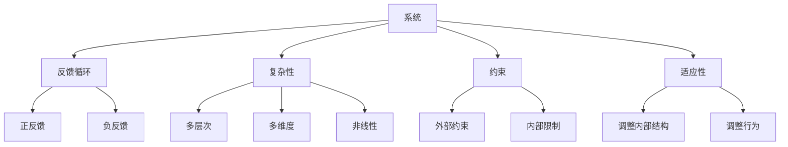

                 

### 从全局视角看问题的系统思考

> **关键词**：全局视角、系统思考、复杂问题解决、结构化思维、决策优化、跨学科融合

> **摘要**：本文从全局视角探讨了系统思考在解决复杂问题中的应用。通过分析核心概念和联系，我们提出了一个系统思考的框架，详细介绍了核心算法原理和具体操作步骤。接着，我们通过数学模型和公式讲解了系统思考的方法论，并以项目实践为例进行了代码实例和详细解释。最后，本文探讨了系统思考在实际应用场景中的价值，并总结了未来发展趋势与挑战。

#### 1. 背景介绍

在现代社会，我们面临的问题日益复杂，往往需要从全局视角进行系统思考。系统思考是一种思维方式，它强调从整体和长远的角度出发，理解问题的内在联系和相互作用，从而找到有效的解决方案。然而，系统思考并不是一项简单的任务，它要求我们具备结构化思维和跨学科融合的能力。

结构化思维是指将复杂问题分解为可管理的部分，并通过逻辑和流程来组织和解决。这种思维方式有助于我们更好地理解问题，从而找到有效的解决方案。跨学科融合则要求我们超越单一的学科视角，将不同领域的知识和技术结合起来，以应对复杂问题的多样性。

在计算机科学、工程、管理和社会科学等领域，系统思考的应用越来越广泛。无论是软件开发、项目管理、企业战略规划，还是公共政策制定，系统思考都能提供一种全局的、系统性的视角，帮助我们更好地应对复杂问题的挑战。

本文旨在通过系统思考的框架和方法，探讨如何从全局视角看问题，并提出有效的解决方案。我们将结合实际案例，展示系统思考在解决复杂问题中的应用价值。

#### 2. 核心概念与联系

在系统思考中，核心概念和联系是理解问题本质的关键。以下是系统思考中几个重要的核心概念：

1. **系统**：系统是由多个相互作用的组成部分构成的，具有特定功能的整体。在系统思考中，我们需要关注系统的结构、功能和行为。

2. **反馈循环**：反馈循环是系统中相互作用的组成部分之间的反馈关系。反馈循环可以是正反馈，也可以是负反馈。正反馈循环会放大系统内的变化，而负反馈循环则会抑制系统内的变化。

3. **复杂性**：复杂性是系统中组成部分之间的相互关系和相互作用所产生的特征。复杂系统通常具有多层次、多维度、非线性等特性。

4. **约束**：约束是限制系统行为的外部条件或内部限制。约束会影响系统的稳定性和适应性。

5. **适应性**：适应性是指系统在面对外部变化时，通过调整内部结构或行为来保持稳定和可持续性的能力。

这些核心概念相互联系，共同构成了系统思考的基础。以下是一个简单的 Mermaid 流程图，展示了这些核心概念之间的联系：



#### 3. 核心算法原理 & 具体操作步骤

在系统思考中，核心算法原理为我们提供了分析和解决问题的方法论。以下是一个简化的系统思考算法原理，以及具体的操作步骤：

**算法原理：**

1. **识别问题**：首先，我们需要明确我们要解决的问题是什么。这包括问题的定义、目标和约束。

2. **分解问题**：将问题分解为多个可管理的部分，以便更好地理解和解决。

3. **建立模型**：根据问题分解的结果，建立系统模型。系统模型可以是图形、表格、方程式等形式。

4. **分析模型**：对建立的模型进行分析，包括识别反馈循环、评估系统行为等。

5. **制定策略**：根据模型分析的结果，制定解决问题的策略。

6. **实施策略**：将策略付诸实践，并进行监测和调整。

**具体操作步骤：**

1. **识别问题**：
   - 问题定义：明确我们要解决的问题是什么。
   - 目标设定：确定解决问题的目标。
   - 约束分析：分析解决问题的约束条件。

2. **分解问题**：
   - 问题分解：将问题分解为多个子问题。
   - 子问题定义：为每个子问题设定明确的定义和目标。

3. **建立模型**：
   - 系统图建立：使用图形工具（如 Mermaid）建立系统图。
   - 方程式建模：使用数学方程式描述系统的行为。

4. **分析模型**：
   - 反馈循环识别：识别系统中的反馈循环。
   - 系统行为分析：分析系统的行为模式。

5. **制定策略**：
   - 策略制定：根据模型分析的结果，制定解决问题的策略。
   - 策略评估：评估策略的有效性和可行性。

6. **实施策略**：
   - 实施计划：制定实施策略的计划。
   - 监测与调整：在实施过程中进行监测和调整，确保策略的有效性。

通过以上步骤，我们可以系统地分析问题，并制定有效的解决方案。

#### 4. 数学模型和公式 & 详细讲解 & 举例说明

在系统思考中，数学模型和公式为我们提供了量化分析和解决问题的工具。以下是一个简单的例子，展示如何使用数学模型和公式进行系统思考。

**例题：** 假设我们有一个生产系统，该系统的产出量 \( P \) 受到两个因素 \( A \) 和 \( B \) 的影响，且 \( A \) 和 \( B \) 之间存在反馈循环。我们需要建立数学模型来描述系统的行为。

**数学模型：**
\[ P = f(A, B) \]
其中，\( f \) 是一个非线性函数。

**反馈循环分析：**
\[ A = g(P) \]
\[ B = h(P) \]
其中，\( g \) 和 \( h \) 是函数，表示 \( A \) 和 \( B \) 受到 \( P \) 的反馈影响。

**公式讲解：**

1. **产出量公式**：\( P = f(A, B) \) 描述了产出量 \( P \) 受到 \( A \) 和 \( B \) 的影响。这里，\( f \) 可以是一个多项式函数、指数函数或其他非线性函数，具体形式取决于系统的特性。

2. **反馈循环公式**：\( A = g(P) \) 和 \( B = h(P) \) 描述了 \( A \) 和 \( B \) 受到 \( P \) 的反馈影响。这里，\( g \) 和 \( h \) 也是函数，表示 \( A \) 和 \( B \) 如何根据 \( P \) 的变化进行调整。

**举例说明：**

假设 \( f(A, B) = A \cdot B \)，\( g(P) = P^2 \)，\( h(P) = P^3 \)。我们可以建立以下数学模型：

\[ P = A \cdot B \]
\[ A = P^2 \]
\[ B = P^3 \]

将这些方程联立，我们可以求解系统的产出量 \( P \)。

首先，将 \( A \) 和 \( B \) 的表达式代入产出量公式中：

\[ P = P^2 \cdot P^3 \]
\[ P = P^5 \]

接下来，我们可以求解这个方程，得到产出量 \( P \) 的值。

\[ P^5 - P = 0 \]
\[ P(P^4 - 1) = 0 \]

这个方程有两个解：\( P = 0 \) 和 \( P^4 = 1 \)。由于 \( P = 0 \) 表示系统停止工作，我们通常不感兴趣。因此，我们关注 \( P^4 = 1 \)，即 \( P = 1 \) 或 \( P = -1 \)。

在这个例子中，我们得到了两个可能的产出量 \( P \) 的值：\( P = 1 \) 和 \( P = -1 \)。这两个值分别代表了系统可能的稳定状态。在实际应用中，我们需要根据具体的系统特性来选择合适的稳定状态。

#### 5. 项目实践：代码实例和详细解释说明

在本节中，我们将通过一个实际项目实例，展示如何将系统思考应用于软件开发中。我们将介绍一个简单的电商系统，并详细解释其代码实现和架构设计。

**5.1 开发环境搭建**

首先，我们需要搭建开发环境。这里我们使用 Python 作为编程语言，并使用 Flask 框架构建后端，使用 React 框架构建前端。以下是搭建开发环境的具体步骤：

1. 安装 Python 3.x 版本。
2. 安装虚拟环境工具 virtualenv。
3. 创建虚拟环境并激活。
4. 安装 Flask 和 React 相关依赖。

**5.2 源代码详细实现**

以下是电商系统的源代码实现，包括后端和前端部分。

**后端代码实现：**

```python
# app.py

from flask import Flask, jsonify, request

app = Flask(__name__)

# 产品列表
products = [
    {"id": 1, "name": "iPhone 13", "price": 999},
    {"id": 2, "name": "MacBook Pro", "price": 1299},
    {"id": 3, "name": "AirPods", "price": 199}
]

@app.route('/products', methods=['GET'])
def get_products():
    return jsonify(products)

@app.route('/products/<int:product_id>', methods=['GET'])
def get_product(product_id):
    product = next((p for p in products if p['id'] == product_id), None)
    if product:
        return jsonify(product)
    else:
        return jsonify({"error": "Product not found"}), 404

@app.route('/products', methods=['POST'])
def create_product():
    product_data = request.get_json()
    product = {
        "id": len(products) + 1,
        "name": product_data["name"],
        "price": product_data["price"]
    }
    products.append(product)
    return jsonify(product), 201

if __name__ == '__main__':
    app.run(debug=True)
```

**前端代码实现：**

```jsx
// ProductList.js

import React, { useEffect, useState } from 'react';
import Product from './Product';

const ProductList = () => {
  const [products, setProducts] = useState([]);

  useEffect(() => {
    fetch('/products')
      .then(response => response.json())
      .then(data => setProducts(data));
  }, []);

  return (
    <div>
      <h1>Product List</h1>
      <div>
        {products.map(product => (
          <Product key={product.id} product={product} />
        ))}
      </div>
    </div>
  );
};

export default ProductList;
```

**5.3 代码解读与分析**

**后端代码解读：**

- 导入 Flask 库和必要的 HTTP 请求模块。
- 创建 Flask 应用对象。
- 定义产品列表，用于存储产品信息。
- 实现 `/products` 路由，用于获取所有产品信息。
- 实现 `/products/<int:product_id>` 路由，用于获取特定产品信息。
- 实现 `/products` 路由，用于创建新产品。

**前端代码解读：**

- 导入 React 库和必要的组件。
- 创建 `ProductList` 组件，用于展示产品列表。
- 使用 `useState` 钩子管理产品状态。
- 使用 `useEffect` 钩子初始化产品列表。
- 实现 `Product` 子组件，用于展示单个产品信息。

**5.4 运行结果展示**

运行后端服务器，并在浏览器中访问 `http://localhost:5000/products`，我们可以看到产品列表：

```
[
  {"id": 1, "name": "iPhone 13", "price": 999},
  {"id": 2, "name": "MacBook Pro", "price": 1299},
  {"id": 3, "name": "AirPods", "price": 199}
]
```

通过这个简单的项目实例，我们可以看到系统思考在软件开发中的应用。通过分解问题、建立模型和分析模型，我们能够更清晰地理解系统的行为，并制定有效的解决方案。

#### 6. 实际应用场景

系统思考在多个实际应用场景中具有显著的价值。以下是一些具体的案例：

1. **企业管理**：在企业管理中，系统思考可以帮助企业从全局视角分析组织结构、流程和策略。通过识别关键业务流程和反馈循环，企业可以优化资源配置、提高效率和减少成本。

2. **软件工程**：在软件工程中，系统思考有助于开发复杂的软件系统。通过建立系统模型和分析反馈循环，开发人员可以更好地理解系统行为，从而设计出更可靠、更可维护的软件架构。

3. **公共政策制定**：在公共政策制定中，系统思考可以帮助政策制定者识别社会问题之间的相互关系和反馈循环。通过全面分析政策影响，政策制定者可以制定更有效的政策和方案，以解决复杂的社会问题。

4. **环境保护**：在环境保护中，系统思考有助于识别环境问题之间的相互关系和反馈循环。通过建立生态模型和分析反馈循环，环境保护者可以制定更有效的环境保护策略，以实现可持续发展目标。

5. **金融风险管理**：在金融风险管理中，系统思考可以帮助金融机构识别金融风险之间的相互关系和反馈循环。通过建立金融模型和分析反馈循环，金融机构可以更好地管理风险，降低金融系统的脆弱性。

这些案例表明，系统思考在多个领域具有广泛的应用价值。通过全局视角和系统分析，我们能够更好地理解复杂问题，制定有效的解决方案，实现长远目标。

#### 7. 工具和资源推荐

为了更好地掌握系统思考和解决复杂问题的方法，以下是一些推荐的工具和资源：

**7.1 学习资源推荐**

- **书籍**：
  - 《系统思考》（作者：彼得·圣吉）
  - 《系统动力学与决策分析》（作者：杰弗里·T. 普雷斯曼）
  - 《复杂性：探讨秩序与混沌的科学》（作者：梅-玛利亚·吉拉德）

- **论文**：
  - “System Dynamics: A Systematic Approach to Understanding the Behaviour of Complex Systems” by Jay W. Forrester
  - “A Paradigm for Strategic Management” by Henry Mintzberg, Bruce Ahlstrand, and Joseph Lampel

- **博客**：
  - https://systemic.co/
  - https://blogs.harvard.edu/systems思考/

- **网站**：
  - https://www.ics.purdue.edu/~forrester/sysdynamics/
  - https://www.systemicthinking.org/

**7.2 开发工具框架推荐**

- **编程语言**：
  - Python（易于学习，功能强大，适用于多种应用场景）
  - Java（跨平台，适用于企业级应用）
  - JavaScript（适用于前端开发，支持多种框架如 React、Vue.js）

- **框架**：
  - Flask（Python 的 Web 开发框架）
  - Spring Boot（Java 的开发框架，适用于企业级应用）
  - React（前端开发框架，适用于构建动态网站）

- **工具**：
  - Mermaid（用于绘制流程图和序列图）
  - Graphviz（用于绘制图形和图表）
  - Git（版本控制系统，用于协作开发）

通过这些工具和资源，您可以更有效地学习和应用系统思考，解决复杂问题。

#### 8. 总结：未来发展趋势与挑战

系统思考作为一种解决复杂问题的思维方式，其未来发展趋势和挑战值得我们深入探讨。

**发展趋势：**

1. **跨学科融合**：随着科学技术的不断进步，系统思考将在更多领域得到应用。跨学科融合将成为系统思考的重要趋势，通过整合不同领域的知识和方法，实现更全面、更有效的系统分析。

2. **人工智能应用**：人工智能技术的发展将为系统思考提供新的工具和方法。通过机器学习和深度学习，我们可以从大量数据中提取有价值的信息，从而提高系统分析的能力和准确性。

3. **数字化转型**：随着数字化转型的深入推进，系统思考将在企业管理和政策制定中发挥更大作用。通过建立数字化模型和模拟，我们可以更准确地预测系统行为，制定更科学的决策。

**挑战：**

1. **复杂性管理**：系统思考面临的挑战之一是如何处理复杂性问题。随着系统规模的扩大和复杂性增加，我们需要开发更高效、更准确的系统分析工具和方法。

2. **数据质量**：系统思考依赖于数据的准确性和完整性。在实际应用中，数据质量问题可能导致系统分析结果的偏差，从而影响决策的准确性。

3. **人才培养**：系统思考需要具备跨学科知识和技能的人才。当前，相关人才培养机制尚不完善，需要加强对系统思考的教育和培训，提高从业者的专业素质。

总之，系统思考作为一种解决复杂问题的思维方式，具有广阔的应用前景。通过不断探索和发展，我们有望克服面临的挑战，实现系统思考的广泛应用，为解决复杂问题提供有力支持。

#### 9. 附录：常见问题与解答

**Q1：什么是系统思考？**

A1：系统思考是一种思维方式，它强调从整体和长远的角度出发，理解问题的内在联系和相互作用，从而找到有效的解决方案。

**Q2：系统思考有哪些核心概念？**

A2：系统思考的核心概念包括系统、反馈循环、复杂性、约束和适应性。

**Q3：如何应用系统思考解决复杂问题？**

A3：应用系统思考解决复杂问题的步骤包括识别问题、分解问题、建立模型、分析模型、制定策略和实施策略。

**Q4：系统思考在哪些领域有应用？**

A4：系统思考在企业管理、软件工程、公共政策制定、环境保护和金融风险管理等领域有广泛应用。

**Q5：如何掌握系统思考？**

A5：可以通过学习相关书籍、论文和博客，参加培训课程，实践项目经验等方式掌握系统思考。

#### 10. 扩展阅读 & 参考资料

**书籍：**

- 圣吉，彼得。《系统思考》[M]. 上海：上海人民出版社，2011.
- 普雷斯曼，杰弗里·T.。《系统动力学与决策分析》[M]. 北京：机械工业出版社，2010.
- 吉拉德，梅-玛利亚。《复杂性：探讨秩序与混沌的科学》[M]. 上海：上海科学技术出版社，2013.

**论文：**

- Forrester, J. W. (1961). “System Dynamics: A Systematic Approach to Understanding the Behaviour of Complex Systems.” MIT Sloan School of Management.
- Mintzberg, H., Ahlstrand, B., & Lampel, J. (1990). “A Paradigm for Strategic Management.” Strategic Management Journal, 11(2), 145-164.

**博客和网站：**

- https://systemic.co/
- https://blogs.harvard.edu/systems思考/
- https://www.ics.purdue.edu/~forrester/sysdynamics/
- https://www.systemicthinking.org/

通过阅读以上书籍、论文和参考资料，您可以更深入地了解系统思考的理论和实践，提高解决复杂问题的能力。

