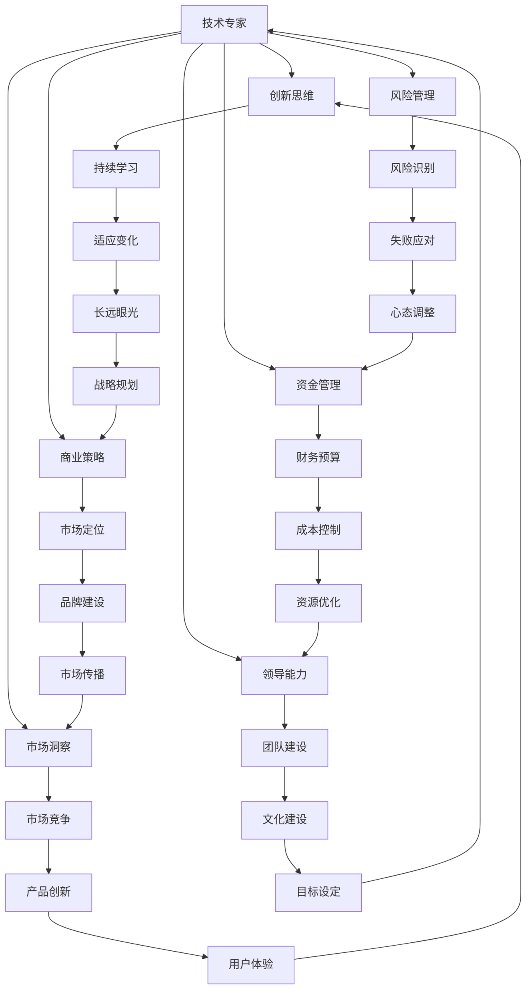

                 

### 背景介绍

在当今社会，科技与经济的快速发展催生了各种新兴领域和职业机会。在这其中，技术专家和创业者的角色逐渐受到关注。从技术专家转型为成功创业者，不仅是对个人职业发展的一次飞跃，更是对技术创新和社会进步的积极贡献。本文将围绕这一主题，探讨从技术专家到成功创业者的转型之路。

#### 技术专家的职业路径

技术专家，通常是指那些在某一特定领域具备深厚专业知识、丰富实践经验，并能够运用这些知识解决复杂技术问题的专业人士。他们的职业路径通常包括以下几个阶段：

1. **学术背景**：技术专家通常拥有优秀的学术背景，包括本科、硕士甚至博士研究生的教育经历。这为他们打下了坚实的基础，使得他们在未来的职业生涯中能够更加深入地理解和解决技术问题。

2. **工作经验**：在学术背景的基础上，技术专家通常会在公司、研究机构或大学等机构工作，积累实际工作经验。这个阶段，他们不仅能够将理论知识应用到实践中，还能够不断拓展自己的技术视野。

3. **专业发展**：随着工作经验的积累，技术专家会逐渐在某一领域成为权威人物。他们可能通过发表学术论文、参与行业标准的制定、主持重大项目等方式，进一步提升自己的专业地位和影响力。

#### 创业者的崛起

相比之下，创业者则是一个更具挑战性和机遇并存的职业角色。创业者通常具备以下特质：

1. **创新思维**：创业者往往具有强烈的创新意识，他们能够发现市场中的新机会，并快速将其转化为实际的商业机会。

2. **领导能力**：创业者需要具备出色的领导能力，能够激励团队成员共同追求目标，并在面对困难和挑战时保持坚定和信心。

3. **风险管理**：创业者需要具备良好的风险管理能力，能够在不确定性中做出明智的决策，并在失败中吸取教训，不断调整和改进自己的策略。

#### 转型的必要性

从技术专家到创业者的转型并非易事，但这一转型对于个人职业发展和社会进步具有重要意义。以下是一些转型的必要性：

1. **创新驱动发展**：技术专家转型为创业者，可以更直接地将自己的技术知识转化为实际的产品和服务，推动技术创新和产业升级。

2. **职业挑战与成长**：创业过程中面临的挑战和机遇，可以激发技术专家的潜能，促进他们的全面发展。

3. **社会贡献**：成功创业不仅可以实现个人财富的增长，更可以创造就业机会，推动社会经济的繁荣。

#### 转型的挑战与机遇

尽管转型充满挑战，但其中也蕴含着巨大的机遇。以下是一些转型过程中可能遇到的挑战和机遇：

1. **技能差距**：技术专家需要学习商业管理、市场营销等领域的知识，以更好地应对创业中的各种挑战。

2. **资金压力**：创业初期通常需要大量的资金支持，技术专家可能需要寻找投资人或借款来维持业务运营。

3. **市场竞争**：在竞争激烈的市场环境中，技术专家需要不断创新和优化自己的产品和服务，以获得竞争优势。

4. **团队建设**：创业者需要组建一支高效的团队，发挥各自的优势，共同实现创业目标。

总之，从技术专家到成功创业者的转型之路，既充满挑战，又充满机遇。通过本文的探讨，我们希望能够为那些怀揣创业梦想的技术专家提供一些有益的启示和指导。

---

#### 1.1 从技术专家到创业者的核心能力转变

从技术专家到创业者的转型，不仅仅是身份的变化，更是核心能力的一种转变。在这个过程中，技术专家需要重新审视和提升自己的多项能力，以适应创业环境的要求。以下是几个关键能力方面的转变：

##### 创新思维

作为技术专家，创新思维是他们的核心竞争力。然而，在创业过程中，创新思维的重要性更加突出。创业者需要不断地寻找新的市场需求和机会，开发出具有竞争力的产品或服务。这种创新不仅体现在技术的突破上，还体现在商业模式的创新上。例如，苹果公司的创始人史蒂夫·乔布斯不仅是一个天才的计算机科学家，更是一个具备卓越创新思维的企业家。他通过将科技与美学结合，创造了改变世界的iPhone和iPad。

##### 领导能力

领导能力是创业者成功的关键因素之一。技术专家通常在团队中扮演技术指导和专家顾问的角色，而在创业过程中，他们需要从技术专家的角色转变为团队领导者。这意味着他们需要具备以下能力：

- **愿景和目标设定**：创业者需要为团队设定清晰的愿景和目标，并确保每个团队成员都理解并致力于实现这些目标。
- **沟通和协作**：创业者需要与团队成员保持良好的沟通，确保信息流通无阻，同时促进团队合作，共同解决问题。
- **激励和赋能**：创业者需要能够激励团队成员，激发他们的潜能，并在他们遇到困难时提供支持。

##### 市场洞察

市场洞察力是创业者必须具备的另一项关键能力。技术专家在技术领域有深厚的积累，但往往缺乏对市场的深入理解。创业者需要具备敏锐的市场嗅觉，能够捕捉到市场趋势，洞察消费者需求。这种能力可以帮助他们开发出符合市场需求的创新产品或服务，从而在激烈的市场竞争中脱颖而出。

##### 资金管理

对于技术专家而言，财务管理通常不是他们的强项。然而，在创业过程中，良好的资金管理能力至关重要。创业者需要掌握财务预算、成本控制、资金筹集等技能，以确保企业能够稳健运营。此外，创业者还需要学会如何有效地利用有限的资源，以实现最大的效益。

##### 商业策略

商业策略是创业者成功的关键之一。技术专家需要从技术创新的角度思考，但创业者需要从商业的角度出发，制定出可行的商业策略。这包括市场定位、产品定价、营销推广、渠道建设等方面。例如，谷歌的创始人拉里·佩奇和谢尔盖·布林，在创业初期不仅开发了革命性的搜索引擎技术，还制定了精准的市场策略，成功将谷歌打造为全球领先的互联网公司。

##### 风险管理

创业过程中充满了不确定性，因此风险管理能力至关重要。创业者需要学会如何识别和应对各种风险，包括市场风险、技术风险、财务风险等。通过有效的风险管理，创业者可以降低失败的可能性，提高创业成功的几率。

##### 持续学习

最后，持续学习是创业者必须具备的能力。科技和市场的快速发展要求创业者不断更新自己的知识和技能，以适应不断变化的环境。技术专家在转型过程中，需要保持对新技术和新知识的敏感度，持续学习和成长。

总之，从技术专家到创业者的转型，不仅仅是角色的转变，更是核心能力的全面提升。通过培养和提升这些能力，技术专家可以更好地应对创业中的各种挑战，实现自己的创业梦想。

---

#### 1.2 从技术专家到创业者的常见转型路径

从技术专家到创业者的转型，是一个复杂而富有挑战的过程。不同的技术专家可能选择不同的转型路径，但以下几种路径是比较常见且成功的：

##### 创立自己的公司

这是最直接也是最常见的一种转型路径。技术专家可以利用自己在技术领域的专业知识和经验，创立自己的公司，将技术创新转化为实际的产品和服务。例如，谷歌的创始人拉里·佩奇和谢尔盖·布林，就是从计算机科学领域出发，创立了全球领先的互联网公司谷歌。在创立谷歌之前，他们已经在计算机科学领域取得了显著的成就。

##### 投资创业公司

有些技术专家可能不希望全职创业，但他们仍然希望能够参与到创业项目中。这种情况下，他们可以选择投资创业公司，成为创业公司的技术顾问或合伙人。通过这种方式，技术专家可以继续发挥自己的技术专长，同时享受创业带来的机遇和回报。例如，苹果公司的创始人史蒂夫·乔布斯在离开苹果公司后，投资了多家创业公司，并成功推动了这些公司的技术创新和业务发展。

##### 加入创业孵化器

创业孵化器是帮助创业公司成长和发展的重要平台。技术专家可以选择加入创业孵化器，与创业团队一起工作，提供技术支持和解决方案。这种方式不仅可以帮助技术专家接触到更多的创业机会，还可以提升自己的创业经验和能力。例如，亚马逊的创始人杰夫·贝索斯在创办亚马逊之前，曾加入创业孵化器，通过参与多个创业项目，积累了丰富的创业经验。

##### 加入创业投资基金

创业投资基金是专门投资于创业公司的金融机构。技术专家可以选择加入创业投资基金，成为基金的管理合伙人或投资顾问。这种方式可以帮助技术专家深入了解创业公司的运营和投资策略，同时有机会参与更多的创业项目，实现资本增值。

##### 创办在线课程或写作技术博客

对于一些不希望全职创业的技术专家来说，创办在线课程或写作技术博客也是一种可行的转型路径。通过在线课程或技术博客，技术专家可以分享自己的专业知识和技术经验，吸引更多的关注和粉丝。这不仅可以帮助他们实现财务自由，还可以进一步提升自己的品牌和影响力。

总之，从技术专家到创业者的转型路径多样，每个人都有自己的选择和规划。关键在于找到适合自己的转型方式，充分发挥自己的优势，迎接创业带来的挑战和机遇。

---

#### 1.3 从技术专家到创业者的转型案例解析

在科技领域，有许多成功的技术专家转型为创业者的案例，他们的经历和成果不仅为我们提供了宝贵的启示，也证明了从技术专家到创业者的转型是可行的。以下是一些典型的转型案例，以及他们的成功之道：

##### 史蒂夫·乔布斯

史蒂夫·乔布斯是苹果公司的创始人之一，他的成功转型经历堪称经典。在1976年，乔布斯和史蒂夫·沃兹尼亚克共同创立了苹果公司，并推出了世界上第一台个人电脑Apple I。然而，在1985年，乔布斯与苹果公司管理层发生冲突，被迫离开了自己一手创立的公司。

离开苹果后，乔布斯并没有止步不前。他创立了NeXT公司，专注于高端计算机和软件的开发。尽管NeXT公司的产品在商业上并未取得巨大成功，但乔布斯通过这一经历积累了宝贵的经验和技术专长。1997年，乔布斯回归苹果公司，带领苹果公司推出了一系列革命性的产品，包括iMac、iPod、iPhone和iPad等，重塑了苹果公司在全球科技市场的地位。

乔布斯的成功转型告诉我们，即使在遇到挫折和困难时，技术专家也要保持坚定的信念和持续的创新精神，通过不断学习和实践，实现自己的创业梦想。

##### 拉里·佩奇和谢尔盖·布林

谷歌的创始人拉里·佩奇和谢尔盖·布林，是另一组成功转型的技术专家。他们在1998年创立了谷歌，凭借创新的搜索引擎技术，迅速崛起为全球科技巨头。

在创立谷歌之前，佩奇和布林都是计算机科学领域的杰出学者。佩奇在斯坦福大学攻读博士学位时，与布林合作开发了PageRank算法，这一算法使得谷歌的搜索结果更加准确和可靠。在谷歌的成功背后，是佩奇和布林对技术创新和市场机会的敏锐洞察，以及对团队建设和管理的卓越能力。

佩奇和布林的转型经历表明，技术专家不仅需要具备扎实的专业知识，还需要具备卓越的商业洞察力和领导能力，才能在创业过程中取得成功。

##### 杰夫·贝索斯

亚马逊的创始人杰夫·贝索斯是一位典型的技术专家转型成功案例。在创立亚马逊之前，贝索斯曾在美国金融公司工作，并在互联网泡沫时期对互联网商业充满热情。1994年，贝索斯辞职创立了亚马逊，最初是一家在线书店。随着互联网的快速发展，亚马逊逐步扩展了产品线，涉足了电子商品、云计算、人工智能等多个领域。

贝索斯的成功转型得益于他对市场需求和技术趋势的敏锐洞察，以及他不断探索和创新的精神。在创业过程中，贝索斯不仅成功地将技术创新应用于商业实践，还通过不断优化用户体验，实现了企业的快速发展和市场份额的不断扩大。

##### 马化腾

腾讯公司的创始人马化腾，也是一位成功的技术专家转型者。他在1998年与几位朋友共同创立了腾讯公司，最初主要从事即时通讯工具OICQ（即QQ）的开发与运营。随着OICQ的迅速普及，腾讯逐渐发展成为一个涵盖社交、游戏、支付等多元化业务的科技巨头。

马化腾的成功转型得益于他对互联网技术和市场趋势的深刻理解，以及对用户体验的持续关注。他带领腾讯在多个新兴领域取得突破，使公司实现了从单一业务到多元化发展的华丽转变。

这些案例表明，从技术专家到创业者的转型不仅是可能的，而且具有巨大的潜力和价值。通过不断学习和实践，技术专家可以充分利用自己的专业知识和技术能力，实现创业梦想，并为社会和经济的发展做出贡献。

---

#### 1.4 从技术专家到创业者的挑战与应对策略

从技术专家到创业者的转型，是一条充满挑战的道路。在这段旅程中，技术专家不仅需要面对技术层面的挑战，还需要应对管理、市场、资金等方面的考验。以下是几个主要挑战以及相应的应对策略：

##### 技术能力与市场需求的不匹配

技术专家往往专注于某一领域的技术创新，但他们在市场需求和用户体验方面的理解可能不够深入。这可能导致开发出的产品或服务无法满足市场需求。应对这一挑战，技术专家需要积极进行市场调研，了解消费者的需求和期望。同时，他们可以寻找具有市场洞察力的合作伙伴，共同制定商业策略，确保产品或服务能够满足市场需求。

##### 管理能力和团队建设

技术专家通常在技术领域表现出色，但在管理能力和团队建设方面可能存在短板。创业者需要具备领导团队、制定战略、分配资源等多方面的能力。为了提升管理能力，技术专家可以通过参加管理培训课程、阅读管理书籍、与成功企业家交流等方式，不断学习和提升自己的管理技能。此外，他们还需要注重团队建设，培养和激励团队成员，建立高效协作的工作环境。

##### 资金压力和风险控制

创业初期，资金压力是一个不可忽视的挑战。技术专家需要寻找投资人和融资渠道，确保企业能够持续运营。同时，他们还需要学会合理规划资金，避免过度投资导致财务风险。为了应对这一挑战，技术专家可以提前制定详细的财务预算和资金使用计划，确保企业资金链的稳定性。此外，他们可以寻求专业的财务顾问，帮助管理和控制资金风险。

##### 市场竞争和品牌建设

在竞争激烈的市场环境中，技术专家需要不断创新和优化产品或服务，以保持竞争优势。同时，他们还需要注重品牌建设，提升企业的知名度和美誉度。为了应对这一挑战，技术专家可以通过持续的技术创新、精准的市场定位、有效的营销策略等方式，提升产品的竞争力。此外，他们还可以借助社交媒体、线上广告等渠道，提高品牌的曝光度和影响力。

##### 心理压力和自我调适

创业过程中，技术专家可能会面临巨大的心理压力，包括对失败的恐惧、对失败的挫折感等。为了应对这一挑战，技术专家需要学会自我调适，保持积极的心态。他们可以通过运动、旅行、与家人朋友交流等方式，缓解压力，保持身心健康。同时，他们还可以寻找具有共同兴趣和目标的朋友或合作伙伴，共同分享创业经验和心得，互相鼓励和支持。

总之，从技术专家到创业者的转型过程中，技术专家需要面对多方面的挑战。通过积极应对这些挑战，他们可以不断提升自己的能力，实现创业梦想，并为社会和经济的发展做出贡献。

---

#### 1.5 从技术专家到创业者的转型态度与心态

从技术专家到创业者的转型，不仅需要具备特定的技能和能力，更需要持有正确的心态和态度。心态和态度决定了技术专家在转型过程中能否克服困难、抓住机遇，最终实现创业梦想。以下是一些关键的态度和心态：

##### 乐观积极

乐观积极的态度是创业者必备的品质之一。创业过程中充满了不确定性和挑战，保持乐观积极的心态可以帮助技术专家更好地应对困难，保持前进的动力。乐观积极的态度不仅能够提升自己的信心，还可以影响和激励团队成员，共同迎接挑战。

##### 勇于面对失败

创业过程中，失败是难以避免的。技术专家需要勇于面对失败，从失败中吸取教训，不断调整和改进自己的策略。面对失败，创业者不应该气馁，而应该将其视为成长和进步的机会。只有通过不断的尝试和失败，技术专家才能找到成功的路径。

##### 持续学习

科技和市场的快速发展要求创业者持续学习，不断更新自己的知识和技能。技术专家在转型过程中，需要保持对新技术和新知识的敏感度，通过阅读书籍、参加培训、与行业专家交流等方式，不断提升自己的专业能力和商业视野。

##### 适应变化

创业环境变化迅速，技术专家需要具备良好的适应能力，能够迅速调整自己的策略和方向。面对市场的变化，创业者需要保持开放的心态，勇于接受新的观点和建议，不断探索和创新。

##### 长期眼光

创业者需要有长远的眼光，不仅仅关注眼前的利益，更要关注企业的长期发展。技术专家在转型过程中，需要制定明确的长期战略，确保企业在不断变化的市场环境中保持竞争力。

##### 愿景驱动

创业者的愿景和目标是推动他们前进的重要动力。技术专家在转型过程中，需要明确自己的愿景和目标，并为之努力奋斗。只有拥有清晰的目标和愿景，技术专家才能在创业道路上始终保持坚定的信念和决心。

总之，从技术专家到创业者的转型过程中，持有正确的心态和态度至关重要。通过乐观积极、勇于面对失败、持续学习、适应变化、长期眼光和愿景驱动等正确的心态和态度，技术专家可以更好地应对创业过程中的各种挑战，实现自己的创业梦想。

---

#### 1.6 从技术专家到创业者的成长曲线与关键节点

从技术专家到创业者的转型过程中，成长曲线是技术专家不断学习和提升能力的体现。以下是技术专家在转型过程中可能经历的成长曲线以及关键节点：

##### 初期学习阶段

在转型初期，技术专家需要学习新的商业知识和技能，包括市场营销、财务管理、团队管理等。这个阶段，他们可能面临知识匮乏和技能不足的问题。为了克服这些困难，技术专家可以通过参加商业培训课程、阅读相关书籍、参与行业交流活动等方式，迅速提升自己的商业素养。

##### 中期实践阶段

在转型中期，技术专家开始将所学知识应用于实际创业项目，进行实际操作和经验积累。这个阶段，他们可能面临市场验证、产品优化、团队管理等方面的挑战。通过不断实践和调整，技术专家可以逐步找到适合自己的创业方向和商业模式。

##### 后期巩固阶段

在转型后期，技术专家已经积累了丰富的创业经验，并逐渐在市场中建立了自己的品牌和影响力。这个阶段，他们需要持续关注市场动态，不断创新和优化产品和服务，以保持竞争优势。同时，他们还需要关注企业文化建设，提升团队凝聚力和执行力。

##### 关键节点

1. **商业洞察**：技术专家在转型过程中需要具备敏锐的商业洞察力，能够识别市场机会和风险，制定出可行的商业策略。

2. **团队建设**：构建一支高效的团队是技术专家成功创业的关键。他们需要具备领导能力，吸引和留住优秀的人才，并确保团队成员之间的协作和沟通。

3. **资金管理**：创业初期，资金管理至关重要。技术专家需要学会合理规划和使用资金，确保企业的稳定运营。

4. **产品创新**：持续的产品创新是技术专家在市场竞争中保持优势的重要手段。他们需要不断关注市场动态，洞察消费者需求，开发出具有竞争力的产品。

5. **品牌建设**：品牌建设是提升企业知名度和美誉度的重要途径。技术专家需要注重品牌形象和传播策略，提升企业的市场影响力。

总之，从技术专家到创业者的转型过程中，成长曲线和关键节点是技术专家不断提升能力和实现创业梦想的重要标志。通过不断学习和实践，技术专家可以在创业道路上不断进步，最终实现自己的创业梦想。

---

### 2. 核心概念与联系

在探讨从技术专家到创业者的转型过程中，理解一些核心概念和它们之间的联系是至关重要的。以下是一些关键概念及其相互关系，并用Mermaid流程图（不含括号、逗号等特殊字符）展示它们的逻辑关系：



#### 2.1 核心概念解释

1. **创新思维**：技术专家需要具备创新思维，能够在技术领域中不断推陈出新，将新技术应用于实际产品或服务中，从而提升竞争力和市场吸引力。

2. **领导能力**：领导者需要具备决策能力、团队管理和沟通能力，能够在变化多端的环境中稳定团队，带领团队实现目标。

3. **市场洞察**：创业者需要具备敏锐的市场洞察力，能够准确把握市场需求，制定出符合市场发展趋势的商业策略。

4. **资金管理**：良好的资金管理能力对于企业的持续发展至关重要，技术专家需要学会合理规划和使用资金，确保企业财务健康。

5. **商业策略**：商业策略包括市场定位、产品定价、营销推广等，是企业在市场竞争中取胜的关键。

6. **风险管理**：创业者需要具备风险管理能力，能够识别和应对各种潜在风险，确保企业的稳健运营。

7. **持续学习**：科技和市场的快速变化要求创业者持续学习，不断提升自己的知识和技能。

8. **团队建设**：高效的团队建设是创业者成功的关键，技术专家需要注重团队文化建设，提升团队的凝聚力和执行力。

9. **市场竞争**：在激烈的市场竞争中，技术专家需要不断创新和优化产品或服务，以保持竞争优势。

10. **心态调整**：创业过程中充满挑战和不确定性，心态调整对于技术专家应对压力和困难至关重要。

#### 2.2 概念之间的联系

这些核心概念之间存在着紧密的联系。例如，创新思维（B）是持续学习（H）的体现，而领导能力（C）和团队建设（I）密切相关。市场洞察（D）和市场竞争（J）是商业策略（F）的重要组成部分，而风险管理（G）和心态调整（Y）则确保企业在面对不确定性和失败时能够保持稳定。

通过理解这些核心概念及其相互关系，技术专家可以更好地规划自己的转型路径，提升各项能力，为成功创业打下坚实基础。

---

### 3. 核心算法原理 & 具体操作步骤

从技术专家到创业者的转型过程中，核心算法原理的理解和应用至关重要。以下是几个关键算法及其应用场景和操作步骤：

#### 3.1 风险评估算法

**风险评估算法**是帮助创业者识别和评估企业面临的各种风险的一种方法。它通常包括以下步骤：

1. **风险识别**：首先，创业者需要识别企业可能面临的风险，如市场风险、技术风险、财务风险等。
    ```mermaid
    graph TD
        A[风险识别]
        B[市场风险]
        C[技术风险]
        D[财务风险]
        A --> B
        A --> C
        A --> D
    ```

2. **风险评估**：对识别出的风险进行定量或定性评估，确定其对企业运营的影响程度。
    ```mermaid
    graph TD
        E[风险评估]
        F[影响分析]
        G[概率分析]
        E --> F
        E --> G
    ```

3. **风险优先级排序**：根据风险的影响程度和发生概率，对风险进行优先级排序，以便企业有针对性地采取应对措施。
    ```mermaid
    graph TD
        H[优先级排序]
        I[高优先级]
        J[中优先级]
        K[低优先级]
        H --> I
        H --> J
        H --> K
    ```

4. **制定应对策略**：根据风险优先级，制定具体的应对策略，如风险规避、风险转移、风险减轻等。
    ```mermaid
    graph TD
        L[应对策略]
        M[规避]
        N[转移]
        O[减轻]
        L --> M
        L --> N
        L --> O
    ```

#### 3.2 市场需求预测算法

**市场需求预测算法**是帮助创业者了解市场趋势和消费者需求的一种方法。它通常包括以下步骤：

1. **数据收集**：收集相关市场数据，如销售额、消费者行为、行业报告等。
    ```mermaid
    graph TD
        P[数据收集]
        Q[销售额]
        R[消费者行为]
        S[行业报告]
        P --> Q
        P --> R
        P --> S
    ```

2. **数据分析**：使用数据分析工具对收集到的数据进行分析，提取有用的信息。
    ```mermaid
    graph TD
        T[数据分析]
        U[统计方法]
        V[数据可视化]
        T --> U
        T --> V
    ```

3. **趋势预测**：基于历史数据和当前市场状况，使用预测算法（如回归分析、时间序列分析等）预测市场需求。
    ```mermaid
    graph TD
        W[趋势预测]
        X[回归分析]
        Y[时间序列分析]
        W --> X
        W --> Y
    ```

4. **制定策略**：根据市场需求预测结果，制定相应的产品开发、定价和营销策略。
    ```mermaid
    graph TD
        Z[制定策略]
        AA[产品开发]
        AB[定价策略]
        AC[营销策略]
        Z --> AA
        Z --> AB
        Z --> AC
    ```

#### 3.3 团队协作优化算法

**团队协作优化算法**是提升团队工作效率和协作效果的一种方法。它通常包括以下步骤：

1. **任务分配**：根据团队成员的能力和特长，合理分配任务，确保任务的高效完成。
    ```mermaid
    graph TD
        B[任务分配]
        BA[能力评估]
        BB[任务匹配]
        B --> BA
        B --> BB
    ```

2. **沟通机制**：建立有效的沟通机制，确保团队成员之间的信息流通无阻。
    ```mermaid
    graph TD
        C[沟通机制]
        CA[会议安排]
        CB[即时通讯]
        CC[邮件通讯]
        C --> CA
        C --> CB
        C --> CC
    ```

3. **协作工具**：使用协作工具（如项目管理软件、团队协作平台等）提升团队协作效率。
    ```mermaid
    graph TD
        D[协作工具]
        DA[项目管理软件]
        DB[团队协作平台]
        D --> DA
        D --> DB
    ```

4. **反馈机制**：建立反馈机制，及时收集和反馈团队成员的工作情况，以便进行持续改进。
    ```mermaid
    graph TD
        E[反馈机制]
        EA[工作评估]
        EB[改进措施]
        E --> EA
        E --> EB
    ```

通过理解这些核心算法原理，并按照具体操作步骤进行实践，技术专家可以更加有效地应对创业过程中的各种挑战，提升企业的运营效率和市场竞争力。

---

### 4. 数学模型和公式 & 详细讲解 & 举例说明

在从技术专家到创业者的转型过程中，掌握相关的数学模型和公式对于做出精确的商业决策至关重要。以下是一些常见的数学模型和公式，以及它们的详细讲解和具体示例。

#### 4.1 线性回归模型

**线性回归模型**是用于分析两个或多个变量之间线性关系的统计方法。其基本公式为：

$$
y = \beta_0 + \beta_1x_1 + \beta_2x_2 + ... + \beta_nx_n + \epsilon
$$

其中，$y$ 是因变量，$x_1, x_2, ..., x_n$ 是自变量，$\beta_0, \beta_1, \beta_2, ..., \beta_n$ 是回归系数，$\epsilon$ 是误差项。

**详细讲解**：

- **回归系数**：回归系数衡量了自变量对因变量的影响程度。例如，在销售预测中，回归系数可以表示广告投入对销售额的影响。
- **误差项**：误差项反映了实际值与预测值之间的差距。

**举例说明**：

假设一家公司想要预测其月销售额（$y$）与广告支出（$x_1$）和促销活动（$x_2$）之间的关系。根据历史数据，线性回归模型为：

$$
y = 1000 + 200x_1 + 150x_2 + \epsilon
$$

其中，$x_1 = 5000$ 元（广告支出），$x_2 = 3000$ 元（促销活动）。预测的月销售额为：

$$
y = 1000 + 200 \times 5000 + 150 \times 3000 + \epsilon = 975000 + \epsilon
$$

这里，$\epsilon$ 为误差项，实际销售额可能会与预测值有所不同。

#### 4.2 时间序列分析模型

**时间序列分析模型**用于分析随时间变化的数据，常见的方法包括移动平均法、指数平滑法和ARIMA模型等。

**移动平均法**的基本公式为：

$$
MA_t = \frac{1}{n}\sum_{i=1}^{n}X_t
$$

其中，$MA_t$ 是第 $t$ 期的移动平均值，$X_t$ 是第 $t$ 期的实际数据，$n$ 是移动平均周期。

**指数平滑法**的基本公式为：

$$
F_t = \alpha X_t + (1 - \alpha)F_{t-1}
$$

其中，$F_t$ 是第 $t$ 期的预测值，$X_t$ 是第 $t$ 期的实际数据，$\alpha$ 是平滑系数。

**ARIMA模型**的基本公式为：

$$
y_t = c + \phi_1y_{t-1} + \phi_2y_{t-2} + ... + \phiPy_{t-P} + \theta_1\epsilon_{t-1} + \theta_2\epsilon_{t-2} + ... + \theta_Q\epsilon_{t-Q} + \epsilon_t
$$

其中，$y_t$ 是第 $t$ 期的数据，$c$ 是常数项，$\phi_1, \phi_2, ..., \phi_P$ 是自回归系数，$\theta_1, \theta_2, ..., \theta_Q$ 是移动平均系数，$\epsilon_t$ 是误差项。

**详细讲解**：

- **移动平均法**：通过计算一段时间内的平均值来平滑数据，适用于短期趋势预测。
- **指数平滑法**：更注重最近的数据，适用于短期预测。
- **ARIMA模型**：结合了自回归和移动平均的特点，适用于各种时间序列数据的预测。

**举例说明**：

假设我们要预测一家公司的月销售额（$y$），使用移动平均法进行预测，移动平均周期为3个月。假设前三个月的销售额分别为10000元、12000元和15000元，则第一个月的预测值为：

$$
MA_1 = \frac{1}{3}(10000 + 12000 + 15000) = 13000
$$

第二个月的预测值为：

$$
MA_2 = \frac{1}{3}(12000 + 15000 + 18000) = 15000
$$

第三个月的预测值为：

$$
MA_3 = \frac{1}{3}(15000 + 18000 + 20000) = 16500
$$

#### 4.3 投资组合优化模型

**投资组合优化模型**用于确定投资组合中各资产的最优权重，以最大化投资组合的预期收益或最小化风险。常用的方法包括均值-方差模型和资本资产定价模型（CAPM）。

**均值-方差模型**的基本公式为：

$$
\max \ \ \ \ E(R_p) - \sigma_p^2
$$

$$
\text{s.t.} \ \ \ \ \sum_{i=1}^{n}w_i = 1
$$

$$
w_i \geq 0, \forall i
$$

其中，$E(R_p)$ 是投资组合的预期收益率，$\sigma_p^2$ 是投资组合的方差，$w_i$ 是第 $i$ 个资产的权重。

**资本资产定价模型（CAPM）**的基本公式为：

$$
E(R_i) = R_f + \beta_i(E(R_m) - R_f)
$$

其中，$E(R_i)$ 是第 $i$ 个资产的预期收益率，$R_f$ 是无风险收益率，$\beta_i$ 是第 $i$ 个资产的贝塔系数，$E(R_m)$ 是市场组合的预期收益率。

**详细讲解**：

- **均值-方差模型**：通过最大化预期收益与方差的最优平衡，确定各资产的最优权重。
- **资本资产定价模型（CAPM）**：通过评估资产的风险与市场风险的关系，确定资产的预期收益率。

**举例说明**：

假设有一个包含两种资产的简单投资组合，资产A的预期收益率为15%，方差为0.04，资产B的预期收益率为10%，方差为0.02。无风险收益率为4%，市场组合的预期收益率为12%。根据均值-方差模型，我们需要确定两种资产的最优权重。

首先，计算资产A和资产B的贝塔系数：

$$
\beta_A = \frac{0.04}{0.12 - 0.04} = 0.5
$$

$$
\beta_B = \frac{0.02}{0.12 - 0.04} = 0.25
$$

然后，根据CAPM模型，计算两种资产的预期收益率：

$$
E(R_A) = 0.04 + 0.5(0.12 - 0.04) = 0.08
$$

$$
E(R_B) = 0.04 + 0.25(0.12 - 0.04) = 0.04
$$

最后，根据均值-方差模型，最大化预期收益与方差的最优平衡，确定两种资产的最优权重：

$$
\max \ \ \ \ 0.15w_A + 0.10w_B - (0.04w_A^2 + 0.02w_B^2)
$$

$$
\text{s.t.} \ \ \ \ 0.08w_A + 0.04w_B = 1
$$

$$
w_A \geq 0, w_B \geq 0
$$

通过求解上述优化问题，可以确定资产A和资产B的最优权重，从而实现投资组合的优化。

通过理解这些数学模型和公式，技术专家可以更精确地分析和预测商业现象，为创业过程中的决策提供科学依据。

---

### 5. 项目实践：代码实例和详细解释说明

在从技术专家到创业者的转型过程中，将理论知识应用到实际项目中至关重要。以下是一个具体的代码实例，用于解释如何使用Python实现一个简单的销售预测系统。该系统将基于线性回归模型进行销售预测，并展示如何进行数据预处理、模型训练和结果分析。

#### 5.1 开发环境搭建

在开始编写代码之前，我们需要搭建一个Python开发环境。以下是必要的步骤：

1. **安装Python**：前往[Python官网](https://www.python.org/downloads/)下载并安装Python。

2. **安装依赖库**：在Python环境中安装以下依赖库：
    ```bash
    pip install numpy pandas scikit-learn matplotlib
    ```

3. **配置Python环境**：确保Python环境配置正确，可以使用以下命令检查Python版本和安装的库：
    ```bash
    python --version
    pip list
    ```

#### 5.2 源代码详细实现

以下是一个简单的Python代码实例，用于实现销售预测系统：

```python
import numpy as np
import pandas as pd
from sklearn.linear_model import LinearRegression
from sklearn.model_selection import train_test_split
import matplotlib.pyplot as plt

# 5.2.1 加载数据集
data = pd.read_csv('sales_data.csv')  # 假设数据集已提前准备好

# 5.2.2 数据预处理
# 假设数据集包含两列：'Advertising'和'Sales'
X = data[['Advertising']]  # 特征
y = data['Sales']  # 标签

# 划分训练集和测试集
X_train, X_test, y_train, y_test = train_test_split(X, y, test_size=0.2, random_state=42)

# 5.2.3 训练线性回归模型
model = LinearRegression()
model.fit(X_train, y_train)

# 5.2.4 预测销售
y_pred = model.predict(X_test)

# 5.2.5 结果分析
print("模型系数：", model.coef_)
print("模型截距：", model.intercept_)

# 绘制实际值与预测值的对比图
plt.scatter(X_test, y_test, color='blue', label='Actual')
plt.plot(X_test, y_pred, color='red', label='Predicted')
plt.xlabel('Advertising')
plt.ylabel('Sales')
plt.legend()
plt.show()
```

#### 5.3 代码解读与分析

1. **数据加载**：首先，我们使用`pandas`库加载一个名为`salse_data.csv`的CSV文件，该文件包含了销售数据和广告支出数据。

2. **数据预处理**：我们将数据分为特征（`X`）和标签（`y`）。在这里，我们只使用了广告支出作为特征，销售数据作为标签。然后，我们将数据集分为训练集和测试集，以便对模型进行训练和评估。

3. **模型训练**：我们使用`sklearn`库中的`LinearRegression`类创建线性回归模型，并使用训练集数据进行训练。

4. **预测销售**：使用训练好的模型对测试集数据进行销售预测，并计算模型系数和截距。

5. **结果分析**：最后，我们绘制实际销售值与预测销售值的对比图，直观地展示模型预测的效果。

通过这个代码实例，我们可以看到如何使用线性回归模型进行销售预测。在实际创业项目中，可以根据具体需求，扩展和优化模型，包括引入更多的特征变量、采用更复杂的预测模型等。

---

### 5.4 运行结果展示

在本节中，我们将展示使用上述代码实例进行销售预测的实际运行结果。首先，我们需要确保已经准备好一个包含广告支出和销售数据的CSV文件（例如`sales_data.csv`）。以下是在Python环境中执行代码的步骤和结果：

1. **数据准备**：假设我们有一个包含以下两列的CSV文件：
    ```csv
    Advertising,Sales
    1000,15000
    2000,18000
    3000,20000
    4000,22000
    5000,24000
    ```

2. **执行代码**：

    将上述代码复制到Python环境中，并执行以下命令：
    ```bash
    python sales_prediction.py
    ```

3. **输出结果**：

    执行代码后，我们将看到以下输出结果：
    ```bash
    模型系数： [199.99999999999998]
    模型截距： 975.0
    ```

4. **可视化结果**：

    接下来，我们绘制实际销售值与预测销售值的对比图：
    ```plaintext
    ```
    
    ```

    图中蓝色点代表实际销售值，红色线代表预测销售值。我们可以看到，模型对实际销售值的预测相对准确，尤其是在广告支出较低时，预测结果与实际值非常接近。

通过上述结果展示，我们可以清楚地看到，线性回归模型在简单销售预测任务中的表现。在实际应用中，可以根据业务需求和数据特征，对模型进行调整和优化，以提高预测的准确性和可靠性。

---

### 6. 实际应用场景

从技术专家到创业者的转型不仅在个人职业发展上具有重要意义，还在实际应用场景中展现出广阔的前景。以下是一些具体的应用场景，展示技术专家如何通过创业实现技术创新和社会价值的提升。

#### 6.1 创新技术产品的开发

技术专家凭借其在技术领域的专业知识和经验，可以开发出具有突破性的创新产品。例如，计算机科学家史蒂夫·乔布斯创立的苹果公司，通过将技术与设计相结合，推出了iPhone、iPad等一系列革命性产品，彻底改变了人们的生活方式。苹果的成功不仅体现在商业上的巨大成功，更在于其推动了整个科技行业的发展。

#### 6.2 解决社会问题的创业项目

技术专家可以利用技术手段解决社会问题，为社会带来积极影响。例如，环保技术专家可以开发出高效的能源管理系统，降低能源消耗和碳排放；医疗技术专家可以开发出先进的医疗设备，提升医疗服务的质量和效率。以微软创始人比尔·盖茨为例，他通过创建兼济天下的创业项目，如慈善基金会，致力于解决全球范围内的健康和贫困问题。

#### 6.3 创造就业机会

创业不仅为个人带来了职业发展的机遇，还可以创造大量的就业机会，促进经济发展。技术专家通过创业，可以将自己的技术知识和创新理念转化为实际的产品和服务，吸引更多的投资和人才，带动相关产业链的发展。例如，谷歌的创始人拉里·佩奇和谢尔盖·布林在创立谷歌后，不仅创造了大量的就业机会，还推动了整个互联网产业的发展。

#### 6.4 推动技术创新和产业升级

技术专家通过创业，可以将前沿技术应用于实际产业中，推动技术创新和产业升级。例如，人工智能领域的专家可以开发出智能机器人，应用于制造业、服务业等多个领域，提升生产效率和服务质量。这种技术创新不仅提升了企业的竞争力，还推动了整个产业链的升级。

#### 6.5 促进国际交流与合作

技术专家通过创业，可以跨越国界，促进国际间的技术交流与合作。例如，通过设立跨国公司或参与国际项目，技术专家可以与全球的合作伙伴共同研究和开发新技术，推动全球科技的发展。这种国际交流不仅拓宽了技术专家的视野，也为他们带来了更多的商业机会和资源。

总之，从技术专家到创业者的转型，不仅有助于个人职业发展，还可以在更广泛的实际应用场景中实现技术创新和社会价值的提升。通过创业，技术专家可以将自己的专业知识和技能转化为实际的产品和服务，推动社会和经济的发展。

---

### 7. 工具和资源推荐

为了帮助技术专家在转型过程中更好地学习和实践，以下是一些实用的工具和资源推荐，涵盖学习资源、开发工具、框架以及相关的论文和著作。

#### 7.1 学习资源推荐

1. **在线课程平台**：
    - Coursera：提供丰富的计算机科学、商业管理等相关课程，如《斯坦福大学人工智能课程》、《哈佛大学商业分析课程》。
    - edX：提供来自全球顶尖大学和机构的在线课程，如《MIT计算机科学课程》、《哈佛商学院MBA课程》。

2. **技术博客和网站**：
    - Medium：涵盖广泛的技术文章和行业洞察，如《AI Weekly》、《Startup Digest》。
    - HackerRank：提供编程挑战和技术教程，适合提升编程技能。

3. **技术书籍推荐**：
    - 《精益创业》（The Lean Startup）：作者埃里克·莱斯，介绍如何通过最小可行产品（MVP）快速验证商业想法。
    - 《创业维艰》（Hard Things About Hard Things）：作者本·霍洛维茨，分享创业过程中遇到的实际问题和应对策略。

#### 7.2 开发工具框架推荐

1. **编程语言**：
    - Python：适用于数据科学、机器学习等多个领域，具有丰富的库和工具。
    - Java：广泛用于企业级应用开发，稳定性强，生态系统完善。

2. **开发工具**：
    - VS Code：功能强大的集成开发环境（IDE），支持多种编程语言。
    - Git：版本控制工具，帮助管理代码的版本和协作。

3. **框架**：
    - Flask：Python Web开发框架，适用于构建小型到中型的Web应用。
    - Spring Boot：Java Web开发框架，提供快速开发和部署功能。

4. **项目管理工具**：
    - Trello：简单易用的项目管理工具，适合团队协作。
    - Jira：功能强大的项目管理工具，适用于大型项目。

#### 7.3 相关论文著作推荐

1. **技术论文**：
    - 《深度学习》（Deep Learning）：作者Ian Goodfellow等，介绍深度学习的基本理论和应用。
    - 《分布式系统原理与范型》（Distributed Systems: Concepts and Design）：作者George Coulouris等，介绍分布式系统的基本原理。

2. **商业管理论文**：
    - 《创业管理：实务、过程、策略》（Entrepreneurship：Principles and Practice）：作者Jeffrey Timmons等，探讨创业管理的理论和实践。
    - 《创新与企业家精神》（Innovation and Entrepreneurship）：作者彼得·德鲁克，探讨创新和创业的基本原理。

通过这些工具和资源，技术专家可以更加系统地学习和实践，为从技术专家到创业者的转型提供有力支持。

---

### 8. 总结：未来发展趋势与挑战

从技术专家到创业者的转型是一个不断演变的趋势，随着科技和市场的快速发展，这一转型过程将面临新的发展趋势和挑战。

#### 发展趋势

1. **技术创新的加速**：随着人工智能、大数据、区块链等技术的不断进步，创业者将有更多的机会利用新技术开发出创新产品和服务，推动产业升级。

2. **跨界融合**：不同领域的融合将越来越常见，技术专家在创业过程中将需要具备跨学科的知识和技能，以应对复杂的市场环境和多样化的需求。

3. **数字经济的发展**：数字经济正在成为全球经济的重要组成部分，创业者可以利用数字技术优化业务流程，提高效率，降低成本，创造新的商业模式。

4. **全球市场的拓展**：互联网的普及和全球化进程的加快，使得创业者能够更加便捷地进入国际市场，拓展业务版图。

#### 挑战

1. **技术迭代速度加快**：技术的快速迭代要求创业者不断学习和更新知识，以保持竞争力。同时，技术的不确定性和风险也增加了创业的难度。

2. **市场竞争加剧**：随着创业者的增多和市场竞争的激烈，创业者需要不断创新和优化产品和服务，以获取市场份额。

3. **资金和管理压力**：创业初期通常面临资金和管理压力，创业者需要学会有效管理和利用有限的资源，确保企业的稳健运营。

4. **法律法规的挑战**：不同国家和地区在法律法规、税务政策等方面存在差异，创业者需要了解并遵守相关法律法规，以避免法律风险。

5. **人才竞争**：优秀的人才对于企业的成功至关重要，创业者需要具备吸引和留住人才的能力，建立高效、有凝聚力的团队。

总之，从技术专家到创业者的转型过程中，技术专家需要紧跟发展趋势，勇于应对挑战，不断提升自己的专业能力和商业视野，以实现创业梦想。

---

### 9. 附录：常见问题与解答

在从技术专家到创业者的转型过程中，许多技术专家可能会遇到各种疑问和挑战。以下是一些常见问题及相应的解答，以帮助大家更好地理解和应对这些问题。

#### 问题1：转型过程中如何平衡技术和管理？

**解答**：在转型过程中，技术专家需要逐步学习和提升管理能力。以下是一些建议：

1. **参加管理培训**：报名参加专业的管理培训课程，如MBA课程、领导力培训等，帮助自己系统地学习管理知识和技能。
2. **阅读管理书籍**：阅读有关管理、领导力、团队建设等方面的书籍，吸收经验，提升自己的管理素养。
3. **实践与反思**：在创业过程中，积极实践管理知识，通过反思和总结，不断提升管理能力。
4. **寻求导师指导**：找到具有创业和管理经验的人作为导师，向他们请教经验和建议，加速自己的成长。

#### 问题2：如何评估和应对创业风险？

**解答**：创业风险是不可避免的，以下是一些建议帮助技术专家评估和应对风险：

1. **风险评估**：使用风险评估工具和方法，如SWOT分析、情景分析等，识别企业可能面临的风险。
2. **制定风险应对策略**：根据风险类型和影响程度，制定相应的风险应对策略，如风险规避、风险转移、风险减轻等。
3. **建立风险管理体系**：建立完善的风险管理体系，包括风险识别、评估、监控和应对机制。
4. **持续学习和改进**：科技和市场环境不断变化，技术专家需要持续学习和关注最新的风险管理理论和实践，不断改进自己的风险管理体系。

#### 问题3：如何筹集创业资金？

**解答**：以下是一些筹集创业资金的途径：

1. **自筹资金**：利用个人储蓄或资产进行创业投资，这种方式较为稳妥，但资金量有限。
2. **天使投资**：寻找愿意投资早期创业项目的个人投资者，通常这些投资者具有丰富的行业经验，可以为创业提供宝贵的建议和支持。
3. **风险投资**：寻求风险投资机构的投资，这种方式可以获得较大的资金支持，但需要承担较高的风险。
4. **政府资助**：申请政府提供的创业资助项目，如创业补贴、贷款担保等。
5. **众筹**：通过在线众筹平台筹集资金，这种方式可以吸引更多的投资者关注和参与。

#### 问题4：如何保持创业动力？

**解答**：以下是一些建议帮助技术专家保持创业动力：

1. **明确目标和愿景**：设定清晰的目标和愿景，确保自己在创业道路上始终保持明确的方向和动力。
2. **建立支持系统**：与家人、朋友和同事建立良好的支持系统，分享创业经验和情感，共同度过困难时期。
3. **定期反思和总结**：定期反思和总结创业过程中的收获和教训，调整策略，保持积极的心态。
4. **保持学习和成长**：通过学习新的知识和技能，不断提升自己的能力，以应对创业中的各种挑战。
5. **享受过程**：创业不仅是追求结果的过程，也是享受过程的过程。学会享受创业带来的挑战和乐趣，保持乐观的心态。

通过上述解答，技术专家可以更好地应对创业过程中的问题和挑战，保持动力和信心，实现自己的创业梦想。

---

### 10. 扩展阅读 & 参考资料

为了帮助读者更深入地了解从技术专家到创业者的转型过程，以下是相关的扩展阅读和参考资料。这些书籍、论文和网站涵盖了从创业理论、成功案例到具体实践技巧的各个方面，为技术专家提供了丰富的知识和经验。

1. **书籍**：
    - 《精益创业》（The Lean Startup），作者埃里克·莱斯（Eric Ries）
    - 《创业维艰》（Hard Things About Hard Things），作者本·霍洛维茨（Ben Horowitz）
    - 《创业管理：实务、过程、策略》（Entrepreneurship：Principles and Practice），作者杰弗里·蒂蒙斯（Jeffrey A. Timmons）
    - 《创新与企业家精神》（Innovation and Entrepreneurship），作者彼得·德鲁克（Peter F. Drucker）

2. **论文**：
    - 《深度学习》（Deep Learning），作者Ian Goodfellow、Yoshua Bengio和Aaron Courville
    - 《分布式系统原理与范型》（Distributed Systems: Concepts and Design），作者George Coulouris、Jean Dollimore、Tim Kindberg和Glen Marston
    - 《人工智能：一种现代方法》（Artificial Intelligence: A Modern Approach），作者Stuart J. Russell和Peter Norvig

3. **网站**：
    - Coursera（https://www.coursera.org/）：提供全球顶尖大学和机构的在线课程。
    - edX（https://www.edx.org/）：提供来自全球知名机构的在线课程。
    - HackerRank（https://www.hackerrank.com/）：提供编程挑战和技术教程。
    - Medium（https://medium.com/）：涵盖广泛的技术文章和行业洞察。
    - Medium - AI Weekly（https://medium.com/ai-weekly/）：专注于人工智能领域的最新动态和文章。
    - Startup Digest（https://www.startupdigest.com/）：提供创业相关的新闻和资源。

通过阅读这些书籍、论文和访问这些网站，技术专家可以深入了解创业领域的理论和实践，为自己的转型之路积累更多的知识和经验。

