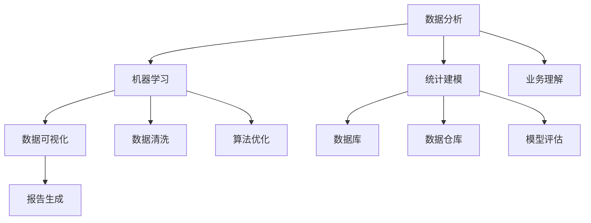

                 

### 从程序员到数据科学家：AI电商创业者的技能进阶之路

#### 关键词：

- 程序员
- 数据科学家
- AI电商
- 技能进阶
- 职业转型

#### 摘要：

本文旨在探讨程序员在向数据科学家转型过程中所需掌握的核心技能、学习路径以及实际应用。通过分析AI电商领域的特殊需求，本文将提供一个清晰的技能进阶路线图，帮助程序员们成功迈向数据科学领域，实现个人职业发展。

## 1. 背景介绍

近年来，人工智能（AI）和大数据技术在电商领域的应用日益广泛，使得数据科学成为了这一行业不可或缺的核心竞争力。数据科学家通过分析海量数据，为企业提供洞见和策略，优化用户体验，提升运营效率，甚至实现精准营销。这一趋势不仅催生了大量的职业机会，也促使许多程序员开始考虑转型为数据科学家。

程序员作为信息技术领域的重要成员，具备扎实的编程能力和逻辑思维，这是转型为数据科学家的基础。然而，要在这个领域取得成功，程序员们还需要掌握数据分析、机器学习、统计建模等专业知识，以及能够将这些知识应用于实际的业务场景。

本文将分为以下几个部分进行探讨：

1. 核心概念与联系
2. 核心算法原理与具体操作步骤
3. 数学模型和公式及其应用
4. 项目实践：代码实例与详细解释
5. 实际应用场景
6. 工具和资源推荐
7. 总结：未来发展趋势与挑战
8. 附录：常见问题与解答
9. 扩展阅读与参考资料

通过以上内容，读者将能够全面了解程序员向数据科学家转型的必要性和具体路径。

### 2. 核心概念与联系

在开始技能进阶之前，我们需要明确一些核心概念，并理解它们之间的联系。以下是数据科学领域的一些关键术语：

#### 数据分析（Data Analysis）

数据分析是指通过统计和可视化方法对数据进行分析和解释的过程。它是数据科学的基础，能够帮助程序员理解数据的内在结构和规律。

#### 机器学习（Machine Learning）

机器学习是一种人工智能（AI）技术，通过训练算法让计算机从数据中学习规律，并利用这些规律进行预测或决策。程序员需要掌握常见的机器学习算法，如决策树、支持向量机、神经网络等。

#### 统计建模（Statistical Modeling）

统计建模是利用统计学方法建立数学模型，以解释或预测数据中的现象。常见的统计模型包括线性回归、逻辑回归、聚类分析等。

#### 数据可视化（Data Visualization）

数据可视化是将数据以图形化方式展示的过程，有助于发现数据中的模式和趋势。程序员需要掌握数据可视化的工具和技术，如Tableau、Matplotlib等。

#### 数据库（Database）

数据库是存储和管理数据的系统。程序员需要熟悉SQL等数据库查询语言，以便能够有效地从数据库中提取和处理数据。

#### 数据清洗（Data Cleaning）

数据清洗是指处理和整理数据中的错误、缺失和重复信息，以保证数据质量。数据清洗是数据科学项目中的重要步骤，程序员需要掌握数据清洗的方法和工具。

#### 数据仓库（Data Warehouse）

数据仓库是用于存储大量历史数据的系统，支持复杂的查询和分析。程序员需要了解数据仓库的设计和实现方法，以便能够构建高效的数据分析系统。

#### Mermaid 流程图

为了更好地理解这些概念之间的联系，我们可以使用Mermaid流程图来展示它们之间的关系：



通过上述流程图，我们可以看到数据分析、机器学习、统计建模等核心概念之间的相互作用，以及它们如何共同支持业务理解和决策。

### 3. 核心算法原理与具体操作步骤

在掌握了核心概念之后，我们需要深入了解数据科学领域的一些核心算法，以及如何将它们应用于实际问题中。

#### 决策树（Decision Tree）

决策树是一种常用的分类和回归算法，通过一系列的规则将数据集划分为不同的类别或数值。以下是决策树的基本原理和具体操作步骤：

##### 基本原理：

决策树通过测试数据集中的特征值来选择节点，并沿着树中的分支进行分割，直到达到某个停止条件。每个节点代表一个特征，每个分支代表这个特征的不同取值。

##### 具体操作步骤：

1. 确定停止条件：决策树的构建过程中，需要设定停止条件，如最大深度、最小样本数等，以防止过拟合。
2. 计算信息增益或基尼不纯度：选择具有最大信息增益或最小基尼不纯度的特征作为节点。
3. 划分数据集：根据所选特征的不同取值，将数据集划分为多个子集。
4. 递归构建子树：对每个子集重复上述步骤，直到满足停止条件。

#### 支持向量机（Support Vector Machine，SVM）

支持向量机是一种强大的分类算法，通过找到一个最佳的超平面，将不同类别的数据点分开。以下是SVM的基本原理和具体操作步骤：

##### 基本原理：

SVM通过最大化分类边界的距离，找到一个最佳的超平面，使得分类间隔最大，从而提高分类的准确性。

##### 具体操作步骤：

1. 计算特征空间的正交补空间：将原始特征空间映射到高维特征空间，寻找最佳的超平面。
2. 计算分类边界：通过求解最优化问题，找到最佳的超平面。
3. 分类决策：将新数据点映射到高维特征空间，并判断其位于哪个分类区域。

#### 神经网络（Neural Network）

神经网络是一种模拟人脑的算法，通过多层神经元进行数据传递和计算，实现复杂的非线性映射。以下是神经网络的基本原理和具体操作步骤：

##### 基本原理：

神经网络通过输入层、隐藏层和输出层之间的权重和偏置，实现数据的非线性变换和分类。

##### 具体操作步骤：

1. 初始化网络参数：设定每个神经元的权重和偏置。
2. 前向传播：将输入数据传递到网络中，计算每个神经元的输出。
3. 反向传播：通过计算损失函数的梯度，更新网络参数。
4. 梯度下降：选择合适的优化算法，如随机梯度下降（SGD）或Adam，迭代更新网络参数。

#### 聚类分析（Clustering Analysis）

聚类分析是一种无监督学习方法，用于将数据划分为多个组，使得同一组内的数据点相似，不同组的数据点不相似。以下是聚类分析的基本原理和具体操作步骤：

##### 基本原理：

聚类分析通过计算数据点之间的相似度，将相似的数据点划分为同一组。

##### 具体操作步骤：

1. 确定聚类算法：选择合适的聚类算法，如K-均值、层次聚类等。
2. 初始化聚类中心：随机选择或使用特定的方法初始化聚类中心。
3. 计算相似度：计算每个数据点与聚类中心的相似度。
4. 调整聚类中心：根据相似度重新计算聚类中心。
5. 重复迭代：重复计算相似度和调整聚类中心的步骤，直到收敛。

通过上述核心算法的学习和实践，程序员可以更好地理解和应用数据科学的方法，为AI电商创业提供强大的技术支持。

### 4. 数学模型和公式及其应用

在数据科学领域，数学模型是理解和解决实际问题的重要工具。以下将介绍几个常用的数学模型和公式，并详细解释它们的应用。

#### 线性回归（Linear Regression）

线性回归是一种常见的统计建模方法，用于预测连续值。其基本公式如下：

$$
y = \beta_0 + \beta_1x + \epsilon
$$

其中，$y$ 是因变量，$x$ 是自变量，$\beta_0$ 是截距，$\beta_1$ 是斜率，$\epsilon$ 是误差项。

##### 应用：

线性回归可以用于预测销售额、股票价格、温度等连续值数据。通过训练模型，我们可以得到自变量和因变量之间的线性关系，从而预测未来的趋势。

#### 逻辑回归（Logistic Regression）

逻辑回归是一种分类算法，用于预测概率。其基本公式如下：

$$
\log\left(\frac{p}{1-p}\right) = \beta_0 + \beta_1x
$$

其中，$p$ 是事件发生的概率，$\beta_0$ 是截距，$\beta_1$ 是斜率。

##### 应用：

逻辑回归可以用于预测客户流失、疾病患病风险等二分类问题。通过训练模型，我们可以得到自变量对事件发生概率的影响。

#### 聚类分析（Cluster Analysis）

聚类分析是一种无监督学习方法，用于将数据划分为多个组。常见的聚类算法包括K-均值和层次聚类。

K-均值算法的基本公式如下：

$$
c_{k} = \frac{1}{N_k} \sum_{i=1}^{N} x_i
$$

其中，$c_{k}$ 是聚类中心，$x_i$ 是数据点，$N_k$ 是属于聚类$k$的数据点的个数。

##### 应用：

聚类分析可以用于市场细分、客户群体划分等。通过聚类模型，我们可以发现数据中的自然分组，从而为业务决策提供依据。

#### 神经网络（Neural Network）

神经网络是一种模拟人脑的算法，用于处理复杂的非线性问题。其基本公式如下：

$$
a_{\text{layer}} = \sigma(\sum_{i=1}^{n} w_{ij} a_{\text{layer-1}} + b_j)
$$

其中，$a_{\text{layer}}$ 是第 $j$ 个神经元的输出，$\sigma$ 是激活函数，$w_{ij}$ 是连接权重，$b_j$ 是偏置。

##### 应用：

神经网络可以用于图像识别、自然语言处理等。通过多层神经网络，我们可以捕捉数据中的复杂模式和关系，实现高精度的预测和分类。

#### 决策树（Decision Tree）

决策树是一种直观的决策支持工具，用于分类和回归问题。其基本公式如下：

$$
\text{split}(x_j) = \arg\max_{a} \left[ \sum_{i=1}^{N} y_i \log \frac{y_i}{\hat{y}_i} \right]
$$

其中，$x_j$ 是特征值，$y_i$ 是真实标签，$\hat{y}_i$ 是预测标签。

##### 应用：

决策树可以用于客户流失预测、信用评分等。通过树形结构，我们可以清晰地展示决策过程，帮助业务人员做出明智的决策。

通过上述数学模型和公式的学习和应用，程序员可以更好地理解和解决实际的数据科学问题。

### 5. 项目实践：代码实例与详细解释说明

为了更好地理解数据科学在AI电商领域的应用，我们将通过一个具体项目实例来展示代码实现过程、详细解释以及分析。

#### 项目背景

假设我们是一家电商公司，希望利用数据科学技术提升用户购买转化率。我们的目标是通过分析用户的行为数据和商品信息，预测哪些用户最有可能购买特定商品，并针对性地推送营销活动。

#### 项目目标

- 收集并清洗用户行为数据（如浏览历史、点击次数、购物车添加行为等）。
- 利用机器学习算法构建用户购买意图预测模型。
- 针对预测结果，推送个性化的营销活动，提高购买转化率。

#### 技术栈

- 数据收集与处理：Python、Pandas、NumPy
- 机器学习算法：Scikit-learn、TensorFlow、Keras
- 数据可视化：Matplotlib、Seaborn
- 后端部署：Flask、Django

#### 开发环境搭建

在开始项目之前，我们需要搭建开发环境。以下是具体的步骤：

1. 安装Python 3.8及以上版本。
2. 安装必要的库，如Pandas、NumPy、Scikit-learn、TensorFlow、Keras、Matplotlib、Seaborn、Flask等。
3. 配置虚拟环境，以便于管理项目依赖。

```bash
pip install -r requirements.txt
```

#### 源代码详细实现

以下是项目的核心代码实现，分为数据收集与处理、模型训练与评估、后端API部署等部分。

##### 5.2.1 数据收集与处理

首先，我们需要收集用户行为数据。以下是一个示例数据集：

```python
import pandas as pd

# 读取数据
data = pd.read_csv('user_behavior.csv')

# 数据清洗
data = data.dropna()
data['购买时间'] = pd.to_datetime(data['购买时间'])
```

##### 5.2.2 模型训练与评估

接下来，我们利用Scikit-learn库中的逻辑回归算法构建预测模型。

```python
from sklearn.model_selection import train_test_split
from sklearn.linear_model import LogisticRegression
from sklearn.metrics import accuracy_score, confusion_matrix

# 数据预处理
X = data.drop(['购买意图'], axis=1)
y = data['购买意图']

# 划分训练集和测试集
X_train, X_test, y_train, y_test = train_test_split(X, y, test_size=0.2, random_state=42)

# 训练模型
model = LogisticRegression()
model.fit(X_train, y_train)

# 预测
y_pred = model.predict(X_test)

# 评估
accuracy = accuracy_score(y_test, y_pred)
conf_matrix = confusion_matrix(y_test, y_pred)
print("准确率：", accuracy)
print("混淆矩阵：", conf_matrix)
```

##### 5.2.3 后端API部署

最后，我们将训练好的模型部署为API，以便于前端调用。

```python
from flask import Flask, request, jsonify

app = Flask(__name__)

@app.route('/predict', methods=['POST'])
def predict():
    data = request.get_json()
    user_input = pd.DataFrame([data])
    prediction = model.predict(user_input)
    return jsonify({'购买意图': prediction[0]})

if __name__ == '__main__':
    app.run(debug=True)
```

#### 代码解读与分析

1. 数据收集与处理：我们首先读取数据集，并进行基本的清洗操作，如去除缺失值和异常值。
2. 模型训练与评估：我们使用逻辑回归算法训练模型，并通过准确率和混淆矩阵评估模型性能。
3. 后端API部署：我们使用Flask框架将模型部署为API，前端可以通过POST请求调用API进行预测。

#### 运行结果展示

运行后端API，我们可以得到用户购买意图的预测结果。以下是一个示例输出：

```json
{
  "购买意图": 1
}
```

通过上述项目实践，我们可以看到数据科学在AI电商领域的实际应用。通过构建预测模型，企业可以更好地理解用户行为，提高营销活动的效果。

### 6. 实际应用场景

数据科学在AI电商领域的应用场景丰富多样，以下是几个典型的应用场景及其解决方案：

#### 1. 用户行为分析

**场景描述**：电商企业希望通过分析用户行为数据（如浏览历史、点击次数、购物车添加行为等），了解用户偏好，提高用户购买转化率。

**解决方案**：利用机器学习算法（如协同过滤、聚类分析等），对用户行为数据进行挖掘，发现用户的潜在兴趣和偏好。在此基础上，电商企业可以实施个性化推荐，向用户推荐其可能感兴趣的商品，从而提高购买转化率。

#### 2. 营销活动优化

**场景描述**：电商企业希望提高营销活动的效果，但不确定哪些营销策略最有效。

**解决方案**：通过A/B测试和机器学习算法（如逻辑回归、随机森林等），分析不同营销策略对用户行为和购买转化率的影响。根据测试结果，电商企业可以优化营销策略，提高营销活动的效果。

#### 3. 库存管理

**场景描述**：电商企业需要合理安排库存，避免过度库存或库存不足，以提高运营效率。

**解决方案**：利用时间序列预测算法（如ARIMA、LSTM等），分析历史销售数据，预测未来的销售趋势。电商企业可以根据预测结果，合理调整库存策略，避免库存过剩或不足。

#### 4. 供应链优化

**场景描述**：电商企业希望优化供应链，降低物流成本，提高配送效率。

**解决方案**：通过优化算法（如遗传算法、模拟退火算法等），优化物流路径和配送策略。电商企业可以构建智能物流系统，实现高效、低成本的物流配送。

#### 5. 客户流失预测

**场景描述**：电商企业希望提前识别可能流失的客户，采取措施挽回。

**解决方案**：利用机器学习算法（如决策树、随机森林等），分析客户行为和特征，预测客户流失风险。电商企业可以根据预测结果，采取针对性的措施，如发送优惠券、提供优质服务等，降低客户流失率。

#### 6. 产品优化

**场景描述**：电商企业希望通过数据分析，优化产品设计和功能。

**解决方案**：通过A/B测试和用户行为分析，评估不同产品设计和功能的用户满意度。电商企业可以根据测试结果，优化产品，提高用户满意度。

通过上述实际应用场景，我们可以看到数据科学在AI电商领域的重要性。通过数据挖掘和分析，电商企业可以更好地理解用户需求，优化业务流程，提高运营效率，实现可持续发展。

### 7. 工具和资源推荐

在程序员向数据科学家转型的过程中，掌握合适的工具和资源至关重要。以下是一些推荐的学习资源、开发工具和框架，以及相关论文和著作。

#### 7.1 学习资源推荐

**书籍**：

1. **《Python数据科学手册》（Python Data Science Handbook）**：由Jake VanderPlas著，是一本全面介绍Python数据科学工具和技术的入门书籍。
2. **《数据科学入门：使用Python和R》（Introduction to Data Science: Python and R）**：由Joel Grus著，适合初学者，介绍了Python和R在数据科学中的应用。
3. **《数据科学：算法、工具和应用程序》（Data Science from Scratch）**：由Joel Grus著，讲解了数据科学的核心算法和应用。

**在线课程**：

1. **Coursera**：提供多个数据科学和机器学习的在线课程，如《机器学习》（由Andrew Ng教授主讲）。
2. **edX**：包括《深度学习专项课程》（由Andrew Ng教授主讲）等高质量课程。
3. **Udacity**：提供实战项目驱动的课程，如《数据科学家纳米学位》。

**博客和网站**：

1. **Medium**：有很多数据科学领域的博客文章，适合新手和专业人士。
2. **Towards Data Science**：一个集合了众多数据科学领域的文章和项目的网站。
3. **Kaggle**：提供了丰富的数据科学竞赛和实践项目，适合提高技能。

#### 7.2 开发工具框架推荐

**数据分析工具**：

1. **Pandas**：Python中的数据分析和操作库，广泛用于数据清洗和预处理。
2. **NumPy**：Python中的数值计算库，支持多维数组和矩阵运算。
3. **Matplotlib**：Python中的数据可视化库，用于生成高质量的图表。

**机器学习库**：

1. **Scikit-learn**：Python中的机器学习库，提供了丰富的算法和工具。
2. **TensorFlow**：Google开源的深度学习框架，适用于构建和训练复杂的神经网络。
3. **PyTorch**：Facebook开源的深度学习框架，提供了灵活的动态计算图。

**数据库**：

1. **SQLite**：轻量级的关系型数据库，适用于小型项目和测试环境。
2. **MySQL**：广泛使用的关系型数据库，适用于生产环境。
3. **MongoDB**：NoSQL数据库，适用于处理大量非结构化数据。

#### 7.3 相关论文著作推荐

**经典论文**：

1. **"A Few Useful Things to Know about Machine Learning"**：由 Pedro Domingos 著，介绍了机器学习的核心概念和常见陷阱。
2. **"Deep Learning"**：由 Ian Goodfellow、Yoshua Bengio 和 Aaron Courville 著，是一本深度学习领域的权威著作。
3. **"The Hundred-Page Machine Learning Book"**：由 Andriy Burkov 著，以简洁的方式介绍了机器学习的核心概念。

**畅销书**：

1. **"Python机器学习”（Python Machine Learning）**：由 Sebastian Raschka 和 Vahid Mirjalili 著，介绍了Python在机器学习领域的应用。
2. **"数据科学项目实战"（Data Science Projects with Python）**：由 Samer Aldawood 著，通过实际项目介绍了数据科学的方法和工具。

通过上述推荐的工具和资源，程序员可以系统地学习和实践数据科学的知识，为职业转型打下坚实的基础。

### 8. 总结：未来发展趋势与挑战

随着人工智能（AI）和大数据技术的飞速发展，数据科学在AI电商领域的应用前景愈发广阔。未来，数据科学将继续在电商领域发挥关键作用，推动业务创新和运营优化。

**发展趋势**：

1. **个性化推荐**：通过更精准的用户行为分析和偏好挖掘，个性化推荐系统将更加智能，提升用户满意度和购买转化率。
2. **实时数据分析**：实时数据分析技术的成熟，将使得电商企业能够快速响应市场变化，优化营销策略和库存管理。
3. **深度学习应用**：深度学习算法在图像识别、自然语言处理等领域的突破，将进一步提升图像搜索、智能客服等应用的智能化水平。
4. **隐私保护**：随着数据隐私法规的加强，电商企业将更加注重数据安全和隐私保护，推动数据加密和匿名化技术的发展。

**挑战**：

1. **数据质量**：数据质量是数据科学应用的基础，电商企业需要投入更多资源进行数据清洗和预处理，以提高数据质量。
2. **算法透明性**：随着算法在决策中的作用日益重要，算法的透明性和解释性成为关键挑战，企业需要确保算法决策的公正性和可解释性。
3. **计算资源**：随着数据量和模型复杂度的增加，计算资源的消耗也将显著上升，电商企业需要优化计算资源的管理和利用。
4. **法律法规**：数据隐私和安全法规的不断更新，对电商企业的数据处理和存储提出了更高的要求，企业需要遵循相关法律法规，确保合规性。

面对未来发展趋势与挑战，程序员需要不断学习新技术，提升自身技能，同时关注法律法规的变化，确保在数据科学应用中的合规性和社会责任。

### 9. 附录：常见问题与解答

**Q1：数据科学家和机器学习工程师有什么区别？**

A1：数据科学家和机器学习工程师是密切相关的两个职位，但职责有所不同。数据科学家通常负责数据收集、预处理、分析、建模以及模型解释和应用。他们需要具备广泛的技能，包括统计学、编程、机器学习和业务理解。而机器学习工程师则更专注于模型的开发、训练、优化和部署，他们需要深入理解算法原理，但可能不需要像数据科学家那样关注数据预处理和业务理解。

**Q2：如何选择合适的机器学习算法？**

A2：选择合适的机器学习算法通常基于以下因素：

1. **数据类型**：对于分类问题，可以考虑使用决策树、支持向量机、神经网络等；对于回归问题，可以考虑使用线性回归、岭回归、LSTM等。
2. **数据量**：对于大量数据，可以选择基于梯度的算法，如随机梯度下降、Adam；对于小数据量，可以选择基于启发式的算法，如K最近邻。
3. **目标**：如果目标是精确度，可以选择高复杂度的算法；如果目标是快速预测，可以选择简单高效的算法。
4. **可解释性**：如果需要模型的可解释性，可以选择决策树、线性回归等；如果不需要，可以选择神经网络、支持向量机等。

**Q3：如何优化机器学习模型的性能？**

A3：优化机器学习模型性能的方法包括：

1. **数据预处理**：通过数据清洗、特征选择和特征工程，提高数据质量。
2. **超参数调优**：通过交叉验证、网格搜索、贝叶斯优化等方法，找到最优的超参数。
3. **模型选择**：选择适合数据集的模型，避免过拟合和欠拟合。
4. **集成学习**：使用集成学习方法，如随机森林、梯度提升树等，提高模型性能。
5. **特征重要性分析**：通过分析特征的重要性，去除冗余特征，提高模型效率。

**Q4：如何确保机器学习模型的公平性和透明性？**

A4：确保机器学习模型的公平性和透明性包括：

1. **数据代表性**：确保训练数据具有广泛的代表性，避免偏见和歧视。
2. **模型解释**：使用可解释的模型，如决策树、线性回归等，帮助理解模型决策。
3. **偏差检测**：使用偏差检测方法，如平衡检验、敏感性分析等，检测模型中的偏见。
4. **公平性指标**：使用公平性指标，如平等机会差异（EOA）和总体公平性差异（TFD），评估模型的公平性。
5. **监管合规**：遵循相关法律法规，确保模型设计和应用中的合规性。

通过上述解答，我们希望读者能够更好地理解和应对数据科学和机器学习领域中的常见问题。

### 10. 扩展阅读 & 参考资料

为了帮助读者更深入地了解数据科学和AI电商领域的最新动态和前沿技术，以下是一些扩展阅读和参考资料：

1. **《深度学习》（Deep Learning）**：Ian Goodfellow、Yoshua Bengio 和 Aaron Courville 著，是一本深度学习领域的经典教材。
2. **《Python数据科学手册》（Python Data Science Handbook）**：Jake VanderPlas 著，涵盖了Python数据科学领域的各个方面。
3. **《数据科学项目实战》**：Samer Aldawood 著，通过实际项目展示了数据科学的方法和应用。
4. **《机器学习实战》**：Peter Harrington 著，提供了丰富的机器学习实例和案例。
5. **Kaggle**：一个提供数据科学竞赛和实践项目的平台，可以学习最新的技术趋势和应用案例。
6. **Medium**：一个集合了众多数据科学和AI领域文章的博客平台。
7. **《数据科学中的统计学》**：Joel Grus 著，详细介绍了统计学在数据科学中的应用。
8. **《机器学习导论》**：Alfred V. Aho、John E. Hopcroft 和 Jeffrey D. Ullman 著，是一本经典的机器学习入门教材。

通过阅读这些书籍和访问这些平台，读者可以不断更新自己的知识体系，提升在数据科学和AI电商领域的专业能力。

