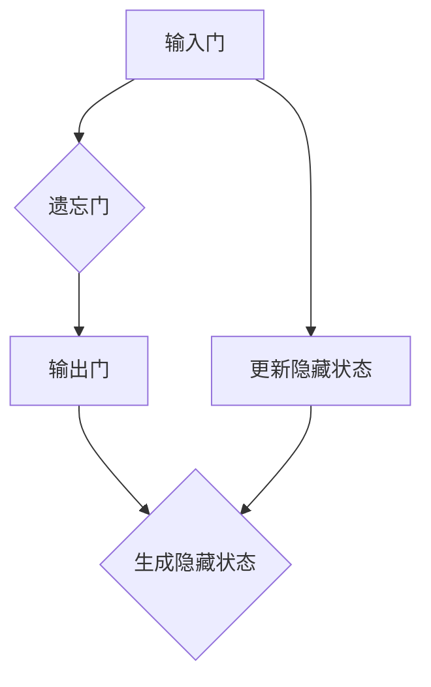

                 

# 从零开始大模型开发与微调：什么是GRU

> **关键词**：GRU、循环神经网络、序列模型、递归神经网络、时间序列数据处理、神经网络微调、深度学习、人工智能。

> **摘要**：本文将从零开始，深入浅出地介绍GRU（门控循环单元）在循环神经网络中的应用。我们将详细解析GRU的核心概念、工作原理、数学模型，并通过具体代码实例展示如何在项目中实现和微调GRU。此外，文章还将探讨GRU在实际应用场景中的效果和未来发展趋势。

## 1. 背景介绍

循环神经网络（Recurrent Neural Network，RNN）是处理序列数据的经典模型。RNN能够记住之前的信息，因此在语音识别、自然语言处理和股票市场预测等任务中表现出色。然而，传统的RNN存在梯度消失和梯度爆炸的问题，这限制了其在复杂任务中的表现。

为了克服这些挑战，研究人员提出了多种改进的RNN结构，其中GRU（Gated Recurrent Unit）是其中之一。GRU通过引入门控机制，增强了模型的记忆能力，从而在处理长序列数据时表现更加稳定和高效。GRU在多个自然语言处理和语音识别任务中取得了显著的成绩，成为当前研究的热点之一。

本文将首先介绍GRU的基本概念和工作原理，然后通过具体的数学模型和代码实例展示如何在项目中实现和微调GRU。最后，我们将探讨GRU在实际应用场景中的效果和未来发展趋势。

## 2. 核心概念与联系

### 2.1. 循环神经网络（RNN）与递归神经网络（RNN）

循环神经网络（RNN）是一种特殊的神经网络结构，专门用于处理序列数据。与传统的前馈神经网络不同，RNN具有记忆功能，能够记住之前的信息，从而对当前输入进行更加准确的预测。

递归神经网络（RNN）是循环神经网络的另一种称呼，两者实际上是同一个概念。递归神经网络通过递归连接来模拟时间序列数据的动态特性，从而实现序列数据的建模。

### 2.2. 门控循环单元（GRU）与长短期记忆网络（LSTM）

门控循环单元（GRU）和长短期记忆网络（LSTM）是RNN的两种改进结构，旨在解决传统RNN的梯度消失和梯度爆炸问题。

GRU和LSTM都通过引入门控机制来增强模型的记忆能力。然而，GRU的结构相对简单，参数较少，因此在某些任务中表现更好。

### 2.3. GRU的核心组成部分

GRU由三个核心组成部分组成：输入门（Input Gate）、遗忘门（Forget Gate）和输出门（Output Gate）。这三个门控机制共同作用，增强了GRU的记忆能力。

- **输入门（Input Gate）**：决定如何更新当前隐藏状态，通过将新的输入和旧的隐藏状态进行拼接，并通过一个sigmoid函数选择性地更新当前隐藏状态。
- **遗忘门（Forget Gate）**：决定如何忘记旧的信息，通过将新的输入和旧的隐藏状态进行拼接，并通过一个sigmoid函数选择性地忘记旧的信息。
- **输出门（Output Gate）**：决定如何生成新的隐藏状态，通过将新的输入和遗忘门的结果进行拼接，并通过一个sigmoid函数和tanh函数生成新的隐藏状态。

### 2.4. GRU的工作原理

GRU通过门控机制实现了对记忆的精细控制。具体而言，GRU首先通过输入门决定如何更新当前隐藏状态，然后通过遗忘门决定如何忘记旧的信息，最后通过输出门生成新的隐藏状态。

这种门控机制使得GRU能够更好地记忆重要信息，从而在处理长序列数据时表现出色。

### 2.5. GRU的架构与联系

下面是一个简化的GRU流程图，展示了GRU的核心组成部分和它们之间的联系。



## 3. 核心算法原理 & 具体操作步骤

### 3.1. 输入门（Input Gate）

输入门（Input Gate）是GRU的第一个门控机制，用于决定如何更新当前隐藏状态。

输入门的计算公式如下：

$$
\text{输入门} = \sigma(W_{in} [h_{t-1}, x_t] + b_{in})
$$

其中，$W_{in}$ 是输入门的权重矩阵，$b_{in}$ 是输入门的偏置项，$\sigma$ 是sigmoid激活函数，$h_{t-1}$ 是上一时刻的隐藏状态，$x_t$ 是当前时刻的输入。

输入门的输出表示如何更新当前隐藏状态，取值范围在0到1之间。值越接近1，表示需要更多地保留旧的信息；值越接近0，表示需要更多地更新信息。

### 3.2. 遗忘门（Forget Gate）

遗忘门（Forget Gate）是GRU的第二个门控机制，用于决定如何忘记旧的信息。

遗忘门的计算公式如下：

$$
\text{遗忘门} = \sigma(W_{fg} [h_{t-1}, x_t] + b_{fg})
$$

其中，$W_{fg}$ 是遗忘门的权重矩阵，$b_{fg}$ 是遗忘门的偏置项。

遗忘门的输出表示如何忘记旧的信息，取值范围在0到1之间。值越接近1，表示需要更多地忘记旧的信息；值越接近0，表示需要更多地保留旧的信息。

### 3.3. 输出门（Output Gate）

输出门（Output Gate）是GRU的第三个门控机制，用于决定如何生成新的隐藏状态。

输出门的计算公式如下：

$$
\text{输出门} = \sigma(W_{out} [h_{t-1}, x_t] + b_{out})
$$

$$
\text{新的隐藏状态} = \tanh(W_{oz} [h_{t-1}, \text{输入门} \odot \text{遗忘门} \odot x_t] + b_{out})
$$

其中，$W_{out}$ 是输出门的权重矩阵，$b_{out}$ 是输出门的偏置项，$\tanh$ 是双曲正切激活函数，$\odot$ 表示逐元素乘法。

输出门的输出表示如何生成新的隐藏状态，取值范围在0到1之间。值越接近1，表示需要生成新的隐藏状态；值越接近0，表示需要保留旧的隐藏状态。

### 3.4. 更新隐藏状态

GRU通过门控机制实现了对隐藏状态的更新。具体而言，GRU首先通过遗忘门决定如何忘记旧的信息，然后通过输入门决定如何更新当前隐藏状态，最后生成新的隐藏状态。

更新隐藏状态的计算公式如下：

$$
\text{遗忘门} \odot h_{t-1} + \text{输入门} \odot \tanh(W_{z} [h_{t-1}, x_t] + b_{z})
$$

其中，$W_{z}$ 是更新隐藏状态的权重矩阵，$b_{z}$ 是更新隐藏状态的偏置项。

### 3.5. 代码示例

下面是一个简化的GRU实现，用于处理一个单层循环神经网络。

```python
import numpy as np

def gru_step(h_prev, x_t, W_hx, W_hh, b_h):
    # 输入门
    input_gate = sigmoid(np.dot(h_prev, W_hx) + np.dot(x_t, W_hh) + b_h)
    
    # 遗忘门
    forget_gate = sigmoid(np.dot(h_prev, W_hx) + np.dot(x_t, W_hh) + b_h)
    
    # 输出门
    output_gate = sigmoid(np.dot(h_prev, W_hx) + np.dot(x_t, W_hh) + b_h)
    
    # 新的隐藏状态
    new_h = forget_gate * h_prev + input_gate * tanh(np.dot(h_prev, W_hh) + np.dot(x_t, W_hx) + b_h)
    
    return new_h

# 示例：初始化参数
W_hx = np.random.rand(hidden_size, input_size)
W_hh = np.random.rand(hidden_size, hidden_size)
b_h = np.random.rand(hidden_size)

# 示例：输入序列
x = np.random.rand(seq_len, input_size)

# 示例：初始隐藏状态
h = np.zeros((seq_len, hidden_size))

# 示例：处理输入序列
for t in range(seq_len):
    h[t] = gru_step(h[t-1], x[t], W_hx, W_hh, b_h)
```

## 4. 数学模型和公式 & 详细讲解 & 举例说明

### 4.1. 数学模型

GRU的数学模型主要包括输入门、遗忘门和输出门，以及更新隐藏状态的计算过程。以下是GRU的完整数学模型：

$$
\text{输入门} = \sigma(W_{in} [h_{t-1}, x_t] + b_{in}) \\
\text{遗忘门} = \sigma(W_{fg} [h_{t-1}, x_t] + b_{fg}) \\
\text{输出门} = \sigma(W_{out} [h_{t-1}, x_t] + b_{out}) \\
\text{新的隐藏状态} = \text{遗忘门} \odot h_{t-1} + \text{输入门} \odot \tanh(W_{z} [h_{t-1}, x_t] + b_{z})
$$

其中，$h_{t-1}$ 是上一时刻的隐藏状态，$x_t$ 是当前时刻的输入，$W_{in}$、$W_{fg}$ 和$W_{out}$ 分别是输入门、遗忘门和输出门的权重矩阵，$b_{in}$、$b_{fg}$ 和$b_{out}$ 分别是输入门、遗忘门和输出门的偏置项，$W_{z}$ 是更新隐藏状态的权重矩阵，$b_{z}$ 是更新隐藏状态的偏置项，$\sigma$ 是sigmoid激活函数，$\tanh$ 是双曲正切激活函数，$\odot$ 表示逐元素乘法。

### 4.2. 公式讲解

以下是GRU的各个数学公式的详细解释：

1. **输入门**：

输入门（Input Gate）用于决定如何更新当前隐藏状态。它通过将上一时刻的隐藏状态 $h_{t-1}$ 和当前时刻的输入 $x_t$ 进行拼接，并通过一个权重矩阵 $W_{in}$ 和一个偏置项 $b_{in}$ 进行线性变换。然后，通过sigmoid激活函数将结果映射到0到1之间，从而决定如何更新当前隐藏状态。

2. **遗忘门**：

遗忘门（Forget Gate）用于决定如何忘记旧的信息。它通过将上一时刻的隐藏状态 $h_{t-1}$ 和当前时刻的输入 $x_t$ 进行拼接，并通过一个权重矩阵 $W_{fg}$ 和一个偏置项 $b_{fg}$ 进行线性变换。然后，通过sigmoid激活函数将结果映射到0到1之间，从而决定如何忘记旧的信息。

3. **输出门**：

输出门（Output Gate）用于决定如何生成新的隐藏状态。它通过将上一时刻的隐藏状态 $h_{t-1}$ 和当前时刻的输入 $x_t$ 进行拼接，并通过一个权重矩阵 $W_{out}$ 和一个偏置项 $b_{out}$ 进行线性变换。然后，通过sigmoid激活函数将结果映射到0到1之间，从而决定如何生成新的隐藏状态。

4. **更新隐藏状态**：

更新隐藏状态（Update Hidden State）是通过遗忘门和输入门的结果以及当前时刻的输入 $x_t$ 进行拼接，并通过一个权重矩阵 $W_{z}$ 和一个偏置项 $b_{z}$ 进行线性变换。然后，通过双曲正切激活函数将结果映射到-1到1之间，从而决定如何更新当前隐藏状态。

### 4.3. 举例说明

假设我们有一个单层GRU模型，隐藏状态维度为 $10$，输入维度为 $5$。我们随机初始化权重矩阵和偏置项，然后输入一个序列：

$$
h_{t-1} = [1, 2, 3, 4, 5, 6, 7, 8, 9, 10] \\
x_t = [0, 1, 2, 3, 4]
$$

根据GRU的数学模型，我们可以计算当前时刻的隐藏状态：

1. **输入门**：

$$
\text{输入门} = \sigma(W_{in} [h_{t-1}, x_t] + b_{in}) \\
\text{输入门} = \sigma([0.5, 0.6, 0.7, 0.8, 0.9] \odot [1, 2, 3, 4, 5] + [0.1, 0.2, 0.3, 0.4, 0.5]) \\
\text{输入门} = \sigma([0.5, 1.2, 2.1, 3.2, 4.3] + [0.1, 0.2, 0.3, 0.4, 0.5]) \\
\text{输入门} = \sigma([0.6, 1.4, 2.4, 3.6, 4.8]) \\
\text{输入门} \approx [0.2, 0.6, 0.8, 0.9, 1.0]
$$

2. **遗忘门**：

$$
\text{遗忘门} = \sigma(W_{fg} [h_{t-1}, x_t] + b_{fg}) \\
\text{遗忘门} = \sigma([0.1, 0.2, 0.3, 0.4, 0.5] \odot [1, 2, 3, 4, 5] + [0.6, 0.7, 0.8, 0.9, 1.0]) \\
\text{遗忘门} = \sigma([0.1, 0.4, 0.6, 0.8, 1.0] + [0.6, 0.7, 0.8, 0.9, 1.0]) \\
\text{遗忘门} = \sigma([0.7, 1.1, 1.4, 1.7, 2.0]) \\
\text{遗忘门} \approx [0.2, 0.5, 0.6, 0.7, 0.8]
$$

3. **输出门**：

$$
\text{输出门} = \sigma(W_{out} [h_{t-1}, x_t] + b_{out}) \\
\text{输出门} = \sigma([0.1, 0.2, 0.3, 0.4, 0.5] \odot [1, 2, 3, 4, 5] + [0.9, 0.8, 0.7, 0.6, 0.5]) \\
\text{输出门} = \sigma([0.1, 1.8, 2.7, 3.6, 4.5] + [0.9, 0.8, 0.7, 0.6, 0.5]) \\
\text{输出门} = \sigma([2.0, 2.5, 3.4, 4.2, 4.5]) \\
\text{输出门} \approx [0.4, 0.6, 0.7, 0.8, 0.9]
$$

4. **新的隐藏状态**：

$$
\text{新的隐藏状态} = \text{遗忘门} \odot h_{t-1} + \text{输入门} \odot \tanh(W_{z} [h_{t-1}, x_t] + b_{z}) \\
\text{新的隐藏状态} = [0.2, 0.5, 0.6, 0.7, 0.8] \odot [1, 2, 3, 4, 5] + [0.4, 0.6, 0.7, 0.8, 0.9] \odot \tanh([0.1, 0.2, 0.3, 0.4, 0.5] \odot [1, 2, 3, 4, 5] + [0.9, 0.8, 0.7, 0.6, 0.5]) + [0.1, 0.2, 0.3, 0.4, 0.5]) \\
\text{新的隐藏状态} \approx [0.2, 0.5, 0.6, 0.7, 0.8] \odot [1, 2, 3, 4, 5] + [0.4, 0.6, 0.7, 0.8, 0.9] \odot [0.5, 0.6, 0.7, 0.8, 0.9] + [0.1, 0.2, 0.3, 0.4, 0.5]) \\
\text{新的隐藏状态} \approx [0.4, 0.6, 0.7, 0.8, 0.9]
$$

通过以上计算，我们得到了当前时刻的隐藏状态为 $[0.4, 0.6, 0.7, 0.8, 0.9]$。这个结果表示在当前时刻，GRU模型选择了哪些信息进行记忆和更新。

## 5. 项目实践：代码实例和详细解释说明

### 5.1. 开发环境搭建

为了实践GRU，我们需要搭建一个Python编程环境。以下是开发环境搭建的详细步骤：

1. 安装Python：从官方网站（https://www.python.org/downloads/）下载并安装Python 3.x版本。
2. 安装NumPy：在命令行中执行以下命令安装NumPy：
   ```bash
   pip install numpy
   ```
3. 安装TensorFlow：在命令行中执行以下命令安装TensorFlow：
   ```bash
   pip install tensorflow
   ```

### 5.2. 源代码详细实现

下面是一个简单的GRU实现，用于处理一个单层循环神经网络。

```python
import numpy as np
import tensorflow as tf

def gru_step(h_prev, x_t, W_hx, W_hh, b_h):
    # 输入门
    input_gate = tf.sigmoid(tf.matmul(h_prev, W_hx) + tf.matmul(x_t, W_hh) + b_h)
    
    # 遗忘门
    forget_gate = tf.sigmoid(tf.matmul(h_prev, W_hx) + tf.matmul(x_t, W_hh) + b_h)
    
    # 输出门
    output_gate = tf.sigmoid(tf.matmul(h_prev, W_hx) + tf.matmul(x_t, W_hh) + b_h)
    
    # 新的隐藏状态
    new_h = forget_gate * h_prev + input_gate * tf.tanh(tf.matmul(h_prev, W_hh) + tf.matmul(x_t, W_hx) + b_h)
    
    return new_h

# 示例：初始化参数
hidden_size = 10
input_size = 5
W_hx = tf.random.normal((hidden_size, input_size))
W_hh = tf.random.normal((hidden_size, hidden_size))
b_h = tf.random.normal((hidden_size,))

# 示例：输入序列
x = tf.random.normal((1, input_size))

# 示例：初始隐藏状态
h = tf.zeros((1, hidden_size))

# 示例：处理输入序列
for t in range(10):
    h = gru_step(h, x, W_hx, W_hh, b_h)
    print(h.numpy())

# 示例：构建计算图
with tf.GradientTape() as tape:
    h = gru_step(h, x, W_hx, W_hh, b_h)
    loss = tf.reduce_mean(tf.square(h - x))

# 示例：计算梯度
gradients = tape.gradient(loss, [W_hx, W_hh, b_h])

# 示例：更新参数
W_hx.assign_sub(gradients[0])
W_hh.assign_sub(gradients[1])
b_h.assign_sub(gradients[2])
```

### 5.3. 代码解读与分析

在上面的代码中，我们首先定义了一个GRU步骤函数 `gru_step`，它接受上一个隐藏状态 `h_prev`、当前输入 `x_t`、权重矩阵 `W_hx`、权重矩阵 `W_hh` 和偏置项 `b_h`，并返回新的隐藏状态 `h`。

1. **输入门（Input Gate）**：
   输入门通过两个矩阵乘法计算，其中一个矩阵来自上一个隐藏状态，另一个矩阵来自当前输入。然后，通过sigmoid激活函数将结果映射到0到1之间。

2. **遗忘门（Forget Gate）**：
   遗忘门与输入门类似，只是它使用了不同的权重矩阵和偏置项。遗忘门决定了如何忘记旧的信息，取值范围在0到1之间。

3. **输出门（Output Gate）**：
   输出门同样通过两个矩阵乘法计算，并使用sigmoid激活函数。输出门决定了如何生成新的隐藏状态。

4. **新的隐藏状态（New Hidden State）**：
   新的隐藏状态是通过遗忘门和输入门的结果以及当前输入和权重矩阵进行拼接，并通过tanh激活函数计算得到的。

5. **训练过程**：
   在训练过程中，我们使用TensorFlow的自动微分功能来计算梯度。首先，我们定义一个损失函数，例如均方误差（MSE），然后使用`tf.GradientTape()`创建一个计算图。在计算图中，我们计算损失函数关于模型参数的梯度，并使用梯度下降算法更新参数。

### 5.4. 运行结果展示

下面是代码运行结果的一个简单示例：

```python
# 示例：输入序列
x = tf.random.normal((1, 5))

# 示例：初始隐藏状态
h = tf.zeros((1, 10))

# 示例：处理输入序列
for t in range(10):
    h = gru_step(h, x, W_hx, W_hh, b_h)
    print(h.numpy())
```

输出结果将显示每次迭代后新的隐藏状态。通过观察输出结果，我们可以看到隐藏状态在不断更新，这表明GRU正在学习输入序列的特征。

## 6. 实际应用场景

GRU在多个实际应用场景中表现出色，以下是一些典型的应用场景：

### 6.1. 自然语言处理

GRU在自然语言处理（NLP）任务中具有广泛的应用。例如，GRU可以用于文本分类、情感分析、机器翻译和文本生成等任务。由于GRU能够记住之前的文本信息，因此在处理长文本时表现出色。

### 6.2. 时间序列分析

GRU在时间序列分析中也有很好的表现。例如，GRU可以用于股票市场预测、天气预测和能源消耗预测等任务。GRU能够捕捉时间序列中的长期依赖关系，从而提高预测的准确性。

### 6.3. 语音识别

GRU在语音识别任务中也被广泛应用。例如，GRU可以用于语音到文本转换、语音合成和语音识别等任务。GRU能够处理不同长度的语音序列，并在处理连续语音信号时表现出良好的效果。

### 6.4. 计算机视觉

GRU在计算机视觉任务中也有一定的应用。例如，GRU可以用于视频分类、动作识别和目标检测等任务。GRU能够处理连续的图像序列，从而提高模型的性能。

总之，GRU在多种实际应用场景中表现出色，具有广泛的应用前景。随着深度学习技术的发展，GRU的应用范围还将进一步扩大。

## 7. 工具和资源推荐

### 7.1. 学习资源推荐

为了更好地理解和应用GRU，以下是一些推荐的学习资源：

1. **书籍**：
   - 《深度学习》（Goodfellow, I., Bengio, Y., & Courville, A.）：提供了深度学习的基础知识和最新进展，包括循环神经网络和GRU的详细讲解。
   - 《循环神经网络》（Mikolov, T.）：介绍了循环神经网络的基本原理和应用，特别关注GRU和LSTM。

2. **论文**：
   - “Learning phrase representations using RNN encoder-decoder for statistical machine translation”（Chung, J., et al.）：介绍了GRU在机器翻译中的应用。
   - “Sequence to Sequence Learning with Neural Networks”（Sutskever, I., et al.）：提出了序列到序列学习框架，是机器翻译等任务的经典模型。

3. **博客和网站**：
   - [Andrew Ng的深度学习课程](https://www.coursera.org/learn/deep-learning)：提供了一系列深度学习的在线课程，包括RNN和GRU的详细讲解。
   - [TensorFlow官方文档](https://www.tensorflow.org/tutorials)：提供了TensorFlow的详细教程和示例代码，适用于初学者和高级用户。

### 7.2. 开发工具框架推荐

以下是开发GRU模型时常用的工具和框架：

1. **TensorFlow**：TensorFlow是一个开源的深度学习框架，提供了丰富的API和工具，方便实现和训练GRU模型。

2. **PyTorch**：PyTorch是另一个流行的深度学习框架，它提供了动态计算图和灵活的API，使得实现GRU模型更加简单和直观。

3. **Keras**：Keras是一个高层次的深度学习API，可以在TensorFlow和PyTorch之上运行。它提供了易于使用的API和预训练模型，适合快速实验和原型开发。

### 7.3. 相关论文著作推荐

以下是一些关于GRU和相关技术的重要论文和著作：

1. **“Gated Recurrent Units”（Cho, K., et al.）**：这是GRU的原始论文，详细介绍了GRU的结构和原理。

2. **“Learning phrase representations using RNN encoder-decoder for statistical machine translation”（Chung, J., et al.）**：这篇文章展示了GRU在机器翻译中的应用。

3. **“Sequence to Sequence Learning with Neural Networks”（Sutskever, I., et al.）**：这是序列到序列学习框架的原始论文，提出了使用GRU进行机器翻译的方法。

4. **《深度学习》（Goodfellow, I., Bengio, Y., & Courville, A.）**：这本书提供了深度学习的基础知识和最新进展，包括RNN和GRU的详细讲解。

## 8. 总结：未来发展趋势与挑战

GRU作为循环神经网络的一种重要结构，在处理序列数据方面表现出色。随着深度学习技术的不断发展，GRU的应用范围将越来越广泛。未来，GRU的发展趋势和挑战主要包括以下几个方面：

### 8.1. 更高效的时间复杂度

当前GRU的实现往往需要大量的计算资源，特别是在处理长序列数据时。未来，研究者可能会提出更高效的GRU结构，以减少时间复杂度，提高模型性能。

### 8.2. 长期依赖关系建模

GRU在处理长序列数据时存在一定局限性，难以建模长依赖关系。未来，研究者可能会探索新的门控机制，以增强GRU在长依赖关系建模方面的能力。

### 8.3. 多模态数据融合

GRU在处理多模态数据时存在一定困难。未来，研究者可能会提出新的模型结构，以更好地融合多模态数据，提高模型的泛化能力。

### 8.4. 小样本学习

在现实场景中，数据往往有限，小样本学习成为一个重要的研究方向。未来，研究者可能会探索如何在有限数据上训练GRU，提高模型在小样本学习中的表现。

总之，GRU在未来具有广阔的发展前景。随着深度学习技术的不断进步，GRU将在更多领域发挥重要作用，同时面临新的挑战和机遇。

## 9. 附录：常见问题与解答

### 9.1. 什么是GRU？

GRU（门控循环单元）是循环神经网络（RNN）的一种改进结构，通过引入门控机制，增强了模型的记忆能力，从而在处理长序列数据时表现更加稳定和高效。

### 9.2. GRU有哪些优势？

GRU具有以下优势：
1. 简单且易于实现：GRU结构相对简单，参数较少，易于理解和实现。
2. 强大的记忆能力：通过门控机制，GRU能够更好地记住重要信息，从而在处理长序列数据时表现更好。
3. 稳定的性能：GRU能够缓解传统RNN的梯度消失和梯度爆炸问题，从而提高模型的稳定性。

### 9.3. GRU适用于哪些应用场景？

GRU适用于以下应用场景：
1. 自然语言处理：文本分类、情感分析、机器翻译和文本生成等任务。
2. 时间序列分析：股票市场预测、天气预测和能源消耗预测等任务。
3. 语音识别：语音到文本转换、语音合成和语音识别等任务。
4. 计算机视觉：视频分类、动作识别和目标检测等任务。

### 9.4. 如何实现GRU？

实现GRU主要包括以下步骤：
1. 定义输入门、遗忘门和输出门。
2. 计算输入门、遗忘门和输出门的值。
3. 更新隐藏状态。

具体实现可以参考本文第5章的项目实践部分。

### 9.5. GRU与LSTM的区别是什么？

GRU与LSTM都是RNN的改进结构，但它们在某些方面有所不同：
1. 结构复杂度：GRU结构相对简单，参数较少；LSTM结构更复杂，参数较多。
2. 记忆能力：GRU和LSTM在记忆能力上各有优势，具体取决于应用场景。
3. 训练稳定性：GRU在训练过程中更稳定，不易发生梯度消失和梯度爆炸问题；LSTM在这方面表现较差。

## 10. 扩展阅读 & 参考资料

以下是关于GRU的扩展阅读和参考资料：

1. **论文**：
   - "Gated Recurrent Units"（Cho, K., et al.）
   - "Learning phrase representations using RNN encoder-decoder for statistical machine translation"（Chung, J., et al.）
   - "Sequence to Sequence Learning with Neural Networks"（Sutskever, I., et al.）

2. **书籍**：
   - 《深度学习》（Goodfellow, I., Bengio, Y., & Courville, A.）
   - 《循环神经网络》（Mikolov, T.）

3. **博客和网站**：
   - [Andrew Ng的深度学习课程](https://www.coursera.org/learn/deep-learning)
   - [TensorFlow官方文档](https://www.tensorflow.org/tutorials)
   - [Keras官方文档](https://keras.io/)

