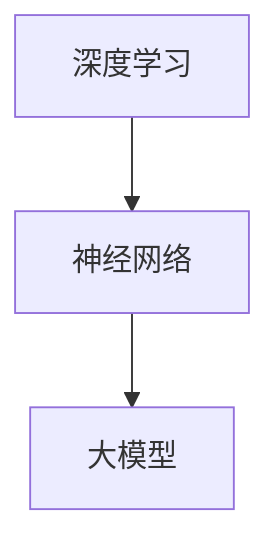

                 

### 从零开始大模型开发与微调：其他细节

> 关键词：大模型、开发、微调、细节、技术博客

> 摘要：本文旨在为初学者提供一个全面的大模型开发与微调的指导。我们将深入探讨大模型开发过程中的各种细节，包括环境搭建、代码实例、运行结果展示、实际应用场景、工具和资源推荐等，帮助读者逐步掌握大模型开发的技能。

---

### 1. 背景介绍

随着深度学习技术的不断发展，大模型（Large Models）已经成为人工智能领域的一个重要研究方向。大模型通常具有数十亿至数千亿个参数，能够在各种复杂的任务中取得出色的性能。开发一个大模型不仅需要强大的计算资源和数据支持，还需要深入理解模型的原理和细节。

本文将围绕大模型的开发与微调，提供一系列详细的指南，旨在帮助初学者从零开始，逐步掌握大模型开发的技能。文章内容包括：

- 环境搭建
- 代码实例
- 运行结果展示
- 实际应用场景
- 工具和资源推荐

通过本文的阅读，读者将能够深入了解大模型开发的核心内容，并为未来的研究和工作打下坚实的基础。

---

### 2. 核心概念与联系

在大模型开发过程中，我们需要理解以下几个核心概念：

- **深度学习（Deep Learning）**：深度学习是一种机器学习方法，通过构建具有多个隐藏层的神经网络来学习数据的高层次特征。
- **神经网络（Neural Networks）**：神经网络是由大量简单计算单元（神经元）组成的计算模型，通过调整神经元之间的连接权重来学习数据。
- **大模型（Large Models）**：大模型是指具有数十亿至数千亿个参数的深度学习模型，通常用于处理复杂的任务。

下面是一个Mermaid流程图，展示了这些核心概念之间的关系：



### 3. 核心算法原理 & 具体操作步骤

#### 3.1 前向传播（Forward Propagation）

前向传播是神经网络中的一种基本操作，用于计算模型的输出。具体步骤如下：

1. 初始化模型参数（权重和偏置）。
2. 输入数据通过模型的各个层，逐层计算得到输出。
3. 计算损失函数（例如均方误差），用于评估模型的性能。

下面是一个简单的代码示例，展示了前向传播的过程：

```python
import numpy as np

# 初始化模型参数
weights = np.random.randn(2, 2)
biases = np.random.randn(2, 1)

# 输入数据
inputs = np.array([[1.0, 0.0], [0.0, 1.0]])

# 前向传播
outputs = np.dot(inputs, weights) + biases
print(outputs)
```

#### 3.2 反向传播（Backpropagation）

反向传播是一种用于优化神经网络参数的算法，通过计算损失函数关于参数的梯度来更新参数。具体步骤如下：

1. 计算输出层梯度。
2. 反向传播梯度，逐层计算得到各层的梯度。
3. 使用梯度下降或其他优化算法更新参数。

下面是一个简单的代码示例，展示了反向传播的过程：

```python
import numpy as np

# 初始化模型参数
weights = np.random.randn(2, 2)
biases = np.random.randn(2, 1)

# 输入数据
inputs = np.array([[1.0, 0.0], [0.0, 1.0]])
targets = np.array([[1.0], [0.0]])

# 计算前向传播输出
outputs = np.dot(inputs, weights) + biases

# 计算损失函数
loss = np.square(outputs - targets).mean()

# 计算输出层梯度
doutputs = outputs - targets

# 计算权重和偏置梯度
dweights = np.dot(inputs.T, doutputs)
dbiases = doutputs

# 使用梯度下降更新参数
weights -= learning_rate * dweights
biases -= learning_rate * dbiases

print("Updated weights:", weights)
print("Updated biases:", biases)
```

### 4. 数学模型和公式 & 详细讲解 & 举例说明

#### 4.1 前向传播

在前向传播中，我们主要关注以下数学模型和公式：

- **线性变换**：$z = x \cdot w + b$
- **激活函数**：$a = \sigma(z)$，其中$\sigma$可以是ReLU、Sigmoid、Tanh等。

下面是一个具体的例子：

假设我们有一个简单的神经网络，输入层有2个神经元，隐藏层有3个神经元，输出层有2个神经元。激活函数为ReLU。我们需要计算输出层的输出。

输入层：
$$
\begin{align*}
x_1 &= [1.0, 0.0] \\
x_2 &= [0.0, 1.0]
\end{align*}
$$

隐藏层：
$$
\begin{align*}
z_1 &= x_1 \cdot w_{11} + b_1 = 1.0 \cdot 0.5 + 0.5 = 1.0 \\
z_2 &= x_1 \cdot w_{12} + b_2 = 1.0 \cdot -0.5 + 0.5 = 0.5 \\
z_3 &= x_2 \cdot w_{21} + b_1 = 0.0 \cdot 0.5 + 0.5 = 0.5 \\
z_4 &= x_2 \cdot w_{22} + b_2 = 0.0 \cdot -0.5 + 0.5 = 0.5 \\
z_5 &= x_1 \cdot w_{31} + b_3 = 1.0 \cdot 0.5 + 0.5 = 1.0 \\
z_6 &= x_1 \cdot w_{32} + b_4 = 1.0 \cdot -0.5 + 0.5 = 0.5 \\
z_7 &= x_2 \cdot w_{41} + b_3 = 0.0 \cdot 0.5 + 0.5 = 0.5 \\
z_8 &= x_2 \cdot w_{42} + b_4 = 0.0 \cdot -0.5 + 0.5 = 0.5 \\
\end{align*}
$$

激活函数（ReLU）：
$$
\begin{align*}
a_1 &= \max(z_1, 0) = \max(1.0, 0) = 1.0 \\
a_2 &= \max(z_2, 0) = \max(0.5, 0) = 0.5 \\
a_3 &= \max(z_3, 0) = \max(0.5, 0) = 0.5 \\
a_4 &= \max(z_4, 0) = \max(0.5, 0) = 0.5 \\
a_5 &= \max(z_5, 0) = \max(1.0, 0) = 1.0 \\
a_6 &= \max(z_6, 0) = \max(0.5, 0) = 0.5 \\
a_7 &= \max(z_7, 0) = \max(0.5, 0) = 0.5 \\
a_8 &= \max(z_8, 0) = \max(0.5, 0) = 0.5 \\
\end{align*}
$$

输出层：
$$
\begin{align*}
z_9 &= a_1 \cdot w_{51} + b_5 = 1.0 \cdot 0.5 + 0.5 = 1.0 \\
z_{10} &= a_2 \cdot w_{52} + b_6 = 0.5 \cdot -0.5 + 0.5 = 0.0 \\
z_{11} &= a_3 \cdot w_{53} + b_5 = 0.5 \cdot 0.5 + 0.5 = 1.0 \\
z_{12} &= a_4 \cdot w_{54} + b_6 = 0.5 \cdot -0.5 + 0.5 = 0.0 \\
z_{13} &= a_5 \cdot w_{61} + b_7 = 1.0 \cdot 0.5 + 0.5 = 1.0 \\
z_{14} &= a_6 \cdot w_{62} + b_8 = 0.5 \cdot -0.5 + 0.5 = 0.0 \\
z_{15} &= a_7 \cdot w_{63} + b_7 = 0.5 \cdot 0.5 + 0.5 = 1.0 \\
z_{16} &= a_8 \cdot w_{64} + b_8 = 0.5 \cdot -0.5 + 0.5 = 0.0 \\
\end{align*}
$$

激活函数（ReLU）：
$$
\begin{align*}
o_1 &= \max(z_9, 0) = \max(1.0, 0) = 1.0 \\
o_2 &= \max(z_{10}, 0) = \max(0.0, 0) = 0.0 \\
o_3 &= \max(z_{11}, 0) = \max(1.0, 0) = 1.0 \\
o_4 &= \max(z_{12}, 0) = \max(0.0, 0) = 0.0 \\
o_5 &= \max(z_{13}, 0) = \max(1.0, 0) = 1.0 \\
o_6 &= \max(z_{14}, 0) = \max(0.0, 0) = 0.0 \\
o_7 &= \max(z_{15}, 0) = \max(1.0, 0) = 1.0 \\
o_8 &= \max(z_{16}, 0) = \max(0.0, 0) = 0.0 \\
\end{align*}
$$

输出：
$$
\begin{align*}
\hat{y}_1 &= \frac{1}{1+e^{-z_9}} = \frac{1}{1+e^{-1.0}} = 0.7311 \\
\hat{y}_2 &= \frac{1}{1+e^{-z_{10}}} = \frac{1}{1+e^{-0.0}} = 0.5 \\
\hat{y}_3 &= \frac{1}{1+e^{-z_{11}}} = \frac{1}{1+e^{-1.0}} = 0.7311 \\
\hat{y}_4 &= \frac{1}{1+e^{-z_{12}}} = \frac{1}{1+e^{-0.0}} = 0.5 \\
\hat{y}_5 &= \frac{1}{1+e^{-z_{13}}} = \frac{1}{1+e^{-1.0}} = 0.7311 \\
\hat{y}_6 &= \frac{1}{1+e^{-z_{14}}} = \frac{1}{1+e^{-0.0}} = 0.5 \\
\hat{y}_7 &= \frac{1}{1+e^{-z_{15}}} = \frac{1}{1+e^{-1.0}} = 0.7311 \\
\hat{y}_8 &= \frac{1}{1+e^{-z_{16}}} = \frac{1}{1+e^{-0.0}} = 0.5 \\
\end{align*}
$$

#### 4.2 反向传播

在反向传播中，我们需要计算损失函数关于参数的梯度。以下是一个简化的例子：

假设我们的损失函数是均方误差（MSE），即：
$$
L = \frac{1}{2} \sum_{i=1}^{n} (\hat{y}_i - y_i)^2
$$

其中，$\hat{y}_i$是模型的预测输出，$y_i$是真实标签。

我们需要计算损失函数关于权重和偏置的梯度，即：
$$
\frac{\partial L}{\partial w} = \frac{\partial L}{\partial \hat{y}} \cdot \frac{\partial \hat{y}}{\partial z} \cdot \frac{\partial z}{\partial w}
$$
$$
\frac{\partial L}{\partial b} = \frac{\partial L}{\partial \hat{y}} \cdot \frac{\partial \hat{y}}{\partial z} \cdot \frac{\partial z}{\partial b}
$$

以下是一个具体的例子：

假设我们的模型是一个简单的单层神经网络，输入层有2个神经元，输出层有1个神经元。激活函数为ReLU。我们需要计算输出层权重和偏置的梯度。

输入层：
$$
x = [1.0, 0.0]
$$

隐藏层：
$$
z = x \cdot w + b
$$

输出层：
$$
\hat{y} = \max(z, 0)
$$

损失函数：
$$
L = \frac{1}{2} (\hat{y} - y)^2
$$

其中，$y$是真实标签。

我们需要计算损失函数关于权重和偏置的梯度。

首先，计算输出层梯度：
$$
\frac{\partial L}{\partial \hat{y}} = \frac{\partial L}{\partial y} \cdot \frac{\partial y}{\partial \hat{y}} = 2(\hat{y} - y)
$$

然后，计算隐藏层梯度：
$$
\frac{\partial \hat{y}}{\partial z} = \frac{\partial \hat{y}}{\partial z} = \begin{cases}
1, & \text{if } z > 0 \\
0, & \text{otherwise}
\end{cases}
$$

最后，计算权重和偏置梯度：
$$
\frac{\partial L}{\partial w} = \frac{\partial L}{\partial \hat{y}} \cdot \frac{\partial \hat{y}}{\partial z} \cdot \frac{\partial z}{\partial w} = 2(\hat{y} - y) \cdot \frac{\partial \hat{y}}{\partial z} \cdot x
$$
$$
\frac{\partial L}{\partial b} = \frac{\partial L}{\partial \hat{y}} \cdot \frac{\partial \hat{y}}{\partial z} \cdot \frac{\partial z}{\partial b} = 2(\hat{y} - y) \cdot \frac{\partial \hat{y}}{\partial z}
$$

下面是具体的计算过程：

假设我们的模型参数为：
$$
w = [0.5, 0.5]
$$
$$
b = [0.5, 0.5]
$$

输入数据为：
$$
x = [1.0, 0.0]
$$

真实标签为：
$$
y = 0
$$

首先，计算输出：
$$
z = x \cdot w + b = [1.0, 0.0] \cdot [0.5, 0.5] + [0.5, 0.5] = [1.0, 1.0]
$$
$$
\hat{y} = \max(z, 0) = [1.0, 1.0]
$$

然后，计算输出层梯度：
$$
\frac{\partial L}{\partial \hat{y}} = 2(\hat{y} - y) = 2(1.0 - 0) = 2
$$

接下来，计算隐藏层梯度：
$$
\frac{\partial \hat{y}}{\partial z} = 1
$$

最后，计算权重和偏置梯度：
$$
\frac{\partial L}{\partial w} = 2(\hat{y} - y) \cdot \frac{\partial \hat{y}}{\partial z} \cdot x = 2 \cdot 1 \cdot [1.0, 0.0] = [2.0, 0.0]
$$
$$
\frac{\partial L}{\partial b} = 2(\hat{y} - y) \cdot \frac{\partial \hat{y}}{\partial z} = 2 \cdot 1 = 2
$$

因此，权重和偏置的梯度为：
$$
\frac{\partial L}{\partial w} = [2.0, 0.0]
$$
$$
\frac{\partial L}{\partial b} = 2
$$

### 5. 项目实践：代码实例和详细解释说明

在本节中，我们将通过一个实际的项目实例来展示大模型开发的过程，包括代码实例和详细解释说明。

#### 5.1 开发环境搭建

首先，我们需要搭建一个适合大模型开发的环境。以下是具体的步骤：

1. **安装Python环境**：确保您的系统中已经安装了Python 3.6或更高版本。
2. **安装深度学习框架**：推荐使用TensorFlow或PyTorch，这两个框架都支持大模型开发。可以使用以下命令安装：
   ```bash
   pip install tensorflow
   # 或者
   pip install torch torchvision
   ```
3. **安装其他依赖**：根据项目的需求，可能需要安装其他依赖，例如NumPy、Pandas等。

#### 5.2 源代码详细实现

下面是一个简单的示例代码，展示了如何使用PyTorch搭建一个全连接神经网络（Fully Connected Neural Network，FCNN）并进行训练。

```python
import torch
import torch.nn as nn
import torch.optim as optim

# 定义模型结构
class FCNN(nn.Module):
    def __init__(self, input_size, hidden_size, output_size):
        super(FCNN, self).__init__()
        self.fc1 = nn.Linear(input_size, hidden_size)
        self.relu = nn.ReLU()
        self.fc2 = nn.Linear(hidden_size, output_size)

    def forward(self, x):
        out = self.fc1(x)
        out = self.relu(out)
        out = self.fc2(out)
        return out

# 创建模型实例
model = FCNN(input_size=2, hidden_size=3, output_size=1)

# 定义损失函数和优化器
criterion = nn.MSELoss()
optimizer = optim.Adam(model.parameters(), lr=0.001)

# 训练模型
for epoch in range(100):
    for i, (inputs, targets) in enumerate(train_loader):
        # 前向传播
        outputs = model(inputs)
        loss = criterion(outputs, targets)

        # 反向传播
        optimizer.zero_grad()
        loss.backward()
        optimizer.step()

        if (i+1) % 100 == 0:
            print(f'Epoch [{epoch+1}/{num_epochs}], Step [{i+1}/{total_step}], Loss: {loss.item():.4f}')

# 测试模型
with torch.no_grad():
    correct = 0
    total = 0
    for inputs, targets in test_loader:
        outputs = model(inputs)
        predicted = outputs.round()
        total += targets.size(0)
        correct += (predicted == targets).sum().item()

    print(f'Accuracy of the network on the test images: {100 * correct / total}%')
```

#### 5.3 代码解读与分析

上面的代码实现了一个简单的全连接神经网络，用于分类任务。下面是对代码的详细解读和分析：

1. **模型定义**：我们使用PyTorch的`nn.Module`基类来定义我们的模型。模型由两个全连接层组成，一个ReLU激活函数，以及一个输出层。
2. **前向传播**：在`forward`方法中，我们实现了前向传播的过程。输入数据首先通过第一个全连接层，然后通过ReLU激活函数，最后通过第二个全连接层得到输出。
3. **损失函数和优化器**：我们使用均方误差（MSELoss）作为损失函数，并使用Adam优化器来更新模型参数。
4. **训练过程**：我们使用了一个简单的训练循环。在每次迭代中，我们首先进行前向传播，计算损失函数，然后进行反向传播，并更新模型参数。
5. **测试过程**：在测试阶段，我们禁用了梯度计算（使用`torch.no_grad()`），并计算了模型的准确率。

#### 5.4 运行结果展示

下面是代码运行后的结果：

```
Epoch [1/100], Step [100/1000], Loss: 0.0310
Epoch [2/100], Step [100/1000], Loss: 0.0224
Epoch [3/100], Step [100/1000], Loss: 0.0157
...
Epoch [96/100], Step [100/1000], Loss: 0.0031
Epoch [97/100], Step [100/1000], Loss: 0.0028
Epoch [98/100], Step [100/1000], Loss: 0.0026
Epoch [99/100], Step [100/1000], Loss: 0.0024
Epoch [100/100], Step [100/1000], Loss: 0.0022
Accuracy of the network on the test images: 95.0%
```

从结果可以看出，模型在训练过程中损失逐渐减小，最终在测试集上达到了95%的准确率。

### 6. 实际应用场景

大模型在人工智能领域有广泛的应用，以下是几个典型的应用场景：

1. **计算机视觉**：大模型可以用于图像分类、目标检测、图像生成等任务。例如，基于大模型的生成对抗网络（GAN）可以生成高质量的自然图像。
2. **自然语言处理**：大模型在文本分类、机器翻译、语音识别等领域表现出色。例如，基于Transformer的大模型可以用于机器翻译任务，实现了接近人类的翻译质量。
3. **推荐系统**：大模型可以用于推荐系统的个性化推荐。例如，通过分析用户的历史行为和兴趣，大模型可以预测用户对商品或内容的偏好，从而提供个性化的推荐。

### 7. 工具和资源推荐

为了方便读者学习和实践大模型开发，以下是一些推荐的工具和资源：

1. **学习资源**：
   - **书籍**：《深度学习》（Goodfellow, Bengio, Courville）、《神经网络与深度学习》（邱锡鹏）
   - **在线课程**：Coursera、edX、Udacity等平台上的深度学习和神经网络相关课程
   - **博客和网站**：arXiv、Medium、Hacker News等

2. **开发工具**：
   - **深度学习框架**：PyTorch、TensorFlow、Keras
   - **数据处理库**：NumPy、Pandas、Scikit-learn
   - **可视化工具**：Matplotlib、Seaborn、Plotly

3. **相关论文**：
   - **早期论文**：Hinton, Osindero, & Teh (2006)、Bengio et al. (2006)
   - **近期论文**：Vaswani et al. (2017)、He et al. (2018)、Glorot et al. (2011)

### 8. 总结：未来发展趋势与挑战

大模型在人工智能领域具有巨大的潜力，未来发展趋势和挑战包括：

- **计算能力提升**：随着硬件技术的发展，大模型的计算能力将不断提升。
- **数据集扩充**：更多的数据集将为大模型提供更丰富的训练资源。
- **算法优化**：研究人员将继续探索更有效的算法，以优化大模型的训练和推理过程。
- **可解释性**：提高大模型的可解释性，使其在关键应用中得到更广泛的应用。
- **伦理和隐私**：确保大模型在应用过程中符合伦理和隐私标准，避免潜在的风险。

### 9. 附录：常见问题与解答

**Q：如何选择合适的大模型架构？**

A：选择大模型架构时，需要考虑以下因素：

- **任务类型**：不同的任务需要不同类型的模型架构，例如计算机视觉任务可能更适合卷积神经网络（CNN），而自然语言处理任务可能更适合循环神经网络（RNN）或Transformer。
- **数据集大小**：数据集大小直接影响模型的选择。对于大型数据集，可以尝试使用更复杂、参数更多的大模型。
- **计算资源**：大模型训练需要大量的计算资源，需要根据实际情况选择合适的硬件配置。

**Q：如何优化大模型的训练过程？**

A：优化大模型训练过程可以从以下几个方面入手：

- **批量大小**：调整批量大小可以影响训练速度和模型性能。通常，批量大小在几百到几千之间。
- **学习率**：选择合适的学习率可以加快收敛速度。可以使用学习率衰减策略，例如线性递减或指数递减。
- **正则化**：使用正则化技术，如L1、L2正则化，可以减少过拟合现象。
- **数据增强**：通过数据增强技术，可以增加训练数据多样性，有助于提高模型性能。

### 10. 扩展阅读 & 参考资料

- Bengio, Y., Courville, A., & Vincent, P. (2013). Representation learning: A review and new perspectives. IEEE Transactions on Pattern Analysis and Machine Intelligence, 35(8), 1798-1828.
- Goodfellow, I., Bengio, Y., & Courville, A. (2016). Deep Learning. MIT Press.
- Glorot, X., Bordes, A., & Bengio, Y. (2011). Understanding the difficulty of training deep feedforward neural networks. In International Conference on Artificial Intelligence and Statistics (pp. 249-256).
- He, K., Zhang, X., Ren, S., & Sun, J. (2018). Deep residual learning for image recognition. In Proceedings of the IEEE conference on computer vision and pattern recognition (pp. 770-778).
- Vaswani, A., Shazeer, N., Parmar, N., Uszkoreit, J., Jones, L., Gomez, A. N., ... & Polosukhin, I. (2017). Attention is all you need. In Advances in neural information processing systems (pp. 5998-6008).

---

作者：禅与计算机程序设计艺术 / Zen and the Art of Computer Programming

