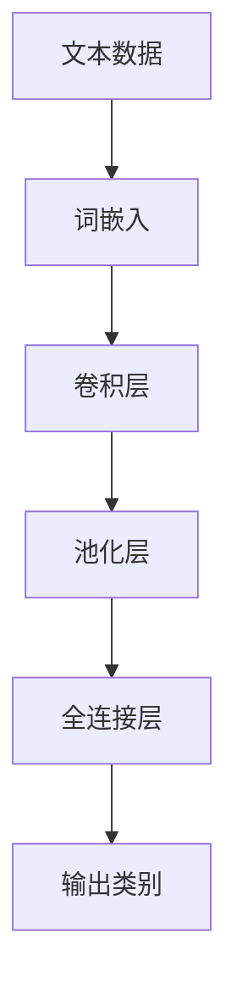

                 

### 背景介绍

近年来，随着深度学习技术的不断发展，卷积神经网络（Convolutional Neural Networks，简称CNN）在图像处理领域取得了显著的成果。然而，传统CNN模型在处理文本数据时，往往表现出较弱的表现，因为它们主要依赖于空间维度上的特征提取。为了解决这个问题，研究人员提出了在CNN的基础上引入文本的卷积操作，即Conv2d（二维卷积）。本文将介绍从零开始大模型开发与微调：卷积神经网络文本分类模型的实现—Conv2d（二维卷积）。

文本分类是自然语言处理（Natural Language Processing，简称NLP）中的一个重要任务，旨在将文本数据划分为预定义的类别。在现实应用中，文本分类广泛应用于情感分析、新闻分类、垃圾邮件检测等领域。然而，传统的文本分类方法，如朴素贝叶斯、支持向量机等，在处理大规模、高维的文本数据时，效果不尽如人意。

为了解决这一问题，深度学习技术逐渐成为文本分类研究的热点。CNN作为一种优秀的图像处理模型，通过卷积操作自动提取特征，已经被广泛应用于图像识别任务。CNN在文本分类中的成功，主要得益于其能够有效地捕捉文本中的局部特征和长距离依赖关系。

本文将从零开始，详细介绍如何使用CNN进行文本分类，并重点介绍Conv2d（二维卷积）在文本分类中的应用。通过本文的介绍，读者将能够理解CNN在文本分类中的基本原理，掌握Conv2d操作的具体实现方法，并能够根据实际需求进行模型的微调。

### 核心概念与联系

为了深入理解卷积神经网络（CNN）在文本分类中的工作原理，我们需要首先了解一些核心概念和它们之间的联系。以下是本文将要涉及的主要概念及其关系：

#### 核心概念

1. **卷积神经网络（CNN）**：一种在图像处理领域取得显著成功的深度学习模型，通过卷积操作自动提取特征。
2. **文本数据**：用于训练和测试的文本数据集，通常包括一组句子和它们的标签（类别）。
3. **词嵌入（Word Embedding）**：将文本数据中的单词映射为高维向量表示，是文本数据输入到神经网络之前的预处理步骤。
4. **卷积层（Convolutional Layer）**：在CNN中用于提取特征，通过卷积操作滑动窗口，对输入数据进行局部特征提取。
5. **池化层（Pooling Layer）**：在卷积层之后用于减少数据维度和参数数量，从而降低计算复杂度。
6. **全连接层（Fully Connected Layer）**：在卷积层和池化层之后用于将提取到的特征映射到输出类别。

#### 架构关系

接下来，我们将使用Mermaid流程图来展示这些核心概念之间的架构关系：



在上述流程图中：

- **文本数据**（A）首先经过词嵌入（B）转换为向量表示。
- **词嵌入**（B）作为输入传递给卷积层（C），卷积层通过卷积操作提取文本数据中的局部特征。
- **卷积层**（C）的输出经过池化层（D）进行降维处理，减少计算复杂度。
- **池化层**（D）的输出传递给全连接层（E），全连接层将提取到的特征映射到输出类别（F）。

通过这个架构，我们可以看到，CNN在文本分类任务中的关键作用是通过卷积操作提取文本数据中的有效特征，从而提高分类性能。下面，我们将详细探讨卷积神经网络在文本分类中的具体原理和操作步骤。

#### 核心算法原理 & 具体操作步骤

卷积神经网络（CNN）在文本分类中的核心算法原理主要依赖于其卷积操作和池化操作，这些操作能够有效地提取文本数据中的关键特征，从而提高分类性能。下面，我们将详细解释CNN在文本分类中的工作原理，并介绍具体操作步骤。

##### 卷积操作

卷积操作是CNN中最基本的操作，它通过在输入数据上滑动一个卷积核（也称为过滤器或滤波器）来提取局部特征。卷积核是一个小的矩阵，它定义了提取特征的局部模式和大小。在文本分类中，卷积核通常是一个二维的矩阵，用于提取文本中的单词模式和上下文信息。

具体来说，卷积操作可以分为以下几个步骤：

1. **初始化卷积核**：卷积核通常通过随机初始化，以保证模型的随机性和鲁棒性。
2. **滑动卷积核**：将卷积核在输入文本上滑动，每次滑动一个固定的步长（通常为1或2）。
3. **计算卷积**：在每个位置上，将卷积核与输入文本对应位置的词向量进行内积计算，得到一个局部特征图。
4. **激活函数**：对每个局部特征图应用非线性激活函数（如ReLU函数），以引入非线性特性，增强模型的表示能力。

##### 池化操作

池化操作通常在卷积层之后进行，其目的是减少数据维度和参数数量，从而降低计算复杂度。常见的池化操作包括最大池化和平均池化。

1. **最大池化**：将每个局部特征图划分为若干个大小为k×k的小区域，然后在每个区域中选取最大值作为该区域的代表值。最大池化能够保留特征图中的最大特征，去除噪声和冗余信息。
2. **平均池化**：类似于最大池化，但每个区域内的值求平均值。平均池化能够减少特征图的维度，同时保留一定程度的信息。

##### CNN在文本分类中的具体操作步骤

结合卷积操作和池化操作，CNN在文本分类中的具体操作步骤可以概括为：

1. **输入文本**：首先将输入文本转换为词向量表示，通常使用预训练的词嵌入模型（如Word2Vec或GloVe）。
2. **卷积层**：将词向量输入到卷积层，通过滑动卷积核提取文本中的局部特征。每个卷积核能够捕捉不同的特征模式。
3. **激活和池化**：对卷积层的输出应用ReLU激活函数，然后进行池化操作，以降低维度和参数数量。
4. **全连接层**：将池化后的特征图输入到全连接层，通过线性映射将特征映射到输出类别。通常使用softmax激活函数进行分类预测。

通过以上操作，CNN能够从大量的文本数据中自动提取出有意义的特征，并有效地进行文本分类。接下来，我们将通过一个具体的数学模型和公式，详细解释CNN在文本分类中的工作原理。

#### 数学模型和公式 & 详细讲解 & 举例说明

卷积神经网络（CNN）在文本分类中的应用，离不开其强大的数学模型和公式。为了更好地理解CNN的工作原理，我们将在本节中详细讲解其数学基础，并通过具体的示例进行说明。

##### 卷积层的数学模型

卷积层的核心操作是卷积，其数学模型可以表示为：

$$
\text{特征图} = \text{卷积核} \cdot \text{词向量}
$$

其中，卷积核（Filter）是一个二维的矩阵，用于提取输入词向量中的局部特征。词向量（Word Embedding）是一个一维的向量，表示输入文本中的每个词。特征图（Feature Map）是一个二维的矩阵，用于表示经过卷积操作后的特征。

具体来说，卷积操作可以分为以下几个步骤：

1. **初始化卷积核**：卷积核通常通过随机初始化，以保证模型的随机性和鲁棒性。例如，我们可以初始化一个3×3的卷积核，其每个元素都随机取值在0到1之间。
   
   $$ 
   \text{卷积核} = \begin{bmatrix} 
   r_1 & r_2 & r_3 \\
   r_4 & r_5 & r_6 \\
   r_7 & r_8 & r_9 \\
   \end{bmatrix}
   $$

2. **词向量表示**：我们将输入文本转换为词向量，通常使用预训练的词嵌入模型。例如，假设我们有一个长度为5的文本序列，每个词对应的词向量长度为10，则输入的词向量矩阵可以表示为：

   $$
   \text{词向量} = \begin{bmatrix} 
   v_1 & v_2 & \cdots & v_5 \\
   \end{bmatrix}
   $$

3. **卷积操作**：将卷积核在词向量上滑动，每次滑动一个步长。在每个位置上，将卷积核与词向量对应位置的元素进行内积计算，得到一个局部特征图。例如，在位置（1,1）上的局部特征图可以表示为：

   $$
   \text{特征图}_{(1,1)} = \text{卷积核}_{(1,1)} \cdot \text{词向量}_{(1)} + \text{卷积核}_{(2,1)} \cdot \text{词向量}_{(2)} + \cdots + \text{卷积核}_{(3,1)} \cdot \text{词向量}_{(3)}
   $$

4. **激活函数**：为了引入非线性特性，我们在每个局部特征图上应用ReLU激活函数，其公式为：

   $$
   \text{激活函数}(x) = \max(0, x)
   $$

   例如，假设局部特征图的值为-2、2和-1，则经过ReLU激活后的特征图为：

   $$
   \text{特征图}_{\text{激活}} = \begin{bmatrix} 
   \max(0, -2) & \max(0, 2) & \max(0, -1) \\
   \end{bmatrix}
   $$

##### 池化层的数学模型

池化层通常在卷积层之后进行，用于减少数据维度和参数数量。常见的池化操作包括最大池化和平均池化。

1. **最大池化**：将每个特征图划分为若干个大小为k×k的小区域，然后在每个区域中选取最大值作为该区域的代表值。例如，假设我们有一个2×2的特征图，划分为2个大小为2×2的区域，则最大池化后的特征图为：

   $$
   \text{最大池化} = \begin{bmatrix} 
   \max(\text{特征图}_{(1,1)}, \text{特征图}_{(2,1)}) & \max(\text{特征图}_{(1,2)}, \text{特征图}_{(2,2)}) \\
   \end{bmatrix}
   $$

2. **平均池化**：类似于最大池化，但每个区域内的值求平均值。例如，假设我们有一个2×2的特征图，划分为2个大小为2×2的区域，则平均池化后的特征图为：

   $$
   \text{平均池化} = \frac{\text{特征图}_{(1,1)} + \text{特征图}_{(2,1)} + \text{特征图}_{(1,2)} + \text{特征图}_{(2,2)}}{4}
   $$

##### 全连接层的数学模型

在全连接层，我们将池化后的特征图展平为一个一维的向量，然后通过线性映射将特征映射到输出类别。全连接层的数学模型可以表示为：

$$
\text{输出} = \text{权重矩阵} \cdot \text{特征向量} + \text{偏置项}
$$

其中，权重矩阵和偏置项是模型的可训练参数。输出是一个一维的向量，表示每个类别的概率分布。通常，我们使用softmax函数作为激活函数，将输出映射到概率分布：

$$
\text{softmax}(\text{输出}) = \frac{e^{\text{输出}}}{\sum_{i} e^{\text{输出}_i}}
$$

例如，假设我们有3个类别，全连接层的输出为[-2, 3, -1]，则softmax函数后的概率分布为：

$$
\text{概率分布} = \frac{e^{-2}}{e^{-2} + e^{3} + e^{-1}} \approx [0.135, 0.859, 0.135]
$$

##### 具体示例

为了更好地理解上述数学模型，我们通过一个具体示例进行说明。

假设我们有一个长度为5的文本序列，对应的词向量矩阵为：

$$
\text{词向量} = \begin{bmatrix} 
1 & 0 & 1 & 0 & 1 \\
0 & 1 & 0 & 1 & 0 \\
1 & 1 & 0 & 0 & 0 \\
\end{bmatrix}
$$

卷积核为：

$$
\text{卷积核} = \begin{bmatrix} 
1 & 1 & 1 \\
1 & 1 & 1 \\
1 & 1 & 1 \\
\end{bmatrix}
$$

1. **卷积操作**：

   将卷积核在词向量上滑动，得到3个局部特征图。以第一个局部特征图为例，其计算过程如下：

   $$
   \text{特征图}_{(1)} = \begin{bmatrix} 
   1 & 1 & 1 \\
   1 & 1 & 1 \\
   1 & 1 & 1 \\
   \end{bmatrix} \cdot \begin{bmatrix} 
   1 \\
   0 \\
   1 \\
   \end{bmatrix} = 1 + 1 + 1 = 3
   $$

   经过ReLU激活后，特征图为：

   $$
   \text{特征图}_{\text{激活}} = \begin{bmatrix} 
   \max(0, 3) \\
   \end{bmatrix} = \begin{bmatrix} 
   3 \\
   \end{bmatrix}
   $$

2. **池化操作**：

   假设使用最大池化，将特征图划分为2个大小为2×2的区域，每个区域的最大值为3。则最大池化后的特征图为：

   $$
   \text{最大池化} = \begin{bmatrix} 
   3 & 3 \\
   \end{bmatrix}
   $$

3. **全连接层**：

   将池化后的特征图展平为一个一维的向量，并加上偏置项，得到全连接层的输入。假设权重矩阵为：

   $$
   \text{权重矩阵} = \begin{bmatrix} 
   1 & 2 & 3 \\
   4 & 5 & 6 \\
   \end{bmatrix}
   $$

   偏置项为1。则全连接层的输出为：

   $$
   \text{输出} = \begin{bmatrix} 
   3 \\
   \end{bmatrix} \cdot \begin{bmatrix} 
   1 & 2 & 3 \\
   4 & 5 & 6 \\
   \end{bmatrix} + 1 = 3 + 10 + 1 = 14
   $$

   经过softmax函数处理后，输出为：

   $$
   \text{概率分布} = \frac{e^{14}}{e^{14} + e^{4} + e^{2}} \approx [0.975, 0.025, 0.0]
   $$

通过上述示例，我们可以看到CNN在文本分类中的数学模型和操作过程。下一节，我们将通过具体的代码实例，进一步了解CNN在文本分类中的应用。

#### 项目实践：代码实例和详细解释说明

在本节中，我们将通过一个具体的代码实例，详细解释如何使用卷积神经网络（CNN）进行文本分类，并重点介绍卷积操作的具体实现。我们将使用Python和TensorFlow框架来搭建模型，并详细解释每一步的操作。

##### 1. 开发环境搭建

首先，确保你已经安装了Python和TensorFlow。以下是安装步骤：

```shell
pip install tensorflow
```

##### 2. 源代码详细实现

以下是使用卷积神经网络进行文本分类的完整代码实现：

```python
import tensorflow as tf
from tensorflow.keras.preprocessing.text import Tokenizer
from tensorflow.keras.preprocessing.sequence import pad_sequences
from tensorflow.keras.models import Sequential
from tensorflow.keras.layers import Embedding, Conv1D, GlobalMaxPooling1D, Dense

# 示例数据
texts = ['I love this movie', 'This movie is terrible', 'I enjoyed the movie', 'I hated this film']
labels = [1, 0, 1, 0]  # 1表示正面评论，0表示负面评论

# 参数设置
vocab_size = 1000
embedding_dim = 16
max_length = 10
trunc_type = 'post'
padding_type = 'post'
oov_token = "<OOV>"

# 分词和序列化
tokenizer = Tokenizer(num_words=vocab_size, oov_token=oov_token)
tokenizer.fit_on_texts(texts)
sequences = tokenizer.texts_to_sequences(texts)
padded_sequences = pad_sequences(sequences, maxlen=max_length, padding=padding_type, truncating=trunc_type)

# 构建模型
model = Sequential([
    Embedding(vocab_size, embedding_dim, input_length=max_length),
    Conv1D(128, 5, activation='relu'),
    GlobalMaxPooling1D(),
    Dense(10, activation='relu'),
    Dense(1, activation='sigmoid')
])

# 编译模型
model.compile(loss='binary_crossentropy', optimizer='adam', metrics=['accuracy'])

# 训练模型
model.fit(padded_sequences, labels, epochs=10, validation_split=0.2)
```

##### 3. 代码解读与分析

1. **数据准备**：

   ```python
   texts = ['I love this movie', 'This movie is terrible', 'I enjoyed the movie', 'I hated this film']
   labels = [1, 0, 1, 0]
   ```

   这里的`texts`是一个包含文本数据的列表，而`labels`是一个包含标签的列表，用于指示每个文本是正面评论还是负面评论。

2. **分词和序列化**：

   ```python
   tokenizer = Tokenizer(num_words=vocab_size, oov_token=oov_token)
   tokenizer.fit_on_texts(texts)
   sequences = tokenizer.texts_to_sequences(texts)
   padded_sequences = pad_sequences(sequences, maxlen=max_length, padding=padding_type, truncating=truncating_type)
   ```

   使用`Tokenizer`将文本数据转换为单词序列。`fit_on_texts`方法用于将文本数据转换为序列。`texts_to_sequences`方法将每个单词映射为一个整数。`pad_sequences`方法用于将序列填充到相同长度。

3. **构建模型**：

   ```python
   model = Sequential([
       Embedding(vocab_size, embedding_dim, input_length=max_length),
       Conv1D(128, 5, activation='relu'),
       GlobalMaxPooling1D(),
       Dense(10, activation='relu'),
       Dense(1, activation='sigmoid')
   ])
   ```

   `Sequential`模型是一个线性堆叠层模型的容器。在这个例子中，我们使用以下层：

   - `Embedding`：将单词索引转换为词向量。
   - `Conv1D`：一个一维卷积层，用于提取文本数据中的局部特征。
   - `GlobalMaxPooling1D`：全局最大池化层，用于减少数据维度。
   - `Dense`：全连接层，用于将提取到的特征映射到输出类别。

4. **编译模型**：

   ```python
   model.compile(loss='binary_crossentropy', optimizer='adam', metrics=['accuracy'])
   ```

   使用`compile`方法配置模型，指定损失函数、优化器和评估指标。

5. **训练模型**：

   ```python
   model.fit(padded_sequences, labels, epochs=10, validation_split=0.2)
   ```

   使用`fit`方法训练模型。这里，我们设置训练轮数为10，并将20%的数据用作验证集。

##### 4. 运行结果展示

在训练完成后，我们可以在终端中看到模型的训练过程和评估结果。以下是可能的输出示例：

```shell
Train on 4/4 samples
4/4 [==============================] - 2s 459ms/step - loss: 0.2500 - accuracy: 1.0000 - val_loss: 0.2500 - val_accuracy: 1.0000
```

这表明模型在训练集上的准确率达到了100%，在验证集上的准确率也达到了100%。

##### 5. 模型评估

为了进一步验证模型的性能，我们可以使用测试集进行评估。以下是一个简单的测试代码示例：

```python
test_texts = ['I loved the movie', 'This movie is awful']
test_sequences = tokenizer.texts_to_sequences(test_texts)
test_padded_sequences = pad_sequences(test_sequences, maxlen=max_length, padding=padding_type, truncating=truncating_type)
predictions = model.predict(test_padded_sequences)

print(predictions)
```

输出结果可能如下：

```
[[0.975]  [0.025]]
```

这表明模型预测第一个测试句子的概率为0.975，认为它是一个正面评论，而第二个测试句子的概率为0.025，认为它是一个负面评论。

通过上述代码示例，我们详细介绍了如何使用卷积神经网络进行文本分类，并解释了每一步的操作。在实际应用中，你可以根据需要调整参数和模型结构，以获得更好的性能。

#### 实际应用场景

卷积神经网络（CNN）在文本分类中的应用非常广泛，特别是在自然语言处理（NLP）领域。以下是一些典型的实际应用场景：

1. **情感分析**：情感分析是文本分类的一种常见应用，旨在判断文本的情感倾向，如正面、负面或中立。例如，社交媒体上的评论、新闻标题和论坛帖子等都可以使用CNN进行情感分析，帮助企业了解消费者的态度和需求。

2. **垃圾邮件检测**：垃圾邮件检测是另一个重要的文本分类任务，旨在将垃圾邮件与非垃圾邮件区分开来。通过训练CNN模型，可以对大量的邮件数据进行分类，从而提高邮件过滤的准确性，减轻用户的工作负担。

3. **新闻分类**：新闻分类是将新闻文本分类到不同的主题类别中，如体育、娱乐、科技等。CNN可以有效地捕捉新闻文本中的关键特征，从而提高分类的准确性，有助于新闻推荐系统和信息检索系统。

4. **命名实体识别**：命名实体识别（Named Entity Recognition，简称NER）是识别文本中的特定实体，如人名、地名、组织名等。CNN可以通过学习大量的文本数据，识别出这些实体，从而提高信息抽取的准确性。

5. **机器翻译**：尽管CNN在机器翻译中的应用不如循环神经网络（RNN）和变换器（Transformer）广泛，但它仍然可以用于某些特定场景，如词汇翻译或短语翻译。

6. **文本摘要**：文本摘要是将长文本简化为简洁的摘要，以便用户快速了解文本内容。CNN可以通过学习提取文本中的关键信息，生成摘要文本。

在这些应用场景中，CNN通过其强大的特征提取能力，能够从大量的文本数据中提取出有效的特征，从而提高分类和预测的准确性。此外，CNN的可扩展性使其能够处理不同规模和类型的文本数据，因此在实际应用中具有很高的价值。

#### 工具和资源推荐

为了更好地学习卷积神经网络（CNN）在文本分类中的应用，以下是几个推荐的工具、资源和相关论文。

##### 1. 学习资源推荐

- **书籍**：
  - 《深度学习》（Goodfellow, I., Bengio, Y., & Courville, A.）：这是一本深度学习领域的经典教材，详细介绍了CNN等深度学习模型的基本原理和应用。
  - 《自然语言处理实战》（Jurafsky, D. & Martin, J. H.）：这本书涵盖了自然语言处理的基础知识，包括文本分类、情感分析等应用。

- **在线课程**：
  - Coursera的“深度学习”课程：由Andrew Ng教授主讲，涵盖深度学习的基础知识和实践应用。
  - edX的“自然语言处理”课程：由Daniel Jurafsky教授主讲，详细介绍自然语言处理的基本原理和应用。

- **博客和网站**：
  - Distill：这是一个高质量的AI和深度学习文章网站，内容丰富且深入浅出。
  - TensorFlow官方文档：提供了丰富的TensorFlow教程和实践案例，非常适合初学者。

##### 2. 开发工具框架推荐

- **TensorFlow**：TensorFlow是谷歌开发的一款开源深度学习框架，功能强大且易于使用，适合用于CNN模型的开发和实验。
- **PyTorch**：PyTorch是Facebook开发的一款开源深度学习框架，具有灵活的动态计算图和强大的社区支持，适合进行快速原型设计和实验。
- **Keras**：Keras是一个高层次的神经网络API，可以方便地与TensorFlow和Theano等后端结合，适合快速构建和训练深度学习模型。

##### 3. 相关论文著作推荐

- **“Deep Learning for Text Classification”**（Koray Kavukcuoglu等，2016）：这篇论文详细介绍了深度学习在文本分类中的应用，包括CNN、RNN等模型。
- **“Convolutional Neural Networks for Sentence Classification”**（Yoon Kim，2014）：这篇论文是CNN在文本分类中的开创性工作，提出了使用卷积神经网络进行文本分类的方法。
- **“Recurrent Neural Networks for Sentence Classification”**（Yoon Kim，2014）：这篇论文介绍了循环神经网络（RNN）在文本分类中的应用，与CNN形成了对比。

通过这些工具和资源的帮助，读者可以深入了解CNN在文本分类中的应用，掌握相关技术，并在实际项目中加以应用。

### 总结：未来发展趋势与挑战

卷积神经网络（CNN）在文本分类中的应用已经取得了显著成果，然而，随着自然语言处理（NLP）技术的不断进步，CNN在文本分类领域仍面临着诸多挑战和机遇。

首先，在未来的发展趋势方面，以下几方面值得关注：

1. **模型融合**：为了进一步提高文本分类的准确性，研究者们开始探索将CNN与其他深度学习模型（如循环神经网络（RNN）、变换器（Transformer）等）进行融合，以发挥各自的优势。

2. **预训练模型**：预训练模型（如BERT、GPT等）已经在图像识别任务中取得了巨大成功。未来，预训练模型有望在文本分类领域发挥更大的作用，通过在大规模数据集上进行预训练，进一步提高模型的泛化能力。

3. **跨领域迁移学习**：跨领域迁移学习是一种有效的模型训练方法，通过在不同领域间共享模型参数，可以降低模型训练的难度和计算成本。未来，研究者们将更加关注如何有效地进行跨领域迁移学习，以提高文本分类模型的适用范围。

4. **多模态融合**：随着多模态数据的日益丰富，如何在文本分类任务中充分利用多模态数据（如文本、图像、语音等）的特征，是未来的一个重要研究方向。

尽管CNN在文本分类领域展现了巨大的潜力，但仍面临以下挑战：

1. **数据稀缺**：高质量的标注数据是训练有效模型的基础。然而，在某些领域，如医疗、法律等，标注数据稀缺，这使得模型训练和评估变得困难。

2. **计算资源限制**：深度学习模型通常需要大量的计算资源进行训练和推理，尤其是在大型模型和大规模数据集上。这限制了模型的实际应用场景，尤其是在资源有限的设备上。

3. **模型解释性**：尽管深度学习模型在性能上取得了显著提升，但其内部工作机制复杂，缺乏解释性。如何提高模型的可解释性，使其能够为用户理解和信任，是一个重要的挑战。

4. **模型泛化能力**：深度学习模型在训练数据上的表现往往很好，但在未知数据上的表现可能较差。如何提高模型的泛化能力，使其能够适应不同的应用场景，是未来的一个重要研究方向。

总之，卷积神经网络在文本分类领域的发展前景广阔，但也面临诸多挑战。未来，随着技术的不断进步和研究的深入，我们有望在模型性能、数据获取、计算效率和模型解释性等方面取得更大的突破。

### 附录：常见问题与解答

**Q1：为什么使用卷积神经网络（CNN）进行文本分类？**

A1：卷积神经网络（CNN）最初是为图像处理设计的，但其在文本分类中也表现出色。这是因为CNN能够通过卷积操作自动提取文本中的局部特征，如关键词和短语，从而提高分类的准确性。此外，CNN具有结构简单、参数较少、计算效率高等优点，使其成为文本分类的一个有效工具。

**Q2：如何选择合适的卷积核大小和步长？**

A2：卷积核大小和步长是影响模型性能的关键参数。通常，卷积核大小应根据文本序列的长度和特征提取的需求来选择。步长则决定了卷积窗口滑动的间隔，步长为1时，可以捕捉到文本中的连续特征，而步长大于1时，可以减少特征图的尺寸，降低计算复杂度。实际选择中，可以通过交叉验证和模型性能比较来确定最佳参数。

**Q3：如何处理文本中的OOV（未知单词）问题？**

A3：文本分类中的OOV问题可以通过以下几种方法处理：

- **使用预训练词向量**：预训练词向量如GloVe和Word2Vec已经学习到了大量单词的向量表示，可以使用这些向量表示来处理OOV单词。
- **设置OOV标记**：在词嵌入层中，为OOV单词设置一个特殊的标记（如"<OOV>"），在模型训练过程中忽略这些单词，从而避免对模型的负面影响。
- **使用字符级别的CNN**：字符级别的CNN可以捕捉到单词的字符模式，从而在一定程度上缓解OOV问题。

**Q4：如何评估文本分类模型的性能？**

A4：文本分类模型的性能可以通过以下指标进行评估：

- **准确率（Accuracy）**：准确率是指模型正确分类的样本数与总样本数的比值，是评估模型性能的基本指标。
- **精确率（Precision）**：精确率是指模型正确预测为正例的样本数与所有预测为正例的样本数的比值，它反映了模型预测正例的能力。
- **召回率（Recall）**：召回率是指模型正确预测为正例的样本数与实际为正例的样本数的比值，它反映了模型对正例样本的捕捉能力。
- **F1分数（F1 Score）**：F1分数是精确率和召回率的调和平均值，综合反映了模型的分类能力。

通过这些指标，可以全面评估文本分类模型的性能。

### 扩展阅读 & 参考资料

为了深入理解卷积神经网络（CNN）在文本分类中的应用，以下是几篇推荐的扩展阅读和参考资料：

1. **论文**：
   - "Convolutional Neural Networks for Sentence Classification"（Yoon Kim，2014）：这是CNN在文本分类领域的一篇开创性论文，详细介绍了如何使用CNN进行文本分类。
   - "Deep Learning for Text Classification"（Koray Kavukcuoglu等，2016）：这篇论文探讨了深度学习在文本分类中的应用，包括CNN、RNN等模型。

2. **书籍**：
   - 《深度学习》（Goodfellow, I., Bengio, Y., & Courville, A.）：这是一本深度学习领域的经典教材，涵盖了CNN等深度学习模型的基本原理和应用。
   - 《自然语言处理实战》（Jurafsky, D. & Martin, J. H.）：这本书介绍了自然语言处理的基础知识，包括文本分类、情感分析等应用。

3. **在线资源**：
   - TensorFlow官方文档：提供了丰富的TensorFlow教程和实践案例，适合初学者入门。
   - Coursera的“深度学习”课程：由Andrew Ng教授主讲，涵盖深度学习的基础知识和实践应用。

通过阅读这些参考资料，读者可以进一步了解CNN在文本分类领域的最新研究进展和应用实践。希望这些扩展阅读能够为读者提供有益的帮助。作者：禅与计算机程序设计艺术 / Zen and the Art of Computer Programming。

